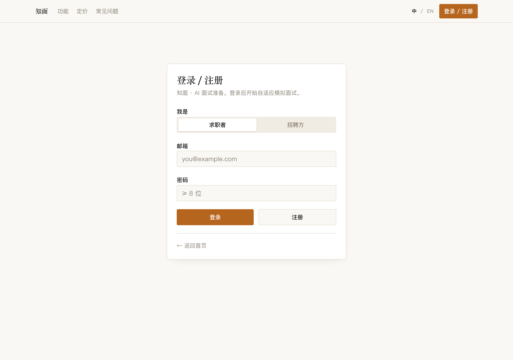
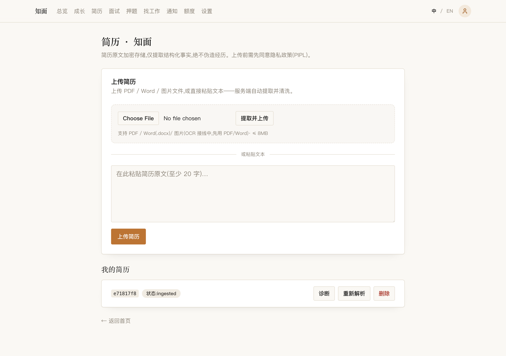
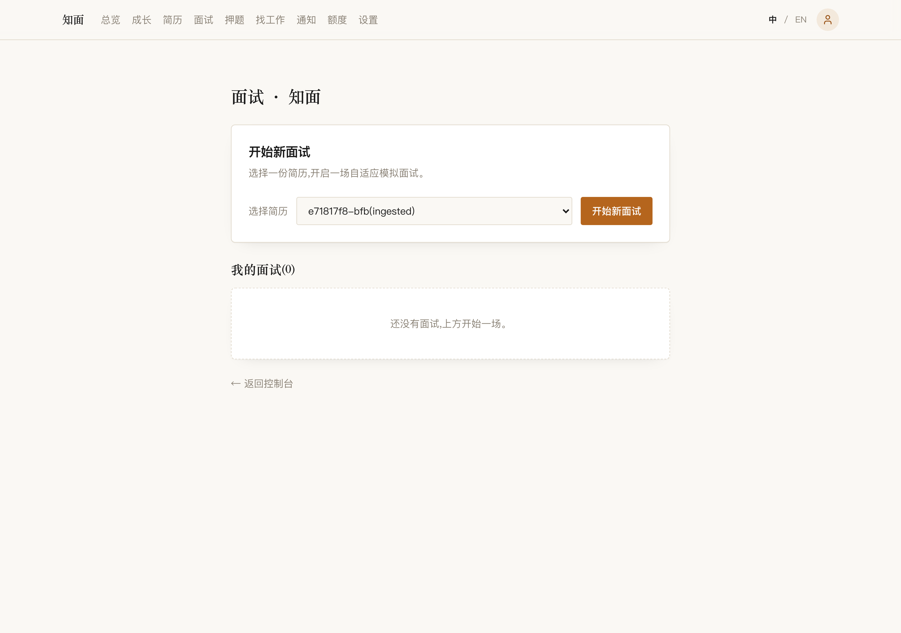
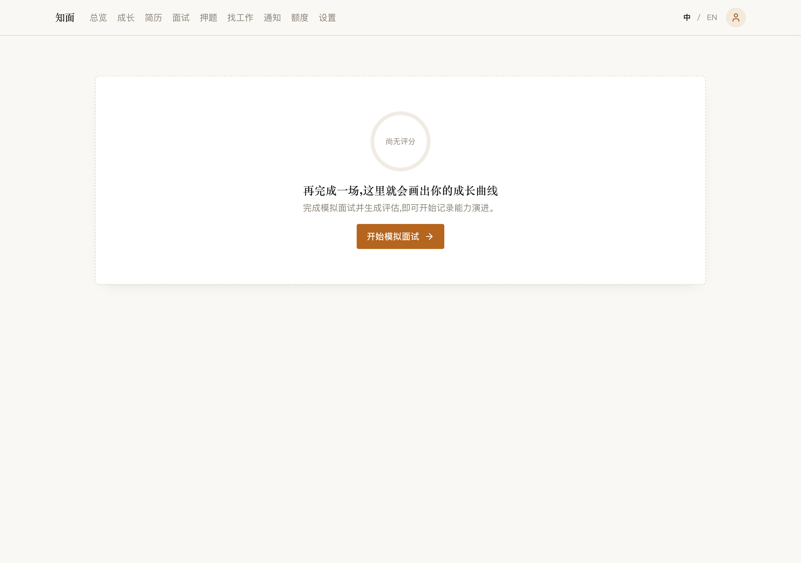
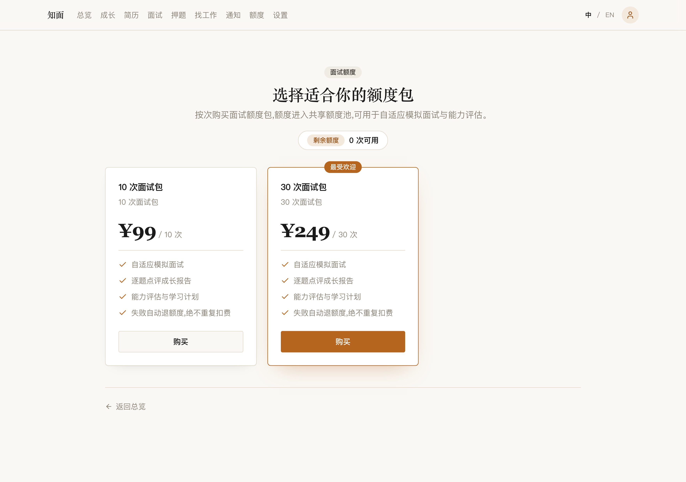
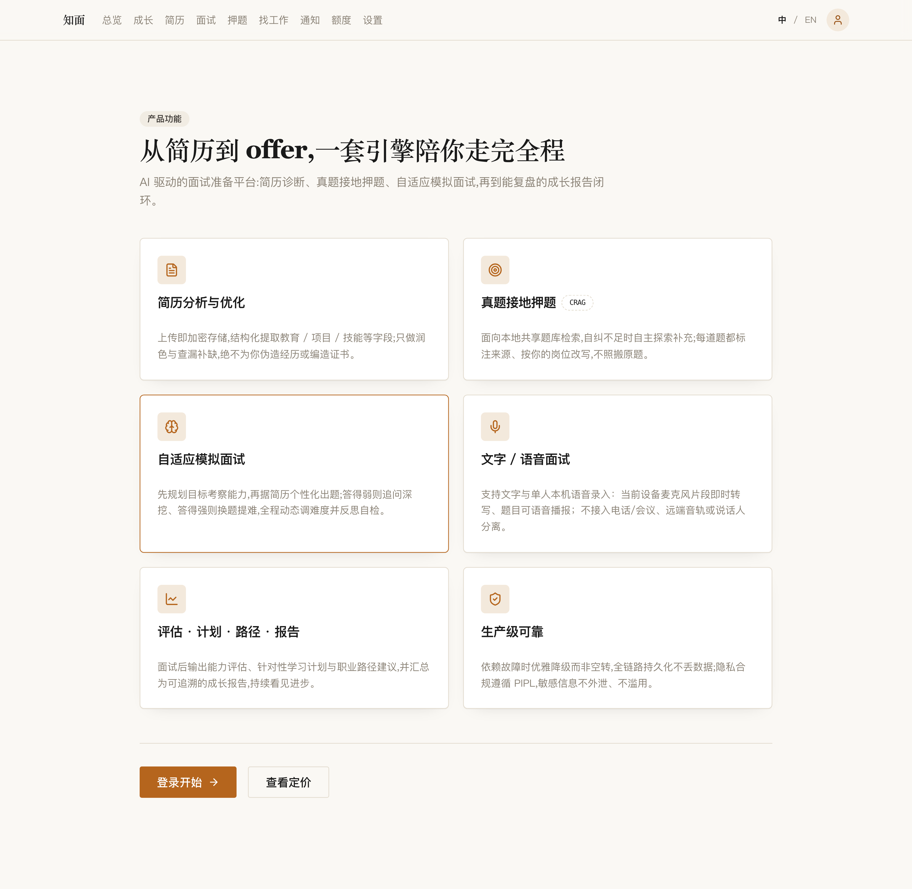

# Meetwise · 知面

> **把「面试准备」做成一段可复盘的成长过程。** 一个从真实经历出发的 AI 面试平台——面试官是一个**自适应 Agent**，不是套壳模板；全链路可观测、可恢复、可证明。

[查看源码](https://github.com/miaole/meetwise) · [项目导航](https://miaole.github.io/meetwise/)

---

## 一句话

上传简历 → AI 把真实经历整理成可练习的素材 → 模拟面试逐题给反馈 → 练后沉淀成成长曲线。面向 C 端求职者，另附招聘方（B 端）发布岗位、候选人投递与人才库视角。

它**不**提供编造经历、夸大资历、代答或规避核验的能力，也不承诺面试、录用或 offer 结果。

---

## 为什么值得看

这不是一个「调一下 LLM API」的 demo。承重件是三个东西：

### 1. 面试官是 Agent，不是 prompt 链

- **自适应路由 + 工具调用**：`resume-quiz` / `mock-interview` / `career-path` / `report` 四张 LangGraph 图，按输入动态分流到轻量路由或深度 Agent（`ai-docs/architecture/ai/agent-runtime.md`、`langgraph-blueprint.md`）。
- **有界的 ReAct 工具循环**：模型决定调工具时，入参先过 zod 校验再执行；循环封顶 `maxSteps`，防无限烧钱。
- **结构化输出 + 双重校验**：所有模型输出先过 schema、再过业务校验（题数、分值域、枚举合法性、不幻觉简历事实），才进入业务逻辑。schema 失败 → 重试 / 降级 / 可解释报错，绝不裸解析 JSON。
- **可恢复的长会话**：`threadId = interviewResult.resultId`；检查点持久化到 **Postgres**，等待用户输入表达为持久化状态——**没有内存 session map**，多实例安全、可断点续答。
- **前端消费业务事件，不消费模型 token**：SSE 只推 `progress` / `question_ready` / `waiting_user` / `answer_evaluated` / `report_ready` / `report_unavailable`；终态失败事件是强制的，UI 优雅降级、绝不空转。

> 每一个「为什么这么设计」都有 ADR 兜底：`ai-docs/architecture/adr/`（含 0015 自适应 Agent 架构、0016 RAG 语料版本控制等）。

### 2. 生产高可用是目标，不是口号

- **零数据丢失**：权益结算走真实账本（`FOR UPDATE` + CAS 防超卖、FIFO-by-expiry 扣减、精确一次结算流水）；报告生成是隔离后台作业，**报告失败 ≠ 面试失败**（故障隔离 + 租约 + 隔离区 + 退避）。
- **优雅降级**：模型准入/断路器/并发槽单一权威（`packages/ai-runtime` 的模型出口），熔断打开时确定性拒绝、不产生任何 provider 外呼。
- **快速恢复**：每个有状态对象用显式 `status` 枚举（不是一堆布尔），状态迁移服务端重新校验；checkpoint 与账户删除走完整回执链路。

### 3. 每个承诺都可复现验证

八个门禁全绿，一键 `corepack pnpm <gate>` 跑：

```text
db:prove  runtime:prove  graph:prove  pipeline:prove  api:validate  api:smoke  arch  docs:check
```

另按模块沉淀几十套专项证明门禁：`commerce:prove`（44 断言）、`resume:prove`（24）、`report:prove`（25）、`web:prove`（27）、`e2e:prove`、`security:prove`、`privacy-erasure:prove`、`retrieval:prove`、`adaptive:prove` 等，覆盖支付不超卖、简历安全、报告故障隔离、真浏览器端到端、红队反操纵、删除回执、检索召回。

**禁止伪验收**：不能只断言 HTTP 200、不能只跑 happy path、不能用 mock 模型证明生产模型质量、不能 AI 自评自己的报告。

---

## 界面一览

> 截图使用合成账号与合成记录，仅展示交互与视觉设计；不代表线上服务已开放，也不构成能力认证。

### 桌面端

| 落地页 | 登录 / 注册 | 控制台 |
| --- | --- | --- |
|  |  |  |

| 简历隐私同意门 | 简历解析结果 | 面试列表 |
| --- | --- | --- |
|  |  |  |

| 能力成长曲线 | 定价 | 能力特性 |
| --- | --- | --- |
|  |  |  |

---

## 技术架构

```text
apps/
  web/        Next.js App Router（真 RSC + Server Actions + cookie 鉴权，PC/H5 响应式）
  api/        NestJS API、认证与应用服务
  worker/     异步任务、LangGraph 面试编排与后台处理
packages/
  contracts/  共享 zod4 契约（前后端同源，zod-openapi 生成多端契约）
  domain/     领域规则与显式状态机
  db/         迁移、约束、RLS 与数据库访问层
  ai-runtime/ 模型调用与可观测性（统一模型出口，唯一模型调用关口）
  ai-graphs/  LangGraph 图编排定义
  config/     配置基座
ai-docs/      产品、架构、用例、测试与运行时事实说明
preview-site/ GitHub Pages 项目导航
```

**技术栈**：Next.js App Router · NestJS · LangGraphJS · Postgres（+pgvector）· Redis · S3/MinIO。

几条承重的架构约束（不可妥协）：

- **Controller 不编排**，编排落在应用服务层；前后端由共享契约驱动，不做手写的、会漂移的 API 调用。
- **AI 图不直接改支付/权益**；图状态只承载运行态，业务事实落业务表。
- **用户内容一律进数据块**，绝不拼接进系统指令；**模型输出双重校验**后才进业务逻辑。
- **每个有状态对象用显式 status 枚举**，状态迁移服务端重新校验。
- **LangGraph 检查点持久化到 Postgres**，等待用户输入表达为持久化状态，不用内存 session map。

---

## 快速开始

```bash
pnpm docs:check     # 校验 ai-docs 结构 + 必需术语 + 公共文案策略
pnpm compose:demo   # 起演示基础设施栈（docker/compose.demo.yml）
pnpm compose:down   # 拆演示栈
docker compose -f docker/compose.dev.yml up   # 仅开发基础设施（Postgres+pgvector、Redis、MinIO、Mailhog）
```

完整运行时实现、已验证命令与阻断项，见 [当前运行时事实矩阵](ai-docs/architecture/current-runtime-truth.md)；后续推进按 [执行清单](ai-docs/delivery/execution-master-checklist.md)。

---

## 当前能力边界

GitHub Pages 只发布项目导航与源码入口，不是已经部署的在线服务，不启动本地数据面服务，也不代理 API、认证、SSE 或任何用户数据。完整应用运行时仍在受控建设与验证中，以下能力不因界面存在即视为可用服务：

- 支付、购买、退款或自动扣费；
- 完整删除、撤回同意与跨存储删除回执；
- 用于招聘、资格、教育评价等有重大影响的数值评分；
- 需要真实用户数据的 OCR、语音、长期记忆和跨会话召回；
- 已发布的云端数据面、性能或端到端运行证明。

因此，请勿向预览环境提交真实简历、真实身份信息、录音、密钥或其他需要删除保证的内容。

---

## 文案与安全原则

- 只协助梳理真实经历，不编造、不夸大、不代答。
- 练习反馈不等于能力认证，不用于自动招聘决策。
- 未完成完整删除闭环前，不把删除或撤回描述为可用服务。
- 不把本地验证、静态检查或设计文档写成发布证据。
- 不提交真实密钥、真实简历、录音或其他敏感资料。

---

## 许可证

[MIT](LICENSE)
