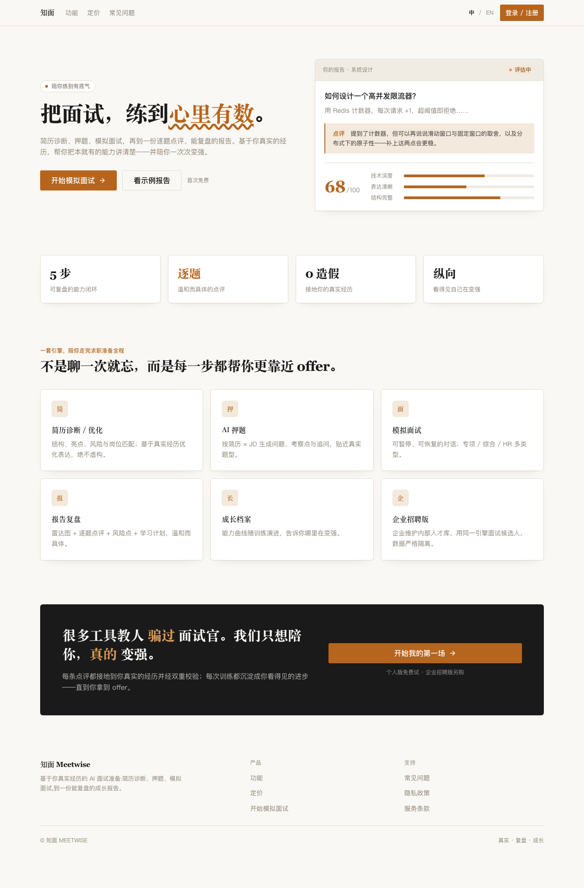
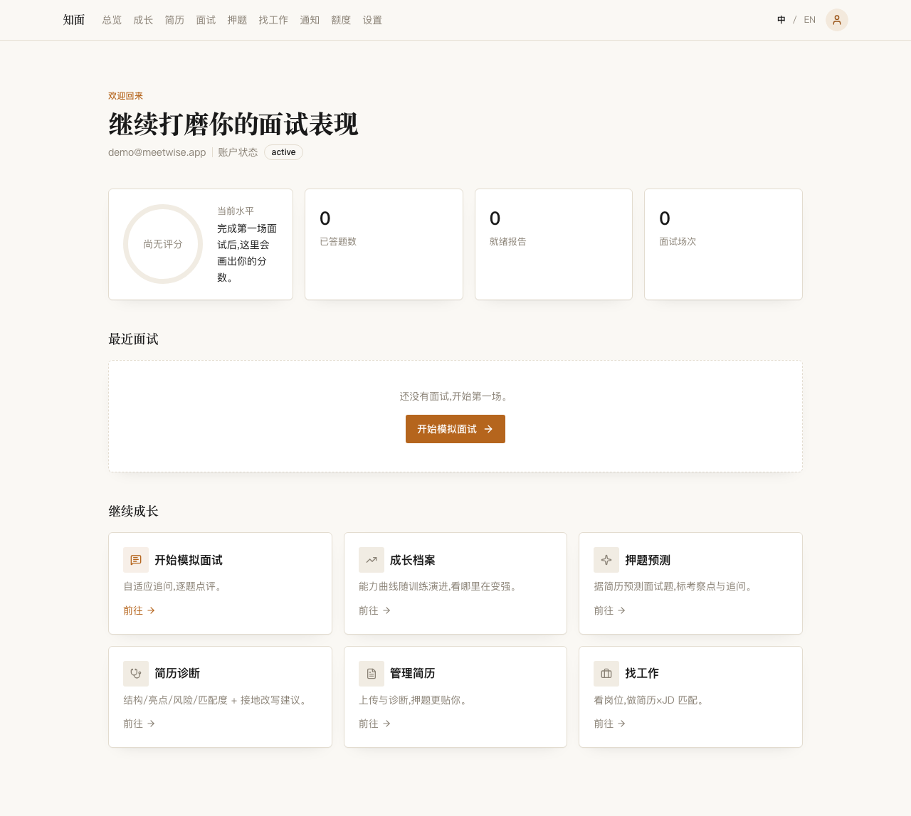
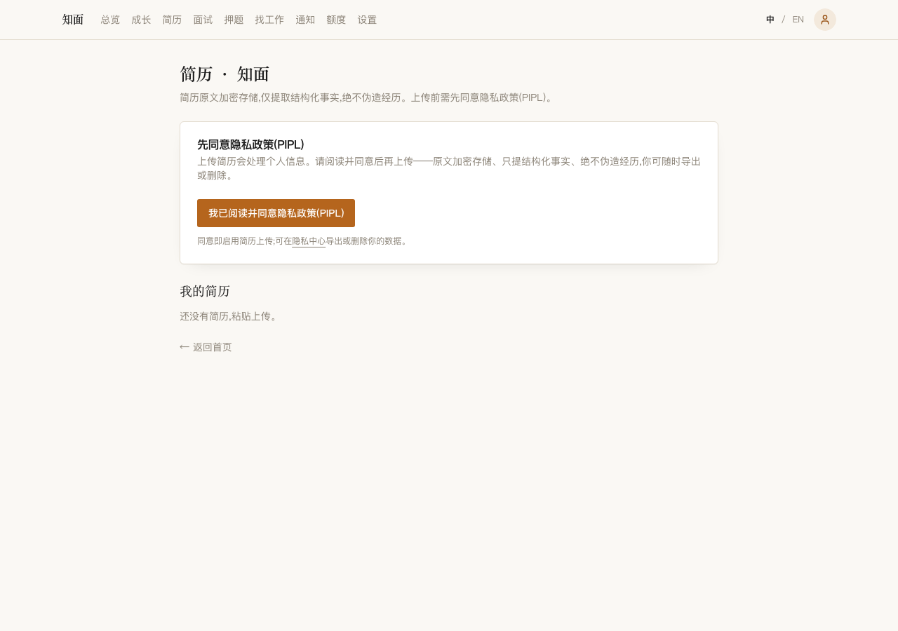
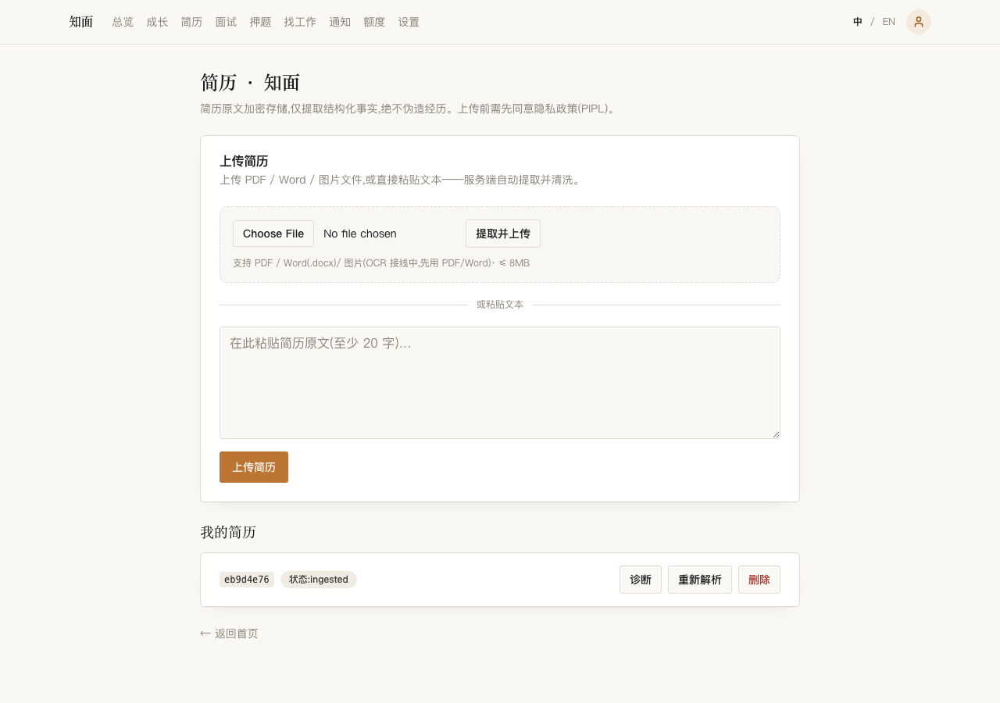
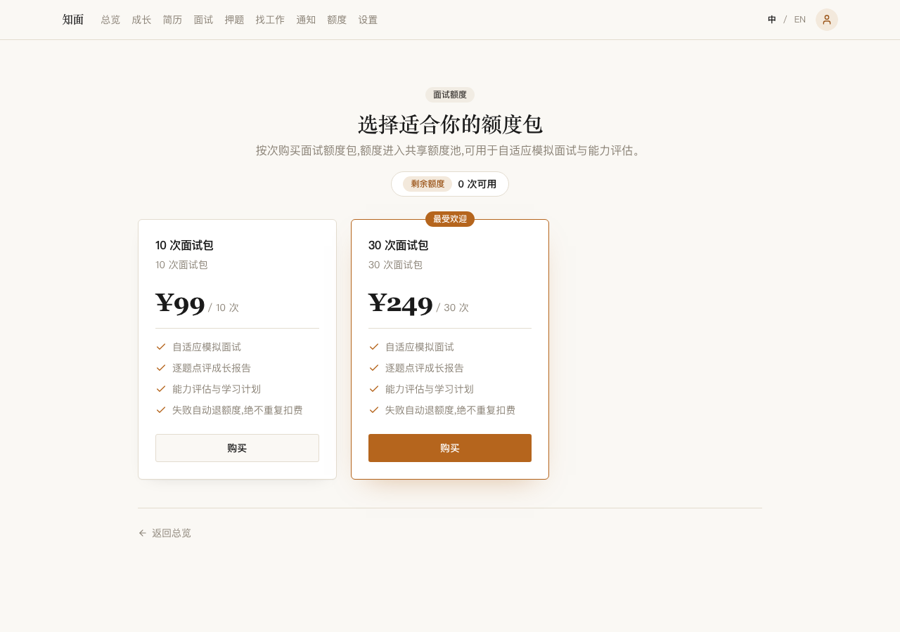
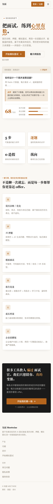
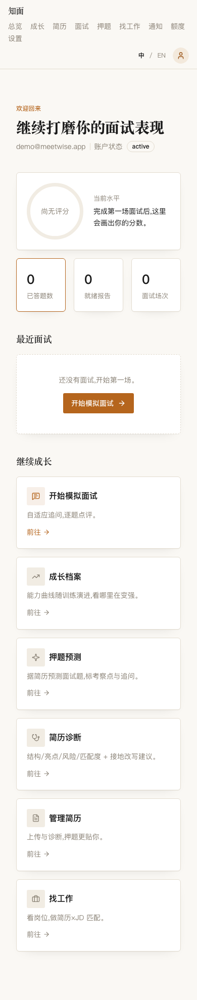

# Meetwise · 知面

> 基于你**真实经历**的 AI 面试准备平台:简历诊断 → 押题 → 自适应模拟面试 → 逐题点评与可复盘报告,并延伸到岗位匹配、能力差距、职业路径与长期成长档案。**绝不教人伪造经历——只陪你把本就有的能力讲清楚,一次次变强。**

Meetwise(中文名「知面」)以**面试训练**为中心,把求职准备做成一条可复盘、可成长的闭环。它同时面向 C 端求职者(练面试)与 B 端招聘方(同一引擎面候选人、维护内部人才库,数据严格多租户隔离)。

<p align="center">
  
</p>

---

## 目录

- [产品一览(截图)](#产品一览截图)
- [这个项目在工程上讲什么](#这个项目在工程上讲什么)
- [Agent 架构:自适应面试引擎](#agent-架构自适应面试引擎)
- [承重工程承诺](#承重工程承诺)
- [技术栈与仓库结构](#技术栈与仓库结构)
- [可复现的验证门(gates)](#可复现的验证门gates)
- [本地快速开始](#本地快速开始)
- [测试姿态](#测试姿态)
- [隐私与安全底线](#隐私与安全底线)
- [许可证](#许可证)

---

## 产品一览(截图)

截图由 `scripts/capture-screenshots.mjs` 起真实全栈后用 Playwright 自动采集,**只用演示数据(假邮箱 + 通用简历文本),不含任何真实个人信息**。

| 落地页 | 仪表盘 | 简历 · PIPL 同意门 |
|---|---|---|
|  |  |  |

| 简历 · 已摄取 | 定价 | 能力/特性 |
|---|---|---|
|  |  |  |

移动端 H5(同一套鉴权/路由在真实移动视口跑通):

<p align="center">
  
  &nbsp;&nbsp;
  
</p>

---

## 这个项目在工程上讲什么

面试准备类产品最容易做成「聊一次就忘」的一次性对话。Meetwise 把它做成**有状态、可恢复、可复盘、可 gate**的工程系统,核心难点全部落在四件事上:

1. **长会话的持久化编排** —— 一场模拟面试是可暂停、可续答的长会话,运行态必须能扛进程重启和多实例,不能靠内存里的会话对象。
2. **前后端不漂移的契约** —— 前端、后端、多端由同一份 schema 驱动,接口不靠手写、不各写各的。
3. **模型输出的双重校验** —— 任何模型产出进业务前先过 schema、再过业务校验(题目数、分数域、枚举合法、不虚构简历事实),坏输出可解释地降级,不裸 `JSON.parse`。
4. **钱和权益的精确一致** —— 计费、扣额、结算走 exactly-once 的 saga,不超卖、不双扣、失败退费,业务事实落业务表 + 显式状态机。

这些不是加分项,是这个系统能不能上生产的**承重结构**。下面每一条都在代码里,并有可复现的验证门守着。

---

## Agent 架构:自适应面试引擎

面试官不应该照着固定题单念题。Meetwise 的模拟面试是一个跑在 **LangGraph + Postgres checkpointer** 上的自适应循环,所有对模型的调用收敛到唯一的 `invoke` 关口(持有事务级 advisory 锁、双重校验、幂等 trace):

```
规划官(定考察能力)
   → 能力模型决策(追问 / 换题 / 调难度 / 收尾,由置信度 + 探尽度驱动,有预算硬上限保证收敛)
   → CRAG 自纠检索(本地召回够好用本地;不够则自主 web 探索,不押死单一检索)
   → 接地出题(个性化于简历、标注来源、去重、对齐能力,绝不照搬题库)
   → 反思自检
   → 角色拆分(规划/出题/评分各自 invoke + prompt,动静分离)
   → 报告走舱壁(报告失败 ≠ 面试失败,失败隔离)
```

关键设计:

- **`threadId = interviewResult.resultId`**:业务侧 camelCase,进 LangGraph 时作为 `thread_id` 传入 `configurable`。
- **等待用户输入 = 持久化状态**(interrupt / 显式 `waiting_user`),不是一条内存里的连接。续答用同一 `threadId`,进程重启/多实例都能接上。
- **前端消费的是业务事件 SSE,不是模型 token**(`progress` / `question_ready` / `waiting_user` / `answer_evaluated` / `report_ready` / `report_unavailable` …)。终态失败事件是强制的,UI 优雅降级,**没有转圈死胡同**。
- **图内绝不直接动钱/权益**:运行态在图 state,业务事实落业务表。

四张图:`resume-quiz`、`mock-interview`、`career-path`、`report`(报告作为子图/后台作业,永不阻塞面试主路径)。

---

## 承重工程承诺

| 承诺 | 怎么做 | 守着它的门 |
|---|---|---|
| 运行态全部持久、可恢复、多实例安全 | LangGraph Postgres checkpoint,无内存会话 Map | `adaptive-flow` / `interview` / `e2e` |
| 前后端契约不漂移 | `packages/contracts` 共享 zod4 + `zod-openapi` 生成 OpenAPI,ZodValidationPipe 双端校验 | `openapi` / `api:validate` |
| 模型输出双重校验 | schema 校验 → 业务校验(题数/分域/枚举/不虚构),失败重试或可解释降级 | `critique` / `grounded` / `adaptive-*` |
| 计费 exactly-once、不超卖 | 权益 saga:`FOR UPDATE` + CAS 不超卖、真结算账本、租约心跳、失败退费 | `commerce` / `e2e` |
| 报告失败隔离 | 报告三事务生命周期 + 租约 + 隔离 + 退避,报告挂了面试不挂 | `report` |
| 多租户隔离 | Postgres 行级安全(FORCE RLS,USING + WITH CHECK 双侧),越权 0 行 | `recruiter` / `security` / `e2e` |
| 隐私合规 | 上传前强制 PIPL 同意;简历原文加密存储;结构化画像只留脱敏事实 | `resume` / `security` |
| 状态机显式化 | 每个 state-bearing 对象用显式 status 枚举 + 服务端复核转移,不用布尔汤 | `status-machine` 规则 + 各域 prove |

---

## 技术栈与仓库结构

**Next.js App Router(RSC + Server Actions)· NestJS + Fastify · LangGraphJS + Postgres checkpointer · Postgres(+pgvector)· Redis · S3/MinIO**,模型侧接阿里百炼(qwen-plus 文本 / qwen-vl 视觉 OCR / qwen-audio 语音 ASR)。

```text
meetwise/
  apps/
    web/         # Next.js App Router:RSC 数据页 + Server Actions 变更 + cookie 鉴权 + SSR/SEO + PC/H5 响应式
    api/         # NestJS + Fastify:控制器薄、应用服务持事务边界;zod 双端校验;RLS as-principal
    worker/      # LangGraphJS 图执行 + 生命周期 + 队列消费 + reaper;运行态进 checkpointer
  packages/
    ai-graphs/   # 四张图(resume-quiz / mock-interview / career-path / report)
    ai-runtime/  # 模型调用唯一关口(invoke:advisory 锁 + 双校验 + 幂等 trace)+ CRAG/检索/评估指标
    contracts/   # 共享 zod4 schema + zod-openapi(多端契约的单一真相)
    db/          # 迁移 + 约束 + RLS + saga/ops;冷部署走迁移路径(有漂移门守)
    domain/      # 纯领域逻辑(鉴权、简历摄取/脱敏、自适应决策、评估派生)
    config/      # 共享配置
```

架构不变量(承重规则):**控制器不编排**(只调应用服务)· **AI 图不直接动权益**(权益在业务服务)· **所有用户内容在进模型前都是不可信输入**(进数据块,绝不拼进系统指令)· **所有模型输出进业务前双重校验**。

---

## 可复现的验证门(gates)

这个仓库的工程质量由一批**可复现、确定性**的验证门守着(不是「打开页面看一眼」式验收):

- **50+ 个 prove 门**:`db:prove` / `commerce:prove` / `resume:prove` / `report:prove` / `adaptive-flow:prove` / `security:prove` / `recruiter:prove` / `migrate:prove` / `drift:prove` … 各自起真栈/真图/真库跑,断言机制而非 HTTP 200。
- **582 条纯负路径测试**(`neg:all`):鉴权/会话伪造、状态机非法转移、越权(RLS/IDOR)、幂等重放、支付重放/超卖、畸形/边界/注入/对抗、兜底降级 —— **一条 happy-path 都没有**。分布在 `apps/api/test/neg-*.proof.ts`。
- **端到端全栈门**(`e2e:prove`):自启动 api+worker+web,真鉴权 → 简历 → 交易 → 真 agent 面试跑到 `report_ready` 终态 → B 端多租户与候选人多方 RLS 闭环,含异常/失败终态/无死胡同。
- **真浏览器 e2e**(Playwright,chromium + 移动视口):cookie 鉴权、middleware、上传全流程在真实浏览器里跑通。

```bash
corepack pnpm neg:all        # 582 条负路径
corepack pnpm e2e:prove      # 全栈端到端(自启动)
corepack pnpm drift:prove    # 迁移路径 == sql/ 真相,冷部署不缺列
corepack pnpm docs:check     # ai-docs 结构 + 术语 + 禁词扫描
```

---

## 本地快速开始

前置:Node ≥ 20、`corepack`(pnpm)、Docker。

```bash
# 1) 安装依赖
corepack pnpm install

# 2) 起本地基础设施(Postgres+pgvector、Redis、MinIO、Mailhog)
corepack pnpm db:up
#   或完整开发栈:docker compose -f docker/compose.dev.yml up -d

# 3) 准备环境变量(从示例拷贝后按需填;绝不提交真实 .env)
cp docker/env/api.env.example .env     # 按需填模型 key 等;不填也能用 fake 模型跑通结构

# 4) 一键起全栈(api:8787 + worker + web:3100)
#    worker 首启会自动应用迁移建全量 schema(WORKER_BOOTSTRAP=1)
bash scripts/dev-up.sh
```

起好后:web 在 `http://localhost:3100`,api 在 `http://localhost:8787`(OpenAPI:`/openapi.json`)。

> 冷启动建库走**迁移路径**(`packages/db/migrations`),由 worker bootstrap 自动应用;`migrate:prove` 与 `drift:prove` 保证「从零迁移」与「迁移 == sql/ 真相」两条不变量,fresh deploy 不缺列/约束。

采集 README 截图(可选,需 web 已 `pnpm -C apps/web build`):

```bash
node scripts/capture-screenshots.mjs   # 起真栈 + 重置演示用户 → Playwright 截图到 docs/screenshots/
```

---

## 测试姿态

分层:单元 · 契约(共享 zod4)· 集成(Supertest + Testcontainers)· 图(确定性 fixture + fake 模型)· e2e(Playwright)· ai-eval(golden 任务)。

**明令禁止的假验收**:只断言 HTTP 200 · 打开页面不跑流程 · 用 mock 模型证明生产模型质量 · AI 给自己的报告打分 · 只测 happy-path 跳过失败退费与重复请求。负路径(`neg:*`)与端到端(`e2e:prove`)就是对这条的兜底。

---

## 隐私与安全底线

- **绝不伪造经历**:只结构化、只提炼你真实写下的事实;职业建议保留不确定性与你的最终决定权。
- **PII 永不进日志**:简历全文、用户答案、身份证/手机号/邮箱、密钥/令牌/支付密钥、完整模型 prompt 一律不落日志。
- **简历原文加密存储**,结构化画像只留脱敏事实;上传前强制 PIPL 采集同意,可随时导出或删除。
- **仓库不含任何真实密钥/真实简历/录音**,只提交 `*.env.example`。

---

## 许可证

[MIT](LICENSE) © Meetwise
