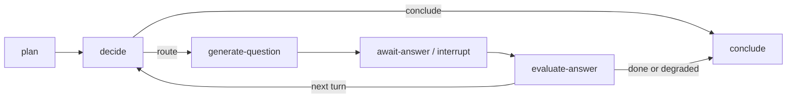

# Agent 图模块布局

## 已落地布局

`packages/ai-graphs/src/adaptive-interview/` 是当前可恢复训练 Agent 的唯一实现目录：

```text
adaptive-interview/
  state.ts                 # 状态字段、reducer、依赖契约与公共类型
  nodes/
    plan.ts                # 初始化能力目标；画像原文不进入图状态
    decide.ts              # 纯策略路由
    generate-question.ts   # 检索、生成与题目自检；写入 pending
    await-answer.ts        # 仅 interrupt；恢复时不调用模型
    evaluate-answer.ts     # 评分、澄清、未评分降级与状态投影
    conclude.ts            # 终态标记
  graph.ts                 # 唯一装配点：边、条件分支、checkpointer
  index.ts                 # 目录公共导出
```

旧的 `src/adaptive-interview.ts` 只保留兼容导出。业务调用统一从 `@meetwise/ai-graphs` 导入，不能绕过图直接调用节点。

## 状态和副作用边界



- `generate-question` 是生成副作用的唯一节点，必须先把 `PendingQuestion` 写入可恢复状态。
- `await-answer` 不得有模型、网络、计费或写库副作用；LangGraph 恢复会从该节点起始处重新执行。
- `evaluate-answer` 必须清除 `pending/submitted`，并将供应商或评分故障标记为 `unscored`，不能伪造业务分数。
- 图状态只保留路由与审计最小投影。业务事实、扣点、答案原文和权限判断由图外的事务性 ledger、outbox 和访问控制负责。

## 新增图或子图的准入规则

1. 先确定角色边界：一个目录只对应一个可独立解释的业务角色或子图。
2. 先在 `state.ts` 定义可持久化字段、reducer、敏感字段策略和版本语义。
3. 单个节点只承担一种副作用边界；可重放节点不能混入不可幂等操作。
4. `graph.ts` 只定义连接关系与依赖装配，不内联业务策略或模型提示词。
5. 节点间调用只通过显式状态和依赖契约；跨子图写业务事实必须经过图外服务。
6. 每次结构迁移至少运行图恢复证明、异常序列证明和依赖边界检查，并以独立 Git 提交保存。

## 当前边界

仓库**已有**受限的内部检索 skills：`rag.retrieve`、`web.explore`，以及在注入依赖和预算允许时启用的 `deep.research`；它们由确定性分支调用，均是只读、allowlist（允许列表）和单 job 预算受限的能力，**不是**可由模型任意挑选工具的通用 Tool Loop（工具循环），也不是独立的 deep-research 子图。`customer-service` 子图尚未实现。任何独立子图仍必须先具备产品需求、状态机、接口契约、评测集和运行预算，不能为满足目录形式创建空目录。详见 [运行时事实矩阵](../current-runtime-truth.md)。
