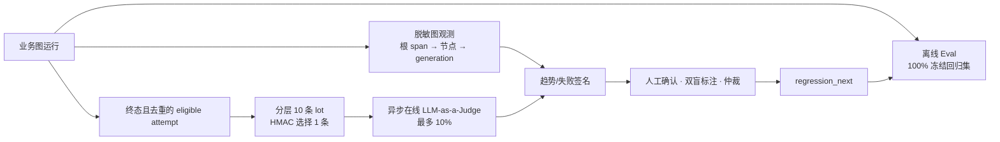

# Agent 观测、评测与回归运行时

## 1. 当前事实与发布边界

| 能力 | 当前事实（2026-08-09） | 发布结论 |
| --- | --- | --- |
| 图节点组织 | `state.ts / nodes/ / graph.ts` 已按自适应图角色拆分；实际节点为 `plan/decide/genQuestion/awaitAnswer/evalAnswer/conclude`。 | 有结构，不等于多工具 Agent。 |
| 图安全 | `interrupt` 前后拆分、线程围栏和 checkpoint RLS（行级安全）已有部分实测。 | 原始回答/简历事实仍会进入 checkpoint 历史，删除闭环未实现，阻断发布。 |
| memory（记忆） | L3 精确题目去重、历史弱项软偏置已运行。 | L4 语义长期记忆、L5 压缩摘要没有运行时实现，不得宣传已具备。 |
| Langfuse | 已迁移为官方 v5 OpenTelemetry（开放遥测）适配层；只发送 HMAC（带密钥哈希）伪名与标量。4 个合成数据集已同步：24 条 contract-regression、48 条 golden-dev、42 条 release-holdout、6 条 judge-calibration-holdout。 | 真实运行 trace、Experiment（实验）、Score（评分）、线上 Judge（评审）及告警尚无可复现云证据；启用还依赖本地私密 correlation secret。 |
| 评测 | 离线目录由代码固定为 120 条合成 contract：24 正常、72 异常/对抗、24 已知缺陷回归；目录比例、分割和敏感字段在 `pnpm langfuse-eval:prove` 中校验。 | 这不是人工金标质量集；尚未有托管实验、真实 Judge 校准、人工双盲标注或阻断式持续集成门。 |

本规范定义目标实现；只有“证据”栏有可重复真实结果后，才能把相应能力标为已运行。

## 2. 三条独立链路



- 离线 Eval（离线评测）：每次代码变更全量运行，100% 覆盖冻结集。确定性安全不变量、幂等、状态机、脱敏和权限从不抽样。
- 在线 LLM-as-a-Judge（大语言模型充当评审）：只用于质量监控和分流；每个合格逻辑业务结果 attempt 的采样率不超过 10%，失败/超时不影响用户主链路。
- Trace（链路追踪）趋势：只发现信号；必须人工确认、脱敏、标注、仲裁和版本冻结后，才产生回归样本。

## 3. 在线 10% 的数学定义

分母是唯一、终态、去重并通过脱敏/用途检查的业务 attempt，不是模型重试、节点次数、SSE 重放或队列重投。稳定分层为：

```text
feature × language_group × modality × risk_bucket
```

每一分层以到达顺序每 10 条构成 lot，并用专用 `ONLINE_JUDGE_SAMPLING_SECRET` 的 HMAC-SHA-256（带密钥哈希）给 lot 内条目排序，只选择最低值的一条。因而对任意前缀 `t`：

```text
sampled(stratum, t) ≤ floor(eligible(stratum, t) / 10)
```

稀有或高风险样本不足 10 条时，在线数可为 0；不得为了得到数据而突破比例。采用单独人工和离线样本补齐。每个用户每个 feature 每日最多 1 个样本，用户键也必须 HMAC 伪名化。

## 4. 数据集与版本

| 集合 | 用途 | 可调参 | 进入持续集成 |
| --- | --- | ---: | ---: |
| `contract-regression` | 配置、安全、权限、脱敏、幂等与状态机 | 否 | 每个合并请求，全量 |
| `golden-dev` | 合成/授权开发集 | 是 | 夜间任务 |
| `release-holdout` | 冻结留出集 | 否 | 发布候选 |
| `judge-calibration-holdout` | 对人工金标校准 judge | 否 | judge 变更 |
| `online-quarantine` | 脱敏线上候选 | 否 | 不直接进入持续集成 |

每个 case 必须携带：不可变 `caseId/caseVersion`、数据集、来源政策、groupId、feature、期望 action、预期分项、禁止披露项、policy/rubric/corpus 版本、标注人数和仲裁状态。一个 user/session/document 的派生物必须只在一个数据划分中，防止泄漏。`release-holdout` 不可原地编辑。

### 第一版离线规模与结构门

第一版冻结离线目录为 **120 条**，不是只靠十余条“能跑通”的样例：正常路径 24 条（20%）、异常与对抗路径 72 条（60%）、已验证事故/缺陷的错误集锦回归 24 条（20%）。三类都按 Agent、RAG、评分、语音、记忆、观测/配置六个功能面分配；每类至少覆盖中文、英文/混合语、文本/语音（如适用）与低证据/指代/注入等风险桶。

| 覆盖类型 | 数量 | 运行位置 | 判定方式 |
| --- | ---: | --- | --- |
| 正常主路径 | 24 | `golden-dev` 12 + `release-holdout` 12 | 业务结果、引用、结构和时延预算 |
| 异常/对抗路径 | 72 | `golden-dev` 36 + `release-holdout` 30 + `judge-calibration-holdout` 6 | 拒绝、澄清、降级、幂等、权限与安全不变量 |
| 错误集锦回归 | 24 | `contract-regression` 24 | 每一条已验证事故必须有可自动执行的断言 |

比例、总量、唯一 `caseId + caseVersion`、划分隔离和每类功能/风险覆盖均由 manifest 验证；不足 120 条、任何一类偏离 20%/60%/20% 或将发布留出集用于调参，发布门直接失败。

## 5. 外送最小化与图层级

Langfuse 必须使用官方当前 v5 OpenTelemetry（开放遥测）运行时，而不是 legacy batch ingestion。每个图运行有一个 root span；每个 node 是 child span；模型为 generation（生成调用），检索/工具为相应 observation（观察项）。

允许字段仅为：HMAC 伪名化 `runId/userId/attemptId`、graph/node 名、状态枚举、版本、数据分级、字符/token 计数、耗时、成本、重试次数、来源 ref 的 HMAC、错误分类。禁止字段：原始 owner/thread/idempotency key、答案哈希、问题/答案/简历/录音/评论原文、完整 prompt、PII（个人可识别信息）和任意密钥。

启动配置必须 all-or-nothing：`LANGFUSE_TRACING_ENABLED=true` 时，公钥、私钥、统一 HTTPS `LANGFUSE_BASE_URL` 和 `LANGFUSE_CORRELATION_SECRET` 缺任一项、地址冲突或格式非法都拒绝 attach。业务仍可在 disabled/no-op 模式运行；配置错误、发送丢弃与 flush 失败必须通过低基数指标和告警可见。

## 6. 趋势、判定与晋升

趋势必须显示 `eligible/sampled/judged/skipped` 全分母，并按 feature、模型、prompt、rubric、语种、模态与 RAG generation 切片。judge 未经校准只能 `triage_only`。如要用 judge 触发发布暂停，关键标签正负例各至少 100 个人工样本，Precision（精确率）和 Recall（召回率）的 Wilson 95% 下界均不低于 0.90；不满足即 `inconclusive`。

| 信号 | 最小样本 | 触发 | 自动动作 |
| --- | ---: | --- | --- |
| 安全/权限/外送敏感数据 | 任何 | 失败大于 0 | 停用相关版本并启动人工事件处理 |
| 质量退化 | judged 至少 100 | 相对基线失败率单侧 95% 下界上升超过 5 个百分点 | 创建人工 triage |
| 分布漂移 | eligible 至少 1000 | PSI（群体稳定性指数）大于 0.25 | 复核输入类型并补候选样本 |
| judge 失准 | 人工复标至少 100 | Precision 或 Recall 下界低于 0.90 | 降为仅观测 |

趋势只创建 `TraceFinding`。进入回归的状态为：`observed → triage → candidate → double_labeled → adjudicated → regression_next → frozen_release`；错误、重复或不可复现则进入 `dismissed`。任何已验证发现必须关联 `caseId`，语义等价问题可以关联旧 case，但不能自动复制用户原文。

## 7. 本轮强制回归清单

| Case ID | 缺陷 | 通过条件 |
| --- | --- | --- |
| `LF-SEC-001` | 裸答案 SHA-256 经外送 ID 泄露 | payload 中原 hash、owner/thread/idempotency key、prompt、PII、密钥命中均为 0。 |
| `LF-CFG-001` | enabled 开关失效 | `false` 时网络发送数为 0。 |
| `LF-CFG-002` | 地址/凭据缺失静默失败 | 解析拒绝，指标显示 disabled/error，业务不受影响。 |
| `LF-INGEST-001` | legacy ingestion | 官方 v5 root→node→generation 层级可由真实测试项目确认。 |
| `LF-OBS-001` | 缺图节点/版本关联 | 每个图运行都含 graphRun、版本、节点、generation 链路。 |
| `LF-ISO-001` | 隔离测试外送真实 Langfuse | 隔离子进程中所有 `LANGFUSE_*` 均不存在。 |
| `EVAL-ONLINE-001` | 在线 judge 超过 10% | 任意前缀及任意分层满足公式。 |
| `EVAL-ONLINE-002` | judge 污染业务结果 | judge 成功、失败、超时前后账本/分数/权益完全一致。 |
| `EVAL-PROMOTE-001` | 未审批样本冻结 | 无双盲标注/仲裁的主观 case 冻结数为 0。 |
| `GRAPH-PRIV-001` | 原始回答进入 checkpoint 历史 | 完成、失败、超时、删除后，所有 checkpoint 历史中的随机原文标记命中为 0。 |
| `GRAPH-CFG-001` | 旧图运行时回退降低安全边界 | 生产 `ADAPTIVE_INTERVIEW=0` 启动拒绝。 |

## 8. 证据与发布门

PR（合并请求）只执行离线确定性门，不持有线上 Langfuse 或模型凭据。受保护分支的夜间任务可使用专用测试项目、最小权限凭据和成本上限运行托管数据集实验。发布候选运行不可调参的 holdout，保存版本、失败、skip（跳过）、成本和完整分母。线上 judge 永远异步、限额、脱敏，且不承担业务决策。

`100% 高可用`不是可验证承诺。本系统仅在完成真实故障域、恢复演练、容量、数据恢复目标和本规范的证据门后，按实际 SLI（服务水平指标）、SLO（服务水平目标）、RPO（可接受数据丢失窗口）和 RTO（恢复时间目标）声明边界。
