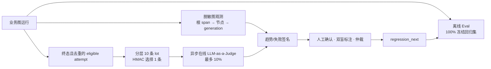
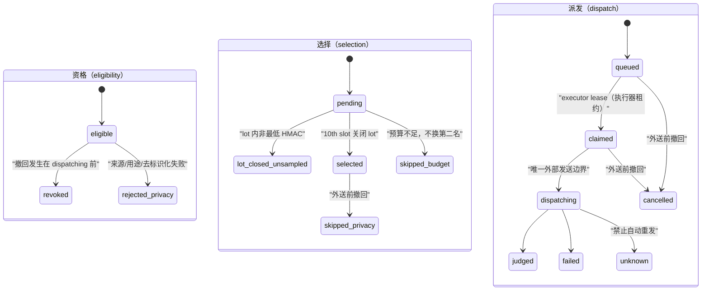

# Agent 观测、评测与回归运行时

## 1. 当前事实与发布边界

| 能力 | 当前事实（2026-08-09） | 发布结论 |
| --- | --- | --- |
| 图节点组织 | `state.ts / nodes/ / graph.ts` 已按自适应图角色拆分；实际节点为 `plan/decide/genQuestion/awaitAnswer/evalAnswer/conclude`。 | 有结构，不等于多工具 Agent。 |
| 图安全 | `interrupt` 前后拆分、线程围栏和 checkpoint RLS（行级安全）已有实测；新 state 仅存 `answerId`，`CheckpointAccess` 绑定 owner/thread/epoch。 | 新写入不含回答正文或简历事实；历史/备份/外部数据面的物理删除闭环仍未实现，阻断发布。 |
| memory（记忆） | L3 精确题目去重、历史弱项软偏置已运行。 | L4 语义长期记忆、L5 压缩摘要没有运行时实现，不得宣传已具备。 |
| Langfuse | 已迁移为官方 v5 OpenTelemetry（开放遥测）适配层；只发送 HMAC（带密钥哈希）伪名与标量。4 个合成数据集已同步且由只读回执命令逐 item（条目）验证：24 条 contract-regression、48 条 golden-dev、42 条 release-holdout、6 条 judge-calibration-holdout，共 120 条，catalog digest（目录摘要）为 `4d4cf639…8bdd6b21`。一次受控合成 trace（追踪）已完成写入→读回→清理，并验证 root（根）→node（节点）→generation（生成调用）和原始标识泄露数为 0。 | 这是合成传输/层级/脱敏证据，不是质量结论；长运行 worker（后台执行进程）、Experiment（实验）、Score（评分）、线上 Judge（评审）及告警尚无可复现云证据；持久启用仍依赖本地私密 correlation secret（关联哈希密钥）。 |
| 线上 Judge 控制面 | `0050_online_judge_control_plane.sql` 已用独立 PostgreSQL（关系型数据库）运行 `pnpm online-judge-control:prove`：并发重放、并发关 lot（批次）、前缀比例、日/月预算、撤回、租约 unknown（未知）、策略不可变、最小权限和业务不变均有断言。表中仅允许 HMAC（带密钥哈希）引用与标量。 | 当前只接收合成/公开许可来源；真实用户答案、音频、简历、评论和 prompt（提示词）全部 fail-closed（失败即关闭）。尚无真实 packet（数据包）服务、模型外送、人工校准、Langfuse Score（评分）或云端证据。 |
| 离线合同回归执行 | `pnpm offline-eval:contract --allow-incomplete` 以代码内固定 gateId（门编号）顺序执行本地 gate。父运行器只在该 case 的固定 oracle（判定器）完整命中时标 `passed`；一个 broad gate（宽泛门）退出 0 不能再扇出多个 case 通过。子进程仅继承正向环境 allowlist（允许列表），标准输出/错误不落回执，超时终止整个子进程组。旧的“22 个 case 通过”回执来自修复前，已废弃。最新一次执行 **14** 个隔离 gate、**21** 个已绑定 case 均命中自身 oracle、gate 失败 **0**、截断输出 **0**，且回执有非空实际工作树摘要；`LF-FB-001` 包含真实 NestJS（Node.js 服务端框架）API 隔离 E2E（端到端测试）。但同一工作树摘要的前一次完整运行中 `checkpoint-privacy-erasure` exit=1；当前完整重跑样本为 **2** 次，成功 **1**、失败 **1**，可靠性样本不足，不能把最新绿色外推为稳定。尚缺 `EVAL-PROMOTE-001`、`GRAPH-MEM-001`、`VOICE-DUPLEX-001` 的逐 case oracle。 | 回执明确为 `untrusted_local_contract_receipt`、`releaseEvidence=false`；21/24 不是 24/24，更不是 120 条质量结论；存在 **1/2** 失败时更不能作为稳定发布门。 |
| 评测目录与托管数据集 | 离线目录由代码固定为 120 条合成 contract：24 正常、72 异常/对抗、24 已知缺陷回归；目录比例、**跨分区 groupId（来源组）唯一性**和敏感字段在 `pnpm langfuse-eval:prove` 中校验。四个远端数据集最近一次严格只读比对为 4/4、120/120 item（条目）一致；同步器对既有分区只接受 metadata（元数据）与所有 item 精确相等，否则失败而非原地覆盖。 | 这不是人工金标质量集；96 条正常/异常/holdout（留出）case 尚未有 case→真实入口→oracle（判定器）的执行映射，且尚未有托管 Experiment（实验）、真实 Judge 校准、人工双盲标注或阻断式持续集成门。 |

本规范定义目标实现；只有“证据”栏有可重复真实结果后，才能把相应能力标为已运行。

## 2. 三条独立链路



- 离线 Eval（离线评测）：每次代码变更全量运行，100% 覆盖冻结集。确定性安全不变量、幂等、状态机、脱敏和权限从不抽样。
- 在线 LLM-as-a-Judge（大语言模型充当评审）：只用于质量监控和分流；每个合格逻辑业务结果 attempt 的采样率不超过 10%，失败/超时不影响用户主链路。
- Trace（链路追踪）趋势：只发现信号；必须人工确认、脱敏、标注、仲裁和版本冻结后，才产生回归样本。

## 3. 在线 10% 的数学定义

分母是唯一、终态、去重并通过脱敏/用途检查的业务 attempt，不是模型重试、节点次数、SSE 重放或队列重投。稳定分层为：

```text
feature × language_group × modality × risk_bucket
```

每一分层以到达顺序每 10 条构成 lot，并用专用 `ONLINE_JUDGE_SAMPLING_SECRET` 的 HMAC-SHA-256（带密钥哈希）给 lot 内条目排序，只选择最低值的一条。因而对任意前缀 `t`：

```text
sampled(stratum, t) ≤ floor(eligible(stratum, t) / 10)
```

稀有或高风险样本不足 10 条时，在线数可为 0；不得为了得到数据而突破比例。采用单独人工和离线样本补齐。每个用户每个 feature 每日最多 1 个样本，用户键也必须 HMAC 伪名化。

### 3.1 已实现的数据库控制面与刻意未实现的外送

线上 Judge 的单一 `status` 会混淆三件事：是否可被使用、是否被抽中、以及外部调用走到哪里。实际表把它们拆成正交状态，以免将“没有抽中”误写为“模型失败”：



- `online_judge_policy` 保存不可变 policy/rubric（策略/评分规则）/model/packet/schema/sampling-key 版本、`triage_only | calibrated | disabled` 和每日预算。`triage_only` 与 `calibrated` 都没有业务写入权限；“已校准”只意味着可用于质量趋势，而非可以做招聘、扣点、退款或发布判定。
- `online_judge_stratum_cursor → online_judge_lot → online_judge_candidate` 在单一短事务中按 `feature × language_group × modality × risk_bucket` 分配 `slot 1..10`。唯一 `(policyVersion, sourceAttemptHmac)` 和唯一 `(lotId, lotSlot)` 使重复事件只能重放已有 receipt（回执）。第十条锁定 cursor（游标），按 scheduler（调度器）提供的 HMAC rank 选择最低者，另 9 条固定 `lot_closed_unsampled`。
- `online_judge_budget_monthly → online_judge_budget_daily → online_judge_subject_daily` 用 policy/month、policy/day、subject/day 的固定锁顺序预留配额。日/月预算不足或同用户当天已用均不选择 rank（排序）第二名；这是“低于 10% 可以、高于 10% 不可以”的保守偏差。
- `online_judge_dispatch` 只有 `queued → claimed → dispatching → terminal`。`unknown` 表示外部结果不可确认，并且数据库中没有从 `unknown` 回 `queued` 的转换；因此超时不会用重试放大费用或采样比例。
- `online_judge_scheduler` 与 `online_judge_executor` 均无任何 Judge 表的直接权限。前者只能调用候选登记/撤回函数，后者只能得到 `packetRefHmac`（数据包 HMAC 引用）并推进租约。两者都不能读取 `interview`（面试）、`job_application`（岗位申请）、账本或正文。

现实用户材料的 `consented_deidentified`（已同意且去标识化）来源尚未有独立同意账本和 packet 审核服务。当前 SQL（结构化查询语言）过程会拒绝该来源；因此它不是“表上有字段就已经支持”，而是明确的上线前阻断项。未来 packet 服务必须在候选登记前给出可验证同意、用途、删除和去标识化 receipt；不能由调用者填一个字符串冒充同意。

当前可复跑的本地数据库证据为 `pnpm online-judge-control:prove`；输出逐项列出完整 lot 精确 1 个 selected（选中）、100 并发同 attempt 重放=1、20 并发关闭=1、137 条=13 个完整 lot、9 条稀有分层=0、日/月预算 0、真实用户来源 fail-closed、撤回、错误租约、`unknown` 无自动重发、策略不可变、角色/RLS（行级安全）与业务表不变。它不调用模型，不构成在线质量、成本、吞吐或云端可用性结果。

## 4. 数据集与版本

| 集合 | 用途 | 可调参 | 进入持续集成 |
| --- | --- | ---: | ---: |
| `contract-regression` | 配置、安全、权限、脱敏、幂等与状态机 | 否 | 每个合并请求，全量 |
| `golden-dev` | 合成/授权开发集 | 是 | 夜间任务 |
| `release-holdout` | 冻结留出集 | 否 | 发布候选 |
| `judge-calibration-holdout` | 对人工金标校准 judge | 否 | judge 变更 |
| `online-quarantine` | 脱敏线上候选 | 否 | 不直接进入持续集成 |

每个 case 必须携带：不可变 `caseId/caseVersion`、数据集、来源政策、groupId、feature、期望 action、预期分项、禁止披露项、policy/rubric/corpus 版本、标注人数和仲裁状态。一个 user/session/document 的派生物必须只在一个数据划分中，防止泄漏。`release-holdout` 不可原地编辑。

### 第一版离线规模与结构门

第一版冻结离线目录为 **120 条**，不是只靠十余条“能跑通”的样例：正常路径 24 条（20%）、异常与对抗路径 72 条（60%）、已验证事故/缺陷的错误集锦回归 24 条（20%）。三类都按 Agent、RAG、评分、语音、记忆、观测/配置六个功能面分配；每类至少覆盖中文、英文/混合语、文本/语音（如适用）与低证据/指代/注入等风险桶。

| 覆盖类型 | 数量 | 运行位置 | 判定方式 |
| --- | ---: | --- | --- |
| 正常主路径 | 24 | `golden-dev` 12 + `release-holdout` 12 | 业务结果、引用、结构和时延预算 |
| 异常/对抗路径 | 72 | `golden-dev` 36 + `release-holdout` 30 + `judge-calibration-holdout` 6 | 拒绝、澄清、降级、幂等、权限与安全不变量 |
| 错误集锦回归 | 24 | `contract-regression` 24 | 每一条已验证事故必须有可自动执行的断言 |

比例、总量、唯一 `caseId + caseVersion`、**全局唯一的来源 `groupId`（而非 `groupId + dataset`）**、划分隔离和每类功能/风险覆盖均由 manifest 验证；不足 120 条、任何一类偏离 20%/60%/20% 或将发布留出集用于调参，发布门直接失败。目录结构验证不等价于真实执行：每个 case 还必须有受限 runner（运行器）、fixture（测试夹具）、oracle 和回执，缺任何一项为 `inconclusive`。

## 5. 外送最小化与图层级

Langfuse 必须使用官方当前 v5 OpenTelemetry（开放遥测）运行时，而不是 legacy batch ingestion。每个图运行有一个 root span；每个 node 是 child span；模型为 generation（生成调用），检索/工具为相应 observation（观察项）。

允许字段仅为：HMAC 伪名化 `runId/userId/attemptId`、graph/node 名、状态枚举、版本、数据分级、字符/token 计数、耗时、成本、重试次数、来源 ref 的 HMAC、错误分类。禁止字段：原始 owner/thread/idempotency key、答案哈希、问题/答案/简历/录音/评论原文、完整 prompt、PII（个人可识别信息）和任意密钥。

启动配置必须 all-or-nothing：`LANGFUSE_TRACING_ENABLED=true` 时，公钥、私钥、统一 HTTPS `LANGFUSE_BASE_URL` 和 `LANGFUSE_CORRELATION_SECRET` 缺任一项、地址冲突或格式非法都拒绝 attach。业务仍可在 disabled/no-op 模式运行；配置错误、发送丢弃与 flush 失败必须通过低基数指标和告警可见。

## 6. 趋势、判定与晋升

趋势必须显示 `eligible/sampled/judged/skipped` 全分母，并按 feature、模型、prompt、rubric、语种、模态与 RAG generation 切片。judge 未经校准只能 `triage_only`。如要用 judge 触发发布暂停，关键标签正负例各至少 100 个人工样本，Precision（精确率）和 Recall（召回率）的 Wilson 95% 下界均不低于 0.90；不满足即 `inconclusive`。

| 信号 | 最小样本 | 触发 | 自动动作 |
| --- | ---: | --- | --- |
| 安全/权限/外送敏感数据 | 任何 | 失败大于 0 | 停用相关版本并启动人工事件处理 |
| 质量退化 | judged 至少 100 | 相对基线失败率单侧 95% 下界上升超过 5 个百分点 | 创建人工 triage |
| 分布漂移 | eligible 至少 1000 | PSI（群体稳定性指数）大于 0.25 | 复核输入类型并补候选样本 |
| judge 失准 | 人工复标至少 100 | Precision 或 Recall 下界低于 0.90 | 降为仅观测 |

趋势只创建 `TraceFinding`。进入回归的状态为：`observed → triage → candidate → double_labeled → adjudicated → regression_next → frozen_release`；错误、重复或不可复现则进入 `dismissed`。任何已验证发现必须关联 `caseId`，语义等价问题可以关联旧 case，但不能自动复制用户原文。

## 7. 本轮强制回归清单

| Case ID | 缺陷 | 通过条件 |
| --- | --- | --- |
| `LF-SEC-001` | 裸答案 SHA-256 经外送 ID 泄露 | payload 中原 hash、owner/thread/idempotency key、prompt、PII、密钥命中均为 0。 |
| `LF-CFG-001` | enabled 开关失效 | `false` 时网络发送数为 0。 |
| `LF-CFG-002` | 地址/凭据缺失静默失败 | 解析拒绝，指标显示 disabled/error，业务不受影响。 |
| `LF-INGEST-001` | legacy ingestion | 官方 v5 root→node→generation 层级可由真实测试项目确认。 |
| `LF-OBS-001` | 缺图节点/版本关联 | 每个图运行都含 graphRun、版本、节点、generation 链路。 |
| `LF-ISO-001` | 隔离测试外送真实 Langfuse | 隔离子进程中所有 `LANGFUSE_*` 均不存在。 |
| `EVAL-ONLINE-001` | 在线 judge 超过 10% | 任意前缀及任意分层满足公式。 |
| `EVAL-ONLINE-002` | judge 污染业务结果 | judge 成功、失败、超时前后账本/分数/权益完全一致。 |
| `EVAL-PROMOTE-001` | 未审批样本冻结 | 无双盲标注/仲裁的主观 case 冻结数为 0。 |
| `GRAPH-PRIV-001` | 原始回答进入 checkpoint 历史 | 完成、失败、超时、删除后，所有 checkpoint 历史中的随机原文标记命中为 0。 |
| `GRAPH-CFG-001` | 旧图运行时回退降低安全边界 | 生产 `ADAPTIVE_INTERVIEW=0` 启动拒绝。 |

## 8. 证据与发布门

PR（合并请求）只执行离线确定性门，不持有线上 Langfuse 或模型凭据。受保护分支的夜间任务可使用专用测试项目、最小权限凭据和成本上限运行托管数据集实验。发布候选运行不可调参的 holdout，保存版本、失败、skip（跳过）、成本和完整分母。线上 judge 永远异步、限额、脱敏，且不承担业务决策。

`100% 高可用`不是可验证承诺。本系统仅在完成真实故障域、恢复演练、容量、数据恢复目标和本规范的证据门后，按实际 SLI（服务水平指标）、SLO（服务水平目标）、RPO（可接受数据丢失窗口）和 RTO（恢复时间目标）声明边界。

### 8.1 已执行的托管数据集回执

`pnpm langfuse:datasets:verify` 会以只读方式拉取四个指定数据集，验证数据集 metadata（元数据）的 revision（修订版本）、catalog digest（目录摘要）、来源政策，以及 120 个 item（条目）的 ID、input（输入）、expectedOutput（期望输出）和 metadata（元数据）逐项相等。最近一次本地执行结果为 **4/4 数据集、120/120 item 一致**。该脚本没有写入 Langfuse（模型可观测与评测平台），也不会创建 Experiment（实验）、Score（评分）或发布通过记录。

`LANGFUSE_SYNTHETIC_TRACE_SMOKE_APPLY=1 pnpm langfuse:synthetic-trace:smoke` 是唯一允许写入的合成 trace（追踪）冒烟入口。它必须有显式环境变量和专用 HMAC（带密钥哈希）关联密钥；每次最多新建 1 条只含固定名称、标量和伪名的 trace，随后按自己的 trace ID（追踪标识）删除并确认列表投影已无残留。最近一次结果为 **root=1、node=1、generation=1、rawMarkerLeaks=0、清理残留=0**。它不调用模型，也不代表真实 worker、质量、成本或可用性通过。

`pnpm offline-eval:contract` 是严格本地合同回归入口：任何未绑定 case 都会在执行前以非零退出。`--allow-incomplete` 仅允许诊断已绑定的固定 gate，仍以非零结束并把缺项写为 `inconclusive`。2026-08-09 的旧 14-gate/22-case 回执使用了“gate 零退出即 case 通过”的错误归类，已明确废弃，不能作为任何质量、发布或运行时事实。修复后的最近一次完整诊断回执在本地记录 **14/14 gate exit=0、21/21 已绑定 case oracle 命中、0 输出截断、3 个未绑定 case**，并包含 `codeRevision`、`worktreeState=dirty`、非空 `executionTreeDigest`；回执的 `classification=untrusted_local_contract_receipt`、`releaseEvidence=false` 和 `planComplete=false`，所以结果仍是 `inconclusive_or_failed` 而非发布通过。紧邻的前一次完整运行使用同一 `executionTreeDigest`，但 `checkpoint-privacy-erasure` exit=1；当前该运行器的全量稳定性样本为 **1/2 成功**，必须继续定位/复现后才能成为持续集成门。`LF-FB-001` 由真实 API 隔离 E2E 覆盖：带合成 sentinel（哨兵文本）的反馈不会新建模型调用或 trace，且两个存储表中的 sentinel 命中数均为 0。`EVAL-PROMOTE-001`（双盲仲裁后晋升）、`GRAPH-MEM-001`（上下文压缩）和 `VOICE-DUPLEX-001`（真实双向语音）仍保持为未绑定的发布阻断，直至存在真实入口和逐 case oracle。它永远不能将 120 条目录、远端数据集或本地 receipt（回执）表述为发布或质量通过。
