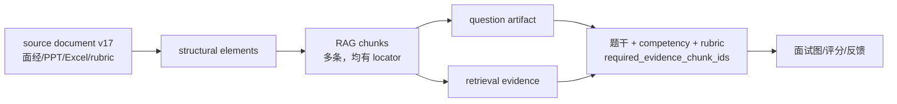

# 全格式 RAG 摄取、结构切块与可回溯设计

## 1. 先给结论：chunk 不是字符串片段

`chunk = 可检索文本 + 原件结构定位 + 文档版本 + recipe + 权限/生命周期`。只保存 `text + embedding` 的系统无法证明一段答案来自哪一页、哪张表的哪一行、哪个视频时间点；文档更新、删除、申诉和人工复核都会失效。

```mermaid
flowchart LR
  A["原件: PDF / DOCX / XLSX / PPTX / 图片 / 音视频"] --> B["安全受理: MIME+magic、AV、DLP、hash、对象加密"]
  B --> C["无网络 Sandbox adapter"]
  C --> D["结构 IR: page/paragraph/table/cell/slide/shape/frame/transcript"]
  D --> E["清洗与质量闸: PII、注入、OCR/ASR 置信、结构完整性"]
  E --> F["版本化 structural chunker"]
  F --> G["chunk + locator + recipe + content hash"]
  G --> H["embedding generation / lexical index / ACL"]
  H --> I["RAG evidence allowlist"]
  I --> J["回答 citation"]
  J --> K["点击原件: 页/表格/slide/时间点"]
```

## 2. 输入安全与原始事实

1. 受理层同时校验声明 MIME、magic bytes、扩展名、大小、压缩率、页/slide/sheet/时长预算；任一不一致进入 `quarantined`，不是“尽量读一下”。
2. 解析器在无网络、只读挂载、CPU/内存/壁钟时间/子进程数受限的 sandbox 中执行。Office 宏、嵌入对象、外链和 HTML 资源**不执行、不抓取**。
3. 原件对象以内容 hash 去重但权限行不共享；原件、OCR 文本、ASR 原文和截图不进日志、trace 或 system prompt。
4. `extraction_run` 记录 parser/OCR/ASR/VLM 模型、版本、配置和质量结果；任何改变都会改变 extraction/ chunk recipe，触发可重建 generation，而不是原地覆盖。

当前仓库只实现了简历端的部分受理与 PDF/DOCX/OCR 提取，通用 sandbox/object storage/AV 尚未接线。

## 3. 各格式必须保留的结构与定位

| 格式 | adapter 输出结构 IR | 最小 locator | 绝不能做的退化 |
| --- | --- | --- | --- |
| PDF | 页、阅读顺序 block、标题、段落、表、图、脚注 | `page + char range + bbox[]` | 把多栏顺序拼错；表格变无列纯文本；只有页号没有标注框。 |
| DOCX | section、heading、paragraph、table、list、comment、图片锚点 | `part + paragraph/table/cell id` | 丢标题层级和表头；把脚注混进正文。 |
| XLSX | workbook、sheet、visible/hidden、named range、merged cell、header、row、column、formula/value/style | `sheet + A1 range + headerRows + formula/value` | 只导出 CSV；丢 sheet 名、行列、公式和合并单元格语义。 |
| PPTX | slide、layout、shape、table、speaker notes、图片/图表、reading order | `slide + shape ids + bbox[]` | 把所有 slide 串成一篇文章；丢图注/notes；把动画顺序当正文顺序。 |
| 图片/图文 | 页/图、OCR 行、VLM region、caption、表格 region | `image/page + bbox[]` | 仅存 OCR 无坐标；低置信数值当确定事实。 |
| 音频/视频 | track、ASR turn、word timestamp、speaker、scene/keyframe/OCR | `startMs/endMs + speaker + word range + frame` | 没有时间轴；把双人谈话误标单人；ASR 低置信当原文。 |
| HTML/网页 | canonical URL、抓取版本、heading、main/table/code、DOM selector | `URL + content hash + selector/char range` | 执行页面脚本；把隐藏文本或导航噪声混入正文。 |

表格中，`display value`、`formula`、`number format`、`cell range` 都是事实：例如 `=SUM(B2:B13)` 和显示的 `120万` 不是同一个可替换字符串。检索文本可写为“`[预算!B14] 年收入合计 = SUM(B2:B13)，显示 120 万元`”，citation 必须仍回到 `预算!B14`。

## 4. 清洗的正确顺序

`bytes → 安全扫描 → 结构提取 → Unicode/空白/编码归一 → 语义清洗 → PII/注入标注 → 质量判断 → chunk`。

- 归一化可以删除控制字符、统一 NFC/NFKC、修复断词、删除重复页眉页脚；它不可删除表格列、单位、否定词、脚注、公式或时间戳。
- prompt injection 不“从原件删除”：它保留为有 locator 的不可信数据，标 `injection_suspected`，不允许充当 instruction/tool input。
- OCR/ASR/VLM 需按 block/word/region 保留置信度。低于阈值的数值、姓名、金额、公式和关键结论进入人工核验，不能由 RAG 当事实回答。
- 去重在文档、结构元素、chunk 三层分别做。相同 hash 的浮点向量可复用；文档权限、citation、审核和删除义务不能复用为同一行。

## 5. Chunk recipe：固定原则与需数据选择的变量

### 5.1 可作为工程不变量的规则

这些不是模型偏好，不需要先靠离线 Recall “证明”才采用：

- 每块有 document id、content version、chunker recipe、content hash、至少一个 source locator。
- 表格按 row group 切，重复表头；永远不把一个单元格或一行按 token 腰斩。预算装不下时 `needs_review` 或更细 adapter。
- slide、图、代码、公式、音视频 time segment 是原子边界；先在 adapter 细分，不能在 embedding 前静默字符截断。
- heading path/section title 可作为每块的轻量上下文，但原始正文和 citation 不变。
- 版本、授权、撤销/删除和 recipe mismatch fail-closed；回答的 citation 必须是本轮 evidence allowlist 成员。

### 5.2 必须由数据集裁决的变量

| 变量 | 为什么经验不够 | 实验方式 |
| --- | --- | --- |
| OCR/PDF layout/PPT reading-order adapter | 某个 parser 在多栏、扫描表格、中文字体上可能系统性错。 | 对格式/来源分层的标注 IR，比较 block/cell/locator F1 与人工修复率。 |
| 最大 token、overlap、heading 注入方式 | 影响多证据覆盖、噪声、embedding/LLM 成本，不能以“512 最常用”决定。 | 在 dev set 网格搜索；holdout 仅一次报告 EvidenceCoverage/strict-all/nDCG/P95/cost。 |
| table serialization（行文本、KV、markdown、schema+row） | 适合财务表的序列化未必适合试题 rubric。 | 按表格 query slice 做 paired qrels 比较，另测 cell citation exactness。 |
| image caption/VLM 与 OCR 融合 | 描述可能补全不存在的图形事实，OCR 又会漏图表关系。 | 对图文 grounding 数据集评估 answer/citation correctness 和幻觉率。 |
| ASR model、VAD、diarization、时间窗 | 口音、重叠说话和术语决定质量；同样的 30 秒窗口未必最佳。 | 按噪声/双人/术语/重叠切片测 WER、speaker attribution、evidence coverage。 |
| embedding、hybrid、rerank、candidate K | 改排序并不等于找全证据；当前 57-query 本地合成发布集只提供优化线索，不能替代真实全格式数据。 | 冻结同一 chunk recipe/ACL/qrels，成对比较并报告置信区间、P95 与成本。 |

## 6. 可回溯与“点击查看”

回答只持有 `citation_id`，服务端解析它为不可变 `(document_id, content_version, chunk_id, locator_snapshot_hash)`。浏览器从授权端点拿短时 viewer token：PDF 高亮 bbox、Excel 选中 sheet/range、PPT 切到 slide/shape、视频 seek 到 `startMs`，而不是把对象存储 URL 或全文塞给前端。

文档更新后，旧 citation 必须显示“基于版本 v12”；不能因 `current_content_version` 变为 v13 而把旧回复的点击目标悄悄改写。删除/撤销后 citation 显示不可用原因并禁止下载，审计 hash 仍可保留在法定范围内。

## 7. 题库进入 RAG 的正确关系

`0031_qbank_question_artifact_rag` 已把启动题库改为 `qbank_question → qbank_question_chunk → qbank_chunk`：33 个自撰启动题各写入 `prompt / rubric / follow_up / anti_pattern` 四个 immutable、受审核 chunk（共 `132` 块），而不是一题一个向量。命中任一块后，运行时仅在 `prompt=1`、`rubric>=1`、所需块完整、active generation 与 approved source 均二次复核时，才向图返回整题 evidence package；不能组成完整题目的旧 title-only chunk 直接 fail-closed。题目 artifact receipt 不可原地修改，版本更新须新题 ID + source/review/generation 流程。

这仍不是通用全格式平台：`qbank_chunk` 还没有 `source_document_version`、PDF bbox、sheet range、slide shape 或 video timestamp locator；当前 chunk recipe 仍是题库角色块而非 PDF/Office/视频解析。目标 `corpus_*` 迁移必须新增 document/source-version 与 locator，允许 `(source_document_version, chunk_ordinal)` 产生多个 immutable chunk，并让 question artifact 复用这些证据而不是复制正文。

迁移不能原地把已有 `ref_id` 改成多块：建立 G2 schema → 导入仍有原件的 source → 结构切块 → shadow qrels → canary → CAS active pointer；没有原文的 legacy vector 继续按当前 fail-closed 规则阻断重建。来源撤销需同时隐藏所有 chunks，并使依赖其 evidence 的题目变为 `needs_revalidation`，而非静默继续出题。

## 8. 人工校验与失败出口

| 信号 | 自动路径 | 人工处理 |
| --- | --- | --- |
| macro/virus/zip bomb/MIME conflict | `quarantined`，不解析 | 安全人员可见受控样本。 |
| 低 OCR/ASR 置信、数字/金额/公式不一致 | `needs_review`，不可 active | 原件定位处确认/更正，保留 reviewer/version。 |
| 表格一行、slide/图或 transcript 片段超 chunk 预算 | 不硬切，`needs_review` | 选择专用表格、图表或时间轴 adapter。 |
| citation 无法 resolve、chunk 结构断裂 | 整个 generation 不可激活 | 修复 adapter/recipe，重建。 |
| qrels 质量、ACL、安全或成本门失败 | 保留旧 generation/策略 | 记录失败实验，不以局部好看分数推广。 |

## 9. 已落地的代码核心与下一实现顺序

`packages/domain/src/rag-chunking.ts` 已提供与存储无关的结构 chunker：XLSX row group+重复表头、slide/图片/代码原子边界、媒体 timestamp/speaker locator、版本化 recipe 和确定性 hash；`pnpm rag-chunking:prove` 有 13 项定位、预算、确定性和 fail-loud 断言。

下一顺序：①对象存储/ingest task/sandbox 和通用 IR schema；②XLSX/PPTX/PDF layout adapters；③`corpus_*`/citation schema 与 viewer；④把已落地的 qbank artifact 映射接到通用 document/chunk/locator（而非再造一套题库索引）；⑤ASR/VLM/video；⑥冻结数据集、shadow/canary。不能倒过来先接一个“万能文档解析 SDK”再补删除、来源和评测。
