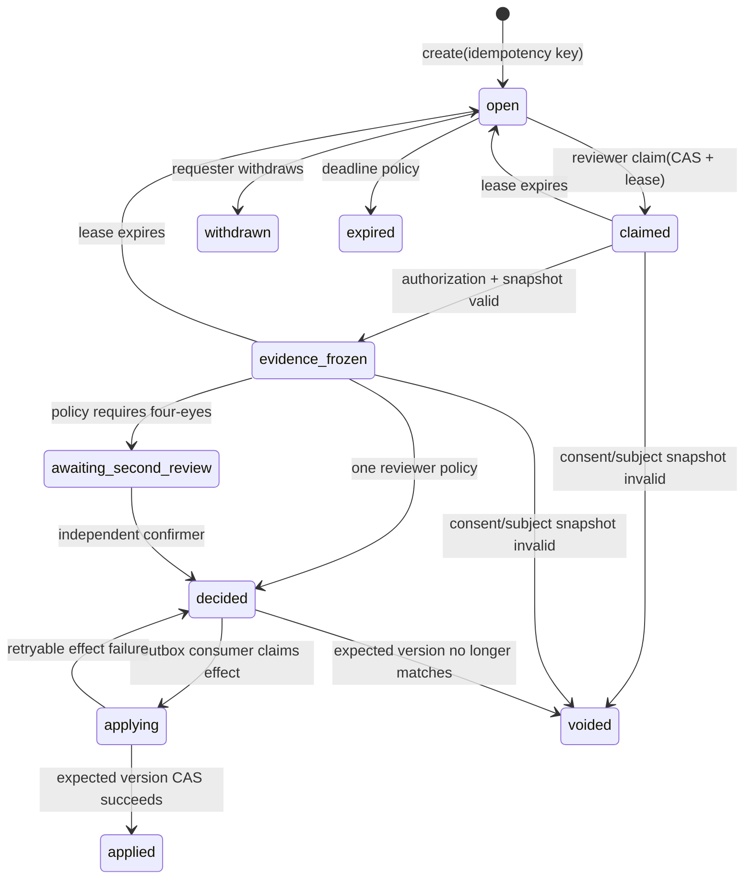

# 人工校验与申诉架构

> 本文把“人工复核”拆成可实施、可审计的领域能力。除 `qbank_source` 的数据库审核门外，其余内容均为 **TARGET**；不得把本文或现有页面文案作为已上线能力宣传。

## 0. 当前基线：已运行的门和不存在的闭环

| 能力 | 当前代码/实测 | 数量化结论 | 不能据此声称 |
| --- | --- | ---: | --- |
| 题库源审核门 | `qbank_source` 有 `pending → approved/rejected`、`approved → rejected`、来源/池/正文哈希一致、历史脏链隔离和已发布工件不可变触发器 | `pnpm rag-generation:prove`（28/28）、`pnpm qbank-integrity-upgrade:prove`（18/18）、`pnpm qbank-pipeline:prove`（5/5）与 `pnpm qbank-control-role:prove`（8/8）在完整 **72** 个迁移的隔离 PostgreSQL（关系型数据库）运行；升级 proof（证明）真实模拟 0067 下正文篡改后经 0068/0069/0070/0071/0072 升级，污染 source 变 rejected 且所有数据平面读取为 `0`；它还在无超级权限、不可绕过行级安全的函数/表所有者形态下执行 `building → validated → active`，证明完整题目证据读取器与写入函数共享同一受限 owner（所有者），并以真实 worker（后台任务进程）构建 catch（捕获）处理 embedding（向量嵌入）数量错配为 `failed`，再使不完整构建在激活前失败后进入 `failed`。后者验证普通运行时伪造会话主体后对写入和原始读取均为 `0`，误挂 runtime（运行时）、管理员、残留成员关系或不合格的 SECURITY DEFINER（安全定义者）owner（所有者）均被拒绝；受 provision（配置）的应用控制登录只能进入 `qbank_control_executor`（题库控制执行器）执行受限入口。所有回执均 `releaseEvidence=false` | **发布阻断**：真实云数据库尚未执行/留存升级扫描回执；真实云密钥挂载、审核员后台、工单 SLA（服务等级协议）和人工运营闭环仍不存在；历史 `qbank-source.proof.ts` 不再作为公开验证入口，不能作为当前安全/召回证据。 |
| OCR 简历的 `needs_review` | 图片/OCR 来源落 `resume_profile.status='needs_review'` | 状态值 **1** 个 | 有案件、分配、审核结论、回写、申诉或审核员访问控制。它只是待审标记。 |
| 评分金标结构 | `pnpm scoring-golden:prove` 实跑通过；集合有 **6** 个五档相对序组、**4** 个措辞扰动组、至少 **18** 条非 happy-path 输入 | 证明 fixture 结构、操纵剥离与“绝对校准未建立”的 fail-closed 声明 | 真实模型准确率、人类一致性、B 端招聘有效性或人工兜底。 |
| 评分申诉/改判 | 只有用例文档中的 `ManualReview open/in_review/upheld/overturned` | 运行时代码中通用 `ManualReview` 表、API、审核员角色、案件 UI、申诉 E2E 均为 **0** | 用户可申诉、审核员可看证据或改分。 |
| B 端最终决定 | 当前为个人招聘方账号、岗位和摘要分数 alpha | 自动 `reject/hire` API 应为 **0**；当前也没有 `DecisionRecord` | 分数能自动淘汰、录用或作为企业 ATS 最终决定。 |

隔离测试还暴露一个测试基础设施缺陷：历史影子 schema 测试会尝试重建全局角色 `app_role`，因其他对象依赖而失败。因此公开 `qbank-source:prove` 已改为当前完整迁移的低权限控制面证明；验证始终由临时 pgvector 容器完成，容器和临时数据库均已删除。今后该类 proof 必须由隔离 runner 启动，不能清空开发库。

## 1. 设计原则与边界

1. **人工复核不是模型重试。** 它处理风险、不确定性、申诉、抽样和有法律/财务影响的动作；低分本身不是入审理由。
2. **一个案件只指向不可变证据版本。** 审核结论不能覆盖原模型输出；它追加一个决定，并由可重放的业务动作产生新版本。
3. **不同领域保持各自状态机。** 题库源继续用 `qbank_source`；支付仍由 `RefundOrder`/账本掌控；人审只负责“谁看过什么、结论是什么、授权什么副作用”。
4. **先止血，后人工。** 安全危机、撤回内容、撤销同意等自动安全动作不能等待审核员领取案件。
5. **最小可见，不复制原文。** 工单保存对象引用、hash、版本和脱敏摘要；答案原文、简历、音频和模型链式推理不复制到队列、日志或搜索索引。
6. **B 端只能人做最终决定。** 模型分数可作为审核排序信号；没有证据、未校准、存在申诉或版本 incident 时必须是 `inconclusive`，不得降格成一个看似精确的分数。

## 2. 规范领域模型（TARGET）

`ManualReview` 是案件聚合，不是“把一条记录改成 approved”的通用表。

| 对象 | 必要字段 | 约束 |
| --- | --- | --- |
| `ManualReview` | `id`、`tenant_id`、`subject_type/id`、`purpose`、`risk_class`、`trigger_kind`、`policy_version`、`status`、`version`、`due_at`、`created_by` | 同一 active subject/purpose 的重复请求由幂等键收敛；不存原始答案/简历/音频。 |
| `ReviewEvidenceSnapshot` | `review_id`、`subject_version`、`evaluation_attempt_id`、`question/rubric/model/prompt/qbank/corpus` 版本、evidence span hash、ASR 版本、consent/share-grant 版本 | 创建案件时冻结；若对象或同意已失效，案件不能应用旧结论，只能 `voided` 或以新版本重开。 |
| `ReviewAssignment` | `review_id`、`reviewer_id`、`role`、`lease_token`、`lease_expires_at`、`claimed_at` | `claim` 使用 CAS；超时归还，旧 token 不得写决定。 |
| `ReviewDecision` | `id`、`review_id`、`expected_subject_version`、`outcome_code`、`reason_code`、candidate-visible explanation、policy version、reviewer、created_at | append-only，`UNIQUE(review_id, decision_idempotency_key)`；解释不得含 hidden rubric、标准解或模型 chain-of-thought。 |
| `ReviewEffect` | `decision_id`、`effect_type`、`effect_key`、`status`、outbox event id、applied_at/error | `UNIQUE(effect_type, effect_key)`；业务写入和 outbox 同事务，重复消费只返回先前结果。 |
| `ReviewAccessAudit` | viewer、purpose、case id、fields tier、reason、time、session/device correlation | 每次展开受控原文均记账；普通 `admin_audit` 不能替代它。 |

`subject_type` 初期限定为 `answer_evaluation`、`assessment_report`、`resume_profile`、`qbank_source`、`refund_exception`、`recruiting_decision`、`guardrail_hit`。新增类型必须先定义其状态机、证据版本和副作用，不能让客户端任意传字符串。

## 3. 案件状态机（TARGET）



`status` 描述流程，`outcome_code` 描述决定，二者不能混用。评分申诉的候选人可见结果映射为：`affirm_evaluation → upheld`、`amend_or_recompute → overturned`、`cannot_assess → inconclusive`。旧用例中的 `upheld/overturned` 不再直接做通用案件状态，避免支付、内容撤回和招聘决定被错误套用。

每条迁移都必须有 `WHERE id=? AND status=? AND version=?`。领取、确认、决定和应用使用不同幂等键；HTTP 200 不是副作用成功的证据。

## 4. 哪些情形创建案件，哪些不创建

| 域 | 创建条件 | 自动动作 | 人工可做的决定 | 禁止事项 |
| --- | --- | --- | --- | --- |
| C 端评分 | 用户申诉；证据冲突；被版本 incident 覆盖；抽样质检；ASR 更正后需要重评 | 先展示 `unscored`/`inconclusive`，不填默认分 | 维持、要求补答、批准新 evaluation attempt、纠正转写元数据 | 直接覆写原评分行或把模型长推理给用户。 |
| B 端招聘 | 任何候选人最终 `reject/hire`；分数缺证据、申诉中、模型版本未校准 | 禁止自动决定 | 由拥有 `hire:decide` 的人追加 `DecisionRecord` | 以 `score < 60` 自动拒绝；让评分审核员同时作最终雇佣决定。 |
| 题库/AI 生成内容 | 新的人类提交、撤回、AI 批、抽检或注入命中 | 未批准内容不进入检索；紧急撤回先下架 | 审批、拒绝、撤回；AI 批 owner 的事实性担保 + 独立 reviewer | AI 身份自审；只靠模型通过后自动 approved。 |
| OCR 简历 | 图片/OCR 一律产生待审候选；用户要求事实纠正；高风险字段 | `needs_review`，不把 OCR 当证件真伪结论 | 确认/拒绝 profile，或要求用户更正 | 让审核员无目的地浏览全部简历原文。 |
| 退款/坏账 | `refunded_uncollectible`、渠道异常、争议/拒付 | 对客退款不得被权益回收阻塞；账本照常落可对账事件 | 处置坏账、补偿、升级风控 | 把“等待人工”当作扣住已应退款项的理由。 |
| 安全/危机 | 护栏命中、风险升级、内容紧急撤回 | 先执行安全响应/冻结/撤回 | 复核解除条件和后续处置 | 等待人审才阻断高风险操作。 |

模型的“置信度”只有在经过校准并按版本记录时才可作为触发信号；当前实现没有这项有效校准，不能用任意 LLM 自报概率分流。

## 5. 权限、四眼与隐私

| 操作 | 最低授权 | 额外不变量 |
| --- | --- | --- |
| 创建本人申诉 | candidate + 对象 owner | 只读自身候选人可见解释；同对象 active appeal 幂等为 **1**。 |
| 领取评分/简历案件 | `review:assessment` 或 `review:profile` + tenant/purpose scope | reviewer 不得是模型/管线身份、案件创建者或自身对象的利益相关者。 |
| 内容审核 | `content.review` | AI 批必须 `accountable_owner != reviewer`，且两者均为自然人；管线身份不得充当任一方。 |
| B 端最终雇佣决定 | `hire:decide` | 与评分复核角色分离；无 evidence snapshot 或 active appeal 时 API 返回 `409`。 |
| 高风险退款、内容紧急召回、break-glass | 专属 capability + 二次确认 | `initiator != approver`；break-glass 强制 reason、短期会话、逐次访问审计和事后复核。 |

审核 UI 默认只显示脱敏摘要、题目、已校验证据 span 和版本。展开原文必须通过专用受控读取服务：再次检查 tenant、purpose、consent、assignment lease；返回短时响应，不缓存到浏览器持久层；记 `ReviewAccessAudit`。任何撤回同意、访问授权失效或 snapshot 版本变化都会让案件 `voided`，后续读取和应用次数均为 **0**。

## 6. 决策落地：不覆盖、可重放、只生效一次

```text
candidate/reviewer command (clientCommandId)
  -> ManualReview create/claim/decide CAS
  -> ReviewDecision append-only
  -> ReviewEffect + outbox in same transaction
  -> effect worker fences on effect_key + expected subject version
  -> domain writes a new AssessmentVersion / DecisionRecord / ledger entry
  -> notify requester with candidate-visible explanation
```

- 同一 `reviewId + decisionIdempotencyKey` 重放：`ReviewDecision=1`。
- 同一 `effectType + effectKey` 被双 worker、队列至少一次投递或 reviewer 双击并发：领域副作用和 outbox publish 均为 **1**。
- subject 版本在决定后已变化：效果写入 **0**，案件 `voided` 或要求新 snapshot；绝不把旧人审决定套到新答案、新转写或新同意上。
- 人工“改分”产生新 `AssessmentVersion`，保留原 attempt、证据和人为原因；报告聚合只消费被明确标记为 effective 的版本。
- 招聘决定、点数调整、退款仍分别走既有账本/授权状态机；`ManualReview` 不直接 UPDATE 金额、余额、分数或 offer 状态。

## 7. 可量化运营、质量和公平性

以下是必须上报的字段和硬不变量；人工处理时限、抽样率、保留期和高风险阈值需产品/法务/安全签字后版本化，当前不得伪造一个“已承诺 SLA”。

| 指标 | 计算 | 发布门 |
| --- | --- | --- |
| 重复案件 | `created_requests - distinct(review.idempotency_key)` | **0**（同一请求域）。 |
| 重复生效 | `applied_effect_attempts - distinct(effect_key)` | **0**。 |
| 越权访问 | 无有效 assignment/purpose/tenant 的 `ReviewAccessAudit` 成功读数 | **0**。 |
| 自动 B 端最终决定 | 无人类 `DecisionRecord` 的 `reject/hire` 生效数 | **0**。 |
| 无证据决定 | 缺少有效 `ReviewEvidenceSnapshot` 的 applied 决定数 | **0**。 |
| 超期存量 | `now - due_at > 0 AND status not terminal`，按 risk/tenant/policy version 分桶 | 必须实时计数、告警和容量扩缩；阈值待签。 |
| 申诉推翻率 | `overturned / (upheld + overturned)`，按 model/prompt/rubric/语言/岗位/ASR 来源切片 | 用于暂停/重校准，不可单独当模型准确率。 |
| 人工一致性 | 盲标双人评分的 ICC/Kappa、仲裁率、分歧方向 | 必须附样本数和置信区间；不能只报平均分。 |
| 公平性 | 相同事实对、受保护属性反事实对、群体切片的 error/appeal/overturn 差 | 超过经法务签署阈值的版本不能进入 B 端决策。 |

人工审核降低已知不确定性，不使模型正确率、可用性或招聘公平性达到 “100%”。可要求确定性不变量的已知违规数为 **0**，统计模型质量仍必须报样本数和区间。

## 8. 验收矩阵（TARGET，不能用 fake happy-path 替代）

| 层 | 场景 | 可断言结果 |
| --- | --- | --- |
| DB/集成 | 同一申诉请求并发 **20** 次 | `ManualReview=1`、outbox create event=`1`。 |
| DB/集成 | **20** 名 reviewer 并发领取 | 有效 lease=`1`；其余返回冲突；过期 token 决策生效=`0`。 |
| DB/队列 | 同一 decision/effect 被至少一次投递重放 **10,000** 次 | `ReviewDecision=1`、领域 effect=`1`、重复账本/分数/通知=`0`。 |
| DB/集成 | 决策和 subject 更新并发 | 只有 expected version 相同的一方应用；陈旧决定 effect=`0`。 |
| 授权 | candidate、另一 tenant reviewer、创建者、AI 管线、已撤权 reviewer 分别尝试读取/决定 | 不合法读取、领取、决定和 effect 均为 **0**。 |
| 隐私 | 审核员访问、导出、刷新、撤回同意、缓存/trace 查询 | 撤回后的新读/新模型调用/新 effect 均为 **0**；原文不出现在普通日志。 |
| 评分 | 指代不全、ASR 错字、模型 quote 失败、注入尾巴、真实技术低分、用户改答 | 低分不自动入审；不确定性进 `clarify/inconclusive`；仅 policy case 可创建案件。 |
| B 端 E2E | candidate、reviewer、hiring decider 三个 browser context | 候选人见申诉状态与解释；reviewer 仅见最小证据；decider 只能基于有效 snapshot 追加决定；自动 reject/hire=`0`。 |
| 内容 | AI 批 owner、reviewer、管线身份并发/伪装 | `owner != reviewer != pipeline`；未批准/被撤销 chunk 在检索结果中为 **0**。 |
| 人工质量 | 每个冻结 rubric 至少两名盲标者 + 仲裁 | 记录样本数、ICC/Kappa、分歧和覆盖切片；未达预设样本量的结论为 `inconclusive`。 |

## 9. 实施顺序和当前阻断

1. 定义并迁移 `ManualReview`、snapshot、assignment、decision、effect、access audit；先以评分申诉为首条闭环，不允许通用 `admin` 超级用户直接改分。
2. 建审核员能力模型、tenant/purpose RLS、受控原文读取和审计；完成越权与撤回测试后再做 UI。
3. 用 review decision + outbox 接入评分新版本；完整跑申诉、ASR 更正、模型 incident、双击/双 worker 的 DB/HTTP/E2E 矩阵。
4. 引入 B 端 `DecisionRecord` 和 application-bound snapshot 后，才允许外部候选人进入招聘 beta；自动雇佣/淘汰接口数始终为 **0**。
5. 将 OCR、退款坏账、题库 recall 接入各自领域状态机；内容审批沿用现有 `qbank_source` 门，不倒灌成通用案件表。

实施前仍需签字的输入：审核员角色与租户边界、申诉适用范围与时限、证据/录音保留期、法务公平性阈值、四眼覆盖的金额/风险等级、break-glass 审批与审计保留期。没有这些输入，新增表/API/UI 只能是技术骨架，不能声称合规或生产可用。
