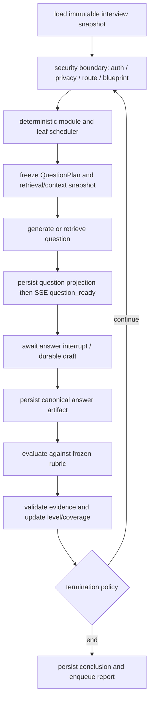
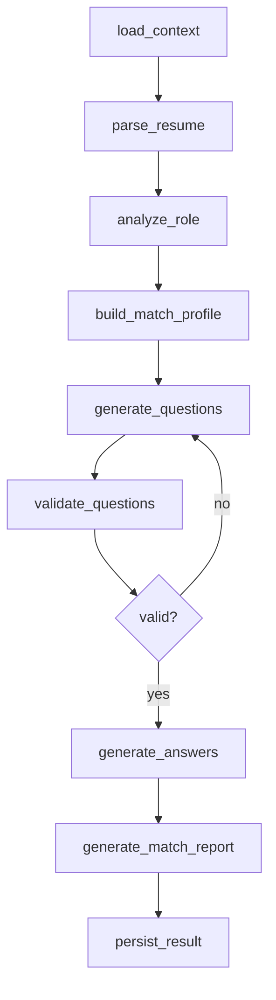
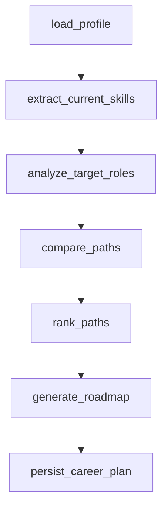
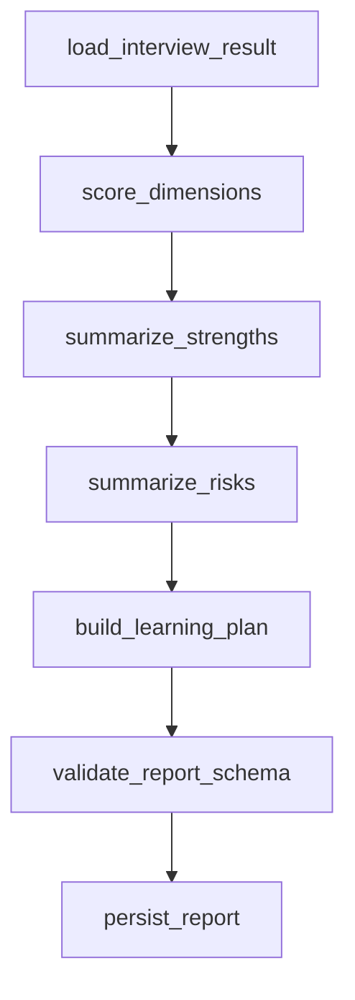

# LangGraph 架构方案

## 为什么用 LangGraph

模拟面试不是普通聊天。它需要：

- 可恢复的长会话。
- 明确状态机。
- 流式输出。
- 等待用户回答。
- 失败后重试。
- 报告异步生成。
- prompt 与模型调用可追踪。

LangGraph 的持久化、checkpointer、event streaming、interrupt 和 subgraph 能力适合这个场景。

> **实现状态（对齐 `packages/ai-graphs/src` + `worker/main.ts`，区分已接线 vs 计划）**：
> - ✅ **代码已接线，并有本地证明**：模拟面试使用**自适应 Agent**；生产组合根把 `ADAPTIVE_INTERVIEW=0` 视为启动错误，旧固定题单不能作为回退路径。正式拓扑见 [agent-harness.md](./agent-harness.md) §2.3，非下文 Graph 2 旧示意。报告生成、简历押题和简历诊断也有各自 worker 链路。
> - ⬜ **未建**：**Graph 3 职业路径分析（career-path）尚无对应图文件**，为计划态。
> - 🟡 **部分接线**：跨会话精确题目去重和历史弱项软偏置已在自适应面试主链路运行；语义长期用户记忆、冻结 snapshot 与向量召回仍未接线（见 [memory-context-design.md](./memory-context-design.md)）。
> 上述“已接线”不等于已经在云生产环境验证。当前可运行、已验证和发布阻断项以 [运行时事实矩阵](../current-runtime-truth.md) 为准。下面四张图为编排蓝图；具体拓扑以 agent-harness.md 为准。本文 Graph 2 和下方 `MeetwiseGraphState` 都是历史设计示意，**不是**当前运行时类型、不是 raw answer 存储方案，也不能作为长时 transcript 的实现依据。

## 当前短流程与目标长时专家面试的边界

当前图适合“当前题 → 当前答 → 当前评估”的有界面试，**不等于**用户可回放的完整面试，也不等于一到两小时专家级面试。现有 checkpoint 用于恢复图的 pending 工作，不是用户可见 transcript；浏览器 SSE 和短期 answer job payload 也不是长期原文存储。短流程长度由覆盖/证据政策决定：软预算可上调，绝对杀开关默认 120 只防 runaway（不是产品硬顶 8 或 16），固定角色和评分边界以 [运行时事实矩阵](../current-runtime-truth.md) 为准。

目标设计在 [长时专家面试运行时用例](../../requirements/use-cases/expert-long-interview-runtime.md) 中冻结，当前仍为 `draft`，不得据此描述任何生产能力。它不把“加大 maxTurns”当方案，而是新增四类相互独立的业务事实：

| 对象 | 为什么不能复用 checkpoint / SSE | 关键约束 |
| --- | --- | --- |
| `InterviewTranscriptItem` / `InterviewAnswerArtifact` | checkpoint 允许工作态重放，SSE 允许重复和断线；二者均不保证用户可见原文、保留期或删除枚举。 | 加密原文只存在 canonical answer artifact；用户可见 item 只引用 canonical record；内部 prompt/CoT/tool payload 不进入 transcript。 |
| `InterviewViewSnapshot` | 页面先后读 snapshot 和订阅 SSE 时会有竞态。 | 同一 RLS read transaction 固定 `highWatermark` 与可见 item；cursor 绑定 interview/watermark/privacy epoch，客户端只消费其后的 event tail，并按稳定 ID 去重。删除、撤权或 epoch 不符只能得到不可枚举 `fenced/invalid`。 |
| `InterviewBlueprintSnapshot` | 图 state 不能承担可变岗位、题库和时长策略。 | 冻结 module/time/coverage/route/rubric/prompt/taxonomy 版本、最大题数和终止策略；开始后 job 编辑不改旧面试。 |
| `CompetencyLevelAssessment` | 工作年限、单题分数和一个 overall score 都不能代表能力等级。 | 初始等级只是 hypothesis；按跨题、跨模块的 rubric evidence 上/下调，输出不确定性和覆盖缺口。当前代码只有 [控制信号 hook](../../requirements/use-cases/interview-control-signals.md)（`early_weak` / `thrashing`），**不是**本对象。 |

目标长时图的确定性骨架如下；标有“边界复核”的步骤不是普通 LLM node，而是每次读取、外送和写入前都必须执行的授权/epoch/版本围栏。



安全规则：Graph state 只保存 IDs、版本、摘要和安全 decision ref，不能保存 JWT、模型密钥、raw resume/raw answer、RAG 原文、任意 URL 或授权 capability。当前图里的 `answerId` 只是短期 reference，不是 canonical answer artifact。候选人文本、RAG/Web 文本和 recall 都按不可信数据分隔渲染；模型输出必须先过 schema、evidence、rubric、业务状态和当前 privacy/route 复核，才可以产生 event、评分、report 或 B 端投影。模型不能自行选择 tenant/scope、扩大检索、修改终止条件或绕过删除围栏。

## Graph 分层

```text
packages/ai-graphs/
  src/
    shared/
      state.ts
      schemas.ts
      model-router.ts
      validators.ts
    graphs/
      resume-quiz.graph.ts
      mock-interview.graph.ts
      career-path.graph.ts
      report.graph.ts
    nodes/
      parse-resume.ts
      analyze-role.ts
      generate-question.ts
      evaluate-answer.ts
      generate-report.ts
```

## 共享状态

```ts
// 历史概念示意，非 packages/ai-graphs 当前运行时状态类型。
// `recentMessages` 不得被实现为 raw answer 或用户完整历史的 checkpoint 字段。
type MeetwiseGraphState = {
  userId: string
  resultId: string
  threadId: string
  serviceType: ServiceType   // 枚举与 graphName 映射以 glossary 权威表为准，禁内联（修闭合验证 open 桥）
  resumeVersionId?: string
  roleId?: string                    // 引用（命名对齐 data-model：Role）
  recentMessages: InterviewMessage[] // 历史示意；当前长历史账本尚未实现，不能据此落库
  currentQuestionIndex: number
  reportStatus: 'pending' | 'generating' | 'completed' | 'failed'  // AssessmentReport.status 的只读去规范化镜像，非第二状态机
  artifacts: {
    questions?: ForecastQuestion[]
    roleAnalysis?: RoleAnalysis
    answerEvaluations?: AnswerEvaluation[]
    reportId?: string   // 引用 AssessmentReport（独立聚合），不内联整份报告
  }
  runtime: { promptVersions: Record<string, string> }  // 成本/usage 由 invoke 关口两阶段 ledger 记真实账，不堆 graph state（修 #22，对齐 harness §5.4）
}
```

> **拓扑/state 以 [agent-harness.md](./agent-harness.md) §2.3/§5.4 为准**：本文 Graph 2 与上方类型是旧示意；正式拓扑拆 `genQuestion`/`awaitAnswer`(interrupt 重放安全)、删空节点 `decide_next`、补 `degrade` 边、report 走独立 run（非 Send/subgraph）。候选人模式答案不内联文本；当前 queue payload 的短暂 raw answer 例外并不构成认可的长期设计。`0126` 只禁止该明文与 ledger artifact 同身份并存，并禁止 `interview_event` 顶层 `answer`；不移除本例外，也不等于 01。切换图见 [interview-answer-dual-write-cutover.md](../backend/interview-answer-dual-write-cutover.md)。只有 `INT-TRANSCRIPT-00` 的删除授权/receipt 通过、并由 `INT-TRANSCRIPT-01` 的 ref-only migration 在真实组合根验证后，才可移除该例外；00 单独不取代 payload。

## Graph 1：简历押题



输出：

- `ForecastQuestion[]`
- `RoleMatchReport`
- `SkillGap[]`
- `LearningPriority[]`

## Graph 2：模拟面试

```mermaid
flowchart TD
  A["start"] --> B["opening"]
  B --> C["interrupt_wait_user_answer"]
  C --> D["evaluate_answer"]
  D --> E["decide_next"]
  E -->|follow_up| F["generate_follow_up"]
  E -->|next_question| G["generate_next_question"]
  E -->|end| H["closing"]
  F --> C
  G --> C
  H --> I["enqueue_report_graph"]
```



关键规则：

- `threadId = interviewResult.resultId`。
- 调用 LangGraph 时统一把 `thread_id` 作为可恢复会话键写入 configurable；业务侧保留 camelCase `threadId`。
- 用户回答通过 resume command 继续 graph。
- 等待用户输入必须由持久化状态表达，不能依赖内存连接。
- SSE 只负责把 graph events 推给前端，不拥有业务状态。

## Graph 3：职业路径分析（⬜ 计划态，尚无图实现）



输出：

- 推荐岗位方向。
- 能力差距。
- 阶段路线。
- 风险提示。

## Graph 4：报告生成

报告生成独立成 subgraph 或后台 job，避免阻塞面试主链路。



## 持久化策略

| 数据 | 存储 |
| --- | --- |
| graph checkpoint | Postgres checkpointer |
| 跨会话 lean memory（✅ exact episode + 弱项软偏置）；语义长期记忆（🟡 未接线，见 agent-runtime §9） | Postgres store / domain tables |
| 文件 | S3/MinIO |
| trace | `ai_invocation_traces` |
| prompt version | `ai_prompt_versions` |

## Streaming

前端不直接消费模型 token，而是消费业务事件：

```text
progress
assistant_message_chunk   # 非承载事实、不进业务校验（评分/报告先双校验后整体下发，不流式裸 token）
question_ready
waiting_user
answer_evaluated
report_generating
report_ready
error
```

这样可以替换模型或 graph 内部实现，不影响 UI 协议。

## Human-in-the-loop

需要等待用户输入或人工确认时：

- graph 使用 interrupt 或显式 `waiting_user` 状态。
- API 返回 `pendingInput` 给前端。
- 用户提交后使用同一 `threadId` resume。

## 质量门禁

每个 graph 必须有：

- state schema
- output schema
- prompt version
- golden task
- deterministic fixture
- model cost budget
- failure fallback
- trace and run record

## 第一阶段建议

先用 Graph API 建核心状态图。报告、路径推荐这类顺序较强的任务可以先用 Functional API 风格封装，但仍要记录 run 和 checkpoint。
