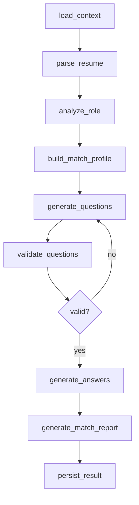
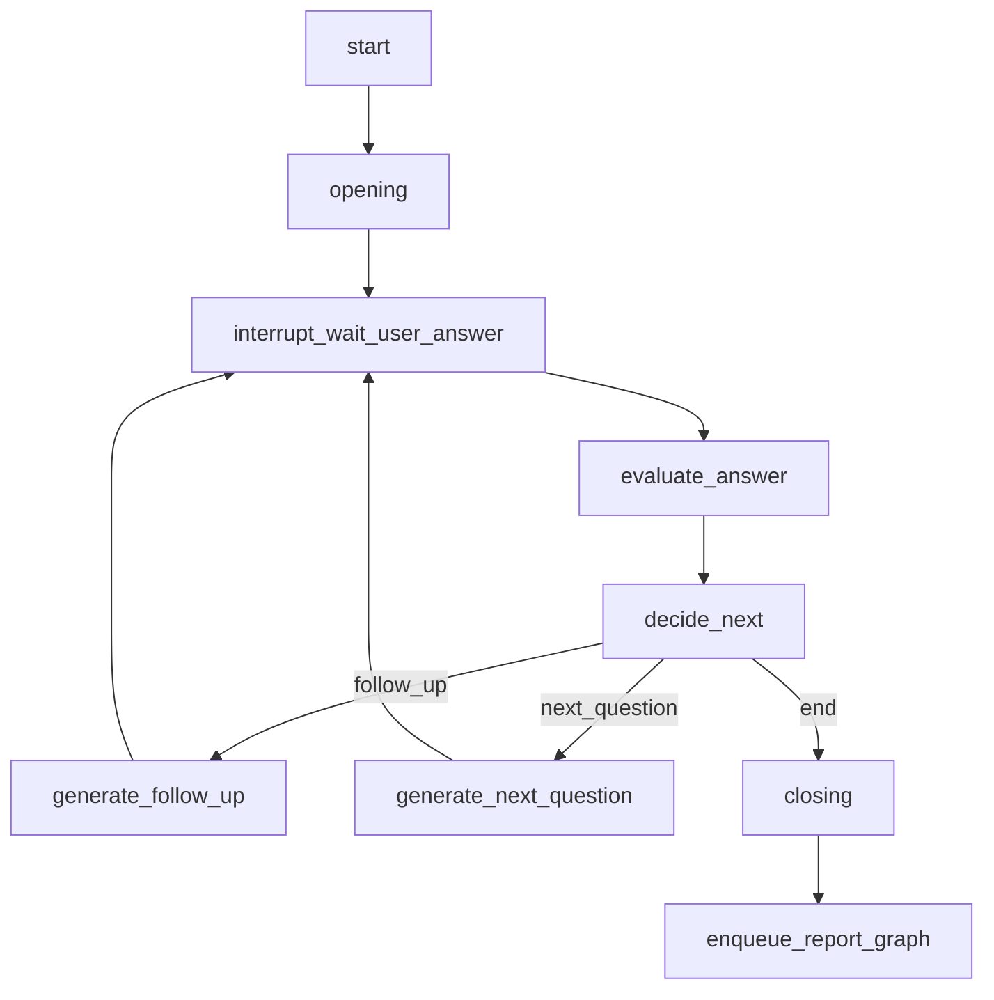
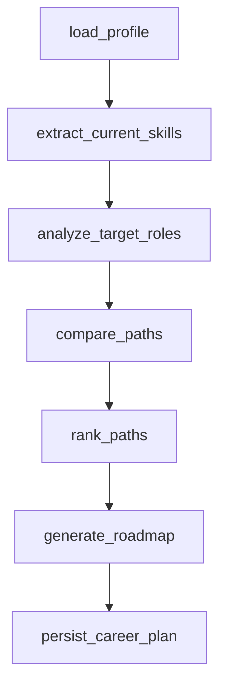
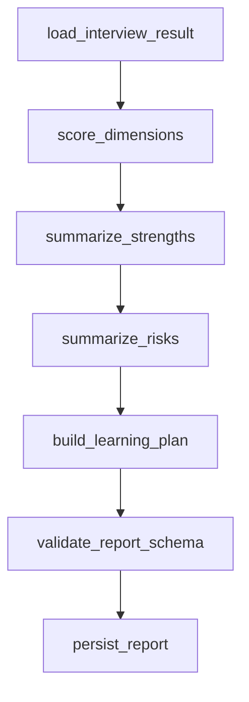

# LangGraph 架构方案

## 为什么用 LangGraph

模拟面试不是普通聊天。它需要：

- 可恢复的长会话。
- 明确状态机。
- 流式输出。
- 等待用户回答。
- 失败后重试。
- 报告异步生成。
- prompt 与模型调用可追踪。

LangGraph 的持久化、checkpointer、event streaming、interrupt 和 subgraph 能力适合这个场景。

> **实现状态（对齐 `packages/ai-graphs/src` + `worker/main.ts`，区分已接线 vs 计划）**：
> - ✅ **已接线运行**：模拟面试（现为**自适应 agent**，`ADAPTIVE_INTERVIEW≠0` 默认开；正式拓扑见 [agent-harness.md](./agent-harness.md) §2.3，非下文 Graph 2 旧示意）；报告生成（独立 worker 舱壁，见 Graph 4）；简历押题（resume-quiz）；简历诊断（resume-diagnosis）。
> - ⬜ **未建**：**Graph 3 职业路径分析（career-path）尚无对应图文件**，为计划态。
> - 🟡 **未接线**：下方"持久化策略"表里的"长期用户记忆"仅有 memory 模块代码、无生产接线（见 agent-runtime §9）。
> 下面四张图为编排蓝图；具体拓扑以 agent-harness.md 为准，本文 Graph 2 mermaid 是旧示意。

## Graph 分层

```text
packages/ai-graphs/
  src/
    shared/
      state.ts
      schemas.ts
      model-router.ts
      validators.ts
    graphs/
      resume-quiz.graph.ts
      mock-interview.graph.ts
      career-path.graph.ts
      report.graph.ts
    nodes/
      parse-resume.ts
      analyze-role.ts
      generate-question.ts
      evaluate-answer.ts
      generate-report.ts
```

## 共享状态

```ts
type MeetwiseGraphState = {
  userId: string
  resultId: string
  threadId: string
  serviceType: ServiceType   // 枚举与 graphName 映射以 glossary 权威表为准，禁内联（修闭合验证 open 桥）
  resumeVersionId?: string
  roleId?: string                    // 引用（命名对齐 data-model：Role）
  recentMessages: InterviewMessage[] // 有上界的近窗；长历史落 InterviewEvent 账本，不无界堆 state
  currentQuestionIndex: number
  reportStatus: 'pending' | 'generating' | 'completed' | 'failed'  // AssessmentReport.status 的只读去规范化镜像，非第二状态机
  artifacts: {
    questions?: ForecastQuestion[]
    roleAnalysis?: RoleAnalysis
    answerEvaluations?: AnswerEvaluation[]
    reportId?: string   // 引用 AssessmentReport（独立聚合），不内联整份报告
  }
  runtime: { promptVersions: Record<string, string> }  // 成本/usage 由 invoke 关口两阶段 ledger 记真实账，不堆 graph state（修 #22，对齐 harness §5.4）
}
```

> **拓扑/state 以 [agent-harness.md](./agent-harness.md) §2.3/§5.4 为准**（修闭合验证拓扑漂移）：本文 Graph 2 是旧示意；正式拓扑拆 `genQuestion`/`awaitAnswer`(interrupt 重放安全)、删空节点 `decide_next`、补 `degrade` 边、report 走独立 run（非 Send/subgraph）。候选人模式答案不内联文本。

## Graph 1：简历押题



输出：

- `ForecastQuestion[]`
- `RoleMatchReport`
- `SkillGap[]`
- `LearningPriority[]`

## Graph 2：模拟面试



关键规则：

- `threadId = interviewResult.resultId`。
- 调用 LangGraph 时统一把 `thread_id` 作为可恢复会话键写入 configurable；业务侧保留 camelCase `threadId`。
- 用户回答通过 resume command 继续 graph。
- 等待用户输入必须由持久化状态表达，不能依赖内存连接。
- SSE 只负责把 graph events 推给前端，不拥有业务状态。

## Graph 3：职业路径分析（⬜ 计划态，尚无图实现）



输出：

- 推荐岗位方向。
- 能力差距。
- 阶段路线。
- 风险提示。

## Graph 4：报告生成

报告生成独立成 subgraph 或后台 job，避免阻塞面试主链路。



## 持久化策略

| 数据 | 存储 |
| --- | --- |
| graph checkpoint | Postgres checkpointer |
| 长期用户记忆（🟡 模块已建、未接线，见 agent-runtime §9） | Postgres store / domain tables |
| 文件 | S3/MinIO |
| trace | `ai_invocation_traces` |
| prompt version | `ai_prompt_versions` |

## Streaming

前端不直接消费模型 token，而是消费业务事件：

```text
progress
assistant_message_chunk   # 非承载事实、不进业务校验（评分/报告先双校验后整体下发，不流式裸 token）
question_ready
waiting_user
answer_evaluated
report_generating
report_ready
error
```

这样可以替换模型或 graph 内部实现，不影响 UI 协议。

## Human-in-the-loop

需要等待用户输入或人工确认时：

- graph 使用 interrupt 或显式 `waiting_user` 状态。
- API 返回 `pendingInput` 给前端。
- 用户提交后使用同一 `threadId` resume。

## 质量门禁

每个 graph 必须有：

- state schema
- output schema
- prompt version
- golden task
- deterministic fixture
- model cost budget
- failure fallback
- trace and run record

## 第一阶段建议

先用 Graph API 建核心状态图。报告、路径推荐这类顺序较强的任务可以先用 Functional API 风格封装，但仍要记录 run 和 checkpoint。
