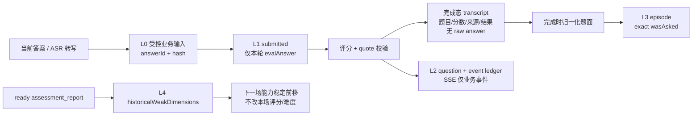
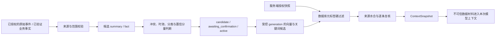

# 面试 Agent 的记忆分层与上下文预算

> 结论：当前 Meetwise 不是“带语义长记忆的聊天 Agent”。它是有界面试状态机：本轮评分只读当前题答；跨会话只接入精确题目去重和历史弱项的只读软偏置。语义记忆、用户信念画像、自动摘要压缩都未上线。

## 1. 分层：不同数据不能混成一个向量库

| 层 | 当前状态 | 保存什么 | 禁止项 | 生命周期 |
| --- | --- | --- | --- | --- |
| L0 原始业务输入 | 已接线 | 当前作答、`answerId/hash`、题目身份 | 不经 SSE 回放原文；不当长期记忆 | 业务保留策略；仅本轮评分读取 |
| L1 工作记忆 | 已接线 | `pending`、`submitted`、能力状态、题目来源、checkpoint | 完成态 `transcript` 不复制 raw answer | 一场面试，`maxTurns` 默认 8 |
| L2 会话审计 | 已接线 | question ledger、事件账本、评分、报告聚合 | 不用 checkpoint 当业务事实源 | 状态机/审计策略决定 |
| L3 跨会话情景记忆 | 已接线且刻意窄 | 系统生成题目的归一化 `episode` | 不存答案、简历原文、电话转写、模型主观评价 | 面试完成后写入；owner RLS |
| L4 成长投影 | 已接线且只读 | `assessment_report` 中 `gap=true` 的维度名 | 不把旧分数并入本场；不改难度/confidence | 规划时作为排序 hint |
| L5 语义长期记忆 | 未接线 | 目标为可追溯、可过期的派生事实 | 不能把聊天或模型输出直接写成画像 | 先完成治理与评测才可上线 |



### L1：短期工作记忆

`pending` 保存服务端发出的题目身份、能力、难度、来源与 `stateVersion`。`submitted` 仅在 `awaitAnswer → evalAnswer` 之间携带 `answerId`（答案工件编号），评分节点在图外、owner（所有者）受限的短期边界水合正文；graph state（图状态）从不携带答案文本。完成态 `transcript` 留下可审计投影，不复制答案。

这保证刷新可恢复、双标签提交可按 identity 收敛、评分 prompt 不累积历史。它不是开放式多轮聊天：系统不应假称“记得半小时前任意自由对话”。当前自适应图只把“存在已授权简历画像”的布尔量带入节点；题面不得回显简历 facts（事实），因而新写入 checkpoint（检查点）不含答案正文或简历 facts。历史 snapshot（快照）的物理擦除、备份和 retention（保留期）仍是独立隐私任务；旧 thread（线程）撤销入口因授权根不足已在 `0075` 安全暂停，`0076` 会隔离升级前未终态 target（目标），`0078` 还会拒绝暂停父请求下的任何 worker list/claim/purge（列出/领取/清理），不能把现有检查点写栅栏表述为可用删除能力。

### L3：精确去重，而非语义去重

面试完成后，`recordAskedQuestions` 把**我方生成题面**做小写、首尾清理和空白压缩，写成 `kind='episode'`。下一场生成同题时 `wasAsked` 命中，会最多重生成一次；失败或仍重复也不会卡死面试。

“Redis 如何实现锁”与“Redis 锁的过期风险”在当前设计里是不同题，避免向量相似误挡合理深追。读写均经过 owner RLS；因只存系统题面，答案、简历和 ASR 不会作为长期记忆扩散。

### L4：历史弱项只能软影响出题顺序

`pastWeakDimensions` 只读 `status='ready'` 的报告中 `gap=true` 维度。若本轮 planner 已提出 `[并发, 缓存, 沟通]`，历史 gap 是 `[缓存]`，则重排为 `[缓存, 并发, 沟通]`。它不新增岗位无关能力、不影响难度和 confidence，也不把旧分数计入本场，避免确认偏差闭环。

## 2. 当前“上下文压缩”实际是什么

当前是**任务隔离 + 分服务字符封顶**，不是语义摘要：

| service | user data 上限 | 模型收到的历史 | 超限动作 |
| --- | ---: | --- | --- |
| `mock-interview.evaluate` | 12,000 字符 | 当前题 + 当前答 | 保留前缀，加带随机 nonce 的截断标记 |
| `interviewer.ask` | 16,000 字符 | 能力、受限检索材料与“画像可用”布尔量；不带简历事实或答案 transcript | 同上 |
| `report.generate` | 8,000 字符 | 服务端聚合 summary | 同上 |
| `resume-quiz.generate` | 20,000 字符（默认） | 对应任务输入 | 同上 |

入口拒绝超过 8,000 字符的面试答案；用户数据固定在随机 `<data-…>` 围栏，不可拼入 system prompt。优点是用户贴 20 万字也不会让模型收到整段。局限同样明确：

1. 是头部截断，结论在末尾会丢；没有提取关键事实。
2. 按字符，不是 provider tokenizer 的精确 token 预算。
3. 没有统一的 `ctxTokens > window - reserve`、`transformContext`、中段摘要或 `firstKeptEntryId`。
4. 200k/128k/32k 测试使用 `ceil(chars × 0.6)+300` 近似；8k 窗口下 `interviewer.ask≈9,900 token`、`resume-quiz≈12,300 token` 放不下。

## 3. 已实跑的量化边界

| 命令 | 实际结果 | 能证明 | 不能证明 |
| --- | --- | --- | --- |
| `pnpm memory:prove` | 2026-08-10：64 个迁移后的隔离 PostgreSQL（关系型数据库）11/11 通过；回执 `2026-08-10T10-08-16-315Z-82261-1b450349-dd23-4396-aa64-016c36ea8309.json`，`releaseEvidence=false` | exact episode、弱项只读、RLS（行级安全）、不写答案/手机号 | 语义记忆已接线、完整删除权或云端数据面 |
| `pnpm stress:prove` | 2026-08-10：64 个迁移、当前 v64 队列与自适应图，5 轮累计约 52k 字；评估 data（数据区）`≤12,000`，等长轮次输入极差 `14` 字；8,000 字答案消费后 job payload（任务载荷）无 answer（回答） | 评分 prompt（提示词）不随 transcript（转录）线性膨胀；8k 作答的队列清理、SSE（服务器推送事件）不回放正文和报告舱壁可跑 | provider tokenizer（供应商分词器）精确预算、真实模型质量、历史 checkpoint 或外部数据面的物理擦除 |
| `pnpm window:prove` | 36 万字输入被封到 8k–20k；200k/128k/32k 近似预算通过 | cap 有效且单次输入有界 | 精确 tokenizer、语义摘要、8k 模型兼容 |
| `pnpm -C packages/ai-graphs prove:adaptive-graph` | 完成态 `transcript` 无 raw `a`，`submitted=null`；逐条枚举 MemorySaver（内存检查点）`list/getTuple` 全部历史 tuple（元组），答案与简历 fact marker=0 | 新图状态、interrupt 与生成题接缝不把原始答案/简历事实写入 checkpoint | 旧历史、备份与外部数据面的物理擦除 |

## 4. L5 语义长期记忆的正确上线方式（目标）

不要做 `answer → embedding → 下次 prompt`。最低流程是：受控来源（已完成报告或用户确认事实）→ 确定性候选事实 → 校验 purpose、consent、PII 和来源 → 冲突/去重 → 派生摘要与 embedding → 会话开始时冻结 `snapshotId` → RLS 过滤后 Top-K recall，且只作 hint。

每条 memory 至少应有：`memoryId, ownerId, kind, sourceId/sourceVersion, purpose, consentVersion, createdAt, expiresAt, salience, trust, contentHash, embeddingVersion, status(active/disputed/expired/deleted)`。模型输出只能当候选，不能直接成为 active memory；原文存加密业务源，不放 memory 文本。撤回/删除必须同时失效行、向量、缓存、会话 snapshot 与观测索引。

上线前必须给出独立人工标注的 fact precision/recall、跨 owner 泄露数（必须 0）、过期记忆命中数、错误记忆影响题目数、撤回传播 P95/P99 和确认偏差切片。没有这些数据，L5 保持未接线。

### L5 的完整目标链路：全量受控事件不是全量 prompt

如果产品要支持长自由对话，原始信息、摘要、事实和向量索引必须分层，不能只新增一个 `memory` 表或把聊天原文整体 embedding：

```text
授权且仍在保留期内的加密 conversation_event（唯一原始事实源）
  → 单轮结构化摘要（turn summary）
  → 连续完整轮次摘要（segment summary，可递归）
  → 会话摘要（session episode）
  → 经用户确认或业务校验的长期事实（active / disputed / expired）
  → 先授权过滤、再 hybrid 检索的候选来源
  → 本次模型请求冻结的 ContextSnapshot
```

`conversation_event` 应按 `(owner, thread, sequence)` 追加写。正文保存为加密工件，关系行仅保存事件类别、工件 hash、来源、purpose、consent version、retention、privacy epoch 和时间；不保存模型内部推理。LangGraph checkpoint 仍只保存事件或 snapshot 引用，不能成为原始聊天库。

每个摘要是可废弃的派生物，而不是事实源。它至少绑定：连续来源事件范围、来源 digest、父摘要或子摘要版本、摘要 hash、prompt/model/tokenizer/policy version、结构化 claims 及每个 claim 的来源 span、状态（`active/superseded/invalidated/deleted`）与 CAS version。摘要无法逐项回溯到来源时，必须失效；模型不能用“看起来合理”的摘要补齐未知事实。

多轮压缩采用摘要树，而不是反复覆盖一段滚动文本：保留最新完整轮次，较老的完整 turn 合并为 segment，多个 segment 再形成 session episode。这样发生纠错、撤回或删除时可精确失效受影响的父节点并从未受影响的来源重算，不会让一条旧摘要成为不可拆分的黑盒。

向量索引只解决候选召回，不能替代业务事实。写索引前应绑定 source version、内容 digest、embedding revision、purpose、consent、expiry 和 privacy epoch；查询先做 owner、thread/可共享范围、purpose、consent、状态、时间和删除围栏过滤，再执行向量/关键词混合检索。每个命中必须回水合为预算内的来源卡片（摘要或原文授权片段）及 provenance；模型看到的是带不可信数据边界的材料，不是“向量命中即真相”。

每次调用前生成 `ContextSnapshot`，冻结本次实际选中的来源版本、预算、检索策略和渲染 digest。同一轮崩溃恢复必须使用同一 snapshot；新的事件、记忆修订或撤回仅影响下一轮。压缩和 snapshot 写入使用 `(owner, thread, source-range, version)` lease/CAS；CAS 失败直接丢弃计算结果，已派发后的模型不确定结果不自动重发。

现有删除、撤回和外部回执未闭合前，禁止把上述原文、摘要或 embedding 写成跨会话生产数据。完整逐项任务、勾选和关闭证据见 `delivery/production-readiness-remediation-register.md` 的 `MEM-00` 至 `MEM-14`。

### L5 目标态的写入、压缩与召回触发

触发不是“每 N 轮就摘要”或“每句话都写长期记忆”。阈值由 service/model 的已校准预算和明确业务事件决定，并持久化到 snapshot，便于重放和调参。

| 动作 | 允许触发 | 必须先满足 | 不允许的触发 |
| --- | --- | --- | --- |
| 原始事件落库 | 用户输入在鉴权、幂等和所属 thread 校验后被接受；服务端工具结果或业务状态变更完成校验后 | 加密工件、owner RLS、purpose/consent、retention、privacy epoch、追加顺序 | 流式裸 token、模型内部推理、未通过 schema/业务校验的写入。 |
| 生成候选摘要 | 一个连续事件范围已经稳定：完整 turn、完整 tool-call/result 对、明确话题/任务收束；或后台发现该范围已接近将来预算阈值 | 来源事件已提交；摘要任务绑定 source range/digest/version；结果先校验 claim→source span | 在半个 turn、未完成工具、来源仍会变化或删除围栏已生效时摘要。 |
| 强制压缩 | **模型派发前**，完整渲染估算超过该 service/model 可用输入预算时 | 预算包括系统提示、授权、schema、工具、RAG、snapshot、recent turns、输出 reserve 和安全余量；有可用的已验证摘要或确定性降级路径 | 收到 provider 超窗错误后盲目压缩重发；已派发但结果 unknown 时同键重试。 |
| 写长期事实 | 用户显式要求记住/确认，或受信业务事实已确定；模型只可提出 candidate | 来源 span、purpose、consent、有效期、冲突关系和写前校验齐全 | 将模型摘要、评分猜测或一次闲聊直接升级为 active 用户画像。 |
| 建立/更新向量索引 | 已验证的摘要/事实，或有明确授权和脱敏规则的事件片段版本已冻结 | source version/digest、embedding revision、purpose、expiry、privacy epoch 均已写入；删除 target 已可用 | 把全量原文无差别外送 embedding，或将 vector hit 当作事实。 |
| 记忆召回 | 路由明确需要跨 turn/跨会话上下文，且当前主体、purpose 和授权范围允许 | 先查当前业务真相和精确实体，再按 owner/purpose/consent/epoch/status/time 过滤；结果进入本轮冻结 snapshot | 每次请求无条件召回；评分、付款、删除等高影响决策直接以记忆摘要作事实依据。 |

预算器首先计算：

```text
availableInput = contextWindow
  - maxOutput
  - toolReserve
  - safetyMargin
```

`renderedInput` 必须覆盖系统提示、数据围栏、JSON schema、工具信封、RAG、已选 snapshot、最近完整 turn 和候选摘要。若模型有可信 tokenizer，使用它；否则使用经 usage 校准后的保守上界。`compactAt`、保留的最近完整轮次、Top-K 与摘要粒度均是按 model/service 版本配置并通过评测确定的值，不在代码中写成固定“第 5 轮”。

候选摘要可以在稳定边界后异步预生成，以避免用户发送下一条消息时才增加一次模型等待；但只有在调用前的 `ContextSnapshot` 选择它时才生效。若没有足够预算的已验证摘要，系统宁可确定性地减少可选材料、请求澄清或暂缓该自由对话操作，也不能让模型用未经验证的压缩文本补齐历史。

### L5 目标态的管理控制面：治理不属于召回函数

记忆能力必须有独立控制面；不能给普通 runtime 一组原文、摘要和向量表权限，再依赖应用代码自觉过滤。第一期范围只限 C 端个人自由对话，明确排除现有面试评分、招聘候选人数据和通用管理员浏览。

| 对象 | 独立状态机 | 谁能触发 | 管理要求 |
| --- | --- | --- | --- |
| event | `active → privacy_fenced → purged` | 受控采集命令、隐私流程 | 原文加密；只追加；到期、撤回或删除后不可再被 hydration。 |
| summary | `draft → verified → active → superseded / invalidated / fenced → purged` | summarizer 只能产生 draft；受控验证命令激活 | 不原地覆盖；父节点失效时传播；每个 claim 可回溯来源。 |
| fact | `candidate → awaiting_confirmation → active → superseded / disputed / expired / revoked / fenced → purged` | 用户确认或受信业务事实；模型只能创建 candidate | 用户可纠正、撤回或遗忘；冲突事实并存且显式关系，不能静默覆盖。 |
| index generation | `building → validated → shadow → active → deprecated → retired`，或 `failed / aborted` | indexer 构建；policy releaser 受控切换 | 从冻结、仍授权的 manifest 构建；每行绑定来源版本、recipe、consent 和 privacy epoch；不能直接改 active 索引。 |
| ContextSnapshot | `issued → consumed / expired / voided` | runtime 只可创建并消费本 owner 的短期快照 | 撤回、删除、授权或版本漂移立即 void；不作为长期原文副本。 |

用户侧至少需要：查看自身记忆卡片及来源、确认或纠正 candidate、暂停后续采集、撤回单条事实、遗忘会话/全部记忆、取得导出与删除进度。所有动作产生追加审计事件和受限命令，不能把一条 `UPDATE content` 当作“纠正”。

运行与运营侧最小分权如下：`memory_runtime` 只能经受控 recall 函数读取本 owner 且当前 purpose/epoch 有效的来源卡片；`memory_summarizer` 只能从冻结范围写 draft；`memory_indexer` 只能消费批准 manifest 写 building generation；`memory_reviewer` 才能确认高影响事实，且原文访问需单次、目的限定、审计化授权；`memory_policy_releaser` 仅可经双人审批发布 policy/recipe 或切换批量 reindex，默认不能读用户正文。`privacy_authorizer` 和 `privacy_worker` 必须与以上角色分离，先 fence 再逐 sink 清理。

缓存也属于控制面：检索排序缓存、来源水合缓存和 snapshot 缓存各自的生命周期不同，但每次命中都必须重验当前 `privacyEpoch`、consent version、purpose 和对象状态；不得仅凭旧 key 命中。索引重建采用新的 generation，旧 generation 只能在仍有效的冻结 snapshot 中短期受控读取；撤回或删除要 tombstone 受影响 generation，禁止旧向量恢复已遗忘内容。

当前 consent 和删除能力未满足以上授权、撤回和逐 sink receipt 契约，因此本节仍是目标设计，不能先建表或开启写入。完整任务见 `PRD-TEST-013` 与 `MEM-10`、`MEM-11`。

### L5 的准入门与召回门：先判断，后入库；先许可，后使用

长期记忆不是一张“内容 + embedding + score”的表。任何可跨 turn（轮次）或跨会话保存的信息都先是**候选**，必须经过来源、范围、目的、冲突、时效和风险判断；任何检索命中也都只是**候选材料**，必须在模型派发前重新水合、复核并冻结。两道门都不能依赖客户端传入的 `owner`、`purpose`、`projectId` 或模型自行声明的 `factKey`。



#### 先区分三个身份，再讨论 tenant 或 project

每条记忆的不可变范围不是单一 `ownerId`，而至少分开以下三类对象：

| 维度 | 含义 | 规则 |
| --- | --- | --- |
| `dataSubject` | 内容关于谁，例如 C 端用户或招聘候选人 | 不能由“当前登录者是谁”推断；C/B 数据默认绝不互通。 |
| `controllerScope` | 谁控制存储、撤回与保留，例如 C 端个人或 B 端 tenant | 首期只允许 C 端个人范围；tenant 不是个人记忆的隐式父范围。 |
| `accessPrincipalContext` | 本次请求是谁、在什么成员关系下访问 | 由服务端授权快照派生，不能取自请求体或可伪造的 GUC。 |
| `thread/project boundary` | 哪个会话或未来项目边界允许共享 | 当前没有可治理的 Project 领域对象；在有稳定父实体、成员关系、转移和删除规则前，不得仅增加可传入的 `projectId` 字段。 |

跨 thread、跨 user、跨 tenant 或未来跨 project 的读取，一律需要显式、版本化的 share grant（共享授权）；相同账号、同一 tenant 成员或向量相似都不是共享理由。每个 memory、summary、fact、embedding row、缓存项和 snapshot 都须携带服务端派生的范围版本，且数据库查询在候选检索**之前**以该范围作硬谓词。不能先全局 ANN（近似最近邻）检索、再在应用层过滤。

#### 准入元数据与事实真值不是同一个分数

新的物理模型不能复用当前只有 `owner/kind/content/sourceId` 的 `user_memory` 作为捷径。event、summary、fact 和向量记录至少需要下列可校验元标签：

```text
controllerScope + dataSubject + scopeKind + thread/project boundary
+ purpose + allowedDataClass + consentRevision + privacyEpoch + retention/expiresAt
+ sourceType + sourceEntityId + immutableSourceVersion + eventSeq/sourceRange
+ sourceArtifactDigest + spanLocator + normalizationRecipeVersion
+ producerClass + extractionRecipeVersion + verificationRecipeVersion
+ status + policyVersion + contentDigest + embeddingRecipe/generation + language
```

`spanLocator` 必须固定一种坐标制（UTF-8 byte offset 或 Unicode code-point offset），并在整个系统中一致；不能把 JavaScript UTF-16 下标混入。summary 的每个 claim 必须沿 DAG（有向无环图）回到原始 event 或已验证业务事实，而不能只再指向另一段 summary。中文、emoji、NFC/NFD、代码块和转写文本均是必须覆盖的边界。

以下量相互独立，任何一个都不得被检索排序分数覆盖或“加权成事实真相”：

| 字段 | 回答的问题 | 不能用来做什么 |
| --- | --- | --- |
| `sourceTrust` | 这个来源类别是否受信 | 不能替代当前授权或来源完整性校验。 |
| `extractionConfidence` | 抽取/结构化是否可靠 | 不能把模型自评升级成用户事实。 |
| `verificationState` | 用户或受信业务规则是否确认 | 未确认时不得让 candidate 变为 active。 |
| `freshness` / `expiresAt` | 信息仍是否适用 | 不能只靠夜间过期扫描；查询时必须按绝对时间拒绝。 |
| `salience` | 是否值得保留或优先候选 | 不能扩大可见范围。 |
| `retrievalScore` | 对本次 query 的相关性 | 只能参与候选排序，绝不提升可信度。 |

长期关键事实还要有稳定 `factKey`：范围、data subject、purpose、分类器版本、规范实体/属性和 locale（地区/语言）共同组成键。单值 key 同时只能有一个 `active` 版本；多值 key 必须在 policy 中定义并存规则。冲突不能静默覆盖：新候选与旧事实之间写入 `contradicts` 或 `supersedes` 关系；模型候选只可 `candidate`，用户纠正或受信业务验证才可决定 `active`、`superseded` 或 `disputed`。

#### 准入、召回和使用的固定顺序

写入的最小顺序是：服务端从当前授权与业务对象生成 snapshot → 校验原始来源版本、摘要和范围 → 生成 candidate → 在同一 scope/factKey 下检查冲突、时效、分类、保留和确认要求 → 用 CAS（比较并交换）写入状态和追加审计事件 → 仅对仍 `active` 且可 embedding 的版本建立 index generation。模型或用户输入携带的 `sourceId`、`factKey`、purpose、scope 只可作为待校验材料，不能改变服务端归类。

召回分为两段：

1. **数据库候选阶段：** 受控函数基于当前服务端 authorization snapshot（授权快照）先过滤 `controllerScope/dataSubject/thread/project/purpose/consentRevision/privacyEpoch/state/expiresAt/dataClass/embedding generation`，再执行向量与关键词混合候选检索。
2. **水合与使用阶段：** runtime 对每个候选重新读取来源版本与 span，重算 digest，并复查 RLS（行级安全）、成员关系、share grant、撤回/删除、冲突状态、时效、数据分类和实际预算。任一条件不符即丢弃；通过的材料才作为不可信数据块写入 `ContextSnapshot`，连同候选集、拒绝原因、最终来源版本、策略、预算与渲染摘要一起冻结。

因此“召回到了”不等于“可以使用”。支付、删除、权限判断、招聘决策和面试评分等高影响路径不能把 semantic fact（语义事实）当授权依据或唯一业务真相；它至多提示系统读取受控的业务真相或请求用户澄清。cache 命中也必须重验 scope、purpose、consent、privacy epoch、membership/share-grant、状态和 `expiresAt`，不得回退到旧 summary、旧 generation 或旧 snapshot。

完整状态机、命令边界和七类测试见 `requirements/use-cases/memory-governance-and-recall.md`；逐项落地登记见 `PRD-TEST-011` 的 `MEM-12` 至 `MEM-14`。在 `MEM-00` 与 `PRD-TEST-013` 完成前，本节仍是禁用的目标设计。

## 5. 真正的主动语义压缩（目标）

当产品需要长自由对话时，压缩必须是可重放图节点，不应在 reducer 偷调模型：

1. 用实际 usage/tokenizer 预算 `system + snapshot + tools + RAG + recent + outputReserve`。
2. 超过 `contextWindow - outputReserve - toolReserve` 时，固定系统提示和权限快照，保留当前题答与最近完整 turn。
3. 对较老连续事件生成版本化摘要，写 `startEventId/endEventId`、source checksum、prompt/model version、fact refs、token estimate、`summaryId`。
4. 摘要经 schema、事实引用和冲突校验；失败时少带旧上下文或澄清，不能编造记忆。
5. `(tool_call, tool_result)` 只能成对压缩；大结果存对象引用，state 留 `ref + 摘要 + hash`。
6. 摘要和 `firstKeptEventId` 用 CAS 写入；resume 从同一边界重放。

验收指标应包括事实保留率、错误摘要率、压缩后任务成功率、P95 首 token、压缩触发率、重放一致性、压缩成本与撤回残留，而不是只看 token 变少。

## 6. 面试时的诚实回答

> 我把记忆拆成工作态、审计事实、跨会话 episode 和报告投影，而不是把所有聊天向量化。当前评分只读当前题答，完成态 checkpoint 不复制原始答案；跨会话只做精确题目去重和历史弱项软排序。长输入目前靠任务隔离和分服务上限，不是语义摘要。若要上长期语义记忆，我会先做 purpose/consent/TTL/source version、冻结 snapshot、可删除向量和双标评测；在这些没齐前，我不会说 Agent 已经“记住用户”。
