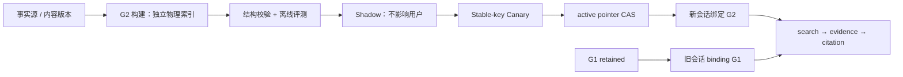

# RAG 生产版本、灰度与回滚 Runbook

## 先给结论

生产 RAG 的一个“版本”不是 `embedding model = text-embedding-3`，也不是一个 index 名。它是一个不可变的 **检索制品（artifact）**：

```text
artifact = {
  corpus_snapshot,
  parser + OCR/ASR + cleaner,
  chunker + table/image serialization,
  embedding provider/model/revision/dimension/normalization,
  index build parameters,
  dense/lexical/rerank retrieval policy,
  ACL/visibility policy,
  prompt data-envelope policy,
  evaluation dataset revision + release policy
}
```

其中任意一项变化，都可能改变“召回了什么、能否读取、引用能否回跳、成本与延迟”。因此发布的最小单位是 artifact 对应的 **generation**，而不是一批原地更新的向量。

高可用不等于“永不失败”，更不等于能保证答案 100% 正确。这里的可验证目标是：构建或候选版本失败时，已激活 generation 仍可服务；每个请求只读一个明确 generation；会话不中途切空间；切换和回滚是一次数据库 CAS；私有资料、已撤回资料和失效 citation 的返回数必须为 0。

## 0. 运行时费用与可观测性硬门（已接入 qbank 查询路径）

检索增强生成（RAG）查询不是只有向量库 CPU 成本：cache miss 会触发 embedding（向量化）供应商调用，低置信时还可能触发受限外部探索。生产环境必须设置 `RAG_COST_ENFORCEMENT=enforce`；缺少以下任何一项，worker 会在启动阶段拒绝提供 RAG，而不是以未设上限的方式上线：

- `RAG_EMBED_BILLING_PROVIDER / MODEL / REGION`：必须与实际 `EMBED_MODEL` 一致；不允许用一个模型的价格给另一个模型记账。
- `RAG_EMBED_PRICE_REVISION / INPUT_MICRO_CNY_PER_MILLION / PRICE_SOURCE_URL`：价格变更新建 revision；每一笔预留会固化当时的费率，历史账本不会被新价格覆盖。
- `RAG_EMBED_MONTHLY_BUDGET_MICRO_CNY / BUDGET_SCOPE / MAX_INPUT_TOKENS`：金额使用 micro-CNY（人民币微元，1 元 = 1,000,000 micro-CNY）整数，避免浮点误差；上限是在调用前预留的最坏输入 token 数，而非事后猜测。

一次 query embedding 的状态机如下：

```text
reserved → dispatching → settled
                 └────→ unknown（禁止自动重发，待供应商/人工对账）
reserved → released（仅限派发前本地失败）
```

`reserved`、`dispatching`、`settled` 与 `unknown` 均由 PostgreSQL 事务和行锁保存。预算不足、价格缺失或策略缺失发生在外部 HTTP 请求之前。HTTP 已派发而响应超时、格式损坏或结算提交失败时，系统无法证明供应商没有计费，因此将其保留为 `unknown`；相同持久 invocation id 的下一次请求只会被拒绝/降级，不会进行第二次调用。qbank lease takeover 也复用数据库中的同一 token，不能生成一个新的 token 绕过该账本。

这类降级不是语义上的“无结果”：CRAG（纠错检索）收到内部 degraded signal 后会选择 `deny_external`，不会再把预算拒绝伪装成空召回而转向 Web/deep search。用户路径可走无外发的通用题或澄清，但不会形成第二条未计费的外部成本路径。

Prometheus（监控时序数据库）必须抓取 worker `/metrics`。本仓库告警规则已绑定下列真实指标：`rag_retrieval_total{outcome,mode}`、`rag_retrieval_latency_ms`、`rag_cache_total{status}`、`rag_cost_decisions_total{decision}`、`rag_cost_budget_remaining_ratio` 与 `rag_cost_unknown_reservations`。`RagCostGovernanceDisabled`、`RagBudgetNearExhaustion`、`RagExternalOutcomeUnknown`、`RagBudgetRejected`、`RagRetrievalUnavailable` 分别覆盖未启用、预算接近耗尽、未知外部结果、调用前拒绝与持续降级。

发布前至少执行：

```bash
pnpm rag-cost:prove
pnpm rag-cost-config:prove
pnpm rag-cost-runtime:prove
pnpm rag-cache:prove
pnpm alerts:lint
```

这些 proof（可执行验证）已覆盖并发预算不超额、预留后按 provider usage 结算、派发结果未知不重发、跨实例 lease token 稳定、指标名与告警表达式一致。它们不替代供应商账单对账、真实流量成本基线或完整容灾演练；三者缺任一项，发布状态仍应是阻断。

## 1. 把四种版本分开，避免最常见的混淆

| 名称 | 内容 | 能否原地修改 | 作用 |
| --- | --- | --- | --- |
| 内容版本 `content_version` | 原文件事实、解析/清洗/切块 receipt、chunk、locator、hash | 否 | 用于回跳与审计。修改文件就是新版本。 |
| recipe | provider/model revision、dimension、归一化、document/query transform、chunker、检索策略 manifest | 否 | 定义向量和查询是否处于同一语义空间。 |
| generation | 一个内容快照按一个 recipe 构建出的独立物理索引 | 否 | 发布、灰度、回滚的最小服务单元。 |
| query binding | 某请求/会话实际固定的 generation + recipe + expiry | 除失效外否 | 保证长对话、报告生成与 citation 口径不漂移。 |

不要用一个 `model_version` 字段代替这四层。比如 OCR 升级、Excel 合并单元格展开规则变化、chunk overlap 改动，模型名称没变，检索结果和 citation 仍可能完全改变。

## 2. 线上数据面与控制面



**数据面**只做：按 binding 搜索、重新授权 evidence、保存 citation。它绝不选择“最新 index”。

**控制面**只做：建立 generation、写入/校验向量、评测、灰度、翻 active pointer、持有退役策略。它绝不在用户请求中进行全量重嵌。

数据库是控制面的线性化真相。多 worker 只能通过租约推进同一 rebuild；多实例切换只能通过一行 active pointer 的 compare-and-swap。把 active generation 放在进程内环境变量或 Redis 缓存会造成实例间裂脑，不能用作发布真相。

## 3. 运行状态机与禁止的捷径

```text
generation: building → shadow → gated → active → deprecated → retired
                         │          │
                         └── failed / aborted

binding:    active → expired / revoked
citation:   valid  → invalidated
```

- `building`：只写新索引，G1 仍服务。构建过程绝不向 active 表 `UPDATE embedding`。
- `shadow`：用脱敏、可授权的生产采样 query 和冻结标注集比较 G1/G2；不向用户返回 G2。
- `gated`：满足预先登记的门后才能获得有限稳定 hash 流量。
- `active`：只通过 active pointer CAS 获得。失败时切回 retained G1，不重嵌、不批量更新文档。
- `deprecated`：不能接收新 binding，已经绑定的会话仍可读，直至最晚 binding 过期和审计保留期结束。
- `retired`：确认无 active binding、无法律/审计保留依赖后才删除物理索引。

禁止三件事：

1. 在 G1 的物理表中更新 G2 的向量；这样会混空间且不能回滚。
2. 以“已有多少行”为由跳过 recipe/内容快照校验；行数相等不代表同一事实或同一 embedding 空间。
3. 让每个检索请求重新读取 active pointer；一次会话中的问题、评分和报告会引用不同知识版本。

## 4. 一次安全发布的逐步流程

### 4.1 发布前登记（change record）

发布负责人先登记 artifact manifest hash、变更类型、影响范围、数据分类、回滚目标和负责人。变更类型至少分为：内容更新、解析/切块更新、embedding/维度更新、索引参数更新、retrieval/rerank 更新、ACL 规则更新、prompt data envelope 更新。

这个步骤的目的不是审批表演，而是回答事故中的三个问题：**用户当时读了哪个 generation？其源内容是什么？该 generation 是否应该被撤回？**

### 4.2 生成 G2（不影响 G1）

1. 固化 `corpus_epoch` 和 member snapshot；构建只从这个清单取 chunk。
2. 用固定维度的独立物理表/分区写 G2；向量写入验证有限数、维度、非 NaN/Infinity、member 属于 snapshot、未 tombstone。
3. 记录 checkpoint、worker lease、心跳和每页 cursor。worker 崩溃后从 cursor 续跑；同一 `(generation, chunk)` 写入必须幂等。
4. 任一内容更新、撤回或擦除使 snapshot 失效时，G2 不能 promotion；必须从新 snapshot 重建或走经验证的增量协议。

**容量隔离**：构建的 CPU、IO、embedding QPS、队列和数据库连接池必须与在线查询隔离。否则“为升级建立索引”会把 P99 拖垮，已经不是高可用发布。

### 4.3 结构校验与影子评测

结构校验是 0 容忍不变量，而不是模型质量判断：

| 项 | 合格条件 |
| --- | --- |
| completeness | G2 member 数、可见数、向量数与冻结快照一致；重复数为 0。 |
| vector validity | 错维、NaN、Infinity、零向量和 recipe mismatch 均为 0。 |
| ACL/revocation | 跨 tenant、越角色、tombstone、已撤回 source 在 ANN、缓存和 evidence 三处命中数均为 0。 |
| citation | 任意返回 evidence 都能解析到 `document_id + content_version + chunk_id + hash + locator`；错位数为 0。 |
| replayability | 从 manifest 和内容快照可重建，且内容 hash 覆盖率为 100%。 |

影子评测比较 G1 与 G2，但不把“G2 赢一次”当发布理由。必须固定数据集 revision、切分 train/dev/holdout、保留 query 类型分桶，并同时报告置信区间：

| 指标 | 计算口径 | 为什么需要 |
| --- | --- | --- |
| Recall@k / nDCG@k / MRR | 以经人工核验的 qrels 计算，按格式、语言、短 query、指代、错拼、无答案、权限分桶 | 不能拿理想化问句替代真实查询。 |
| citation precision | 有效且支持回答的 citation / 返回 citation | 有召回但引用错位仍不可上线。 |
| abstain/clarify precision & recall | 应拒答或澄清的样本被正确收口的比例 | 无答案不是“召回失败”，更不是强答理由。 |
| P50/P95/P99 | 从用户请求入口到 evidence-ready，按命中/未命中、tenant、generation 切片 | 平均值会掩盖索引和上游尾延迟。 |
| cost/query | embedding、rerank、Web fallback 分项 | 不能用质量提升掩盖不可承受的成本。 |
| security incidents | 跨租户、撤回材料、未经允许外呼、prompt injection 执行数 | 这类指标阈值应为 0。 |

发布阈值不是仓库可以编造的常数。产品、数据、SRE 应在发布前写入 `release policy`：最小有效样本数、可接受质量回退、P95/P99 与成本回归上限、每档灰度观察窗、错误预算和自动暂停条件。没有 policy 或数据量不足时，状态只能留在 shadow。

### 4.4 灰度：稳定分流，而非每次随机抽签

对于合格 G2，用不可逆稳定键（例如 HMAC 后的 `tenant_id + session_id`）决定进入 G1 或 G2：

```text
hash(sticky_key) ∈ bucket
  0–0.99%  → G2
  1–9.99%  → G2
  10–49.99% → G2
  50–100%  → G2
otherwise → G1
```

当前控制面采用 `1 → 10 → 50 → 100` 档。每一档新建 `query binding` 时才做一次决定；已 binding 的会话始终读原 generation。这样才能解释 A/B 差异，也不会让同一用户一问一答跨两套向量空间。

每档至少观察：请求量、绑定数、按 generation 切片的错误率、空结果率、citation invalidation、P95/P99、成本、人工反馈、ACL 拒绝率、fallback/abstain 比例。若样本量或观察时长未达预先登记的下限，不提升档位。

### 4.5 激活、回滚、退役

**激活**：G2 已 100% gated 后，数据库内以 `active_pointer = G1` 为前提执行 CAS 成 `G2`。CAS 失败表示有人已改变指针，发布任务必须停止并重新读取状态；不能“再试一次直到成功”。

**回滚**：新会话重新绑定 G1；旧 binding 原封不动。回滚不等待重嵌。前提是 G1 的内容 snapshot 仍与当前内容 epoch 兼容；若发生删除/擦除或内容更新，禁止把旧 generation 当作安全回滚目标，应降级到受限检索/澄清并重建。

**退役**：只有以下条件全满足才可回收 G1：所有 binding 过期或迁出、引用保留规则允许、无 open incident、备份恢复演练成功、tombstone/擦除队列为空。保留代价要写入容量预算，不能通过提前删掉旧版本“省钱”。

## 5. 删除、被遗忘权和缓存是发布的一部分

用户删除或 GDPR/隐私擦除不是“下个索引版本再处理”。正确顺序是：

1. 立刻写 tombstone，在线 `search`、`evidence`、cache hit 三处都拒绝返回；
2. 在所有 retained generation 删除该 chunk 向量；
3. 将相关 citation 标为 `invalidated`，历史页面显示资料已撤回而不是继续展示原文；
4. 对象存储、OCR 中间件、ASR 文本、embedding provider 作业和备份按数据保留政策执行删除/加密销毁；
5. 用独立审计作业验证“所有副本均无可读内容”，并记录完成时间。

检索缓存 key 至少包含：`generation_id`、`retrieval_recipe_hash`、权限/ACL epoch、语料可见 epoch、`k`、query HMAC。命中缓存后仍要 re-authorize evidence；缓存不是 ACL 旁路。inactive generation backfill 不得逐 chunk 递增全局 cache epoch，active flip 和可见集变更各递增一次即可。

### 5.1 热缓存与扣费意图：Redis（内存键值存储）/PostgreSQL（关系型数据库）不是二选一

`qbank_retrieval_cache` 与 `qbank_retrieval_inflight` 是历史 PostgreSQL 表；0044 后运行时**不得**读写它们。检索热路径的职责必须拆分如下：

| 责任 | 载体 | 可否丢失 | 规则 |
| --- | --- | --- | --- |
| 短 TTL（生存时间）结果、同键合并锁 | Redis/Tair | 可丢失 | key 仅含 HMAC（带密钥哈希）的不透明摘要；value 只含 schema、epoch、`ref_id`、distance；Redis 故障不是 miss（未命中）。 |
| generation、ACL（访问控制列表）/撤销、epoch、ANN（近似最近邻）与 evidence 二次授权 | PostgreSQL | 不可由缓存替代 | 每个命中仍按当前 principal（主体）重取 evidence；缓存绝不直接输出正文。 |
| embedding（向量化）外发的 fill intent（填充意图）和费用账本 | PostgreSQL | 不可丢失 | `qbank_retrieval_fill_intent` 用同一个 opaque `fill_id` 承重；不存查询、回答或向量结果。 |

安全状态机是：

```text
Redis value: absent → ready(epoch, refs, distances, TTL) → expired
Redis lock:  absent → held(token, TTL) → renewed | expired
PG fill intent: claimed → dispatching → settled → deleted
                                     └→ unknown（人工对账后处置）
任何 Redis 命令错误 → cache_dependency_unavailable（局部 RAG 降级，禁止 PG 结果缓存/embedding/外网旁路）
```

锁不是扣费幂等。Redis 的 `SET NX PX`（仅当不存在时设置并设置毫秒过期）只能减少并发；主从切换、逐出、进程暂停和锁过期都可能使第二个 producer（生产者）拿到锁。每个 fill 先在 PostgreSQL 创建或接管同一 `fill_id`，在成本 adapter（适配器）可能派发供应商请求前转为 `dispatching`；`unknown`、`dispatching` 与没有成功缓存的 `settled` 都不自动分配新 id。供应商没有可验证幂等请求头时，能承诺的是“本系统不自动重发 + 可审计对账”，不是物理 exactly-once（恰好一次）。

Redis 写入必须通过 Lua（Redis 原子脚本）比较 token：仅当 token 相等才续租；仅当 token 相等才 `SET value + DEL lock`。value 与 lock key 使用同一个 Redis Cluster（集群）hash tag（哈希槽标签），否则 Cluster/Tair 会报 `CROSSSLOT`；失去 token 的旧 owner 必须丢弃结果，不能覆盖新 owner。生产 endpoint（端点）要求独立 `RAG_REDIS_URL=rediss://...`、TLS（传输层加密）、最小命令 ACL、有限连接/命令超时、关闭 offline queue（离线命令队列），禁止 `KEYS`、`SCAN`、`FLUSH*`、`CONFIG` 与把 query/principal 放进日志或 Prometheus（监控系统）标签。

发布只允许 `N+1` 兼容的 `disabled/Redis-safe` 回滚，不承诺回滚到会重新写历史 PostgreSQL 缓存表的旧 binary（旧二进制）。禁止双写和“Redis 异常 → PostgreSQL cache fallback（缓存回退）”；二者都会重新打开重复扣费旁路。历史表的只读保留期限、独立维护角色、恢复演练和最终删除必须作为单独变更审批。

## 6. 失败处理：何时降级，何时立即回滚

| 事件 | 用户路径 | 发布动作 |
| --- | --- | --- |
| G2 build/embedding 失败 | 继续读 G1 | 标记 G2 failed，保留证据，调查后重建。 |
| G2 query provider 超时 | 返回 G1 的已 binding 结果；没有可信本地证据则澄清/拒答 | 记录 generation/recipe/region；若超过 policy 的错误预算，暂停扩大灰度。 |
| active pointer CAS 冲突 | 不改变用户路径 | 发布任务退出，人工确认当前 active 和变更序列。 |
| 质量或 P95/P99 超门 | 已 binding 会话保持原版本 | 停止下一档；若已 active，CAS 回滚到兼容 G1。 |
| 跨 tenant/role 返回 | 立即阻止相关 query/evidence 路径 | P0：停止灰度/回滚，保留最小化取证，不记录原文。 |
| tombstone 后仍命中/引用 | 不展示该 evidence | P0：阻断 generation 或关闭本地 RAG，修复后全 retained generation 对账。 |
| citation hash/locator 错位 | 不把该资料用于生成 | P0：停止 promotion，重新验证内容 snapshot。 |

降级的优先级是：**可信本地证据 → 已授权的受限替代源 → 澄清/拒答**。不能为“有答案”而让模型从过期、越权或混空间向量中猜测。对面试业务，题库/图状态机仍应继续；RAG 失败不得触发重复扣点、重复出题或把候选人写成低分。

## 7. SRE 必须真正演练的场景

运行手册本身不是高可用证明；至少季度演练以下故障并留存演练记录：

1. 构建 worker 在 37% 回填时崩溃，租约过期后第二 worker 恢复，重复 `(generation, chunk)` 数仍为 0。
2. G2 build 中删除一份 private PDF，G2 不能复活它；G1/G2、缓存和 citation 的可读残留数均为 0。
3. active pointer 切换与高并发查询并行，每个请求只观测 G1 或 G2，绝不混合两者。
4. 50/100 个并发 cache miss、上游 embedding 慢于 lease、worker 被杀，测量重复上游调用数和恢复时间。
5. 完整 region/数据库恢复：验证 RPO（允许丢失多久的数据）和 RTO（多久恢复服务）达到**业务已签署**目标；不是只证明备份文件存在。
6. 退役 G1 前恢复一个历史 citation，确认法律保留、用户删除和可追溯性不互相矛盾。

结论必须以记录的 RTO、RPO、错误率、P95/P99、数据规模、query 分桶和时间窗口给出；没有实测数据，就写“未证明”，而不是写“100% 高可用”。

## 8. 本仓库的当前对应关系与边界（2026-08-10）

| 能力 | 当前证据 | 结论 |
| --- | --- | --- |
| 全格式 control plane | `0032_rag_corpus_version_control.sql` + `0073_rag_control_plane_identity_isolation.sql` + `0074_rag_rebuild_request_fence.sql` + `0079_rag_control_acl_allowlist.sql` + `0080_rag_control_executor_membership_allowlist.sql` + `0081_rag_control_dispatch_concurrent_replay.sql`；`pnpm rag-corpus-version:prove`（20 条）、`pnpm rag-control-role:prove`（19 条）、`pnpm rag-control-upgrade:prove`（4 条）、`pnpm rag-control-dispatch:prove`（6 条）、`pnpm migrate-cli:prove`（1 条） | 当前工作树的本地数据库合同通过，所有回执 `release_evidence=false`；真实 embedding、全格式摄取、云身份和流量 serving（服务）仍未验证。 |
| 题库 generation | `0029`、`0031`、`0065`、`0066`、`0067`、`0068`、`0069`、`0070`、`0071`、`0072`，`pnpm rag-generation:prove`、`pnpm qbank-integrity-upgrade:prove` 与 `pnpm qbank-control-role:prove` | qbank 有独立 immutable recipe（不可变检索配方）、generation（检索世代）、默认 dense（稠密向量）/可选 RRF（倒数排名融合）及完整 evidence（证据）路径；来源/池/正文哈希一致、已发布工件不可原地改写，任一映射块撤销即整题不可见。0066/0067 将构建/激活从可伪造会话变量移到独立控制执行器；0068/0069 让历史正文篡改链立即归零并隔离；0070–0072 要求 generation、题目工件与完整题目证据读取器的九个 SECURITY DEFINER（安全定义者）函数，以及七张控制关系由同一无登录、无成员、非超级用户、不可绕过行级安全的 owner（所有者）持有，worker（后台任务进程）启动时会目录校验。它仍不自动覆盖 PDF（便携式文档格式）/Excel（电子表格）/音视频，且真实云身份、审核运营、数据集质量和发布演练未达到发布要求。 |
| session binding | `rag_bind_query` / `rag_resolve_query_binding` | API 已有；通用全格式查询入口尚未接到候选人/B 端实际 Agent 热路径。 |
| 灰度/CAS/rollback | release policy、rollout、active pointer SQL | 控制面可证明；没有生产真实样本、SLO、人工审批记录，不能称生产发布完成。 |
| OCR/ASR/Office ingestion | 架构方案与测试协议 | 未建真实生产 pipeline。 |
| 企业 org ACL / 灾备 | 未有组织级 serving 与 DR 演练数据 | 未证明。 |

所以正确对外表述是：“已实现并验证了 RAG generation 的数据库控制面，以及 qbank 的 generation 化读取；全格式 RAG 的真实解析、企业 ACL、线上 binding 路由、生产规模评测和 DR 演练仍是发布前阻塞项。”

## 9. 面试时的 90 秒回答模板

> 我把 RAG 版本定义为可回放 artifact，不只看 embedding 模型：语料快照、解析清洗、切块、embedding revision/dimension、索引、retrieval policy、ACL 和评测集都进入 manifest。新版本先在独立 generation 构建，旧 generation 一直服务；结构不变量例如错维、撤回资料命中、越权和 citation 错位是 0 容忍。质量则用冻结的非 happy-path qrels 按语言、格式、指代、无答案等桶报告 Recall/nDCG、citation precision、P95/P99、成本与置信区间。通过后以稳定 hash 让新会话逐档灰度，session binding 固定 generation，避免长会话漂移。最终只用数据库 CAS 翻 active pointer；回滚是翻回兼容的 retained generation，不重嵌。删除事件写 tombstone，并在搜索、缓存、所有 retained index 和 citation 里传播。这样我不会承诺答案 100% 正确，但能把切换原子性、越权与撤回不可见这些不变量做成可验证门禁。

## 10. 发布批准清单

- [ ] manifest / corpus snapshot / recipe hash 已冻结且可复建。
- [ ] schema 变更为 expand/backward-compatible；数据库迁移已在 staging 和恢复演练验证。
- [ ] G2 完整性、向量、ACL、tombstone、citation 不变量全部通过。
- [ ] 标注集 revision、样本量、分桶结果、置信区间、阈值和决策负责人已记录。
- [ ] shadow、1%、10%、50%、100% 每档的观察窗、自动暂停和回滚 owner 已预登记。
- [ ] cache key 与 evidence re-authorization 已覆盖 generation 和权限版本。
- [ ] session TTL、deprecated retention、RPO/RTO、容量 headroom 已由产品/SRE 签署。
- [ ] 监控面板能按 generation、tenant/role、region、cache hit/miss、fallback、citation invalidation 观察。
- [ ] 回滚、tombstone、worker crash、DB restore 已演练，记录了真实结果。

任何一项未满足，正确状态是 `not ready for production release`，不是“先灰度看看”。
