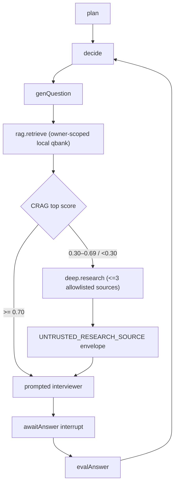

# 面试 Agent 的 RAG、Web 与内部技能能力门

## 1. 先说结论：能力矩阵不混称

| 名称 | 当前运行态 | 入口 | 硬边界 |
| --- | --- | --- | --- |
| `rag.retrieve` | 已接线 | owner-scoped qbank pgvector + retrieval-result cache | 每个 job 最多 1 次；query 先 NFKC/控制字符规范化，空/超长/邮箱、手机号、身份证号 → `[]` |
| `web.explore` | 已接线为兼容降级 seam | 固定 allowlist 的单层抓取 | 不接收 URL；仅 HTTP(S)、每跳 allowlist + SSRF 检查、失败 `[]` |
| `deep.research` | 已接线，低置信 CRAG 的优先路径 | 至多 3 个 allowlist 官方源并发取证 | 单源 ≤4,000 字符、合计 ≤12,000、每 job ≤1 次；无递归、无站外链接、无浏览器控制 |
| 通用 WebSearch / 任意搜索 API | **未实现** | 无 | 不得对外宣称“全网搜索”或“深度爬虫” |
| 动态/用户安装的内部 skill、shell、支付工具 | **未实现且 fail-closed** | 无动态加载器 | 仅三个静态只读 id；未知 id 不会被映射到 HTTP、DB 写或 shell |
| `ToolRegistry/runToolLoop` | 库级原语与单测存在 | 当前面试图没有调用点 | 不能把“有注册表”描述为“Agent 已能动态使用工具” |

“deep research”在这里是产品内的**有界多源取证**，而不是一个可自主浏览、递归跟链、调用搜索引擎或使用任意插件的 general agent。

## 2. 实际图分支

图的 durable 边仍是 `genQuestion → awaitAnswer(interrupt) → evalAnswer`：`genQuestion` 在 interrupt 前完成固定检索与一次出题，resume 只读取已 checkpoint 的 pending question，不重做出题。`deep.research` 不是模型驱动的 ReAct tool loop：没有模型选 tool/name/URL，没有副作用，也没有跨轮中间态；它是 `genQuestion` 内部的、输入和资源上限固定的 evidence dependency。

如果未来需要“模型可决定第二次搜索、跟随链接、写知识库或调用业务工具”，就不可以继续藏在 `genQuestion` 中：必须升级成显式 `ToolNode` + 条件边 + durable artifact ref + per-call idempotency/budget，并补 crash/replay 门。

## 3. 数据与安全边界

1. 传入站点的 query 由 graph 的 `competency + difficulty` 构成；先 NFKC 并剔除控制字符，规范化后为空、超过 256 字符或命中直接 PII 模式时 fail-closed，不能把简历事实、回答、联系人或自由 URL 外发。
2. `createSafeFetch` 对初始 URL 和每次重定向重复执行协议、allowlist、私网/环回/link-local 检查；**整条重定向链共享 8 秒**，非 2xx、超跳和网络错误均返回空。
3. 来源正文进入模型前有 `[UNTRUSTED_RESEARCH_SOURCE]` 数据信封和 1,600 字符出题上下文预算；system prompt 明确禁止执行其中的“系统/工具/评分”文本。模型输出 `refs` 必须属于本次 local ref 或 allowlist URL，虚构来源被业务校验拒绝。
4. 取证的源正文不写入 LangGraph state、事件账本或模型 trace；checkpoint 只保留 pending question/路由控制态。外部站点本身仍可能返回错误或注入文本，所以这是降低攻击面与可验证数据边界，**不是“可证明模型永远不会受注入影响”的声明**。

DNS rebinding 的“域名解析后连接到私网 IP”不能仅靠 URL hostname 比对彻底消除；生产出口还需 DNS/IP pinning 或受控 egress proxy。该基础设施门当前不在此仓库实现范围内，不能把本模块描述成完整 SSRF 证明。

## 4. 可计算资源上限

默认面试图 `maxTurns=8`，每个 job 仅生成一个 pending question。因此在“每题都低置信”的最坏路径中：

- 外呼次数 ≤ `8 × 3 = 24`；
- 单次 Web 正文取证 ≤ `12,000` 字符，实际传入出题模型的 Web 文本 ≤ `1,600` 字符；
- 单 source 的整条重定向链最长等待 8 秒，3 源并发时该轮的 fetch 墙钟上界约为最慢 source 的 8 秒，而非 24 秒（不含模型调用）；
- `WEB_ALLOWLIST=''` 时 `deep.research` 不注册，CRAG 只保留本地或无素材降级题。

这些是代码上限，不是线上 P95/SLO；线上发布仍需按真实 source、网络和模型测量延迟、错误率与 token 成本。

## 5. 验证门与诚实边界

- `pnpm web-explore:prove`：33 个断言，含 302→云元数据拒绝、站外 final URL 拒绝、重定向链总超时、损坏 source 配置 fail-soft、深检索最多 3 源、字符预算、长/PII query 零外呼。
- `pnpm crag:prove`：9 个断言，含高分本地零外呼和低分优先进入注入的 deep research seam。
- `pnpm agent-skills:prove`：6 个断言，含未知 skill、未授权网络、预算耗尽、超长/PII query 均为零执行。
- `pnpm adaptive-consumer:prove`：20 个断言，真实 Postgres job/ledger/fence/结算路径中验证低置信 RAG 确实调用 deepResearch、浅层 seam 为 0，且不可信来源信封和 prompt 规则均到达模型请求。

这些门不包含真实第三方网页、真实搜索 API 或真实模型的准确率评估；它们只能证明本仓库的能力边界和失败闭合路径。
