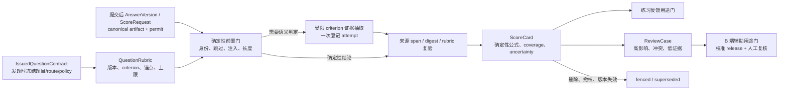

# 面试评分测量运行时

## 1. 当前运行事实与不可作出的结论

当前自适应路径将当前题目和当前回答送入 `EvalSchema`，得到 `score / relevant / hasHook / evidence`；服务端验证分数范围和逐字引文，持久化 span/hash，再由 `aggregateScores` 取题目均分。`unscored` 和 `unresolved` 已有部分排除逻辑，报告和 assessment 侧也会过滤 `unresolved`。

这意味着当前系统可以证明一部分**链路完整性**：相同答案的幂等、分数域、引文来自本次答案、失败不默认给 50 分、部分跑题和注入输入的确定性短路。它不能证明下列命题：

- 一个自由文本 criterion 实际支持对应分数；
- 不同问题、难度、语言、语音转写质量或模型版本的 `80` 分可比较；
- 小型合成 golden 的相对序结果能外推到真实候选人；
- 分数可以用于招聘自动决策；
- 任何旧事件都是合法评分来源。

遗留 `/interview/:id/answer` 的固定 `68` 分旁路已在当前工作树改为统一 `410 legacy_endpoint_disabled`，并从公开 OpenAPI 契约移除；报告、assessment 和 profile 的 ledger 对齐只是**legacy transport 过滤**：题目和事件仍可被普通 runtime 写入，因而它不构成不可变评分事实、测量质量或用途授权。迁移 `0082` 进一步将 B 端申请数值分置空、保持 `assessment_unavailable`，人才库不再提供分数排序。`2026-08-13` 的 `pnpm scor-00:http:prove` 已在完整迁移的隔离 PostgreSQL 中，以独立低权 runtime login 运行真实 Nest/Fastify，验证 C/B、重放、并发、跨主体 legacy 调用的受检副作用增量均为 0。

`SCOR-00H` 在同一止血边界上补了消费面诚实闸（`packages/domain/src/scoring-honesty.ts` + web `practiceHintScore`）：canonical question identity **和** answer claim（`answerId`/`answerHash`/`competency`）才展示练习 hint；空评估抛 `score_aggregate_empty` / API `409 no_scorable_cards` 而不是 `overall=0`；职业路径拒 null overall（`409 insufficient_evidence`）；转写分数只读 `listScorableScoreCards`（当前仍含 `practice_eligible` **和** `b_review_eligible`；生产 graph 通常无卡 → null）。`GET assessment` / `GET career-path` **不**重跑该闸。`report_ready.overall` 已是 0..100 整数时 C 端仍可展示（untrusted display）。`refuseMappedBSideScore` 只证明域侧不能把 event/report 升格为 B 端 overall，**不改** worker `eligible` 计数或 `markApplicationNoEligibleScore`（二者仍读 event `.score`）。本地证明为 `pnpm scor-00-honesty:prove` / `pnpm web:prove`（`releaseEvidence=false`），未跑隔离 HTTP 组合根，不能把练习 hint 称为可信测量结果。

## 2. 目标数据流

模型不是总分权威。它只输出一个固定 rubric 内的分项判定候选；数据库的 verifier 和 score formula 才产生可消费的 `ScoreCard`。报告模型只能叙事，不得重算、纠正或补全 score。

## 3. 评分卡与用途门

### 3.1 `QuestionRubric`

每个题目需冻结：`questionId`、`questionVersion`、`rubricVersion`、能力、难度、语言适用范围、criterion、锚点、权重、必需证据和硬上限。题库内容、题目和 rubric 任一变化都创建新版本；不能用当前题面临时拼字符串 rubric。

### 3.2 `ScoreCard`

`ScoreCard` 同时绑定一个 issue-stage `IssuedQuestionContract`、一个提交后 `AnswerVersion/ScoreRequest` 和一个 rubric。发题时不得冻结未来答案 ID/hash；答案只能在 `INT-TRANSCRIPT-00/01` 的 canonical artifact、删除与 receipt 前置通过后以 append-only 版本进入评分请求。每个分项存有限状态档位、证据 span、span digest、来源版本和错误/冲突原因；总分由服务端公式从通过 verifier 的分项计算。`coverage`、语音质量、语言适用性、模型分歧、来源完整性、calibration 状态和 review 状态作为独立字段保存，避免把不同不确定性压成模型自报的单一百分比。

状态最小集为：`pending_evidence`、`evidence_invalid`、`unscored`、`practice_eligible`、`review_required`、`calibration_blocked`、`b_review_eligible`、`superseded`、`fenced`。只有 `practice_eligible` 能进入 C 端练习反馈；只有经精确 calibration release 与人工复核的 `b_review_eligible` 可进入 B 端辅助材料。

### 3.3 聚合与难度

当前简单题均分不能纠正题目难度，也不应作为跨会话能力曲线。过渡期按 rubric/version/difficulty cohort 分开显示，不产生跨 cohort 排名。若未来需要可比较量表，必须通过预注册标注、桥接集和独立评估建立项目自己的量表；在此之前宁可显示“证据覆盖不足/不可比较”，不以统计术语伪装校准。

## 4. 幂等、并发、故障与隐私

- issue contract 的事实身份为 `(owner, interview, questionId, stateVersion, rubricVersion, measurementVersion)`，答案接受后才创建 `(issueContract, answerVersion, policyVersion)` 的 `ScoreRequest`；同一 request 重放只读取同一 scorecard。
- 模型请求前由唯一 score-writer 领取 request permit，并冻结输入、用途、rubric 和 privacy epoch。派发后 unknown 不重发；删除/撤权/答案替换先赢时 permit fenced，迟到结果不得写卡或投影；任何后续复核都是新的、可审计的版本，而非覆盖。
- answer 更新、question 撤销、删除、撤权或 privacy fence 先提交时，任何未完成 scorecard、报告、B 端投影和缓存均不得继续写入。已外发结果只保留最小审计与既定删除 target，不回填领域事实。
- 原始答案只在受控、按 owner/RLS 的加密工件中保存；scorecard、trace、cache、金标、人工复核和向量派生均要接受同一用途、保留期与删除链。

## 5. 成本与降级策略

评分链分为四层：确定性筛选和 verifier（模型调用为 0）；低成本的 criterion evidence extraction；仅对分歧、高影响、抽样或高不确定性触发的独立复核；最后是只消费已认可 scorecard 的报告叙事。每层都有单独 operation 名、数据分类、输入输出预算、最大 attempt、费用计量和状态机。

不得用“高质量模型再打一次分”作为默认路径；它同时提高成本，并不能消除共同 prompt/rubric 偏差。模型切换也不能发生在派发后。模型、供应商、预算、区域或 rubric 不满足时，结果是 `unscored` 或 `review_required`，而不是换一个模型静默补分。

## 6. 验证分层

| 层 | 必须验证 | 不能声称 |
| --- | --- | --- |
| 确定性合同 | 旁路=0、scorecard 不可变、span/digest、聚合资格、并发和删除围栏 | 真实模型质量。 |
| 受控模型 transport | attempt、输入预算、unknown、模型错误、成本和一次性派发 | 供应商质量或招聘公平性。 |
| 冻结评测 | 单调性、等义扰动、跑题、注入、语言、语音、难度和分项一致性 | 自动招聘授权。 |
| 人工校准 | 双盲、仲裁、切片误差、申诉、版本桥接、漂移 | 长期业务效度，除非另有合规研究。 |
| 真实受控运行 | 分母、失败率、review、成本、延迟、删除和用途审计 | 未运行的云端或招聘决策通过。 |

所有评测结果必须绑定真实运行入口、scorecard/rubric/model 版本和独立 held-out 数据集。静态 fixture、fake model 或只验证 schema 的 proof 只能关闭结构性回归，不能关闭测量质量。

## 7. 实施顺序

1. `SCOR-00`：移除或固定禁用遗留伪评分接口。`SCOR-00H` 已让转写/`POST` 评估/`POST` 职业路径/SSE 消费面拒绝无 canonical identity 的事件分，并在证据不足时走 `409` / 域 `insufficient_evidence`（不是 0）。`GET` 读路径、worker eligible 计数与 ScoreCard 写路径仍不在本步。
2. `INT-TRANSCRIPT-00/01`：先在真实组合根闭合 canonical answer artifact、删除授权、逐 sink receipt 和删后 read=0；否则不得创建评分事实。
3. `SCOR-01/02`：再建立 issue-stage contract、提交后 AnswerVersion/ScoreRequest、immutable QuestionRubric、专用 score-writer、ScoreCard/verifier 与一次性消费者资格切换。
4. `SCOR-03/04`：将证据抽取纳入 operation registry，补冲突、不确定性、成本与 unknown 语义。
5. `SCOR-05/06`：建立冻结集、人工双盲、仲裁、版本桥接和校准 release。
6. `SCOR-07/08`：最后才开放经人工复核的 B 端辅助用途，并证明生产组合根、隐私删除和故障恢复。

在步骤 1 至 4 完成前，不得通过删除文档警告、修改展示文案或提高模型温度/重试次数来声称评分稳定。
