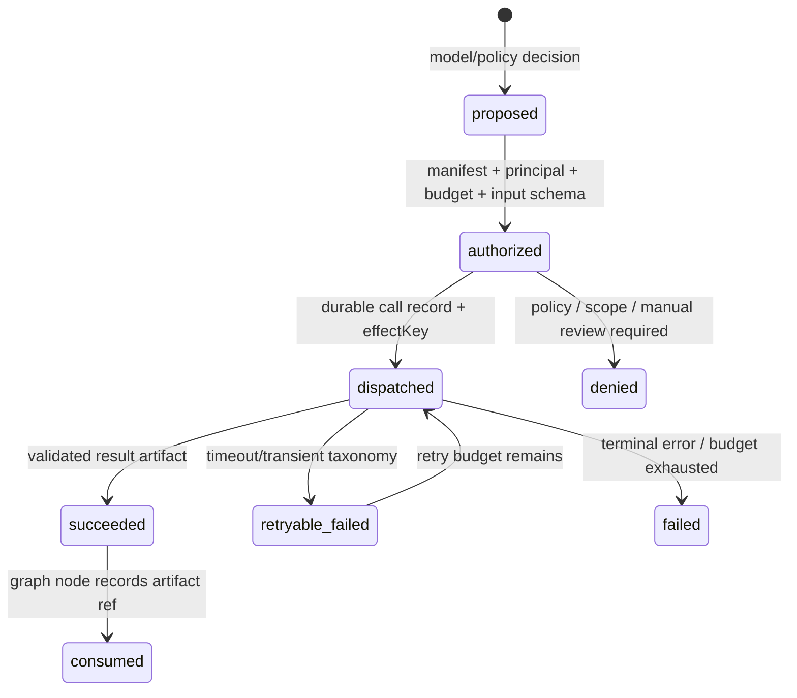

# Agent Tools、Skills 与记忆运行时架构

> 结论先行：当前实现是一个安全收敛的面试工作流，不是专家级、可演进的 tool-using Agent 平台。它的保守边界有价值，但不能被包装成“模型会自主调用工具、安装 skills、长期记住用户”。本文件区分当前事实和 TARGET，防止未来为“更智能”而重新打开 shell、跨租户检索或不可重放副作用的洞。

## 1. 当前能力基线（已验证）

| 面 | 当前运行态 | 可量化边界 | 未实现的专家级能力 |
| --- | --- | --- | --- |
| 工具原语 | `toolRegistry` 与 `runToolLoop` 是库级代码 | 工具 proof 有 **6** 个断言：schema 拒绝、未知工具拒绝、最多步数、失败轨迹；运行时 graph/worker 调用点数为 **0**（定义/测试除外） | durable ToolCall、授权、幂等副作用、工具结果 artifact、resume/replay、成本/审计。 |
| 内部 skills | 固定 `rag.retrieve`、`web.explore`、`deep.research` 三个只读 capability | 实际 consumer 每 job 只启用 `rag + deep` 或 `rag + web` 两类，每类最多 **1** 次；无 shell/payment/DB-write skill | 动态安装、模型任意选择工具、技能版本/评测/发布、带副作用业务 skill。 |
| RAG/Web | 本地检索后低置信可走 allowlist 多源取证 | deep research ≤**3** 源、每源 ≤**4,000** 字符、总 ≤**12,000** 字符、每 job ≤**1** 次；正文以不可信信封进入 prompt | 通用搜索、递归爬取、浏览器控制、DNS/IP pinning 级 egress。 |
| 跨会话记忆 | `episode` 精确题面判重 + `assessment_report.gap=true` 的弱项标签软偏置 | `memory:prove` 实跑覆盖 **2** 名 owner 的 RLS、归一化判重和无答案/手机号写入；完整 consumer proof 证明完成后写入题面 episode | 语义 recall、用户确认事实、TTL/撤回、冲突处理、记忆 snapshot、记忆评测。 |
| `user_memory` 数据模型 | enum 允许 `skill/weakness/topic/preference/episode` | 运行时代码的写入只有 `episode`；`getMemoriesByRefIds` 运行时调用点为 **0** | 不能把 enum 的 **5** 个值误称为 **5** 个已接线记忆能力。 |
| 上下文 | 任务隔离 + 服务级字符上限，完成态 transcript 不再复制 raw answer | 2026-08-10 压力 proof：64 个迁移、**5** 轮累计约 **52k** 字，评估输入 ≤**12k** 字，等长轮次输入极差 **14** 字；8k 回答消费后清除 | tokenizer 预算、版本化语义摘要、tool/result 成对压缩、撤回传播、可重放压缩边界。 |

已实际运行：`pnpm tools:prove`、`pnpm agent-skills:prove`、`pnpm memory:prove`、`pnpm adaptive-consumer:prove`。后两条会自动启动并删除临时 pgvector 集群，绝不重建共享开发库。

## 2. 为什么当前不属于专家级工具/技能平台

当前安全策略是正确的：模型不能把字符串映射成 shell、HTTP、支付或数据库写入；未知 skill、PII query、超长 query 和未授权网络均零执行。但下列承重对象尚不存在：

1. `ToolCall` 没有数据库状态、run snapshot、授权上下文、输入/输出摘要、artifact 引用或 effect idempotency key；进程崩溃后无法证明某个有副作用工具是否已执行。
2. `runToolLoop` 的 steps 仅在进程内数组中；没有 LangGraph `ToolNode`、条件边或 checkpoint 后的“call 已发、result 未回”恢复语义。
3. `Tool` 仅有 name/description/Zod/invoke，不含 owner/tenant/purpose、数据分级、超时、重试、预算、输出脱敏、审计、网络和人工审核 policy。
4. “skill”现在是三个硬编码函数，并非有 manifest、版本、依赖工具、输入输出契约、能力评测和撤回开关的工作流包。
5. 记忆写是 completed 之后的 fail-soft best effort；写失败不影响主面试，但也没有 outbox/retry/对账。它适合“避免完全相同题面再次出现”，不适合作为用户事实来源。

因此，当前能说的是“面试 Agent 使用受限 RAG/Web capability”；不能说“多工具 Agent”“动态 skills 平台”“Agent 有长期记忆”。

## 3. 工具层 TARGET：Manifest + ToolCall ledger + 显式图节点

### 3.1 不可变工具 manifest

每个可部署工具是签名/审阅过的 `ToolManifest`，至少包含：

```ts
type ToolManifest = {
  toolId: string; version: string; class: 'read' | 'external_read' | 'effect';
  inputSchemaRef: string; outputSchemaRef: string;
  requiredCapabilities: string[]; dataClassification: 'public' | 'tenant' | 'sensitive';
  timeoutMs: number; maxAttempts: number; maxOutputBytes: number;
  budget: { callsPerRun: number; tokens?: number; costCents?: number };
  egressPolicy?: { allowlistId: string; redirectLimit: number };
  idempotency: 'none-readonly' | 'required';
  approvalPolicy: 'none' | 'manual_review' | 'four_eyes';
};
```

- 模型永远只能从 run 开始时冻结的 allowlist 选择 `toolId@version`；不加载用户提供的 URL、npm 包、代码或“插件名”。
- `read` 工具也需要 tenant/purpose；`effect` 工具必须同时带稳定 `effectKey`、业务对象 expected version 和 outbox。
- tool output 不能直接塞回 graph state：大结果写加密 artifact，只在 state 留 `artifactRef/hash/summary/classification`；敏感输出默认不回模型。

### 3.2 ToolCall 状态机（TARGET）



所有状态使用 CAS。`dispatched` 必须先持久化，再发外呼；恢复时按 `ToolCall.status` 查 provider receipt、重放 readonly call 或复用 result，绝不盲目再执行 effect。`effect` 工具的业务修改、`ToolCall.succeeded` 和 outbox 必须位于同一可对账协议中。

### 3.3 图设计

```
plan → tool_policy → ToolNode(read/effect) → validate_result → decide
                      ↘ denied / review_required ↗
```

不能把循环藏在 `genQuestion` 的一次函数里。若模型需要多步工具选择，条件边、剩余预算、call ids、artifact refs、错误 taxonomy 和停止理由全部进入 durable state；`awaitAnswer` 前禁止未完成 effect。现有 RAG/deep research 可继续保持确定性 dependency，不必为了“像 Agent”硬改成 ReAct。

## 4. Skills TARGET：受版本控制的工作流包，不是可执行插件

Skill 是声明式、可审计的 workflow bundle：

| 字段 | 要求 |
| --- | --- |
| `skillId/version` | 发布时冻结；run 保存 snapshot，升级不影响进行中的面试。 |
| 输入/输出契约 | JSON Schema + 业务校验；禁止自由文本拼接 tool args。 |
| 工具依赖 | 精确 `toolId@version` allowlist，按 read/effect 分类。 |
| 数据权限 | tenant/purpose/consent/数据分级；未授权时返回结构化 denied，不旁路。 |
| 预算 | 调用数、字符/令牌、墙钟、成本、并发；预算耗尽有确定性 fallback。 |
| 评测 | 每 skill 有 happy、指代、注入、PII、权限、超时、重放、跨租户和成本测试集。 |
| 发布/撤回 | approval、kill-switch、版本 incident 影响范围和 rollback。 |

初期仍应由**确定性 policy**选择 skill：如 `grounded` 问题允许 RAG，低置信才允许受限 deep research。未来若允许模型建议 skill，建议只产生 `proposed`，由 manifest/policy gate 判定；低置信和多候选冲突时选择无工具、澄清或人工，而不是猜测执行。

不应支持“用户上传 skill 立刻在生产执行”。若需要生态能力，先做离线审阅、供应链签名、sandbox、最小权限、数据 egress 评估和单独 tenant opt-in。

## 5. 记忆 TARGET：事实生命周期与上下文压缩分离

### 5.1 分层

| 层 | 真相来源 | 当前状态 | TARGET 约束 |
| --- | --- | --- | --- |
| L0 请求态 | 当前 HTTP/job | 已有 | 不跨请求持久化。 |
| L1 会话工作态 | LangGraph checkpoint + issued-question ledger | 已有 | 短期、版本/fence 保护；不把 raw answer复制进完成态摘要。 |
| L2 审计事实 | `interview_event`、评分/报告版本、同意记录 | 已有部分 | append-only、可删除策略和 purpose 受控。 |
| L3 确定性跨会话提示 | episode exact dedup、历史 gap 标签 | 已有 | 只影响选题 hint，不能影响分数、难度或招聘结论。 |
| L4 受控语义记忆 | 用户确认/已完成报告派生的事实候选 | 未接线 | source version、trust、TTL、consent、conflict、状态、embedding version。 |
| L5 压缩摘要 | 一段已编号事件的版本化摘要 | 未接线 | `start/endEventId`、checksum、summary model/prompt、fact refs、`firstKeptEventId`、CAS。 |

### 5.2 L4 写入、读取与撤回

```text
trusted source / user confirmation
  → candidate fact extraction
  → PII + purpose + consent + source-version validation
  → duplicate/conflict policy
  → user confirmation or human review for consequential facts
  → active memory + vector + cache epoch
  → run-start frozen MemorySnapshot
  → RLS-filtered top-K hints only
```

模型输出只能生成 `candidate`，不能直接成为 `active`。每个 record 至少有 `sourceId/sourceVersion`、`purpose`、`consentVersion`、`expiresAt`、`trust`、`contentHash`、`embeddingVersion`、`status(active/disputed/expired/deleted)`。撤回/删除通过 outbox 扇出到行、向量、检索缓存、冻结快照、checkpoint 允许的引用和观测索引；完成条件是各数据面的残留数均为 **0**。

### 5.3 L5 压缩

压缩由显式 graph node 触发：先以真实 tokenizer 计算 `system + policy + snapshot + tool reserve + RAG + recent turns + output reserve`；超过窗口时冻结最近完整 turn 和当前题，压缩一段连续旧事件。摘要写入必须能复算、带引用并通过 schema/事实校验。失败时宁可缩小旧上下文或澄清，不能用模型猜出“用户记忆”。

## 6. 发布指标和最低验证（TARGET）

| 项 | 测试 | 必须结果 |
| --- | --- | --- |
| 工具副作用 | 双 worker、重放、超时后恢复各 **10,000** 次 | `duplicate_effect=0`，相同 effectKey 的账本/outbox/artifact 各 **1**。 |
| 权限 | 跨 tenant、撤回 consent、过期 lease、模型伪造 tool name/args | 未授权 dispatch、读取和 effect 均 **0**。 |
| skills | 每 skill 的 adversarial 样本按输入类、工具类、错误类、成本类分桶 | 不用总通过率覆盖 PII、注入、指代、超时和回放失败。 |
| L4 memory | 独立人工双标 fact precision/recall、跨 owner 泄露、过期命中、撤回残留 | 跨 owner 泄露和撤回后新读取为 **0**；其余报告样本数和区间。 |
| L5 compression | 事实保留/错误摘要/重放一致性、token、P95 首 token、成本 | 事件 hash 重放一致；任一事实不确定不得伪造为记忆。 |
| 线上 | tool call error taxonomy、预算拒绝、artifact bytes、skill fallback、memory hit/error/expiry、review escalation | 每项带 run/tool/skill/policy/version，日志不含简历、回答、录音或密钥。 |

## 7. 实施顺序

1. 保持当前三个只读 capability 的 fail-closed 边界；先补 tool/skill manifest、观测与版本 pin，不开放动态执行。
2. 选择一个低风险 readonly 工具，引入 `ToolCall` ledger、artifact ref、resume/replay 和隔离集成测试。
3. 仅在其通过 10,000 次重放与权限矩阵后，才让工具进入显式 LangGraph `ToolNode`；effect 工具另行经过 ledger/outbox/人工审核设计。
4. 先将 L3 episode 写改为可对账的 best-effort outbox 或明确“非关键”SLO；再引入 L4 candidate/confirmation/TTL/撤回，不能先做 embedding recall。
5. 最后才做 L5 语义压缩，并对每个模型、prompt、tokenizer 版本建立独立评测集。

在上述步骤完成前，本项目对外准确定位是：**有受限检索、受控深取证、轻量跨会话避免重复和上下文上限的面试工作流**。
