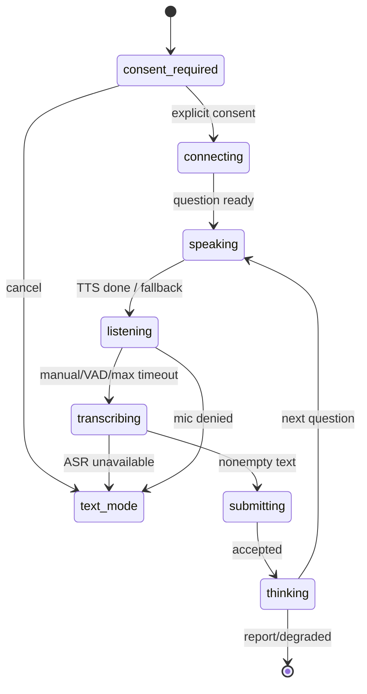

# 人机双向语音能力边界与升级门

> 这里的“单轨”只描述**目标态**的人侧只采集一个本机麦克风轨道；它不代表 AI 不说话。批量/流式语音 API 组合根和所有原始音频手工 smoke 现已 fail-closed，当前交付路径仅为文字输入/展示。下述 adapter 取消和下载合同保留为未来逐 operation 接入的前置，不是当前人↔AI 语音已启用的声明。

## 当前实现与证据边界（事实，不是路线图）

| 能力 | 当前状态 | 可验证证据 | 对外表述 |
| --- | --- | --- | --- |
| 人↔AI 双向回合 | disabled pending `MODEL-OP-01` | 浏览器保留文字回退 UI；TTS/ASR adapter 与 Fastify 断连合同仅为本地适配器测试 | 不得声称支持 AI 播题或用户单轨转写 |
| 用户抢话（barge-in） | 部分实现；非流式取消按 `UC-VOICE-03` 收口中 | 流式 `/speak/stream` 已有连接 close（关闭）→中止；非流式 `/speak` 必须由 `TC-VOICE-03-E6` 的代理/API/适配器全链断言后才可标已验证 | 现阶段不得把“浏览器停止播放”表述成“服务端或供应商已停止” |
| 浏览器本机单麦克风录音 | 已实现 | `MediaRecorder` + 显式同意门 | 只采集当前设备的人侧单轨 |
| 片段 ASR（自动语音识别） → 可编辑文本 | disabled pending typed binding | `POST /interview/:id/transcribe` 返回明确不可用 | 文字输入 |
| 题目 TTS（文本转语音） | disabled pending typed binding | `/speak` 与 `/speak/stream` 返回明确不可用 | 文字展示 |
| 本机音量/“在听”动效 | 已实现 | VAD 的 28 根波形条，状态刷新最多 12.5 Hz；`prefers-reduced-motion`（减少动态效果偏好）关闭动画 | 人侧本机麦克风电平，不代表另一位人类说话者 |
| 远端媒体轨 / PSTN / WebRTC 通话接入 | 未实现 | 无 provider、无远端轨协议 | 不可宣传为电话或会议 |
| 双人录音 / 说话人分离 / DER | 未实现 | 无双轨样本、无 diarization provider、无 DER 报告 | 不可生成“面试官/候选人”归因 |
| 逐词/逐句时间戳 | 未实现 | ASR 响应无 timestamps | 不可生成带时间线的通话纪要 |

## P0 契约与失败关闭

`TranscribeDto` 只接受以下请求：

```ts
{
  audioBase64: string,                 // 合法 base64，最大 13,500,000 字符
  mimeType: 'audio/webm' | ...,        // allowlist
  capture: {
    mode: 'single_local_microphone',
    consent: true,
    policyVersion: 'voice_ephemeral_v1'
  }
}
```

- 没有 `capture.consent === true`、策略版本不匹配、畸形 base64、或声明 `two_participant_call` 时，Zod 在 ASR 调用前返回 400。
- 录音仅经同源 API 中转到 ASR；当前应用不把原始片段写入业务数据库或对象存储。
- 返回值必须含 `capture: { mode: 'single_local_microphone', speakerAttribution: 'not_diarized', wordTimestamps: 'not_available' }`。这是一条能力声明，禁止消费端把它渲染成双人电话记录。
- UI 必须先展示同意范围，再调用 `getUserMedia`。取消或改用文字不会触发权限请求。

## 状态与降级



本机“在听”状态每 80 ms（最多 12.5 Hz）更新 UI 电平与 28 条波形；不逐音频帧触发 React 更新。`motion-reduce` 下波形/脉冲保留状态文字、移除运动。

## 当前 ASR（自动语音识别）超时与重试契约

这是当前已接线的单轨人↔AI 语音边界，不把规划中的 `VoiceTurn` 数据表冒充为已实现能力。

- `dashscopeAsr` 的单次调用预算固定为 **75,000 ms**；仅覆盖 ASR，不改变全局 HTTP（超文本传输协议）默认 30,000 ms，也不放宽检索、重排或普通模型调用的恢复边界。
- 到时必须中止底层连接，适配器产生 `asr_timeout`；API（应用程序接口）返回 `504`，前端显示文字作答入口。原始录音不持久化。
- 浏览器断开或页面取消时，同源 ASR（自动语音识别）代理把 request（请求）`AbortSignal`（中止信号）传入 API；API 必须监听 response（响应）socket 的 `reply.raw.close`，把信号传过 application service（应用服务）与 ASR adapter（适配器）至受限 JSON（JavaScript 对象表示法）读取器。请求体已由 Fastify 消费后，不能用 `req.raw.close` 当作响应阶段断连依据。
- 用户取消映射为内部 `asr_cancelled`（HTTP（超文本传输协议）499），不得伪装成供应商超时 `asr_timeout` / 504，也不得自动重试；已断开的浏览器不接收该响应。
- 当前上游兼容端点没有可验证的 ASR 请求幂等回执。因此适配器**禁止自动重试**：响应丢失时不能猜测未执行后再发一次，避免重复供应商费用。用户明确重试是新的受限请求，仍受语音限流保护。
- 2026-08-09 的真实移动端浏览器回归曾在默认 30,000 ms 的第 30.24 秒得到 502；这一观察只证明旧边界过短，不是 ASR 准确率、P95（第 95 百分位延迟）或可用性指标。

| TC（测试用例） | 覆盖类别 | 断言 | 层 |
| --- | --- | --- | --- |
| `TC-VOICE-01-main` | 正常/特殊 | 默认 ASR 预算=75 秒；浏览器隔离测试只验证本机 UI 路径，真实浏览器 TTS→录音→ASR→Agent 尚未获终态回执 | 适配器 proof + Playwright（浏览器自动化）隔离测试 |
| `TC-VOICE-01-E3` | 异常/逃逸 | provider 超时中止连接、API 返回 `asr_timeout`/504、文字入口仍可用 | 适配器 proof + API 单元 |
| `TC-VOICE-01-E4` | 复杂/安全 | 原始音频不写业务库、日志或 trace（链路追踪） | 负向集成 |
| `TC-VOICE-01-E5` | 并发/刁钻 | 不自动重试；同一次超时只产生 1 次 provider 调用，显式重试仍经限流 | 适配器 proof + API 集成 |
| `TC-VOICE-01-E6` | 特殊/降级 | ASR 未配置、网络失败、超时或响应 socket 断连均给出文字出口，不伪造转写；断连后供应商连接不再继续 | proxy + Fastify loopback + API + 浏览器 E2E |

## TTS（文本转语音）结果下载安全契约

### UC-VOICE-02 · 供应商音频结果 URL（统一资源定位符）下载

**覆盖七类：** 正常、异常、特殊（过期/格式）、逃逸通道（服务端请求伪造）、高并发、复杂（DNS 重绑定/重定向）、刁钻（IPv4 映射 IPv6、userinfo、超大分块）。

- **角色：** 已配置的 DashScope（百炼）TTS 适配器；用户只接收同源 API 返回的音频字节，不接收供应商 URL。
- **前置：** TTS 请求已经获得 HTTP 200 和 `audio.url`；该 URL 是不可信的供应商响应数据，不因为来自模型供应商就获得内网访问权。当前非流式产品只接受 `dashscope-result-*.oss-cn-*.aliyuncs.com` 的临时 OSS（对象存储服务）音频结果。
- **触发：** 适配器准备下载 `audio.url`。
- **主流程：** 先解析并规范化允许域名的 `http:` URL 为 `https:`，随后要求无 userinfo、默认 443 端口、有效且未过期的 OSS 签名 query（查询参数），并将返回的 `expires_at` 与 query 中 `Expires` 精确比对。以二进制 IP（互联网协议）解析所有 DNS（域名系统）地址，只有 global unicast（全局单播）可用；因此回环、链路本地、RFC1918（私有地址）、云 metadata（元数据）、IPv4 映射/兼容 IPv6（互联网协议第 6 版）、文档和保留地址均被拒绝。选定一个已验证公网地址，以原 hostname 作 TLS（传输层安全）SNI（服务器名称指示）并显式开启证书校验连接。请求不跟随重定向；只接收 WAV（波形音频）MIME（多用途互联网邮件扩展）或与 `.wav` 一致的受控二进制类型，读取总字节不得超过 8 MiB（兆字节）。从 DNS 开始到最后一字节共用不可续期的 30,000 ms 总截止时间，另有 10,000 ms 套接字空闲上限；慢分块不能重置总截止时间。当前进程内 bulkhead（舱壁）至多 4 个下载，满载立即降级文字；它不是多实例 Redis（远程键值存储）配额，跨实例预算仍是云发布阻断项。
- **后置：** 成功只把受限音频字节交给 API；任何拒绝不写业务库、不记录完整 URL/query、不开第二次下载请求，API 返回既有 `tts_failed` 并让前端回退文字。

| 流 | 异常/边界 | 强制机制 | 可测验收 |
| --- | --- | --- | --- |
| N1 正常 | 允许 host、未过期签名、已验证公网地址、WAV | 下载前 canonical validation（规范校验）+ DNS pinning（DNS 固定）+ TLS | 只建立 1 条 HTTPS 连接，字节逐块累计后返回。 |
| E1 异常 | 缺 URL、签名字段、`expires_at`，或已过期/不一致 | 派发前 fail-closed（失败关闭） | HTTPS 请求数 `=0`，错误不含 URL/query。 |
| E2 逃逸 | `http` 非允许 host、userinfo、非 443 端口、环回/metadata URL | allowlist（允许清单）+ URL policy（地址策略） | 连接数 `=0`。允许 host 的旧 `http` 仅能升级为同 host 的 `https`，绝不原样明文下载。 |
| E3 复杂 | DNS 返回 RFC1918、link-local（链路本地）、IPv4-mapped/compatible 或非规范 IPv6（IPv4 映射/兼容或非规范 IPv6）写法，或 DNS 重绑定 | 二进制范围判定 + 所有解析结果过滤 + 固定已验证 IP 的 `lookup`（解析回调） | transport（传输）未建立到被拒地址；测试伪造 lookup 不会触发 request。 |
| E4 复杂 | 301/302/307/308 重定向到任意地址 | 禁止 redirect（重定向） | 返回 `tts_download_redirect_rejected`，无第二跳。 |
| E5 特殊/刁钻 | MIME 缺失/不符、声明/流式总量超过 8 MiB、DNS/首字节卡住或持续慢分块 | content-type（内容类型）与 Content-Length（内容长度）预检 + 累计字节 + DNS 起算的不可续期总截止时间 | 丢弃所有已收字节；不会把截断音频返回浏览器。 |
| E6 高并发 | 同一进程超过 4 条合法签名 URL 同时下载 | 每次独立 policy/固定 IP/字节计数 + 有界 bulkhead | 前 4 条各至多 1 个连接；第 5 条零连接返回受控容量错误并由 API 降级文字；释放后可继续。 |

| TC（测试用例） | 层 | 断言 |
| --- | --- | --- |
| `TC-VOICE-02-N1` | 适配器 component（组件） | 允许 URL 只经 HTTPS、固定公网地址、WAV 且在上限内时字节精确返回。 |
| `TC-VOICE-02-E1/E2` | 适配器 regression（回归） | 过期、伪签名、恶意 host/userinfo/port/metadata URL 均 `request=0`。 |
| `TC-VOICE-02-E3/E4` | 注入 DNS/transport（传输）双假件 | 私网/IPv4-mapped/compatible/非规范 IPv6/DNS 重绑定零连接；重定向没有第二跳。 |
| `TC-VOICE-02-E5/E6` | 流式假 transport + 20 并发 | MIME/大小、DNS/首字节卡住与持续慢流均在总截止时间内 fail-closed；bulkhead 满载零连接且释放后恢复。 |

**实现/证据边界：** 这个契约只保护当前 Worker/API（后台任务/API）直连的响应 URL 下载。它不证明云 egress proxy（出站代理）、真实供应商证书/下载回执、跨实例 Redis 配额或未来模型网关隔离；后者仍受 UC-MODEL-002 阻断。响应中的临时对象下载地址即使以 HTTP 形式出现，也只会在 host 精确允许时升级为 HTTPS；任何不能安全升级的响应都降级文字，不以可用性换取内网访问能力。

`pnpm tts-download:live` 当前固定失败关闭，不读取 Key、音频或网络。恢复它之前必须先有 typed TTS operation、合成 fixture、媒体预算、一次性 attempt/unknown 语义、删除回执和脱敏 receipt；即使未来通过，也只说明当次供应商可达，不能替代云端故障演练或发布门。

### UC-VOICE-03 · 非流式 TTS（文本转语音）取消必须传至供应商连接

**覆盖七类：** 正常、异常、特殊、逃逸通道、高并发、复杂、刁钻。

- **角色：** 正在收听 AI（人工智能）题目的已认证用户；同源 Web（网页）代理；API（应用程序接口）；DashScope（百炼）TTS 适配器。
- **前置：** 浏览器已发起 `POST /api/interview/:id/speak`，同源代理尚未获得完整音频；API 已完成 owner（资源所有者）与 privacy fence（隐私围栏）校验。取消信号是**单个 HTTP（超文本传输协议）请求**的临时能力，不写 checkpoint（检查点）、事件、日志或业务库。
- **触发：** 用户抢话、点击停止、离开页面或浏览器断开非流式 `/speak` 请求。
- **主流程：**
  1. 浏览器的 `AbortController`（中止控制器）中止同源 fetch（请求）。Next.js（网页框架）代理把 `req.signal` 传给上游 fetch；API 监听 **response（响应） socket** 的 `reply.raw.close`（而非已被 Fastify 消费完请求体后不可靠的 `req.raw.close`）来中止该请求的专属 controller。
  2. controller（控制器）只把 signal（中止信号）传给 application service（应用服务）；service 把它传入 TTS seam（语音适配边界），不在 controller 进行供应商编排。
  3. adapter（适配器）在首次供应商 TTS 请求和受限 OSS（对象存储服务）下载中都监听同一个 signal：尚未网络派发则零连接拒绝；已派发则 destroy（销毁）连接、停止收集字节、不给浏览器返回迟到音频。
  4. 最外层 `finally`（最终清理）恰好释放一次进程内 admission（准入）租约；前端保留文字题面并进入 listening（监听）状态，不自动重试。
- **备选流：** 音频已完整返回且浏览器尚未取消时，返回 WAV（波形音频）字节；取消在响应结束后只是本地播放停止，不追溯修改已完成的 HTTP 响应。

| 流 | 场景 | 机制 | 后置 |
| --- | --- | --- | --- |
| E1 重复取消 | `abort()`、`close`、代理 abort 同时到达 | 每请求 `AbortController` + adapter settled/release-once（只收口一次） | 连接 destroy 至多一次；租约只释放一次。 |
| E2 竞态 | 供应商响应、首字节或下载完成与取消并发 | settled CAS（比较并交换）语义 + `AbortSignal`（中止信号） | 取消先赢时音频字节 `=0`；完成先赢时不得伪报取消。 |
| E3 越权/逃逸 | 伪造他人 `interviewId`（面试标识）或在围栏后取消/重放 | RLS（行级安全）+ privacy fence 在外发前验证 | 404/410；供应商调用 `=0`；取消不能影响其他用户请求。 |
| E4 外部不确定 | TTS 请求已写出后客户端断线，供应商可能已计费 | 派发后不自动重发；保留文字降级 | 本次 HTTP 无迟到音频；不会因自动重试产生第二次外发。供应商费用收据仍待模型网关闭环，不能称已退款。 |
| E5 降级/过载 | TTS 未配置、下载舱壁满、供应商拒绝 | 有界 admission（准入）+ 503（服务不可用）`tts_busy` / 文字出口 | 不排队无限占内存；用户可立即继续文字回合。 |
| E6 超时/断线重连 | DNS（域名系统）/下载超时、用户中止、浏览器刷新后重发 | 总 deadline（截止时间）+ socket destroy + 无自动重试 | 旧连接/租约收敛；新的显式请求独立受限，旧请求不复活。 |

- **后置：** 不创建 VoiceTurn（语音轮次）持久态、不写音频、转写、模型事件或费用确认；每个已接入的本地连接在成功、错误、超时或取消后都不再持有下载舱壁租约。供应商实际计量与跨实例配额仍是未完成的模型网关/云发布项。
- **验收：** 取消在首次供应商请求前使 provider（供应商）调用 `=0`；取消在下载中使 request（请求）被 destroy、迟到字节 `=0`、租约立即可被下一请求取得；20 次并发取消不发生双释放或负计数；代理、API、adapter 三层均不把 URL（统一资源定位符）、音频、密钥写入错误或日志。
- **关联：** `POST /api/interview/:id/speak` → `POST /interview/:id/speak`；`Tts.synthesize(..., { signal })` 适配器契约；RLS + privacy fence + 进程内有界 admission；未来 UC-MODEL-002（模型网关）提供跨实例配额、费用和外部删除收据。

| TC（测试用例） | 层 | 断言 |
| --- | --- | --- |
| `TC-VOICE-03-main` | API + adapter integration（集成） | 非取消路径返回音频，准入租约在完成后释放。 |
| `TC-VOICE-03-E1/E2` | adapter component（组件） | 20 路同时重复 abort/close 与响应完成竞态时，destroy/release 至多一次，迟到字节不返回。 |
| `TC-VOICE-03-E3` | HTTP + PostgreSQL（关系型数据库）integration | 越权或 privacy-fenced（隐私围栏）请求在外发前是 `0` 调用。 |
| `TC-VOICE-03-E4` | controlled-provider（受控供应商）component | 首次请求写出后中止，自动重试 `=0`，只给文字降级信号。 |
| `TC-VOICE-03-E5` | API integration | 舱壁满返回 503 `tts_busy`；同一用户/其他用户的请求互不释放租约。 |
| `TC-VOICE-03-E6` | Next proxy + Fastify loopback（循环回路）+ Nest controller handler + browser E2E（端到端） | 浏览器取消沿代理/API/adapter 传递；连接销毁、下一请求可用、没有迟到播放。 |

**当前验证边界：** `pnpm -C apps/web prove:speak-proxy`、`pnpm -C apps/web prove:transcribe-proxy`、`pnpm -C apps/api prove:voice-timeout`、`pnpm -C apps/api prove:voice-cancel-http` 与 `pnpm -C packages/ai-runtime prove:voice-reliability` 分别验证 TTS/ASR proxy（代理）、controller/service（控制器/应用服务）、真实 Fastify response-socket（响应套接字）断连到生产 Nest controller handler、以及 adapter（适配器）的确定性取消合同。真实浏览器到真实 API、真实 DashScope（百炼）连接的完整 `TC-VOICE-01-E6` / `TC-VOICE-03-E6` 仍是 `not_run`，不能由这些本地 proof（证明）替代。

## 人↔人电话能力的准入门（未满足不得开启）

这一节不是当前用户所说的人↔AI 回合，而是**另一个**产品能力：两名人类参与者、远端媒体和说话人归因。

只有所有项目完成后，才可以引入 `two_participant_call`：

1. 双方按参与者、目的、接收方、保留期、撤回路径记录可审计同意；撤回立即停止新处理。
2. 使用每参与者独立媒体轨，或经批准的 diarization，并把 `trackId`、会话单调时钟和 utterance 时间区间写入版本化契约。
3. 对授权、去标识的双人基准集报告 WER（总体及中英/口音/噪声切片）、DER、说话人归因准确率、p95 首字/最终字延迟和重试率；指标阈值必须由产品和隐私负责人签字，而非从单人样本推断。
4. 实施媒体加密、KMS、最小保留期、删除传播、访问审计、租户隔离、限流/费用预算，以及 provider 不可用时的文字降级。
5. 浏览器、移动端、双人真实环境、背景噪声和重叠说话的 E2E 均通过后，才可改变产品文案和 capability gate。

## 测试门

| 门 | 命令 | 必须断言 |
| --- | --- | --- |
| 契约 | `pnpm -C packages/contracts prove:openapi` | 单轨+同意通过；无同意、双人声明、畸形 base64 拒绝；响应不伪造 diarization/timestamps |
| API | `pnpm api:validate` | 假 ASR 真 HTTP 栈返回能力声明，越权不花 ASR |
| 负路径 | `pnpm neg:interview` | 未同意/越权/不支持媒体的请求没有模型调用或持久化副作用 |
| UI | `pnpm web:prove && pnpm e2e:ui` | 同意前不请求麦克风；听音动效有静态 reduced-motion 降级；ASR/Mic 失败有文字出口 |

真实双人电话/WER/DER 目前没有经授权的媒体接入和数据集，故不属于本轮“已验证”结果。
