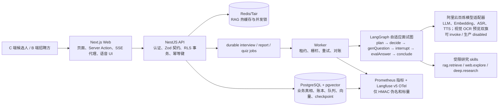

# 当前运行时事实矩阵

## 1. 使用规则

本文回答“现在代码实际是什么”，而不是“未来希望它是什么”。每项只能使用下列状态之一：

| 状态 | 含义 |
| --- | --- |
| 已验证 | 代码已存在，并有列出的可复现命令或真实运行证据。 |
| 已接线待验 | 代码路径和配置已连接，但没有对应的真实依赖、云环境、容量或故障演练证据。 |
| 仅设计 | 文档有方案，仓库没有完整运行时实现。 |
| 发布阻断 | 已发现会影响安全、隐私、数据正确性或可用性的缺口。 |

目标文档、注释和面试材料若与本文冲突，必须先修改目标文档或实现，不能挑更好看的说法对外宣传。

测试、评测、演示或目标态代码与真实生产路径之间的已知差距，统一登记在
[`production-readiness-remediation-register.md`](../delivery/production-readiness-remediation-register.md)。
登记不是修复；只有对应运行时验收和复审完成后才能关闭。

## 1.1 GitHub CI/CD 与线上预览事实

| 面 | 当前事实 | 状态 |
| --- | --- | --- |
| PR CI | `main` 要求 `trusted-governance-history`、`verify`、`secrets-scan`，最新 main CI 为绿；nightly 真模型项因无 secrets 全部 skip。 | 已验证，但不证明真模型或部署。 |
| 完整 CD | 远程 `main` 没有 `deploy-full-stack.yml`；本地文件仍未跟踪且依赖多份未跟踪 controller/migration 文件。 | 发布阻断。 |
| ECS runtime | Web/API/Worker 仍由 legacy systemd 原生 Node 运行；Docker/Compose/CD controller 尚未 provision。 | 已验证现状。 |
| Pages | 仓库 `docs/` 是预览版静态项目展示（仅面试练习、架构亮点、合成截图；必要说明只在页脚；招聘不在本预览范围），由 `.github/workflows/pages.yml` 在 `main` 上复制 `docs/` + `apps/web/docs/screenshots/` 发布。它不是应用运行时，不启动数据面，也不再使用已删除的 `preview-site/` 签名目录。公网若仍显示旧「预览环境准备中」文案或求职者/面试官双角色导航，只说明 Pages 尚未切到该 workflow，不能当成应用部署证据。git `main` 现为 `e4e0d58`（#97 后，含 #89/#91/#92/#93/#94/#95/#96/#98）。四门 130 迁移回执仍钉在产生它们的本 PR CI tip `06b46c4`（run `33867570523`），不是本 tip；#97 / #96 未改这四门 prove 源码或迁移。 | 已接线待验。静态目录与 workflow 在仓库内可核对；公网切换与 GitHub Pages 环境授权不是本文件的发布证据。 |
| 数据库 | git `main` 最新迁移号为 `0130`（`0124`–`0130` 已在树）。2026-08-20 审计快照曾写线上 `meetwise_cloud_test` 已应用 `0121_resume_pgcrypto_runtime_acl`、当时远程 main 只有 `0120`；那是云库与 git 的滞后记录，**不是**当前 git 事实。线上是否已跟进 `0130` 须重验。 | 发布阻断：云库对齐未在本切片证明。 |
| ACR | 后端候选镜像可解析，配套 Web 镜像不存在；ECS pull 身份/config 未 provision。 | 已接线待验。 |
| 回滚/E2E | 候选在 publish 前未启动 Web、迁移前未静默全部旧写者、后半程过早丢 rollback、未等待 Pages final exact receipt。 | 发布阻断。 |
| 公开预览写门禁 | `MEETWISE_PUBLIC_PREVIEW=1` 时 NestJS(Fastify) `onRequest` 放行 `GET`/`HEAD`/`OPTIONS`，并额外放行受控 `POST /interview/:id/answers`（预览账本提交，`preview-controlled-write`，见 `UC-INT-TRANSCRIPT-PREVIEW-SUBMIT`）。其余 mutating 方法仍 503。`InterviewService` 其它面试/评分写方法与 `ApplicationsService.start`/`finalize` 在 `asPrincipal` 前再失败关闭；`/answers` 走 `assertPublicPreviewControlledWriteAllowed`，非预览固定 404。写面由 `ai-docs/architecture/backend/public-preview-write-inventory.json` 枚举。预览 `/turn` 的 `503 public_preview_read_only` **不是**关闭 `INT-P0-RAW-QUEUE`。非预览 `/turn` 仍写明文 job payload。预览 `/answers` 只落 0092 rehearsal 账本，**不是** `INT-TRANSCRIPT-01` cutover，也不是隐私删除入口。公开删除仍 503。Web 中间件对非安全方法仍 503（本包不加 Web 代理）。公开展示站（Pages / Web 中间件）仍不接收作答：无 `/api/interview/:id/answers` 代理。 | 已接线待验。本地 `releaseEvidence=false`，不是 ECS listener、镜像摘要、健康回执或发布证据。`TC-public-preview-01-*` 仍为 planned/unmapped。 |

“CI success”“Pages 200”“release workflow success”分别只证明对应检查，不能互相替代，更不能宣称最新前后端已自动部署。

### 首次术语表

| 缩写/术语 | 中文含义 | 本项目中的作用 |
| --- | --- | --- |
| C 端 / B 端 | 面向个人消费者 / 面向企业客户 | C 端服务候选人的简历与训练；B 端服务招聘方的岗位、投递与评测。 |
| API | 应用程序编程接口 | Web 与 NestJS 服务之间的受契约约束请求边界。 |
| RLS | 行级安全 | PostgreSQL 按当前主体限制可读写的行。 |
| SSE | 服务器推送事件 | 前端消费可重连的业务事件流，不把连接当作业务真相。 |
| LLM | 大语言模型 | 出题、评估等模型能力；输出必须经过结构和业务校验。 |
| RAG | 检索增强生成 | 先从受治理题库检索证据，再约束模型基于证据生成。 |
| CRAG | Corrective RAG（纠错式检索增强生成） | 当本地证据低置信时，按规则决定是否受限外查或澄清，不能自由外发。 |
| OCR | 光学字符识别 | 将图片简历转写为文本，后续仍经过同一清洗和注入防护链路。 |
| ASR / TTS / VAD | 自动语音识别 / 文本转语音 / 语音活动检测 | 人与 AI 的轮次式语音输入、播报和静音/说话判定。 |
| OTel | OpenTelemetry（开放遥测） | Langfuse 的图、节点和模型调用脱敏追踪通道。 |
| HMAC | 带密钥哈希消息认证码 | 把外送标识变为不可逆的稳定伪名，不能替代授权。 |
| ANN / RRF | 近似最近邻 / 倒数排名融合 | 向量候选检索与多路排序融合策略；必须用冻结数据集比较。 |
| TTL | 生存时间 | Redis/Tair 缓存项和锁的自动到期时间。 |
| SSRF | 服务端请求伪造 | 外部网页检索必须防止模型或用户诱导服务端访问内网。 |
| DOM | 文档对象模型 | 浏览器中实际挂载的页面节点；流式 UI 必须限制其增长。 |
| TLS | 传输层安全协议 | 云 PostgreSQL、Redis/Tair 和第三方服务传输加密的最低要求。 |
| E2E | 端到端测试 | 从接口、队列、数据库到页面/运行时的可复现测试，而非只测单个函数。 |

## 2. 一张图看清当前系统



PostgreSQL（关系型数据库）承载业务真相，Redis/Tair（内存键值服务）不承载扣费、授权、版本指针或最终业务状态。对象存储、云 PostgreSQL、云 Redis 的生产连接尚没有完成真实 E2E（端到端）验证，不能根据图示把它们视为已发布服务。

## 3. C 端与 B 端的实际职责边界

| 面 | 用户路径 | 真相源与关键约束 | 当前状态 |
| --- | --- | --- | --- |
| C 端简历与诊断 | 上传/解析简历，诊断、押题、模拟面试、报告 | 简历与派生工件、权益账本、面试事件、报告状态均在 PostgreSQL；普通 C 端新 begin（开始）将 `(resume_id,resume_privacy_epoch)`（简历标识、隐私世代）一次写入 `interview`（面试）。v64 start（开始）任务保存同一对，v64 answer（回答）只保存 epoch（世代）且不保存 locator（定位器）；worker（后台进程）在 payload（载荷）、checkpoint（检查点）、画像、解密或模型前拒绝 v49/v50/NULL（历史/空值）任务。押题/诊断新 job（任务）使用 `resume_id + privacy_epoch + version 61`（简历标识、隐私世代和引用版本），claim（领取）不返回 JSON（JavaScript 对象表示法）载荷；历史任务会终结并清空载荷。模型输出先过 schema（结构校验）和业务校验。 | 64 个迁移后的面试/派生引用门有本地隔离 PostgreSQL（关系型数据库）证据；完整简历擦除、全格式文档摄取和真实云对象存储仍待验。 |
| C 端实时交互 | SSE（服务器推送事件）重连、文本输入、语音“AI 说题 → 用户回答” | `resultId`/`threadId` 是恢复句柄；事件账本与 checkpoint 可恢复；客户端只保留易失 UI 状态。`SCOR-00H`：`answer_evaluated.score` 须 canonical `q-v{stateVersion}-t{turn}-c{n}` **加** `answerId`/`answerHash`/`competency` 才展示练习 hint；缺身份或 `report_ready.overall` 非 0..100 整数不展示分（不是 0）。`session_concluded` 只展示练习控制流的 `early_weak`/`thrashing`，不改 phase、不发明分。`GET assessment`/`GET career-path`/`GET /profile/growth`/`GET report`/`exportReport`/share 不重跑该闸。证明=`pnpm web:prove`（含 `report_ready` 非整数不入视图），非隔离 HTTP。 | 已验证本地流事件归约和大流渲染；真实电话网络、长时语音和设备矩阵待验。练习 hint 不是测量权威。`session_concluded` 不是等级鉴定。 |
| C 端进度投影 | 成长主页「已答题数」、`/interviews` 与详情进度文案 | `GET /interview` 用 LATERAL 从 privacy-active 的 `interview_question`（题目账本）投影：`issued_turns`=`status<>'cancelled'`，`answered_turns`=`status='answered'`，`current_turn`/`processing_turn` 分别为 issued/queued 的 max(turn)。`GET /profile/overview.answered` 是同一 `answered` FILTER 的全局计数。`interviewsByStatus` 同样只计 privacy-active 场次。`avgScore` 与成长档案 `totals.answered`（文案「累计已评分」）仍只读可评分 ScoreCard。单场文案走 `interviewProgressLabel`（completed=`共 N 题`，进行中优先「处理中/待答」）。题目账本不是测量质量、B 端排序或用途授权的事实根。成长主页「已答题数」经 `overviewAnsweredLabel` 取数失败渲染「—」；面试场次在 overview 解析失败时同行内为「—」（`dashboard/page.tsx`，未单独抽到 `web:prove`）。不把缺失伪装成 0。 | 代码已接线；已答题数与列表合计断言写入 `pnpm api:validate` 与 `pnpm web:prove`。不证明浏览器实操、overview 擦除 HTTP、场次聚合单元或发布。 |
| B 端招聘 | 招聘方建岗位、候选人投递、邀请 / 流程状态（无数值评测）、人才池 | `job_application` 与 interview attempt 的绑定、状态机、RLS（行级安全）和结算必须同事务收口；新 application（岗位申请）面试在创建时写入 parent `(resume_id,resume_privacy_epoch)`（简历标识、隐私世代）。遗留 `/answer` 固定拒绝为 `410`；`pnpm scor-00:http:prove` 已在完整迁移的隔离 PostgreSQL、独立低权 runtime login 与真实 HTTP 中验证 C/B、重放、并发与跨主体调用对 event/job/消费/report/assessment/application status/score 的增量均为 0。`SCOR-00H` 另将转写/`POST` 评估/`POST` 职业路径/SSE 接到域诚实闸：无 canonical question+answer identity 的事件分不展示、不聚合为 0；域 `refuseMappedBSideScore` 恒失败（**不拦截** worker/`markApplicationNoEligibleScore` 仍读的 event `.score` hint）。空评估 HTTP 为 `409 no_scorable_cards`，缺 overall 的 career 为 `409 insufficient_evidence`。`GET` 读路径不重跑该闸。`listScorableScoreCards` 仍含 `b_review_eligible`。C 端题目账本可投影进度（已出/已答，见上行「C 端进度投影」），但 event/question 加上该闸仍不是不可变 ScoreCard 事实根，不能作为测量质量、用途授权或排序依据。迁移 `0082` 将 B 端数值分置空并转为 `assessment_unavailable`，人才库不提供数值排序。招聘方 App 现有 `/recruiter/how-it-works`（内部架构笔记：跟着问/服务端进度/可核对保护/评分诚实/两边分开记账/面试队列轮转（`0128`）/检索权限）与 `/recruiter/jobs/:id/applications/:applicationId`（只读申请状态，复用候选人列表投影，忽略 score）。这些页不是已上线的招聘方产品，也不是求职者/面试官两套对等产品面。面试排队轮转不是招聘方产品 SLA，也不是高峰容量保证。C 端「我的投递」不再渲染申请分数。静态 Pages 展示不在本切片改写。`0126` 答题双写互斥已在主线落地，不是 `INT-TRANSCRIPT-01`；`/turn` 仍可写明文，招聘方状态页看不到作答原文。 | 上述仅为本地组合根回执（`releaseEvidence=false`），不构成发布或招聘测量证据。不是招聘方产品已上线。B 端只能看申请状态，没有人工复核工单；canonical answer artifact、专用 score-writer、完整评分卡/校准与人工复核工单仍待实现。`0128` 只接线面试队列 owner 轮转，押题/诊断/报告仍抽干，不是高峰容量保证。状态页不是审核后台，也不是完整 transcript。 |
| 计费与权益 | 预留、调用、确认、失败释放、对账 | 每个可计费调用以幂等键、租约和账本状态防止重复扣费；Redis 锁不能替代数据库账本。 | `HC-GAP-012`：commerce **50/50**、quiz **22/22**、reaper **28/28** 已在 130 迁移隔离 PG 重跑（本 PR CI run `33867570523`，tip `06b46c4`，`releaseEvidence=false`；回执钉在该 tip，不是当前 `main` `e4e0d58`）。支付渠道及云故障演练待验。 |

## 4. 请求、异步任务与一致性

1. Web 不把面试事实放进浏览器缓存。页面从 API 读取权威状态，SSE 只运输业务事件；断线使用 `Last-Event-ID`（最后事件编号）续传。面试 / 押题 / 诊断长连接是 **2 秒轮询账本**，不是跨进程扇出；每 API 进程每主体最多 5 条 SSE（进程内 Map）。service 层 `parseLastEventId` 失败关闭非法游标；无库确定性证明 `pnpm last-event-id:unit:prove`（per-push CI）。共享 `sse:principal` 槽的无库 HTTP hijack 5+1 → 429 由 `pnpm sse-slot:prove` 证明（per-push CI；真实 controller/`*.events()` + counting `asPrincipal` stub，**不是** 隔离库 `DbService.asPrincipal` 或 `api:validate`；`HC-GAP-007` 已关）。**前端不得把 HTTP 400 `invalid_last_event_id` 当断线重连**：三路流驱动停转 / degraded，不得用同一游标重试（`pnpm web:prove`，`HC-GAP-014` 已关）。**HTTP 400 由 `pnpm api:validate` 对面试 / 押题 / 诊断三条路径断言**（同一组坏游标；`Infinity` 不触发 catch-up SQL；`HC-GAP-006` 已关）。跨副本槽仍是 `HC-GAP-008`。五面并发复核见 `architecture/backend/high-concurrency-review.md`，该页不是容量 SLO。
2. API 在认证后进入 `asPrincipal` 事务，向 PostgreSQL 写 principal（主体）上下文。普通业务容器不应拥有迁移角色权限。
3. 需要模型、长计算或可恢复执行的请求先写业务记录和 durable job（持久任务），worker 再按租约领取。任务状态、模型调用状态和权益状态分别持久化，避免 HTTP 连接中断成为业务失败。
   面试、押题、诊断与报告的 `queued` 转换已接入 PostgreSQL 提交后固定 `wake` 和 worker 专用 `LISTEN` 会话；通知不含任何业务数据，只合并唤醒现有领取 loop。每类 loop 仍以 5 秒为上限做恢复扫描，覆盖监听启动/断线窗口、过期 lease（租约）和到期报告重试。现有代码/本地生命周期合同已接线，但真实 PostgreSQL 的 transaction、trigger、RLS、多副本和故障恢复验收不能称为发布证据。
   面试队列另接了 `WORKER-DISPATCH-002` 的公平切片：gateway（迁移 `0128` 已在 main；`0124` RAG ACL、`0125` memory_vector_chunk、`0126` 答题双写围栏、`0127` 简历 OCR provenance、`0129` 隐私预览擦除账本与 `0130` same-key claim join 亦已在 main。本预览账本变更不改号、不占用 0131；公开预览下 `/privacy/erasure-preview` 仍 503）按最老等待 owner 排序；tick 先按 owner **隔离** reap（单个失败不中断后续 owner，且该失败 owner 本拍不再 drain），再在仍有配额的 owner 间轮转启动 `drainInterviewJobOnce`，不再把单个 owner 抽干。`globalInflight>1`（默认 4）时多个 owner 的切片可以重叠。`idle` 只表示 claim 为 null；隐私围栏后归还、丢租约、graph fence 未取得/`graph_fence_lost` 归还、`markDone` CAS=0 都返回 `retry` 并留在本拍轮转，单 owner 每拍最多 32 次 launch。`claimNextInterviewJob` 用 owner advisory lock + **未过期** running 计数把每 owner 并发默认限制为 1（过期 running 不计入，以便回收；同一拍先 reap）。`WORKER_INTERVIEW_GLOBAL_INFLIGHT` 只限制**本进程**同时 drain；非法预算在任何消费循环启动前失败关闭。押题/诊断/报告仍按 owner 抽干（`drainOwnersInListedOrder`，无库合同 `pnpm owner-drain-order:unit:prove` 证明顺序是 `A,A,A,B`，不是面试轮转；这三类 gateway 仍是 `DISTINCT`，无最老等待排序）。进程内 global cap 不是跨副本集群锁；per-push CI **只**跑 `pnpm interview-dispatch:unit:prove` 与 `pnpm interview-dispatch:gate:prove`（无库），**不**跑 `pnpm interview-dispatch:prove`。`pnpm interview-dispatch:prove` 只接受远程 Postgres（`E2E_CLOUD_ISOLATED=1`）；包装器禁止 isolated profile / loopback / compose 主机名 / `DATABASE_URL`，缺远程配置失败关闭，不得改起本地库。完整 SQL 路径另走 `assertIsolatedTestTarget` 的 cloud attestation。远程成功时写入 `.tmp/interview-dispatch-receipts/*.json`（gitignored；`releaseEvidence=false`）。本环境无远程通过回执。不得把即时 wakeup 或本切片写成繁忙状态的端到端延迟或容量保证。设计细节见 `architecture/backend/worker-dispatch-fairness.md`。
4. Worker 使用 interview graph fence（图执行栅栏）阻止旧 worker 在租约转移后提交投影；模型调用通过 durable claim（持久领取）记录。API（应用程序接口）和 worker 启动时共同校验三项 deadline（截止时间）：`MODEL_EXECUTION_TIMEOUT_MS`（网关执行，1,000–120,000 毫秒，默认 35,000）、`MODEL_TIMEOUT_MS`（HTTP 传输，1,000–执行时限，默认 30,000）和 `MODEL_INVOCATION_WAIT_MS`（同键轮询，100–120,000，默认 35,000），以及 `MODEL_MAX_CONCURRENT`（并发，1–1,000，默认 4）/`MODEL_RPM`（每分钟请求上限，0–1,000,000，默认 0=不额外节流）。限流 admission（准入）先取得可取消的 RPM 发送许可与并发容量，之后才写 `dispatching`（已派发）/费用状态；准入超时是确定未发送，已派发调用超时才写 `unknown/model_execution_timeout`。派发前数据库异常同样释放本地准入槽位。`ai_model_invocation.cost_scope_id` 在领取时绑定预算 scope（范围）；对账只按 `(scope, owner, idempotencyKey)` 冻结匹配费用，不会占用同主体其他 RAG（检索增强生成）或业务预算。`MODEL_INVOCATION_RECONCILE_AFTER_MS`（派发后对账窗口，35,000–3,600,000 毫秒，默认 120,000）还必须**大于**执行时限加 30,000 毫秒终态化宽限；否则 worker 启动失败，不能提前把合法执行中的请求标为未知。陈旧 `dispatching` 仅会原子冻结为 `unknown`，不会自动释放或再次外发；对账枚举/主体事务失败会使 drain loop（排空循环）连续失败并转为未就绪，关键告警 `ModelInvocationReconcileUnavailable` 触发。指标 `model_invocation_reconcile_invocations_total` 与 `model_invocation_reconcile_frozen_costs_total` 记录该人工对账队列。网关把 AbortSignal（中断信号）传给队列与 HTTP 适配器；迟到成功不能覆写未知终态或写成功工件/trace（追踪）。不自动重发同一幂等键，业务结果只能同成功标记一起提交。

   `docker/compose.prod.yml` 已把 Prometheus（监控采集器）与 API/worker 放在同一 compose 私网：worker 仅 `expose`（容器私网暴露）`9091`，Prometheus 用服务名 `worker:9091` 抓取，不映射该端口到宿主机/公网。`pnpm deploy:check` 已验证这份编排契约；**尚未**在云主机完成真实 scrape（抓取）与告警投递演练，且 Alertmanager（告警路由器）接收器仍是无密钥占位，因此不能把规则 lint（静态检查）当成真实通知闭环。
5. 报告是独立 worker 舱壁。评分失败必须形成 `unscored`（未评分）或不可用终态，不能伪造成成功评分。

### 当前模型路由边界

自适应图不是每个节点都调用模型：`plan`、`decide`、`awaitAnswer`、`conclude` 为确定性节点，grounded 首题为模板，空答/跳过不评分；常规出题、正常评分、规划、报告和诊断才会调用文本模型。当前的 default/fast 文本 client 各自使用进程内 admission；`resume.ocr.v1` 已有 typed binding 缝，但生产 OCR 组合根仍 fail-closed，ASR、TTS 与 embedding 仍由组合根直接构造。因此 `MODEL_MAX_CONCURRENT` / `MODEL_RPM` 不是所有百炼能力共享的全局上限。已批准、不可变的文本成本策略会将最大输出 token 下传到供应商，拒绝请求模型与策略模型错配，并在 durable claim、费用预留和 HTTP 前以版本化保守估算检查已渲染文本、结构化输出 reserve 与图片 reserve 的 context window；它不是供应商 tokenizer、类型化 component ledger 或所有适配器的预算器。文本的 provider/model/region/price revision 已进入请求摘要、worker 启动时低权价格行断言和精确费用预留。

迁移 `0085` 只为当前文本调用建立 canonical logical-node header、不可回收 dispatch slot 与**只覆盖 `claimed → dispatching` 更新**的数据库围栏。工作树候选 `0088` 改为撤销 `app_role` 对 invocation 的 INSERT/UPDATE/DELETE，只开放固定 claim/dispatch/fail-claim/terminalize/reconcile 过程，并以私有 permit trigger 防御 ACL 漂移下的直写；它已取得本地组合根回执（`pnpm model-op00:prove`，2026-08-16，89 个迁移、`0085`/`0088` 均参与、exit 0，`releaseEvidence=false`），direct INSERT、非法 terminal、派发后 identity mutation 与 reservation mismatch 均由真实低权 SQL 拒绝。故 raw SQL 状态机围栏已有本地证据、待独立复审；但 node digest 仍由调用方参与构造、catalog 仍未被 `invoke()` 主链消费，`MODEL-OP-00` 整体仍未关闭。

**出题 fail-closed（`UC-MODEL-ROUTE-04`，本地接线）：** 缺 Key、超时、畸形/schema 失败、critique 失败、跨场重复，以及 fundamental 路径上的 embedder/reranker 原生失败（`*_not_configured`/`*_timeout`/`*_malformed`）不再写确定性兜底题面。`retrieveAndGenerate` 返回 `QuestionGenerationResult`；`ok:false` 只带 `provenance.origin=unavailable` 与稳定 `errorCode`，不含题面。registry `fallbackAction` 为 `generation_unavailable`。图 `genQuestion` 不写 pending，条件边直接 `conclude`。lifecycle 发 `interview_unavailable{reason,provenance}`（`event_key=interview_unavailable:terminal`）并 `failInterviewAndRelease`，`question_ready` 增量为 0。grounded 首题仍是批准模板，但 provenance 必须是 `approved_template`，且不复述简历原文。评分失败继续 `unscored`。规划失败仍用 conservative 默认能力集（有意 fail-soft，不是出题发明）。题库 `not_ready`/空命中仍可按能力出题（不是原生 endpoint miss）。scenario/behavioral 无检索材料时，题面保留、幻觉 refs 丢弃为空；**不**把 leftover citation 当成 `interview_unavailable`。有检索材料时未知 ref 仍 fail-closed。

本分支已跑绿（无 Postgres）：`pnpm question-generation-fail-closed:prove`（含 leftover citation 丢弃 vs 有检索未知 ref fail-closed）、`pnpm native-fail-closed:prove`、`pnpm adaptive-graph:prove`、`pnpm adaptive-grounding:prove`。`pnpm adaptive-degrade:prove` / `pnpm adaptive-life:prove` / `pnpm adaptive-flow:prove` 需隔离 PostgreSQL：**只用 remote DB env 或 GitHub CI 隔离库，禁止本 agent 起本地 Docker Postgres**。GitHub Actions `verify`（run `33851407093`，tip `22bde9b`）已重跑 `adaptive-degrade:prove`（含拆开的 eval/generate AbortSignal 计数）为通过；这不是本机 remote-DB 回执文件，也不是发布证据。旧 2026-08-10 degrade 回执已过期。多轮脚本模型必须每轮发出不同题面：critique 判 duplicate 现在 fail-closed，不再发明替补题。均 `releaseEvidence=false`，不证明真百炼或发布。

`resume.ocr.v1` 已有 typed operation binding 与密封 provenance：`bindResumeOcr` / `visionOcr` 在 invoke 前解析冻结北京 **identity**（`endpointProfileId` / `admissionKey` / `modelOrRecipe`）。这是身份封印，**不是**出站 host pin：HTTP 仍走注入的 `ModelClient` + `vision-endpoint-config`，也不是 invocation↔blob 哈希链。binding 缺失、未接线、provider URL 媒体或图字节 digest 错配为零 claim / 零外呼。成功转写附带 `SealedOcrProvenance`（operationId / registryVersion / endpointProfileId / modelOrRecipe / mediaDigest，无原文、无 Key）。面试 start/answer 经 `admitInterviewResume` 读 `source_kind + ocr_binding + profile.facts`（列来自迁移 0127，已在 main `76d5d0f`），**不解密原文**；缺 `source_kind` 不得默认成 `text`。图片源缺 binding 则 `resumeProfileAvailable=false`；worker / 面试图 / API interview 模块不得调用 `visionOcr`。押题/诊断仍解密 blob 做 grounded 出题，**不在本切片加 OCR 授权门**。这是**预览版**能力：精确双旗 `OCR_ENABLED=1` 且 `OCR_PREVIEW=1`、且非 production/enforce/公开只读预览时，组合根可派发 `visionOcr`；失败不编造转写。组合根把同一 env snapshot 传给 `openAICompatibleClient`：bound-operation 围栏只叠加已定义非空键，缺/空/`undefined` 键继承 process.env，进程级 dotenv `MODEL_COST_ENFORCEMENT=enforce` 不得覆盖已通过预览锁的 observe 客户端；省略 `cfg.env` 仍读 process.env。现场无参 `createOcrVisionClient()` 仍读 process.env。视觉 profile 仍 wholesale。生产/enforce/`MEETWISE_PUBLIC_PREVIEW=1` 或缺旗仍拒绝装配；缺旗上传图片走 `422 image_ocr_unavailable`。Web `/resume` **预览图片入口**用同一双旗（`isOcrPreviewEnabled`）：关闭态 `accept` 不含图片，Server Action 本地返回 `image_ocr_unavailable`，错误映射忽略 `text`/`transcript`，**不编造转写**。Live E2E 仍拒 `OCR_FAKE`。本切片不新增迁移（`0128`–`0130` 已在 main；下一空号 ≥`0131`）。不是视觉质量 SLO，`releaseEvidence=false`。批量 `voice.asr.v1` / `voice.tts.v1` 已在 registry 接线；API/worker 组合根仅在对应能力 Key 存在时构造百炼适配器，缺 Key、超时或畸形响应 fail-closed，不编造转写或音频。缺本能力 Key、传输超时、空 content/NaN 向量/缺字段抛 `*_not_configured` / `*_timeout` / `*_malformed`；ASR/TTS 非 JSON 保留传输码 `external_response_json_invalid`。**不**发明空转写、零向量、排序 id 或音频。流式 ASR/TTS、签名下载、embedding 与 rerank 仍未完成共享准入或统一 attempt/unknown。流式 ASR / 服务端 turn-taking 生产/默认 fail-closed；预览须精确 `VOICE_STREAM_ASR_ENABLED=1`+`VOICE_STREAM_ASR_PREVIEW=1` 且非生产锁，Key 单独不能开 WebSocket，组合根仍不接线 live stream，不得编造转写。原生 endpoint 已由本地版本化 Beijing profile registry 生成固定 HTTPS/WSS host/path；旧 `DASHSCOPE_*_URL` 环境变量会 fail-closed，生产/开发构造器拒绝 key/endpoint override，HTTP 请求拒绝 redirect。仅独立 `NODE_ENV=test` proof 可启用显式 fake transport override。这是静态传输收敛加 OCR 合同缝，不是 secret isolation 或唯一网关：生产 compose 已不把 DashScope 原生 Key/profile/model 交给 API，但 Worker 仍持有一把可调用多种原生能力的 Key。流式语音与原始音频手工 smoke 仍 fail-closed。**不含** `MEETWISE_PUBLIC_PREVIEW=1` 的全栈运行时，且能力 Key 存在时，预览版批量语音可走 `/transcribe`+`/speak`；失败回文字。公开只读预览部署下这三路由仍 503，只额外放行 `POST /interview/:id/answers`。不是生产 SLO。删除合同、媒体预算和脱敏视觉回执落地前，非生产也不得把用户图片或原始输出的 smoke 当作安全验证。完整矩阵见 `architecture/ai/model-operation-routing.md` 与 `requirements/use-cases/resume-ocr-binding.md`；在 `MODEL-OP-00…03` 完成前不得把单一 API Key、local proof 或环境变量路由称作统一模型治理。

这一层的核心不是“恰好一次调用模型”——外部模型供应商不一定提供可验证幂等协议。可承诺的是：本系统不会在不确定结果上自动盲重发，且扣费、业务投影和人工对账都有可审计状态。

## 5. Agent 图、Tools 与 Skills

### 5.1 当前唯一生产面试图

代码目录为 `packages/ai-graphs/src/adaptive-interview/{state.ts,nodes/,graph.ts}`：

```text
plan → decide ──┬→ genQuestion ──┬→ awaitAnswer(interrupt)
                │                │           ↓ resume
                │                └→ conclude（无 pending：generation unavailable）
                └← evalAnswer ←───────────┘
                           ↓
                        conclude → END
```

- `plan`：图内只消费已确定的能力维度；简历画像的解析与能力规划发生在图外受控边界，图 state（状态）只持有“画像可用”布尔量。历史弱项只能软偏置能力顺序，不能直接抬高/降低评分。
- `decide`：依据可持久化的 `mind`（覆盖、证据计数、会话信号、软预算、绝对杀开关、轮次、难度、分数轨迹 `recentScores`、`pivotCount`）决定继续、加深、上调软预算或收尾；出处写入 `lastDecision`/`concludeReason`（`DecisionProvenance`）。停续是确定性政策，不是模型裁判。软预算由覆盖计划派生或由调用方给出，证据加深时可上调，**不是**「turn≥N 就停」。绝对杀开关默认 120（`boundedAbsoluteMaxTurns` 允许 60/90/120 档，再高夹到 180；生产 Worker 未接线选档），只防 runaway/成本滥用，不是面试质量政策，也不是 120 分钟面试。`observeInterviewSignals` 在杀开关之后消费 `weak`/`thrashing` → `early_weak`/`thrashing`（同真时 weak 优先；不改写 `maxTurns`）。另有两条会话级早停：abort-count `early_weak`、consecutive-pivot `thrashing`（均在 probe 之前）。`clarify` 续问不消费轨迹信号。这不是 `CompetencyLevelAssessment`，也不关闭 `INT-LEVEL-01`。弱/空转可在软预算触顶前早停；强+钩子可 `raise_soft_budget` 继续，直至覆盖满足或 `safety_ceiling`（默认 120）。这**不是** `INT-LONG-INTERVIEW-01`。`releaseEvidence` 对本长度切片为 false。详见 [interview-control-signals.md](../requirements/use-cases/interview-control-signals.md)。
- **当前实际终止面（短流程，不是 blueprint）：** `safety_ceiling` / `coverage_met` / `all_resolved` / `early_weak` / `thrashing` 经 `decideNext`→`concludeReason`（provenance）。`budget_exhausted` 仅枚举兼容，当前 `decideNext` 不产出。另有 `evalAnswer` 的 `unscored` / identity-mismatch 可直接 `concluded=true`，不经本 reason、不写 provenance。报告路径仍不读 `concludeReason`。`early_weak`/`thrashing` 另经 SIGNAL-SSE 预览投影到既有 SSE（见下条）。出题 fail-closed 走 `interview_unavailable`，不是本 SIGNAL-SSE 投影。
- **SIGNAL-SSE 预览投影（练习控制流，不是等级）：** 当图 `concludeReason.code` 为 `early_weak` 或 `thrashing` 时，worker 在既有 `interview_event` / `GET /interview/:id/events` 追加 `session_concluded`（`event_key=session_concluded`）。载荷只有 code/turn/citedCompetencies，不含 score/overall/band。其他 conclude 码与缺 provenance 不写。`session_concluded` **不是** SSE 终态。这不是 `CompetencyLevelAssessment`，不关闭 `INT-LEVEL-01`。`releaseEvidence=false`。见 [interview-signal-sse.md](../requirements/use-cases/interview-signal-sse.md)。
- `genQuestion`：模型调用被放在 interrupt（中断）之前；恢复同一 checkpoint 不会因为 `awaitAnswer` 重放而重复生成题目。缺 Key / 超时 / 畸形响应 / critique 失败时不写 pending、不发明题面，条件边直接 `conclude`，由 lifecycle 投影 `interview_unavailable`。
- `awaitAnswer`：只负责中断和恢复边界。
- `evalAnswer`：清除 pending/submitted、写评分投影或 `unscored`，再由 `decide` 选择继续/结束。
- `conclude`：结束图；报告生成不在图内，避免报告故障拖垮面试主链路。

`ADAPTIVE_INTERVIEW=0` 会使 worker 启动失败，旧固定题单不再是生产回退。这是为了避免旧图保留原始回答且没有 graph fence（图栅栏）。

### 5.2 Tools 与 Skills 的真实边界

当前没有“模型自行挑选任意函数、执行 shell（命令行）或写支付数据”的通用 Agent Tool Loop。面试图中的研究能力是静态白名单：

| Skill（受限能力） | 调用条件 | 约束 |
| --- | --- | --- |
| `rag.retrieve` | fundamental（需要通用证据的题型） | owner 范围、本地题库、版本/recipe 校验、有限 query 长度和调用次数。grounded（画像关联题）只发通用题面，不将简历事实带入检索或模型。 |
| `web.explore` | 低置信 CRAG（纠错式检索生成）分支 | allowlist、SSRF（服务端请求伪造）防护、8 秒超时、fail-soft（失败软降级）。 |
| `deep.research` | 显式注入依赖且预算允许 | 有界多源 allowlist；不是独立子图，也不是无限代理循环。 |

这里的设计价值是可解释和可限额；局限是还没有可复用的多 Agent（多智能体）子图、通用任务规划器或 B 端客服图。那些只能称为设计，不是现有产品能力。

## 6. RAG、版本与缓存

| 构件 | 当前代码职责 | 状态和边界 |
| --- | --- | --- |
| 题库版本 | `qbank_generation`、embedding recipe（嵌入配方）、active pointer（活动指针） | 已接线。查询要求 recipe 与 active generation 一致，内容 epoch 漂移会新建 generation，不能混向量空间；蓝绿、灰度和回滚运行手册存在，真实云发布演练未完成。**尚未**把 generation/recipe/工件哈希写入每道业务题与会话的 provenance（来源记录），因此历史题目尚不可按当时版本完整复现。 |
| 检索 | PostgreSQL + pgvector 的 ANN（近似最近邻）检索；可选 dense（稠密向量）、lexical（词法）和 RRF（倒数排名融合） | 当前小规模 holdout（留出集）结果只可用于现有题库默认选择，不可外推到全格式、企业语料或十万级索引。 |
| 岗位题域路由与桶内无题 | Worker 当前固定以“技术岗”启动；检索输入为 competency/difficulty。检索未命中时可走 **CRAG Web + LLM 出题**（不是 canned 兜底 stem）。供应商/native miss 仍 `generation_unavailable`，见 §4 出题 fail-closed。 | **生产 Worker 未接线 routed serving。** `RAG-FUNNEL-01A` 源码依赖闭包已密封：`principal.ts` 的 31 函数 + 15 表 + 2 视图（含原 §6.1–6.5 bounded reader / security-definer view / 词法 helper / pool/cache/epoch trigger）与 `0094` + `provisionQbankControlDefiner` 对齐；启动门禁按对象检查 owner、表级/列级 ACL、global/`public` default ACL、未知 `SECURITY DEFINER` 和 generation 分区/索引 owner。`qbank_curator`/`qbank_cache_epoch`/`qbank_visible_ref` 是刻意允许的 request 只读面，其他 manifest 原始表 raw read=0。本地 `qbank-handoff-closure:prove` 覆盖移交前 42501、移交后非 42501、ingest、lane(b) 撤销与 raw-read=0；`0124_rag_retrieval_acl_fail_closed.sql` 把空/空白 principal 的 bind/resolve/search/evidence 收成 `rag_acl_principal_missing`（42501）。编号：`0124_rag_retrieval_acl_fail_closed`、`0125_memory_vector_chunk_erasure`、`0126`、`0127_resume_ocr_binding_provenance`、`0128_interview_dispatch_fairness`、`0129_privacy_erasure_preview_path`、`0130` 已在 main。本变更不新增迁移，预览账本复用 `0092`，不占用 0131。域模块 `rag-retrieval-acl.ts` 是未接线的纯合同，不是 SQL 抛码。`releaseEvidence=false`；本机 Docker 不可用时当前树没有新的组合根回执，不能称标准部署已验证。它不是人工 `MetadataReviewReceipt` serving，也不是 track 硬过滤。本地 03–07 proof 只证明合同，Worker 仍固定“技术岗”，岗位 `job_posting.competencies` 未进入生产启动图。因此不得把当前 generic 出题称为“桶内无题时安全生成”。目标与验收见 `requirements/use-cases/rag-funnel-intent-routing.md`。 |
| 热缓存 | Redis/Tair 的 TTL（生存时间）结果与单飞锁；键含 HMAC、generation、recipe、权限/可见 epoch | 已接线待真实云 Redis 验证。Redis 故障是局部 RAG 降级，不允许回退成 PostgreSQL 查询结果缓存。 |
| 证据 | 向量 chunk 必须映射 approved source（已审批来源）和 qbank artifact；模型只能引用本轮 known refs | 0072 及此前的本地隔离回执只是历史证据：题目工件完整性、撤销即整题不可见、辅助裸 chunk 不可提升，均 `releaseEvidence=false`。`RAG-FUNNEL-01A` 的 31-function/15-table/2-view definer 闭包已在源码与 `qbank-handoff-closure.proof.ts` 中密封（含 reader/view/helper/trigger）；这仍不是 scope projection 或 routed serving，也不是云组合根回执。真实云秘密挂载、审核员后台、全格式 citation（引用定位）与撤回/删除全链路仍未证明。 |

已实跑的小型基线记录在 `testing/rag-retrieval-evaluation-baseline.md`：它明确把规模、语料、query（查询）分桶和指标局限写清楚。它不是生产召回率承诺。

## 7. 记忆、隐私与上下文

| 层 | 当前实际行为 | 状态 |
| --- | --- | --- |
| 工作记忆 | 当前轮 `pending/submitted(answerId)`、`mind`、状态版本写入 LangGraph checkpoint | 已接线；新图状态只持久当前 `answerId` reference（不是 canonical answer artifact）和“已授权画像存在”布尔量，评分节点在图外短期水合正文。旧历史/备份及全数据面物理删除仍未闭环。 |
| 任务记忆 | 跨会话精确题目去重；历史 `assessment_report` 中 gap 维度只读软偏置 | 已接线且刻意不使用语义召回，以避免确认偏误和不透明增长。 |
| 长期语义记忆 | 向量检索、用户事实衰减、可审计摘要、冻结 snapshot | 仅设计，未接线。 |
| 上下文压缩 | 模型输入长度截断和不可信 data envelope（数据封套）存在 | 端到端可评估的层级摘要/压缩恢复尚未实现。 |

**发布阻断：** 生产 checkpoint 删除仍不是可用功能。`0075` 已撤销普通 `app_role` 对两个 destructive（破坏性）安全定义者函数的执行权，且生产 HTTP（超文本传输协议）`DELETE /privacy/interview-data/:id` 与 `DELETE /privacy/resume-data` 固定 `503`，因为 `app.principal_user`（应用主体路由 GUC）可由持 runtime SQL（结构化查询语言）凭据者伪造，不能作为生产删除授权根。`0129` 另开**预览版**路径 `POST/GET /privacy/erasure-preview`：登录令牌可受理盘点请求并返回诚实回执（`edition=preview` / 预览版，`productionSloClaimed=false`，`completeness=preview_incomplete`）。面试范围链接既有 `interview_projection_begin_erasure`（0096），账户范围链接既有 `memory_vector_chunk_begin_erasure`（0125）。这不是 issuer 生产授权根，也不是跨存储删除 SLO。`0076` 会将升级前未终态 target（目标）隔离为 `authorization_paused`、清空 lease（租约）并保留围栏；`0077` 仅使专用 worker 经受限函数获得 `targetId + owner` 派发提要；`0078` 又将父 request 状态作为 list/claim/purge（列出/领取/清理）的数据库前置条件，并在配置专用 URL 时拒绝拥有 raw target（原始目标）读取、复制或旧 GUC destructive（破坏性）函数执行能力的错误凭据。它们均未重开生产删除入口。最新**历史**本地隔离回执为当时 78 个迁移上的暂停 DB（数据库）`2/2`、暂停 HTTP `4/4`，和真实 `0075 → 0078` prefix upgrade（迁移前缀升级）`14/14`；均为 `releaseEvidence=false`。当前 main 经 `0130` 共 130 个迁移（`0124`–`0130` 已在 main，本变更不新增迁移、不占用 0131）。`0130` 是 #72 的 same-key claim join；`INT-LEVEL-SIGNAL-01` / SIGNAL-01 已在 main，不是 `INT-LEVEL-01`。预览受控 `POST /interview/:id/answers` 复用 `0092`，受已落地的 `0126` 约束，不是公开删除，也不是 `INT-TRANSCRIPT-01`。HTTP 生产 503 路径源码现有 8 个会执行的断言（非预览 `/answers` 仍 404），休眠生产 202 套件在公开删除仍 503 时不得跑；预览删除 202 是另一条账本。无 Docker 时不得用新断言数替换该历史回执。旧 `23/23`/`10/10` 回执使用已撤销的 GUC 授权形状，只作历史定位，绝不能当作当前删除或发布证据。

`INT-TRANSCRIPT-00` 的独立 `PrivacyAuthorizationIssuer` 已在源码落地，但不是已关闭的删除权。`packages/domain/src/privacy-authorization.ts` 用 ECDSA P-256 / ES256 签发短时单次 JWS（`iss=meetwise-privacy-authz-v1`，`aud=meetwise-deletion-worker`）；私钥不进 SQL、worker、浏览器或 `AUTH_SECRET`。迁移 `0091` 增加 `privacy_authorization_snapshot`、`privacy_deletion_receipt`、`privacy_issuer` / `privacy_guard_owner` 角色，以及 issue / consume / claim / receipt / no-forge-completed 函数。`privacy_issue_authorization_snapshot` 按调用方字段落账，本身不做 JWS 验签；HTTP 未接线，privacy worker 仍走 `0077` checkpoint 原语，不得把“账本函数存在”说成删除授权已闭合。公开 `DELETE /privacy/interview-data/:id` 仍固定 `503 interview_erasure_authorization_not_available`：登录 HMAC 令牌不能打开**生产**删除。同一登录令牌可以走预览版 `POST /privacy/erasure-preview`，回执禁止 `completed` / `productionSloClaimed=true`。共享契约已冻结 `PrivacyAuthorizationSnapshot`、`PrivacyDeletionReceipt`、`PrivacyPreviewReceipt` 与 `InterviewAnswerSubmission` / receipt 形状；生产 DELETE 仍不进 OpenAPI，预览删除路径进 `apiContract` 并标明预览版。树上另有 `0092` 的 INT 域 rehearsal 表与 `submitInterviewAnswer` 函数，以及 `0096` 的 event/report/`ai_graph_run` rehearsal resolver/purge。预览版可将 `POST /interview/:id/answers` 接到该函数（`UC-INT-TRANSCRIPT-PREVIEW-SUBMIT`）；非预览该路径 404，OpenAPI 不登记。这不是公开 01 canonical raw write，也不能把 legacy `/turn` 明文 job payload 改称为已停用。`TC-INT-TRANSCRIPT-00-*` 仍为 planned/unmapped。无部署密钥注入、无真实组合根回执时，`releaseEvidence=false`，不得重开公开删除，也不得关闭 `INT-P0-ERASURE-ISSUER`。

当前图的 checkpoint 已把 raw answer（原始回答）收敛为短期 `answerId`（回答标识），只把“画像可用”布尔量传入图；生成题接缝明确传递空简历事实列表，`packages/ai-graphs/test/adaptive-interview.proof.ts` 逐条枚举 MemorySaver（内存检查点保存器）历史 tuple（元组），对回答与简历事实 marker（标记）均断言为 `0`。但这不代表 raw answer 已离开所有持久化边界：当前 API 会把它明文写入 `interview_job.payload`，worker 在有效 lease 内读取，只有 job 终态才剥离该字段。该 payload 不是加密 canonical artifact，也没有提交回执、用户可见时间线或完整删除 receipt；不得把它称为“短期 answerId 收敛”或安全的完整记录。

**答题双写互斥（0126，已在 main，不是 01）：** 同一答题身份不能同时存在 ledger `interview_answer_artifact` 与 **带顶层 `answer` 键** 的 legacy `interview_job`（`kind` 不豁免；剥明文前）。无 `answer` 键的 `kind=answer` job 可以与 artifact 并存，但仍挡住再写 ledger。`appendEvent` / `interview_event` 拒绝顶层 `answer` 键。错误码为 `interview_answer_legacy_plaintext_fenced`、`interview_answer_ledger_dual_write_fenced`、`interview_event_raw_answer_fenced`。切换图见 `architecture/backend/interview-answer-dual-write-cutover.md`。这只是互斥围栏：`/turn` 在无 ledger 时仍写明文 payload；预览 `POST /interview/:id/answers` 可走 `submitInterviewAnswer`（`UC-INT-TRANSCRIPT-PREVIEW-SUBMIT`），仍不是 `INT-TRANSCRIPT-01` 生产 HTTP；`INT-TRANSCRIPT-01` 仍 blocked。`0124`/`0125`/`0126`/`0127`/`0128`/`0129`/`0130` 已在 `main`。预览账本 HTTP 不是删除权关闭，也不改 0126 编号，也不占用 0131。

这同样不是完整删除权证明：`0096` 已为 event/report/`ai_graph_run` 补 **DB rehearsal** 物理 purge 与 sink receipt，生产公开删除仍 503，worker 未改走 `0091`。`0129` 预览路径可链接 0096/0125 begin 并返回盘点回执，但一份预览回执 `local_fenced` 不等于账户或跨存储删除完成。预览账本 HTTP 也不是该门的关闭。`0124_rag_retrieval_acl_fail_closed.sql` 已在 main（generic RAG 空 principal fail-closed），不重开生产删除。账户删除是**分 sweep**（0093 MEM 三 sink、0111 conversation events、0112 memory_summary、0118 compression、0125 `memory_vector_chunk`），一份 request `completed` 不等于账户删除完成。0125 只把 `vector_chunk.kind='memory'` 纳入账户回执（写围栏 + 物理 DELETE + 残留=0）；**不**改 0093 三 sink 形状，**不**删 `kind='qbank'`，也**不**覆盖 `user_memory`、`ai_invocation_trace.output`、备份、Redis/Tair、对象存储或 Langfuse。外部 target 无 receipt 时生产请求保持 `pending_external`。sink 盘点只维护在 `architecture/ai/privacy-deletion-sink-inventory.md`。`INT-TRANSCRIPT-00` 已有本地签发器、target/receipt 账本和 submission/receipt 合同，生产公开删除仍 503，真实 HTTP/SSE/RLS 组合根与部署密钥注入尚未证明；`INT-TRANSCRIPT-01` 的真实用户 write route 因此保持 blocked。必须继续做受控工件的历史 checkpoint 枚举/删除、逐 sink 回执和真实数据面验证，再讨论压缩、完整面试记录或长期记忆。

## 8. 语音与前端渲染

- 浏览器语音 UI 是预览版人机轮次会话：AI 的 TTS（文本转语音）播放完成或被打断后，浏览器才开启/保持 ASR（自动语音识别）录音并提交同一面试线程。文案标「预览版」；超时/畸形回文字，不编造转写或音频。它不是两个人电话，也不是全双工电话网关。
- API 组合根经 `createInterviewVoiceSeams()` 接线批量 ASR/TTS：`voice.asr.v1` / `voice.tts.v1` 须 wired 且存在独立能力 Key。Worker `voice-turn.ts` / `interview-voice.ts` 把 `audio → ASR → 图 resume → 下一题 → TTS` 套在同一业务图外，文本和语音共享题目、幂等、权益、checkpoint 和评分边界。未配置必须显式失败，不能把 fake 当线上服务。流式 `/speak/stream` 仍关闭（`streamTts` 为 disabled 则 503）。**流式 ASR** 与服务端 turn-taking 未验证：精确双旗 `VOICE_STREAM_ASR_ENABLED=1` 且 `VOICE_STREAM_ASR_PREVIEW=1` 才请求预览；生产 / enforce / `MEETWISE_PUBLIC_PREVIEW=1` 仍拒绝。双旗+Key 也不把 live stream 接到组合根（`streamAsrConfigured` / `turnTakingConfigured` 恒 false；`voice.asr-stream.v1` 仍 not_wired）。Key 单独不能开 WebSocket。`runVoiceAdaptiveInterview` / `vstream:prove` 只是 fake-seam 合同，不是产品 E2E。Live E2E 仍拒 `VOICE_FAKE` / `ASR_FAKE` / `TTS_FAKE`。`MEETWISE_PUBLIC_PREVIEW=1` 下 `/transcribe` `/speak` `/speak/stream` 仍 503；本切片只额外放行 `POST /interview/:id/answers`。
- `VoiceCallPanel` 有 VAD（语音活动检测）状态、回声消除、降噪、播放/录音互斥、reduced-motion（减少动画）样式和中断清理。真实网络抖动、设备兼容、长时录音和并发通话尚无发布级压测证据；`releaseEvidence=false`。
- SSE 高频更新先进入 reducer（归约器），经 `requestAnimationFrame`（动画帧）合并后再渲染；面试面板保留有限可见窗口，不会把所有历史 token（词元）逐帧塞入 DOM（文档对象模型）。本地浏览器流压力曾验证 20,002 重复 frame（帧）归约为 80 个唯一 DOM 节点；这是特定设备/构建的证据，不是全设备容量承诺。

## 9. 可观测性与评测

1. 模型调用有本地 trace（调用追踪）接口；Langfuse 已使用 v5 OpenTelemetry 适配器。可外送的只有 HMAC 伪名、版本、状态、时延、token 数、成本和检索分数；prompt（提示词）、回答、简历、评论、原始 owner/thread/幂等键和密钥禁止外送。
2. 图观测为 root graph span（根图跨度）→ node span（节点跨度）→ generation（模型调用）层级。启用时要求 public key、secret key、统一 HTTPS 地址和 `LANGFUSE_CORRELATION_SECRET`（Langfuse 关联密钥）齐全；缺失或冲突会拒绝 attach，不会静默“看似有观测”。
3. 离线评测目录是 120 条**合成合同**：24 正常（20%）、72 异常/对抗（60%）、24 已发现缺陷回归（20%）。每次代码变更应全量运行；目前只验证目录结构、安全字段和采样数学性质，未证明模型答案质量。
4. 在线 LLM-as-a-Judge（大语言模型充当评审）已有独立数据库控制面：按 `feature × language × modality × risk` 分层，每满 10 个合格候选用 HMAC（带密钥哈希）稳定抽 1 个；唯一 candidate/slot（候选/槽位）、CAS（比较并交换）租约、日/月预算、每日用户上限、`unknown`（未知）不重发与最小权限角色均经隔离 PostgreSQL（关系型数据库）实测。它只接受合成或公开许可的 HMAC 引用；没有真实用户 packet（数据包）服务时，`consented_deidentified`（同意且去标识化）会被拒绝。没有真实模型 Judge、人工校准、趋势告警或阻断发布的实验结果。
5. 已将 4 个合成 dataset（数据集）同步到已配置的 Langfuse 项目；还没有 Experiment、Score config（评分配置）或真实线上 trace smoke（冒烟测试）证据，绝不能把“数据集已创建”说成“质量闭环已运行”。

## 10. 证据、未验证项和发布判定

| 证据命令/操作 | 已知结果 | 它证明什么；不证明什么 |
| --- | --- | --- |
| `pnpm --dir packages/ai-graphs run prove:adaptive-graph` | 通过 | 自适应图拓扑、interrupt/resume 和异常序列的本地合同；不证明云依赖。 |
| `pnpm adaptive-signals:prove` | 本包本地证明 | 纯域 `observeInterviewSignals` + `decideNext` 消费 `early_weak` / `thrashing`；缺 `recentScores` 的旧 checkpoint 观察 fail-closed；分数样本不足不开 weak；thrashing 需 pivot+翻转同时成立；`safety_ceiling` 先赢；轨迹 weak 先于 `all_resolved`；双真 weak 优先；注入 band/年限不改变信号。不证明能力等级、B 端 band、ScoreCard 或云路径。`releaseEvidence=false`。 |
| `pnpm adaptive-signals-graph:prove` | 本包本地证明 | 图 `decide` 把 `DecisionProvenance` 写入 `concludeReason`；weak mind + `clarify` 续问不伪造成 `early_*`；信号不抬 `maxTurns`、不冻结产品轮次上限；装配图覆盖 `early_weak`。不证明动态时长或 `INT-LEVEL-01`。SSE 预览另见 `signal-sse:*`。`releaseEvidence=false`。 |
| `pnpm signal-sse:prove` / `pnpm signal-sse-contract:prove` / `pnpm signal-sse-worker:prove` / `pnpm web:prove` | 本包本地证明 | 纯域投影 fail-closed；契约 `.strict()` 拒 score/band 且不进 OpenAPI；worker 接线证明用假 `appendEvent`（无 DB）只在信号码时 append 一次；web 归约不改 phase、已有 hint 不被改成 0。**不**证明真实 `interview_event` 行、隔离 HTTP、SSE 帧或发布。`releaseEvidence=false`。 |
| `pnpm checkpoint-role:prove` | 通过，跨 owner 读取/更新/删除为 0；普通 app_role（应用运行角色）不能撤回，受控测试操作员撤回后旧 epoch（栅栏世代）写入和重新 enrollment（登记）均被拒绝 | checkpoint RLS + thread/epoch 写入栅栏的本地隔离；不证明公开删除授权、历史内容已物理擦除或外部传播。 |
| `pnpm runtime:isolated:prove` | 内核 37 个隔离 PostgreSQL（关系型数据库）断言（其中 7 个为执行时限/迟到成功/prepare（预派发准备）/非法等待预算回归）+ `HC-GAP-011` 5 条具名 claim-join 断言（`packages/ai-runtime/test/claim-join-orphan.proof.ts`）。per-push CI 跑的是同脚本 `pnpm runtime:prove`（CI Postgres，不是本隔离 runner） | 永不收口的已派发模型调用在 35–40 毫秒测试预算内变为 `unknown/model_execution_timeout`；同幂等键重放与双并发均只派发一次，AbortSignal 会被触发，迟到成功不能写工件或 trace。`0130` 把同键 claim 创建用短事务 advisory lock 串起来。具名负例（legacy 无 cost/operation、两路）：孤儿 create-permit 的 claim 只回 `wait`；`invoke()` 撞上该 permit 仍 calls=1；两连接同时无行 → claim execute=1 且 wait=1，invoke calls=1 且同值；清 permit 不得把 calls 变成 2。不证明供应商已取消计费、0120 槽交叉、lease 过期接管或账单对账。无新迁移。`0126` 答题双写、`0127` 简历 OCR binding、`0128` 派发公平、`0129` 隐私擦除保持原编号。 |
| `pnpm model-cost:isolated:prove` | 历史本地回执：11 个隔离 PostgreSQL（关系型数据库）断言、86 个迁移，`releaseEvidence=false` | 精确 price revision 预留、缺失/漂移价格拒绝、已派发超时的费用与调用一同为 `unknown`、RPM 准入超时零外呼/零预留。不同 policy 的半开 backup 尚未证明可安全重选；不证明供应商账单或跨副本共享限流。 |
| `pnpm model-invocation-reconcile:prove` | 历史本地回执：13 个隔离 PostgreSQL（关系型数据库）断言、86 个迁移，`releaseEvidence=false` | 仅证明 raw SQL 的无 slot `claimed → dispatching` 更新被拒绝、以及对账/RLS 局部语义；不证明 direct `INSERT dispatching`、非法 terminal transition、identity tamper 或完整状态机围栏。历史回执时文档另写「当前迁移已为 87」。git `main` 现为 130，必须重跑后才能作功能结论。 |
| `pnpm breaker:prove` | 通过，13 个确定性断言 | 半开期三并发只允许一个探针外呼，探针取消后 lease（租约）可再次取得；限流排队 abort（中断）后不会在旧槽位释放时晚到外呼，deadline（截止时间）及并发/RPM 配置会 fail-fast（快速失败）；不证明多进程/云 Redis 限流。 |
| `pnpm commerce:prove` | 2026-09-04 本 PR GitHub Actions `verify`（run `33867570523`，tip `06b46c4`）在 **130** 个迁移后的隔离 PostgreSQL 通过 **50/50**（`migrations: applied=130 skipped=0`）。CI 日志中的回执文件名（非本机文件）：`2026-09-04T11-25-22-420Z-9830-f021b569-7c06-474e-b1a6-4f78b0efe9ee.json`。`releaseEvidence=false`。本环境无远程 PG env，禁止起本地 Docker。2026-08-10 的 64 迁移 50/50 只作历史定位。 | 权益的 FIFO（先到期先扣）、幂等预留/确认/释放、并发不超卖、心跳—回收竞态、exactly-once（精确一次）结算账本、同支付流水只入账一次、16 轮确认/放弃终态配对，以及数据库约束拒绝绕过均在 **130** 迁移 schema 上由 CI 隔离库跑过；不证明真实支付服务商回调、云数据库故障恢复或资金清算。 |
| `pnpm resume:prove` | 2026-08-10 在 64 个迁移后的隔离 PostgreSQL（关系型数据库）通过 32/32，回执 `2026-08-10T10-26-21-992Z-15488-23fa0dfe-eb06-4933-81a5-4533a1385bf7.json`，`releaseEvidence=false` | 简历原文加密、结构化画像 PII（个人可识别信息）剥离、注入拦截、状态机 CAS（比较并交换）、HMAC（哈希消息认证码）去重、同主体复合外键、密钥轮换和 RLS（行级安全）越权拒绝均在当前 schema 运行；不证明 PDF（可移植文档格式）/表格/音视频摄取、对象存储、完整简历删除或任何云数据面。 |
| `pnpm adaptive-degrade:prove` | 旧 2026-08-10 回执 **已过期**（当时合同是「出题失败写兜底题继续」）。`UC-MODEL-ROUTE-04` 现合同为发明题面=0、`interview_unavailable`+provenance。GitHub Actions `verify`（run `33851407093`，tip `22bde9b`）已在 CI 隔离 PostgreSQL 重跑通过（含 eval/generate AbortSignal 分计数）。本 agent 隔离证明只用 remote DB env，**不起本地 Docker Postgres**；无本机 remote-DB 回执文件。`releaseEvidence=false`。 | 目标合同：出题缺 Key/超时/畸形不发明题面；评分已知未知与网关超时仍为 `unscored`。不证明真实模型质量、多副本 worker 或云端故障演练。 |
| `pnpm question-generation-fail-closed:prove` / `pnpm native-fail-closed:prove` / `pnpm adaptive-graph:prove` / `pnpm adaptive-grounding:prove` | 本分支本地跑绿（无 Postgres），`releaseEvidence=false` | 错误码分类、原生缺 Key/超时/畸形（含零向量/空 rerank）、图 fail-closed、grounded 模板、embedder miss 不发明 fundamental 题。不证明真百炼、隔离 lifecycle 或发布。 |
| `pnpm privacy-erasure:prove` | 2026-08-10 在 78 个迁移后的隔离 PostgreSQL（关系型数据库）通过 `2/2`，`releaseEvidence=false` | 普通 app_role（应用运行角色）对 checkpoint 删除受理和直接 revoke（撤销）函数的 `EXECUTE` 均为 false；即使 runtime 直接写入 victim GUC（受害者主体路由）也不能建 request/target（请求/目标）。这是安全暂停，不证明任意物理删除、外部数据面或完整简历删除。旧 `23/23` 回执依赖已撤销的 GUC 授权形状，已废弃。 |
| `pnpm privacy-erasure:http:prove` | 2026-08-10 在当时 78 个迁移后的隔离 HTTP（超文本传输协议）通过 `4/4`，`releaseEvidence=false`。当前树另有预览删除路径断言（缺幂等键 400、预览 202 回执未完成、同键重放、GET 回执、生产 DELETE 仍 503）以及非预览 `/answers` 404。503 路径源码现有 8 个会执行的断言，休眠生产 202 套件不得跑。本环境 Docker 不可用，不得填写新回执。 | 真实 `AUTH_SECRET` 登录令牌、重复 DELETE、以及把隐私 JWS 当 Bearer 都不能打开**生产**删除。预览删除路径是另一条账本，回执固定 `preview_incomplete`。非预览 `/answers` 404 不是 01 cutover。不证明签发器已接线到生产 HTTP，也不证明跨存储删除 SLO。 |
| `pnpm -C packages/domain prove:privacy-erasure-preview` / `pnpm -C packages/contracts prove:privacy-erasure-preview` | 源码级 pin，不依赖数据库。`releaseEvidence=false`。 | 预览目录与 0129/公开 503/预览版回执形状一致；`completed` 与 `productionSloClaimed=true` 被拒。不证明隔离库或云端删除。 |
| `pnpm privacy-authorization:crypto:prove` | 源码级确定性密码学证明；不依赖数据库。`releaseEvidence=false`。 | ECDSA P-256 签/验、kid 轮换/吊销、篡改/错 iss-aud、以及 `AUTH_SECRET` HMAC 登录令牌不能当隐私 JWS。不证明部署密钥、HTTP 接线或删除完成。 |
| `pnpm privacy-authorization:prove` | 源码已覆盖 issue/consume/claim/receipt、20 路 CAS、跨 owner、digest 漂移、AUTH_SECRET/GUC/raw SQL 拒绝与 lease takeover。本环境 Docker 不可用时不得填写通过回执。`releaseEvidence=false`。 | 仅在隔离 PostgreSQL 跑绿后证明 0091 账本与低权角色边界；不证明公开删除已开放，也不构成发布证据。 |
| `pnpm interview-answer-submission:prove` | 源码级契约证明；不依赖数据库。`releaseEvidence=false`。 | 冻结 submission/receipt 与预览请求 DTO：无明文、不进 OpenAPI；legacy `/turn` 仍在公开契约。不证明 01 生产 cutover。 |
| `pnpm public-preview-write-gate:prove` | 本地 Fastify inject + 服务层围栏；`releaseEvidence=false`。 | 预览入站仍挡 `/turn` 等写面；受控 `/answers` 过入站门；非预览 `submitPreviewAnswer` 404 且不进 `asPrincipal`。不是 ECS 或发布证据。 |
| `pnpm int-transcript-preview-submit:http:prove` | 账本 HTTP 须远程 Postgres 环境变量；禁止 `pnpm db:up`。本环境未注入远程目标时不得填写通过回执。`releaseEvidence=false`。 | 预览提交落入 0092 submission/artifact，无 plaintext `kind=answer` job；受 0126 围栏。不是 01 cutover，也不是删除已开放。 |
| `pnpm int-transcript-answer-fact-root:prove` | 源码与迁移 `0092` 已在树；隔离 PostgreSQL 证明须 Docker。本环境不可用，不得填写通过回执。`releaseEvidence=false`。 | 只证明 rehearsal 表/`submitInterviewAnswer` 的本地数据面合同；预览 HTTP 另证，仍不是公开 01 write route，也不证明删除已开放。 |
| `pnpm int-transcript-remaining-sinks:prove` | 源码与迁移 `0096` 已在树；隔离 PostgreSQL 证明须 Docker。本环境不可用，不得填写通过回执。`releaseEvidence=false`。 | 只证明 event/report/`ai_graph_run` 的 DB rehearsal resolver/purge；vector/trace 诚实未建 interview 作用域 target。不证明公开删除、worker 已改走 0091，或外部数据面已删。 |
| `pnpm privacy-erasure:pause-upgrade:prove` | 2026-08-10 在隔离 PostgreSQL（关系型数据库）执行真实 `0075 → 0078` prefix upgrade（迁移前缀升级）通过 `14/14`，`releaseEvidence=false` | `requested/fenced/purging/pending_external/partial_failed` 的旧 request（请求）及未终态 target（目标）都变为 `authorization_paused`，completed/erased receipt 保持原样，lease（租约）清空、旧 claim（领取）=0、既有围栏保持；暂停/partial-failed 父请求下的新 child target（子目标）无法 list/claim/purge，错挂 definer-owner（安全定义者所有者）、复制能力或旧 GUC destructive 函数 ACL（权限控制列表）的 worker URL 会被 startup catalog gate（启动目录门）拒绝。它不证明可重新授权或物理删除完成。 |
| `pnpm resume-erasure:foundation:prove` | 2026-08-10 在 64 个迁移后的隔离 PostgreSQL（关系型数据库）通过 `4/4`，回执 `2026-08-10T09-54-13-028Z-57659-43b93c4c-3cc6-4e89-87a1-3d024e92637c.json`，`releaseEvidence=false` | `app_role`（应用运行角色）不能直接删除简历/原文/画像，不能伪造墓碑状态或隐私世代，`erased`（已擦除）墓碑的内容 HMAC（哈希消息认证码）为 `NULL`（空值）且不参与上传去重；模拟 `erasure_fenced`（已围栏）/`erased`（已擦除）墓碑时，低权 SQL（结构化查询语言）对 blob/profile（原文/画像）读取=0，旧解密 helper（辅助函数）拒绝。它不证明已有 blob/profile 已物理删除，也不证明单简历删除接口、B 端撤销、模型外送回执或任何外部回执。 |
| `pnpm resume-derivative-reference:prove` | 2026-08-10 在 64 个迁移后的隔离 PostgreSQL（关系型数据库）通过 `3/3`，回执 `2026-08-10T09-54-17-673Z-50341-4653edfc-f6b2-4ad2-88c2-09997b295e68.json`，`releaseEvidence=false` | 押题/诊断新 job（任务）只接受同 parent（父实体）匹配的 `resume_id + privacy_epoch + v61`（简历标识、隐私世代和版本），claim（领取）不读取 JSON（JavaScript 对象表示法）载荷；两条历史载荷任务在模型调用=0 的情况下终结、原载荷残留=0、失败实体=2、终态事件=2、退款释放=2。`0062` 保持已围栏 interview（面试）事件拒绝，同时不误阻断 quiz（押题）/diagnosis（诊断）事件。它不证明完整简历删除或外部删除回执。 |
| `pnpm resume-reference:http:prove` | 2026-08-10 在 64 个迁移后的隔离 HTTP（超文本传输协议）通过 9/9，回执 `2026-08-10T09-49-06-636Z-35575-a9a33bd2-4925-4f99-ac28-2a1a6d332f6b.json`，`releaseEvidence=false` | C 端新 begin（开始）把同一 UUID（通用唯一标识符）和 privacy epoch（隐私世代）写入面试与 v64 start job（开始任务）列，任务 JSON（JavaScript 对象表示法）无简历 locator（定位器）；真实低权 runtime（运行时）登录直写 NULL（空值）/版本 NULL/伪造 v49、同租户错绑、跨租户错绑、answer（回答）的 locator（定位器）、错误 epoch 或缺失 epoch 均被数据库门拒绝；不证明删除状态机或 B 端投影撤销。 |
| `pnpm adaptive-consumer:prove` | 2026-08-10 在 64 个迁移后的隔离 worker（后台进程）通过 32/32，回执 `2026-08-10T09-48-14-515Z-35060-256a90bd-1e60-40b7-ad56-da31ebb85967.json`，`releaseEvidence=false`；测试实际 provision（供给）并使用低权 runtime login（运行时登录） | worker 只从 parent（父面试）的 `(resume_id,resume_privacy_epoch)`（简历标识、隐私世代）读取来源；claim（领取）先仅返回元数据。正常 v64 start/answer 会正向校准 decrypt（解密）/profile（画像）计数 hook（接缝）。payload-only（仅任务载荷）和表面绑定的 v49（历史版本）/NULL（空值）start，以及 v49/NULL answer 都在画像读取、可计数 decrypt、checkpoint（检查点）、图和模型调用前失败：这些副作用=0、`failed` 终态事件=1、paired release（配对释放）=1。它不证明全量 resume（简历）删除、历史分类或外部数据面擦除。 |
| `pnpm int-answer-dual-write-fence:prove` | 须远程 Postgres 环境变量；禁止 `pnpm db:up`。未注入远程目标时不得填写通过回执。`releaseEvidence=false`。 | 0126 答题双写互斥与事件禁原文：legacy **明文** job（顶层 `answer` 键）与 ledger artifact 对同一 `(interview, question, stateVersion)` 不能并存；残缺身份 fail-closed；`interview_event` 顶层 `answer` 被拒。预览 `/answers` 走 ledger 侧。不证明 `INT-TRANSCRIPT-01`、删除授权、删后 read=0、或 `/turn` 已停用明文。切换图：`architecture/backend/interview-answer-dual-write-cutover.md`。 |
| `pnpm last-event-id:unit:prove` | 无库确定性解析器 | 非法 `Last-Event-ID`（负号、小数、科学计数、`Infinity`、超安全整数、过长）失败关闭，不降级为 `0` 全量重放。HTTP 400 三路在 `pnpm api:validate`。不证明跨副本 SSE 槽。 |
| `pnpm model-slot-bypass:static:prove` | 无库静态门；per-push CI | `resolveModelAdmissionPartition` 无 `operation` 为 undefined；`invoke` 只在 `if (admissionPartition)` 内 await `admitSharedModelOperation` 一次。不读 `ai_model_concurrency_lease`，不能单独当隔离回执。`releaseEvidence=false`。 |
| `pnpm model-slot-bypass:prove` | 隔离 PostgreSQL 命令已接线；须 `run-e2e-isolated.mjs`。本环境无 Docker、禁止 compose.dev / 本地常驻库，**未取得新回执**。`releaseEvidence=false`。 | 合同：无 `operation` 的成功/在途 invoke 不改变 `ai_model_concurrency_lease`；有 operation 且 `max_concurrency=2` 时第三条 `model_concurrency_exhausted`、零外呼。不证明多 Worker 真副本，也不关闭 `HC-GAP-010`。 |
| `pnpm quiz-dual-claim:unit:prove` / `pnpm quiz-dual-claim:prove` | 无库门拒绝本地 Docker / loopback，并要求 `E2E_CLOUD_ISOLATED=1`。隔离库证明不在 per-push CI；缺远程配置必须失败关闭，不得改起本地库。本环境未注入远程目标时不得填写通过回执。`releaseEvidence=false`。 | `HC-GAP-004`：同 owner 同一押题 / 诊断 job 两连接并发 claim 恰一 `running`，败者 null 且事件/额度/父行增量=0。不证明 owner 级 cap、公平轮转、模型外呼或发布。 |
| `pnpm owner-drain-order:unit:prove` | 无库确定性；per-push CI | 押题/诊断/报告生产 tick 按 gateway 列表抽干，两 owner 领取顺序是 `A,A,A,B`，不是 `A,B,A,A`。不证明远程 PG claim 顺序、gateway `DISTINCT` 稳定性、每 owner DB cap 或跨副本。 |
| `pnpm sse-slot:prove` | 无库 HTTP hijack（真实 Fastify `GET :id/events` + counting `asPrincipal` stub） | 面试 3 + 押题 2 打满共享 `sse:principal`；第 6 条面试 / 押题 / 诊断 429 `too_many_streams`（非 SSE）；overflow 各 1 次 catch-up；随后一个 2s 周期 stub 只 +5（holders）。释放后可再占；异主体不受影响。privacy/ownership SQL 被 stub 短路。不证明隔离库 `DbService.asPrincipal`、`api:validate` 打满或跨副本槽（`HC-GAP-008`）。 |
| `pnpm interview-dispatch:unit:prove` | per-push CI 无库确定性 | 轮转 `A,B,A,A`、非法预算、切片隔离、远程配置门。不碰 SQL / RLS / 多副本。 |
| `pnpm interview-dispatch:gate:prove` | per-push CI 无库 | 包装器缺远程配置 / isolated profile / loopback / compose 主机名 / `DATABASE_URL` 失败关闭；pg 证明必须调用远程门且不走 `run-e2e-isolated`。receipt writer 用临时目录验 schema；canonical 路径 `.tmp/interview-dispatch-receipts/` 仅远程 `prove` 成功时由包装器写入。本命令不连库、不写通过回执。 |
| `pnpm interview-dispatch:prove` | 可选远程 Postgres（`E2E_CLOUD_ISOLATED=1`）。缺配置失败关闭，不起本地 Docker。远程成功时写 `.tmp/interview-dispatch-receipts/*.json`（gitignored，`class=remote_untrusted_interview_dispatch_receipt`，`releaseEvidence=false`）。**本环境未取得通过回执。不在 per-push CI。** | 成功后才证明 `TC-WORKER-002` 远程负例（两连接 cap=1 恰一 `running`；跨 owner=0）。不证明集群 inflight、发布或 CI 绿。包装器浅层门不是 cloud attestation。 |
| `pnpm interview:prove` | 2026-08-10 在 64 个迁移后的隔离 PostgreSQL（关系型数据库）通过 11/11，回执 `2026-08-10T10-10-27-022Z-83120-e05c28ed-55c9-49b8-99cf-d605f199b8ac.json`，`releaseEvidence=false` | v64 start/answer（开始/回答）任务经当前自适应 consumer（消费者）和 LangGraph（图编排框架）到 question ledger（题目账本）、评分事件、权益确认与独立报告 worker（后台进程）；不证明 HTTP（超文本传输协议）begin（开始）入口、真实模型质量或云端可用性。 |
| `pnpm stress:prove` | 2026-08-10 在 64 个迁移后的隔离 PostgreSQL（关系型数据库）通过 29/29，回执 `2026-08-10T10-06-07-919Z-81262-9be762d5-5ed7-4a0b-bf87-7b893f202583.json`，`releaseEvidence=false` | 80,000 字入口封顶，真实队列/当前图的 5 轮累计约 52k 字，评估输入均 ≤12,000 字、等长轮次极差 14 字；8,000 字回答消费后队列正文清除、SSE（服务器推送事件）不回放且报告 worker（后台进程）收口。模型是本地 HTTP echo（回显）适配器，不证明真实供应商质量、云容量或 tokenizer（分词器）精确预算。 |
| `pnpm memory:prove` | 2026-08-10 在 64 个迁移后的隔离 PostgreSQL（关系型数据库）通过 11/11，回执 `2026-08-10T10-08-16-315Z-82261-1b450349-dd23-4396-aa64-016c36ea8309.json`，`releaseEvidence=false` | episode（情节记忆）精确判重、历史弱项只读投影、RLS（行级安全）跨主体读取为 0，以及题面记忆不含手机号；不证明语义长期记忆、完整删除权或云端数据面。 |
| `pnpm report:prove` | 2026-09-04 同上 `verify`（run `33867570523`，tip `06b46c4`）在 **130** 个迁移后的隔离 PostgreSQL 通过 **31/31**（源码当前 31 条 `A()`；历史 36/36 回执已过期，不是 5 项失败）。CI 日志中的回执文件名（非本机文件）：`2026-09-04T11-25-34-629Z-10714-50e576ac-0eed-4597-89b0-00a65f3ecbc7.json`。`releaseEvidence=false`。本环境无远程 PG env，禁止起本地 Docker。 | 报告的幂等入队、失败不影响面试、独立重试/退避、租约重领、stale（过期）worker 拒绝、poison-pill（毒丸）隔离、多租户调度、两并发恰一领和 RLS（行级安全）都在 **130** 迁移隐私 trigger 下由 CI 隔离库跑过；不证明真实模型生成质量、外部通知或云端 worker 可用性。 |
| `pnpm quiz:prove` | 2026-09-04 同上 `verify`（run `33867570523`，tip `06b46c4`）在 **130** 个迁移后的隔离 PostgreSQL 通过 **22/22**（`applied=130 skipped=0`；源码当前 22 条 `A()`；历史 25/25 已过期，不是 3 项失败）。CI 日志中的回执文件名（非本机文件）：`2026-09-04T11-25-41-559Z-11176-c51d213f-eccb-4de7-8b6b-ac09c7f5269b.json`。`releaseEvidence=false`。本环境无远程 PG env，禁止起本地 Docker。 | v61 typed `(resume_id,privacy_epoch)`（带隐私世代的简历引用）押题任务经当前队列/worker 执行；事实接地、模型调用账本、失败退款、SSE 终态、状态不倒退和 RLS 均有 130 迁移隔离回归。不证明简历删除围栏竞态、真实模型质量或云端数据面。双连接恰一领是独立命令 `quiz-dual-claim:*`（`HC-GAP-004`），不在这 22 条里。 |
| `pnpm diagnosis:prove` | 2026-08-10 在 64 个迁移后的隔离 PostgreSQL（关系型数据库）通过 35/35，回执 `2026-08-10T10-13-22-981Z-84223-0f5a8f30-d73c-4877-b1dd-684f62e6c5a4.json`，`releaseEvidence=false` | v61 typed `(resume_id,privacy_epoch)`（带隐私世代的简历引用）诊断任务经当前队列/worker（后台进程）执行；虚构经历/量化指标拒绝、事实接地、失败退款、SSE（服务器推送事件）终态、状态不倒退和 RLS（行级安全）均有隔离回归。它不证明简历删除围栏竞态、真实模型质量或云端数据面。 |
| `pnpm reaper:prove` | 2026-09-04 同上 `verify`（run `33867570523`，tip `06b46c4`）在 **130** 个迁移后的隔离 PostgreSQL 通过 **28/28**（`applied=130 skipped=0`）。CI 日志中的回执文件名（非本机文件）：`2026-09-04T11-25-48-514Z-11606-319e70c3-ab65-4309-92d6-57d2486a8bf2.json`。`releaseEvidence=false`。本环境无远程 PG env，禁止起本地 Docker。2026-08-10 的 64 迁移 28/28 只作历史定位。 | 面试与押题的过期租约均覆盖：心跳与收割的竞态、最大尝试次数双边界、失败退款、重复收割幂等、已结算不退款，以及 v64 failed start 后 answer 任务被数据库拒绝入队。不证明多副本云 worker、真实崩溃注入或删除围栏竞态。 |
| `pnpm ocr:prove` | 2026-08-10 在 64 个迁移后的隔离 PostgreSQL（关系型数据库）通过 15/15，回执 `2026-08-10T10-18-35-851Z-85903-558f4e39-79a0-4351-9bb5-db888fb46fe4.json`，`releaseEvidence=false` | 视觉 OCR（光学字符识别）的预留—确认/释放、加密恢复工件、幂等重传、trace（调用追踪）脱敏、电话号/注入行清洗均在当前 schema（数据库结构）下回归；脚本模型不是阿里百炼或浏览器上传，也不证明完整简历删除和供应商保留期。 |
| `pnpm reqid:prove` | 2026-08-10 在 64 个迁移后的隔离 PostgreSQL（关系型数据库）通过 10/10，回执 `2026-08-10T09-55-44-756Z-67369-d071f2cf-8447-434a-83a5-5bc3478760b3.json`，`releaseEvidence=false` | worker（后台进程）从安全标量 request ID（请求标识）恢复异步上下文，明确值、异步上下文存储值、缺失值、优先级、并发与重放均有隔离回归；不证明真实 Langfuse（可观测平台）投递、外送脱敏、云端链路或完整分布式追踪。 |
| `pnpm recruiter:prove` | 2026-08-10 在 64 个迁移后的隔离 PostgreSQL（关系型数据库）通过 39/39，回执 `2026-08-10T09-51-59-778Z-37386-96252ca1-d191-481f-9d1c-bb5d9884c270.json`，`releaseEvidence=false` | B 端 application（岗位申请）与 resume（简历）/interview（面试）绑定、RLS（行级安全）、评分完成/无评分的账务终态和 20 路新 attempt（尝试）重试均经真实低权数据库路径验证；不证明 `candidate_erased`（候选数据已擦除）、完整简历删除、云故障切换或招聘决策流程。 |
| `pnpm e2e:isolated` | 最近留存的完整回执为 2026-08-09：83 个断言，296,716 毫秒，退出码 0；本机 `local_untrusted_e2e_receipt`（本地不受信回执）`2026-08-09T23-14-36-512Z-70464-7455e1c1-7453-4c2d-ac7f-bdcb0325cf3b.json` 记录 57 个迁移（最新 `0057_model_invocation_cost_scope.sql`）及源码摘要 3/3，`releaseEvidence=false`。它已落后当前 64 个迁移，不能作为当前版本通过结论。 | 仅证明当时的隔离 pgvector（PostgreSQL 向量扩展）+ API（应用程序接口）/worker（后台进程）链路；必须在当前迁移重跑后才可重新用于任何功能结论，仍不证明浏览器、OCR（光学字符识别）、ASR（自动语音识别）、TTS（文本转语音）、云端、性能或发布。 |
| `pnpm langfuse-eval:prove` | 通过 | 120 条 20/60/20 目录、敏感字段拒绝、每前缀不超过 10% 在线采样；不证明 Judge 准确率。 |
| `pnpm online-judge-control:prove` | 通过，15 个隔离 PostgreSQL（关系型数据库）断言 | 10 条 lot（批次）精确选 1、100 并发重放、20 并发关闭、137 条前缀、日/月预算、撤回、unknown（未知）不重发、策略不可变、最小权限与业务表不变；不证明真实用户外送、模型质量、成本、云端吞吐或可用性。 |
| `node scripts/run-e2e-isolated.mjs isolated-env:prove` | 通过，2 个输出断言 | 隔离 E2E 会剥离全部 `LANGFUSE_*` 环境变量；JSON（JavaScript 对象表示法）token、Bearer（认证令牌）、连接串、中文个人信息与 Base64（编码）fixture（样本）在失败诊断中均只变成字节数；不证明真实 Langfuse 投递。 |
| 4 个合成 Langfuse dataset 同步 | 已完成，数量为 24/48/42/6 | 托管数据集存在；不证明实验、评分、线上趋势或模型质量。 |
| 阿里云 RDS PostgreSQL 测试控制面 | 固定 `pnpm cloud:smoke --run <run-id>` 仍只允许 `meetwise_cloud_test`、固定 reader（读取者）与 Tair `PING`，并以只读事务执行；它只证明最低私网连通性。历史 `serial-test-only` 代码有本地 ledger/配置合同：系统 TLS（传输层安全）验证、每条连接证书 pin、构建摘要/允许 case 比对、attempt fence、计划资源名、OID（对象标识符）清理和失败回执。当前实际执行体仍是 FC 形态，**不是**已部署 ECS executor；涉及 cluster（集群）角色的迁移和 pgvector 检索 suites 在运行时被拒绝。 | **云端破坏性执行仍为 `blocked`。** 尚无私网 ECS executor、真实 PostgreSQL 的 20 并发、强制中断恢复、foreign sentinel、控制库 ACL、目标实例/VPC（虚拟私有云）控制台证明或完整 TargetGrant（目标授权）验证。证书 pin 不等于控制台实例/VPC attestation（证明）。旧的 migration/vector 私网试跑只能保留为历史，不再作为当前 runner、Docker 退役或发布证据。Tair 写入、OSS、浏览器/API/worker 链路同样未迁移。 |
| 隔离 E2E 与性能测试 | 历史上在本地 Docker（容器）运行；项目负责人已要求迁移期间不再执行该路径 | Docker 源码保留到对应 ECS suite 连续通过后才可删除；当前不得运行它、不得替换云 PostgreSQL、Redis、OSS、故障切换或生产容量验证。 |
| `pnpm public-preview-write:inventory` + `pnpm public-preview-write:prove` + `pnpm public-preview-write-gate:prove` + `pnpm -C apps/web prove:middleware` | 工作树本地静态清单、Fastify inject / 服务层 stub 与 Web 中间件行为 proof，`releaseEvidence=false` | 证明当前登记的公开面试/评分写面均有 HTTP 方法门或服务层围栏；async `transcribe`/`speak`/`speakStream` 未登记会使 inventory 失败；`POST /interview/:id/turn`、`POST /interview/:id/assessment`、`POST /applications/:id/finalize` 等真实路径在预览下 503、`asPrincipal`=0；受控 `POST /interview/:id/answers` 过入站门。不证明 ECS 公开 listener、镜像摘要、健康回执、worker 已停或治理 TC 已升为 required。 |

当前发布结论是：**不得宣称 100% 高可用或生产发布就绪。** 最小阻断项为 checkpoint 原文删除闭环、云 PostgreSQL/Redis/OSS 的真实低权与 TLS（传输层加密）E2E、迁移安全、全格式 RAG 实测、Langfuse 实验/在线 Judge 人工校准、以及生产规模容量和灾难恢复演练。
