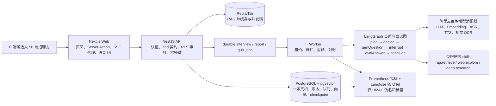

# 当前运行时事实矩阵

## 1. 使用规则

本文回答“现在代码实际是什么”，而不是“未来希望它是什么”。每项只能使用下列状态之一：

| 状态 | 含义 |
| --- | --- |
| 已验证 | 代码已存在，并有列出的可复现命令或真实运行证据。 |
| 已接线待验 | 代码路径和配置已连接，但没有对应的真实依赖、云环境、容量或故障演练证据。 |
| 仅设计 | 文档有方案，仓库没有完整运行时实现。 |
| 发布阻断 | 已发现会影响安全、隐私、数据正确性或可用性的缺口。 |

目标文档、注释和面试材料若与本文冲突，必须先修改目标文档或实现，不能挑更好看的说法对外宣传。

### 首次术语表

| 缩写/术语 | 中文含义 | 本项目中的作用 |
| --- | --- | --- |
| C 端 / B 端 | 面向个人消费者 / 面向企业客户 | C 端服务候选人的简历与训练；B 端服务招聘方的岗位、投递与评测。 |
| API | 应用程序编程接口 | Web 与 NestJS 服务之间的受契约约束请求边界。 |
| RLS | 行级安全 | PostgreSQL 按当前主体限制可读写的行。 |
| SSE | 服务器推送事件 | 前端消费可重连的业务事件流，不把连接当作业务真相。 |
| LLM | 大语言模型 | 出题、评估等模型能力；输出必须经过结构和业务校验。 |
| RAG | 检索增强生成 | 先从受治理题库检索证据，再约束模型基于证据生成。 |
| CRAG | Corrective RAG（纠错式检索增强生成） | 当本地证据低置信时，按规则决定是否受限外查或澄清，不能自由外发。 |
| OCR | 光学字符识别 | 将图片简历转写为文本，后续仍经过同一清洗和注入防护链路。 |
| ASR / TTS / VAD | 自动语音识别 / 文本转语音 / 语音活动检测 | 人与 AI 的轮次式语音输入、播报和静音/说话判定。 |
| OTel | OpenTelemetry（开放遥测） | Langfuse 的图、节点和模型调用脱敏追踪通道。 |
| HMAC | 带密钥哈希消息认证码 | 把外送标识变为不可逆的稳定伪名，不能替代授权。 |
| ANN / RRF | 近似最近邻 / 倒数排名融合 | 向量候选检索与多路排序融合策略；必须用冻结数据集比较。 |
| TTL | 生存时间 | Redis/Tair 缓存项和锁的自动到期时间。 |
| SSRF | 服务端请求伪造 | 外部网页检索必须防止模型或用户诱导服务端访问内网。 |
| DOM | 文档对象模型 | 浏览器中实际挂载的页面节点；流式 UI 必须限制其增长。 |
| TLS | 传输层安全协议 | 云 PostgreSQL、Redis/Tair 和第三方服务传输加密的最低要求。 |
| E2E | 端到端测试 | 从接口、队列、数据库到页面/运行时的可复现测试，而非只测单个函数。 |

## 2. 一张图看清当前系统



PostgreSQL（关系型数据库）承载业务真相，Redis/Tair（内存键值服务）不承载扣费、授权、版本指针或最终业务状态。对象存储、云 PostgreSQL、云 Redis 的生产连接尚没有完成真实 E2E（端到端）验证，不能根据图示把它们视为已发布服务。

## 3. C 端与 B 端的实际职责边界

| 面 | 用户路径 | 真相源与关键约束 | 当前状态 |
| --- | --- | --- | --- |
| C 端简历与诊断 | 上传/解析简历，诊断、押题、模拟面试、报告 | 简历与派生工件、权益账本、面试事件、报告状态均在 PostgreSQL；模型输出先过 schema（结构校验）和业务校验。 | 已接线；全格式文档摄取和真实云对象存储仍待验。 |
| C 端实时交互 | SSE（服务器推送事件）重连、文本输入、语音“AI 说题 → 用户回答” | `resultId`/`threadId` 是恢复句柄；事件账本与 checkpoint 可恢复；客户端只保留易失 UI 状态。 | 已验证本地流事件归约和大流渲染；真实电话网络、长时语音和设备矩阵待验。 |
| B 端招聘 | 招聘方建岗位、候选人投递、邀请/评测、人才池 | `job_application` 与 interview attempt 的绑定、状态机、RLS（行级安全）和结算必须同事务收口。 | 代码与负向约束存在；云上容量、生产迁移锁和全量端到端证据待验。 |
| 计费与权益 | 预留、调用、确认、失败释放、对账 | 每个可计费调用以幂等键、租约和账本状态防止重复扣费；Redis 锁不能替代数据库账本。 | 已验证多个本地状态机证明；支付渠道及云故障演练待验。 |

## 4. 请求、异步任务与一致性

1. Web 不把面试事实放进浏览器缓存。页面从 API 读取权威状态，SSE 只运输业务事件；断线使用 `Last-Event-ID`（最后事件编号）续传。
2. API 在认证后进入 `asPrincipal` 事务，向 PostgreSQL 写 principal（主体）上下文。普通业务容器不应拥有迁移角色权限。
3. 需要模型、长计算或可恢复执行的请求先写业务记录和 durable job（持久任务），worker 再按租约领取。任务状态、模型调用状态和权益状态分别持久化，避免 HTTP 连接中断成为业务失败。
4. Worker 使用 interview graph fence（图执行栅栏）阻止旧 worker 在租约转移后提交投影；模型调用通过 durable claim（持久领取）记录，业务结果只能同成功标记一起提交。
5. 报告是独立 worker 舱壁。评分失败必须形成 `unscored`（未评分）或不可用终态，不能伪造成成功评分。

这一层的核心不是“恰好一次调用模型”——外部模型供应商不一定提供可验证幂等协议。可承诺的是：本系统不会在不确定结果上自动盲重发，且扣费、业务投影和人工对账都有可审计状态。

## 5. Agent 图、Tools 与 Skills

### 5.1 当前唯一生产面试图

代码目录为 `packages/ai-graphs/src/adaptive-interview/{state.ts,nodes/,graph.ts}`：

```text
plan → decide ──┬→ genQuestion → awaitAnswer(interrupt)
                │                         ↓ resume
                └← evalAnswer ←───────────┘
                           ↓
                        conclude → END
```

- `plan`：从岗位和允许的简历事实确定能力维度；历史弱项只能软偏置能力顺序，不能直接抬高/降低评分。
- `decide`：依据可持久化的 `mind`（轮次、难度、置信度、路由）决定继续还是结束。
- `genQuestion`：模型调用被放在 interrupt（中断）之前；恢复同一 checkpoint 不会因为 `awaitAnswer` 重放而重复生成题目。
- `awaitAnswer`：只负责中断和恢复边界。
- `evalAnswer`：清除 pending/submitted、写评分投影或 `unscored`，再由 `decide` 选择继续/结束。
- `conclude`：结束图；报告生成不在图内，避免报告故障拖垮面试主链路。

`ADAPTIVE_INTERVIEW=0` 会使 worker 启动失败，旧固定题单不再是生产回退。这是为了避免旧图保留原始回答且没有 graph fence（图栅栏）。

### 5.2 Tools 与 Skills 的真实边界

当前没有“模型自行挑选任意函数、执行 shell（命令行）或写支付数据”的通用 Agent Tool Loop。面试图中的研究能力是静态白名单：

| Skill（受限能力） | 调用条件 | 约束 |
| --- | --- | --- |
| `rag.retrieve` | grounded/fundamental（需要证据的题型） | owner 范围、本地题库、版本/recipe 校验、有限 query 长度和调用次数。 |
| `web.explore` | 低置信 CRAG（纠错式检索生成）分支 | allowlist、SSRF（服务端请求伪造）防护、8 秒超时、fail-soft（失败软降级）。 |
| `deep.research` | 显式注入依赖且预算允许 | 有界多源 allowlist；不是独立子图，也不是无限代理循环。 |

这里的设计价值是可解释和可限额；局限是还没有可复用的多 Agent（多智能体）子图、通用任务规划器或 B 端客服图。那些只能称为设计，不是现有产品能力。

## 6. RAG、版本与缓存

| 构件 | 当前代码职责 | 状态和边界 |
| --- | --- | --- |
| 题库版本 | `qbank_generation`、embedding recipe（嵌入配方）、active pointer（活动指针）、generation binding（代际绑定） | 已接线。查询要求 recipe 与 active generation 一致，不能混向量空间；蓝绿、灰度和回滚运行手册存在，真实云发布演练未完成。 |
| 检索 | PostgreSQL + pgvector 的 ANN（近似最近邻）检索；可选 dense（稠密向量）、lexical（词法）和 RRF（倒数排名融合） | 当前小规模 holdout（留出集）结果只可用于现有题库默认选择，不可外推到全格式、企业语料或十万级索引。 |
| 热缓存 | Redis/Tair 的 TTL（生存时间）结果与单飞锁；键含 HMAC、generation、recipe、权限/可见 epoch | 已接线待真实云 Redis 验证。Redis 故障是局部 RAG 降级，不允许回退成 PostgreSQL 查询结果缓存。 |
| 证据 | 向量 chunk 必须映射 approved source（已审批来源）和 qbank artifact；模型只能引用本轮 known refs | 当前题库可运行；全格式 citation（引用定位）与撤回/删除全链路未证明。 |

已实跑的小型基线记录在 `testing/rag-retrieval-evaluation-baseline.md`：它明确把规模、语料、query（查询）分桶和指标局限写清楚。它不是生产召回率承诺。

## 7. 记忆、隐私与上下文

| 层 | 当前实际行为 | 状态 |
| --- | --- | --- |
| 工作记忆 | 当前轮 `pending/submitted`、`mind`、状态版本写入 LangGraph checkpoint | 已接线，但 `submitted.answer` 仍会进入历史 checkpoint。 |
| 任务记忆 | 跨会话精确题目去重；历史 `assessment_report` 中 gap 维度只读软偏置 | 已接线且刻意不使用语义召回，以避免确认偏误和不透明增长。 |
| 长期语义记忆 | 向量检索、用户事实衰减、可审计摘要、冻结 snapshot | 仅设计，未接线。 |
| 上下文压缩 | 模型输入长度截断和不可信 data envelope（数据封套）存在 | 端到端可评估的层级摘要/压缩恢复尚未实现。 |

**发布阻断：** 完成、失败、超时或用户删除后，原始回答和简历事实可能仍留在 checkpoint 历史。现有隐私删除没有删除 `checkpoints`、`checkpoint_blobs`、`checkpoint_writes`。因此当前系统不能宣称“记忆删除权已闭环”。正确修复是让图只保存受控短期工件引用，并用 outbox（事务外发箱）驱动 checkpoint 清理、可验证的 GC 和线程围栏。

## 8. 语音与前端渲染

- 浏览器语音 UI 是单个用户与 AI 的轮次制双向会话：AI 的 TTS（文本转语音）播放完成或被打断后，浏览器才开启/保持 ASR（自动语音识别）录音并提交同一面试线程。它不是两个人电话，也不是支持两路并发说话的电话网关。
- Worker 侧的 `voice-turn.ts` 将 `audio → ASR → 图 resume → 下一题 → TTS` 套在同一业务图外，文本和语音共享题目、幂等、权益、checkpoint 和评分边界。提供阿里云百炼适配器；未配置服务时必须显式失败/降级，不能把 fake（假实现）当线上服务。
- `VoiceCallPanel` 有 VAD（语音活动检测）状态、回声消除、降噪、播放/录音互斥、reduced-motion（减少动画）样式和中断清理。真实网络抖动、设备兼容、长时录音和并发通话尚无发布级压测证据。
- SSE 高频更新先进入 reducer（归约器），经 `requestAnimationFrame`（动画帧）合并后再渲染；面试面板保留有限可见窗口，不会把所有历史 token（词元）逐帧塞入 DOM（文档对象模型）。本地浏览器流压力曾验证 20,002 重复 frame（帧）归约为 80 个唯一 DOM 节点；这是特定设备/构建的证据，不是全设备容量承诺。

## 9. 可观测性与评测

1. 模型调用有本地 trace（调用追踪）接口；Langfuse 已使用 v5 OpenTelemetry 适配器。可外送的只有 HMAC 伪名、版本、状态、时延、token 数、成本和检索分数；prompt（提示词）、回答、简历、评论、原始 owner/thread/幂等键和密钥禁止外送。
2. 图观测为 root graph span（根图跨度）→ node span（节点跨度）→ generation（模型调用）层级。启用时要求 public key、secret key、统一 HTTPS 地址和 `LANGFUSE_CORRELATION_SECRET`（Langfuse 关联密钥）齐全；缺失或冲突会拒绝 attach，不会静默“看似有观测”。
3. 离线评测目录是 120 条**合成合同**：24 正常（20%）、72 异常/对抗（60%）、24 已发现缺陷回归（20%）。每次代码变更应全量运行；目前只验证目录结构、安全字段和采样数学性质，未证明模型答案质量。
4. 在线 LLM-as-a-Judge（大语言模型充当评审）设计为按 `feature × language × modality × risk` 分层，每满 10 个符合条件的终态 attempt（业务尝试）用 HMAC 稳定抽 1 个；任意前缀的采样数不超过 `floor(eligible/10)`。代码有 sampler（采样器），但没有真实线上 Judge、人工校准、趋势告警或阻断发布的实验结果。
5. 已将 4 个合成 dataset（数据集）同步到已配置的 Langfuse 项目；还没有 Experiment、Score config（评分配置）或真实线上 trace smoke（冒烟测试）证据，绝不能把“数据集已创建”说成“质量闭环已运行”。

## 10. 证据、未验证项和发布判定

| 证据命令/操作 | 已知结果 | 它证明什么；不证明什么 |
| --- | --- | --- |
| `pnpm --dir packages/ai-graphs run prove:adaptive-graph` | 通过 | 自适应图拓扑、interrupt/resume 和异常序列的本地合同；不证明云依赖。 |
| `pnpm checkpoint-role:prove` | 通过，跨 owner 读取/更新/删除为 0 | checkpoint RLS 本地隔离；不证明历史内容已擦除。 |
| `pnpm langfuse-eval:prove` | 通过 | 120 条 20/60/20 目录、敏感字段拒绝、每前缀不超过 10% 在线采样；不证明 Judge 准确率。 |
| `node scripts/run-e2e-isolated.mjs isolated-env:prove` | 通过 | 隔离 E2E 会剥离全部 `LANGFUSE_*` 环境变量；不证明真实 Langfuse 投递。 |
| 4 个合成 Langfuse dataset 同步 | 已完成，数量为 24/48/42/6 | 托管数据集存在；不证明实验、评分、线上趋势或模型质量。 |
| 隔离 E2E 与性能测试 | 曾在本地 Docker（容器）运行 | 本地路径与预算的证据；不得替换云 PostgreSQL、Redis、OSS、故障切换或生产容量验证。 |

当前发布结论是：**不得宣称 100% 高可用或生产发布就绪。** 最小阻断项为 checkpoint 原文删除闭环、云 PostgreSQL/Redis/OSS 的真实低权与 TLS（传输层加密）E2E、迁移安全、全格式 RAG 实测、Langfuse 实验/在线 Judge 人工校准、以及生产规模容量和灾难恢复演练。
