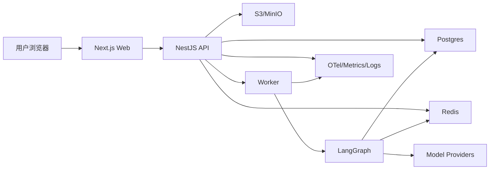

# 系统总体架构

## 技术选型

| 层 | 选型 | 原因 |
| --- | --- | --- |
| 前端 | Next.js App Router + React + TypeScript | 适合 SEO、应用页、RSC、服务端数据预取和 Vercel 部署 |
| UI | Tailwind CSS + shadcn/ui 或自建轻量组件 | 私人项目先快后稳，后续可沉淀设计系统 |
| API | NestJS + TypeScript | 模块化、依赖注入、契约清晰，便于和 LangGraphJS 共用类型 |
| AI 编排 | LangGraphJS | 状态机、持久化、streaming、interrupt、恢复能力契合模拟面试 |
| 数据库 | Postgres | 支付、权益、状态机、审计和报表更适合关系模型 |
| 向量 | pgvector | 简历片段、岗位画像、题库和推荐可复用 Postgres |
| 缓存/队列 | Redis | 限流、短期缓存、任务状态、BullMQ/Graph job |
| 对象存储 | S3/MinIO | 简历文件、导出报告、语音文件 |
| 契约 | 共享 zod4 schema + zod-openapi | 防止前后端接口漂移 |
| 测试 | Vitest/Jest + Supertest + Playwright + AI golden tasks | 覆盖单元、接口、E2E 和模型输出质量 |
| 观测 | OpenTelemetry + Prometheus/Grafana + LangSmith/Langfuse 可选 | trace、成本、graph run、prompt 质量 |

## 目标仓库结构

```text
meetwise/
  apps/
    web/                  # Next.js
    api/                  # NestJS HTTP API
    worker/               # LangGraph jobs/report/async tasks
  packages/
    ai-graphs/            # LangGraph graphs, states, nodes
    contracts/            # 共享 zod4 schema contract (+ zod-openapi)
    db/                   # Prisma/Drizzle schema, migrations, seed
    domain/               # shared domain types and policies
    ui/                   # shared UI components
    config/               # eslint/tsconfig/env schema
  docker/
    compose.dev.yml
    compose.demo.yml
    compose.observability.yml
  ai-docs/
  .tmp/
```

## 运行时服务



## 后端模块

| 模块 | 职责 |
| --- | --- |
| `identity` | 用户、登录、权限、会话 |
| `resume` | 简历文件、解析、版本、结构化画像 |
| `role` | 岗位/JD、岗位画像、技能要求 |
| `assessment` | 能力画像、差距分析、报告 |
| `interview` | 押题、模拟面试、QA、结果 |
| `learning` | 学习计划、训练任务 |
| `commerce` | 订单、权益、消费、退款 |
| `ai-runtime` | graph run、prompt、checkpoint、trace |
| `admin` | 运营后台 |
| `observability` | metrics、audit、cost |

## 核心原则

- Controller 不承载业务编排，只调用 application service。
- AI graph 不直接改支付权益，权益在业务服务中控制。
- Graph state 保存业务运行态，业务事实仍落业务表。
- 所有外部模型调用必须可追踪、可重试、可降级。
- 所有用户内容进入模型前要标记为 untrusted input。
- 所有模型输出进业务前要经过 schema 和业务 validator。

## 数据库建议

第一阶段建议使用 Prisma 或 Drizzle 二选一。私人项目如偏效率可选 Prisma；如果更重视 SQL 控制和迁移可读性，可选 Drizzle。

核心表组：

- `users`
- `career_profiles`
- `resumes`
- `resume_versions`
- `role_profiles`
- `interview_results`
- `interview_qas`
- `assessment_reports`
- `entitlements`
- `payment_orders`
- `consumption_records`
- `ai_graph_runs`
- `ai_prompt_versions`
- `ai_invocation_traces`

## API 契约

禁止前端手写不存在的接口。第一阶段就建立：

- `packages/contracts/src/interview.ts`
- `packages/contracts/src/resume.ts`
- `packages/contracts/src/commerce.ts`
- `packages/contracts/src/ai-runtime.ts`

所有接口必须有：

- request schema
- response schema
- error code
- auth requirement
- idempotency rule
- contract test

