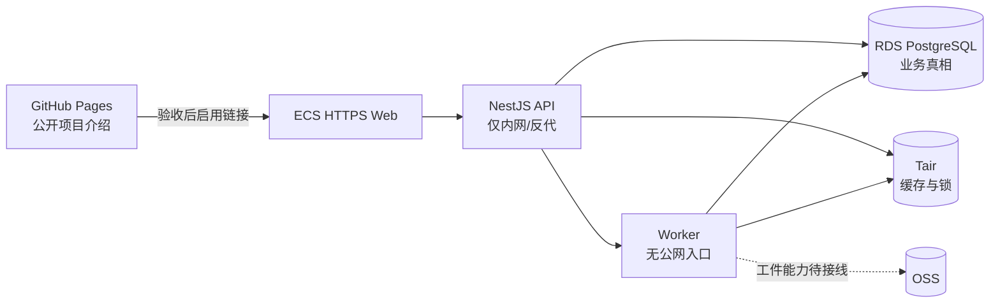

# 云资源清单

## 1. 使用规则

本文记录当前实际存在的测试/预览资源。它不是生产发布证明，也不包含密码、API Key、私钥、数据库连接串或用户数据。

状态口径：

- **已验证**：已从指定 ECS 对真实云资源完成所述只读或最小连通验证。
- **已配置待接线**：资源存在且配置已核对，但完整应用尚未使用它。
- **未启用**：资源存在，但当前部署不应访问。
- **发布阻断**：仍缺少运行时、数据或安全验收，不能对外宣称完整能力可用。

最近核对时间：2026-08-16（America/Los_Angeles）。

## 2. 资源总览

| 类别 | 资源 | 地域/网络 | 当前用途 | 状态 |
| --- | --- | --- | --- | --- |
| ECS | `i-bp17r57q9ife3hdx9hc6` / `launch-advisor-20260815` | 杭州 K；`vpc-bp1p4fbhuwaf07pntenjk`；`vsw-bp1wu3lk2q8fkgcfxuvix` | Web、API、Worker 的预览运行主机 | 已验证运行中 |
| RDS PostgreSQL | `pgm-bp1fces5g99237o6` | 杭州 K；同 VPC | `meetwise_preview` 预览数据库；`meetwise_cloud_test` 保留为固定测试库 | 已验证 |
| RDS PostgreSQL | `pgm-bp12r7xva8d9dql2` / `meetwise-rag-eval-test` | 杭州 | 独立 RAG 评测候选库 | 未启用（实例已停止） |
| Tair | `r-bp1s6qe87ka28ix7tn` / `meetwise-rag-cache-test` | 杭州 B；同 VPC | RAG 检索缓存、并发锁和短期热数据 | 已验证 |
| OSS | `meetwise-rag-sandbox-20260804-1106` | 杭州 | 未来的受控 RAG/对象工件存储 | 已配置待接线 |
| GitHub | `miaole/meetwise` | GitHub | 源码、Pull Request、CI 与 Pages 构建来源 | 已配置 |
| GitHub Pages | `miaole.github.io/meetwise` | GitHub Pages | 公开项目介绍与预览版入口 | 入口默认禁用，等待完整应用验收 |
| Tailscale Funnel | `izbp17r57q9ife3hdx9hc6z.tail39416d.ts.net` | ECS 边缘入口 | HTTPS 预览入口 | 已验证，公开 HTTPS 200 |

## 3. ECS

| 属性 | 当前值 |
| --- | --- |
| 实例 ID | `i-bp17r57q9ife3hdx9hc6` |
| 实例名称 | `launch-advisor-20260815` |
| 状态 | 运行中 |
| 规格 | `ecs.e-c1m2.large`，2 vCPU / 4 GiB |
| 系统 | Alibaba Cloud Linux |
| 系统盘 | 40 GiB；核对时约 10 GiB 已用、28 GiB 可用 |
| 公网 IPv4 | `47.98.189.166` |
| 私网 IPv4 | `172.31.224.142` |
| 带宽 | 1 Mbps |
| 计费 | 按量付费 |

当前主机已经安装 Node.js 22 与 pnpm，release `97d5aee-fullstack-20260816b` 已落盘。Web、API、Worker 和 Nginx 均由 systemd 运行并已恢复为 active；Web、API、Worker metrics 与 Nginx upstream 仅监听 loopback，公网只通过 Tailscale Funnel 暴露 HTTPS Web 入口。数据库、Tair、API 端口和 Worker 不直接暴露。

## 4. RDS PostgreSQL

### 4.1 主测试实例

| 属性 | 当前值 |
| --- | --- |
| 实例 ID | `pgm-bp1fces5g99237o6` |
| 引擎 | PostgreSQL 17.0 |
| 规格 | 1 vCPU / 2 GiB；最多 50 个连接 |
| 存储 | 10 GiB 高性能云盘 |
| 数据库 | `meetwise_preview`（预览应用）；`meetwise_cloud_test`（固定测试库） |
| 内网主机 | `pgm-bp1fces5g99237o6.pg.rds.aliyuncs.com` |
| TLS | 已开启；应用要求 `verify-full` |
| CA | 阿里云 ApsaraDB CA 链；ECS 只保存公开 CA，不在仓库保存凭据 |
| 当前 schema | `0089_qbank_taxonomy_definer_manifest` |

`meetwise_preview` 已从 ECS 完成迁移、运行身份接线和受控 synthetic 装载。2026-08-16 的 post-verification 累计确认 220 个账号、1,024 个岗位、10,072 条申请、600 份简历和 6,180 场 abandoned 面试；当前定义的 12 项禁止副作用均为 0。该数据全部为合成预览数据，不对应真实个人或企业。

连接池必须按 50 连接上限显式分配，API、Worker、迁移和控制面不得各自使用默认大池。

### 4.2 RAG 评测实例

`pgm-bp12r7xva8d9dql2` 当前为停止状态，并启用释放保护。未完成独立 TargetGrant 和评测执行器前，不得让预览运行时自动启动或访问它。

## 5. Tair

| 属性 | 当前值 |
| --- | --- |
| 实例 ID | `r-bp1s6qe87ka28ix7tn` |
| 名称 | `meetwise-rag-cache-test` |
| 引擎/容量 | Redis 7.0 兼容版，标准 1 GiB |
| 内网主机 | `r-bp1s6qe87ka28ix7tn.redis.rds.aliyuncs.com:6379` |
| TLS | 已开启，TLS 1.2；系统证书有效期到 2029-08-03 |
| 应用账号 | `meetwise_rag_app`，读写 |
| 只读 smoke 账号 | `mw_cloud_smoke`，只读 |
| 白名单 | 包含 ECS 所在 `172.31.224.0/24` 网段 |

2026-08-16 已轮换 `meetwise_rag_app` 密码，并从 ECS 使用 TLS 连接得到 `PONG`。密码仅保存在 ECS 的 root 配置中，不进入聊天记录、仓库、日志或 Pages 构件。

Tair 只承载可丢弃的缓存和锁，不得作为权益、授权、任务、代际指针或业务终态的真相源。

## 6. OSS

| 属性 | 当前值 |
| --- | --- |
| Bucket | `meetwise-rag-sandbox-20260804-1106` |
| 地域 | 杭州 |
| 存储类型 | 标准存储，同地域冗余 |
| 版本控制 | 已开启 |
| 当前对象量 | 核对时为 0 字节 |

仓库当前没有已验收的 OSS 运行时适配器，也没有为 ECS 配置 OSS 访问身份。完整工件生命周期、最小权限 RAM 身份、加密、删除回执和真实 E2E 完成前，API/Worker 不应写入该 Bucket。

## 7. 入口与发布关系

Pages 只提供公开介绍和入口，不承载 Next.js 服务端、API、认证、SSE 或用户数据。ECS 的完整应用与合成数据已可由 HTTPS 访问；Pages 主按钮仍处于禁用态，待静态页发布变更合并后指向该 HTTPS 环境。

## 8.1 合成预览数据回执

2026-08-16，`large-v1` 由 `meetwise-preview-synthetic-large.service` 单实例执行成功：

- systemd：`Result=success`、`NRestarts=0`，耗时 14 分 30 秒，峰值内存约 150.2 MiB；
- 阶段增量：212 个账号、1,000 个岗位、10,000 条申请、582 份去重简历、6,000 场面试；
- 累计：220 个账号、1,024 个岗位、10,072 条申请、600 份简历、6,180 场面试；
- `verificationDigest=20a592ee483d5a52c7a6b3dda9e0072ddd0aeac2deb2abbde42eeb8c1b99af8e`；
- `dbReceiptDigest=5be888773fe97349b26f91dd2ce2f959111e58976a99affaf251c1f344b7158e`；
- `targetDigest=76384d220048a60938071d2a2eb4dff8e715e6b7157b87f7e5018070ad71950b`；
- `verifiedAt=2026-08-16T15:51:03.657Z`；
- root-only 原始回执目录：`/var/lib/meetwise-preview-synthetic/preview-large-v1/`。

该证据只证明本次合成数据装载、post snapshot、服务恢复和一次 HTTPS 200（0.164 秒）；不证明 SIGKILL takeover、RLS 全矩阵、浏览器全流程、持续性能、模型/RAG/评分能力或生产可用。

## 8. 凭据与配置边界

- 仓库、Pages 构件和本文均不得保存任何密码、API Key、私钥或完整连接串。
- RDS/Tair 运行凭据只保存在 ECS root 可读的 systemd EnvironmentFile 中。
- 公共 CA 证书可由服务读取，但不替代账号授权、白名单或 RLS。
- 已在聊天中出现过的模型 Key 视为已暴露，不能作为正式部署凭据；接入前必须轮换并按文本、Embedding、语音等能力分域。
- OSS 若启用，优先使用绑定 ECS 的最小权限 RAM 角色，避免长期 AccessKey 落盘。

## 9. 尚未完成

1. 合并并发布 GitHub Pages 主入口，使静态页跳转到已验证的 ECS HTTPS 地址。
2. 完成 SIGKILL takeover、RLS 跨 owner 全矩阵、逐 owner 分布、浏览器分页/筛选和持续性能验收。
3. 配置完整模型运行时密钥；模型节点按 operation 绑定主模型与同操作备用模型。
4. 完成异步任务、SSE、Worker 领取与 Tair 缓存的真实组合根验收。
5. OSS 仍保持未接线，直到对象生命周期和删除回执闭环。
