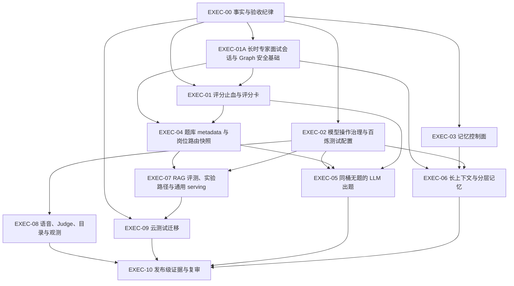

# 未闭环能力执行总清单

> 本文是后续整改的**执行顺序入口**。事实状态以 `architecture/current-runtime-truth.md` 为准；每个工作包的发现、实现、验证、关闭仍以 `production-readiness-remediation-register.md` 的四阶段纪律为准。
>
> 本文不授权云端写入、购买、密钥创建、生产开关变更或删除 Docker。任何此类动作仍需在对应工作包的规格、演练与人工确认完成后单独执行。

## 1. 使用规则

### 1.1 状态图例

| 标记 | 含义 | 不代表 |
| --- | --- | --- |
| `☐` | 未开始；不得绕过其前置条件 | 已设计或将来会做。 |
| `◐` | 有部分代码、合同或本地回执 | 真实生产路径、真实云验证或发布可用。 |
| `⛔` | 有明确环境、授权或设计阻断 | 可以用临时全局权限、固定共享库或假数据绕过。 |
| `◑` | 规格和局部合同已收敛，等待正确层级验证 | 已关闭。 |
| `☑` | 仅当登记册对应行完成独立复审后使用 | 单个 mock、静态扫描、本地 `releaseEvidence=false` 回执。 |

### 1.2 每个工作包的共同完成定义

只有同时满足以下条件，才能开始下一个依赖它的工作包：

1. 对应业务用例、接口、数据对象、状态机和失败语义已经冻结。
2. 迁移、代码和受控配置落在真实组合根，而不是只落在 smoke、demo、fixture 或导出函数。
3. 七类用例覆盖正常、异常、边界、逃逸通道、并发、恢复和对抗输入；涉及数据库、HTTP、浏览器或外部服务时使用相应层级的验证。
4. 运行事实、验收文档、变更记录和外部表述同步，且不夸大本地/模拟回执。
5. 上一项工作包没有遗留会扩大本项权限、数据外送、删除、评分或跨域检索风险的 P0/P1。

### 1.3 现在必须保持的禁止项

- [ ] 在 `SCOR-01…08` 完成校准前，不恢复 B 端候选数值排序、自动决策或可比较 overall score。
- [ ] 在 `MEM-00` 完成前，不写入全量自由对话、长期事实、记忆摘要或跨会话向量。
- [ ] 在 `INT-TRANSCRIPT-00`、`INT-TRANSCRIPT-01`、`INT-RESUME-02`、`SEC-GRAPH-01` 完成前，不把 checkpoint、短期 job payload、SSE 缓冲或浏览器内存称为“完整面试记录”“历史回放”或安全控制面；它们都不能代替可删除的业务事实。当前 raw answer 在 answer job 终态前仍是 payload 中的明文 JSON，不得称为 canonical artifact。
- [ ] 在 `INT-LONG-INTERVIEW-01`、`INT-LEVEL-01` 和 `SCOR-01…07` 完成前，不把现有有界面试图（覆盖/证据驱动、软预算可上调、绝对杀开关默认 120）称为一到两小时专家面试，也不按工作年限、单题高分或未校准 overall score 给出等级、排序或招聘结论。
- [ ] 在 `MODEL-OP-01…03` 完成前，不把一把百炼 Key 描述为统一网关、全局预算或所有 Agent 的安全授权根。
- [ ] 在 `RAG-FUNNEL-01…06` 完成前，不把相似度命中称作题域隔离，不允许“全库找不到就跨桶或联网生成”。
- [ ] 在 `CLOUD-TEST-01…05` 完成前，不删除 Docker 源码；固定 `meetwise_cloud_test` 只能承担零写入 smoke，不能承载迁移、RLS 或全量 E2E。项目负责人已要求迁移期间**不执行**本地 Docker 数据面路径：保留仅为历史兼容与 ECS 对照，不能成为验证替代。
- [ ] 在真实浏览器、真实 API、真实供应商链路未取得受控证据前，不将流式语音、云测试、RAG 评测或模型评测称为发布通过。

## 2. 执行顺序总览

| 阶段 | 工作包 | 当前状态 | 允许开始的前提 | 阶段出口 |
| --- | --- | --- | --- | --- |
| 0 | `EXEC-00` 事实、证据和验收纪律 | ◑ | 本文审阅通过 | 所有目标工作包都有唯一 ID、事实来源、依赖、验收和禁止项。 |
| 1 | `EXEC-01` 评分止血与 ScoreCard | ◐ | `INT-TRANSCRIPT-00/01` 完成前只允许止血与合同审计 | legacy 伪评分无法污染任何 C/B 投影；未校准评分不可排序。 |
| 1 | `EXEC-02` 模型操作治理与百炼测试配置 | ◐ | 无；真实配置动作另行确认 | 新模型操作能被预算、模型绑定、容量和失败语义约束。 |
| 1 | `EXEC-03` 记忆控制面 | ☐ | 无 | 记忆的授权、撤回、删除、重建和审计先于任何长期内容写入。 |
| 1 | `EXEC-01A` 长时专家面试会话与 Graph 安全基础 | ◐ | 无；涉及模型派发的子项还依赖 `EXEC-02` | 完整可恢复 transcript、冻结面试蓝图、动态能力校准和安全围栏都有独立业务真相，且不夸大为已上线。`INT-TRANSCRIPT-00` 仅有本地签发器/账本/合同，公开删除仍 503。 |
| 2 | `EXEC-04` QBank metadata 与自动岗位路由 | ☐ | `SCOR-00` 与 score-excluded/B 端暂停边界已冻结；不依赖未实现的 ScoreCard | 标签先于 embedding，面试读取 immutable route snapshot，检索全读面同桶。 |
| 3 | `EXEC-05` 同桶无题 LLM fallback | ☐ | `SCOR-01/02/07`、`MODEL-OP-00/01`、`EXEC-04` | 仅 clean miss 可一次出题，生成题不会污染题库或未校准评分。 |
| 3 | `EXEC-06` 长上下文和分层记忆 | ☐ | `MODEL-OP-00/01`、`EXEC-03` | 可验证 budget、冻结 snapshot、分层 recall 和完整删除传播。 |
| 4 | `EXEC-07` RAG 评测、实验清理与通用 serving | ☐ | `EXEC-02`；QBank 相关项还依赖 `EXEC-04` | 每个“生产”评测走真实组合根；通用 RAG 只有接 serving 才可称服务。 |
| 4 | `EXEC-08` 语音、Judge、catalog 与观测 | ☐ | `EXEC-02` | 目标能力进入真实组合根并有相应数据面验收。 |
| 5 | `EXEC-09` 云测试迁移 | ◐ | 项目独占目标与恢复设计已批准 | 云 runner 可恢复、精确清理；Docker 仅在同等覆盖连续通过后退场。 |
| 6 | `EXEC-10` 发布级证据与独立复审 | ☐ | 前序目标范围内工作包均为 `已验证` | 独立复审、真实环境回执、告警/回滚演练和对外表述一致。 |

## 3. 阶段 0：事实与验收纪律

### EXEC-00 · 统一任务卡与变更纪律

| 项目 | 内容 |
| --- | --- |
| 对应登记 | 全部 `PRD-TEST-001…018`；全部 `MEM-*`、`MODEL-OP-*`、`RAG-FUNNEL-*`、`SCOR-*`、`CLOUD-TEST-*`。 |
| 交付 | 每次实施前创建临时 Task Harness，写明来源、非目标、对象、状态机、接口、数据库、部署、七类验收和命令。 |
| 禁止 | 以“文档已写”“mock 通过”“已有 Key”“固定测试库可连通”替代数据面或运行时验收。 |
| 验收 | `pnpm docs:check`、`pnpm public-text-policy:prove`、`pnpm quality:traceability:prove`、`pnpm quality:governance:check`、`git diff --check`。 |

执行清单：

- [ ] 每个新实施 PR 只取一个工作包或一个明确、可独立验收的子项。
- [ ] 所有开关默认 fail-closed；未配置、未知、撤权、账本不一致和恢复不确定均不能悄悄回退到外送或全库读取。
- [ ] 每次更新 `current-runtime-truth.md` 和对应用例，删除“生产”“E2E”“已验证”等过度表述。
- [ ] 外部链接、外部项目名、路径或实例细节不进入受管公开文档；配置例外必须由公共文本策略显式处理。
- [ ] `PUBLIC-PREVIEW-DIRECTORY-01`：Pages 只发布仓库 `docs/` 静态项目展示（由 `.github/workflows/pages.yml` 在 `main` 复制 `docs/` + 合成截图；仅面试练习，招聘不在本预览范围），目录没有 API、IP、端口、数据服务、秘密或运行时跳转输入，也没有求职者/面试官双角色导航。默认分支与最低 Pages 权限是唯一发布来源。旧 `preview-site/` 签名目录已删除，不得复活为 ECS 入口开关。`TC-public-preview-directory-01-main/E1…E6` 为 planned/unmapped，静态 proof 不是部署或 ECS 证据。
- [◐] `PUBLIC-PREVIEW-WRITE-GATE-01`：公开预览 API 放行 `GET`、`HEAD`、`OPTIONS`，并额外放行受控 `POST /interview/:id/answers`（预览账本，见 `INT-TRANSCRIPT-PREVIEW-SUBMIT`）。其余方法在 NestJS(Fastify) `onRequest` 前置门固定 `503 public_preview_read_only`。其它面试/评分写面仍有服务层 `assertPublicPreviewWritesClosed`；`/answers` 用 `assertPublicPreviewControlledWriteAllowed`（非预览 404）。清单见 `ai-docs/architecture/backend/public-preview-write-inventory.json`。本地命令 `pnpm public-preview-write:inventory`、`pnpm public-preview-write:prove`、`pnpm public-preview-write-gate:prove`、`pnpm -C apps/web prove:middleware` 已接线，回执必须保持 `releaseEvidence=false`。该项的 `TC-public-preview-01-main/E1…E6` 仍是 planned/unmapped；Web 公开展示站仍只读。不得把本地清单或 inject proof 标成已关闭，也不等于预览 worker 已停。
- [ ] `PENDING-PRD-EVAL-01`：为离线评测提升建立正式需求和 oracle。当前 traceability 对既有 leaf 的映射、稳定性样本及图/语音 oracle 均不足以支持质量发布；在冻结真实样本、分母、阈值、人工标注、失败处置和提升接收器前，任何离线 eval 只提供研究信号。
- [◐] `WORKER-DISPATCH-001`：源码已将面试、押题、诊断和报告从固定 1.5/2 秒主路径轮询改为 PostgreSQL 提交后静态 `wake`，并保留不超过 5 秒的 reconciliation；本地 listener/DrainLoop 合同已通过。作业表/claim/lease/RLS 仍为真相。尚缺隔离 PostgreSQL rollback、20 路并发、多副本、重连与真实 trigger/RLS 验收；本机 Docker 存储空间不足时保持 `releaseEvidence=false`，不得删除 reaper 或宣称端到端低延迟。
- [◐] `WORKER-DISPATCH-002`：面试队列已接线 owner 轮转（每次启动至多一个 drainOnce；`globalInflight>1` 时多 owner 可重叠）、每 owner 数据库**未过期** running cap（默认 1，跨副本计数）、进程内 `WORKER_INTERVIEW_GLOBAL_INFLIGHT`（默认 4）、`idle`/`retry` 轮转语义、切片隔离、reap 失败则该 owner 本拍不 drain、每拍 32 次 launch cap。同面试保序与 lease CAS 仍在领取 SQL；`markDone` CAS=0 对调度层不是成功。押题/诊断/报告仍抽干单个 owner（`HC-GAP-002` 已用 `pnpm owner-drain-order:unit:prove` 诚实证明顺序为 `A,A,A,B`，不是轮转）；进程内 global cap 不是集群锁；远程 Postgres 证明 `releaseEvidence=false`，禁止本地 Docker 库。未完成跨副本硬 cap、其余队列公平和发布级延迟测量前，不把即时 wakeup 宣称为繁忙状态的端到端延迟或容量保证。交叉面（SKIP LOCKED、SSE 槽、模型槽、`0130` claim-join）的证明缺口见 `architecture/backend/high-concurrency-review.md`。`HC-GAP-006`（押题/诊断非法 `Last-Event-ID` → HTTP 400）已由 `pnpm api:validate` 关闭，不是容量 SLO，也不关闭 `HC-GAP-007`。`HC-GAP-014` 已在 `main`（#90）。`HC-GAP-011`（孤儿 permit / 两连接无行具名用例）已挂进 `pnpm runtime:prove`，只关那一项。
- [x] `GOV-RECOVERY-01`（仅静态治理）：已以 append-only successor 登记云、记忆、模型路由和 RAG 漏斗的 113 个 `planned/unmapped` leaf，并修正云 group/占位符与 RAG 缩写 leaf 的盘点；随后登记 worker 事件唤醒的 7 个与长时专家面试的 35 个计划 leaf。冻结基线为 1,699 个历史未映射 leaf，当前 worktree inventory 为 1,854，且这些新增项均显式为 planned/unmapped、尚未提升为 required binding，不能伪称已覆盖。`quality:governance`、`quality:traceability` 和文档门只提供 `releaseEvidence=false` 的静态一致性；首次 bootstrap 与真实 base/head append-only 守卫仍须在提交后的受信 CI 执行，不能据此关闭任何业务 TC 或发布门。

## 4. 阶段 1：先封住评分、模型和记忆的基础风险

### EXEC-01A · 长时专家面试会话、水平校准与 Graph 安全基础

| 字段 | 内容 |
| --- | --- |
| 对应登记 | `INT-TRANSCRIPT-00`、`INT-TRANSCRIPT-01`、`INT-RESUME-02`、`INT-LEVEL-SIGNAL-01`、`INT-LEVEL-01`、`INT-LONG-INTERVIEW-01`、`SEC-GRAPH-01`；控制信号地基见 `requirements/use-cases/interview-control-signals.md`，完整长时用例见 `requirements/use-cases/expert-long-interview-runtime.md`。 |
| 当前状态 | `INT-TRANSCRIPT-00` 为 ◐：独立 `PrivacyAuthorizationIssuer`、0091 target/receipt 账本与 submission/receipt 合同已在源码落地；issue 按调用方字段落账（不做 JWS 验签），worker 仍走 0077，公开删除仍 503。树上另有 0092/0096 rehearsal。预览版可将 `/answers` 接到 `submitInterviewAnswer`（`INT-TRANSCRIPT-PREVIEW-SUBMIT`），非预览 404，不是 01 生产 write。七类 TC 仍为 planned/unmapped，无部署密钥、无真实组合根回执（`releaseEvidence=false`）。`INT-TRANSCRIPT-01` 及后续项仍 blocked。当前自适应图以有界当前题答为主；长度由 `decideNext` 按覆盖/证据/弱答/空转/加深决定，软预算可上调，绝对杀开关默认 120 只防 runaway（见 `UC-INT-LENGTH-01`）。`observeInterviewSignals` 可提前 `early_weak`/`thrashing`（见 `INT-LEVEL-SIGNAL-01`），不改写 `maxTurns`。这仍不是 60/90/120 分钟 blueprint。checkpoint 只足以恢复 pending graph 工作，legacy `/turn` raw answer 在 answer job 终态前仍为明文 payload，SSE/client 状态不构成历史面试账本。 |
| 目标 | 让一到两小时专家面试拥有可删除、可分页回放的用户可见 transcript；以冻结 blueprint、route 与 rubric 约束长期流程；以证据而非工作年限校准能力；把授权、注入防护、RAG/memory 边界和输出投影复核接入每个敏感边界。 |
| 依赖 | `INT-TRANSCRIPT-00` 的独立 `PrivacyAuthorizationIssuer`（不得复用 `AUTH_SECRET`、runtime SQL、worker/deleter 或 GUC 身份根）、不可伪造删除授权、target/sink receipt 与 submission/receipt **合同冻结**是 01 的 P0 前置。00 不授权 01 生产写入；树上 0092/0096 rehearsal 表/函数与预览 `/answers` 都不是公开 01 write route，也不把 rehearsal purge 称为删除已闭环。只有 01 的公开 schema/target resolver/deletion ledger/逐 sink receipt 和删后 read=0 在同一迁移、同一真实组合根证明后，真实用户 write route 才能启用；此前一律 disabled。评分合同依赖 `EXEC-01`；模型外送/压缩/分类的 operation 依赖 `EXEC-02`；长期跨会话记忆依赖 `EXEC-03` 与 `EXEC-06`；题库 scope 依赖 `EXEC-04`。01 首包禁止模型、RAG/Web、评分、报告和 memory 副作用。 |

执行清单：

- [◐] `INT-TRANSCRIPT-00`：独立 `PrivacyAuthorizationIssuer`（ECDSA P-256 / ES256，`iss=meetwise-privacy-authz-v1`）与 0091 `privacy_authorization_snapshot` / `privacy_deletion_receipt`、受约束 claim、no-forge-completed guard 已在源码落地；signer/verifier 与 `AUTH_SECRET`、runtime SQL、worker/deleter、GUC 身份根分离。`0091` issue 按调用方字段落账，本身不做 JWS 验签；privacy worker 仍走 `0077`，HTTP 未接线。submission/receipt 合同已冻结且不进 OpenAPI。公开 `DELETE /privacy/interview-data/:id` 仍 503。`0129` 预览版 `POST /privacy/erasure-preview` 可盘点 sink 并链接 0096/0125 begin，回执固定未完成、`releaseEvidence=false`，不是 issuer 生产删除。树上已有 0092 rehearsal 表/函数与 0096 event/report/`ai_graph_run` rehearsal resolver。预览版可将 HTTP `POST /interview/:id/answers` 接到 `submitInterviewAnswer`（`INT-TRANSCRIPT-PREVIEW-SUBMIT`）；非预览该路径 404，OpenAPI 不登记。这**不**授权 `INT-TRANSCRIPT-01` 生产 cutover，也不把 rehearsal purge 或预览删除回执称为公开删除已闭环。七类 TC 仍 planned/unmapped；账本 HTTP 证明须远程 Postgres 环境变量，禁止 `pnpm db:up`，无回执时 `releaseEvidence=false`。无 receipt、无组合根滥用证明前不得声称删除完成，也不得勾“已关闭”。现有 legacy `/turn` 仍写 plaintext job payload，必须如实保留为 `INT-P0-RAW-QUEUE`，不可被文字误称为已停用。`PUBLIC-PREVIEW-WRITE-GATE-01` 在预览下仍拒绝 `/turn`，并允许上述受控账本写；`MEETWISE_PUBLIC_PREVIEW=1` 下 `POST /privacy/erasure-preview` 仍 503。
- [◐] `INT-ANSWER-DUAL-WRITE-FENCE`（不是 01）：迁移 `0126` 已在 main。答题双写互斥 + 事件禁原文。`/turn` 在无 ledger 时仍写明文 `interview_job.payload`；预览 `/answers` 走 ledger 侧并受该围栏约束，仍不是生产 01 HTTP。`INT-TRANSCRIPT-01` 保持 blocked。`0127`/`0128`/`0129`/`0130` 已在 main；本围栏不改号、不占用 0131。盘点与后续切换顺序见 `architecture/backend/interview-answer-dual-write-cutover.md`；用例 `UC-INT-ANSWER-DUAL-WRITE-FENCE`；证明 `pnpm int-answer-dual-write-fence:prove`（远程 Postgres，禁止 `db:up`，`releaseEvidence=false`）。
- [◐] `INT-TRANSCRIPT-PREVIEW-SUBMIT`：预览路径把 `POST /interview/:id/answers` 接到既有 `submitInterviewAnswer`（0092 rehearsal 账本）。仅 `MEETWISE_PUBLIC_PREVIEW=1` 可写；非预览 404。不入 `apiContract`，不写 plaintext `/turn` job，不宣称 01 生产 cutover。受已落地的 `0126` 互斥约束。`0127` OCR binding / `0128` dispatch fairness 已在 main；公开预览下 OCR 组合根仍关。`0129` 预览删除是另一条账本，公开预览下仍 503。`0130` / `INT-LEVEL-SIGNAL-01` 已在 main，不改本写面。`#79` 预览批量语音（`/transcribe` `/speak`）仍走入站 503，不进本受控写 allowlist。`#83` Web `/resume` 预览图片入口是另一条 OCR 预览面，不改本写面。`#67` Bailian/native fail-closed 不发明题面，不改本写面。本项不新增迁移、不占用 0131。本地 inject/清单门已接线；账本 HTTP 证明须远程 Postgres 环境变量，禁止 `pnpm db:up`，无回执时 `releaseEvidence=false`。
- [ ] `INT-TRANSCRIPT-01`：真实用户 canonical 写入有两个不可拆分的 release gate：先由 00 验证授权/删除合同；再由**同一部署迁移**安装 artifact/draft/submission/item/ref-only-job/view 的 target resolver、deletion ledger、逐 sink receipt 与删后 read=0，并以真实 HTTP/SSE/RLS 组合根证明。两个 gate 任一缺失时仅允许非用户数据的 test-only rehearsal，所有真实 **01 canonical** raw-answer write route 保持 disabled。现有 legacy `/turn` 不是 01 的实现或回退路径；`0126` 已提供对向互斥围栏（见上条），启用 01 前仍须按切换图切断明文 payload，避免两条路径写同一答题事实。冻结 `InterviewAnswerArtifact`、`InterviewAnswerDraft`、`InterviewAnswerSubmission`、`InterviewTranscriptItem` 与 `InterviewViewSnapshot`。接受事务只写加密 canonical artifact、submission receipt、item、ref-only job 和 `visibleSeq`；同 key/同体回放、同 key/异体冲突、同题双 tab 一 winner。禁止把原始 answer、内部 prompt、模型 chain-of-thought、tool payload 或 token 流写入 checkpoint/job JSON/SSE/log/trace；首包模型、RAG/Web、评分、报告、memory 和 B 端投影均为 0。
- [ ] `INT-RESUME-02`：在 01 通过后重新对抗审查浏览器重登、worker 生命周期和用户体验；使用已冻结的 `InterviewViewSnapshot(highWatermark)` + event cursor + transcript pagination。页面先读同一版本 snapshot，再从 high watermark 订阅 SSE tail，按稳定 item/event ID 去重。双标签、提交响应丢失、浏览器关闭、worker takeover、历史 raw answer 已被清理和 privacy fence 都必须有明确回放或“不可恢复”语义，绝不伪造内容。
- [◐] `INT-LEVEL-SIGNAL-01`（控制流地基，**不是** `INT-LEVEL-01`）：`observeInterviewSignals` + `decideNext` 可因持续弱/震荡提前 `early_weak` / `thrashing`；图 `concludeReason` 为 provenance hook。信号不改写 `maxTurns`；绝对杀开关先赢；不冻结产品轮次上限。用例见 `requirements/use-cases/interview-control-signals.md`。本地证明：`pnpm adaptive-signals:prove` + `pnpm adaptive-signals-graph:prove`（`releaseEvidence=false`；不证明能力等级、B 端 band、ScoreCard）。不关闭本条下方的 `INT-LEVEL-01`，不产出 band。SSE 预览见下条。
- [◐] `INT-LEVEL-SIGNAL-SSE-01`（预览投影，**不是** `INT-LEVEL-01`）：图 `concludeReason` 为 `early_weak`/`thrashing` 时，worker 经既有 `appendEvent` 追加 `session_concluded`。不发明分数，不写 band，不是招聘结论。用例见 `requirements/use-cases/interview-signal-sse.md`。本地证明：`pnpm signal-sse:prove` + `pnpm signal-sse-contract:prove` + `pnpm signal-sse-worker:prove` + `pnpm web:prove`（假 append / 纯函数，无 Docker DB；`releaseEvidence=false`）。不关闭下方 `INT-LEVEL-01`。
- [ ] `INT-LEVEL-01`：将简历年限/经历作为 non-binding `InitialLevelHypothesis`，按 `CompetencyLevelAssessment`、跨题 evidence、rubric/难度合同和不确定度不断上调、下调或标记 `insufficient_evidence`。初级候选人可以被 promotion probe 检出高级能力；声明高级但证据不足不能自动获得高级结论。不得使用年龄、性别、学校、地域等代理变量。`INT-LEVEL-SIGNAL-01` 的终止 hook 与 `INT-LEVEL-SIGNAL-SSE-01` 的事件露出 **都不是**本项。
- [ ] `INT-LONG-INTERVIEW-01`：以不可变 `InterviewBlueprintSnapshot` 固定时长、模块、能力覆盖、route allocation、最大题数、每模块最少有效证据、版本和终止策略；终止要从 time + module coverage + evidence 判定。短流程已不再用固定轮数硬顶（`UC-INT-LENGTH-01`：软预算 + 绝对杀开关默认 120），**把数字从 8 调到 16 或把杀开关调到 120 都不等于本项完成**。
- [ ] `SEC-GRAPH-01`：将 `AuthorizationSnapshot`、`ContextSnapshot`、`SecurityDecision`、route/blueprint refs 与 `OutputProjectionPermit` 做成边界承重对象；授权/撤权/epoch、input/RAG/web 注入、memory poison、schema/evidence/业务投影校验必须在读取、模型派发和写入前重验。LLM 只能提议内容，不能决定权限、scope、删除、终止或业务状态。
- [ ] `INT-RUNTIME-TEST-01`：对以上对象进行七类验收：重复提交、双 worker/CAS、跨 owner/tenant=0、断线/崩溃/删除竞态、20+ turn 与 60/90/120 分钟 blueprint、提示词/RAG/memory 注入、路由/rubric 版本漂移及 unknown model attempt。真实浏览器和真实供应商证据另按 `EXEC-10` 取得。

阶段出口：用户重新进入同一面试时能够看到**当时被允许保留**的完整用户可见记录、当前 pending/draft 和后续 SSE；长时蓝图可解释为何继续、转模块、请求澄清或结束；任何安全、删除、路由或评分围栏失效时不读取、不外送、不投影。

### EXEC-01 · 评分止血与版本化 ScoreCard

| 字段 | 内容 |
| --- | --- |
| 对应登记 | `PRD-TEST-001`、`PRD-TEST-015`、`SCOR-00…08`；人工复核为待立项的 `PENDING-PRD-REVIEW-01`。 |
| 当前状态 | `PRD-TEST-001 / SCOR-00` 已在本地完整迁移组合根验证：legacy `/answer` 固定拒绝，真实 HTTP proof 覆盖活动 C/B 面试、重放、并发与跨主体调用，HTTP app 使用独立 provision 的低权 runtime login，所有受检副作用增量为 0。`SCOR-00H` 已接线消费面诚实闸（域+转写/`POST` 评估/`POST` career/SSE），空评估与无 identity 不得伪造 0。域 `refuseMappedBSideScore` 恒失败，**未改** worker eligible 与 `markApplicationNoEligibleScore`；`GET assessment`/`GET career-path`/`GET /profile/growth`/`GET report` 不重跑闸。两份回执均为 `releaseEvidence=false`，只证明旁路止血与消费诚实，不是评分闭环；`PRD-TEST-015` 的评分卡与校准尚未实施。 |
| 目标 | 评分只从冻结的题目、回答、rubric、证据和版本合同产生；覆盖不足或不确定时返回 `insufficient_evidence` / `review_required`，不伪造可比较数值。 |
| 依赖 | `SCOR-00` 已止血；`SCOR-01/02` 的生产实现明确依赖 `INT-TRANSCRIPT-00/01` 的 canonical artifact、删除授权、逐 sink receipt 与删后 read=0 的真实组合根证明。必须先于 LLM 生成题、B 端排序、候选比较和校准宣称。 |

执行清单：

- [x] `SCOR-00`（本地组合根）：`pnpm scor-00:http:prove` 已在完整 87 个迁移的隔离 PostgreSQL 中，以独立 provision 的低权 runtime login 启动真实 HTTP app；活动 C/B 面试、重放、并发、伪造 body 与跨主体 `/answer` 均返回 `410`，两个调用主体的消费、event、job、report、assessment、application status/score 增量均为 0，合法 `/turn` 仍可受理。回执为 `releaseEvidence=false`，不关闭 `SCOR-01…08` 或 B 端校准门。
- [x] `SCOR-00H`（消费面诚实闸接线，非关闭）：`packages/domain/src/scoring-honesty.ts` + 转写/`POST` 评估/`POST` career/SSE；空评估与无 identity/answer claim 不得伪造 0。`pnpm scor-00-honesty:prove` / `pnpm web:prove`（非隔离 HTTP）。未改 worker eligible、`markApplicationNoEligibleScore`、`GET`/`growth`/`report`/`learning-plan` 重闸、`listScorableScoreCards` 的 `b_review_eligible`。`releaseEvidence=false`。阶段出口未达。
- [◐] `SCOR-00` 消费诚实（内部预览 UI，不是招聘方产品面）：`/recruiter/how-it-works` 与 `/recruiter/jobs/:id/applications/:applicationId` 已接线；列表/申请状态页/C 端「我的投递」不再渲染申请数字分。这是只读消费门，`releaseEvidence=false`，不关闭校准、人工复核工单或 B 端用途。详见 `requirements/use-cases/bend-recruiter-architecture-surface.md`。
- [ ] `SCOR-01`：在 `INT-TRANSCRIPT-00/01` 通过后冻结两阶段评分事实：issue 阶段 `IssuedQuestionContract` 只含题目/rubric/route/cohort/policy/privacy，**不含未来 answer**；提交后以 canonical artifact 追加 `AnswerVersion/ScoreRequest`、answer HMAC 和 delete-wins permit。
- [ ] `SCOR-02`：与专用 score-writer/verifier 一起原子切换 C 端 assessment/report/profile/memory 等全部消费者；只消费资格化 ScoreCard，legacy event 均分、无 rubric、生成题与未校准卡一律 unavailable/score_excluded。确定性 coverage gate 与聚合不得混合不同难度/题型路径。
- [ ] `SCOR-07`：在所有消费面先实施 B 端用途硬门；无 calibration/review 的分数不能影响申请、列表、人才库、通知或导出。
- [ ] `SCOR-03`：在 `MODEL-OP-01` 后接入 criterion ID、level/score、evidence span/hash、relevance、uncertainty/review flag；服务端验证 span、rubric 与权重。
- [ ] `SCOR-04`：在 `MODEL-OP-01` 后建立独立评分 operation、attempt、预算与 unknown 语义；低置信、模型切换、repair、generated question 全部进入 `review_required` 或 `score_excluded`。
- [ ] `SCOR-05`：冻结金标、双盲人工标注、难度/锚题与 cohort 稳定性评测；校准 release 不通过则不出 B 端 comparable score。
- [ ] `PENDING-PRD-REVIEW-01`：按人工复核架构立项并实现 `ManualReview`、证据 snapshot、assignment lease、append-only decision、effect outbox、审核员 RLS/access audit 与申诉 E2E；产品/法务的角色、保留期、四眼阈值未定前，不开放招聘 beta 或“合规人工复核”宣称。
- [ ] `SCOR-06`：以双盲、仲裁、申诉和人工复核为基础完成 calibration release；没有数据时状态保持 `inconclusive`。
- [ ] `SCOR-08`：用真实组合根验证状态、并发、unknown、删除和落库；只在校准、复核、申诉、模型漂移监控完整后讨论恢复 B 端辅助显示。

阶段出口：B 端不再读取不合格事件；未完成评分卡只可给候选解释或人工复核，不能影响排名、推荐或自动结果。

### EXEC-02 · 模型操作治理与百炼非生产配置

| 字段 | 内容 |
| --- | --- |
| 对应登记 | `PRD-TEST-014`、`MODEL-OP-00…04`、`BAILIAN-00…07`、`PRD-TEST-009`。 |
| 当前状态 | `MODEL-OP-00` 为 **部分实现**：文本路径已有冻结 `max_tokens`、局部预算与 price revision 绑定。`0088` 状态机 + `pnpm model-op00:prove` 已于 2026-08-16 独立复审关闭 DB-state；六个文本面 + `resume.ocr.v1` 走 registry node identity。catalog 仍未在 `invoke()` 主链，tokenizer 因子未回派发，故 `MODEL-OP-00` 整体未关。`MODEL-OP-01` OCR 窄切片已接线（typed binding + 密封 provenance/身份封印 + 面试 fail-closed，`pnpm model-op01:prove`）；ASR/TTS/embedding/rerank 仍直连适配器，broad DashScope native secret 仍在。预览双旗可走通 OCR invoke（非生产 SLO）；生产 `OCR_ENABLED`/`OCR_PREVIEW` 在 production+enforce 下仍关（binding 存在也不开）。原生 URL 为固定 Beijing profile（`BAILIAN-04` 静态局部）。**`UC-MODEL-ROUTE-04` 出题/原生响应 fail-closed 已本地接线**（缺 Key/超时/畸形不再发明题面或空转写；registry `fallbackAction=generation_unavailable`；lifecycle 发 `interview_unavailable`+provenance）。本地证明不构成百炼 smoke、不关闭 `BAILIAN-00…07` / `MODEL-OP-01…04`。所有回执 `releaseEvidence=false`。 |
| 目标 | 每个逻辑节点按 operation 而非临时环境变量选模型，预先确定上限、费用、备用、失败语义和可外送的数据类别。 |
| 依赖 | 无；是新增模型节点、RAG 生成、记忆压缩、语音和真实评测的共同前置。 |

执行清单：

- [ ] `BAILIAN-00`：核验项目专用非生产空间、区域、费用边界、用途和负责人；默认测试空间 Key 不等同该空间隔离，不得把 Key 写入仓库、聊天、日志或 CI。
- [ ] `BAILIAN-01`：核对每个候选模型的可用性、区域、计量单位、价格 revision 和上下文窗口；未获授权的 operation 维持 fail-closed。
- [ ] `BAILIAN-02`：设置测试总额、单日/单 run 上限和消费告警；未知价格、窗口或额度不得 dispatch。
- [ ] `BAILIAN-03`：将一次性测试 Key 只保存在受控 secret/钥匙串；验证 API/Worker、CI、镜像、日志、回执和受管文档均不存在该 Key。
- [ ] `BAILIAN-04`：选择并验证规范 endpoint、TLS 与区域；普通 API/Worker 不可用环境变量任意覆盖 endpoint/key，拒绝 URL query、片段和任意备用 URL。
- [ ] `BAILIAN-05`：每个 operation 使用非敏感、脱敏、最小次数的 controlled smoke；回执只存 HMAC/版本/用量/状态，不存 key、prompt 或用户数据。
- [ ] `BAILIAN-06`：视觉、embedding、ASR、TTS 和流式能力逐项拥有数据上限、取消、费用与隐私 smoke；未获准项维持关闭。原生适配器缺 Key/超时/畸形 body 的本地 fail-closed 已接线（`pnpm native-fail-closed:prove`），**不是**本项的真实能力 smoke。
- [◐] `UC-MODEL-ROUTE-04`：出题缺 Key/超时/畸形/critique 失败禁止发明题面；原生 ASR/TTS/embedding/rerank 禁止发明转写/向量/排序。本地 `question-generation-fail-closed:prove` / `native-fail-closed:prove` / `adaptive-graph:prove`。不关闭 `MODEL-OP-01`，不加 CI/CD，不接真实 Key。
- [ ] `BAILIAN-07`：完成定期健康、密钥轮换、额度演练、供应商异常和成本告警 runbook。
- [x] `MODEL-OP-00-DB-STATE-001`：先撤销 invocation 直写或建立 `BEFORE INSERT OR UPDATE` 完整状态机；direct `INSERT dispatching`、非法 terminal transition、派发后 identity mutation 和 reservation mismatch 必须由真实低权 SQL 拒绝。随后实现原子 header upsert、冻结 reservation binding，并证明 20 same/different-key 并发正例恰为 1、反例均为 0。✅ **已关闭（2026-08-16 独立复审）**：`pnpm model-op00:prove` 在隔离 PostgreSQL 跑绿（89 迁移、exit 0、`releaseEvidence=false`），回执 sha256 与审计的 proof/0088 文件完全一致；direct INSERT/非法 terminal/identity mutation/reservation mismatch 均由真实低权 SQL（`SET LOCAL ROLE app_role`）拒绝，20 same-key→1 execute、20 diff-key→1 execute+19 deterministic mismatch。
- [◐] `MODEL-OP-00`：在 DB state P0 后继续完成类型化 component ledger、tokenizer/usage 校准与服务端 registry node identity。新增/遗留调用面都必须使用该身份；不同价格 policy 的 backup 只能按明确 pre-dispatch 选择语义运行，已派发 unknown 不自动重试。✅ **DB-state 已关**（见上）。✅ **registry node identity 已切**（2026-08-16：scoring/quiz/diagnosis/report/plan/question 六个文本调用面从 caller 直传 `logicalNodeKey` 改为 `operation`；`resume.ocr.v1` 随后由 MODEL-OP-01 窄切片切到同一 registry 身份 + typed binding。model-op00/interview/quiz/diagnosis/report 五 gate 绿；独立审计 PASS 并修掉 `isRegistryLogicalNodeKey` 对含冒号 businessRevision 的误判 + 补 `quiz:prove`/`report:prove` 覆盖）。✅ **类型化 component ledger**：首版误做成镜像 model-op registry 的静态 catalog（`component-ledger.ts`）已撤；正确做法是**扩展现有预算器** `planContextBudget`/`ContextBudgetPlan`：把渲染输入按组件分账（system/数据围栏/schema reserve/tool reserve/RAG 独立分账；snapshot·recent·summary 属 L5 未接线，不空占位），并把 `toolReserve` 补进 `availableInput = contextWindow − maxOutput − toolReserve − safetyMargin`。`prove:component-ledger` 11 断言绿。◐ **tokenizer/usage 对账校准**：estimate 穿线（`prove:estimate-threading-invoke` 落库配对 + 低估 flag）+ 纯版本化校准模块（`prove:usage-reconciliation`）已建。**2026-08-17 收尾（独立审计 PASS 可合）**：① estimate 全 outcome 落库已修（P1，`ai_model_invocation` 补 `estimate_input_tokens` 列 + claim 时写，迁移 0119，解校验失败样本偏置）② 域级异步 reconciler 接线（P2，`reconcileUsageCalibration` 复用 `reconcileUsage`、持久化版本化 `CalibratedFactor`，28 断言）③ 因子读面浮出（`resolveLatestCalibratedFactor`/`toCalibratedFactor` 双校验 fail-closed）。**显式 defer（不在本收尾范围，勿读成端到端闭环）**：因子应用回派发（caller 需自调传预算层，`planDispatchBudget` 未接派发主链）+ 真实 worker loop 调度（`reconcileUsageCalibration` 未注册进 `apps/worker`）。✅ **backup 价格 policy 语义**（`prove:failover-price-policy` 8/8 绿：pre-dispatch 选路绑定 backup policy、已派发 unknown 不自动重试、半开重选 cost policy 漂移护栏）。
- [◐] `MODEL-OP-01`：为 chat、vision/OCR、embedding build/query、rerank、ASR、stream-ASR、TTS、stream-TTS、signed download 建 typed operation binding；未知字段、raw prompt/provider URL 均拒绝。◐ **OCR 窄切片已接线（非子项关闭、非整项关闭）**：`bindResumeOcr` / `visionOcr` 在 invoke 前解析冻结 `resume.ocr.v1` **身份封印**（非出站 host pin）；成功转写封存 `SealedOcrProvenance`；`resume_profile.ocr_binding`（迁移 0127）供面试 `admitInterviewResume` 消费（读 profile，不解密）；图片源缺 binding → 画像不可用且零视觉外呼；`pnpm model-op01:prove` 为本地静态门。预览双旗 `OCR_ENABLED=1`+`OCR_PREVIEW=1` 打开组合根派发；`bindResumeOcr`/`visionOcr`/`admitInterviewResume` 已接线（失败不编造）。`model-op01:prove` 是本地静态+stub fetch，不是 HTTP 上传 E2E 或视觉 SLO。生产/enforce/公开只读预览仍拒绝组合根。☐ ASR/TTS/embedding/rerank/signed-download 适配器仍 unwired；☐ 媒体预算/删除/脱敏视觉回执未做；不得把本切片写成 MODEL-OP-01 关闭或发布证据。
- [ ] `MODEL-OP-02`：接共享 provider account + region + model + tenant/project + operation 准入、费用账本、并发和 breaker；不再让各适配器各自限流。
- [ ] `MODEL-OP-03`：落地节点矩阵：确定性节点零 LLM；分类、抽取、压缩使用小模型；评分、复杂生成使用质量模型；派发后不换模型，unknown 不自动重发。
- [ ] `MODEL-OP-04`：只有 AuthorizationSnapshot、outbox、attempt、删除/stream/network 隔离全部闭合后，才开始唯一 model gateway；此项不属于本阶段的“先接 Key”。
- [ ] `PRD-TEST-009`：决定 catalog 是正式授权根还是实验骨架；若保留实验，移除任何生产宣称；若正式化，主调用链不能绕过它。

阶段出口：新增或修改模型节点前必须能从 operation 找到模型、预算、数据类别、失败/降级、计量和验收；任何未登记 operation 外送为 0。

### EXEC-03 · 记忆控制面先行

| 字段 | 内容 |
| --- | --- |
| 对应登记 | `PRD-TEST-013`、`MEM-00`、`MEM-10`、`MEM-11`、`MEM-12`、`MEM-13`、`MEM-14`。 |
| 当前状态 | ☐；现有 lean memory 只能做精确题目去重和 report 弱项软排序，不能称为长期语义记忆。 |
| 目标 | 先形成控制面的授权、生命周期、删除、重建、审计和跨租户隔离，再允许写入长期对话、事实、摘要或向量。 |
| 依赖 | 无；是 `EXEC-06` 的硬前置。 |

执行清单：

- [ ] `MEM-00`：定义 memory controller、subject、tenant/project、purpose/consent、privacy epoch、retention 与删除授权根；不可复用可写路由 GUC 作为身份根。
- [ ] `MEM-10`：建立用户/管理员的列出、查看来源、撤回、过期、删除、重建与审计命令；每个命令具短时授权、CAS 与幂等键。
- [ ] `MEM-11`：定义 memory generation / vector / cache 的 activate、supersede、retire、tombstone、rebuild 状态机和 lease fence。
- [ ] `MEM-12`：所有进入记忆的条目带 scope、subject、controller、purpose、consent version、来源 span/hash、taxonomy、敏感级别、TTL 和 provenance。
- [ ] `MEM-13`：定义同 fact key 的冲突、置信、时间衰减、失效和人工确认规则；模型摘要不是事实源，冲突时不覆盖来源事实。
- [ ] `MEM-14`：落实“先元标签过滤，再水合原文，再权限/epoch 复验”的两段式 recall；向量相似度不得直接授权或直接进入 prompt。

阶段出口：撤回/删除可以按 request 枚举 event、summary、fact、snapshot、vector、cache、trace 与外部 target，并为每个 sink 取得终态回执；否则长期层维持禁用。

## 5. 阶段 2：先给题库打可信 metadata，再自动决定岗位桶

### EXEC-04 · QBank metadata、自动岗位意图与 route snapshot

| 字段 | 内容 |
| --- | --- |
| 对应登记 | `PRD-TEST-016`、`RAG-FUNNEL-01…08`。 |
| 当前状态 | ◐。`RAG-FUNNEL-01A` 源码闭包已密封（31 函数 + 15 表 + 2 视图，含 bounded reader / view / helper / trigger）；本地 `qbank-handoff-closure:prove` 覆盖移交前后 42501、raw-read=0、lane(b) 撤销；`0124_rag_retrieval_acl_fail_closed.sql` 空 principal → `rag_acl_principal_missing`（`0124`/`0125`/`0126`/`0127`/`0128`/`0129`/`0130` 已在 main；本变更不新增迁移、不占用 0131）。`releaseEvidence=false`，不是云组合根回执。P0 仍阻断 `RAG-FUNNEL-01` 的 `MetadataReviewReceipt` serving、完整 facets 与标准部署 handoff receipt。Worker 仍以固定“技术岗”启动，本地 03–07 proof 不是生产 routed serving。 |
| 目标 | 先在摄取/切块阶段写入经审核的层级 metadata；岗位意图分类器只在 job 创建/更新时自动给出有限 route allocation；已开始面试只读 immutable snapshot。 |
| 依赖 | `SCOR-00/02/07` 已冻结 generated/uncalibrated score 的处理；`INT-LONG-INTERVIEW-01` 已定义 route/blueprint snapshot 的消费点；metadata 与 projection 先于任何路由/检索；embedding provider miss、分类模型与生成题分别依赖 `MODEL-OP-01` 的 operation 边界。 |

执行清单：

- [x] `RAG-FUNNEL-01A`（源码密封，`releaseEvidence=false`）：sealed dependency manifest 覆盖 control writer/trigger、bounded app reader、调用 helper、security-definer view、pool/cache/epoch trigger 及受管 relation（31 函数 + 15 表 + 2 视图）。owner、精确 ACL、RLS、固定 `search_path`、移交/重放与 catalog 断言由 `principal.ts` + `0094` + `provisionQbankControlDefiner` 强制。本地 `qbank-handoff-closure:prove` 证明移交前 42501、移交后 ingest/active-metadata/bounded readers 非 42501、raw relation/view read=0。空/空白 principal 在 generic RAG bind/resolve/search/evidence 上 fail-closed 为 `rag_acl_principal_missing`。跨租户 binding 仍是 `rag_binding_unavailable`；无 provenance 仍是 0 行。域谓词未接线。不得以 app raw-table grant 或旧 migration owner 规避。云组合根回执仍归 `RAG-FUNNEL-01`，本项不宣称发布。
- [ ] `RAG-FUNNEL-01`：在 01A 后交付独立 `MetadataReviewReceipt`（projection/content hash、leaf/facets、reviewer/issuer、policy、状态/撤销）及经真实组合根验证的标准部署 NOLOGIN definer/目录闭包 handoff receipt；验收必须包括按表精确的 request/control privilege、表级/列级及 global/`public` default ACL drift、owner-transfer 后未知 `SECURITY DEFINER` 拒绝、全部既有 `qbank_generation_chunk_*` 分区/索引 owner 移交、低权 control login 实际摄取和第二次 deploy 重放。`0086/0087/0089` 的 taxonomy/executor annotation 与候选 handoff 不能冒充这两者。完成完整 facets、独立复审与全部七类 metadata 验收前，不得关闭。
- [ ] `RAG-FUNNEL-02A`：source 只提供 metadata hint；结构切块在 embedding 前必须有 reviewed serving scope。将 canonical scope/taxonomy/provenance 固化进 artifact、chunk、**immutable `(generation, artifact/question, ref, scope)` projection**、hash 与 release evidence；缺失、歧义、冲突标签进入 review/quarantine，不进入 active generation。唯一 canonicalizer 实际执行 normalizer，并将 provider deployment/region/model/revision 与 exact input bytes 固化到 recipe。
- [ ] `RAG-FUNNEL-02B / RAG-EMBED-CACHE-01`：在 02A 后建立与 retrieval-result Redis cache 分离的 embedding compute cache；key/value 完整验签，provider miss 有 durable fill intent、leader/slot/cost 与 `unknown`/`succeeded_uncached` 终态。跨实例同一 fill 至多一次外发，generation ID 不得成为 cache identity。
- [ ] `RAG-FUNNEL-03`：job create/update 的规则→轻量模型漏斗生成 `JobRouteDecision`；低置信、过宽、多义、unknown 进入 `unresolved`，只要求补充岗位描述，绝不默认全库。
- [ ] `RAG-FUNNEL-04`：以受限的多叶 allocation（例如权重基点）绑定 application/interview snapshot；按确定性 deficit scheduler 选择本轮 leaf。将 scope 投影到检索物理分区，planner 只能输出 snapshot 允许的 `{leafTrackId, competencyId, difficulty}`；dense、lexical、RRF、distance、evidence 读取都由同一 allowlisted scope 过滤，绝不“全局 top-K 后应用层过滤”。
- [ ] `RAG-FUNNEL-05`：只有 clean `no_eligible_in_scope` 才创建一次 `QuestionPlan` 并生成同桶题；degraded/ACL/recipe/cache/unknown 的模型与 Web 外发均为 0，生成题不污染 QBank 且在评分校准前 score-excluded。
- [ ] `RAG-FUNNEL-06`：检索结果/negative cache、singleflight、epoch、指标和 provenance 全部含 route-scope/taxonomy/generation digest；embedding compute cache 只交叉引用其撤销/删除 receipt，不取代该层的检索 cache 语义。
- [ ] `RAG-FUNNEL-07`：自由文本的规则→轻量模型→低置信澄清漏斗；分类结果只建议 allowlisted scope，不授予读取或工具权限。
- [ ] `RAG-FUNNEL-08`：验证 metadata/projection、route mutation、checkpoint resume、租户/私库、taxonomy drift、generation/撤权、compute/retrieval cache 回放、同桶 fallback 和所有检索读面 `wrong_track=0`，再运行生产等价评测。

阶段出口：后端、Node、Java、Go、Python、前端、测试、AI 等桶的边界由 immutable corpus metadata + SQL/索引 + evidence 二次验证共同保证；分类器只选择已允许桶，永不授予读取权限。

## 6. 阶段 3：把“桶内无题”做成受控 LLM fallback，而不是跨桶逃逸

### EXEC-05 · QuestionPlan 与同桶生成题

| 字段 | 内容 |
| --- | --- |
| 对应登记 | `PRD-TEST-018`、`RAG-FUNNEL-05` 的生成分支。 |
| 当前状态 | ☐；当前 miss 会混入 Web/generic LLM 路径，且无法区分 clean miss 与 degraded/denied/stale/unknown。 |
| 目标 | 只有已冻结 bucket 的 retrieval plan 明确返回 `no_eligible_in_scope` 时，才允许一次性生成同桶题；不能污染 QBank 或未校准评分。 |
| 依赖 | `SCOR-01/02/07`、`MODEL-OP-00/01`、`EXEC-04`。 |

执行清单：

- [ ] 创建 immutable `QuestionPlan`：snapshot、scope、taxonomy、competency、difficulty、generation、eligibility verdict、prompt/schema/rubric/score-policy、状态与 idempotency digest。
- [ ] 定义 `planned → dispatching → issued | failed | unknown`；同 plan 只派发一次，dispatch 后 response-loss/timeout 为 unknown，不能换模型、换题或自动重试。
- [ ] operation 输入只允许冻结 scope、blueprint、approved rubric template、previous-question digest 和受控 avoid set；禁止 raw job/resume/answer、跨桶材料、开放 Web 或 provider URL。
- [ ] 区分 clean no-result 与 ACL、recipe、embedding、generation、cache、provider 故障；后者的 LLM/Web 外送均为 0。
- [ ] 生成题带 origin/provenance/cost/attempt 与 rubric binding；不得自动回写 QBank/vector。要入库时必须走 curator review、新 artifact 与新 generation。
- [ ] 在评分校准前，generated fallback 一律 `review_required` / `score_excluded`，不得影响 B overall、rank 或 completion。

阶段出口：同桶命中时 LLM 调用为 0；clean miss 至多一次同桶调用；跨桶、未知、复放和双 worker 均为 0 额外外送。

## 7. 阶段 3：长上下文、分层摘要与长期 recall

### EXEC-06 · 从完整事件到可删除的多层记忆

| 字段 | 内容 |
| --- | --- |
| 对应登记 | `PRD-TEST-011`、`PRD-TEST-012`、`CTX-01…07`、`MEM-01…09`。 |
| 当前状态 | ☐；当前面试为有界当前题答路径，不应先改成无界聊天。 |
| 目标 | 对产品确需的自由对话建立 immutable event source、分段/会话摘要、可验证事实、向量 recall、ContextSnapshot 和可删除生命周期。 |
| 依赖 | `MODEL-OP-00/01`、`EXEC-03`、`INT-TRANSCRIPT-01`。面试 transcript 是受限业务事实；自由对话 `conversation_event` 不得借此混入或替代面试评分证据。 |

执行清单：

- [ ] `CTX-01` / `MEM-01`：把超长输入与有界面试分流；自由对话以 owner-RLS、加密、immutable `conversation_event` 保存全量来源，checkpoint 只保存 refs。
- [ ] `CTX-02`：建立 `ContextPlanner`；预算计入 system、guard、schema、tools、RAG、snapshot、recent turns、图片和 output reserve。请求显式 max output；未知模型窗口 fail-closed。
- [ ] `MEM-02` / `MEM-03`：按完整 turn/tool pair 生成 segment、thread、cross-thread summary；每级记录 event range、checksum、policy/prompt/model/tokenizer version 和 `firstKeptEventId`。
- [ ] `MEM-04`：从来源 span/hash 提炼带 fact key、scope、置信、freshness/TTL、冲突状态的长期事实；摘要/模型不得无来源写“事实”。
- [ ] `MEM-05`：仅在控制面允许后为 facts/approved summaries 建 embedding 与 bounded Top-K；vector 命中先经元标签、purpose、consent、epoch、scope 过滤再水合。
- [ ] `MEM-06` / `CTX-04`：提交不可变 `ContextSnapshot`，以 `(owner, thread)` lease + version CAS 保护。CAS 失败即丢弃压缩结果，恢复从已提交 snapshot 重放。
- [ ] `CTX-05` / `MEM-07`：压缩和 recall 失败/unknown 不自动重发；确定性缩窗、澄清或停止，保留最近完整 turn/工具对，绝不截半事实。
- [ ] `MEM-08` / `CTX-06`：完整撤回、删除、crypto-erasure、cache/vector/trace 清理与 receipt；删除后 recall/read=0。
- [ ] `MEM-09` / `CTX-07`：通过质量、注入、跨 owner、并发、崩溃、8k/32k/128k、多语言、tool pair、CJK/emoji、费用/P95 与事实保留率验证。

阶段出口：系统能够解释每条被召回的内容来自哪些不可变 event spans，且在授权失效、冲突、过期、删除或 CAS 失败时不进入 prompt。

## 8. 阶段 4：清理实验假路径，建设真实 RAG serving、语音与评测能力

### EXEC-07 · RAG 评测、实验路径和通用 serving

| 子项 | 对应登记 | 状态 | 必须完成的事 |
| --- | --- | :---: | --- |
| RAG 评测真实化 | `PRD-TEST-002`、`003`、`004` | ☐ | 自写 BM25、legacy vector 和导出函数管线必须改名为离线/兼容评测，或迁为当前 Worker → generation-aware retrieval → artifact evidence 真实路径。默认 dense 与显式 PostgreSQL FTS/RRF 分别验收。 |
| 通用/全格式 RAG serving | `PRD-TEST-005` | ☐ | 先决定是否交付 serving；若交付，新增受限 rebuild/outbox worker、请求绑定、authorization/删除、热路径、真实端到端验证。控制面本地 proof 不等于 serving。 |
| demo/benchmark 诚实命名 | `PRD-TEST-010` | ☐ | `demo`、`benchmark`、legacy compatibility、worker-shaped approximate 互不混用；不能作为发布质量证据。 |
| RAG intent 分类器 | `PRD-TEST-017` | ☐ | 只在 `EXEC-04` 后为自由文本/多语料/多工具提供规则→小模型→澄清漏斗；CRAG 与外发护栏不改名为 intent classifier。 |

共同验收：真实组合根调用可追踪；所有 private/tenant/scope 策略在 SQL 和 evidence 水合阶段复验；评测输入不含真实用户数据；结果不越过当前数据集/规模/模型版本的证据边界。

### EXEC-08 · 语音、Judge、模型目录和观测

| 子项 | 对应登记 | 状态 | 必须完成的事 |
| --- | --- | :---: | --- |
| 全双工语音 | `PRD-TEST-006` | ☐ | 将 same-origin streaming ASR、turn-taking、浏览器取消、成本、删除、外送 attempt 与真实 browser→API→provider E2E 接到生产组合根。批量 ASR + TTS 已作**预览版**接线（Key 存在才外呼，缺 Key/超时/畸形 fail-closed）。流式 ASR / 服务端 turn-taking 生产/默认 fail-closed；预览须精确双旗，双旗不是验证、不编造转写。不改称全双工或发布通过。 |
| 在线 Judge/人工质量闭环 | `PRD-TEST-007` | ☐ | 建 scheduler、受限执行器、样本治理、人工/双盲复核、结果封存、阈值与发布接收器；synthetic catalog 仅为控制面合同。 |
| model catalog | `PRD-TEST-009` | ☐ | 若不升级为授权根则明确为实验；若升级，任何 operation 不能绕过其 model/region/prompt/price binding。 |
| 观测和回滚 | 运行事实与测试矩阵 | ☐ | 按 operation、route、memory、scorecard、voice、cloud-run 提供脱敏 trace、成本、unknown、P95、quality drift、告警、回滚与演练。 |

## 9. 阶段 5：把正确的测试迁到云，而不是把所有脚本指向固定库

### EXEC-09 · Cloud test runner 与 Docker 退场条件

| 字段 | 内容 |
| --- | --- |
| 对应登记 | `PRD-TEST-008`、`CLOUD-TEST-01…05`、云测试矩阵。 |
| 当前状态 | ◐；fixed-readonly smoke 可验证当前固定 RDS/Tair 的最小连通性。最小 database-local serial runner 仍是历史 FC 形态，虽有本地 attempt/OID/证书 pin 合同，但尚无真实云故障证据，也不是 ECS executor；运行时拒绝迁移、RLS、角色 DDL、pgvector 检索、全套 E2E 或浏览器测试。对“删除 Docker”这个目标而言，下列恢复/清理缺口均是 P0 前置。 |
| 目标 | 以项目专属、可恢复、串行的私网 ECS cloud run target 逐步替代数据库隔离 Docker；纯函数/静态测试仍保留本地，不强行上云。迁移期间不得执行本地 Docker 数据面命令。 |
| 禁止 | 把现有 fixed smoke 数据库作为迁移目标；同实例并发运行会创建/删除 cluster-global PostgreSQL role 的 suite；凭失败时“全库 reset”清理未知资源。 |

执行清单：

- [ ] `CLOUD-TEST-01`：创建无公网入站、同 VPC、最小工作负载身份的 ECS executor，并确认项目独占且可重置的 RDS 测试实例/cluster；验证 PG 版本、vector/HNSW、TLS、CREATE/DROP DATABASE、CREATE/DROP ROLE。ECS 只接受已验签 TargetGrant/case/run/image digest，GitHub Actions 和开发机不获取数据面凭据；未满足时保留 Docker 源码但不运行其数据面命令。
- [~] `CLOUD-TEST-02`：本地账本已实现计划资源名、intent、leased fence、executing、cleaned/failed/failed_cleanup 与 OID 清理；还须以真实 PostgreSQL 覆盖每个 crash window，特别是 `CREATE→OID` 间隙的 `failed_cleanup` 人工处置。
- [~] `CLOUD-TEST-03`：首条 DDL 前已有 private peer、系统 TLS、servername、各连接证书 pin、允许 case 与 suite artifact digest 校验；仍缺签名 TargetGrant 及可从连接证明的 RDS instance/VPC attestation，不能打勾。
- [ ] `CLOUD-TEST-04`：真实事务/CAS、控制库 ACL、并发 winner、崩溃后恢复、foreign role/database 零删除、清理失败终态和脱敏 receipt。
- [ ] `CLOUD-TEST-05`：按数据库 SQL-only/RLS proof、Redis contract、API/Worker、浏览器 E2E 的顺序迁移。Tair 写测使用专属可写账号/实例、run prefix、TTL 和串行；OSS/Mail 尚无真实能力时不伪称已迁。
- [ ] 保留 Docker，直至每一目标 suite 在 cloud target 连续通过、故障清理演练通过、运行时间/成本阈值可接受，并获独立复审后再逐项删除对应 Docker 入口。

阶段出口：测试迁移的单位是“有恢复回执的一组 suite”，不是“给所有脚本换一个 `DATABASE_URL`”。

## 10. 阶段 6：发布级证据与独立复审

### EXEC-10 · 真实路径验收

执行清单：

- [ ] 运行 `testing/e2e-performance-evidence.md` 中仍为 `not_run` 的对应真实场景：API 并发、UI stream、C→B、8 轮、双向语音、真实 Tair/云路径。
- [ ] 对模型、评分、RAG、memory、voice、cloud-run 分别运行最小非敏感真实环境 smoke，并保存不含密钥/原文的回执。
- [ ] 验证成本、删除、撤权、provider unknown、延迟结果、并发、回滚、凭据轮换和日志脱敏。
- [ ] 对每个关闭候选执行独立对抗复审；“实现者自审”“静态门绿”“本地回执”不能替代该步骤。
- [ ] 只在对应范围满足真实运行、观测、告警、回滚和文档一致性时，将登记册改为 `已关闭`；未覆盖能力保持显式未验证。

## 11. 原整改登记映射

| 登记 ID | 本清单工作包 | 处理原则 |
| --- | --- | --- |
| `PRD-TEST-001` | `EXEC-01` | 即 `SCOR-00` 的同一关闭证据：先验证 legacy 伪评分止血，再随评分卡收紧 event/projection。 |
| `PRD-TEST-002`、`003`、`004` | `EXEC-07` | 实验/评测必须改为真实组合根，或诚实降级命名。 |
| `PRD-TEST-005` | `EXEC-07` | 通用 RAG 不接 serving 即维持控制面边界。 |
| `PRD-TEST-006` | `EXEC-08` | 真实全双工/抢话不是现有语音 proof。 |
| `PRD-TEST-007` | `EXEC-08` | Judge 目录不是生产质量闭环。 |
| `PRD-TEST-008` | `EXEC-09` | 云 runner 成熟后才逐套退出 Docker。 |
| `PRD-TEST-009` | `EXEC-02`、`EXEC-08` | catalog 必须选择实验定位或授权根定位。 |
| `PRD-TEST-010` | `EXEC-07` | demo/eval/benchmark 与生产证据分离。 |
| `PRD-TEST-011`、`012`、`013` | `EXEC-03`、`EXEC-06` | 先控制面、再事件/摘要/fact/vector/context。 |
| `PRD-TEST-014` | `EXEC-02` | 先 operation governance，最后才 gateway。 |
| `PRD-TEST-015` | `EXEC-01` | 校准和人工复核前禁排名。 |
| `PRD-TEST-016`、`017`、`018` | `EXEC-04`、`EXEC-05`、`EXEC-07` | metadata 先于 classifier；route snapshot 先于检索；clean miss 才能同桶生成。 |

## 12. 审阅记录

本版本待产品、架构与安全/数据负责人共同确认以下执行取舍后，才可开始第一个实施工作包：

- [ ] 首批实施是否固定为 `EXEC-01`、`EXEC-02`、`EXEC-03` 三项基础工作，不并行开启 LLM 生成题、长期记忆或跨域 RAG。
- [ ] 是否将 generated question 在评分校准前统一排除 B 端 numeric outcome。
- [ ] 通用/全格式 RAG 是近期 serving 目标，还是继续仅保留控制面与离线研究。
- [ ] 云测试是否提供项目独占、可重置的 RDS target；若否，Docker 保持为数据库隔离基线。
- [ ] 百炼测试空间的模型能力、预算、告警和秘密轮换责任人是否按 `BAILIAN-00…07` 明确登记。
- [ ] 长期记忆是否是近期产品范围；若否，`EXEC-06` 保持设计/验证储备，面试继续使用有界 lean memory。
