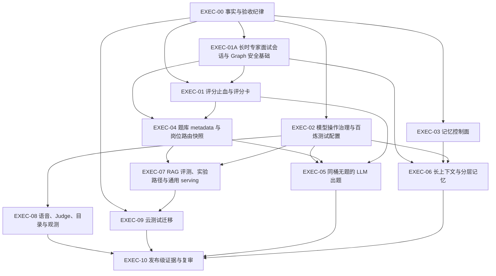

# 未闭环能力执行总清单

> 本文是后续整改的**执行顺序入口**。事实状态以 `architecture/current-runtime-truth.md` 为准；每个工作包的发现、实现、验证、关闭仍以 `production-readiness-remediation-register.md` 的四阶段纪律为准。
>
> 本文不授权云端写入、购买、密钥创建、生产开关变更或删除 Docker。任何此类动作仍需在对应工作包的规格、演练与人工确认完成后单独执行。

## 1. 使用规则

### 1.1 状态图例

| 标记 | 含义 | 不代表 |
| --- | --- | --- |
| `☐` | 未开始；不得绕过其前置条件 | 已设计或将来会做。 |
| `◐` | 有部分代码、合同或本地回执 | 真实生产路径、真实云验证或发布可用。 |
| `⛔` | 有明确环境、授权或设计阻断 | 可以用临时全局权限、固定共享库或假数据绕过。 |
| `◑` | 规格和局部合同已收敛，等待正确层级验证 | 已关闭。 |
| `☑` | 仅当登记册对应行完成独立复审后使用 | 单个 mock、静态扫描、本地 `releaseEvidence=false` 回执。 |

### 1.2 每个工作包的共同完成定义

只有同时满足以下条件，才能开始下一个依赖它的工作包：

1. 对应业务用例、接口、数据对象、状态机和失败语义已经冻结。
2. 迁移、代码和受控配置落在真实组合根，而不是只落在 smoke、demo、fixture 或导出函数。
3. 七类用例覆盖正常、异常、边界、逃逸通道、并发、恢复和对抗输入；涉及数据库、HTTP、浏览器或外部服务时使用相应层级的验证。**仅快乐路径绿 = 假绿**（硬闸 G2）。
4. 运行事实、验收文档、变更记录和外部表述同步，且不夸大本地/模拟回执。每步须 **CMD+EXIT / CI / 收据**（硬闸 G1；叙事 ≠ 证据）。
5. 上一项工作包没有遗留会扩大本项权限、数据外送、删除、评分或跨域检索风险的 P0/P1。
6. 评测用例 + 覆盖矩阵行（含 NEG / FAULT / ADV / PERF）**先于** E2E/prove 实现（硬闸 G3）；实现方不自批，执行前独立专家审（G4）。
7. `partial` / GAP / conn-only / honesty-pin ≠ covered（G5）；api/web/worker 须可复现压测，本地绿 ≠ 生产容量（G6）。

### 1.3 现在必须保持的禁止项

- [ ] 在 `SCOR-01…08` 完成校准前，不恢复 B 端候选数值排序、自动决策或可比较 overall score。
- [ ] 在 `MEM-00` 完成前，不写入全量自由对话、长期事实、记忆摘要或跨会话向量。
- [ ] 在 `INT-TRANSCRIPT-00`、`INT-TRANSCRIPT-01`、`INT-RESUME-02`、`SEC-GRAPH-01` 完成前，不把 checkpoint、短期 job payload、SSE 缓冲或浏览器内存称为“完整面试记录”“历史回放”或安全控制面；它们都不能代替可删除的业务事实。当前 raw answer 在 answer job 终态前仍是 payload 中的明文 JSON，不得称为 canonical artifact。
- [ ] 在 `INT-LONG-INTERVIEW-01`、`INT-LEVEL-01` 和 `SCOR-01…07` 完成前，不把现有有界面试图（覆盖/证据驱动、软预算可上调、绝对杀开关默认 120）称为一到两小时专家面试，也不按工作年限、单题高分或未校准 overall score 给出等级、排序或招聘结论。
- [ ] 在 `MODEL-OP-01…03` 完成前，不把一把百炼 Key 描述为统一网关、全局预算或所有 Agent 的安全授权根。
- [ ] 在 `RAG-FUNNEL-01…06` 完成前，不把相似度命中称作题域隔离，不允许“全库找不到就跨桶或联网生成”。
- [ ] 在 `CLOUD-TEST-01…05` 完成前，不删除 Docker 源码；固定 `meetwise_cloud_test` 只能承担零写入 smoke，不能承载迁移、RLS 或全量 E2E。项目负责人已要求迁移期间**不执行**本地 Docker 数据面路径：保留仅为历史兼容与 ECS 对照，不能成为验证替代。
- [ ] 在真实浏览器、真实 API、真实供应商链路未取得受控证据前，不将流式语音、云测试、RAG 评测或模型评测称为发布通过。
- [ ] **北星硬闸**（`north-star-hard-gates.md` G1–G7）：不宣称 HA / `releaseEvidence=true`；不把 happy-only 绿、conn-only、honesty-pin 写成 covered；后续 knife 缺 NEG+PERF 列不得合入；**G7 已生效**（门禁强制）— 刀绿/dual ≠ 成功；无 G7 全量收据禁止宣称 100% HA / 0 BUG；禁宣称 suite green。

### 1.4 北星硬闸（交付 SSOT 指针）

全文：`north-star-hard-gates.md`。本清单不重复展开。执行任何工作包前视为已冻结：

| # | 闸 | 本清单读法 |
|---|----|------------|
| G1 | 一切可核验 | 无 CMD+EXIT / CI / 收据 = 未执行；叙事 ≠ 证据 |
| G2 | 非快乐路径完整 E2E | 负/故障/边界/对抗须进 cases **且**执行；仅快乐绿 = 假绿 |
| G3 | 需求→评测/矩阵→实现 | 禁止先写绿再回填需求 |
| G4 | 执行前独立专家审 | 实现方不自批；关键切片双域对抗 |
| G5 | 禁假绿 | partial/GAP/conn-only/honesty-pin ≠ covered |
| G6 | 性能+负载 | api/web/worker 可复现压测；本地绿 ≠ 生产容量 |
| G7 | 本地全量套件验证关 | **已生效**（门禁强制；≠ 套件已绿）；验证关是成功唯一标准；刀绿/dual/prove ≠ 成功；无全量 CMD+EXIT 收据 → forbid 100% HA / 0 BUG / `releaseEvidence=true` |

钉：**releaseEvidence=false** · **≠HA** · 全量 E2E 零遗漏（目标）· **100% HA**（目标）· **0 BUG**（硬闸，须证据）。当前均 **未齐**，不得叙事已达成。**成功叙事挂 G7 全量收据**（G7 已生效 ≠ 收据齐，更不得勾 true）。

- [◐] Adaptive-life idempotency CI fix：`post_prove_dual_pass`（`mw-e2e-ha` + `mw-rag-route` independent pass; `pnpm adaptive-life:prove` EXIT=0; HEAD `21672ab`; `releaseEvidence=false`; ≠ suite green/R5/G6/HA）。详见 `harness/adaptive-life-idempotency-ci-fix.md`。

## 2. 执行顺序总览

```mermaid
flowchart TD
    S["EXEC-00 事实与验收纪律"] --> A["EXEC-01 评分止血与评分卡"]
    S --> B["EXEC-02 模型操作治理与百炼测试配置"]
    S --> C["EXEC-03 记忆控制面"]
    S --> K["EXEC-01A 长时专家面试会话与 Graph 安全基础"]
    K --> A
    K --> D["EXEC-04 题库 metadata 与岗位路由快照"]
    K --> F["EXEC-06 长上下文与分层记忆"]
    A --> D
    B --> E["EXEC-05 同桶无题的 LLM 出题"]
    D --> E
    A --> E
    C --> F["EXEC-06 长上下文与分层记忆"]
    B --> F
    D --> G["EXEC-07 RAG 评测、实验路径与通用 serving"]
    B --> G
    B --> H["EXEC-08 语音、Judge、目录与观测"]
    S --> I["EXEC-09 云测试迁移"]
    G --> I
    H --> J["EXEC-10 发布级证据与复审"]
    I --> J
    E --> J
    F --> J
```

| 阶段 | 工作包 | 当前状态 | 允许开始的前提 | 阶段出口 |
| --- | --- | --- | --- | --- |
| 0 | `EXEC-00` 事实、证据和验收纪律 | ◑ | 本文审阅通过 | 所有目标工作包都有唯一 ID、事实来源、依赖、验收和禁止项。 |
| 1 | `EXEC-01` 评分止血与 ScoreCard | ◐ | `INT-TRANSCRIPT-00/01` 完成前只允许止血与合同审计 | legacy 伪评分无法污染任何 C/B 投影；未校准评分不可排序。 |
| 1 | `EXEC-02` 模型操作治理与百炼测试配置 | ◐ | 无；真实配置动作另行确认 | 新模型操作能被预算、模型绑定、容量和失败语义约束。 |
| 1 | `EXEC-03` 记忆控制面 | ☐ | 无 | 记忆的授权、撤回、删除、重建和审计先于任何长期内容写入。 |
| 1 | `EXEC-01A` 长时专家面试会话与 Graph 安全基础 | ◐ | 无；涉及模型派发的子项还依赖 `EXEC-02` | 完整可恢复 transcript、冻结面试蓝图、动态能力校准和安全围栏都有独立业务真相，且不夸大为已上线。`INT-TRANSCRIPT-00` 仅有本地签发器/账本/合同，公开删除仍 503。 |
| 2 | `EXEC-04` QBank metadata 与自动岗位路由 | ☐ | `SCOR-00` 与 score-excluded/B 端暂停边界已冻结；不依赖未实现的 ScoreCard | 标签先于 embedding，面试读取 immutable route snapshot，检索全读面同桶。 |
| 3 | `EXEC-05` 同桶无题 LLM fallback | ☐ | `SCOR-01/02/07`、`MODEL-OP-00/01`、`EXEC-04` | 仅 clean miss 可一次出题，生成题不会污染题库或未校准评分。 |
| 3 | `EXEC-06` 长上下文和分层记忆 | ☐ | `MODEL-OP-00/01`、`EXEC-03` | 可验证 budget、冻结 snapshot、分层 recall 和完整删除传播。 |
| 4 | `EXEC-07` RAG 评测、实验清理与通用 serving | ☐ | `EXEC-02`；QBank 相关项还依赖 `EXEC-04` | 每个“生产”评测走真实组合根；通用 RAG 只有接 serving 才可称服务。 |
| 4 | `EXEC-08` 语音、Judge、catalog 与观测 | ☐ | `EXEC-02` | 目标能力进入真实组合根并有相应数据面验收。 |
| 5 | `EXEC-09` 云测试迁移 | ◐ | 项目独占目标与恢复设计已批准 | 云 runner 可恢复、精确清理；Docker 仅在同等覆盖连续通过后退场。 |
| 6 | `EXEC-10` 发布级证据与独立复审 | ☐ | 前序目标范围内工作包均为 `已验证` | 独立复审、真实环境回执、告警/回滚演练和对外表述一致。 |

## 3. 阶段 0：事实与验收纪律

### EXEC-00 · 统一任务卡与变更纪律

| 项目 | 内容 |
| --- | --- |
| 对应登记 | 全部 `PRD-TEST-001…018`；全部 `MEM-*`、`MODEL-OP-*`、`RAG-FUNNEL-*`、`SCOR-*`、`CLOUD-TEST-*`。 |
| 交付 | 每次实施前创建临时 Task Harness，写明来源、非目标、对象、状态机、接口、数据库、部署、七类验收和命令。 |
| 禁止 | 以“文档已写”“mock 通过”“已有 Key”“固定测试库可连通”替代数据面或运行时验收。 |
| 验收 | `pnpm docs:check`、`pnpm public-text-policy:prove`、`pnpm quality:traceability:prove`、`pnpm quality:governance:check`、`git diff --check`。 |

执行清单：

- [ ] 每个新实施 PR 只取一个工作包或一个明确、可独立验收的子项。
- [ ] 所有开关默认 fail-closed；未配置、未知、撤权、账本不一致和恢复不确定均不能悄悄回退到外送或全库读取。
- [ ] 每次更新 `current-runtime-truth.md` 和对应用例，删除“生产”“E2E”“已验证”等过度表述。
- [ ] 外部链接、外部项目名、路径或实例细节不进入受管公开文档；配置例外必须由公共文本策略显式处理。
- [ ] `PUBLIC-PREVIEW-DIRECTORY-01`：Pages 只发布仓库 `docs/` 静态项目展示（由 `.github/workflows/pages.yml` 在 `main` 复制 `docs/` + 合成截图；仅面试练习，招聘不在本预览范围），目录没有 API、IP、端口、数据服务、秘密或运行时跳转输入，也没有求职者/面试官双角色导航。默认分支与最低 Pages 权限是唯一发布来源。旧 `preview-site/` 签名目录已删除，不得复活为 ECS 入口开关。`TC-public-preview-directory-01-main/E1…E6` 为 planned/unmapped，静态 proof 不是部署或 ECS 证据。
- [◐] `PUBLIC-PREVIEW-WRITE-GATE-01`：公开预览 API 放行 `GET`、`HEAD`、`OPTIONS`，并额外放行受控 `POST /interview/:id/answers`（预览账本，见 `INT-TRANSCRIPT-PREVIEW-SUBMIT`）。其余方法在 NestJS(Fastify) `onRequest` 前置门固定 `503 public_preview_read_only`。其它面试/评分写面仍有服务层 `assertPublicPreviewWritesClosed`；`/answers` 用 `assertPublicPreviewControlledWriteAllowed`（非预览 404）。清单见 `ai-docs/architecture/backend/public-preview-write-inventory.json`。本地命令 `pnpm public-preview-write:inventory`、`pnpm public-preview-write:prove`、`pnpm public-preview-write-gate:prove`、`pnpm -C apps/web prove:middleware` 已接线，回执必须保持 `releaseEvidence=false`。该项的 `TC-public-preview-01-main/E1…E6` 仍是 planned/unmapped；Web 公开展示站仍只读。不得把本地清单或 inject proof 标成已关闭，也不等于预览 worker 已停。
- [ ] `PENDING-PRD-EVAL-01`：为离线评测提升建立正式需求和 oracle。当前 traceability 对既有 leaf 的映射、稳定性样本及图/语音 oracle 均不足以支持质量发布；在冻结真实样本、分母、阈值、人工标注、失败处置和提升接收器前，任何离线 eval 只提供研究信号。
- [◐] `WORKER-DISPATCH-001`：源码已将面试、押题、诊断和报告从固定 1.5/2 秒主路径轮询改为 PostgreSQL 提交后静态 `wake`，并保留不超过 5 秒的 reconciliation；本地 listener/DrainLoop 合同已通过。作业表/claim/lease/RLS 仍为真相。尚缺隔离 PostgreSQL rollback、20 路并发、多副本、重连与真实 trigger/RLS 验收；本机 Docker 存储空间不足时保持 `releaseEvidence=false`，不得删除 reaper 或宣称端到端低延迟。
- [◐] `WORKER-DISPATCH-002`：面试队列已接线 owner 轮转（每次启动至多一个 drainOnce；`globalInflight>1` 时多 owner 可重叠）、每 owner 数据库**未过期** running cap（默认 1，跨副本计数）、进程内 `WORKER_INTERVIEW_GLOBAL_INFLIGHT`（默认 4）、`idle`/`retry` 轮转语义、切片隔离、reap 失败则该 owner 本拍不 drain、每拍 32 次 launch cap。同面试保序与 lease CAS 仍在领取 SQL；`markDone` CAS=0 对调度层不是成功。押题/诊断/报告仍抽干单个 owner（`HC-GAP-002` 已用 `pnpm owner-drain-order:unit:prove` 诚实证明顺序为 `A,A,A,B`，不是轮转）；进程内 global cap 不是集群锁；`HC-GAP-001` 已关闭：失败关闭门（`pnpm interview-dispatch:gate:prove`，per-push CI）+ 可选远程 `prove` + 远程成功时的回执写入路径登记。远程 SQL 证明仍 `releaseEvidence=false`，禁止改起本地 Docker 库，**不在** per-push CI，本环境无通过回执。未完成跨副本硬 cap、其余队列公平和发布级延迟测量前，不把即时 wakeup 宣称为繁忙状态的端到端延迟或容量保证。交叉面（SKIP LOCKED、SSE 槽、模型槽、`0130` claim-join）的证明缺口见 `architecture/backend/high-concurrency-review.md`。`HC-GAP-006`（押题/诊断非法 `Last-Event-ID` → HTTP 400）已由 `pnpm api:validate` 关闭，不是容量 SLO，也不关闭 `HC-GAP-007`。`HC-GAP-014` 已在 `main`（#90）。`HC-GAP-011`（孤儿 permit / 两连接无行具名用例）已挂进 `pnpm runtime:prove`，只关那一项。
- [x] `GOV-RECOVERY-01`（仅静态治理）：已以 append-only successor 登记云、记忆、模型路由和 RAG 漏斗的 113 个 `planned/unmapped` leaf，并修正云 group/占位符与 RAG 缩写 leaf 的盘点；随后登记 worker 事件唤醒的 7 个与长时专家面试的 35 个计划 leaf。冻结基线为 1,699 个历史未映射 leaf，当前 worktree inventory 为 1,854，且这些新增项均显式为 planned/unmapped、尚未提升为 required binding，不能伪称已覆盖。`quality:governance`、`quality:traceability` 和文档门只提供 `releaseEvidence=false` 的静态一致性；首次 bootstrap 与真实 base/head append-only 守卫仍须在提交后的受信 CI 执行，不能据此关闭任何业务 TC 或发布门。

## 4. 阶段 1：先封住评分、模型和记忆的基础风险

### EXEC-01A · 长时专家面试会话、水平校准与 Graph 安全基础

| 字段 | 内容 |
| --- | --- |
| 对应登记 | `INT-TRANSCRIPT-00`、`INT-TRANSCRIPT-01`、`INT-RESUME-02`、`INT-LEVEL-SIGNAL-01`、`INT-LEVEL-01`、`INT-LONG-INTERVIEW-01`、`SEC-GRAPH-01`；控制信号地基见 `requirements/use-cases/interview-control-signals.md`，完整长时用例见 `requirements/use-cases/expert-long-interview-runtime.md`。 |
| 当前状态 | `INT-TRANSCRIPT-00` 为 ◐：独立 `PrivacyAuthorizationIssuer`、0091 target/receipt 账本与 submission/receipt 合同已在源码落地；issue 按调用方字段落账（不做 JWS 验签），worker 仍走 0077，公开删除仍 503。树上另有 0092/0096 rehearsal。预览版可将 `/answers` 接到 `submitInterviewAnswer`（`INT-TRANSCRIPT-PREVIEW-SUBMIT`），非预览 404，不是 01 生产 write。七类 TC 仍为 planned/unmapped，无部署密钥、无真实组合根回执（`releaseEvidence=false`）。`INT-TRANSCRIPT-01` 及后续项仍 blocked。当前自适应图以有界当前题答为主；长度由 `decideNext` 按覆盖/证据/弱答/空转/加深决定，软预算可上调，绝对杀开关默认 120 只防 runaway（见 `UC-INT-LENGTH-01`）。`observeInterviewSignals` 可提前 `early_weak`/`thrashing`（见 `INT-LEVEL-SIGNAL-01`），不改写 `maxTurns`。这仍不是 60/90/120 分钟 blueprint。checkpoint 只足以恢复 pending graph 工作，legacy `/turn` raw answer 在 answer job 终态前仍为明文 payload，SSE/client 状态不构成历史面试账本。 |
| 目标 | 让一到两小时专家面试拥有可删除、可分页回放的用户可见 transcript；以冻结 blueprint、route 与 rubric 约束长期流程；以证据而非工作年限校准能力；把授权、注入防护、RAG/memory 边界和输出投影复核接入每个敏感边界。 |
| 依赖 | `INT-TRANSCRIPT-00` 的独立 `PrivacyAuthorizationIssuer`（不得复用 `AUTH_SECRET`、runtime SQL、worker/deleter 或 GUC 身份根）、不可伪造删除授权、target/sink receipt 与 submission/receipt **合同冻结**是 01 的 P0 前置。00 不授权 01 生产写入；树上 0092/0096 rehearsal 表/函数与预览 `/answers` 都不是公开 01 write route，也不把 rehearsal purge 称为删除已闭环。只有 01 的公开 schema/target resolver/deletion ledger/逐 sink receipt 和删后 read=0 在同一迁移、同一真实组合根证明后，真实用户 write route 才能启用；此前一律 disabled。评分合同依赖 `EXEC-01`；模型外送/压缩/分类的 operation 依赖 `EXEC-02`；长期跨会话记忆依赖 `EXEC-03` 与 `EXEC-06`；题库 scope 依赖 `EXEC-04`。01 首包禁止模型、RAG/Web、评分、报告和 memory 副作用。 |

执行清单：

- [◐] `INT-TRANSCRIPT-00`：独立 `PrivacyAuthorizationIssuer`（ECDSA P-256 / ES256，`iss=meetwise-privacy-authz-v1`）与 0091 `privacy_authorization_snapshot` / `privacy_deletion_receipt`、受约束 claim、no-forge-completed guard 已在源码落地；signer/verifier 与 `AUTH_SECRET`、runtime SQL、worker/deleter、GUC 身份根分离。`0091` issue 按调用方字段落账，本身不做 JWS 验签；privacy worker 仍走 `0077`，HTTP 未接线。submission/receipt 合同已冻结且不进 OpenAPI。公开 `DELETE /privacy/interview-data/:id` 仍 503。**UC-052 内部授权擦除第一刀**（`pnpm uc052:internal-erasure:prove` tip `3c4847a` · EOR dual `08d54f8`/`3e39c1e` · status `post_prove_dual_pass`）→ 矩阵 **UC-052 deletion=partial** · **≠ covered** · **≠** INT-TRANSCRIPT-01 / controlPlaneClosed · externals 仍 `retention_pending` · checkpoint physical purge nailed（`GAP-PRIV-CHECKPOINT-FENCE-ONLY` CLOSED · prove `69de818` · dual `118e28f`/`2e743b2` · **≠ covered**）。 pool-role-leak nailed（`GAP-UC052-POOL-ROLE-LEAK` **CLOSED** · `post_prove_dual_pass` · product path `SET ROLE NONE` on pool release + clear the 3 GUCs + destroy the connection if reset throws · not `RESET ROLE` · not `DISCARD ALL` · prove `9b39a20` range-diff-equal code `ab96a02` · receipts `522590d` · dual `49ef158`/`7cb7010` · **≠ covered**）。 `NOTE-CKPT-UNSEALED-CLAIM-NEG` **CLOSED** by this knife inside `uc052:checkpoint-physical:prove`（NULL epoch, NULL digest, both, plus sealed control · SQLSTATE 42501 · do not double-count · Line F REQUEST `a1a06ab` must not be coded as a second implementation）。 `GAP-PRIV-AUTHZ-PROVE-FLAKE` stays **OPEN** · mitigated/cause-unknown（cold#5 ECONNREFUSED 127.0.0.1:33047 state_bytes=29 · warm#2 SQLSTATE 23505 `interview_pkey` not ECONNREFUSED · review `49ef158` agrees with `warm-2.log` / `cold-5.log` · v2 @`3d0c71e` cold_v2 10/10 EXIT 0 · warm_v2 10/10 EXIT 0）。 Pins retained: haStatus=NOT_HA · releaseEvidence=false · claimProductionHA=false · gR45Closed=true · coveredCount **8** · ms3EqualsR4Closed=false · PG-retained · public DELETE=503。`0129` 预览版 `POST /privacy/erasure-preview` 可盘点 sink 并链接 0096/0125 begin，回执固定未完成、`releaseEvidence=false`，不是 issuer 生产删除。树上已有 0092 rehearsal 表/函数与 0096 event/report/`ai_graph_run` rehearsal resolver。预览版可将 HTTP `POST /interview/:id/answers` 接到 `submitInterviewAnswer`（`INT-TRANSCRIPT-PREVIEW-SUBMIT`）；非预览该路径 404，OpenAPI 不登记。这**不**授权 `INT-TRANSCRIPT-01` 生产 cutover，也不把 rehearsal purge 或预览删除回执称为公开删除已闭环。七类 TC 仍 planned/unmapped；账本 HTTP 证明须远程 Postgres 环境变量，禁止 `pnpm db:up`，无回执时 `releaseEvidence=false`。无 receipt、无组合根滥用证明前不得声称删除完成，也不得勾“已关闭”。现有 legacy `/turn` 仍写 plaintext job payload，必须如实保留为 `INT-P0-RAW-QUEUE`，不可被文字误称为已停用。`PUBLIC-PREVIEW-WRITE-GATE-01` 在预览下仍拒绝 `/turn`，并允许上述受控账本写；`MEETWISE_PUBLIC_PREVIEW=1` 下 `POST /privacy/erasure-preview` 仍 503。
- [◐] `INT-ANSWER-DUAL-WRITE-FENCE`（不是 01）：迁移 `0126` 已在 main。答题双写互斥 + 事件禁原文。`/turn` 在无 ledger 时仍写明文 `interview_job.payload`；预览 `/answers` 走 ledger 侧并受该围栏约束，仍不是生产 01 HTTP。`INT-TRANSCRIPT-01` 保持 blocked。`0127`/`0128`/`0129`/`0130` 已在 main；本围栏不改号、不占用 0131。盘点与后续切换顺序见 `architecture/backend/interview-answer-dual-write-cutover.md`；用例 `UC-INT-ANSWER-DUAL-WRITE-FENCE`；证明 `pnpm int-answer-dual-write-fence:prove`（远程 Postgres，禁止 `db:up`，`releaseEvidence=false`）。
- [◐] `INT-TRANSCRIPT-PREVIEW-SUBMIT`：预览路径把 `POST /interview/:id/answers` 接到既有 `submitInterviewAnswer`（0092 rehearsal 账本）。仅 `MEETWISE_PUBLIC_PREVIEW=1` 可写；非预览 404。不入 `apiContract`，不写 plaintext `/turn` job，不宣称 01 生产 cutover。受已落地的 `0126` 互斥约束。`0127` OCR binding / `0128` dispatch fairness 已在 main；公开预览下 OCR 组合根仍关。`0129` 预览删除是另一条账本，公开预览下仍 503。`0130` / `INT-LEVEL-SIGNAL-01` 已在 main，不改本写面。`#79` 预览批量语音（`/transcribe` `/speak`）仍走入站 503，不进本受控写 allowlist。`#83` Web `/resume` 预览图片入口是另一条 OCR 预览面，不改本写面。`#67` Bailian/native fail-closed 不发明题面，不改本写面。本项不新增迁移、不占用 0131。本地 inject/清单门已接线；账本 HTTP 证明须远程 Postgres 环境变量，禁止 `pnpm db:up`，无回执时 `releaseEvidence=false`。
- [ ] `INT-TRANSCRIPT-01`：真实用户 canonical 写入有两个不可拆分的 release gate：先由 00 验证授权/删除合同；再由**同一部署迁移**安装 artifact/draft/submission/item/ref-only-job/view 的 target resolver、deletion ledger、逐 sink receipt 与删后 read=0，并以真实 HTTP/SSE/RLS 组合根证明。两个 gate 任一缺失时仅允许非用户数据的 test-only rehearsal，所有真实 **01 canonical** raw-answer write route 保持 disabled。现有 legacy `/turn` 不是 01 的实现或回退路径；`0126` 已提供对向互斥围栏（见上条），启用 01 前仍须按切换图切断明文 payload，避免两条路径写同一答题事实。冻结 `InterviewAnswerArtifact`、`InterviewAnswerDraft`、`InterviewAnswerSubmission`、`InterviewTranscriptItem` 与 `InterviewViewSnapshot`。接受事务只写加密 canonical artifact、submission receipt、item、ref-only job 和 `visibleSeq`；同 key/同体回放、同 key/异体冲突、同题双 tab 一 winner。禁止把原始 answer、内部 prompt、模型 chain-of-thought、tool payload 或 token 流写入 checkpoint/job JSON/SSE/log/trace；首包模型、RAG/Web、评分、报告、memory 和 B 端投影均为 0。
- [ ] `INT-RESUME-02`：在 01 通过后重新对抗审查浏览器重登、worker 生命周期和用户体验；使用已冻结的 `InterviewViewSnapshot(highWatermark)` + event cursor + transcript pagination。页面先读同一版本 snapshot，再从 high watermark 订阅 SSE tail，按稳定 item/event ID 去重。双标签、提交响应丢失、浏览器关闭、worker takeover、历史 raw answer 已被清理和 privacy fence 都必须有明确回放或“不可恢复”语义，绝不伪造内容。
- [◐] `INT-LEVEL-SIGNAL-01`（控制流地基，**不是** `INT-LEVEL-01`）：`observeInterviewSignals` + `decideNext` 可因持续弱/震荡提前 `early_weak` / `thrashing`；图 `concludeReason` 为 provenance hook。信号不改写 `maxTurns`；绝对杀开关先赢；不冻结产品轮次上限。用例见 `requirements/use-cases/interview-control-signals.md`。本地证明：`pnpm adaptive-signals:prove` + `pnpm adaptive-signals-graph:prove`（`releaseEvidence=false`；不证明能力等级、B 端 band、ScoreCard）。不关闭本条下方的 `INT-LEVEL-01`，不产出 band。SSE 预览见下条。
- [◐] `INT-LEVEL-SIGNAL-SSE-01`（预览投影，**不是** `INT-LEVEL-01`）：图 `concludeReason` 为 `early_weak`/`thrashing` 时，worker 经既有 `appendEvent` 追加 `session_concluded`。不发明分数，不写 band，不是招聘结论。用例见 `requirements/use-cases/interview-signal-sse.md`。本地证明：`pnpm signal-sse:prove` + `pnpm signal-sse-contract:prove` + `pnpm signal-sse-worker:prove` + `pnpm web:prove`（假 append / 纯函数，无 Docker DB；`releaseEvidence=false`）。不关闭下方 `INT-LEVEL-01`。
- [ ] `INT-LEVEL-01`：将简历年限/经历作为 non-binding `InitialLevelHypothesis`，按 `CompetencyLevelAssessment`、跨题 evidence、rubric/难度合同和不确定度不断上调、下调或标记 `insufficient_evidence`。初级候选人可以被 promotion probe 检出高级能力；声明高级但证据不足不能自动获得高级结论。不得使用年龄、性别、学校、地域等代理变量。`INT-LEVEL-SIGNAL-01` 的终止 hook 与 `INT-LEVEL-SIGNAL-SSE-01` 的事件露出 **都不是**本项。
- [ ] `INT-LONG-INTERVIEW-01`：以不可变 `InterviewBlueprintSnapshot` 固定时长、模块、能力覆盖、route allocation、最大题数、每模块最少有效证据、版本和终止策略；终止要从 time + module coverage + evidence 判定。短流程已不再用固定轮数硬顶（`UC-INT-LENGTH-01`：软预算 + 绝对杀开关默认 120），**把数字从 8 调到 16 或把杀开关调到 120 都不等于本项完成**。
- [ ] `SEC-GRAPH-01`：将 `AuthorizationSnapshot`、`ContextSnapshot`、`SecurityDecision`、route/blueprint refs 与 `OutputProjectionPermit` 做成边界承重对象；授权/撤权/epoch、input/RAG/web 注入、memory poison、schema/evidence/业务投影校验必须在读取、模型派发和写入前重验。LLM 只能提议内容，不能决定权限、scope、删除、终止或业务状态。
- [ ] `INT-RUNTIME-TEST-01`：对以上对象进行七类验收：重复提交、双 worker/CAS、跨 owner/tenant=0、断线/崩溃/删除竞态、20+ turn 与 60/90/120 分钟 blueprint、提示词/RAG/memory 注入、路由/rubric 版本漂移及 unknown model attempt。真实浏览器和真实供应商证据另按 `EXEC-10` 取得。

阶段出口：用户重新进入同一面试时能够看到**当时被允许保留**的完整用户可见记录、当前 pending/draft 和后续 SSE；长时蓝图可解释为何继续、转模块、请求澄清或结束；任何安全、删除、路由或评分围栏失效时不读取、不外送、不投影。

### EXEC-01 · 评分止血与版本化 ScoreCard

| 字段 | 内容 |
| --- | --- |
| 对应登记 | `PRD-TEST-001`、`PRD-TEST-015`、`SCOR-00…08`；人工复核为待立项的 `PENDING-PRD-REVIEW-01`。 |
| 当前状态 | `PRD-TEST-001 / SCOR-00` 已在本地完整迁移组合根验证：legacy `/answer` 固定拒绝，真实 HTTP proof 覆盖活动 C/B 面试、重放、并发与跨主体调用，HTTP app 使用独立 provision 的低权 runtime login，所有受检副作用增量为 0。`SCOR-00H` 已接线消费面诚实闸（域+转写/`POST` 评估/`POST` career/SSE），空评估与无 identity 不得伪造 0。域 `refuseMappedBSideScore` 恒失败，**未改** worker eligible 与 `markApplicationNoEligibleScore`；`GET assessment`/`GET career-path`/`GET /profile/growth`/`GET report` 不重跑闸。两份回执均为 `releaseEvidence=false`，只证明旁路止血与消费诚实，不是评分闭环；`PRD-TEST-015` 的评分卡与校准尚未实施。 |
| 目标 | 评分只从冻结的题目、回答、rubric、证据和版本合同产生；覆盖不足或不确定时返回 `insufficient_evidence` / `review_required`，不伪造可比较数值。 |
| 依赖 | `SCOR-00` 已止血；`SCOR-01/02` 的生产实现明确依赖 `INT-TRANSCRIPT-00/01` 的 canonical artifact、删除授权、逐 sink receipt 与删后 read=0 的真实组合根证明。必须先于 LLM 生成题、B 端排序、候选比较和校准宣称。 |

执行清单：

- [x] `SCOR-00`（本地组合根）：`pnpm scor-00:http:prove` 已在完整 87 个迁移的隔离 PostgreSQL 中，以独立 provision 的低权 runtime login 启动真实 HTTP app；活动 C/B 面试、重放、并发、伪造 body 与跨主体 `/answer` 均返回 `410`，两个调用主体的消费、event、job、report、assessment、application status/score 增量均为 0，合法 `/turn` 仍可受理。回执为 `releaseEvidence=false`，不关闭 `SCOR-01…08` 或 B 端校准门。
- [x] `SCOR-00H`（消费面诚实闸接线，非关闭）：`packages/domain/src/scoring-honesty.ts` + 转写/`POST` 评估/`POST` career/SSE；空评估与无 identity/answer claim 不得伪造 0。`pnpm scor-00-honesty:prove` / `pnpm web:prove`（非隔离 HTTP）。未改 worker eligible、`markApplicationNoEligibleScore`、`GET`/`growth`/`report`/`learning-plan` 重闸、`listScorableScoreCards` 的 `b_review_eligible`。`releaseEvidence=false`。阶段出口未达。
- [◐] `SCOR-00` 消费诚实（内部预览 UI，不是招聘方产品面）：`/recruiter/how-it-works` 与 `/recruiter/jobs/:id/applications/:applicationId` 已接线；列表/申请状态页/C 端「我的投递」不再渲染申请数字分。这是只读消费门，`releaseEvidence=false`，不关闭校准、人工复核工单或 B 端用途。详见 `requirements/use-cases/bend-recruiter-architecture-surface.md`。
- [ ] `SCOR-01`：在 `INT-TRANSCRIPT-00/01` 通过后冻结两阶段评分事实：issue 阶段 `IssuedQuestionContract` 只含题目/rubric/route/cohort/policy/privacy，**不含未来 answer**；提交后以 canonical artifact 追加 `AnswerVersion/ScoreRequest`、answer HMAC 和 delete-wins permit。
- [ ] `SCOR-02`：与专用 score-writer/verifier 一起原子切换 C 端 assessment/report/profile/memory 等全部消费者；只消费资格化 ScoreCard，legacy event 均分、无 rubric、生成题与未校准卡一律 unavailable/score_excluded。确定性 coverage gate 与聚合不得混合不同难度/题型路径。
- [ ] `SCOR-07`：在所有消费面先实施 B 端用途硬门；无 calibration/review 的分数不能影响申请、列表、人才库、通知或导出。
- [ ] `SCOR-03`：在 `MODEL-OP-01` 后接入 criterion ID、level/score、evidence span/hash、relevance、uncertainty/review flag；服务端验证 span、rubric 与权重。
- [ ] `SCOR-04`：在 `MODEL-OP-01` 后建立独立评分 operation、attempt、预算与 unknown 语义；低置信、模型切换、repair、generated question 全部进入 `review_required` 或 `score_excluded`。
- [ ] `SCOR-05`：冻结金标、双盲人工标注、难度/锚题与 cohort 稳定性评测；校准 release 不通过则不出 B 端 comparable score。
- [ ] `PENDING-PRD-REVIEW-01`：按人工复核架构立项并实现 `ManualReview`、证据 snapshot、assignment lease、append-only decision、effect outbox、审核员 RLS/access audit 与申诉 E2E；产品/法务的角色、保留期、四眼阈值未定前，不开放招聘 beta 或“合规人工复核”宣称。
- [ ] `SCOR-06`：以双盲、仲裁、申诉和人工复核为基础完成 calibration release；没有数据时状态保持 `inconclusive`。
- [ ] `SCOR-08`：用真实组合根验证状态、并发、unknown、删除和落库；只在校准、复核、申诉、模型漂移监控完整后讨论恢复 B 端辅助显示。

阶段出口：B 端不再读取不合格事件；未完成评分卡只可给候选解释或人工复核，不能影响排名、推荐或自动结果。

### EXEC-02 · 模型操作治理与百炼非生产配置

| 字段 | 内容 |
| --- | --- |
| 对应登记 | `PRD-TEST-014`、`MODEL-OP-00…04`、`BAILIAN-00…07`、`PRD-TEST-009`。 |
| 当前状态 | `MODEL-OP-00` 为 **部分实现**：文本路径已有冻结 `max_tokens`、局部预算与 price revision 绑定。`0088` 状态机 + `pnpm model-op00:prove` 已于 2026-08-16 独立复审关闭 DB-state；六个文本面 + `resume.ocr.v1` 走 registry node identity。catalog 仍未在 `invoke()` 主链，tokenizer 因子未回派发，故 `MODEL-OP-00` 整体未关。`MODEL-OP-01` OCR 窄切片已接线（typed binding + 密封 provenance/身份封印 + 面试 fail-closed，`pnpm model-op01:prove`）；ASR/TTS/embedding/rerank 仍直连适配器，broad DashScope native secret 仍在。预览双旗可走通 OCR invoke（非生产 SLO）；生产 `OCR_ENABLED`/`OCR_PREVIEW` 在 production+enforce 下仍关（binding 存在也不开）。原生 URL 为固定 Beijing profile（`BAILIAN-04` 静态局部）。**`UC-MODEL-ROUTE-04` 出题/原生响应 fail-closed 已本地接线**（缺 Key/超时/畸形不再发明题面或空转写；registry `fallbackAction=generation_unavailable`；lifecycle 发 `interview_unavailable`+provenance）。本地证明不构成百炼 smoke、不关闭 `BAILIAN-00…07` / `MODEL-OP-01…04`。所有回执 `releaseEvidence=false`。 |
| 目标 | 每个逻辑节点按 operation 而非临时环境变量选模型，预先确定上限、费用、备用、失败语义和可外送的数据类别。 |
| 依赖 | 无；是新增模型节点、RAG 生成、记忆压缩、语音和真实评测的共同前置。 |

执行清单：

- [ ] `BAILIAN-00`：核验项目专用非生产空间、区域、费用边界、用途和负责人；默认测试空间 Key 不等同该空间隔离，不得把 Key 写入仓库、聊天、日志或 CI。
- [ ] `BAILIAN-01`：核对每个候选模型的可用性、区域、计量单位、价格 revision 和上下文窗口；未获授权的 operation 维持 fail-closed。
- [ ] `BAILIAN-02`：设置测试总额、单日/单 run 上限和消费告警；未知价格、窗口或额度不得 dispatch。
- [ ] `BAILIAN-03`：将一次性测试 Key 只保存在受控 secret/钥匙串；验证 API/Worker、CI、镜像、日志、回执和受管文档均不存在该 Key。
- [ ] `BAILIAN-04`：选择并验证规范 endpoint、TLS 与区域；普通 API/Worker 不可用环境变量任意覆盖 endpoint/key，拒绝 URL query、片段和任意备用 URL。
- [ ] `BAILIAN-05`：每个 operation 使用非敏感、脱敏、最小次数的 controlled smoke；回执只存 HMAC/版本/用量/状态，不存 key、prompt 或用户数据。
- [ ] `BAILIAN-06`：视觉、embedding、ASR、TTS 和流式能力逐项拥有数据上限、取消、费用与隐私 smoke；未获准项维持关闭。原生适配器缺 Key/超时/畸形 body 的本地 fail-closed 已接线（`pnpm native-fail-closed:prove`），**不是**本项的真实能力 smoke。
- [◐] `UC-MODEL-ROUTE-04`：出题缺 Key/超时/畸形/critique 失败禁止发明题面；原生 ASR/TTS/embedding/rerank 禁止发明转写/向量/排序。本地 `question-generation-fail-closed:prove` / `native-fail-closed:prove` / `adaptive-graph:prove`。不关闭 `MODEL-OP-01`，不加 CI/CD，不接真实 Key。
- [ ] `BAILIAN-07`：完成定期健康、密钥轮换、额度演练、供应商异常和成本告警 runbook。
- [x] `MODEL-OP-00-DB-STATE-001`：先撤销 invocation 直写或建立 `BEFORE INSERT OR UPDATE` 完整状态机；direct `INSERT dispatching`、非法 terminal transition、派发后 identity mutation 和 reservation mismatch 必须由真实低权 SQL 拒绝。随后实现原子 header upsert、冻结 reservation binding，并证明 20 same/different-key 并发正例恰为 1、反例均为 0。✅ **已关闭（2026-08-16 独立复审）**：`pnpm model-op00:prove` 在隔离 PostgreSQL 跑绿（89 迁移、exit 0、`releaseEvidence=false`），回执 sha256 与审计的 proof/0088 文件完全一致；direct INSERT/非法 terminal/identity mutation/reservation mismatch 均由真实低权 SQL（`SET LOCAL ROLE app_role`）拒绝，20 same-key→1 execute、20 diff-key→1 execute+19 deterministic mismatch。
- [◐] `MODEL-OP-00`：在 DB state P0 后继续完成类型化 component ledger、tokenizer/usage 校准与服务端 registry node identity。新增/遗留调用面都必须使用该身份；不同价格 policy 的 backup 只能按明确 pre-dispatch 选择语义运行，已派发 unknown 不自动重试。✅ **DB-state 已关**（见上）。✅ **registry node identity 已切**（2026-08-16：scoring/quiz/diagnosis/report/plan/question 六个文本调用面从 caller 直传 `logicalNodeKey` 改为 `operation`；`resume.ocr.v1` 随后由 MODEL-OP-01 窄切片切到同一 registry 身份 + typed binding。model-op00/interview/quiz/diagnosis/report 五 gate 绿；独立审计 PASS 并修掉 `isRegistryLogicalNodeKey` 对含冒号 businessRevision 的误判 + 补 `quiz:prove`/`report:prove` 覆盖）。✅ **类型化 component ledger**：首版误做成镜像 model-op registry 的静态 catalog（`component-ledger.ts`）已撤；正确做法是**扩展现有预算器** `planContextBudget`/`ContextBudgetPlan`：把渲染输入按组件分账（system/数据围栏/schema reserve/tool reserve/RAG 独立分账；snapshot·recent·summary 属 L5 未接线，不空占位），并把 `toolReserve` 补进 `availableInput = contextWindow − maxOutput − toolReserve − safetyMargin`。`prove:component-ledger` 11 断言绿。◐ **tokenizer/usage 对账校准**：estimate 穿线（`prove:estimate-threading-invoke` 落库配对 + 低估 flag）+ 纯版本化校准模块（`prove:usage-reconciliation`）已建。**2026-08-17 收尾（独立审计 PASS 可合）**：① estimate 全 outcome 落库已修（P1，`ai_model_invocation` 补 `estimate_input_tokens` 列 + claim 时写，迁移 0119，解校验失败样本偏置）② 域级异步 reconciler 接线（P2，`reconcileUsageCalibration` 复用 `reconcileUsage`、持久化版本化 `CalibratedFactor`，28 断言）③ 因子读面浮出（`resolveLatestCalibratedFactor`/`toCalibratedFactor` 双校验 fail-closed）。**显式 defer（不在本收尾范围，勿读成端到端闭环）**：因子应用回派发（caller 需自调传预算层，`planDispatchBudget` 未接派发主链）+ 真实 worker loop 调度（`reconcileUsageCalibration` 未注册进 `apps/worker`）。✅ **backup 价格 policy 语义**（`prove:failover-price-policy` 8/8 绿：pre-dispatch 选路绑定 backup policy、已派发 unknown 不自动重试、半开重选 cost policy 漂移护栏）。
- [◐] `MODEL-OP-01`：为 chat、vision/OCR、embedding build/query、rerank、ASR、stream-ASR、TTS、stream-TTS、signed download 建 typed operation binding；未知字段、raw prompt/provider URL 均拒绝。◐ **OCR 窄切片已接线（非子项关闭、非整项关闭）**：`bindResumeOcr` / `visionOcr` 在 invoke 前解析冻结 `resume.ocr.v1` **身份封印**（非出站 host pin）；成功转写封存 `SealedOcrProvenance`；`resume_profile.ocr_binding`（迁移 0127）供面试 `admitInterviewResume` 消费（读 profile，不解密）；图片源缺 binding → 画像不可用且零视觉外呼；`pnpm model-op01:prove` 为本地静态门。预览双旗 `OCR_ENABLED=1`+`OCR_PREVIEW=1` 打开组合根派发；`bindResumeOcr`/`visionOcr`/`admitInterviewResume` 已接线（失败不编造）。`model-op01:prove` 是本地静态+stub fetch，不是 HTTP 上传 E2E 或视觉 SLO。生产/enforce/公开只读预览仍拒绝组合根。☐ ASR/TTS/embedding/rerank/signed-download 适配器仍 unwired；☐ 媒体预算/删除/脱敏视觉回执未做；不得把本切片写成 MODEL-OP-01 关闭或发布证据。
- [ ] `MODEL-OP-02`：接共享 provider account + region + model + tenant/project + operation 准入、费用账本、并发和 breaker；不再让各适配器各自限流。
- [ ] `MODEL-OP-03`：落地节点矩阵：确定性节点零 LLM；分类、抽取、压缩使用小模型；评分、复杂生成使用质量模型；派发后不换模型，unknown 不自动重发。
- [ ] `MODEL-OP-04`：只有 AuthorizationSnapshot、outbox、attempt、删除/stream/network 隔离全部闭合后，才开始唯一 model gateway；此项不属于本阶段的“先接 Key”。
- [ ] `PRD-TEST-009`：决定 catalog 是正式授权根还是实验骨架；若保留实验，移除任何生产宣称；若正式化，主调用链不能绕过它。

阶段出口：新增或修改模型节点前必须能从 operation 找到模型、预算、数据类别、失败/降级、计量和验收；任何未登记 operation 外送为 0。

### EXEC-03 · 记忆控制面先行

| 字段 | 内容 |
| --- | --- |
| 对应登记 | `PRD-TEST-013`、`MEM-00`、`MEM-10`、`MEM-11`、`MEM-12`、`MEM-13`、`MEM-14`。 |
| 当前状态 | ☐；现有 lean memory 只能做精确题目去重和 report 弱项软排序，不能称为长期语义记忆。 |
| 目标 | 先形成控制面的授权、生命周期、删除、重建、审计和跨租户隔离，再允许写入长期对话、事实、摘要或向量。 |
| 依赖 | 无；是 `EXEC-06` 的硬前置。 |

执行清单：

- [ ] `MEM-00`：定义 memory controller、subject、tenant/project、purpose/consent、privacy epoch、retention 与删除授权根；不可复用可写路由 GUC 作为身份根。
- [ ] `MEM-10`：建立用户/管理员的列出、查看来源、撤回、过期、删除、重建与审计命令；每个命令具短时授权、CAS 与幂等键。
- [ ] `MEM-11`：定义 memory generation / vector / cache 的 activate、supersede、retire、tombstone、rebuild 状态机和 lease fence。
- [ ] `MEM-12`：所有进入记忆的条目带 scope、subject、controller、purpose、consent version、来源 span/hash、taxonomy、敏感级别、TTL 和 provenance。
- [ ] `MEM-13`：定义同 fact key 的冲突、置信、时间衰减、失效和人工确认规则；模型摘要不是事实源，冲突时不覆盖来源事实。
- [ ] `MEM-14`：落实“先元标签过滤，再水合原文，再权限/epoch 复验”的两段式 recall；向量相似度不得直接授权或直接进入 prompt。

阶段出口：撤回/删除可以按 request 枚举 event、summary、fact、snapshot、vector、cache、trace 与外部 target，并为每个 sink 取得终态回执；否则长期层维持禁用。

## 5. 阶段 2：先给题库打可信 metadata，再自动决定岗位桶

### EXEC-04 · QBank metadata、自动岗位意图与 route snapshot

| 字段 | 内容 |
| --- | --- |
| 对应登记 | `PRD-TEST-016`、`RAG-FUNNEL-01…08`。 |
| 当前状态 | ◐。`RAG-FUNNEL-01A` 源码闭包已密封（31 函数 + 15 表 + 2 视图，含 bounded reader / view / helper / trigger）；本地 `qbank-handoff-closure:prove` 覆盖移交前后 42501、raw-read=0、lane(b) 撤销；`0124_rag_retrieval_acl_fail_closed.sql` 空 principal → `rag_acl_principal_missing`（`0124`/`0125`/`0126`/`0127`/`0128`/`0129`/`0130` 已在 main；本变更不新增迁移、不占用 0131）。`releaseEvidence=false`，不是云组合根回执。P0 仍阻断 `RAG-FUNNEL-01` 的 `MetadataReviewReceipt` serving、完整 facets 与标准部署 handoff receipt。Worker 仍以固定“技术岗”启动，本地 03–07 proof 不是生产 routed serving。 |
| 目标 | 先在摄取/切块阶段写入经审核的层级 metadata；岗位意图分类器只在 job 创建/更新时自动给出有限 route allocation；已开始面试只读 immutable snapshot。 |
| 依赖 | `SCOR-00/02/07` 已冻结 generated/uncalibrated score 的处理；`INT-LONG-INTERVIEW-01` 已定义 route/blueprint snapshot 的消费点；metadata 与 projection 先于任何路由/检索；embedding provider miss、分类模型与生成题分别依赖 `MODEL-OP-01` 的 operation 边界。 |

执行清单：

- [x] `RAG-FUNNEL-01A`（源码密封，`releaseEvidence=false`）：sealed dependency manifest 覆盖 control writer/trigger、bounded app reader、调用 helper、security-definer view、pool/cache/epoch trigger 及受管 relation（31 函数 + 15 表 + 2 视图）。owner、精确 ACL、RLS、固定 `search_path`、移交/重放与 catalog 断言由 `principal.ts` + `0094` + `provisionQbankControlDefiner` 强制。本地 `qbank-handoff-closure:prove` 证明移交前 42501、移交后 ingest/active-metadata/bounded readers 非 42501、raw relation/view read=0。空/空白 principal 在 generic RAG bind/resolve/search/evidence 上 fail-closed 为 `rag_acl_principal_missing`。跨租户 binding 仍是 `rag_binding_unavailable`；无 provenance 仍是 0 行。域谓词未接线。不得以 app raw-table grant 或旧 migration owner 规避。云组合根回执仍归 `RAG-FUNNEL-01`，本项不宣称发布。
- [ ] `RAG-FUNNEL-01`：在 01A 后交付独立 `MetadataReviewReceipt`（projection/content hash、leaf/facets、reviewer/issuer、policy、状态/撤销）及经真实组合根验证的标准部署 NOLOGIN definer/目录闭包 handoff receipt；验收必须包括按表精确的 request/control privilege、表级/列级及 global/`public` default ACL drift、owner-transfer 后未知 `SECURITY DEFINER` 拒绝、全部既有 `qbank_generation_chunk_*` 分区/索引 owner 移交、低权 control login 实际摄取和第二次 deploy 重放。`0086/0087/0089` 的 taxonomy/executor annotation 与候选 handoff 不能冒充这两者。完成完整 facets、独立复审与全部七类 metadata 验收前，不得关闭。
- [ ] `RAG-FUNNEL-02A`：source 只提供 metadata hint；结构切块在 embedding 前必须有 reviewed serving scope。将 canonical scope/taxonomy/provenance 固化进 artifact、chunk、**immutable `(generation, artifact/question, ref, scope)` projection**、hash 与 release evidence；缺失、歧义、冲突标签进入 review/quarantine，不进入 active generation。唯一 canonicalizer 实际执行 normalizer，并将 provider deployment/region/model/revision 与 exact input bytes 固化到 recipe。
- [ ] `RAG-FUNNEL-02B / RAG-EMBED-CACHE-01`：在 02A 后建立与 retrieval-result Redis cache 分离的 embedding compute cache；key/value 完整验签，provider miss 有 durable fill intent、leader/slot/cost 与 `unknown`/`succeeded_uncached` 终态。跨实例同一 fill 至多一次外发，generation ID 不得成为 cache identity。
- [ ] `RAG-FUNNEL-03`：job create/update 的规则→轻量模型漏斗生成 `JobRouteDecision`；低置信、过宽、多义、unknown 进入 `unresolved`，只要求补充岗位描述，绝不默认全库。
- [ ] `RAG-FUNNEL-04`：以受限的多叶 allocation（例如权重基点）绑定 application/interview snapshot；按确定性 deficit scheduler 选择本轮 leaf。将 scope 投影到检索物理分区，planner 只能输出 snapshot 允许的 `{leafTrackId, competencyId, difficulty}`；dense、lexical、RRF、distance、evidence 读取都由同一 allowlisted scope 过滤，绝不“全局 top-K 后应用层过滤”。
- [ ] `RAG-FUNNEL-05`：只有 clean `no_eligible_in_scope` 才创建一次 `QuestionPlan` 并生成同桶题；degraded/ACL/recipe/cache/unknown 的模型与 Web 外发均为 0，生成题不污染 QBank 且在评分校准前 score-excluded。
- [ ] `RAG-FUNNEL-06`：检索结果/negative cache、singleflight、epoch、指标和 provenance 全部含 route-scope/taxonomy/generation digest；embedding compute cache 只交叉引用其撤销/删除 receipt，不取代该层的检索 cache 语义。
- [ ] `RAG-FUNNEL-07`：自由文本的规则→轻量模型→低置信澄清漏斗；分类结果只建议 allowlisted scope，不授予读取或工具权限。
- [ ] `RAG-FUNNEL-08`：验证 metadata/projection、route mutation、checkpoint resume、租户/私库、taxonomy drift、generation/撤权、compute/retrieval cache 回放、同桶 fallback 和所有检索读面 `wrong_track=0`，再运行生产等价评测。

阶段出口：后端、Node、Java、Go、Python、前端、测试、AI 等桶的边界由 immutable corpus metadata + SQL/索引 + evidence 二次验证共同保证；分类器只选择已允许桶，永不授予读取权限。

## 6. 阶段 3：把“桶内无题”做成受控 LLM fallback，而不是跨桶逃逸

### EXEC-05 · QuestionPlan 与同桶生成题

| 字段 | 内容 |
| --- | --- |
| 对应登记 | `PRD-TEST-018`、`RAG-FUNNEL-05` 的生成分支。 |
| 当前状态 | ☐；当前 miss 会混入 Web/generic LLM 路径，且无法区分 clean miss 与 degraded/denied/stale/unknown。 |
| 目标 | 只有已冻结 bucket 的 retrieval plan 明确返回 `no_eligible_in_scope` 时，才允许一次性生成同桶题；不能污染 QBank 或未校准评分。 |
| 依赖 | `SCOR-01/02/07`、`MODEL-OP-00/01`、`EXEC-04`。 |

执行清单：

- [ ] 创建 immutable `QuestionPlan`：snapshot、scope、taxonomy、competency、difficulty、generation、eligibility verdict、prompt/schema/rubric/score-policy、状态与 idempotency digest。
- [ ] 定义 `planned → dispatching → issued | failed | unknown`；同 plan 只派发一次，dispatch 后 response-loss/timeout 为 unknown，不能换模型、换题或自动重试。
- [ ] operation 输入只允许冻结 scope、blueprint、approved rubric template、previous-question digest 和受控 avoid set；禁止 raw job/resume/answer、跨桶材料、开放 Web 或 provider URL。
- [ ] 区分 clean no-result 与 ACL、recipe、embedding、generation、cache、provider 故障；后者的 LLM/Web 外送均为 0。
- [ ] 生成题带 origin/provenance/cost/attempt 与 rubric binding；不得自动回写 QBank/vector。要入库时必须走 curator review、新 artifact 与新 generation。
- [ ] 在评分校准前，generated fallback 一律 `review_required` / `score_excluded`，不得影响 B overall、rank 或 completion。

阶段出口：同桶命中时 LLM 调用为 0；clean miss 至多一次同桶调用；跨桶、未知、复放和双 worker 均为 0 额外外送。

## 7. 阶段 3：长上下文、分层摘要与长期 recall

### EXEC-06 · 从完整事件到可删除的多层记忆

| 字段 | 内容 |
| --- | --- |
| 对应登记 | `PRD-TEST-011`、`PRD-TEST-012`、`CTX-01…07`、`MEM-01…09`。 |
| 当前状态 | ☐；当前面试为有界当前题答路径，不应先改成无界聊天。 |
| 目标 | 对产品确需的自由对话建立 immutable event source、分段/会话摘要、可验证事实、向量 recall、ContextSnapshot 和可删除生命周期。 |
| 依赖 | `MODEL-OP-00/01`、`EXEC-03`、`INT-TRANSCRIPT-01`。面试 transcript 是受限业务事实；自由对话 `conversation_event` 不得借此混入或替代面试评分证据。 |

执行清单：

- [ ] `CTX-01` / `MEM-01`：把超长输入与有界面试分流；自由对话以 owner-RLS、加密、immutable `conversation_event` 保存全量来源，checkpoint 只保存 refs。
- [ ] `CTX-02`：建立 `ContextPlanner`；预算计入 system、guard、schema、tools、RAG、snapshot、recent turns、图片和 output reserve。请求显式 max output；未知模型窗口 fail-closed。
- [ ] `MEM-02` / `MEM-03`：按完整 turn/tool pair 生成 segment、thread、cross-thread summary；每级记录 event range、checksum、policy/prompt/model/tokenizer version 和 `firstKeptEventId`。
- [ ] `MEM-04`：从来源 span/hash 提炼带 fact key、scope、置信、freshness/TTL、冲突状态的长期事实；摘要/模型不得无来源写“事实”。
- [ ] `MEM-05`：仅在控制面允许后为 facts/approved summaries 建 embedding 与 bounded Top-K；vector 命中先经元标签、purpose、consent、epoch、scope 过滤再水合。
- [ ] `MEM-06` / `CTX-04`：提交不可变 `ContextSnapshot`，以 `(owner, thread)` lease + version CAS 保护。CAS 失败即丢弃压缩结果，恢复从已提交 snapshot 重放。
- [ ] `CTX-05` / `MEM-07`：压缩和 recall 失败/unknown 不自动重发；确定性缩窗、澄清或停止，保留最近完整 turn/工具对，绝不截半事实。
- [ ] `MEM-08` / `CTX-06`：完整撤回、删除、crypto-erasure、cache/vector/trace 清理与 receipt；删除后 recall/read=0。
- [ ] `MEM-09` / `CTX-07`：通过质量、注入、跨 owner、并发、崩溃、8k/32k/128k、多语言、tool pair、CJK/emoji、费用/P95 与事实保留率验证。

阶段出口：系统能够解释每条被召回的内容来自哪些不可变 event spans，且在授权失效、冲突、过期、删除或 CAS 失败时不进入 prompt。

## 8. 阶段 4：清理实验假路径，建设真实 RAG serving、语音与评测能力

### EXEC-07 · RAG 评测、实验路径和通用 serving

| 子项 | 对应登记 | 状态 | 必须完成的事 |
| --- | --- | :---: | --- |
| RAG 评测真实化 | `PRD-TEST-002`、`003`、`004` | ☐ | 自写 BM25、legacy vector 和导出函数管线必须改名为离线/兼容评测，或迁为当前 Worker → generation-aware retrieval → artifact evidence 真实路径。默认 dense 与显式 PostgreSQL FTS/RRF 分别验收。 |
| 通用/全格式 RAG serving | `PRD-TEST-005` | ☐ | 先决定是否交付 serving；若交付，新增受限 rebuild/outbox worker、请求绑定、authorization/删除、热路径、真实端到端验证。控制面本地 proof 不等于 serving。 |
| demo/benchmark 诚实命名 | `PRD-TEST-010` | ☐ | `demo`、`benchmark`、legacy compatibility、worker-shaped approximate 互不混用；不能作为发布质量证据。 |
| RAG intent 分类器 | `PRD-TEST-017` | ☐ | 只在 `EXEC-04` 后为自由文本/多语料/多工具提供规则→小模型→澄清漏斗；CRAG 与外发护栏不改名为 intent classifier。 |

共同验收：真实组合根调用可追踪；所有 private/tenant/scope 策略在 SQL 和 evidence 水合阶段复验；评测输入不含真实用户数据；结果不越过当前数据集/规模/模型版本的证据边界。

### EXEC-08 · 语音、Judge、模型目录和观测

| 子项 | 对应登记 | 状态 | 必须完成的事 |
| --- | --- | :---: | --- |
| 全双工语音 | `PRD-TEST-006` | ☐ | 将 same-origin streaming ASR、turn-taking、浏览器取消、成本、删除、外送 attempt 与真实 browser→API→provider E2E 接到生产组合根。批量 ASR + TTS 已作**预览版**接线（Key 存在才外呼，缺 Key/超时/畸形 fail-closed）。流式 ASR / 服务端 turn-taking 生产/默认 fail-closed；预览须精确双旗，双旗不是验证、不编造转写。不改称全双工或发布通过。 |
| 在线 Judge/人工质量闭环 | `PRD-TEST-007` | ☐ | 建 scheduler、受限执行器、样本治理、人工/双盲复核、结果封存、阈值与发布接收器；synthetic catalog 仅为控制面合同。 |
| model catalog | `PRD-TEST-009` | ☐ | 若不升级为授权根则明确为实验；若升级，任何 operation 不能绕过其 model/region/prompt/price binding。 |
| 观测和回滚 | 运行事实与测试矩阵 | ☐ | 按 operation、route、memory、scorecard、voice、cloud-run 提供脱敏 trace、成本、unknown、P95、quality drift、告警、回滚与演练。 |

## 9. 阶段 5：把正确的测试迁到云，而不是把所有脚本指向固定库

### EXEC-09 · Cloud test runner 与 Docker 退场条件

| 字段 | 内容 |
| --- | --- |
| 对应登记 | `PRD-TEST-008`、`CLOUD-TEST-01…05`、云测试矩阵。 |
| 当前状态 | ◐；fixed-readonly smoke 可验证当前固定 RDS/Tair 的最小连通性。最小 database-local serial runner 仍是历史 FC 形态，虽有本地 attempt/OID/证书 pin 合同，但尚无真实云故障证据，也不是 ECS executor；运行时拒绝迁移、RLS、角色 DDL、pgvector 检索、全套 E2E 或浏览器测试。对“删除 Docker”这个目标而言，下列恢复/清理缺口均是 P0 前置。 |
| 目标 | 以项目专属、可恢复、串行的私网 ECS cloud run target 逐步替代数据库隔离 Docker；纯函数/静态测试仍保留本地，不强行上云。迁移期间不得执行本地 Docker 数据面命令。 |
| 禁止 | 把现有 fixed smoke 数据库作为迁移目标；同实例并发运行会创建/删除 cluster-global PostgreSQL role 的 suite；凭失败时“全库 reset”清理未知资源。 |

执行清单：

- [ ] `CLOUD-TEST-01`：创建无公网入站、同 VPC、最小工作负载身份的 ECS executor，并确认项目独占且可重置的 RDS 测试实例/cluster；验证 PG 版本、vector/HNSW、TLS、CREATE/DROP DATABASE、CREATE/DROP ROLE。ECS 只接受已验签 TargetGrant/case/run/image digest，GitHub Actions 和开发机不获取数据面凭据；未满足时保留 Docker 源码但不运行其数据面命令。
- [~] `CLOUD-TEST-02`：本地账本已实现计划资源名、intent、leased fence、executing、cleaned/failed/failed_cleanup 与 OID 清理；还须以真实 PostgreSQL 覆盖每个 crash window，特别是 `CREATE→OID` 间隙的 `failed_cleanup` 人工处置。
- [~] `CLOUD-TEST-03`：首条 DDL 前已有 private peer、系统 TLS、servername、各连接证书 pin、允许 case 与 suite artifact digest 校验；仍缺签名 TargetGrant 及可从连接证明的 RDS instance/VPC attestation，不能打勾。
- [ ] `CLOUD-TEST-04`：真实事务/CAS、控制库 ACL、并发 winner、崩溃后恢复、foreign role/database 零删除、清理失败终态和脱敏 receipt。
- [ ] `CLOUD-TEST-05`：按数据库 SQL-only/RLS proof、Redis contract、API/Worker、浏览器 E2E 的顺序迁移。Tair 写测使用专属可写账号/实例、run prefix、TTL 和串行；OSS/Mail 尚无真实能力时不伪称已迁。
- [ ] 保留 Docker，直至每一目标 suite 在 cloud target 连续通过、故障清理演练通过、运行时间/成本阈值可接受，并获独立复审后再逐项删除对应 Docker 入口。

阶段出口：测试迁移的单位是“有恢复回执的一组 suite”，不是“给所有脚本换一个 `DATABASE_URL`”。

## 10. 阶段 6：发布级证据与独立复审

### EXEC-10 · 真实路径验收

执行清单：

- [ ] 运行 `testing/e2e-performance-evidence.md` 中仍为 `not_run` 的对应真实场景：API 并发、UI stream、C→B、8 轮、双向语音、真实 Tair/云路径。
- [ ] 对模型、评分、RAG、memory、voice、cloud-run 分别运行最小非敏感真实环境 smoke，并保存不含密钥/原文的回执。
- [ ] 验证成本、删除、撤权、provider unknown、延迟结果、并发、回滚、凭据轮换和日志脱敏。
- [ ] 对每个关闭候选执行独立对抗复审；“实现者自审”“静态门绿”“本地回执”不能替代该步骤。
- [ ] 只在对应范围满足真实运行、观测、告警、回滚和文档一致性时，将登记册改为 `已关闭`；未覆盖能力保持显式未验证。

## 11. 原整改登记映射

| 登记 ID | 本清单工作包 | 处理原则 |
| --- | --- | --- |
| `PRD-TEST-001` | `EXEC-01` | 即 `SCOR-00` 的同一关闭证据：先验证 legacy 伪评分止血，再随评分卡收紧 event/projection。 |
| `PRD-TEST-002`、`003`、`004` | `EXEC-07` | 实验/评测必须改为真实组合根，或诚实降级命名。 |
| `PRD-TEST-005` | `EXEC-07` | 通用 RAG 不接 serving 即维持控制面边界。 |
| `PRD-TEST-006` | `EXEC-08` | 真实全双工/抢话不是现有语音 proof。 |
| `PRD-TEST-007` | `EXEC-08` | Judge 目录不是生产质量闭环。 |
| `PRD-TEST-008` | `EXEC-09` | 云 runner 成熟后才逐套退出 Docker。 |
| `PRD-TEST-009` | `EXEC-02`、`EXEC-08` | catalog 必须选择实验定位或授权根定位。 |
| `PRD-TEST-010` | `EXEC-07` | demo/eval/benchmark 与生产证据分离。 |
| `PRD-TEST-011`、`012`、`013` | `EXEC-03`、`EXEC-06` | 先控制面、再事件/摘要/fact/vector/context。 |
| `PRD-TEST-014` | `EXEC-02` | 先 operation governance，最后才 gateway。 |
| `PRD-TEST-015` | `EXEC-01` | 校准和人工复核前禁排名。 |
| `PRD-TEST-016`、`017`、`018` | `EXEC-04`、`EXEC-05`、`EXEC-07` | metadata 先于 classifier；route snapshot 先于检索；clean miss 才能同桶生成。 |

## 12. 审阅记录

本版本待产品、架构与安全/数据负责人共同确认以下执行取舍后，才可开始第一个实施工作包：

- [ ] 首批实施是否固定为 `EXEC-01`、`EXEC-02`、`EXEC-03` 三项基础工作，不并行开启 LLM 生成题、长期记忆或跨域 RAG。
- [ ] 是否将 generated question 在评分校准前统一排除 B 端 numeric outcome。
- [ ] 通用/全格式 RAG 是近期 serving 目标，还是继续仅保留控制面与离线研究。
- [ ] 云测试是否提供项目独占、可重置的 RDS target；若否，Docker 保持为数据库隔离基线。
- [ ] 百炼测试空间的模型能力、预算、告警和秘密轮换责任人是否按 `BAILIAN-00…07` 明确登记。
- [ ] 长期记忆是否是近期产品范围；若否，`EXEC-06` 保持设计/验证储备，面试继续使用有界 lean memory。

### UC-E2E-018 COVERED-CRITERION（2026-09-23 nail）

- [x] `GAP-UC018-COVERED-CRITERION` **CLOSED** · `post_prove_dual_pass` · runner `22790a8` · dual `fc7dc24`/`6d2841c`
- UC-E2E-018 / §1.1 stay **partial** · coveredCount **8** · Ban invent covered · Ban writing covered
- Follow-up nailed below: `GAP-UC018-RECEIPT-BACKFILL` **CLOSED** as overlay registered, not a covered flip; UC-018 stays partial

### UC-052 pool-role-leak（2026-10-02 nail · `post_prove_dual_pass`）

- [x] `GAP-UC052-POOL-ROLE-LEAK` **CLOSED** · product path `SET ROLE NONE` on pool release + clear the 3 GUCs + destroy the connection if reset throws · not `RESET ROLE` · not `DISCARD ALL` · prove `9b39a20` range-diff-equal code `ab96a02` · receipts `522590d` · dual `mw-e2e-ha` `49ef158` / `mw-privacy-int` `7cb7010`
- [x] `NOTE-CKPT-UNSEALED-CLAIM-NEG` **CLOSED** · whole note proven by this knife inside `uc052:checkpoint-physical:prove`（NULL epoch, NULL digest, both, plus sealed control · SQLSTATE 42501）· do not double-count · Line F REQUEST `a1a06ab` must not be coded as a second implementation
- [ ] `GAP-PRIV-AUTHZ-PROVE-FLAKE` stays **OPEN** · status **mitigated/cause-unknown** · cold#5 `ECONNREFUSED 127.0.0.1:33047` state_bytes=29 · warm#2 SQLSTATE 23505 `interview_pkey` (not ECONNREFUSED; log and review `49ef158` agree) · v2 @`3d0c71e` cold_v2 10/10 EXIT 0 · warm_v2 10/10 EXIT 0
- UC-052 / privacy row stays **partial** · **≠ covered** · haStatus=NOT_HA · releaseEvidence=false · claimProductionHA=false · gR45Closed=true · coveredCount **8** · ms3EqualsR4Closed=false · PG-retained · public DELETE=503
- This commit does not pre-claim the post-commit EXIT table

### UC-E2E-018 RECEIPT-BACKFILL（2026-10-02 nail）

- [x] `GAP-UC018-RECEIPT-BACKFILL` **CLOSED** as overlay registered, not a covered flip; UC-018 stays **partial** · `post_prove_dual_pass` · dual mw-rag-route `d1b0af7` / mw-e2e-ha `07823b5`
- Backfill overlay complete for 6 of 7 historical SHAs (FULL-E2E `85d36c7` · GRAPH `f06dcba` · TTL `549da9c` · SOLE `23f98d3` · ADV `bdc5993` · PERF/LOAD `b29c191`). UI@`e88d386` is a failed backfill (exit=1, web_not_ready), not counted. waiting_user stays MISSING-EVIDENCE. Line D owns any new tip run. Do not pick a historical tip.
- UC-E2E-018 / §1.1 stay **partial** · `canHonestlyFlip=false` · Ban a covered flip · STUB-STACK remains because source=static-doc is not a runtime observation · coveredCount **8** · Ban invent covered · Ban writing covered
- [ ] `GAP-BACKFILL-EMITTER-UNAUTHENTICATED` stays **OPEN** · Line G owns it · do not close
- [ ] C-IMAGE-DIGEST live-per-run stays an open CONDITION (prior-docker-inspect is not live) · evidence: correction dual `0d42e2c` §3 `reviews/REQUEST-2026-09-23-uc-e2e-018-receipt-backfill-mw-e2e-ha.md:399-401` · RE-REVIEW `07823b5` §5 `:475-481` kept open · emitter `scripts/uc018-receipt-backfill-emit.mjs:344-357` (`collectImageDigestsRaw`) / inspect `:353` · facts `scripts/lib/uc018-receipt-backfill-facts.mjs:243-246` / `isLiveImageDigestEntry` `:61-66` · `PERF-LOAD.json:28-29` prior-docker-inspect / liveObservation=false
- C-PERF-TEARDOWN disclosed (attempt1 EXIT 1, pg Client terminated mid-prove; attempt2 EXIT 0; not washed; PERF/LOAD stays local partial) · evidence: correction dual `0d42e2c` §2 `reviews/REQUEST-2026-09-23-uc-e2e-018-receipt-backfill-mw-e2e-ha.md:369-397` (attempt1 log reproducibility anchor = correction section `:371-380`) · RE-REVIEW `07823b5` §5 `:475-481` kept open · capped-child `scripts/uc018-perf-load-capped-child.mjs:202-204`
- Pins unchanged: haStatus=NOT_HA · releaseEvidence=false · claimProductionHA=false · gR45Closed=true · coveredCount=8 · ms3EqualsR4Closed=false · PG-retained · public DELETE=503

### G7 Key×3 FreeTierOnly FR3（2026-10-02 SSOT nail · offline dual_pass）

- [x] **FR3 offline dual_pass** recorded. Dual already issued: mw-model-op `bcfc98a` · mw-e2e-ha `4e453f1`. This checklist entry registers that dual. Implementer does not self-approve. Not G7 green.
- `offlineProvesAtCodeSha` = `b1d7b22` / `b1d7b22b8773c9a826ae5e15e000465be3d61720` only. Receipt `3d7063f` / `3d7063f9335398b776a89327c5131382b8629c55` is not the prove SHA.
- Retraction: `05cb79f` and `3b7ea46` are not the same product tree. `6045a4b` / `315870e` retargeted the pointer without a re-run. Tautology `res.ok === false || true` removed in `b1d7b22`.
- `g7SuiteGreen=false`. Trio **OPEN** 1/1/1. R1 **OPEN**. `MEETWISE_TECH_ROLE_FAIL_CLOSED=0` (TECH_ROLE=0) is not R1.
- Residual FreeTier quota gap **CLOSED** (quota-403 removed only) is not suite green.
- Receipt label `g7_hard_disabled` is a mapped not_run label. Runtime throws `g7_path_disabled:<capability>`. Behavior already fail-closed. Do not change code.
- Pins: NOT_HA · releaseEvidence=false · claimProductionHA=false · gR45Closed=true · coveredCount=8 · ms3EqualsR4Closed=false · PG-retained · public DELETE=503. Do not write covered. actualSpendCny stays null. No invented spend. Do not start live.

### MODEL-OP spend-ledger offline I2（2026-10-02 SSOT nail · pre_exec_dual_pass）

- [x] **`pre_exec_dual_pass`** recorded for the docs REQUEST `8ea17f7` / `8ea17f7835edc0543f17277f1c2fc951a6e52695`. Dual already issued: mw-model-op `e8c1892` / `e8c1892757e186111c92a1a76daa345aad73fa65` · mw-e2e-ha `cd38adc` / `cd38adc528fa25cba83ebc691e0e351c37054cfc`. Both confirmed on origin before this nail. This checklist entry registers that dual. Implementer does not self-approve. This is not coding authorization and not a prove.
- Named only. This nail did not run them and records no exit code for them: `prove:g7-freetier-reprove-guard` · `prove:g7-freetier-reprove-client` · `prove:g7-freetier-reprove-paths` (`pnpm -C packages/ai-runtime` …).
- `pnpm model-op-spend-ledger-offline-i2:prove` does not exist yet. This nail did not add it and did not edit `package.json`. The missing script was not added and has no EXIT. Do not claim EXIT 0 for it.
- Ban G7 green. Ban MODEL-OP closed. Ban reconciler cutover. No live calls.
- `actualSpendCny=null`. No invented spend.
- Pins: NOT_HA · releaseEvidence=false · claimProductionHA=false · gR45Closed=true · coveredCount=8 · ms3EqualsR4Closed=false · PG-retained · public DELETE=503. Do not write covered.
- No MODEL-OP row already existed in the coverage matrix. This nail does not add one. G7 FR3 section from `210f4c0` and other CLOSED rows stay as written.

### HA D3 pre-purchase quote（2026-10-02 SSOT nail · pre_exec_pass）

- [x] **`pre_exec_pass`** recorded for the docs REQUEST `5cd6cbc` / `5cd6cbc5d5e6f79a901fde28769c4405370132b0`. Assigned reviewer only: mw-e2e-ha `57a779d` / `57a779d34dd020359fc1e7aa33482970b2e4b701` (confirmed on origin before this nail). Second reviewer **not assigned**. Alone ≠ dual. Implementer does not self-approve. This is not coding authorization, not a prove, not a purchase authorization, and not HA.
- Quote notes complete with honest **UNQUOTED** price cells (RDS / ECS×2 / Redis / egress-backup). ¥0 spent. Purchase count 0. Ban invent prices, instance types, or quotes. Ban buy cloud.
- `claimProductionHA=false`. haStatus=**NOT_HA**. releaseEvidence=**false**. This note does not open D3 and does not claim 阶 D green. D3 production probe remains OUT OF SCOPE.
- Pins: NOT_HA · releaseEvidence=false · claimProductionHA=false · gR45Closed=true · coveredCount=8 · ms3EqualsR4Closed=false · PG-retained · public DELETE=503. Do not write covered.
- Harness/slice status files were left as written by the REQUEST; this nail does not rewrite them. G7 FR3 section from `210f4c0` and I2 nail `e09a39f` stay as written. CLOSED gaps including `GAP-UC052-POOL-ROLE-LEAK` and `NOTE-CKPT-UNSEALED-CLAIM-NEG` stay CLOSED.

### GAP-UC018-WAITING-USER tip（2026-10-02 SSOT nail · `post_prove_dual_pass`）

- [x] **`post_prove_dual_pass`** recorded. Dual already issued: mw-rag-route `c4e4373` / `c4e437323cc666a85212ba8060339e5ebe69dac2` · mw-e2e-ha `119d358` / `119d358e73dc8188066ba78ad929b14bed4d5f8a`. Both confirmed ancestors of origin `feat/mysql-schema-skeleton` before this nail. This checklist entry registers that dual. Implementer does not self-approve. Not evidence of record.
- Code/prove SHA `6fde895` / `6fde8959ec70d23a595ffcea02d62ab10a3a5762`. Receipt commit `559f972` / `559f972f87fe89af33424d5e5bc5428edbb7144e`.
- WAITING_USER tip receipts exist under `receipts/uc018-waiting-user-tip/`. `evidenceOfRecord=false`. The tip run is not evidence of record. waiting_user stays MISSING-EVIDENCE. Do not pick a historical tip. Do not rewrite historical backfill receipts or JSON.
- UC-018 and §1.1 stay **partial**. coveredCount=8. Do not write covered. Do not flip a status.
- Pins: NOT_HA · releaseEvidence=false · claimProductionHA=false · gR45Closed=true · coveredCount=8 · ms3EqualsR4Closed=false · PG-retained · public DELETE stays 503. Do not claim production HA.
- This commit does not pre-claim the post-commit EXIT table. Harness/slice status files were left as written by the REQUEST. J section `10e8dc2`, I2 nail `e09a39f`, G7 FR3 from `210f4c0`, and CLOSED UC-052 rows stay as written. Sibling sections (Line C / E / H / G), if present, stay intact.

### G7 Line C live chat-only（2026-10-02 SSOT nail · post_live_dual_pass）

- [x] **`post_live_dual_pass`** recorded. Dual already issued: mw-model-op `cd44800` / `cd44800d952bb19e5f41871148c55093831863a8` · mw-e2e-ha `0febb8b` / `0febb8b5a9d640c3b88a5ef6ed52e529d86367da`. Both confirmed on origin before this nail. This checklist entry registers that dual. Implementer does not self-approve. Not G7 green. Not a suite close.
- Code actually run `542c064` / `542c0646d1635b0a3a28c5d821ad50bc6ea625a3`. Live receipt commit `7eb1a7e` / `7eb1a7e76635e2549c3440f6c7fdcf8fae090288` under `ai-docs/delivery/receipts/g7-linec-live-2026-10-02/`. Receipt is not the prove SHA. There was no runner commit.
- Command recorded in the receipt: `packages/ai-runtime/node_modules/.bin/tsx /tmp/g7-linec-live.mts` EXIT 0, window 2026-10-02 21:27:52–21:27:55 PT. `pnpm e2e:isolated` was not run.
- One settled call: actualModel=`qwen3.8-flash`, in=190, out=37, evidence `free_quota_wiring_only`.
- `deepseek-v4-pro` refused `g7_model_banned_without_approval`; `ALLOW_DEEPSEEK_V4_PRO_TEST` unset.
- not_run: embed, rerank, asr, tts, asr_stream, tts_stream (side paths hard-disabled / not_run). Not pass.
- Caps ¥5 / 2e6 tokens / 200 calls; observed 1 call, 227 tokens.
- `actualSpendCny=null` because the console was not read. `estimatedCostCny=0` is the free-quota price book, NOT spend. No invented spend.
- Trio not_re_run, historical exit 1, stay OPEN (`pnpm e2e:isolated` · `pnpm e2e:ui:isolated` · `pnpm verify:e2e-performance`).
- `g7SuiteGreen=false`. R1 **OPEN**. TECH_ROLE Disclosure-1 **OPEN** (TECH_ROLE=0 is not R1). Receipt records `MEETWISE_TECH_ROLE_FAIL_CLOSED` unset this run.
- Ban G7 green. Ban invent spend. Ban HA / claimProductionHA.
- Non-blocking disclosures: the `/tmp` driver is not in git; receipt label `g7_hard_disabled` is not the runtime throw `g7_path_disabled`.
- Pins: NOT_HA · releaseEvidence=false · claimProductionHA=false · gR45Closed=true · coveredCount=8 · ms3EqualsR4Closed=false · PG-retained · public DELETE=503. Do not write covered. Do not flip UC-018 or UC-052.
- This live nail is a new section. It does not rewrite or weaken the offline FR3 section from `210f4c0` (`offlineProvesAtCodeSha`=`b1d7b22` only, `g7SuiteGreen=false`, trio OPEN). J nail `10e8dc2`, I2 nail `e09a39f`, F r4 harness cites, and CLOSED UC-052 rows stay as written.
- keyFingerprint=`d26808ef` only (already in the receipt). No key value.

### UC-018 UI tip re-run（2026-10-02 SSOT nail · `post_prove_dual_pass`）

- [x] **`post_prove_dual_pass`** recorded for the UI failure backfill tip re-run. Dual already issued and confirmed on origin before this nail: mw-rag-route `544d369` / `544d369fd88d30daccae8ed03326bdea62c34bcd` · mw-e2e-ha `4ba000c` / `4ba000c63d9d7d92798a3db2949af874c3b0fcb2`. This checklist entry registers that dual. Implementer does not self-approve.
- Code/prove SHA `057701c` / `057701c42c5e263aabf95a18a13bfd9a5249a0cd`. Receipt commit `52815fb` / `52815fb1b81b2401dc01b88d700101283d2f137b`.
- New receipt `ai-docs/delivery/receipts/uc018-ui-tip-rerun/UI.json` records `pnpm uc018:ui:prove` EXIT 0 at `057701c` only. Evidence for this nail is that tip receipt only. The receipt itself has `evidenceOfRecord=false`, `evidenceScope=tip-rerun-only`, and `implementerOnly=true`. Historical `ai-docs/delivery/receipts/uc018-receipt-backfill/UI.json` stays exit 1 at `e88d386` / `e88d386ea946918668d8e073edc7f33521fe33d9` (`web_not_ready`). That historical file was not rewritten.
- UC-018 and §1.1 stay **partial**. coveredCount=8. Ban covered flip. Do not write covered. UI alone is not a status flip.
- Pins: NOT_HA · releaseEvidence=false · claimProductionHA=false · gR45Closed=true · coveredCount=8 · ms3EqualsR4Closed=false · PG-retained · public DELETE=503.
- This commit does not pre-claim the post-commit EXIT of `pnpm uc018:ui:prove` or `pnpm eval-harness-matrix-cite:prove`. Line D waiting-user section from `018d692`, J section `10e8dc2`, I2 nail `e09a39f`, and G7 FR3 from `210f4c0` stay as written. Sibling sections, if present, stay intact.

### UC-E2E-025 NEG honesty nail（2026-10-02 SSOT nail · failed prove, not a close）

- [x] Honesty nail of a failed prove, not a close. Dual reviews PASS and were confirmed on origin before this nail: mw-rag-route `04f6d33` / `04f6d331e877ef3cbff8f434c015becda730e71e` · mw-e2e-ha `86228ac` / `86228acf5233f3df8eee147020c33606a210ae4b`. Implementer does not self-approve. This is not a gap close.
- Code SHA `0271ee4` / `0271ee4649b1b94b833587f2f900b22f80863f32`. Receipt commit `f47f155` / `f47f15562a6645caab6ad44a0f95a5c2d59e5baa`.
- Receipt records `pnpm uc025:nhp-neg:prove` EXIT 1 at that code SHA. GAP-UC025-NEG-01 stays **OPEN**: interview begin does not take a quiz artifact and does not throw a stale-quiz HttpException (`acceptsQuiz=false` · `realStaleReject=false`). EXIT 1 is the unwired mark, not a product refusal.
- §1.0.1 NEG column stays **gap**. FAULT / BOUND / ADV were not run and were not edited. The matrix row stays **gap**. Ban wash-green. Do not write covered.
- This commit does not edit UC-018 or UC-052 rows. Line E tip section, Line D waiting-user section, and Line C live section stay as written.
- Pins: NOT_HA · releaseEvidence=false · claimProductionHA=false · gR45Closed=true · coveredCount=8 · ms3EqualsR4Closed=false · PG-retained · public DELETE=503.
- This commit does not pre-claim the post-commit EXIT of `pnpm uc025:nhp-neg:prove` or `pnpm eval-harness-matrix-cite:prove`. The receipt EXIT 1 is the recorded prove, not a wash to 0.

### GAP-BACKFILL-EMITTER-UNAUTHENTICATED（2026-10-02 SSOT nail · `post_prove_dual_pass`）

- [x] **`post_prove_dual_pass`** recorded for HMAC fail-closed. Dual already issued and confirmed on origin before this nail: mw-rag-route `440640f` / `440640f72af5008a27629e2ae48988742bd1c06f` · mw-e2e-ha `310917a` / `310917a1339124796d9b6a4b21ff709356260105`. Implementer does not self-approve. Not a UC-018 status flip.
- Code SHA `a19b6cf` / `a19b6cf178bfe264fe2e2e7894b64a2021c07b00`. Receipt commit `b118390` / `b118390aee90d4fc367c6be63994569e046f6b67`.
- Receipt records `pnpm uc018:receipt-backfill:prove` EXIT 0 at the code SHA. This nail is docs. Do not claim the nail SHA is the prove SHA.
- Key is process env `MEETWISE_UC018_BACKFILL_HMAC_KEY` only. No default key. No `.env`. No key in the tree.
- Legacy seven backfill JSON files were not rewritten: unsigned-historical, signed false, no emitterHmac. Missing tag, bad tag, and missing key fail closed.
- UC-018 stays **partial**. Ban covered flip. Do not write covered. coveredCount=8.
- Pins: NOT_HA · releaseEvidence=false · claimProductionHA=false · gR45Closed=true · coveredCount=8 · ms3EqualsR4Closed=false · PG-retained · public DELETE=503.
- This commit does not pre-claim the post-commit EXIT table. Line E tip section, Line H NEG honesty section, Line D waiting-user section, and Line C live section stay as written.

### Line F unsealed SSOT align（2026-10-02 SSOT nail · pre_exec_dual_pass）

- [x] **`pre_exec_dual_pass`** recorded for the docs tip `ff43d63` / `ff43d630d83100f0089b7d0a96f1e72a58beeda9` (REQUEST `a24382b` / `a24382b6ae10464e2b7abcc957bec43ef2868061`). Dual already issued: mw-privacy-int `6440755` / `64407556070d6b7611226505f363c5e001c45be6` · mw-e2e-ha `45b0ea7` / `45b0ea7be2dd226851fbbee838c489a7036f1e29`. Both confirmed on origin before this nail. This checklist entry registers that dual. Implementer does not self-approve. This is not coding authorization and not a prove.
- Cite + retire of `NOTE-CKPT-UNSEALED-CLAIM-NEG` is complete: the NOTE is **CLOSED** by the existing proof cases inside `uc052:checkpoint-physical:prove`, not by a new implementation.
- Prove/code SHA for EXIT 0 remains `ab96a02` / `ab96a0299d8836a635077f8bf9b61a7891aa583f`. Nail `119d6c0` is an older docs nail only. `9b39a20` is range-diff-equal to `ab96a02` but is not on origin. Never attach EXIT 0 to `ff43d63` or `119d6c0`.
- Ban coding `apps/worker/src/checkpoint-principal.ts`. Ban a second unsealed NEG implementation.
- [ ] `GAP-PRIV-AUTHZ-PROVE-FLAKE` stays **OPEN** · mitigated/cause-unknown (not fixed).
- UC-052 stays **partial**. coveredCount=8. Public DELETE stays 503. Do not write covered. Do not flip UC-018.
- Pins: NOT_HA · releaseEvidence=false · claimProductionHA=false · gR45Closed=true · coveredCount=8 · ms3EqualsR4Closed=false · PG-retained.
- Pool slice one-line cite updated from stale L51–54 to cleanup path L79 / L80–82 / L101–103 (confirmed in ts; ts not edited). Harness r5 text left unchanged.
- Sibling sections stay intact: D `018d692` waiting-user · C `2f23ed3` live · J `10e8dc2` · I2 `e09a39f` · offline FR3 `210f4c0` · and any E/H/G sections that have landed. CLOSED UC-052 rows stay CLOSED.
### GAP-PRIV-AUTHZ-PROVE-FLAKE honesty（2026-10-02 SSOT nail · `post_pre_exec_dual_pass` · gap stays OPEN）

- [x] **`post_pre_exec_dual_pass`** recorded for the honesty docs. Dual already issued and confirmed ancestors of origin before this nail: mw-privacy-int `a38f351` / `a38f351e4f1a9b71e6d4e35ead7cc1f59ce30d09` · mw-e2e-ha `67f6a16` / `67f6a168c515f9340d36fb139b793e2fa327127b`. Base REQUEST `031ad36` / `031ad36f7db01189e9754fd8e37a4b9fff5c6dd2`. Implementer does not self-approve. This is not a close and not a prove.
- [ ] `GAP-PRIV-AUTHZ-PROVE-FLAKE` stays **OPEN** · mitigated/cause-unknown (not fixed, not root-caused).
- Ban retry-to-green. Ban treating one EXIT 0, or v2 20/20, as closed or root-caused. Ban UC-052 product edits. This nail does not run `pnpm privacy-authorization:prove`.
- Do not flip UC-018. Do not flip UC-052. UC-052 stays **partial**. Do not write covered. coveredCount=8.
- Pins: haStatus=NOT_HA · releaseEvidence=false · claimProductionHA=false · gR45Closed=true · coveredCount=8 · ms3EqualsR4Closed=false · PG-retained · public DELETE=503.
- This commit does not pre-claim the post-commit EXIT of `pnpm eval-harness-matrix-cite:prove`. A green cite does not close this gap and does not flip UC-018.
- The Line F section above stays as written. Sibling sections stay intact. This paragraph does not change any existing gap, partial, or OPEN row to CLOSED or covered.
### GAP-UC004-FAIL-A3 / NHP-004-FAULT-01（2026-10-02 SSOT nail · `post_pre_exec_dual_pass` · row stays gap）

- [x] **`post_pre_exec_dual_pass`** recorded for the docs status. Dual already issued and confirmed ancestors of origin before this nail: mw-rag-route `68ba979` / `68ba979874dfaa2669cee847b2aadb35691a3d50` · mw-e2e-ha `4107de2` / `4107de2479906269864416815c4d4992159c3dfa`. Base REQUEST `9a644bd` / `9a644bd360c5b78f66240d8524e6502ef178fa80`. Implementer does not self-approve. This is not a close and not a fix.
- [ ] `GAP-UC004-FAIL-A3` / `NHP-004-FAULT-01` FAULT column stays **gap**. UC-E2E-004 row stays **gap**.
- Not UC-018. Not UC-052. Not UC-025. Do not treat `pnpm uc004:career-path:prove` EXIT 0 as A3 closed. Ban inventing a fix. Ban product coding. Ban flipping any SSOT row.
- Do not write covered. Do not flip UC-018. Do not flip UC-052. coveredCount=8.
- Pins: haStatus=NOT_HA · releaseEvidence=false · claimProductionHA=false · gR45Closed=true · coveredCount=8 · ms3EqualsR4Closed=false · PG-retained · public DELETE=503.
- This commit does not pre-claim the post-commit EXIT of `pnpm eval-harness-matrix-cite:prove`. A green cite does not close A3 and does not flip any row.
- The A' section above stays as written. Line F and sibling sections stay intact. This paragraph does not change any existing gap, partial, or OPEN row to CLOSED or covered.
### UC-018 flip-ban honesty（2026-10-02 SSOT nail · `post_pre_exec_dual_pass` · flip stays banned）

- [x] **`post_pre_exec_dual_pass`** recorded for flip-ban honesty. Dual already issued and confirmed ancestors of origin before this nail: mw-rag-route `83fd6d0` / `83fd6d0edb7ea12ba979bbab776344674c64c590` · mw-e2e-ha `5cf384d` / `5cf384df1e81929ff95d999157667932fb2c29ce`. Base REQUEST `98b951e` / `98b951e73c564c3b03bc175789cffe0559538186`. Implementer does not self-approve. This PASS is not a future flip-knife dual. Do not authorize a flip.
- [ ] UC-018 stays **partial**. §1.1 stays **partial**. `canHonestlyFlip` stays false. coveredCount=8.
- Ban editing `scripts/lib/uc-covered-evaluator.mjs`. Ban changing historical `ai-docs/delivery/receipts/uc018-receipt-backfill/UI.json` exit 1 at `e88d386` / `e88d386ea946918668d8e073edc7f33521fe33d9` into 0.
- Do not write covered. Do not flip UC-052. UC-052 stays **partial**.
- Pins: haStatus=NOT_HA · releaseEvidence=false · claimProductionHA=false · gR45Closed=true · coveredCount=8 · ms3EqualsR4Closed=false · PG-retained · public DELETE=503.
- This commit does not pre-claim the post-commit EXIT of `pnpm eval-harness-matrix-cite:prove`. A green cite does not authorize a flip and does not flip UC-018.
- The A' and C' sections above stay as written. Line F and sibling sections stay intact. This paragraph does not change any existing gap, partial, or OPEN row to CLOSED or covered.

### UC-018 flip-ban honesty FINAL NAIL（2026-10-02 SSOT nail · `post_prove_dual_pass` · flip stays banned）

- [x] **`post_prove_dual_pass`** · **FINAL NAIL** recorded for flip-ban honesty docs only. Post-prove dual already issued and confirmed on origin. Both commits reviewed nail `ad37bbb` / `ad37bbb3115e5836f79c9b2c4dde0420e250de61`: mw-rag-route `866d2f9` / `866d2f9f2a4650cf8f0a5aa360187840db28fb24` · mw-e2e-ha `5b6e693` / `5b6e693e5e8b253da6c889a46aee331a8a6f5ccd`. Implementer does not self-approve. This is not a flip. Do not authorize a flip.
- [ ] UC-018 stays **partial**. §1.1 stays **partial**. `canHonestlyFlip` stays false. coveredCount=8.
- Ban editing `scripts/lib/uc-covered-evaluator.mjs`. Ban changing historical `ai-docs/delivery/receipts/uc018-receipt-backfill/UI.json` exit 1 at `e88d386` / `e88d386ea946918668d8e073edc7f33521fe33d9` into 0. Ban UC-052 edits.
- Do not write covered. Do not flip UC-052. UC-052 stays **partial**.
- Pins: haStatus=NOT_HA · releaseEvidence=false · claimProductionHA=false · gR45Closed=true · coveredCount=8 · ms3EqualsR4Closed=false · PG-retained · public DELETE=503.
- This commit does not pre-claim the post-commit EXIT of `pnpm eval-harness-matrix-cite:prove`. A green cite does not authorize a flip and does not flip UC-018.
- The earlier D' `post_pre_exec_dual_pass` section above stays as written. A' and C' sections stay as written. Line F and sibling sections stay intact. This paragraph does not change any existing gap, partial, or OPEN row to CLOSED or covered.

### GAP-UC004-FAIL-A3 / NHP-004-FAULT-01 FINAL NAIL（2026-10-02 SSOT nail · `post_prove_dual_pass` · row stays gap）

- [x] **`post_prove_dual_pass`** · **FINAL NAIL** recorded for the docs status only. Post-prove dual already issued and confirmed on origin. Both commits reviewed nail `0807d27` / `0807d2729bd38d4f6b37add0196f819cb51247d2`: mw-rag-route `97c3dcf` / `97c3dcff5ca372dfccf8ea2be9d87f2a195848ea` · mw-e2e-ha `99e549c` / `99e549ca1edb1e818d5131bbc66a9912119ccd9e`. Implementer does not self-approve. This is not a close and not a fix. A3 is not closed.
- [ ] `GAP-UC004-FAIL-A3` / `NHP-004-FAULT-01` FAULT column stays **gap**. UC-E2E-004 row stays **gap**.
- Not UC-018. Not UC-052. Not UC-025. Do not treat `pnpm uc004:career-path:prove` EXIT 0 as A3 closed. Ban inventing a fix. Ban product code. Ban flipping any SSOT row.
- Do not write covered. Do not flip UC-018. Do not flip UC-052. coveredCount=8.
- Pins: haStatus=NOT_HA · releaseEvidence=false · claimProductionHA=false · gR45Closed=true · coveredCount=8 · ms3EqualsR4Closed=false · PG-retained · public DELETE=503.
- This commit does not pre-claim the post-commit EXIT of `pnpm eval-harness-matrix-cite:prove`. A green cite does not close A3 and does not flip any row.
- The earlier C' `post_pre_exec_dual_pass` section and the D' FINAL NAIL section above stay as written. A' section stays as written. This paragraph does not change any existing gap, partial, or OPEN row to CLOSED or covered.
### GAP-PRIV-AUTHZ-PROVE-FLAKE oneshot disagreement（2026-10-02 SSOT note · STOP · gap stays OPEN）

- [ ] e2e-ha post-prove **FAIL** `3811cf1` / `3811cf1b47d3c3a939c2077b9c7386ab036069e6`. attempt-1 JSON says `"exit": 0`, but `oneshot-attempt-1.log` has no `EXIT=`, no exit code, and no `ELIFECYCLE`. JSON and log do not agree. The oneshot does not yet satisfy post-prove.
- privacy PASS `7601503` / `76015037f54a185b2359d565f2151049f00936a1` alone is not a dual.
- attempt-1 files stay as they are. This commit does not forge `PROCESS_EXIT` onto the old log. Attempt-2 authorization is revoked.
- [ ] `GAP-PRIV-AUTHZ-PROVE-FLAKE` stays **OPEN** · mitigated/cause-unknown. Not fixed. Not closed. Not root-caused. The existing checklist row is not changed by this paragraph.
- This knife is **STOP**. A later, separate REQUEST would be required before anyone is authorized to run a first prove whose log is teed with `PROCESS_EXIT` from the start. This commit does not run that prove and does not authorize coding.
- Pins unchanged: haStatus=NOT_HA · releaseEvidence=false · claimProductionHA=false · gR45Closed=true · coveredCount=8 · ms3EqualsR4Closed=false · PG-retained · public DELETE=503.
- Sibling sections stay: D' `e0842d0`, C' `0652a08`, B' `e57d0cc`, Line F, and the earlier A' section. This paragraph does not change any existing gap, partial, or OPEN row to CLOSED or covered.
### B' GAP-UC025-NEG-01 wiring revise FINAL NAIL（2026-10-02 SSOT nail · `post_prove_dual_pass` · row stays gap）

- [x] **`post_prove_dual_pass`** · **FINAL NAIL** recorded for the docs only. Not a product nail. Not coding permission. A future wiring knife needs a new REQUEST. Implementer does not self-approve.
- Post-prove dual already issued and confirmed on origin. Both commits reviewed nail tip `e57d0cc` / `e57d0cc4e960a5bc25fdd32254e1de86c01aefdc`: mw-rag-route `ea6717b` / `ea6717b5df760aadabeab87641ab8a033e07fbc2` · mw-e2e-ha `d7966bf` / `d7966bf850678683c9733df96abee3ccc3ff2310`.
- FAIL `6fe3bfd` / `6fe3bfd62a15e3ea3396c3e506d7123969f20f95` stays in the text.
- [ ] `pnpm uc025:nhp-neg:prove` STAYS EXIT 1 until `acceptsQuiz` and `realStaleReject` are both real product wiring, not a stub and not a boolean flipped to true. This commit does not run that prove. Do not edit the proof. Do not implement begin quiz or stale reject.
- [ ] UC-E2E-025 row stays **gap**. `GAP-UC025-NEG-01` stays **OPEN**. Ban wash-green. Ban covered. Not UC-018. Not UC-052. Do not change the UC-018 row, the UC-004 row, or the flake row.
- Pins unchanged: haStatus=NOT_HA · releaseEvidence=false · claimProductionHA=false · gR45Closed=true · coveredCount=8 · ms3EqualsR4Closed=false · PG-retained · public DELETE=503.
- The A' oneshot-disagreement section above stays as written. Sibling sections stay. This paragraph does not change any existing gap, partial, or OPEN row to CLOSED or covered.

### B'' GAP-UC025-NEG-01 real wiring NAIL（2026-10-03 SSOT nail · `post_prove_dual_pass` · CLOSED（wired） · row stays gap）

- [x] **`post_prove_dual_pass`** · **NAIL** recorded: **GAP-UC025-NEG-01 CLOSED（wired）**. Real product wiring landed and dual-verified. Implementer does not self-approve; the close is dual-signed. Not a covered flip.
- REQUEST `8084f09`（docs，同 `cfc0c28` 文）· pre-exec dual PASS mw-rag-route `8613a3a` + mw-e2e-ha `36f583a` · coding+prove 由协调方在该 dual 上授权（harness `harness/gap-uc025-neg-real-wiring.md` §3⑤ standing authorize）。
- Wiring commit `6cbaf04`（nail 分支 `bb97e83`，tree 与已审 commit 逐字节一致）: `interview.controller.ts` begin 真收可选 `quiz-id` header → `interview.service.ts:179` 五参 `begin(..., sourceQuizId?)`，owner-scoped（RLS + `owner_user_id=$2`）真消费 `resume_quiz`，`stale_quiz` 409 CONFLICT 唯一抛出点 `interview.service.ts:209`，先于 `reserveEntitlement`/`enqueueInterviewJob`，无局部 catch 吞；无 quiz 工件的 begin 行为不变。锚点：新增非破坏迁移 `0135_resume_quiz_freshness_anchor.sql` + `sql/20_resume_quiz.sql` 镜像；worker ready CAS 写 `expires_at=now()+7d`。`0007` 未动；proof `uc-e2e-025-nhp-neg.proof.mjs` 0 字节 diff。
- Prove `pnpm uc025:nhp-neg:prove`: 接线前 **EXIT 1** @ `cfc0c28` · 接线后 **EXIT 0** @ `6cbaf04`（`acceptsQuiz=true · realStaleReject=true` · attempts=1 · 无 wash）。Receipts `receipts/uc-e2e-025-nhp/2026-10-03-uc025-nhp-neg-pre-wiring-prove.md` + `...-real-wiring-prove.md`（`6e5252a`/nail `950c95f`）。
- Post-prove dual PASS，双方 fresh re-run EXIT=0、6/6 条件 MET、无 Blockers: mw-rag-route `a2519e0`（nail `4fff517`）· mw-e2e-ha `62683e6`（nail `7411693`）。
- [ ] UC-E2E-025 row stays **gap**（FAULT/BOUND/ADV not-run · ADV blind）. coveredCount stays **8**. Not UC-018. Not UC-052. Not UC-004. Not the flake row.
- Residuals: `packages/contracts` 未登记 stale token（如需另立 REQUEST）· TTL=7d 为产品决策留痕（`quiz-lifecycle.ts:17`）。
- Pins unchanged: haStatus=NOT_HA · releaseEvidence=false · claimProductionHA=false · gR45Closed=true · coveredCount=8 · ms3EqualsR4Closed=false · PG-retained · public DELETE=503.
- Nail tip = 本 commit（branch `line/b2-nail`，以 FF 推至 `feat/mysql-schema-skeleton`；禁 force push）。

### GAP-PRIV-AUTHZ-PROVE-FLAKE FINAL HONEST CLOSE（2026-10-02 SSOT note · `post_prove_dual_pass` · docs only · gap stays OPEN）

- [x] **`post_prove_dual_pass`** · **FINAL HONEST CLOSE** recorded for the documents only. This is not a gap close. Implementer does not self-approve.
- Dual PASS already issued and confirmed on origin. Both commits reviewed subject tip `2ec9d41` / `2ec9d4106fa2b06017784cceea3359e37726f6d3`: mw-privacy-int `f2de066` / `f2de066d57b41e8f66842b5bbd0408a9fe61e9c1` · mw-e2e-ha `3f6ea4a` / `3f6ea4a447c2d0bff593998810e05eac6fc2d665`.
- [ ] FAIL `3811cf1` / `3811cf1b47d3c3a939c2077b9c7386ab036069e6` still stands: attempt-1 JSON exit 0 and the log have no agreeing process EXIT, so the oneshot still does not satisfy post-prove.
- [ ] `GAP-PRIV-AUTHZ-PROVE-FLAKE` stays **OPEN** · mitigated/cause-unknown. Not fixed. Not closed. Not root-caused. The existing checklist row is not changed by this paragraph.
- Ban re-running the prove in this knife. Ban forging `PROCESS_EXIT` onto the old log. Do not modify `oneshot-attempt-1.json` or `oneshot-attempt-1.log`. This commit does not run `pnpm privacy-authorization:prove`.
- A future teed first run (log contains `PROCESS_EXIT` from the start) requires a new REQUEST. This commit does not authorize it and does not authorize coding or `apps/worker/src/checkpoint-principal.ts`.
- Pins: NOT_HA · releaseEvidence=false · claimProductionHA=false · gR45Closed=true · coveredCount=8 · ms3EqualsR4Closed=false · PG-retained · public DELETE=503.
- The A' oneshot-disagreement section above stays as written. Sibling sections stay: B' `76d2bc3`, C' `0652a08`, D' `e0842d0`. Do not redo those finals. This paragraph does not change any existing gap, partial, or OPEN row to CLOSED or covered.

### A'' GAP-PRIV-AUTHZ-PROVE-FLAKE teed oneshot attempt-2 NAIL（2026-10-03 SSOT nail · `post_prove_dual_pass` · EXIT=0 恰一次 · gap stays OPEN）

- [x] **`post_prove_dual_pass`** · **NAIL** recorded: attempt-2 teed oneshot 已按 harness `harness/gap-priv-authz-prove-flake-teed-oneshot.md` 唯一 CMD 形态**恰好一次**执行并双审 PASS。**绿 ≠ 关 flake**：本条不改 gap 状态行，`GAP-PRIV-AUTHZ-PROVE-FLAKE` stays **OPEN** · mitigated/cause-unknown · `canHonestlyFlip=false`。Implementer does not self-approve.
- REQUEST `97d8889` / `97d8889bb2aa4fece1cdc1800a1685994d50e993`（docs-only · parent `f3cf84c`）· pre-exec dual PASS: mw-privacy-int `31d3b31` / `31d3b31d4844c5eea9e1615cb60d78960f71d7ca` + mw-e2e-ha `376aa8e` / `376aa8e7c01067720603154269a2d404560316b8`（origin cherry-pick `d01607b` / `9d73570`）· 协调方（meetwise bot）显式授权后实现方 mw-core 执行。
- Prove（teed oneshot attempt-2，EXIT **0** 恰一次 · 无 attempt-3 · 无 retry）: `pnpm privacy-authorization:prove` 于 worktree `/Users/miaole/Desktop/golucky/meetwise-line-a2`（branch `line/a2-priv-authz-flake` @ `6673042` / `6673042f8bcdc29cf6f10f99d0aa6a3c95e5a53b`）· log 末（非空）行字面 `PROCESS_EXIT=0`（第一字节 tee + `pipefail` 真实退出码 · `tee -a` 追加非手补）· 51 PASS / 0 FAIL · 单 pnpm 顶层头行 · 隔离库 `meetwise-e2e-41747-1791029257903` @ `127.0.0.1:51568` 动态端口独占容器。
- attempt-2 receipts（subject commit `0c0ab16` / `0c0ab169ab6c7b2a5f2ef092766462ec562fa201`，nail 分支 cherry-pick `606677d` / `606677d37a27515894f02adff2ab33a67004abf4`，tree 与已审 commit 逐字节一致）: `receipts/gap-priv-authz-prove-flake/teed-oneshot-attempt-2.log`（blob `9b1341444425c4172d8a9cd02e5d8415a94a4084`）· `teed-oneshot-attempt-2.json`（blob `3919bf579addf264b2eff3625fef7397bf1d7123`，`"exit":0` 与 log 同值）· `2026-10-03-teed-oneshot-attempt-2-receipt.md`（blob `81795533b028c5c71aca49fd8bdb1299937c73f0`）。attempt-1 冻结锚 json `8cc9db56079a60fc6410472632dbf4899952c9c2` / log `e8d0fbe4bf5d0cb5d8819adda7b69c7a68b39c77` 跑前跑后零漂移。
- FAIL `3811cf1` / `3811cf1b47d3c3a939c2077b9c7386ab036069e6` 的证据缺陷**实测修复**：log 与 JSON 现承载同一可引用退出码（EXIT 三角一致），post-prove 双审据此同意。
- Post-prove dual PASS（append-only 追加 · 双方独立机检 · 三角一致 · attempt-2 blob 锚已登记）: mw-privacy-int `6798a06` / `6798a06ccb67fabd1b2ecad6fa3f75294c695c79`（nail cherry-pick `c5ecc0e`）· mw-e2e-ha `e7af788` / `e7af78875143c3d5f7572b4f6a690e9d9b736046`（nail cherry-pick `4c6f09b`）。
- [ ] `GAP-PRIV-AUTHZ-PROVE-FLAKE` stays **OPEN** · mitigated/cause-unknown（根因未钉死：一次过未复现 `ECONNREFUSED` / SQLSTATE 23505 不构成根因结论；两类历史失败证据保留）。Not fixed. Not closed. Not root-caused.
- 本刀零产品改动；UC-052 stays **partial**；coveredCount=**8**；公开 DELETE=**503**；`apps/worker/src/checkpoint-principal.ts` 未碰；`e2e-requirement-coverage-matrix.md` 未动。
- Pins unchanged: haStatus=NOT_HA · releaseEvidence=false · claimProductionHA=false · gR45Closed=true · coveredCount=8 · ms3EqualsR4Closed=false · PG-retained · public DELETE=503.
- The A' oneshot-disagreement section and the A' FINAL HONEST CLOSE section above stay as written. Sibling sections stay: B'' `a66e1d1`, B' `76d2bc3`, C' `0652a08`, D' `e0842d0`. This paragraph does not change any existing gap, partial, or OPEN row to CLOSED or covered.

### C'' GAP-UC004-FAIL-A3 / NHP-004-FAULT-01 FAULT real evidence NAIL（2026-10-03 SSOT nail · `post_prove_dual_pass` · EXIT=1 honest · row stays gap）

- [x] REQUEST `f44d8da` / `f44d8daf3a2eb385d423d0d0d4d8aa2c477cddf6`（docs-only）· pre-exec dual PASS: mw-rag-route `bcc7bed` + mw-e2e-ha `a2da2f1`。
- [x] prove（协调方 coding+prove 授权后）: `pnpm uc004:career-path-fault:prove` **EXIT=1**（run4 证据完整版；4 attempts: `ATTEMPT-0-CONTROL:0` `ATTEMPT-1-FI2-STATEMENT-TIMEOUT:0` `ATTEMPT-2-FI1-CONNECTION-BREAK:1` `ATTEMPT-3-FI3-GRAPH-FAIL:1`；one-shot；runs 1-2 bootstrap 中断 0 attempts 如实入账；run3 两处探针缺陷原样保留、未 retry-to-green）· 双审 fresh re-run 同形复现 EXIT=1。
- [x] post-prove dual PASS: mw-rag-route `aafdffbe` + mw-e2e-ha `4d8dc5d`（独立复验：包完整性恰 5 文件零产品源码、F1/F2/F3 实测核验、FI-1 缺陷双证闭合、Ban invent fix 合规）。
- [x] NAIL（本 commit）: SSOT 追加 —— backlog FAULT 真证据段 + 新缺陷条目 `GAP-PRINCIPAL-POOL-NO-ERROR-LISTENER`（P1 · OPEN）· 矩阵 UC-E2E-004 行加注（行状态不动）· 本节。nail tip = 本 commit（prove 包重放 `0cb9b3d`）。
- [ ] `GAP-UC004-FAIL-A3` / `NHP-004-FAULT-01` FAULT column **stays gap** · A3 **not closed** · coveredCount=**8**. FI-2 全绿仅覆盖超时单类，不得外推为全故障类。FI-3 可达须产品接线（另刀）。FI-1 缺陷修复须独立产品刀（`GAP-PRINCIPAL-POOL-NO-ERROR-LISTENER` OPEN）。
- [ ] Not UC-018. Not UC-052. Not UC-025. Do not treat `pnpm uc004:career-path:prove` EXIT 0 as A3 closed；`pnpm uc004:career-path-fault:prove` EXIT=1 也不是 close。Ban inventing a fix. Ban product coding. Ban flipping any SSOT row.
- Pins: haStatus=NOT_HA · releaseEvidence=false · claimProductionHA=false · gR45Closed=true · coveredCount=8 · ms3EqualsR4Closed=false · PG-retained · public DELETE=503.
- The C' `post_pre_exec_dual_pass` section and the FINAL NAIL section above stay as written. This paragraph does not change any existing gap, partial, or OPEN row to CLOSED or covered.

### Line L G7 trio/disclosure/techrole docs 对齐 NAIL（2026-10-03 SSOT nail · `post_prove_dual_pass` · docs only · trio stays OPEN）

- [x] **`post_prove_dual_pass`** recorded for the Line L docs alignment products only. 零新 prove · 零产品改动 · `not_run:no_coding_authorize`. Implementer does not self-approve. Not a trio close. Not G7 green.
- REQUEST `0345315` / `0345315d19c92f038519e6e4b5ebd680f36c6441`（docs-only REQUEST · pre_dual）。Pre-exec dual PASS: mw-model-op `b8dfb62` / `b8dfb624182e733f3bd47c09b72b7a73adab3073` + mw-e2e-ha `a474ca4` / `a474ca41ed5fae2aea0678ea4d4f3868fc5d936a`。
- EXEC docs 对齐 `13fbeec` / `13fbeecfd6c1172aa2caa0d8e18675057d4eb61f`（nail 分支 cherry-pick `3741bda`，patch-id 一致 `93f91c135e76e86223e65fb07f6d10910b01367d`）：产物 `harness/g7-trio-current-state-alignment.md` + `harness/g7-trio-offline-receipt-index-alignment.md`。时序 erratum：A″（2026-09-17 ~19:29–19:37 PT）早于 FIX（~20:04–20:17 PT），正确顺序 **A″ → FIX**；REQUEST stub（model-op）`:33`「此后 A″」为时序倒置措辞之 erratum，stub 归档不改写。
- Post-prove dual PASS: mw-model-op `cd8fced` / `cd8fced4ab47c3ab164a1c505e5d18b91ffb5969`（nail 分支 `1775594`）+ mw-e2e-ha `a78c524` / `a78c524f08fe89705f96200acd74045339b613ce`（nail 分支 `ee63f53`）。
- [ ] Trio stays **OPEN 1/1/1**（`pnpm e2e:isolated` · `pnpm e2e:ui:isolated` · `pnpm verify:e2e-performance`；历史实跑 EXIT 1/1/1 · honesty_red retained）。trio 翻绿仍须**未来授权下的新鲜 trio CMD+EXIT @ committed SHA + post-prove dual**；本刀不跑、不授权、不预挂 EXIT。
- 原值不动：`g7SuiteGreen=false` · r1 **OPEN**（`r1Closed=false`）· TECH_ROLE Disclosure-1 **OPEN**（TECH_ROLE=0 不是 R1）· `techRoleFailClosedOptOutG7Only=true` · coveredCount=**8** · `e2e-requirement-coverage-matrix.md` 零触碰。
- Pins unchanged: haStatus=NOT_HA · releaseEvidence=false · claimProductionHA=false · gR45Closed=true · coveredCount=8 · ms3EqualsR4Closed=false · PG-retained · public DELETE=503. Do not write covered. actualSpendCny stays null. No invented spend.
- Nail tip = 本 commit（branch `line/l-nail`，推至 `feat/mysql-schema-skeleton`；禁 force push）。
- Sibling sections stay as written. This paragraph does not change any existing gap, partial, or OPEN row to CLOSED or covered.

### Line K NHP-014-ADV-01 webhook ADV evidence NAIL（2026-10-03 SSOT nail · `post_prove_dual_pass` · EXIT=0 双 fresh · ADV 行 stays gap→case-only）

- [x] **`post_prove_dual_pass`** recorded for the Line K webhook ADV evidence products only. Implementer does not self-approve. Not a covered flip. UC-E2E-014/026 §1.0.1 ADV stays **gap**（case stays gap→case-only）. coveredCount=**8** unchanged.
- REQUEST `0cf8591` / `0cf8591b09a6439c25b984235d27bd3d4209f266`（docs-only 恰 4 md · origin）。Pre-exec dual PASS: mw-e2e-ha `9a1c1a7` / `9a1c1a7d162d1e35a39897bec63a7f3203672d64`（origin mirror `1d9f86d`）+ mw-rag-route `42ee525` / `42ee525ccbf75b8b7129b5710e7ac2af1732fcdb`（origin mirror `8dde8e3`）。
- Prove 包 `bb30062` / `bb30062d7e2cbba4b7b2872e64b95a11731966c8`（branch `line/k-next-nhp` · 恰 6 文件 +487/−2 · 零产品代码 · 禁碰清单零 diff；nail 分支 cherry-pick `2e35708` / `2e357085a359ae83b1d1c9b1d21b3f1825426462`）· CMD `pnpm uc014:webhook-adv:prove` **EXIT=0 双 fresh**（实现方 attempts=1 + mw-e2e-ha 独立 worktree fresh re-run 恰一次 · 47/47 · 随机容器/动态端口/零残留）· receipt `receipts/2026-10-03-gap-uc014-026-adv-webhook-nhp-prove.md`。
- Post-prove dual PASS: mw-e2e-ha `e1625c6` / `e1625c66c20f8cd89e0a910cafc609b02e3c44bc`（nail cherry-pick `fe1c483`）+ mw-rag-route `75b613e` / `75b613e70614dee309213d8ac1cccbef5bf7b683`（nail cherry-pick `7a1e0bd`）。
- Residual「审计后置未接线」（GuardrailHit 产品路径 0 emit 点 · AUDIT-OBSERVATION absent×4）随任何 ADV gap→partial 翻行注记带入（e2e-ha CO-1）· C3 DISCLOSED（显式服务端金额复核不存在 · 保障=无金额通道+服务端权威定价）· PERF/LOAD 显式 blind 保留 · **EXIT0 ≠ covered**。
- Pins unchanged: haStatus=NOT_HA · releaseEvidence=false · claimProductionHA=false · gR45Closed=true · coveredCount=8 · ms3EqualsR4Closed=false · PG-retained · public DELETE=503. Do not write covered.
- Nail tip = 本 commit（branch `line/k-nail`，推至 `feat/mysql-schema-skeleton`；禁 force push）。
- Sibling sections stay as written. This paragraph does not change any existing gap, partial, or OPEN row to CLOSED or covered.

### Line M C-IMAGE-DIGEST / C-PERF-TEARDOWN conditions registry NAIL（2026-10-03 SSOT nail · `post_prove_dual_pass` · 登记刀 · 两 CONDITION stays OPEN）

- [x] **`post_prove_dual_pass`** recorded for the Line M conditions registry alignment products only. Implementer does not self-approve. 登记≠修复≠关闭。零新 prove · 零产品改动。UC-E2E-018 §1.1 stays **partial** · `canHonestlyFlip=false` · Ban a covered flip · coveredCount=**8** unchanged.
- REQUEST `fa3cc3b` / `fa3cc3b49c7926f7e9ce82e00ea599938ec022cf`（docs-only）。Pre-exec dual PASS: mw-e2e-ha `5bdce7f` + mw-rag-route `ce36b81`（docs gate only）。
- 执行 `697ad54` / `697ad54fd8c7a1ca88e230b6ff4ffee9f361dfcf`（branch `line/m-conditions-registry` · 2 files +4/−4 登记对齐；nail 分支 cherry-pick `04311e5`）：checklist C-IMAGE-DIGEST / C-PERF-TEARDOWN 两行与 gap-bug-backlog 对应条目补证据指针（correction dual `0d42e2c` §2/§3 · RE-REVIEW `07823b5` §5 · emitter/capped-child 源位锚）。
- Post-prove dual PASS: mw-e2e-ha `1c03538`（nail cherry-pick `c91d353`）+ mw-rag-route `135711c`（nail cherry-pick `027e184`）· 独立 re-verify registry tip `697ad54` PASS。
- [ ] **C-IMAGE-DIGEST stays an OPEN CONDITION**（live-per-run 证据仍缺 · prior-docker-inspect 不是 live · `PERF-LOAD.json` liveObservation=false）· **C-PERF-TEARDOWN stays OPEN/disclosed**（attempt1 EXIT 1 mid-prove 未洗白 · PERF/LOAD stays local partial）。修复须另刀：live-per-run 须真实运行时观测接线；teardown 缺陷须产品修复并新鲜 prove + post-prove dual。本刀不修复、不关闭、不授权任何 prove。
- Pins unchanged: haStatus=NOT_HA · releaseEvidence=false · claimProductionHA=false · gR45Closed=true · coveredCount=8 · ms3EqualsR4Closed=false · PG-retained · public DELETE=503. Do not write covered.
- Nail tip = 本 commit（branch `line/m-nail`，推至 `feat/mysql-schema-skeleton`；禁 force push）。
- Sibling sections stay as written. This paragraph does not change any existing gap, partial, or OPEN row to CLOSED or covered.

### Line N GAP-E2E-ISO-BANNER-PG-RETAINED 一致性对齐刀 NAIL（2026-10-03 SSOT nail · `post_prove_dual_pass` · docs+banner-note only · gap stays OPEN）

- [x] **`post_prove_dual_pass`** recorded for the Line N alignment cut products only. Implementer does not self-approve. Not a covered flip. **backlog `:63` GAP-E2E-ISO-BANNER-PG-RETAINED 翻转未授权**：stale banner 仍为 named gap（stays OPEN），SOLE_STACK 代码路径对齐另包；`E2E_ISO_STACK_NOTE` **永为 narration-only**，不得引用为 stack truth 或 cutover evidence。coveredCount=**8** unchanged.
- REQUEST `8cd5ed2` / `8cd5ed2d33c56c1d6bed99b3c9961f9a770c71c2`（docs-only · origin）。Pre-exec dual PASS: mw-e2e-ha `e2d9c8e` / `e2d9c8e73d43dc17dab75b4f17e0354b8cd617a6` + mw-privacy-int `a9a9fec` / `a9a9fececb0010b89ab746f02666128cff05abf5`。
- 执行 commit `aab0e8b` / `aab0e8b1b8bba59e3bd843f4642ebd42abb22c3e`（branch `line/n-iso-banner-align` · 恰 2 files +5/−0 · 零产品行为变更；nail 分支 cherry-pick `4b7e834` / `4b7e83430c0a78b1dd54986c6dc297532ade0b8b`）：`adr-postgres-retained.md` L39 banner clarify bullet + `run-e2e-isolated.mjs` 4 行 `E2E_ISO_STACK_NOTE`（isolated shell = test infrastructure only · isolated test PG ≠ product stack change ≠ cutover evidence · product stack pin = `adr-postgres-retained.md` · releaseEvidence=false · Not HA）。对齐刀无新 prove 包；`node --check run-e2e-isolated.mjs` EXIT=0（nail worktree 独立复验）。
- Post-prove dual PASS: mw-e2e-ha `ca1d2b1` / `ca1d2b1e57febc8d466a9d86849696713f248f24`（nail cherry-pick `1837899`）+ mw-privacy-int `39f3ab8` / `39f3ab823ebd71dd14fbeb53a10ba106d733d485`（nail cherry-pick `b5aa89d`）。
- Pins unchanged: haStatus=NOT_HA · releaseEvidence=false · claimProductionHA=false · gR45Closed=true · coveredCount=8 · ms3EqualsR4Closed=false · PG-retained · public DELETE=503. Do not write covered. R5-MARKED-RED stale banner 原样保留（named gap 不改写）。
- Nail tip = 本 commit（branch `line/n-nail`，推至 `feat/mysql-schema-skeleton`；禁 force push）。
- Sibling sections stay as written. This paragraph does not change any existing gap, partial, or OPEN row to CLOSED or covered.

### Line P GAP-PRINCIPAL-POOL-NO-ERROR-LISTENER 产品修复刀 NAIL（2026-10-05 SSOT nail · `post_prove_dual_pass` · FI-1 attempt 1→0 · 全量 EXIT=1 honest · backlog :355 翻 CLOSED(fixed)）

- [x] **`post_prove_dual_pass`** recorded for the Line P pool error listener fix products only. Implementer does not self-approve. 授权翻转仅限 backlog `:355` `GAP-PRINCIPAL-POOL-NO-ERROR-LISTENER` → **CLOSED（fixed）**；其余行零翻转。coveredCount=**8** unchanged.
- REQUEST `587b128` / `587b128c1ff0c918dd015db73d5377a317eee21e`（docs-only 恰 4 md · origin）。Pre-exec dual PASS: mw-privacy-int `83bb162`（C-1~C-6）+ mw-e2e-ha `9d97de2`（C-1~C-8）（docs gate only · origin 已有 cherry-pick 镜像）。
- fix `56fc1ea`（候选 B：`createPool()` 工厂内池级 `error` 监听 + `pool.on('connect')` per-client 观测，只读 observer、WeakSet 1:1 去重、五键脱敏 JSON 日志 + purpose 计数、零吞错/零重建/零全局兜底；`packages/db/test/pool-error-listener.proof.ts` **11/11** EXIT=0（docs 更正注记 · 原写 12/12 为误计 · proof 恰 11 个 `A(` · 同 rewrite6 receipt fix 口径 · 历史 PASS 日志原文不动）；nail 分支 cherry-pick `f19ecba`）+ prove/receipt `1751122`（nail cherry-pick `3a8bc0f`）· CMD `pnpm uc004:career-path-fault:prove`：attempt 级 `ATTEMPT-2-FI1-CONNECTION-BREAK` **1→0**（进程不崩 + 500 `internal_error` 信封 + 结构化 `db_pool_error` 日志观测）· **全量 EXIT=1 诚实保留**（FI-3 `AiGraphRun(career-path)` 结构性不可达 · attempts=4 全台账 · one-shot · v1→v2 演进双审裁决合法、非 retry-to-green）· receipt `receipts/2026-10-05-gap-principal-pool-error-listener-fix-prove.md`。
- Post-prove dual PASS: mw-privacy-int `892b2c4`（nail cherry-pick `cad27b4`）+ mw-e2e-ha `a272b72`（nail cherry-pick `c1c33ea`）——双 fresh 验证（mw-e2e-ha 恰一次 prove re-run EXIT=1 同形 + db proof **11/11** 独立复跑（docs 更正注记 · 原写 12/12 为误计））、机制/脱敏/去重独立复现、FT-1~FT-7 未触发。
- Residuals（诚实保留）: A3 / `UC-E2E-004` FAULT 列 / `NHP-004-FAULT-01` stays **gap**（FI-3 接线另刀、全量 EXIT=1 不洗绿）；C-PERF-TEARDOWN 不互借（stays OPEN）；P-1（purpose 观测标签布线，调用点现记 `'default'`）与 P-3（非 Error 发射绕过 WeakSet 去重）为已登记 residual。
- Pins unchanged: haStatus=NOT_HA · releaseEvidence=false · claimProductionHA=false · gR45Closed=true · coveredCount=8 · ms3EqualsR4Closed=false · PG-retained · public DELETE=503. Do not write covered.
- Nail tip = 本 commit（branch `line/p-nail`，推至 `feat/mysql-schema-skeleton`；禁 force push）。
- Sibling sections stay as written. This paragraph does not change any existing gap, partial, or OPEN row to CLOSED or covered except the coordinator-authorized backlog `:355` flip stated above.

### Line Q C-IMAGE-DIGEST LIVE 采集修复刀 NAIL（2026-10-05 SSOT nail · `post_prove_dual_pass` · fresh EXIT=0 58/58 · backlog :34 保持 OPEN · 修复已落登记）

- [x] **`post_prove_dual_pass`** recorded for the Line Q live capture fix products only. Implementer does not self-approve. **零翻转**：backlog `:34` `C-IMAGE-DIGEST` 保持 **OPEN**（e2e-ha 条件：下一次真实 emit 全链路落得 `live-container-inspect` + `containerId` + `capturedAt` 三要素才算实证闭合，判定权在协调方）；仅追加「修复已落」登记。coveredCount=**8** unchanged.
- REQUEST `fa55a28` / `fa55a282e18e0ded1a61588ffae13ac4ee63f5cc`（docs-only · origin）。Pre-exec dual PASS: mw-e2e-ha `8c7ff01` + mw-rag-route `f187c6b`（docs gate only · origin 已有 cherry-pick 镜像）。
- fix `8b07308`（emitter 流式管道窗口内按 banner 解析的精确容器名即刻 `docker inspect` + `isLiveImageDigestEntry` 收紧门（仅认 `live-container-inspect && liveObservation===true && containerId` 非空）+ 4 组 fail-closed FX 断言；恰 3 文件 +544/−22；nail 分支 cherry-pick `f856902`）· fresh prove EXIT=0（58 PASS / 0 FAIL，58/58）。
- Post-prove dual PASS: mw-e2e-ha `5688870`（nail cherry-pick `8c8351b`）+ mw-rag-route `e53269e`（nail cherry-pick `1abfe55`）——双 fresh 验证、C-1~C-4 条件全 PASS、非运行态/伪造/串名全 fail-closed 复现。
- Residuals（诚实保留）: C-IMAGE-DIGEST 保持 **OPEN** 至真实 emit 全链路实证（残余=首次新跑自然产生的三要素证据）；C-PERF-TEARDOWN 不互借（stays OPEN）；UC-018/§1.1 stays partial · covered 不动。
- Pins unchanged: haStatus=NOT_HA · releaseEvidence=false · claimProductionHA=false · gR45Closed=true · coveredCount=8 · ms3EqualsR4Closed=false · PG-retained · public DELETE=503 · canHonestlyFlip=false. Do not write covered.
- Nail tip = 本 commit（branch `line/q-nail`，推至 `feat/mysql-schema-skeleton`；禁 force push）。
- Sibling sections stay as written. This paragraph does not change any existing gap, partial, or OPEN row to CLOSED or covered.

### Line R NHP-002-ADV-01 GAP-UC002-ADV-LED-CROSSUSER evidence NAIL（2026-10-05 SSOT nail · `post_prove_dual_pass` · EXIT=0 双 fresh 77/77 · ADV 行 stays blind/case-only）

- [x] **`post_prove_dual_pass`** recorded for the Line R SSE 会话两族六类 ADV evidence products only. Implementer does not self-approve. Not a covered flip. UC-E2E-002 §1.0.1 ADV stays **blind/case-only**（case `NHP-002-ADV-01` stays blind→case-only）. coveredCount=**8** unchanged.
- REQUEST `d89aaf3` / `d89aaf39fd438bb873e3a1acfc8d74c628b3e160`（docs-only · origin）。Pre-exec dual PASS: mw-e2e-ha `8e9dd88` / `8e9dd88892926fcd2d062cb62cf4fdebfb988261` + mw-rag-route `1836712` / `18367128e9c2c36617b4a1b8b07360367283e595`（docs gate only · origin 已有 cherry-pick 镜像）。
- Prove 包 `a8c5812` / `a8c58129831e1c113848ca2412066c00b74adda5`（branch `line/r-next-nhp` · 恰 5 文件 +696/−1 · 零产品代码 · 禁碰清单零 diff；nail 分支 cherry-pick `55ede89` / `55ede8980d5a23b8c021ec357207e030d222650e`）· CMD `pnpm uc002:adv:prove` **EXIT=0 双 fresh（77/77 · attempts 1,1,0,0 透明台账**：EXIT1×2 均证明侧修正——V2 观察窗对齐=观测面加严非放宽、teardown drain 仅涉收尾；sourceDigests 链证产品四次 digest 全同零改动 · 非 retry-to-green · EXIT1 未记 flake）· receipt `receipts/2026-10-05-gap-uc002-adv-led-crossuser-nhp-prove.md`。
- Post-prove dual PASS: mw-e2e-ha `1f933b9` / `1f933b959bdca92da65187770ba0c0d86c94b0bb`（nail cherry-pick `3454d41`）+ mw-rag-route `f7fc728` / `f7fc728b3d106ded611253c046560a3a93c4634a`（nail cherry-pick `893acf6`）——双 fresh re-run EXIT=0 77/77 · alone≠dual · 不代签。
- Residual（诚实保留）: **D1 disclosed**（403↔404 折叠：产品 404 不泄露系 `e2e-scenarios.md:90` 原文机制且严格更安全 · 期望→实际映射表入 receipt · 不得写成「403 面已闭合」）· PERF_api/PERF_web/LOAD_worker 显式 blind 保持（§1.0.2 :147 · 本 PASS 不构成任何 PERF/LOAD 面证据）· `GAP-UC002-ADV-LED-CROSSUSER` 已于 gap-bug-backlog 首次登记（nail 期 · C-ADV-6）· **EXIT0 ≠ covered**。
- Pins unchanged: haStatus=NOT_HA · releaseEvidence=false · claimProductionHA=false · gR45Closed=true · coveredCount=8 · ms3EqualsR4Closed=false · PG-retained · public DELETE=503. Do not write covered.
- Nail tip = 本 commit（branch `line/r-nail`，推至 `feat/mysql-schema-skeleton`；禁 force push）。
- Sibling sections stay as written. This paragraph does not change any existing gap, partial, or OPEN row to CLOSED or covered.

### Line U G7 trio fresh NAIL（2026-10-05 SSOT nail · `post_prove_dual_pass` · docs only · trio stays OPEN 1/1/1）

- [x] **`post_prove_dual_pass`** recorded for the Line U G7 trio fresh run products only（honesty of red）. Implementer does not self-approve beyond this authorized nail. Not a trio close. Not G7 green. Ban coding · Ban second knife · Ban live · Ban Meridian · Ban fake green / Ban suite green / Ban covered flip.
- REQUEST `1c57bb3` / `1c57bb36e79a34b9152bf05d47275e90bfa4c58b`. Pre-exec dual PASS: mw-model-op `ad8d68e` / `ad8d68e5f2536e83668ea07f6c1e224c23b32442` + mw-e2e-ha `e8c63a9` / `e8c63a913a1e9af285f692bcab16f7593294d144`.
- Prove tip **NAILED TO** `9ff3daf` / `9ff3daf2ee7b9e5d355212d0e877f5b8be79db38`（do **not** claim a later tip as the prove tip）· prove code `e8c63a9` / `e8c63a913a1e9af285f692bcab16f7593294d144` · **PROVE_EXIT 1/1/1** · receipts `ai-docs/delivery/receipts/g7-trio-fresh/`.
- Post-prove dual PASS: mw-model-op `4562644` / `456264420d75c4beddd5eed56c31ecd5f956fb86` + mw-e2e-ha `580edc7` / `580edc73e1c12271d60d5f0cb4b0ad5d7d2ddb0a`（BOTH · honesty of red）.
- [ ] Trio stays **OPEN 1/1/1**（`pnpm e2e:isolated` · `pnpm e2e:ui:isolated` · `pnpm verify:e2e-performance`；本轮 EXIT 1/1/1 · honesty_red retained）. FAIL classes: **env-gap**（`database_not_ready` / migrate EXIT1 → HTTP E2E not_run）.
- 原值不动：`g7SuiteGreen=false` · R1 **OPEN** · Disclosure-1 **OPEN** · coveredCount=**8**.
- **ERRATUM**: FreeTierOnly **观察**=`3424dc1` · **消除轮**=`82981ff` · Ban shorthand `quota-403=82981ff` · Ban `b1d7b22` @ 09-23 for that removal.
- Pins unchanged: haStatus=NOT_HA · releaseEvidence=false · claimProductionHA=false · gR45Closed=true · coveredCount=8 · ms3EqualsR4Closed=false · PG-retained · public DELETE=503. Do not write covered. actualSpendCny stays null.
- Nail tip = 本 commit（branch `line/u-nail`，推至 `feat/mysql-schema-skeleton`；禁 force push）。
- Sibling sections stay as written. This paragraph does not change any existing gap, partial, or OPEN row to CLOSED or covered.

### Line T GAP-UC004-FI3-GRAPH-WIRING Candidate A NAIL（2026-10-05 SSOT nail · `post_prove_dual_pass` · EXIT=0 · FAULT/A3 stays gap）

- [x] **`post_prove_dual_pass`** recorded for the Line T FI-3 graph-wiring products only（Candidate A · zero-model · zero-trace）. Implementer does not self-approve beyond this authorized nail. Not an A3 close. Not a covered flip. Ban fake close A3 · Ban suite green · Ban Meridian · Ban HA claim · Ban coding · Ban live · Ban secrets · Ban force-push. coveredCount=**8** unchanged.
- REQUEST `f4b95fe` / `f4b95fe556f2053ef7f9e3b096677da147c0710f`. Pre-exec dual PASS: mw-e2e-ha `560a933` / `560a93302eab325dbd08df2a6674809f4381c78e` + mw-model-op `3089253` / `30892530b7f0d1184b3c0fd0f116b85a0bd0372c`.
- Code `0a3c8a8` / `0a3c8a8ad16667bd6b140cbb6b02f04d1ce20bf2` · prove-tool `b80bf92` / `b80bf92d4b3dc901a63bdcb585df47c5e7a285bb` ≡ `ced3691` · prove tip `d9ddb13` / `d9ddb13fa9cc1e505e04d97cde9ad6620dc49b58` · CMD `pnpm uc004:career-path-fault:prove` **EXIT=0** · attempts **4×0** · receipt `receipts/2026-10-05-gap-uc004-fi3-graph-wiring-prove.md`.
- Post-prove dual PASS: mw-e2e-ha `a655ffd` / `a655ffdab52093e669dca8793c5cd8b6d1fbade5` + mw-model-op `84f8eeb` / `84f8eeb454bc682031dc4795cefd44460f7b2d09`（BOTH · alone≠dual）.
- [ ] `GAP-UC004-FAIL-A3` / `NHP-004-FAULT-01` / UC-E2E-004 FAULT **stays gap** · **EXIT0 ≠ A3 closed**. Static `pnpm uc004:career-path:prove` EXIT=1 expected tripwire（separate knife）. Seam `MEETWISE_CAREER_PATH_FAIL_THREAD_ID` production-off. workspace:* lock +3 accepted. zero-model/zero-trace ledger boundary retained.
- Pins unchanged: haStatus=NOT_HA · releaseEvidence=false · claimProductionHA=false · gR45Closed=true · coveredCount=8 · ms3EqualsR4Closed=false · PG-retained · public DELETE=503. Do not write covered.
- Nail tip = 本 commit（branch `line/t-nail`，推至 `feat/mysql-schema-skeleton`；禁 force push）。
- Sibling sections stay as written（incl. Line U G7 · Line R · Line P）. This paragraph does not change any existing gap, partial, or OPEN row to CLOSED or covered.

### Line S C-PERF-TEARDOWN Branch A NAIL（2026-10-05 SSOT nail · `post_prove_dual_pass` · CONDITION OPEN retained）

- [x] **`post_prove_dual_pass`** recorded for the Line S Branch A re-run evidence products only（zero product/infra code）. Implementer does not self-approve beyond this authorized nail. **Not a CONDITION close**. Ban close C-PERF-TEARDOWN · Ban wash attempt1 · Ban covered flip · Ban HA claim · Ban coding · Ban Meridian · Ban Branch B invention · Ban secrets · Ban force-push. coveredCount=**8** unchanged.
- REQUEST `3ca9628` / `3ca96286eb182eed66670becfebeb621ad917a2d`. Pre-exec dual PASS: mw-e2e-ha `5066b5c` / `5066b5c5b6f9691ef0e3b916e0380a4a52c9ace3` + mw-rag-route `0bd7ddf` / `0bd7ddfee637f6829357242945aa9fe4a290a857`.
- Prove tip (nail evidence) `920666a` / `920666a9a6c2be248f6006067193414e2355f8aa` · prove SHA `e8c63a9` / `e8c63a913a1e9af285f692bcab16f7593294d144` · code-eq `55ede89` / `55ede8980d5a23b8c021ec357207e030d222650e` · CMD `pnpm uc018:perf-load:prove` **EXIT 0/0/0** · receipt `receipts/2026-10-05-gap-perf-teardown-rootcause-fix-prove.md`.
- Post-prove dual PASS: mw-e2e-ha `f4441dd` / `f4441dde38eed6eee402a6d0bcf12cea697b6304` + mw-rag-route `6a79946` / `6a79946ae5bb4b2148e0d63d3b7f66d64a1e51df`（BOTH · alone≠dual）.
- [ ] backlog `:35` **C-PERF-TEARDOWN stays CONDITION OPEN** · canHonestlyFlip=**false** · PERF/LOAD stays **local partial** · capacityRepresentative=**false** · attempt1@`b29c191` EXIT1 retained · Branch B not triggered · UC-018/§1.1 stay partial.
- Pins unchanged: haStatus=NOT_HA · releaseEvidence=false · claimProductionHA=false · gR45Closed=true · coveredCount=8 · ms3EqualsR4Closed=false · PG-retained · public DELETE=503. Do not write covered.
- Nail tip = 本 commit（branch `line/s-perf-teardown-nail`，推至 `feat/mysql-schema-skeleton`；禁 force push）。
- Sibling sections stay as written（incl. Line U G7 · Line T FI-3 · Line R · Line P）. This paragraph does **not** close C-PERF-TEARDOWN. This paragraph does not change any existing gap, partial, or OPEN row to CLOSED or covered.

### Line Y NHP-001-NEG-01 / GAP-UC001-NEG-01 NAIL（2026-10-05 SSOT nail · `post_prove_dual_pass` · EXIT=0 · case ≠ covered）

- [x] **`post_prove_dual_pass`** recorded for the Line Y NHP-001-NEG-01 case-registration products only（prove pack · zero product business logic）. Implementer does not self-approve beyond this authorized nail. **EXIT0 = case ≠ covered**. Not a covered flip. Ban invent covered · Ban flip covered · Ban wash 011/017/neg:auth · Ban suite green · Ban Meridian · Ban HA claim · Ban coding · Ban live · Ban secrets · Ban force-push. coveredCount=**8** unchanged.
- REQUEST `48e2a3b` / `48e2a3b6f552c3382f9ed25ffad4173686011edf`. Pre-exec dual PASS: mw-e2e-ha `78be465` / `78be465052fade0f2b278e6664317a5015d9e7ee` + mw-rag-route `ad37608` / `ad376082d0de279ae9c562d08f83a1b5962185be`.
- Code `1761311` / `1761311c81e48e43d74c778b36bc86e0cebb6150` · prove tip `ff74522` / `ff74522ac4db4ad661e72265e50ad8d860a68812` · CMD `pnpm uc001:nhp-neg:prove` **EXIT=0** · N1 **402** · N2 **401** · asserts=26 · receipt `receipts/2026-10-05-nhp-001-neg-01-blind-to-case-prove.md`.
- Post-prove dual PASS: mw-e2e-ha `3b605ac` / `3b605ac42cf5c98791d6af169c5d4a84760e8db3` + mw-rag-route `51c0c0b` / `51c0c0b6c59ee27f804ed0ff9660930b9b85d0b5`（BOTH · alone≠dual）.
- [ ] UC-E2E-001 NEG stays **blind**/`case-only`（honest case registration only）· §1.1 stays **partial**/blocked · **EXIT0 = case ≠ covered** · Ban invent covered · Ban flip covered · Ban wash 011/017/neg:auth.
- Pins unchanged: haStatus=NOT_HA · releaseEvidence=false · claimProductionHA=false · gR45Closed=true · coveredCount=8 · ms3EqualsR4Closed=false · PG-retained · public DELETE=503. Do not write covered.
- Nail tip = 本 commit（branch `line/y-nail`，推至 `feat/mysql-schema-skeleton`；禁 force push）。
- Sibling sections stay as written（incl. Line W · Line S · Line T · Line U）. This paragraph does not change any existing gap, partial, or OPEN row to CLOSED or covered.

### Line W NHP-025-BOUND-01 / GAP-UC025-BOUND-01 NAIL（2026-10-05 SSOT nail · `post_prove_dual_pass` · EXIT=0 · row+BOUND stay gap）

- [x] **`post_prove_dual_pass`** recorded for the Line W NHP-025-BOUND-01 BOUND products only（BOUND only · NEG frozen）. Implementer does not self-approve beyond this authorized nail. **EXIT0 ≠ covered**. Not a covered flip. Not a BOUND column flip. Ban invent covered · Ban flip covered · Ban wash B'' NEG · Ban HA/suite green · Ban Meridian · Ban coding · Ban secrets · Ban force-push · Ban claiming isolated PG/HTTP E2E evidence. coveredCount=**8** unchanged.
- REQUEST `73b9d85` / `73b9d8574844e390180586b82af3b1a128fcbd8b`. Pre-exec dual PASS: mw-e2e-ha `df6a897` / `df6a89796b898cadf99189c3bdfd60a6ac2982b2` + mw-rag-route `cdcd11f` / `cdcd11fd3af584a0dc111032680ae80c94e5e8d5`.
- Code `6853e17` / `6853e177adedd9c35e88d9c1acaa98899744d6be` · prove tip `e8fa74c` / `e8fa74cd35c8acbbcadbba0851e05ca754aec60d` · CMD `pnpm uc025:nhp-bound:prove` **EXIT=0** · HTTP **409** `resume_version_mismatch` · receipt `receipts/2026-10-05-nhp-025-bound-01-version-pin-prove.md`.
- Post-prove dual PASS: mw-e2e-ha `9aad765` / `9aad765a10cc65093c9d5b3554e7142c5405ea34` + mw-rag-route `c048533` / `c0485338eab5cf638558d2cd998f39b1c2fb84a3`（BOTH · alone≠dual）.
- **Evidence layer MUST state**: in-process `InterviewService.begin` + fake DB · shape aligned to nhp-neg · **≠ isolated Postgres/HTTP E2E** · harness three-layer isolated setup NOT run this knife（soft/aspirational · not hard blocker of this PASS）. PG/HTTP-level BOUND → separate knife.
- [ ] UC-E2E-025 **row** stays **gap** · **BOUND column** stays **gap** · EXIT0≠covered · canHonestlyFlip=**false** · NEG B'' CLOSED(wired) **frozen** Ban wash · FAULT gap · ADV blind.
- Pins unchanged: haStatus=NOT_HA · releaseEvidence=false · claimProductionHA=false · gR45Closed=true · coveredCount=8 · ms3EqualsR4Closed=false · PG-retained · public DELETE=503 · canHonestlyFlip=false. Do not write covered.
- Nail tip = 本 commit（branch `line/w-nail`，推至 `feat/mysql-schema-skeleton`；禁 force push）。
- Sibling sections stay as written（incl. Line Y · Line S · Line T · Line U · B'' NEG）. This paragraph does not change any existing gap, partial, or OPEN row to CLOSED or covered.

### Line X GAP-PRIV-AUTHZ-PROVE-FLAKE rootcause/repro ledger NAIL（2026-10-05 SSOT nail · `post_prove_dual_pass` · docs only · gap stays OPEN）

- [x] **`post_prove_dual_pass`** recorded for the Line X rootcause/repro ledger products only（docs ledger · zero product · zero prove rerun）. Implementer does not self-approve beyond this authorized nail. **PASS ≠ fixed ≠ closed ≠ root-caused ≠ HA**. Ban claim fixed · Ban forge PROCESS_EXIT · Ban coding product · Ban `principal.ts` · Ban Meridian · Ban secrets · Ban force-push · **Ban closing backlog `:68`**. coveredCount=**8** unchanged.
- REQUEST `5773243` / `5773243cc3c64bf4e4d9242814a3b7ba8b778986`. Pre-exec dual PASS: mw-privacy-int `8f28151` / `8f281511f81f7900b2610218029eb4d1971ed2eb` + mw-e2e-ha `9b8f748` / `9b8f748e2682019e27d5357bad728d2cb330b902`.
- Evidence tip `b3e0f41` / `b3e0f4172e188f23dbcc34aac0bae82e571a10dc` · **No CMD · no new prove** · L1–L6 retained · receipt `receipts/gap-priv-authz-prove-flake/2026-10-05-rootcause-ledger.md`.
- Post-prove dual PASS: mw-e2e-ha `424c7f0` / `424c7f06f7438a5a83688e5d14e9c25603e8c2e6` + mw-privacy-int `2974d45` / `2974d45741d1009c26a36e24a43d051b1fb93a70`（BOTH · alone≠dual）.
- **CITE_EXIT**: **0**（引用 teed attempt-2 `PROCESS_EXIT=0` · 非本 nail 新跑 · 非关 flake）。
- [ ] **GAP-PRIV-AUTHZ-PROVE-FLAKE stays OPEN** · **mitigated/cause-unknown** · Not fixed · Not closed · Not root-caused · canHonestlyFlip=**false** · UC-052 stays **partial** · public DELETE=**503** · Ban flip `:68` to CLOSED.
- Pins unchanged: haStatus=NOT_HA · releaseEvidence=false · claimProductionHA=false · gR45Closed=true · coveredCount=8 · ms3EqualsR4Closed=false · PG-retained · public DELETE=503 · canHonestlyFlip=false. Do not write covered / fixed / closed / root-caused.
- Nail tip = 本 commit（branch `line/x-nail`，推至 `feat/mysql-schema-skeleton`；禁 force push）。
- Sibling sections stay as written（incl. Line Y · Line W · Line S · Line T · Line U · A'' teed）. This paragraph does not change any existing gap, partial, or OPEN row to CLOSED or covered.

### Line V NHP-011-ADV-01 / GAP-UC011-ADV-01 NAIL（2026-10-06 SSOT nail · `post_prove_dual_pass` · honesty of red · gaps stay OPEN）

- [x] **`post_prove_dual_pass`** recorded for Line V NHP-011-ADV-01 products only（harness / slice / receipt）· **honesty of red**（PROVE **EXIT 1** 是预期诚实结果 · 非 ADV green）. Implementer does not self-approve beyond this authorized nail. **PASS ≠ covered ≠ HA**. Ban wash 404=pass · Ban invent covered · Ban HA/suite green · Ban coding product mouths · Ban Meridian · Ban secrets · Ban force-push. coveredCount=**8** unchanged.
- REQUEST `bb9af74` / `bb9af74b8398a2a8e4bba15f34699775529295c6`. Pre-exec dual PASS: mw-model-op `587b9e0` / `587b9e03eeb37f643fd1e203d8befa41272d968f` + mw-e2e-ha `5716b47` / `5716b477f6589d36c2474ad52942a59d6e191f88`.
- CODE `3d113c8` / `3d113c872455375d81d84de48b7d806eb42b2dd4`（zero product mouth）· prove tip `79825b2` / `79825b206d068aea0ef200ae8f5c4f92e85642d6` · `pnpm uc011:adv:prove` **EXIT 1** · 三口 404 · A1/A2 UNREACHABLE · receipt `receipts/2026-10-05-nhp-011-adv-01-real-evidence-prove.md`.
- Post-prove dual PASS: mw-e2e-ha `ca5c7ea` / `ca5c7eaa895528c9853f151c4790dc9905c027d0` + mw-model-op `0421e5a` / `0421e5af984d33c95bed3c7467dbebba0692b2c8`（BOTH · alone≠dual）.
- **CITE_EXIT**: **0**（`pnpm eval-harness-matrix-cite:prove` 静态引用核 · @ evidence tip `79825b2` EXIT 0 · @ parent `ca5c7ea` EXIT 0 · @ nail 内容 EXIT 0 · cite 只核 UC-E2E-011 stays **partial** · **不**要求 ADV green · cite 绿 ≠ prove 绿 · **PROVE_EXIT 仍 1** · Ban wash prove）.
- [ ] **`GAP-UC011-ADV-01` stays OPEN** · [ ] **`GAP-UC011-REFUND-CALLBACK` stays OPEN** · product mouths = other knife · UC-E2E-011 stays **partial** · ADV stays **gap/case-only** · C-1 named codes deferred until mouths land · EXIT0≠covered.
- Pins unchanged: haStatus=NOT_HA · releaseEvidence=false · claimProductionHA=false · gR45Closed=true · coveredCount=8 · ms3EqualsR4Closed=false · PG-retained · public DELETE=503 · canHonestlyFlip=false. Do not write covered.
- Nail tip = 本 commit（branch `lineV/nhp-011-adv-01-nail`，推至 `feat/mysql-schema-skeleton`；禁 force push）。
- Sibling sections stay as written（incl. Line X GAP-PRIV-AUTHZ-PROVE-FLAKE ledger · Line W NHP-025-BOUND-01 · Line Y NHP-001-NEG-01 · Line S PERF · Line T FI-3 · Line U G7 · B'' NEG）. This note does not change any existing gap, partial, or OPEN row to CLOSED or covered.

### Line AC G7 env-gap honest fix Path A NAIL（2026-10-06 SSOT nail · `post_prove_dual_pass` · Path A · EXIT 1/1/1 Key-blocked · ≠ suite green）

- [x] **`post_prove_dual_pass`** recorded for the Line AC G7 env-gap honest fix Path A products only（honesty of Key-blocked red）. Implementer does not self-approve beyond this authorized nail. **Not** suite green. **Not** G7 green. **Key-blocked ≠ pass**. Ban wash suite green · Ban `g7SuiteGreen=true` · Ban coding · Ban live · Ban buy cloud · Ban Meridian · Ban secrets · Ban force-push · Ban covered flip.
- REQUEST `94a8b2a` / `94a8b2aead1b7087115a0ac1af9f790ef2a8f177`. Pre-exec dual PASS: mw-e2e-ha `96a5ee2` / `96a5ee2c40e2b0333bc28c1dcfd342477d20bd96` + mw-model-op `7b068de` / `7b068de6234e05929c99d447a031871051cddc6d`.
- CODE `160c30c` / `160c30cac7a0a05106120949f337847b782647b7`（`scripts/with-docker-session.sh` · Path A `sg docker` activator · **Ban sudo/chmod/usermod**）· prove tip **NAILED TO** `7c818c5` / `7c818c5fe2249cdac686aa2a0e58748b3c5dea68`（receipts tip `5481d4d`）· **PROVE_EXIT 1/1/1** · Key-blocked `live_provider_key_missing` · receipts `ai-docs/delivery/receipts/g7-env-gap-honest-fix/` · **0 model calls**.
- Post-prove dual PASS: mw-e2e-ha `fdab68f` / `fdab68fd5e4223a27ffa0e2802e13250838fb088` + mw-model-op `6f0d015` / `6f0d015a96903ee59ad4953089a0a9f0bbe9ed7c`（BOTH · honesty of Key-blocked red · alone≠dual）.
- **PATH A**: U env-gap cleared via `sg docker` / `with-docker-session`（pre-existing docker membership · Ban self-grant）. Class honesty: env-gap → Key-blocked. **Key-blocked ≠ pass** · Ban wash suite green.
- [ ] Trio stays **OPEN 1/1/1**（`pnpm e2e:isolated` · `pnpm e2e:ui:isolated` · `pnpm verify:e2e-performance`；本轮 EXIT 1/1/1 Key-blocked retained）. Trio/suite 翻绿仍须**未来授权下的新鲜绿收据 + post-prove dual + 协调方授权**；本 nail 不翻 `g7SuiteGreen`.
- 原值不动：`g7SuiteGreen=false` · R1 **OPEN** · Disclosure-1 **OPEN** · coveredCount=**8**.
- **ERRATUM**: FreeTierOnly **观察**=`3424dc1` · **消除轮**=`82981ff` · Ban shorthand `quota-403=82981ff` · Ban `b1d7b22` @ 09-23 for that removal.
- Pins unchanged: haStatus=NOT_HA · releaseEvidence=false · claimProductionHA=false · gR45Closed=true · coveredCount=8 · ms3EqualsR4Closed=false · PG-retained · public DELETE=503. Do not write covered. actualSpendCny stays null.
- Nail tip = 本 commit（branch `line/ac-nail`，推至 `feat/mysql-schema-skeleton`；禁 force push）。
- Sibling sections stay as written（incl. Line U G7 trio-fresh · Line V · Line X · Line W · Line Y · Line Z/AA/AB REQUEST tracks）. This paragraph does not change any existing gap, partial, or OPEN row to CLOSED or covered.

### Line Z GAP-UC011-REFUND-CALLBACK Path A mouth NAIL（2026-10-06 SSOT nail · `post_prove_dual_pass` · EXIT0≠covered · ADV stays OPEN）

- [x] **`post_prove_dual_pass`** recorded for the Line Z GAP-UC011-REFUND-CALLBACK Path A product mouth only. Implementer does not self-approve beyond this authorized nail. **EXIT0≠covered**. Ban invent covered · Ban claiming covered · Ban wash ADV · Ban 互借关 ADV · Ban closing GAP-UC011-ADV-01 · Ban HA · Ban live · Ban Meridian · Ban secrets · Ban force-push · Ban coding · Ban 顺手洗绿.
- REQUEST `54b2058` / `54b20583fdc828ca43f2c9dbbc9e35060dce7dff`（B-1 pins）. Pre-exec / re-PRE dual PASS: mw-e2e-ha `cffaf8e` / `cffaf8e8adac653a6f417f6b7fadbffe1eb0ee6c` + mw-model-op `76edbc6` / `76edbc66ea4a7f4950f33ae62b327b5053ed4162` · B-1 CLOSED.
- CODE `bf1fdb2` / `bf1fdb22674d10fc5ab7fb827a7da11def97fd1f`（Path A mouth `POST /commerce/webhook/refund/:id` · `markOrderRefunded` · migration `0136`）· prove tip **NAILED TO** `244b812` / `244b81248d33bb85110a5304fff1f3d56de8563a` · CMD `pnpm uc011:refund-callback:prove` **PROVE_EXIT 0** · **41/41** · receipt `receipts/2026-10-06-gap-uc011-refund-callback-product-mouth-prove.md`.
- **B-1 pins**: **403** `bad_signature` · **400** `invalid_callback` · **404** `order_not_found` ≠ mouth-missing · amount **DISCLOSED** · M1 **`refunded`** · M2 **`already`** · Ban any-non-404-4xx-as-sig-evidence.
- Post-prove dual PASS: mw-e2e-ha `938adee` / `938adee524e9d927cecbc2e9ea84614e94d582e3` + mw-model-op `ef980e3` / `ef980e3faf1ac1fd73c5a5f81003e6788e33419d`（BOTH · alone≠dual）.
- [ ] **UC-E2E-011 stays partial** · [ ] **EXIT0≠covered** · [ ] **coveredCount=8** · [ ] **`GAP-UC011-ADV-01` stays OPEN** · ADV stays **gap**/`case-only`.
- Residual / 后续刀: scenarios 主口 `POST /payment/refund-callback` **仍 404** · ADV INV 过时 = **后续刀** · Ban 顺手洗绿.
- Pins unchanged: haStatus=NOT_HA · releaseEvidence=false · claimProductionHA=false · gR45Closed=true · coveredCount=8 · ms3EqualsR4Closed=false · PG-retained · public DELETE=503. Do not write covered. Do not write ADV CLOSED.
- Nail tip = 本 commit（branch `line/z-nail`，推至 `feat/mysql-schema-skeleton`；禁 force push）。
- Sibling sections stay as written（incl. Line V NHP-011-ADV-01 · Line AC G7 · Line AA/AB · Line X/W/Y · Line U）. This paragraph does not flip UC-011 to covered and does not close GAP-UC011-ADV-01.

### Line AA NHP-025-FAULT-01 / GAP-UC025-FAULT-01 NAIL（2026-10-06 SSOT nail · `post_prove_dual_pass` · FAULT EXIT0 · row+FAULT stay gap）

- [x] **`post_prove_dual_pass`** recorded for the Line AA NHP-025-FAULT-01 FAULT products only（FAULT only · NEG/BOUND frozen Ban wash）. Implementer does not self-approve beyond this authorized nail. **FAULT EXIT0 · NEG/BOUND 仍 EXIT0 · pre-wire EXIT1 honest**. **EXIT0 ≠ covered**. Not a covered flip. Not a FAULT column flip. Not a row flip. Ban invent covered · Ban flip covered · Ban flip row/FAULT off gap · Ban wash NEG/BOUND · Ban HA/suite green · Ban Meridian · Ban coding · Ban live · Ban secrets · Ban force-push · Ban claiming isolated PG/HTTP E2E evidence. coveredCount=**8** unchanged.
- REQUEST `448a33e` / `448a33e2460f919b15af1db6c9c44497dc585b62`. Pre-exec dual PASS: mw-e2e-ha `fbd47ac` / `fbd47ac8076d2ccd0a948b88630cb397789e3ef7` + mw-rag-route `9862601` / `986260120f5910606043b03fb66c6a742636f219`.
- Runner-first pre-wire `fe411fa` / `fe411fa6997f3d32a3cdcc629e840be238ed5792` · **EXIT=1** honest（GAP unwired）.
- Code `a8b98fc` / `a8b98fcaaa8c314fd8e25437ff015f59dce05d93` · prove tip **NAILED TO** `3a6ec52` / `3a6ec52195bbde8bd56cae10e48346391cee116d` · CMD `pnpm uc025:nhp-fault:prove` **FAULT EXIT=0** · HTTP **409** `missing_quiz_expiry` · NaN fail-closed · C-1 **supersede**（窄保留 NULL≠`stale_quiz`；缺锚→409）· receipt `receipts/2026-10-06-nhp-025-fault-01-missing-expiry-fail-closed-prove.md`.
- NEG/BOUND 仍 EXIT0（Ban wash · not FAULT evidence）.
- Post-prove dual PASS: mw-e2e-ha `c674cb5` / `c674cb543fa93f849d84224074c5a69fb68a741e` + mw-rag-route `42b9834` / `42b98343faf338435c6297b3744d7b108490c57f`（BOTH · alone≠dual）.
- **Evidence layer MUST state**: in-process `InterviewService.begin` + fake DB · **≠ isolated Postgres/HTTP E2E** · **≠ covered** · harness three-layer isolated setup NOT run this knife（soft/aspirational · not hard blocker of this PASS）. PG/HTTP-level FAULT → separate knife.
- [ ] UC-E2E-025 **row** stays **gap** · **FAULT column** stays **gap** · EXIT0≠covered · canHonestlyFlip=**false** · NEG B'' CLOSED(wired) **frozen** Ban wash · BOUND W Ban wash · ADV blind.
- Pins unchanged: haStatus=NOT_HA · releaseEvidence=false · claimProductionHA=false · gR45Closed=true · coveredCount=8 · ms3EqualsR4Closed=false · PG-retained · public DELETE=503 · canHonestlyFlip=false. Do not write covered.
- Nail tip = 本 commit（branch `line/aa-nail`，推至 `feat/mysql-schema-skeleton`；禁 force push）。
- Sibling sections stay as written（incl. Line W BOUND · Line Z REFUND-CALLBACK · Line AC G7 · Line AB · Line Y · B'' NEG）. This paragraph does not change any existing gap, partial, or OPEN row to CLOSED or covered.

### Line AB NHP-001-BOUND-01 / GAP-UC001-BOUND-01 NAIL（2026-10-06 SSOT nail · `post_prove_dual_pass` · EXIT0≠covered · SCOPE UC-001 BOUND only）

- [x] **`post_prove_dual_pass`** recorded for Line AB NHP-001-BOUND-01（UC-001 BOUND begin/idempotency blind→case）only. Implementer does not self-approve beyond this authorized nail. **EXIT0≠covered**. Ban invent covered · Ban claiming covered · Ban wash Y · Ban HA · Ban live · Ban Meridian · Ban secrets · Ban force-push · Ban coding.
- REQUEST `c6dd1a6` / `c6dd1a67fc6b6ef4c2dfad0f9a5beff9791d657b`. Pre-exec dual PASS: mw-e2e-ha `d448da9` / `d448da9d0426c30b8ebf8570ecf3d1b7b996bcc9` + mw-rag-route `64252be` / `64252bec74a5cde9aed077869aa86dfcf5d40586`.
- CODE `6e96cf5` / `6e96cf50a8be410a0d2154761afef88cd2368c7a`（**prove-only** · **zero `apps/api/src`** · product mouth pre-existing; this knife = BOUND prove wiring）· prove tip **NAILED TO** `f8cdc82` / `f8cdc82748922a15f668993fe742411052cf21fd` · CMD `pnpm uc001:nhp-bound:prove` **PROVE_EXIT 0** · **17/17** · isolated 真 PG · receipt `receipts/2026-10-06-nhp-001-bound-01-blind-to-case-prove.md`.
- B1: 202 first begin → 1 ConsumptionRecord（key=interview id）· repeat begin 202 `alreadyBegun` SAME jobId · ledger byte-identical · **无双扣**.
- Post-prove dual PASS: mw-e2e-ha `b060e4e` / `b060e4e35cfbde00715ff3d8be29ff1d657c9b67` + mw-rag-route `5adb14f` / `5adb14f68f43108c09ef277db03c674e9b93bfa3`（BOTH · alone≠dual）.
- [ ] **UC-E2E-001 BOUND stays blind/`case-only` wording** · [ ] **EXIT0≠covered** · [ ] **coveredCount=8** · SCOPE UC-001 BOUND only · Ban wash Y / 018 / 052 / 025 / 004 / 011.
- Pins unchanged: haStatus=NOT_HA · releaseEvidence=false · claimProductionHA=false · gR45Closed=true · coveredCount=8 · ms3EqualsR4Closed=false · PG-retained · public DELETE=503. Do not write covered.
- Nail tip = 本 commit（branch `line/ab-nail`，推至 `feat/mysql-schema-skeleton`；禁 force push）。
- Sibling sections stay as written（incl. Line Y NHP-001-NEG-01 · Line Z · Line AA · Line AC · Line V/W/X · Line U）. This paragraph does not change any existing gap, partial, or OPEN row to CLOSED or covered.

### Line V GAP-UC011-ADV-01 main mouth wiring NAIL（2026-10-06 SSOT nail · `post_prove_dual_pass` · EXIT=0 双 fresh + Z 回归 41/41 · `GAP-UC011-ADV-01` → CLOSED（wired））

- [x] **`post_prove_dual_pass`** recorded for the Line V GAP-UC011-ADV-01 main mouth wiring（主口 `POST /payment/refund-callback` 真路由 + ADV 七类）. `GAP-UC011-ADV-01` → **CLOSED（wired）**（协调方授权 · closed as wired ≠ covered）. Implementer does not self-approve beyond this authorized nail. **EXIT0≠covered**. Ban invent covered · Ban claiming covered · Ban wash · Ban HA · Ban live · Ban Meridian · Ban secrets · Ban force-push · Ban 顺手洗绿.
- REQUEST `d58b05b` / `d58b05bf56ab33efd3312786e3958302bdb923c5`. Pre-exec dual PASS: mw-e2e-ha `7f31beb` / `7f31beba7439de026b5b6be1b7f3db0489f5fed8` + mw-model-op `dfd9822` / `dfd9822cbeee182135e3b332ed474034b178c58b`.
- CODE `2535b31` / `2535b319b3f4552a385df9321f0845dca5d30489`（`payment-callback.controller.ts` 薄适配白名单三字段 + app.module 插入注册 + ADV proof `uc-e2e-011-refund-callback-adv.proof.ts` + 三层隔离壳注册）· prove/receipt tip `cf34390` / `cf343900c441d3f7e800cabd1fe2944e4c81fd4d` · receipt `receipts/2026-10-06-gap-uc011-adv-main-mouth-wiring-prove.md`.
- Prove: `pnpm uc011:refund-callback-adv:prove` **EXIT=0 · 68/68**（A1–A7 + 新鲜 INV + X + ZREG · attempt#2 @`2535b31` · 双 fresh 复现：实现方 + mw-e2e-ha 独立复跑同形）· attempts 台账 **1,0,0** 全记录（#1 EXIT=1 = prove 自身 INV 裸子串扫描命中注释 · 修复=剥注释扫代码面 · 非产品缺陷 · 非 retry-to-green）· Z mouth 回归 `pnpm uc011:refund-callback:prove` **EXIT=0 · 41/41**（attempt#3 独立完整三层壳 · Z 冻结 proof 断言零改动 · Path A 不回退）.
- Post-prove dual PASS: mw-e2e-ha `275ba7d` / `275ba7d322c1d7d7b94aaa131d57c8df4f098412` + mw-model-op `a0f77f0` / `a0f77f097c05f2aa6ea3c53b6009a43450965dd2`（BOTH · alone≠dual · origin 镜像 `a8873d03`/`b236be88` patch-id 一致）.
- [ ] **UC-E2E-011 stays partial** · [ ] **EXIT0≠covered** · [ ] **coveredCount=8** · [x] `GAP-UC011-ADV-01` **CLOSED（wired）**（本 nail · 仅此 gap · 不关 `GAP-UC011-REFUND-CALLBACK` 超出 Line Z Path A 既有状态）.
- Residual（随 CLOSED(wired) 保留 · 不洗）: ① 审计接线（主口+管道 GuardrailHit/安全日志 emit 点 absent · AUDIT-OBSERVATION: absent · disclosed-not-blocking · 另刀）② 金额显式复核（A3 DISCLOSED 结构性=白名单无金额通道+权威 units 红冲 · 显式服务端金额复核比较路径不存在 · 新刀 · Ban 改口「已实现金额复核」）· Z 线 Path A mouth 历史原样.
- Pins unchanged: haStatus=NOT_HA · releaseEvidence=false · claimProductionHA=false · gR45Closed=true · coveredCount=8 · ms3EqualsR4Closed=false · PG-retained · public DELETE=503. Do not write covered.
- Nail tip = 本 commit（branch `line/v-nail`，推至 `feat/mysql-schema-skeleton`；禁 force push）。
- Sibling sections stay as written（incl. Line V NHP-011-ADV-01 honesty-of-red · Line Z Path A mouth · Line AC G7 · Line AA/AB · Line X/W/Y · Line U）. This paragraph does not flip UC-011 to covered; it records the coordinator-authorized wired close of `GAP-UC011-ADV-01` only.

### Line W GAP-UC025-FAULT-ISOLATED-01 NAIL（2026-10-06 SSOT nail · `post_prove_dual_pass` · isolated EXIT0 · row+FAULT stay gap）

- [x] **`post_prove_dual_pass`** recorded for the Line W GAP-UC025-FAULT-ISOLATED-01 isolated PG/HTTP FAULT evidence products only（evidence-layer upgrade of `NHP-025-FAULT-01` · not a new NHP row）. Implementer does not self-approve beyond this authorized nail. **EXIT0 ≠ covered**. complementary≠substitute AA · **AA_WASH: no** · 409 `missing_quiz_expiry` not washed. Not a covered flip. Not a FAULT column flip. Not a row flip. Ban invent covered · Ban flip covered · Ban flip row/FAULT off gap · Ban wash AA · Ban HA/suite green · Ban claim covered/HA · Ban Meridian · Ban coding · Ban live · Ban buy cloud · Ban secrets · Ban force-push · Ban retry-to-green wash. coveredCount=**8** unchanged.
- REQUEST `43322e5` / `43322e5c2686b3daaf1e66a255184ac8ca74c6b9`（`b0242bf` missing on origin → use 43322e5）. Pre-exec dual PASS: mw-e2e-ha `69be76c` / `69be76c9c3c7eb1ef2cc8ce2bdd4686c750487f2` + mw-privacy-int `3fb7ba5` / `3fb7ba50803c9f43c3960913ced51f916c373e34`.
- CODE `cce33ba` / `cce33ba9359ee040cf7cffa661cbb2477a1ed694` · prove tip **NAILED TO** `e8d8a91` / `e8d8a919a4f1a6da8e2879a09d429653fd849705` · CMD `pnpm uc025:nhp-fault-isolated:prove` **EXIT=0** · HTTP **409** `missing_quiz_expiry` · F1–F5 · receipt `receipts/2026-10-06-gap-uc025-fault-isolated-prove.md`.
- Attempts1–4 **EXIT1** retained · Ban retry-to-green · attempt **4b** `e7b9ba2` same-SHA another EXIT1 ledgered（privacy OPEN `NOTE-UC025-ATTEMPT-LEDGER-4b`）.
- OPEN non-blocking: **NOTE-UC025-DEVHEADER-NODEENV-DISCLOSE**（`NODE_ENV` `<unset>`）.
- AA freeze retained: nail `15eedd6` / code `a8b98fc` / prove `3a6ec52` · in-process complementary · Ban wash. NEG/BOUND 仍 EXIT0 Ban wash.
- Post-prove dual PASS: mw-e2e-ha `c55253b` / `c55253bbe5f46fa3475b733d7e5f955b150f1103` + mw-privacy-int `1fc6623` / `1fc66233b3136d1d0740fd3b9568f67673c1f267`（BOTH · alone≠dual）.
- **Evidence layer MUST state**: isolated three-layer shell + real Nest HTTP + real PG `expires_at timestamptz` · **complementary≠substitute** AA in-process · **≠ covered**.
- [ ] UC-E2E-025 **row** stays **gap** · **FAULT column** stays **gap** · EXIT0≠covered · canHonestlyFlip=**false** · NEG B'' CLOSED(wired) **frozen** Ban wash · BOUND W Ban wash · AA FAULT Ban wash · ADV blind.
- Pins unchanged: haStatus=NOT_HA · releaseEvidence=false · claimProductionHA=false · gR45Closed=true · coveredCount=8 · ms3EqualsR4Closed=false · PG-retained · public DELETE=503 · g7SuiteGreen=false · canHonestlyFlip=false. Do not write covered.
- Nail tip = 本 commit（branch `line/w-fault-isolated-nail`，推至 `feat/mysql-schema-skeleton`；禁 force push）。
- Sibling sections stay as written（incl. Line AA FAULT in-process · Line W BOUND · Line Z/AB/AC/V/Y · B'' NEG）. This paragraph does not change any existing gap, partial, or OPEN row to CLOSED or covered.
- [x] **Parallel instance dual PASS landed（2026-10-06 nail-time append · additive only）**: same-line pre-Line-V-base instance — REQUEST `b0242bf`（≡`43322e5` same patch-id `13fa9475`）· pre-dual `afdb67d`+`a58bc58d`（e2e-ha side content-identical to `69be76c`）· coding `cce1980b`（4 files · 374-line proof · 22-assert variant）+ receipt `f2ef22f7`（EXIT=0 · asserts=22 failed=0 · attempts 1,0 · REWORK attempt-1 42703 shell defect disclosed）· post-prove dual `97df8cb`（mw-e2e-ha · fresh re-run EXIT=0 22/22 · regression trio ×0）+ `4879a8d`（mw-privacy-int · fresh re-run EXIT=0 22/22 · C-1~C-8 MET）BOTH PASS — landed append-only into `reviews/REQUEST-2026-10-05-gap-uc025-fault-isolated-mw-{e2e-ha,privacy-int}.md`（pre-exec 段在前、post-prove 段在后）. Canonical tip chain unchanged（CODE `cce33ba` · receipt `e8d8a91` · 上方条目原值不动）；`cce1980b`/`f2ef22f7` not merged to tip（落地将覆写已证明实现与已落 receipt，Ban）· stays on local `line/w-uc025-fault-isolated`. F5a pre-wiring 基线披露 + C-3 `x-user-id` dev 回退披露 carried by the landed reviews. **EXIT0 ≠ covered** · row+FAULT stay gap · coveredCount=**8** · pins unchanged · 详情见 `gap-bug-backlog.md` GAP-UC025-FAULT-ISOLATED-01 节 parallel executor instance record。

### Line AF UC-E2E-011 covered-lift-reassess NAIL（2026-10-06 SSOT nail · `post_prove_dual_pass` · honest non-flip · UC-011 stays partial）

- [x] **`post_prove_dual_pass`** recorded for the Line AF UC-E2E-011 covered-lift-reassess Branch A products only（docs hand-calc · Zero CMD · Ban Branch B）. Implementer does not self-approve beyond this authorized nail. **`GAP-UC011-COVERED-LIFT-REASSESS` CLOSED as honest non-flip assessment only**. **EXIT0 ≠ covered**. Not a covered flip. Not a §1.1 flip. Not a P1-2 flip. Ban invent covered · Ban fake covered flip · Ban Branch B · Ban claim covered/HA · Ban wash residuals closed · Ban closing ADV gap as covered · Ban Meridian · Ban buy cloud · Ban live · Ban secrets · Ban force-push · Ban next REQUEST. coveredCount=**8** unchanged · canHonestlyFlip=**false**.
- REQUEST `3dca5de` / `3dca5decfe69c81f1ef5cf58428834d95b2b59d9`. Pre-exec dual PASS: mw-e2e-ha `f215438` / `f2154387df654b4600b74b4c8a52c1d35f5986b2` + mw-model-op `e3c887b` / `e3c887b0ea55631b0df691820c63618caa1ab3e2`.
- PROVE tip **`350f7a4`** / `350f7a482bd85ccd05c41c62edfd98996f9a9506` · receipt `receipts/2026-10-06-uc-e2e-011-covered-lift-reassess.md` · harness `harness/uc-e2e-011-covered-lift-reassess.md` · Branch A hand-calc · **canHonestlyFlip=false** · refuse five：**MISSING-NHP(PERF)** · **CASE-ONLY(ADV+LOAD)** · **STATUS-NOT-COVERED** · **S11-NOT-MET** · **OPEN-GAP**.
- Post-prove dual PASS: mw-e2e-ha `ac590ab` / `ac590ab7b513a9b776c6a6399eb2eb75258e9582` + mw-model-op `e38a7c4` / `e38a7c43d64879fa59467d31d4c4d068af677c96`（BOTH · alone≠dual）.
- [ ] UC-E2E-011 **row** stays **partial** · §1.1 stays **partial** · P1-2 stays **partial** · ADV gap/`case-only` retained · PERF/LOAD **blind** retained · residuals ① audit absent · ② amount explicit recheck / AMT DISCLOSED **OPEN** · `GAP-UC011-ADV-01` CLOSED(wired) retained ≠ covered.
- Pins unchanged: haStatus=NOT_HA · releaseEvidence=false · claimProductionHA=false · gR45Closed=true · coveredCount=8 · ms3EqualsR4Closed=false · PG-retained · public DELETE=503 · canHonestlyFlip=false. Do not write covered.
- Nail tip = 本 commit（branch `line/af-uc011-covered-lift-nail`，推至 `feat/mysql-schema-skeleton`；禁 force push）。
- Sibling sections stay as written（incl. Line V main-mouth · Line Z Path A · Line W FAULT-ISOLATED · Line AD/AE/AG/AH）. This paragraph does not flip UC-011 to covered; it records the coordinator-authorized honest non-flip reassessment close of `GAP-UC011-COVERED-LIFT-REASSESS` only.

### Line AH GAP-PRIV-AUTHZ-PROVE-FLAKE ledger refresh NAIL（2026-10-06 SSOT nail · `post_prove_dual_pass` · docs only · gap stays OPEN）

- [x] **`post_prove_dual_pass`** recorded for the Line AH ledger refresh products only（docs refresh · zero product · zero prove rerun）. Implementer does not self-approve beyond this authorized nail. **PASS ≠ fixed ≠ closed ≠ root-caused ≠ HA**. **Ban close** · Ban claim fixed · Ban forge PROCESS_EXIT · Ban retry-to-green · Ban coding product · Ban `principal.ts` · Ban Meridian · Ban secrets · Ban buy cloud · Ban force-push · **Ban closing backlog `:68`**.
- REQUEST `b12e20d` / `b12e20d26ef852a9a4de136324f3c225ab7ef4ee` · PRE dual PASS mw-privacy-int `880f144` / `880f14408dda9a9cb03737b811b6005d94c3a2dc` + mw-e2e-ha `f215438` / `f2154387df654b4600b74b4c8a52c1d35f5986b2` · prove/docs tip `0005096` / `0005096f773d8fd8f40d594e3912eaf99cbb3343`（feat 等价 `01e0853` / `01e0853abeba956d1ecb18f0536dc285f6d9ee5b`）· receipt `receipts/gap-priv-authz-prove-flake/2026-10-06-ledger-refresh.md`（+ Addendum P1–P4）· POST dual PASS mw-privacy-int `9c7b01a` + mw-e2e-ha `5b95dfd` / `5b95dfdebebefc1e43874efeeabb202abf54ac9f`（BOTH · alone≠dual）.
- P1–P4（privacy POST 非阻塞）→ receipt `## Addendum · Line AH NAIL`.
- **CITE_EXIT**: `pnpm eval-harness-matrix-cite:prove` @ nail SHA → 见 nail commit message（static docs cite · ≠ flake evidence · ≠ close）。本 nail **零** `privacy-authorization:prove` · 零新 EXIT · Ban forge PROCESS_EXIT · Ban retry-to-green。
- [ ] **GAP-PRIV-AUTHZ-PROVE-FLAKE stays OPEN mitigated/cause-unknown** · Not fixed · Not closed · Not root-caused · red EXIT=1 ×3（cold ECONNREFUSED ×2 · warm 23505 ×1 · 2 class 未归一）retained · F1 9/9 · F3 new attempt=0 · N1/N2 retained · canHonestlyFlip=**false** · UC-052 stays **partial** · coveredCount=**8**（= RAG-FUNNEL-02A..08 only）· public DELETE=**503** · Ban flip `:68` to CLOSED.
- Pins unchanged: haStatus=NOT_HA · releaseEvidence=false · claimProductionHA=false · gR45Closed=true · coveredCount=8 · ms3EqualsR4Closed=false · PG-retained · public DELETE=503 · canHonestlyFlip=false. Do not write covered / fixed / closed / root-caused.
- Nail tip = 本 commit（推至 `feat/mysql-schema-skeleton`；禁 force push）。
- Sibling sections stay as written（incl. Line X rootcause ledger NAIL `40bed97` · Line W FAULT-ISOLATED · Line AD/AE/AF/AG）. This paragraph does not change any existing gap, partial, or OPEN row to CLOSED or covered.

### Line AD G7 Key-blocked residual honest NAIL（2026-10-06 SSOT nail · `post_prove_dual_pass` · EXIT 1/1/1 Key-blocked · ≠ suite green）

- [x] **`post_prove_dual_pass`** recorded for the Line AD G7 Key-blocked residual honest products only（honesty of Key-blocked residual）. Implementer does not self-approve beyond this authorized nail. **Not** suite green. **Not** G7 green. **Key-blocked ≠ pass**. Ban wash suite green · Ban `g7SuiteGreen=true` · Ban claim suite green/HA · Ban washing Key-blocked as pass · Ban coding · Ban live · Ban buy cloud · Ban Meridian · Ban secrets · Ban force-push · Ban covered flip · Ban flipping R1 / Disclosure-1 closed.
- REQUEST `f32f56d` / `f32f56d8f602b9bf9aaa9f708ddbb59d7cef973f`. Pre-exec dual PASS: mw-e2e-ha `f215438` / `f2154387df654b4600b74b4c8a52c1d35f5986b2` + mw-model-op `2d422c1` / `2d422c14e585c544a162f536cc9b3058a7d14e30`.
- CODE **none**（docs-only）· PROVE_TIP **NAILED TO** `f4981cb` / `f4981cb6f75d5710039915b47e063e9192248da0`（stubs tip `2e4a825` · exec HEAD `880f144`）· **PROVE_EXIT 1/1/1** · Key-blocked `live_provider_key_missing` · assertionCount=**null** · receipts `ai-docs/delivery/receipts/g7-key-blocked-residual-honest/` · **0 model calls** · `actualSpendCny=null`.
- Post-prove dual PASS: mw-e2e-ha `ea00c93` / `ea00c936a032fc7334d46762c33709b6dbe016bb` + mw-model-op `c4bc836` / `c4bc83679eaac6ec92c257c4739d4a31dc9d2e49`（BOTH · honesty of Key-blocked residual · alone≠dual）.
- Products P1–P5 · **P1–P5 ≠ gate R1** · gate R1 stays **OPEN**.
- [ ] Trio stays **OPEN 1/1/1**（`pnpm e2e:isolated` · `pnpm e2e:ui:isolated` · `pnpm verify:e2e-performance`；本轮 EXIT 1/1/1 Key-blocked retained）. Trio/suite 翻绿仍须**未来授权下的新鲜绿收据 + post-prove dual + 协调方授权**；本 nail 不翻 `g7SuiteGreen`.
- 原值不动：`g7SuiteGreen=false` · R1 **OPEN** · Disclosure-1 **OPEN** · coveredCount=**8**.
- **Addendum（model-op non-blocker）**: future keys-stripped re-attest **must** treat **`.env` / `.env.local` / `apps/api/.env` absence** as a required pre-probe assertion（presence-only · never read contents）because `run-e2e.mjs:15–19` auto-loads ROOT/.env when present and could bypass `env -u`.
- Pins unchanged: haStatus=NOT_HA · releaseEvidence=false · claimProductionHA=false · gR45Closed=true · coveredCount=8 · ms3EqualsR4Closed=false · PG-retained · public DELETE=503. Do not write covered. actualSpendCny stays null.
- Nail tip = 本 commit（branch `line/ad-g7-key-blocked-residual-nail`，推至 `feat/mysql-schema-skeleton`；禁 force push）。
- Sibling sections stay as written（incl. Line AC G7 Path A · Line AF covered-lift · Line W FAULT-ISOLATED · Line AE/AG/AH · Line U）. This paragraph does not change any existing gap, partial, or OPEN row to CLOSED or covered · does **not** flip `g7SuiteGreen` · does **not** close R1 / Disclosure-1.

### Line AE C-PERF-TEARDOWN residual NAIL（2026-10-06 SSOT nail · `post_prove_dual_pass` · R-A Linux-native-Docker-Engine only · CONDITION OPEN retained）

- [x] **`post_prove_dual_pass`** recorded for the Line AE C-PERF-TEARDOWN CONDITION residual evidence products only（zero product/infra code）. Implementer does not self-approve beyond this authorized nail. **Not a CONDITION close**. Ban close C-PERF-TEARDOWN / CONDITION · Ban wash attempt1 · Ban Desktop ECONNREFUSED 假关 · Ban Branch B invention · Ban invent green · Ban invent covered · Ban covered flip · Ban HA/capacity/suite-green claim · Ban coding · Ban buy cloud · Ban Meridian · Ban secrets/`.env*` · Ban force-push.
- REQUEST `b4a2a01` / `b4a2a01d225373283c60d773055d360f6a3fc15a`. Pre-exec dual PASS: mw-rag-route `9e2f001` / `9e2f00114d8a19cdc0c06f62668cfe2147a26e0f` + mw-e2e-ha `f215438` / `f2154387df654b4600b74b4c8a52c1d35f5986b2`.
- PROVE_TIP（receipt/evidence）`56dac68` / `56dac68ae4ab52babd0282e1fa5ba9ce917c4024` · R-A · C1 REACHABLE · CMD `pnpm uc018:perf-load:prove` formal N=3 **EXIT 0/0/0** · receipt `receipts/2026-10-06-c-perf-teardown-condition-residual.md`.
- Post-prove dual PASS: mw-e2e-ha `76013c8` / `76013c8e0db8b9c2e371e56902107b5c8e2bb0a4` + mw-rag-route `ebf48b6` / `ebf48b68e7e640b6a577599939b5f41b344b15c6`（BOTH · alone≠dual）.
- Host class **仅 Linux 原生宿主** / Linux-native-Docker-Engine only · `44154aa` Desktop ECONNREFUSED class unresolved · Ban Desktop ECONNREFUSED 假关.
- [ ] backlog `:35` **C-PERF-TEARDOWN stays CONDITION OPEN** · canHonestlyFlip=**false** · PERF/LOAD stays **local partial** · capacityRepresentative=**false** · attempt1@`b29c191` EXIT1 retained · Branch B not invented · UC-018/§1.1 stay partial.
- Pins unchanged: haStatus=NOT_HA · releaseEvidence=false · claimProductionHA=false · gR45Closed=true · coveredCount=8 · ms3EqualsR4Closed=false · PG-retained · public DELETE=503 · g7SuiteGreen=false. Do not write covered.
- Nail tip = 本 commit（branch `line/ae-c-perf-teardown-residual-nail`，推至 `feat/mysql-schema-skeleton`；禁 force push）。
- Sibling sections stay as written（incl. Line S Branch A `54a7437` · Line AD/AF/AG/AH）. This paragraph does **not** close C-PERF-TEARDOWN. This paragraph does not change any existing gap, partial, or OPEN row to CLOSED or covered.

### Line AL GAP-E2E-ISO-BANNER-PG-RETAINED residual NAIL（2026-10-06 SSOT nail · `post_prove_dual_pass` · banner residual documented · gap `:63` stays OPEN）

- [x] **`post_prove_dual_pass`** recorded for the Line AL GAP-E2E-ISO-BANNER-PG-RETAINED residual products only（banner string align · residual honest）. Implementer does not self-approve beyond this authorized nail. **Not a gap close**. **Not cutover**. Ban fake close · Ban cutover narrative · Ban claiming sole cutover · Ban rewrite `SOLE_STACK` · Ban invent covered/HA · Ban Meridian · Ban secrets · Ban force-push · Ban closing backlog `:63`.
- REQUEST `27c2e99` / `27c2e9943eae4d27bd6ba0b62f02ca3dd481c6f4`. Pre-exec dual PASS: mw-e2e-ha `899fef2` / `899fef248d7d247f8425c037109ed4efde008e71` + mw-privacy-int `3915e32` / `3915e32e4b4a5b7f05bd81fd009ca2230e0e811a`.
- PROVE_TIP **NAILED TO** `c633584` / `c633584b1d991894f0f3682416b89f19695d664b` · receipt `receipts/2026-10-06-gap-e2e-iso-banner-pg-retained-residual-align.md` · banner string only `:1765-1768` · `node --check` EXIT 0 · zero e2e run · `SOLE_STACK` const **unchanged**（label ≠ product truth · PG-retained）.
- Post-prove dual PASS: mw-e2e-ha `1778d53` / `1778d53ac6075bfd4e361fb0cd51e8f31d4cfbb1`（AL review file · attribution marker `1a32423` / `1a32423d1bfc810427a846d4ae44af150640c84e`）+ mw-privacy-int `c20c42e` / `c20c42e7922910fcbad5d9d5c047799dd853782c`（BOTH · alone≠dual）.
- [ ] backlog `:63` **GAP-E2E-ISO-BANNER-PG-RETAINED stays OPEN** · banner residual documented · header `:5` + `SOLE_STACK` const = separate package · public DELETE=**503** · external=`retention_pending`.
- Pins unchanged: haStatus=NOT_HA · releaseEvidence=false · claimProductionHA=false · gR45Closed=true · coveredCount=8 · ms3EqualsR4Closed=false · PG-retained · public DELETE=503. Do not write covered / CLOSED / cutover.
- Nail tip = 本 commit（branch `line/al-am-nail`，推至 `feat/mysql-schema-skeleton`；禁 force push）。
- Sibling sections stay as written（incl. Line N banner NAIL `a778255` · Line AE/AF/AH/AD · AI/AJ/AK REQUEST）. This paragraph does **not** flip backlog `:63` to CLOSED. This paragraph does not change any existing gap, partial, or OPEN row to CLOSED or covered.

### Line AM G7 Disclosure-1 / R1 honesty residual NAIL（2026-10-06 SSOT nail · `post_prove_dual_pass` · docs-only · `g7SuiteGreen=false` · Disclosure-1/R1 OPEN）

- [x] **`post_prove_dual_pass`** recorded for the Line AM G7 Disclosure-1 / R1 honesty residual products only（H1–H4 docs append · honesty residual）. Implementer does not self-approve beyond this authorized nail. **Not** suite green. **Not** G7 green. Ban invent spend · Ban suite green · Ban `g7SuiteGreen=true` · Ban live · Ban flipping Disclosure-1 / R1 closed · Ban washing Key-blocked as pass · Ban Meridian · Ban secrets · Ban force-push · Ban coding · Ban reconciling m4-rag R1 vs G7 r1Closed this nail.
- REQUEST `c562906` / `c56290618b362253b2f1b69592675ccb9c302108`. Pre-exec dual PASS: mw-e2e-ha `899fef2` / `899fef248d7d247f8425c037109ed4efde008e71` + mw-model-op `6099fcf` / `6099fcfec74d0c20918d3339c8df87c1de0c1720`.
- CODE **none**（docs-only）· PROVE_TIP **NAILED TO** `f645e13` / `f645e130acf86d069c11917aabfdb49568a9e3c4` · receipt `receipts/2026-10-06-g7-disclosure-r1-honesty-residual-h1-h4.md` · H1–H4 · C-MO-AM-1..9 · **0 model calls** · `actualSpendCny=null`.
- Post-prove dual PASS: mw-e2e-ha `1778d53` / `1778d53ac6075bfd4e361fb0cd51e8f31d4cfbb1` + mw-model-op `73148a2` / `73148a2e2cfdeaee738cedf5c85c1e5865a5c21e`（BOTH · alone≠dual）.
- Products H1–H4 · **P1–P5 ≠ gate R1** retained · Key-blocked ≠ pass.
- [ ] Trio stays **OPEN 1/1/1** · **`g7SuiteGreen=false`** · Disclosure-1 **OPEN** · R1 **OPEN**（`r1Closed=false`）. Trio/suite 翻绿仍须未来授权；本 nail 不翻 `g7SuiteGreen`.
- **SEPARATE knife**: m4-rag R1 product-closed vs G7 `r1Closed=false` tension is **NOT reconciled** in this nail（H1 flag-only cross-ref retained）.
- 原值不动：`g7SuiteGreen=false` · R1 **OPEN** · Disclosure-1 **OPEN** · coveredCount=**8**.
- Pins unchanged: haStatus=NOT_HA · releaseEvidence=false · claimProductionHA=false · gR45Closed=true · coveredCount=8 · ms3EqualsR4Closed=false · PG-retained · public DELETE=503 · `g7SuiteGreen=false`. Do not write covered. actualSpendCny stays null.
- Nail tip = 本 commit（branch `line/al-am-nail`，推至 `feat/mysql-schema-skeleton`；禁 force push）。
- Sibling sections stay as written（incl. Line AD Key-blocked residual · Line AL banner residual · Line AC/U G7 · Line AE/AF/AH）. This paragraph does **not** flip `g7SuiteGreen` · does **not** close Disclosure-1 / R1 · does **not** reconcile m4 tension.

### Line AG NHP-001-ADV-01 / GAP-UC001-ADV-01 NAIL（2026-10-06 SSOT nail · `post_prove_dual_pass` · EXIT0≠covered · ADV stays blind/case-only · SCOPE UC-001 ADV only）

- [x] **`post_prove_dual_pass`** recorded for Line AG NHP-001-ADV-01（UC-001 ADV blind→case · 主链内注入串）only. Implementer does not self-approve beyond this AUTHORIZE nail. **EXIT0≠covered**. ADV stays **blind/case-only**. Ban invent covered · Ban flip ADV to covered · Ban wash Y/AB · Ban HA · Ban live · Ban buy cloud · Ban Meridian · Ban secrets · Ban force-push · Ban coding · Ban touch AI/AJ/AK coding files.
- REQUEST `51af3b2` / `51af3b273bf51945808c7bb31843b53dfcce44fc`. Pre-exec dual PASS: mw-e2e-ha `6a35c47` / `6a35c47c497d8827a6a7b729ba05c31193836553` + mw-rag-route `7706bf7` / `7706bf7ddad5e9ff2d0955d8e65e53eff9f60757`.
- PROVE tip **NAILED TO** `7eb1c88` / `7eb1c88ee63aea2fb45a51bf708c0801fc03d22c`（prove-only · zero `apps/api/src`）· CMD `pnpm uc001:nhp-adv:prove` **PROVE_EXIT 0** · **ADV 63/63** · B5 neg **26/26** + bound **17/17** · mutation V1→409 `stale_question` EXIT1 discarded · isolated 真 PG · Ban live · receipt `receipts/2026-10-06-nhp-001-adv-01-prove.md`.
- Post-prove dual PASS: mw-e2e-ha `0e6d58c` / `0e6d58c5801083db7c5bd29d6d912c4cc083167e` + mw-rag-route `2bf22c5` / `2bf22c56aa47f17e0f466e3b96ef926ef9063168`（BOTH · alone≠dual already satisfied by BOTH POST）.
- [ ] **UC-E2E-001 ADV stays blind/`case-only` wording** · [ ] **EXIT0≠covered** · [ ] **coveredCount=8** · SCOPE UC-001 ADV only · Ban wash Y（NHP-001-NEG-01）/ AB（NHP-001-BOUND-01）· Ban touching 018 / 052 / 025 / AI/AJ/AK.
- Pins unchanged: haStatus=NOT_HA · releaseEvidence=false · claimProductionHA=false · gR45Closed=true · coveredCount=8 · ms3EqualsR4Closed=false · PG-retained · public DELETE=503. Do not write covered. Ban buy cloud · Ban secrets · Ban force.
- Nail tip = 本 commit（branch `nail/line-ag-nhp-001-adv-01`，推至 `feat/mysql-schema-skeleton`；禁 force push）。
- Sibling sections stay as written（incl. Line Y NEG · Line AB BOUND · Line AL/AM · Line AD/AE/AF/AH · AI/AJ/AK REQUEST）. This paragraph does **not** flip ADV to covered · does **not** invent covered · does not change any existing gap, partial, or OPEN row to CLOSED or covered.

### Line AJ C-IMAGE-DIGEST live residual NAIL（2026-10-06 · `post_prove_dual_pass` · E-C hmac-key-missing · CONDITION OPEN · live residual NOT closed）

- [x] **`post_prove_dual_pass`** recorded for Line AJ C-IMAGE-DIGEST live residual **E-C outcome record only**（authorized coordinator nail · implementer does not self-approve beyond this AUTHORIZE nail）. This lifecycle label records the dual-reviewed blocked outcome; it does **not** close the CONDITION.
- REQUEST `92420a6`（`92420a61c6c815846ed65c224e0eb91a7cdbb6ce`）→ PRE dual mw-e2e-ha `e8b8115`（`e8b81150b905ca7b491e40c5575a5a6a2c4e4ce6`）+ mw-rag-route `e66419d`（`e66419da514648fb74956aff9d65d89d8f1d38cc`）PASS → PROVE_TIP **NAILED TO** `666a3bf`（`666a3bf930299cdde160f68b63b36e2c05fc3f9e`）（coordinator one-shot emit · receipt `receipts/2026-10-06-c-image-digest-live-residual.md`）→ POST dual mw-e2e-ha `56b77a7`（`56b77a7f61edf2032094e9379b7f70ae61da0ea8`） + mw-rag-route `856680b`（`856680b1e93063653374ede090db985404565a06`） BOTH PASS（alone≠dual satisfied by BOTH POST · rag box repro EXIT 8 · stderr verbatim）.
- [ ] **C-IMAGE-DIGEST stays OPEN CONDITION** · [ ] **UC-018 / §1.1 partial** · [ ] **coveredCount=8** · [ ] **E-C ≠ E-A** · [ ] **live residual NOT closed**
- **HOLD**: **CONDITION stays OPEN**（backlog `gap-bug-backlog.md:34` row untouched · Ban fake-close）· UC-018 / §1.1 stay **partial** · coveredCount=**8** · live residual **NOT closed** · outcome stays honest **E-C**（emitter EXIT 8 · `hmac-key-missing` · fail-closed @ `scripts/uc018-receipt-backfill-emit.mjs:74-77`, not `:206`）≠ **E-A** · EXIT0≠covered · PASS = blocked outcome recorded, not closed · Ban invent `liveObservation` · Ban covered flip · `PERF-LOAD.json:28-29` prior-docker-inspect / liveObservation=false retained.
- Carry（non-block · POST conditions）: (1) E-C cite = `emit.mjs:74-77`（`:206` finalize branch unreachable when key missing）; (2) E-A path needs a **separate coordinator AUTHORIZE** for a key source — not invented here · Ban read `.env*` · future E-A attempt must manually clean worktreeBase `b29c191` residue + meetwise-e2e* containers after in-`try` exit 8/5 (`process.exit` skips `finally`) and stay serialized (C3); (3) slice Ban-prove/emit「本 turn」note **superseded** by AUTHORIZE（historical text retained）; (4) receipt repro CMDs prefer prefix `env -u MEETWISE_UC018_BACKFILL_HMAC_KEY -u MODEL_API_KEY -u MODEL_BASE_URL`.
- Pins unchanged: haStatus=NOT_HA · releaseEvidence=false · claimProductionHA=false · gR45Closed=true · coveredCount=8 · ms3EqualsR4Closed=false · PG-retained · public DELETE=503 · canHonestlyFlip=false. Ban self-nail beyond this AUTHORIZE · Ban close CONDITION · Ban invent liveObservation · Ban covered flip · Ban product code changes · Ban touch AI/AK coding files · Ban HA · Ban buy cloud · Ban Meridian · Ban secrets · Ban force-push.
- Sibling sections stay as written（incl. Line Q live capture fix · Line M conditions registry · Line AG/AL/AM · AI/AK）. This note does not change any existing gap, partial, or OPEN row to CLOSED or covered · does **not** close C-IMAGE-DIGEST · does **not** flip UC-018.
- Nail tip = 本 commit（branch `nail/line-aj-c-image-digest`，推至 `feat/mysql-schema-skeleton`；禁 force push）。

### Line AI NHP-001-FAULT-01 / GAP-UC001-FAULT-01 NAIL（2026-10-06 SSOT nail · `post_prove_dual_pass` · EXIT0≠covered · FAULT stays partial · SCOPE UC-001 FAULT only）

- [x] **`post_prove_dual_pass`** recorded for Line AI NHP-001-FAULT-01（UC-001 FAULT blind→case evidence）only. Implementer does not self-approve beyond this AUTHORIZE nail. **EXIT0≠covered**. FAULT stays **partial**. Ban invent covered · Ban flip FAULT off partial · Ban wash Y/AB/AG · Ban fake green · Ban HA · Ban live · Ban buy cloud · Ban Meridian · Ban secrets · Ban force-push · Ban coding · Ban touch AJ/AK files.
- REQUEST `6128b79`（`6128b7964df504f8127ef77b1bdf5b7a822a4add`）. Pre-exec dual PASS: mw-e2e-ha `b449371`（`b44937184aa1787b7c1441e26a79b8fc0949e675`）+ mw-rag-route `44e3665`（`44e3665aa38f834de70a234a8e94d0e98c6acfc1`）.
- PROVE tip **NAILED TO** `ac5928a`（`ac5928a6e028a80510e2283321931a68662bf506`） on feat（≡ pinned PROVE_TIP `3e3f9ff`（`3e3f9ff0ac1e60d8ddfc0b8b9e4f4c18851515a7`） · knife files byte-identical）· CMD `pnpm uc001:nhp-fault:prove` **PROVE_EXIT 0** · **FAULT 61/0** · regress neg **26/26** + bound **17/17** · `report:prove` EXIT0 **≠ borrow** · MUT-F1 EXIT1 discarded · isolated 真 PG · Ban live · receipt `receipts/2026-10-06-nhp-001-fault-01-prove.md`.
- Post-prove dual PASS: mw-e2e-ha `50ce0c6`（`50ce0c6ab0527e8ae3b71016562ceb476fb8e43d`） + mw-rag-route `7750eef`（`7750eef5733118368b777e48635dc3d25f1626db`）（BOTH · alone≠dual satisfied by BOTH POST）.
- POST carry（rag `7750eef` §7 · non-block · recorded not resolved）: (1) 「61 asserts」≠ 行为证据数 —— 读作 行为断言 44 + 静态锚点 3 + 弱 8 + 恒真 6（6 tautology asserts flagged · 删除/改名另刀）; (2) F2 quarantine 经 proof 内 `UPDATE ai_report SET next_attempt_at` 加速 · 非真实退避等待; (3) LEDGER-SNAP 无变异证据 · 措辞限于「本次快照逐字节相等」· 不对外 claim no double-charge; (4) PROVE_TIP 原始 `3e3f9ff` + feat 落地 `ac5928a` 均记 · 收据 Baseline tip `13fc781` 叙述滞后（`3e3f9ff` parent `856680b` · `ac5928a` parent `c4d3b9f`）· MUT-F1 计数 删除行→failed=9（含静态锚点）/ 注释行→failed=8。
- [ ] **UC-E2E-001 FAULT stays partial** · [ ] **EXIT0≠covered** · [ ] **coveredCount=8** · C1–C7 carried · SCOPE UC-001 FAULT only.
- Pins unchanged: haStatus=NOT_HA · releaseEvidence=false · claimProductionHA=false · gR45Closed=true · coveredCount=8 · ms3EqualsR4Closed=false · PG-retained · public DELETE=503. Do not write covered. Ban buy cloud · Ban secrets · Ban force.
- Nail tip = 本 commit（branch `nail/line-ai-nhp-001-fault-01`，推至 `feat/mysql-schema-skeleton`；禁 force push）。
- Sibling sections stay as written（incl. Line Y NEG · Line AB BOUND · Line AG ADV · Line AL/AM · Line AJ/AK）. This paragraph does **not** flip FAULT off partial · does **not** invent covered · does not change any existing gap, partial, or OPEN row to CLOSED or covered.

### Line AK NHP-025-ADV-01 / GAP-UC025-ADV-01 NAIL（2026-10-06 SSOT nail · `post_prove_dual_pass` · EXIT0≠covered · ADV stays blind · row stays gap · SCOPE UC-025 ADV only）

- [x] **`post_prove_dual_pass`** recorded for Line AK NHP-025-ADV-01（UC-025 ADV blind→case）only. Implementer does not self-approve beyond this AUTHORIZE nail. **EXIT0≠covered**. ADV stays **blind**/`case-only`. **row stays gap**. Ban invent covered · Ban flip ADV/row · Ban wash W BOUND · Ban HA · Ban live · Ban buy cloud · Ban Meridian · Ban secrets · Ban force-push · Ban product code.
- REQUEST `420aeca` / `420aecadf665349a6419feb89d8a5179a39fd2d2`. Pre-exec dual PASS: mw-e2e-ha `13fc781` / `13fc781f82c6394662868ba7d121e082f6d0f181` + mw-rag-route `0a67d40` / `0a67d409f61faa8247f673221d45d8d77158d108`（C1–C6 carried）.
- PROVE tip **NAILED TO** `4a804a8` / `4a804a8f4ebae5c3d747988f798aba2248b34ab9` · receipt `c4d3b9f` / `c4d3b9f0d9b3a4fd60052429eb898ddbe1a76411` · CMD `pnpm uc025:nhp-adv:prove` **PROVE_EXIT 0** · ADV-new **A1 404** · **PC-A1 202** · **A3-b 409** · ADV-new asserts=**18**（行为核心约 **13** · ≠44）· complementary recorded ≠ ADV-new · MUT discarded · regress neg/bound/fault/fault-isolated EXIT0 · C1–C6.
- Post-prove dual PASS: mw-e2e-ha `5ab6343` / `5ab6343668c8ae3639c54b1e9484324a992a48a1` + mw-rag-route `5368464` / `5368464130b31b9559c1fefb7bce0c1088266376`（BOTH · alone≠dual already satisfied by BOTH POST）.
- [ ] **UC-E2E-025 ADV stays blind/`case-only` wording** · [ ] **row stays gap** · [ ] **EXIT0≠covered** · [ ] **coveredCount=8** · [ ] **canHonestlyFlip=false** · Ban wash W BOUND · complementary ≠ ADV-new · C1–C6.
- **Evidence layer（non-block disclose）**：`sql/`+migrations+prove-local stub · `AUTH_DEV_HEADER` · stub-before-reject for A1/A3-b · keep owner-predicate static anchor · re-pin static anchors by symbol on service edits.
- Pins unchanged: haStatus=NOT_HA · releaseEvidence=false · claimProductionHA=false · gR45Closed=true · coveredCount=8 · ms3EqualsR4Closed=false · PG-retained · public DELETE=503. Do not write covered. Ban buy cloud · Ban secrets · Ban force.
- Nail tip = 本 commit（branch `nail/line-ak-nhp-025-adv-01`，推至 `feat/mysql-schema-skeleton`；禁 force push）。
- Sibling sections stay as written（incl. Line W BOUND/FAULT-ISOLATED · Line AA FAULT · Line AG/AJ/AI · AL/AM）. This paragraph does **not** flip ADV to covered · does **not** invent covered · does **not** flip row off gap · does not change any existing gap, partial, or OPEN row to CLOSED or covered.

### Line AN-MOP-Q45 GAP-MOP-03 dual reconciler Q4/Q5 honesty NAIL（2026-10-06 SSOT nail · `post_prove_dual_pass` · GAP-MOP-03 stays OPEN · Ban MODEL-OP closed · Ban Redis cutover）

- [x] **`post_prove_dual_pass`** recorded for Line AN-MOP-Q45 GAP-MOP-03 dual reconciler Q4/Q5 honesty products only（harness/slice/receipt + SSOT cite）. Implementer does not self-approve beyond this AUTHORIZE nail. **Nail ≠ MODEL-OP domain closed ≠ #102 cutover ≠ SLO closed ≠ Redis cutover ≠ suite green**. Ban invent MODEL-OP closed · Ban Redis cutover · Ban Meridian · Ban secrets · Ban force-push · Ban coding · Ban touch PRIV-EXT / PERF-TEAR / RAG-R3.
- REQUEST `d269761` / `d26976171ddfa0678b4a42a003fe48a706e9d20e`（code-equivalent · `66a77ed` was e2e PRE docs）. Pre-exec dual PASS: mw-model-op `e2db4bc` / `e2db4bc913b84dabb836b848489562fad9f03b7a` + mw-e2e-ha `66a77ed` / `66a77eda3b405bbf3aef636d727b8e3564c46ffb`.
- PROVE_SHA **NAILED TO** `a1f3614` / `a1f3614408f57b373306df7493a482fde7197019` · CODE prove window `66a77ed` / `66a77eda3b405bbf3aef636d727b8e3564c46ffb` · receipt `receipts/2026-10-06-an-mop-q45-gap-mop-03-dual-reconciler-q45-honesty-prove.md` · Q4/Q5 EXIT **0/0** same SHA · Redis **unset** · PG LISTEN **retained**.
- Post-prove dual PASS: mw-model-op `67050c0` / `67050c0a29cd18446f8e8bec013ec02291adbfb7` + mw-e2e-ha `a41c575` / `a41c575ce8262914ec0be4c51206b0289a8bc4e2`（BOTH · alone≠dual）.
- [ ] **GAP-MOP-03 stays OPEN**（backlog `:76`）· [ ] Ban MODEL-OP closed · [ ] Ban Redis cutover · [ ] Ban #102 cutover · [ ] coveredCount=**8** · alone≠dual.
- Pins unchanged: haStatus=NOT_HA · releaseEvidence=false · claimProductionHA=false · gR45Closed=true · coveredCount=8 · ms3EqualsR4Closed=false · PG-retained · public DELETE=503 · PG LISTEN retained. Do not write covered / MODEL-OP closed / Redis cutover.
- Nail tip = 本 commit（branch `nail/an-mop-q45-post-prove`，推至 `feat/mysql-schema-skeleton`；禁 force push）。
- Sibling sections stay as written（incl. Line AG/AI/AK · AL/AM · PRIV-EXT / PERF-TEAR / RAG-R3）. This paragraph does **not** flip GAP-MOP-03 to CLOSED · does **not** claim MODEL-OP domain closed · does **not** claim Redis/#102 cutover.

### Line AN-PRIV-EXT GAP-PRIV-EXTERNAL-SINK-RETENTION NAIL（2026-10-06 SSOT nail · `post_prove_dual_pass` · gap `:64` stays OPEN · DELETE=503 · Ban count-as-erased · NB-3）

- [x] **`post_prove_dual_pass`** recorded for Line AN-PRIV-EXT GAP-PRIV-EXTERNAL-SINK-RETENTION products only（harness/slice/receipt + SSOT cite）. Implementer does not self-approve beyond this AUTHORIZE nail. **Nail ≠ gap closed ≠ vendor wipe ≠ open DELETE ≠ completed/erased ≠ UC-052 covered ≠ HA**. Ban invent completed/erased · Ban count-as-erased · Ban open DELETE · Ban wash Line B internals · Ban flip UC-050/051/052 covered · Ban Meridian · Ban secrets · Ban force-push · Ban coding · Ban touch PERF-TEAR / RAG-R3 / MODEL-OP product files.
- REQUEST `59e2189` / `59e21898fd29c8d64897e7414a228c379568e3e6`. Pre-exec dual PASS: mw-privacy-int `fb6fca2` / `fb6fca2ada0b9afeec974f646242a4b9d7783026` + mw-e2e-ha `512cc5d` / `512cc5d667674a8cc479b60b3532be87f5e8cd91`.
- PROVE tip **NAILED TO** `4b06058` / `4b06058be576e52903d213ace29c5c984e7cc7e2` · CODE_SHA `9e2abd0` / `9e2abd04083eca464817e35687595c706cbcd2a9` · receipt `receipts/gap-priv-external-sink-retention/2026-10-06-an-priv-ext-prove.md` · A1 `pnpm uc052:external-sink-retention:prove` **EXIT 0** · `pnpm privacy-erasure:http:prove` **EXIT 0**（DELETE=503）· regressions R1–R4 **EXIT 0** · MUT-1（−0137）**EXIT 1** · 0137 fail-closed.
- Post-prove dual PASS: mw-privacy-int `2b33e7c` / `2b33e7c3162e5b15ca1304f77acc61b3764c6311` + mw-e2e-ha `24ba2a4` / `24ba2a4057ad0db5a5235f0cf83caec2a170731c`（BOTH · alone≠dual）.
- **NB-3（MUST）**: **`external_confirmed` ≠ vendor data deleted** · resolve-audited attestation ≠ OSS/Redis/Langfuse purge proof.
- [ ] **gap `:64` stays OPEN** · [ ] canHonestlyFlip=false · [ ] DELETE=503 · [ ] Ban count-as-erased · [ ] UC-052 partial · [ ] coveredCount=**8** · [ ] flake GAP-PRIV-AUTHZ-PROVE-FLAKE OPEN · alone≠dual · **PASS ≠ 关 gap ≠ HA**.
- Pins unchanged: haStatus=NOT_HA · releaseEvidence=false · claimProductionHA=false · gR45Closed=true · coveredCount=8 · ms3EqualsR4Closed=false · PG-retained · public DELETE=503. Do not write covered / CLOSED / completed / erased / vendor deleted.
- Nail tip = 本 commit（branch `nail/an-priv-ext-post-prove`，推至 `feat/mysql-schema-skeleton`；禁 force push）。
- Sibling sections stay as written（incl. Line AN-MOP-Q45 · AH flake · AL/AM · PERF-TEAR / RAG-R3）. This paragraph does **not** flip backlog `:64` to CLOSED · does **not** claim vendor wipe · does **not** open DELETE · does **not** invent completed/erased · does **not** flip UC-050/051/052 covered.

### Line AN-RAG-R3 GAP-RAG-03 R3 filter-locus NAIL（2026-10-06 SSOT nail · `post_prove_dual_pass` · `:71` stays OPEN · R3-HNSW-COMPLETENESS OPEN）

- [x] **`post_prove_dual_pass`** recorded for Line AN-RAG-R3 GAP-RAG-03 R3 filter-locus products only（harness/slice/receipt + SSOT cite）. Implementer does not self-approve beyond this AUTHORIZE nail. **Nail ≠ GAP-RAG-03 closed ≠ HNSW-complete ≠ R-b green ≠ covered ≠ HA**. Ban MySQL/Qdrant/FULLTEXT · Ban invent covered · Ban wash R-b green · Ban self-approve · Ban Meridian · Ban secrets · Ban force-push · Ban new knives.
- REQUEST `8d52138` / `8d52138c609108939f113ef248fad4b4375f9e11` · PRE dual BOTH PASS mw-rag-route `d83c561` / `d83c561a570538cc43ab53bbb3e8faf438518a03` + mw-e2e-ha `eb8fb09` / `eb8fb09d36ec8980fd0b19e1e7bc6008c76a7a9c` · C-3 `264e1d7` / `264e1d709b8aa5318b15905d628f78a63bdfe161` · CODE_SHA（C-1+C-2）`ac03f30` / `ac03f3080a02f5ea863b304908815646f4b3d18c` · mig **`0138_qbank_ann_candidate_before_limit.sql`** · PROVE tip **NAILED TO** `7c67b4a` / `7c67b4aa6b890ec7978c575e1e552e51e081cb98` · POST dual BOTH PASS mw-rag-route **`f93d6ad`** / `f93d6ad30491fb546cb43519a56e18cc908c6980` + mw-e2e-ha **`a1de77d`** / `a1de77dd06efde8285daa2b3f61c87ea077f773f`（alone≠dual）。
- EXIT table @ CODE `ac03f30`（`rag03-filter-locus:prove` · implementer receipt 3/3 · POST independent re-runs agree）: BASELINE @`264e1d7` **1/1/1** · PC **0/0/0** · MUT-1..4 each **1/1/1**（red names hit · MUT-2 mapped `R3-SCOPE-EXACT`+`R3-SCOPE-NO-CROSS-TAXONOMY`）· R-a/R-c/R-d/R-e **0** · **R-b `rag03-route:prove` EXIT 1** = pre-existing（same single assertion `未决岗位 start 不抛、返回 started…` red @ base `70cba94` · @C-3 `264e1d7` · @CODE `ac03f30` · delta 0）→ tracked as **GAP-RAG-02 backlog `:70`**（「现有 `rag03-route:prove` 须换夹具或标红（R5）」）· **disclosed · NOT green · Ban count green · Ban covered flip** · static `annSearchLegacy`/`retrieval-legacy` 3/1 → 0/0。
- [ ] **GAP-RAG-03 `:71` stays OPEN** · [ ] **R3-HNSW-COMPLETENESS OPEN**（HNSW_NOT_EXERCISED）· [ ] R-b EXIT1 = GAP-RAG-02 `:70` disclosed · [ ] F-STARVE defence-in-depth · [ ] F-STARVE-HASH superuser sim non-gating · [ ] coveredCount=**8** · alone≠dual · PASS ≠ 关 gap ≠ HA.
- Pins unchanged: haStatus=NOT_HA · releaseEvidence=false · claimProductionHA=false · gR45Closed=true · coveredCount=8 · ms3EqualsR4Closed=false · PG-retained · public DELETE=503. Do not write covered / CLOSED / HNSW-complete / R-b green.
- Nail tip = 本 commit（branch `mw-core/an-rag-r3-nail`，推至 `feat/mysql-schema-skeleton`；禁 force push）。
- Sibling sections stay as written（incl. Line AN-MOP-Q45 · AN-PRIV-EXT · PERF-TEAR）. This paragraph does **not** flip backlog `:71` to CLOSED · does **not** claim HNSW completeness · does **not** wash R-b green · does **not** flip any UC covered · does **not** touch PERF-TEAR docs（`b5633f0` / `2900c46` retained as written）.

### Line AN-PERF-TEAR C-PERF-TEARDOWN NAIL（2026-10-06 SSOT nail · `post_prove_dual_pass` · P-HOLD · `:35` stays OPEN · A diagnostic unproven）

- [x] **`post_prove_dual_pass`** recorded for Line AN-PERF-TEAR C-PERF-TEARDOWN products only（harness/slice/receipt + SSOT cite）. Implementer does not self-approve beyond this AUTHORIZE nail. **Nail ≠ CONDITION `:35` closed ≠ A proven ≠ covered ≠ HA**. Ban wash af9664a · Ban covered flip · Ban close CONDITION · Ban attempt1 wash · Ban claimProductionHA · Ban invent product loci · Ban Meridian · Ban secrets · Ban force-push · HOLD AN-CIMG-EA · **NO new knives**.
- REQUEST `f76fcff` / `f76fcff266369cec1f1d808f5be7324fbc4e0c61` · PRE dual BOTH PASS mw-e2e-ha Re-PRE6 `bb2e866` / `bb2e866a4aaaf369f65602de582ce37e61a67a78` + mw-rag-route Re-PRE6 `a752ffc` / `a752ffcd532e3f1dc653c52163960922826ff409` · CODE_SHA `eae9fed` / `eae9fed1c81edf9231f7b3372c997f5501871c1c`（P-HOLD · no product code · `principal.ts` untouched）· PROVE tip **NAILED TO** `85b9261` / `85b92613db75804b2cc4e1b2e8fea7a35786ce17` · POST dual BOTH PASS mw-rag-route **`e341d164`** / `e341d164a0f47ae9dbdc6956c4014340c728d1f6` + mw-e2e-ha **`e6d21d10`** / `e6d21d1018b84c2a19b6becae86cf1da77856a0e`（alone≠dual）。
- Matrix @ CODE/PROVE：PC 3/3 · B-MUT/B-POST/C-MUT 3/3 · **C-POST 3/3 L3-sim under ×6** · R1/R2/R3 EXIT 0 · R2 **11/11** · **0 POST Unhandled** · **P-HOLD met**.
- [ ] **`:35` C-PERF-TEARDOWN CONDITION stays OPEN** · [ ] A diagnostic **57P01 / idle-in-txn unproven** disclosed · [ ] Ban wash af9664a · [ ] Ban attempt1 wash · [ ] Ban covered flip · [ ] coveredCount=**8** · alone≠dual · PASS ≠ 关 CONDITION ≠ HA.
- Pins unchanged: haStatus=NOT_HA · releaseEvidence=false · claimProductionHA=false · gR45Closed=true · coveredCount=8 · ms3EqualsR4Closed=false · PG-retained · public DELETE=503. Do not write covered / CLOSED / CONDITION closed / claimProductionHA.
- Nail tip = 本 commit（branch `nail/an-perf-tear-post-prove`，推至 `feat/mysql-schema-skeleton`；禁 force push）。
- Sibling sections stay as written（incl. Line AN-MOP-Q45 · AN-PRIV-EXT · AN-RAG-R3 · Line S / AE）. This paragraph does **not** flip backlog `:35` to CLOSED · does **not** claim A proven · does **not** wash af9664a / attempt1 · does **not** flip UC-018 covered · HOLD AN-CIMG-EA · **NO new knives**.

### Line AO-COND35-A-RESIDUAL-HONESTY NAIL（2026-10-06 SSOT nail · `post_prove_dual_pass` · docs honesty dual-pass · `:35` stays OPEN · A UNPROVEN · Ban invent prove）

- [x] **`post_prove_dual_pass`** recorded for Line AO-COND35-A-RESIDUAL-HONESTY products only（harness/slice + review nail notes + SSOT cite）. Implementer does not self-approve beyond this AUTHORIZE nail. **Nail ≠ CONDITION `:35` closed ≠ A proven ≠ covered ≠ HA**. Ban wash P-HOLD into CONDITION close · Ban wash af9664a · Ban attempt1 wash · Ban covered flip · Ban claim A proven · Ban invent prove · Ban claimProductionHA · Ban Meridian · Ban secrets · Ban force-push · HOLD AN-CIMG-EA · Ban buy cloud · Ban product code · Ban prove matrix（cite-only）.
- DOCS tip `2366319b` / `2366319bf09d93df34312d7f59c8f2fe793892a9` · REQUEST `95ddd88` / `95ddd8884405956f5044aca46ef92443ef66ce27` · PRE dual BOTH PASS mw-e2e-ha `ca4c4384` / `ca4c43843eb07a19dda5ce91ca16b98300690d75` + mw-rag-route `e4ad9588` / `e4ad95887b9090b7ce398363e18b66b982a4b6ed` · POST dual BOTH PASS mw-e2e-ha **`68914be2`** / `68914be222a49b3ba61506fac07c0812fffb7a99` + mw-rag-route **`9f3ac173`** / `9f3ac1734f7d5436aafbd56c5cf23b9652ce4513`（alone≠dual · **0 prove** · docs gate）。
- Parent cite（Ban re-prove）: nail `85a4925` / `85a4925ff7cfc6211c7124708766763931fc998d` · PROVE `85b9261` · CODE `eae9fed` · REQUEST `f76fcff` · POST `e341d164`+`e6d21d10` · rewrite ×6 pick **(b)** · option **(a)** seed redesign deferred.
- Products: `ao-cond35-a-residual-honesty.slice.md` · `harness/ao-cond35-a-residual-honesty.md`（CC-1..CC-6 named not met）· reviews PRE/POST stubs with nail notes.
- [ ] **`:35` C-PERF-TEARDOWN CONDITION stays OPEN** · [ ] A diagnostic **57P01 / idle-in-txn UNPROVEN** disclosed · [ ] Ban claim A proven · [ ] Ban invent prove · [ ] Ban wash P-HOLD into CONDITION close · [ ] Ban covered flip · [ ] UC-018 / §1.1 stay **partial** · [ ] coveredCount=**8** · alone≠dual · PASS ≠ 关 CONDITION ≠ HA.
- Pins unchanged: haStatus=NOT_HA · releaseEvidence=false · claimProductionHA=false · gR45Closed=true · coveredCount=8 · ms3EqualsR4Closed=false · PG-retained · public DELETE=503. Do not write covered / CLOSED / CONDITION closed / claimProductionHA.
- Nail tip = 本 commit（branch `nail/ao-cond35-post-prove`，推至 `feat/mysql-schema-skeleton`；禁 force push）。
- Sibling sections stay as written（incl. Line AN-PERF-TEAR · Line AR · Line S / AE）. This paragraph does **not** flip backlog `:35` to CLOSED · does **not** claim A proven · does **not** invent prove · does **not** wash P-HOLD / af9664a / attempt1 · does **not** flip UC-018 covered · HOLD AN-CIMG-EA · Ban touch AR in-flight body.

### Line AR GAP-PRIV-EXTERNAL-SINK async purge NAIL（2026-10-07 SSOT nail · `post_prove_dual_pass` · `:64` stays OPEN · stub≠cloud · Ban count-as-erased · NB-3 · Ban wash ada604a）

- [x] **`post_prove_dual_pass`** recorded for Line AR GAP-PRIV-EXTERNAL-SINK async purge products only（harness/slice/receipt + SSOT cite）. Implementer does not self-approve beyond this AUTHORIZE nail. **Nail ≠ gap `:64` closed ≠ cloud vendor wipe ≠ open DELETE ≠ UC-052 covered ≠ HA**. stub=local_isolated_stub only · cloudVendorDeleted=false · Ban count-as-erased · Ban wash ada604a honesty into wipe · NB-3 · Ban flip covered · Ban Meridian · Ban secrets · Ban force-push · Ban conflict AQ · Ban buy cloud · HOLD AN-CIMG-EA · Ban new knives.
- 证据链: REQUEST `e2eac8ca` / `e2eac8ca8468fb031860c1a0e9604022657c41f3` · PRE dual BOTH PASS mw-privacy-int `6093626e` / `6093626e77a242f85f8c77269d0f3d49b8d8bb07` + mw-e2e-ha `e473eac2` / `e473eac2bbbe831bea91af2e58228c8d5a678e7c` · CODE_SHA `111df857` / `111df857277e8be2b65ce2b9828fc207c428ef72` · mig **`0140`** · PROVE tip **NAILED TO** `a49d712e` / `a49d712edb8a3d4de168d11057eb368b3dbe4fd1` · tip docs `30228501` / `30228501b1ebf780886cf2095cd8e4f975137196` · POST dual BOTH PASS mw-privacy-int **`3b1a136d`** / `3b1a136d17190a9b136dbb667fccb52fd5ad2392` + mw-e2e-ha **`2197d93e`** / `2197d93e52e6b8b197c8213e6370c4705f33e9b0`（alone≠dual）· nail tip = 本 commit（branch `line/ar-gap-priv-external-sink-async-purge` → `feat/mysql-schema-skeleton`；禁 force push）。
- A5 EXIT0×5（async-purge / http / retention / authz / internal）· MUT −0140 EXIT1 · N1–N3 held · AP-PATH-01 / AP-HONEST-01：`local_isolated_stub` · `cloudVendorDeleted=false` · DELETE=503. Parent cite（Ban re-prove）: AN-PRIV-EXT nail `ada604a` · PROVE `4b06058` · CODE `9e2abd0` · REQUEST `59e2189` · POST `2b33e7c`+`24ba2a4`.
- Products: `ar-gap-priv-external-sink-async-purge.slice.md` · `harness/ar-gap-priv-external-sink-async-purge.md` · `receipts/ar-gap-priv-external-sink-async-purge/2026-10-06-ar-async-purge-prove.md` · reviews PRE/POST with nail notes.
- **CITE_EXIT**: `pnpm eval-harness-matrix-cite:prove` @ nail SHA → expected **EXIT 0**（static docs cite · ≠ gap closed · ≠ covered · ≠ cloud wipe）· actual EXIT in nail commit message.
- [ ] **gap `:64` stays OPEN** · [x] local_isolated_stub PATH residual **DONE this knife** · [ ] stub≠cloud · cloudVendorDeleted=false · [ ] canHonestlyFlip=false · [ ] DELETE=503 · [ ] Ban count-as-erased · [ ] NB-3 held · [ ] UC-052 partial · [ ] coveredCount=**8** · alone≠dual · PASS ≠ 关 gap ≠ HA · **Ban close via docs alone** · **Ban wash ada604a**.
- Pins unchanged: haStatus=NOT_HA · releaseEvidence=false · claimProductionHA=false · gR45Closed=true · coveredCount=8 · ms3EqualsR4Closed=false · PG-retained · public DELETE=503. Do not write covered / CLOSED / completed / erased / vendor deleted / cloud wipe.
- Sibling sections stay as written（incl. Line AN-PRIV-EXT · Line AO-COND35 · AH flake · AQ）. This paragraph does **not** flip backlog `:64` to CLOSED · does **not** claim cloud vendor wipe · does **not** open DELETE · does **not** invent covered · does **not** wash ada604a · HOLD AN-CIMG-EA · Ban touch AQ HNSW SSOT beyond sibling leave-as-written.

### Line AQ — GAP-RAG-03 R3-HNSW-COMPLETENESS NAIL（2026-10-07 SSOT nail · `post_prove_dual_pass` · `:71` stays OPEN · path-exercised DONE this knife · Ban production HNSW SLO）

- [x] **`post_prove_dual_pass`** recorded for Line AQ GAP-RAG-03 R3-HNSW-COMPLETENESS products only（harness/slice/receipt + SSOT cite）. Implementer does not self-approve beyond this AUTHORIZE nail. **Nail ≠ GAP-RAG-03 closed ≠ production HNSW SLO ≠ covered ≠ HA**. Ban wash GAP-RAG-02 rag03-route EXIT1 · Ban wash AN-RAG-R3 nail into gap close · Ban MySQL FULLTEXT · Ban Qdrant vector truth · Ban covered flip · Ban claimProductionHA · Ban Meridian · Ban secrets · Ban force-push · Ban G7 wash · HOLD AN-CIMG-EA · Ban buy cloud · Ban new knives.
- 证据链: REQUEST `c124fa53` / `c124fa53f7f7342417bd370292b5710c99424943` · PRE dual BOTH PASS mw-rag-route `986c07ee` / `986c07eea6d84cb70ad28245e88f7d8b664ab0ed` + mw-e2e-ha `ae094a94` / `ae094a9473c43fa084ebe1e6be325bc3bd9176d0` · CODE_SHA `49cfce97` / `49cfce97b0a261a6eef24de3952dff29693cdf0a` · mig **`0139`** · PROVE tip **NAILED TO** `19d69d72` / `19d69d720a5cdbc838fcb455b1d26736ad70639e` · POST dual BOTH PASS mw-rag-route **`1894d04a`** / `1894d04a1ced87007ceecbb3722ca1a34c64758a` + mw-e2e-ha **`eb4131d5`** / `eb4131d5e2fb11eb5ca4fdf04874c203eae18570`（alone≠dual）· nail tip = 本 commit（branch `line/aq-gap-rag-03-r3-hnsw-prove` → `feat/mysql-schema-skeleton`；禁 force push）。
- CMD EXIT **0** · CC-H1 `HNSW_USED=true` · CC-H2 `LIVE_PLAN_CAPTURED_AUTO_EXPLAIN` · CC-H3 safety · CC-H4 `hnswReturned=0` · `hnswExactFillObserved=false`（honest · Ban production SLO）· CC-H5..H8 held. Parent cite（Ban re-prove）: nail `1024bfc` · PROVE `7c67b4a` · CODE `ac03f30` · C-3 `264e1d7` · REQUEST `8d52138` · POST `f93d6ad`+`a1de77d`.
- Products: `aq-gap-rag-03-r3-hnsw-completeness.slice.md` · `harness/aq-gap-rag-03-r3-hnsw-completeness.md` · `receipts/aq-gap-rag-03-r3-hnsw-completeness/2026-10-06-aq-hnsw-prove.md` · reviews PRE/POST with nail notes.
- **CITE_EXIT**: `pnpm eval-harness-matrix-cite:prove` @ nail SHA → expected **EXIT 0**（static docs cite · ≠ gap closed · ≠ covered · ≠ production HNSW SLO）· actual EXIT in nail commit message.
- [ ] **`:71` GAP-RAG-03 stays OPEN** · [x] R3-HNSW path-exercised residual **DONE this knife** · [ ] exact-K / production HNSW SLO **NOT claimed**（`hnswReturned=0` · `hnswExactFillObserved=false`）· [ ] R-b EXIT1 = GAP-RAG-02 `:70` disclosed · [ ] Ban wash GAP-RAG-02 · [ ] Ban covered flip · [ ] coveredCount=**8** · alone≠dual · PASS ≠ 关 gap ≠ HA.
- Pins unchanged: haStatus=NOT_HA · releaseEvidence=false · claimProductionHA=false · gR45Closed=true · coveredCount=8 · ms3EqualsR4Closed=false · PG-retained · public DELETE=503. Do not write covered / CLOSED / production HNSW SLO / R-b green / claimProductionHA.
- Sibling sections stay as written（incl. Line AN-RAG-R3 · AO-COND35 · AN-PERF-TEAR · Line AR）. This paragraph does **not** flip backlog `:71` to CLOSED · does **not** claim production HNSW SLO · does **not** wash R-b green · does **not** flip any UC covered · HOLD AN-CIMG-EA · Ban touch AR privacy files.

### Line SS — C-PERF-CONTAINER-REACHABILITY 修复刀 NAIL（2026-10-07 SSOT nail · `post_prove_dual_pass` · backlog `:35` C-PERF-TEARDOWN → **CLOSED（fixed）** · 协调方授权翻转 · S 线 Branch A 三分全链闭合）

- [x] **`post_prove_dual_pass`** recorded for the Line SS container reachability fix products only. Implementer does not self-approve. 授权翻转仅限 backlog `:35` `C-PERF-TEARDOWN` → **CLOSED（fixed）**；其余行零翻转。coveredCount=**8** unchanged.
- 根因链完整记录（`b29c191` attempt1 mid-prove 崩溃 = 两支根因）：① 产品池缺 `error` 监听（**P 线 `845d357` 已修**）② prove 基建双容器可达性缺陷（API 容器内 proof 进程 `ECONNREFUSED 127.0.0.1:<port>` @ assert 点 · S 台账 7×EXIT=1 同点崩溃）——**SS 刀候选 1 修复：bridge + host-gateway + 两字面白名单**。
- REQUEST `71ac2d44`（docs-only · origin）。Pre-exec dual PASS: mw-e2e-ha `aabdc64a`（worktree `260a272`，C-1..C-9）+ mw-privacy-int `5dbc391f`（C-1..C-10）（docs gate only · origin 已有 cherry-pick 镜像）。
- Coding `f59c4d20`（nail cherry-pick `71a57f4b`）：`packages/db/src/isolated-test-target.ts` assert 白名单恰两字面量（`host.docker.internal` / `host-gateway`，新增专用码 `destructive_proof_loopback_or_hostgateway_required`）+ `packages/db/test/isolated-test-target.proof.ts` 反证集 + `scripts/uc018-perf-load-capped-child.mjs` PGHOST=`host.docker.internal` 单点显式注入（host 侧 `run-e2e-isolated.mjs` 零 diff · principal.ts 零 diff）。
- Prove `pnpm uc018:perf-load:prove` **EXIT=0** @ `f59c4d20`（**attempts 台账 1,0,0,0**：attempt-1 env 层缺陷 `@oxc-resolver/binding-linux-arm64-gnu` 如实归因、非可达性类 · attempts 2/3/4 全过 · 全 attempts 零 ECONNREFUSED）· receipt `cf897e6e`（nail cherry-pick `ca92be99`）· in-tree run receipts `ce31d7f2`（nail cherry-pick `b756f09f`）。
- Post-prove dual BOTH PASS: mw-e2e-ha `f614b5d`（nail cherry-pick `e4c057e6` · fresh re-run 恰一次 EXIT=0 · 零 ECONNREFUSED · 六 run 全真实量测 · C-1..C-9）+ mw-privacy-int `38018d6`（nail cherry-pick `5c4f1ed6` · 白名单套件本 worktree 恰一次 EXIT=0 · 审方前缀放宽变异咬合 EXIT=1 · C-1..C-10）（alone≠dual）。
- 关闭判据：S 线 Branch A 三分（(a) 零 unhandled crash (b) run1/2/3+`SUMMARY allPass=true capsEnforced=true` 全达 (c) 真实断连诚实判）由本刀 prove 满足 + post-prove dual BOTH PASS + 协调方 nail 全链授权 → `:35` 翻转 **CLOSED（fixed）**。前 AN/AO 时代「Ban close CONDITION」禁令由本授权全链闭合取代，不构成 wash。
- Residuals（诚实保留）：CD-1 plain Linux/CI 迁移须诚实重验 host-gateway 准入（docstring 已定界 Docker Desktop/macOS）；e2e-ha 加固 residual（loopback 前缀化变异测试未咬合 · 非 gating）；attempt1@`b29c191` 历史 7×EXIT=1 台账原样不洗；`gitSha:'unknown'` pre-existing infra residual。**PERF/LOAD stays local partial · capacityRepresentative=false · ≠ covered · ≠ capacity/HA**。
- Pins unchanged: haStatus=NOT_HA · releaseEvidence=false · claimProductionHA=false · gR45Closed=true · coveredCount=8 · ms3EqualsR4Closed=false · PG-retained · public DELETE=503. Do not write covered.
- Nail tip = 本 commit（branch `line/ss-nail`，推至 `feat/mysql-schema-skeleton`；禁 force push）。
- Sibling sections stay as written. This paragraph does not change any existing gap, partial, or OPEN row to CLOSED or covered except the coordinator-authorized backlog `:35` flip stated above.

### Line X NHP-028-FAULT-01 / GAP-UC028-FAIL-OPEN trace-fail-open 修复刀 NAIL（2026-10-07 SSOT nail · `post_prove_dual_pass` · EXIT=0 · UC-028 行+FAULT stays gap · EXIT0≠covered · RECON/TRUTH-BLOCK-E2E/INJECT 立卷他刀）

- [x] **`post_prove_dual_pass`** recorded for Line X NHP-028-FAULT-01 trace-fail-open products only（fix + prove + receipt + SSOT cite）. Implementer `mw-core` does not self-approve beyond this coordinator nail. **UC-E2E-028 行/FAULT 列状态不动：stays gap** · **EXIT0 ≠ covered ≠ e2e:isolated suite green ≠ A2/A3 闭合** · coveredCount=**8** unchanged.
- 修复（A1 only）：persistTrace 拆 settle 事务为**提交后 best-effort 旁路**（`invoke.ts:708`→`:739` + 新增 `persistTraceBestEffort :370-395`）+ **`ai_trace_persist_failures_total`** 计数/基线 + 单行 JSON 结构化观测；**settleAiTextCost / persistValidatedOutput / completeModelInvocation / breaker MODEL-OP-02 / dispatch / catch 族逐字节零改动**（双审逐行核验）；trace 必败注入下业务不回滚（F1）· 真相面 fail-closed 保持（F2a/F2b · `settlement_or_record_failed` 原收口）· A2 recon 不在本刀（F5）。
- 证据链: REQUEST `496d275a` / `8231fc1a`（patch-equivalent docs-only pre_dual · origin retains `8231fc1ae0bed533f46c1685f0c6f9f13c9e0f11`）· pre-dual BOTH PASS mw-e2e-ha `e60fe1a5`（origin 镜像 `52fecc6110d4b519266d7a23285195a510f27347`）+ mw-rag-route `2fe7615`（origin 镜像 `443a9c210b83e044c10f870b9e5b7df8aea5941b`）· coding `b16916fe65c54125ae2fbec0a6ff6f6bfcc7ec54`（origin 镜像 `4d0cd5668902960fac311210720f7a55070102a6` · patch-id 同）· prove `pnpm uc028:nhp-fault:prove` **EXIT=0 · 40/40**（**attempts 台账 1,1,1,0** · attempts 1-3 全 prove-harness 侧缺陷 · 断言集 diff 空集 · 演进非 wash）· **双 fresh**（mw-e2e-ha + mw-rag-route 各独立复跑恰一次 EXIT=0 40/40 · 全新容器 nonce）· receipt `receipts/2026-10-07-nhp-028-fault-01-trace-fail-open-prove.md` · post-dual BOTH PASS mw-e2e-ha `6119c42a8014259097d81b376ee35a6b4b4f0228`（origin 镜像 `a595878bb95547072c28fcd936fe3a2d9cfb41ef`）+ mw-rag-route `0aaa8f4dfb5f0e6f0ffa798b1eb1fcddfeaf0aa1`（origin 镜像 `5cac7530eefe509c0b1b200e36c95835b44ac7f6`）（alone≠dual）.
- 老 prove `pnpm uc028:trace-fail-open:prove` 零改动翻转 **EXIT=1**（S2 coupling + G-GAP `PRODUCT_SURFACE … refuse gap EXIT=0` 逐字 · receipt+双审者三方一致）= **设计绊线非回归**；其静态库存更新属另刀 · Ban 借任何后续刀静默改老 proof（rag `0aaa8f4` Condition 2）.
- STILL OPEN: **`GAP-UC028-RECON` / `GAP-UC028-TRUTH-BLOCK-E2E` / `GAP-UC028-INJECT` 仍 OPEN**（首次入账 · 立卷他刀 · 本刀不认领）· C-HA-4 carried（harness `**` cosmetic · 另刀）· UC-E2E-028 row/FAULT stays gap · ≠ covered ≠ suite green ≠ HA.
- Pins unchanged: haStatus=NOT_HA · releaseEvidence=false · claimProductionHA=false · gR45Closed=true · coveredCount=8 · ms3EqualsR4Closed=false · PG-retained · public DELETE=503 · `actualSpendCny=null`（零 live 模型调用）. Do not write covered.
- Nail tip = 本 commit（branch `line/x-nail` → `feat/mysql-schema-skeleton`；禁 force push）。
- Sibling sections stay as written（incl. Line SS · AQ/AR/AO/AN）. This paragraph does not change any existing gap, partial, or OPEN row to CLOSED or covered · does not flip UC-E2E-028 row/FAULT column · does not close RECON/TRUTH-BLOCK-E2E/INJECT.

### Line MOP03 GAP-MOP-03 `:76` successor 立卷刀 NAIL（2026-10-07 SSOT nail · `post_prove_dual_pass` · cutover 准入合同六门已立 · `:76` GAP-MOP-03 stays OPEN · 立卷≠关闭 · Ban Redis cutover）

- [x] **`post_prove_dual_pass`** recorded for Line MOP03 GAP-MOP-03 `:76` successor 立卷刀 products only（docs-only lifecycle 立卷 · 立卷产物=REQUEST 自身 · 零 coding / 零 prove run / 零 live / 零容器）. Implementer `mw-core` does not self-approve beyond this coordinator nail. **立卷 ≠ 关闭 ≠ MODEL-OP domain closed ≠ Redis cutover ≠ #102 cutover ≠ suite green ≠ HA**. **GAP-MOP-03 stays OPEN**（backlog `:76`）. Ban MODEL-OP closed · Ban Redis cutover · Ban secrets · Ban force-push.
- 证据链: REQUEST `cdde235e`（origin 镜像 `787de124` · 4md byte-identical docs-only pre_dual）· pre-dual BOTH PASS mw-model-op `16f2c684` + mw-e2e-ha `d65023e1`（origin 镜像 `2da0c904` · patch-id `ad28e66e` 等同）· exec `47f17b83`（origin 镜像 `d5e6f7e6` · patch-id `8cb6ea0b` 等同）lifecycle 推进 `executed:awaiting_post_prove_dual`（零 coding/零 SSOT · `MEETWISE_WAKEUP_REDIS_STREAMS` value-gated（`1`/`true`/`on` 开 · `0`/空/unset 关 · 本刀 unset）沿代码门重述 · `worker-wakeup-redis:prove` EXIT0≠cutover 证据 · PG LISTEN retained 直至 PRE dual+AUTHORIZE+四专家审）· post-dual BOTH PASS mw-model-op `e10df445`（nail 分支 cherry-pick `40f73739` · author 保留）+ mw-e2e-ha `abb04dbd`（nail 分支 cherry-pick `26fd5bcf` · author 保留）（alone≠dual）· nail tip = 本 commit（branch `line/mop03-nail` → `feat/mysql-schema-skeleton`；禁 force push）。
- **立卷刀**: cutover 准入合同六门已立（Q4/Q5 prove CMD 实存 + wakeup prove + 强制周期 reconcile + flag 默认关三代码锚 + PG LISTEN retained 直至授权 + 独立审≥dual/四专家不降级 + 两本账分离）· **`:76` GAP-MOP-03 stays OPEN** —— 立卷≠关闭，真实 Redis cutover 须未来授权 REQUEST 走六门 · GAP-MOP-01 `:74` / GAP-MOP-02 `:75` 独立行本刀不认领。
- [ ] **`:76` GAP-MOP-03 stays OPEN** · [ ] Ban MODEL-OP closed · [ ] Ban Redis cutover（未授权 REQUEST）· [ ] coveredCount=**8** · alone≠dual.
- Pins unchanged: haStatus=NOT_HA · releaseEvidence=false · claimProductionHA=false · gR45Closed=true · coveredCount=8 · ms3EqualsR4Closed=false · PG-retained · public DELETE=503 · `actualSpendCny=null`（零 live 模型调用）. Do not write covered.
- 矩阵零触碰（`e2e-requirement-coverage-matrix.md` 本刀零 diff）。
- Sibling sections stay as written（incl. Line X · AR · AQ · AN-MOP-Q45）. This section does **not** flip backlog `:76` to CLOSED · does **not** claim MODEL-OP closed / Redis cutover / HA / releaseEvidence · does **not** change any existing gap, partial, or OPEN row.

### Line G7B G7 Path B honesty 分类刀 NAIL（2026-10-07 SSOT nail · `post_prove_dual_pass` · 四分类已立 · trio stays OPEN 1/1/1 · 立卷≠关闭≠解锁≠suite green · Ban `g7SuiteGreen=true`）

- [x] **`post_prove_dual_pass`** recorded for Line G7B G7 Path B honesty 分类刀 products only（docs-only 分类立卷 · 分类产物=REQUEST 自身（harness 未定义额外产物 · MOP03 `d5e6f7e6` 先例）· 零 coding / 零 prove run / 零 trio 重跑 / 零 live）. Implementer `mw-core` does not self-approve beyond this coordinator nail. **立卷 ≠ 关闭 ≠ Key-blocked 消除 ≠ trio green ≠ g7SuiteGreen ≠ HA ≠ covered**. **trio stays OPEN 1/1/1**. Ban 装 Key 蒙混 · Ban 假绿 · Ban live · Ban secrets · Ban force-push.
- 证据链: REQUEST `017a178d`（origin · pre-dual BOTH PASS mw-model-op `bbf418ba` + mw-e2e-ha `c79219b6`（rv 原始 `922cfe3`/`94f48b9` · blob 级等同））· exec `ef7a63e4`（origin 镜像 `b6caa6aa` · patch-id `e209c13e` 等同 tree-identical）lifecycle 推进 `executed:awaiting_post_prove_dual`（零 coding/零 SSOT · nail 期才碰）· post-dual BOTH PASS mw-model-op `bf68e20`（nail 分支 cherry-pick `16eeefdc` · author 保留）+ mw-e2e-ha `433a04f`（nail 分支 cherry-pick `ee52bfc5` · author 保留）（alone≠dual）· nail tip = 本 commit（branch `line/g7b-nail` → `feat/mysql-schema-skeleton`；禁 force push）。
- **分类立卷**: 四分类已立（**Key-blocked 3+3**＝顶层 FAIL 点 3（C1/C2/C3 每 CMD 1 gate 点）+ 历史 case 级族 3（C7/C8/C9）· **真实产品缺陷 0 确认（unknown≠0 · 不发明不冒充）** · **夹具/基建 1 族 open（C4 · BUG-E2E-ISO）+ 1 已修历史项（C10 · REMEDIATED）** · **环境 0 open**）· **Q1–Q3 排队 ≠ 授权**（Q1 夹具拆分 P1 · Q2 云 serial runner P2 · Q3 mock 断言面 P1——各项另走 REQUEST + pre-exec dual + 协调方授权 · 已登记 `gap-bug-backlog.md` append-only）· **Key-blocked 解锁循 AD P4**（live Key 供给 + live 预算 + 双审 + 协调方显式授权 = 另刀 · 列条件 ≠ 授权）· Disclosure-1 OPEN retained（`techRoleFailClosedOptOutG7Only=true`）。
- [ ] **trio stays OPEN 1/1/1**（EXIT 1/1/1 retained：AC `7c818c5` + AD `880f144`）· [ ] **`g7SuiteGreen=false`** · [ ] Q1–Q3 排队 ≠ 授权 · [ ] Key-blocked 解锁循 AD P4 · [ ] **`r1Closed=false`** · [ ] coveredCount=**8** · alone≠dual.
- Pins unchanged: haStatus=NOT_HA · releaseEvidence=false · claimProductionHA=false · gR45Closed=true · coveredCount=8 · ms3EqualsR4Closed=false · PG-retained · public DELETE=503 · `g7SuiteGreen=false` · `r1Closed=false` · `techRoleFailClosedOptOutG7Only=true` · `actualSpendCny=null`（零 live 模型调用）. Do not write covered.
- 矩阵零触碰（`e2e-requirement-coverage-matrix.md` 本刀零 diff）。
- Sibling sections stay as written（incl. Line MOP03 · X · AR · AQ）. This section does **not** flip any backlog row to CLOSED · does **not** claim trio green / Key-blocked 消除 / HA / releaseEvidence · does **not** change any existing gap, partial, or OPEN row.

### Line Y NHP-017-LOAD-w-01 / GAP-UC017-LOAD-01 orphan sweep LOAD 面真证据 NAIL（2026-10-07 SSOT nail · `post_prove_dual_pass` · EXIT=0 双 fresh · LOAD_w 行 stays blind→case-only · EXIT0≠covered · PERF_api blind 不动）

- [x] **`post_prove_dual_pass`** recorded for Line Y NHP-017-LOAD-w-01 orphan sweep LOAD 面真证据 products only（prove pack · 零产品码 · C-RV-1 harness `:63` scoped 一行 + SSOT cite）. Implementer `mw-core` does not self-approve beyond this coordinator nail. **UC-E2E-017 行/LOAD_worker 列状态不动：NHP 矩阵 `:63` 保持 blind→case-only · §1.0.2 `:148` 本行三列原值（PERF_api 显式 blind · PERF_web n/a · LOAD_worker blind）** · **EXIT0 = case ≠ covered ≠ e2e:isolated suite green ≠ PERF SLO ≠ 生产容量 ≠ HA** · coveredCount=**8** unchanged.
- 证据链: REQUEST `1948f1b` / `1948f1bea8a9c22eda832ea170e4a41d3c1fcdb8`（pre_dual docs · patch-equivalent `e47101e2` · origin retains）· pre-dual BOTH PASS mw-e2e-ha `1db7199a` / `1db7199a387e85bb8b743af0ce00f3d2c4a00b65` + mw-rag-route `85a5e945` / `85a5e945584e10b4fdcfa79732c2607da00e4fba` · coding+prove `dd471a74` / `dd471a741896b69703e39d804bda146ad8cbd702`（≡ shipped origin `a7638deb` · 恰 9 文件 +12730/−2 · 双审逐 blob 全 SAME · 零产品码零 SSOT）· prove `pnpm uc017:nhp-load:prove` **EXIT=0 · 45/45**（attempts 台账 2 条全录：#1 EXIT=0 本已全绿 + **收据落点缺陷披露**（RECEIPT_DIR 少一级误落 `packages/.tmp/` 违 C-6 → 收据原样搬迁 + 路径常量修复零断言改动）· #2 EXIT=0 shipped code 原样运行主证 · **非 retry-to-green**（#1 无 green 可追 · 双审裁决））· **双 fresh**（mw-e2e-ha + mw-rag-route 各独立复跑恰一次 EXIT=0 45/45 · 全新容器 nonce · 与实现方零不一致）· settled cohort 路由（C-1 兑现：S=10 真结算 outbox `commerce.ts:130` + C=10 并发行使 `settleOutbox` `commerce.ts:363` SKIP LOCKED · settlement 半边非空壳 · ledger exactly-once）· receipt `receipts/2026-10-07-gap-uc017-load-sweep-nhp-prove.md` + `receipts/uc017-perf-load/`（implementer runs · not evidence of record）· post-dual BOTH PASS mw-e2e-ha `adcbe17` / `adcbe1777dab93ee0323dd39084c1f5931aec9dd` + mw-rag-route `f8b68a9` / `f8b68a9fda75b8dc410a8fe732f1b1fd8239b5b2`（alone≠dual · 不代签 peer）· C-RV-1 harness `:63` settled cohort 登记一行（本 nail 授权内 scoped）· nail tip = 本 commit（branch `line/y-nail` → `feat/mysql-schema-skeleton`；禁 force push）。
- STILL OPEN: UC-E2E-017 行状态不动（§1 FAULT/BOUND partial（sweeper）· ADV blind · HTTP/SSE 注入未进 isolated）· **PERF_api 显式 blind 不动** · `GAP-UC017-LOAD-01` = case 真证据首次入账非 CLOSE · NHP-011-LOAD-w-01 仍 blind→case-only（Ban wash 011/019）· 老 O1–O4 prove 零改动.
- Pins unchanged: haStatus=NOT_HA · releaseEvidence=false · claimProductionHA=false · gR45Closed=true · coveredCount=8 · ms3EqualsR4Closed=false · PG-retained · public DELETE=503 · `actualSpendCny=null`（零 live 模型调用）. Do not write covered.
- Sibling sections stay as written（incl. Line X · SS · AQ/AR · MOP03 · G7B）. This section does not change any existing gap, partial, or OPEN row to CLOSED or covered · does not flip UC-E2E-017 row or LOAD_worker/PERF_api columns.

### Line MOP01 GAP-MOP-01 `:74` wakeup work face 立卷刀 NAIL（2026-10-07 SSOT nail · `post_prove_dual_pass` · wakeup 工作面合同已立 · `:74`/`:95` stays OPEN · 立卷≠关闭≠cutover · Ban Redis cutover）

- [x] **`post_prove_dual_pass`** recorded for Line MOP01 GAP-MOP-01 `:74` wakeup work face 立卷刀 products only（docs-only lifecycle 立卷 · 立卷产物=REQUEST 自身 · 零 coding / 零 prove run / 零 live / 零容器）. Implementer `mw-core` does not self-approve beyond this coordinator nail. **立卷 ≠ 关闭 ≠ wakeup 已迁 ≠ Redis cutover ≠ MODEL-OP closed ≠ suite green ≠ HA**. **GAP-MOP-01 `:74` stays OPEN · BUG-NOTIFY-REC `:95` stays OPEN**. Ban Redis cutover · Ban MODEL-OP closed · Ban force-push.
- 证据链: REQUEST `766cdf94`（origin 镜像 `d0dc312f` · patch-id `de532136` · 4md docs-only pre_dual）· **PRE FAIL→重写→RE-PRE 双 PASS**（B-1 关闭：rewrite `a265d6f`（origin 镜像 `92ce56aa` · patch-id `5ad66dc3` · +18/−18 恰 4md 行内替换 · 行 5 重写为「既有周期兜底扫描实存→漏唤醒=有界延迟窗 · 强制 periodic reconcile 未在 sole stack 证明 `:95` 仍 OPEN · 未证明≠不存在 · Ban 两头漂移」）+ RE-PRE dual mw-model-op `a6b5cd94` + mw-e2e-ha `07746c3c` · 均 exec 祖先）· micro-patch `f202091c`（origin 镜像 `46ad76cd` · patch-id `43a2cdf5` · C-MOP-6/C-HA-3：harness `:35` 一行对齐有界延迟窗口径）· exec `fe0c134a` lifecycle `draft:awaiting_re_pre_exec_dual`→`executed:awaiting_post_prove_dual` · post-dual BOTH PASS mw-model-op `74ede93`（origin 镜像 `e96c3190` · patch-id `752c43ca`）+ mw-e2e-ha `7fc220b`（origin 镜像 `8a57db4d` · patch-id `419fa776`）（alone≠dual）· 全链 origin `2fd78ea1` 线已含（nail 期 patch-id 逐一核实 · **零 cherry-pick**）· nail tip = 本 commit（branch `line/mop01-nail` → `feat/mysql-schema-skeleton`；禁 force push）。
- **立卷刀（wakeup 工作面合同已立）**: ① 诚实清单有界延迟窗口径（既有周期兜底扫描实存：drain-loop 周期 tick + 五 consumer loop `WORKER_JOB_RECONCILE_INTERVAL_MS` 默认 5s 认领 + dual reconciler 30s/60s → 漏唤醒=有界延迟窗非无兜底断链 · **强制 periodic reconcile 未在 sole stack 证明 → BUG-NOTIFY-REC `:95` GAP 仍 OPEN** · 未证明≠不存在 · Ban 两头漂移）；② 切流包内容（harness §2b：flag 默认关→审后开 · 保留 reconcile · wakeup prove · 旧 prove 处置——内容定义非执行，flag 开启动作属未来授权 REQUEST）；③ 旧 prove 处置（harness §2c：切流落地时旧 `worker-wakeup:prove` 须换 Redis/目标栈夹具或显式标红退役 · Ban 冒充已迁证据 · 本刀不改 `package.json` 不跑不标红）。**`:74`/`:95` stays OPEN**——立卷≠关闭，真实 Redis cutover 须未来授权 REQUEST **同过 MOP03 六门（准入）+ 本立卷切流包内容（工作面交付）**，缺一不可。
- **e2e-ha F-1 erratum（本条目承载更正）**: exec `fe0c134a` message 中「backlog blob `46ad76cd`↔worktree 全等」「= origin tip `46ad76cd`」两句系 `46ad76cd` 时点陈旧记账——exec tree backlog 实为 `b365bd84`≠`28c76564`，delta 全归 Line Y nail `9b60596e` 尾 append +13（前 726 行 sha1 `de19b60c` 两侧全等 · `:74`/`:95` 锚零位移）。实质不变量经 post-dual 独立复验成立（mw-e2e-ha `7fc220b` F-1 非 Blocker · C-HA-7）→ 更正由本 nail 条目承载，exec 工件原样保留不重写。
- [ ] **`:74` GAP-MOP-01 stays OPEN** · [ ] **`:95` BUG-NOTIFY-REC stays OPEN** · [ ] Ban Redis cutover（未授权 REQUEST）· [ ] coveredCount=**8** · alone≠dual.
- Pins unchanged: haStatus=NOT_HA · releaseEvidence=false · claimProductionHA=false · gR45Closed=true · coveredCount=8 · ms3EqualsR4Closed=false · PG-retained · public DELETE=503 · `actualSpendCny=null`（零 live 模型调用）. Do not write covered.
- 矩阵零触碰（`e2e-requirement-coverage-matrix.md` 本刀零 diff）。
- Sibling sections stay as written（incl. Line MOP03 · Line Y · Line X · SS/AQ/G7B）. This section does **not** flip backlog `:74`/`:95` to CLOSED · does **not** claim wakeup cutover / MODEL-OP closed / HA / releaseEvidence · does **not** change any existing gap, partial, or OPEN row.

### Line RAG02 GAP-RAG-02 fixture 刀 NAIL（2026-10-07 SSOT nail · `post_prove_dual_pass` · rag03-route §⑦ 换夹具对齐 P-START fail-closed 契约 · `:70` stays OPEN · EXIT0≠整行 closed≠covered≠HA）

- [x] **`post_prove_dual_pass`** recorded for Line RAG02 GAP-RAG-02 fixture 刀 products only（fixture fix · 触碰面恰 `packages/db/test/job-route-decision.proof.ts` 文件头 additive + §⑦ :230 标题 + :236-241 机械/断言面 · 零产品码零迁移零 `:71` 面）. Implementer `mw-core` does not self-approve beyond this coordinator nail. **EXIT0 ≠ backlog `:70` 整行 closed ≠ covered ≠ 翻行 ≠ HA ≠ `:71` close** · **GAP-RAG-02 行（backlog `:70`）保持 OPEN**（R2 剩余面 HA/suite/verbal/controlPlane/R4/FUNNEL 未清）· coveredCount=**8** unchanged.
- 证据链: REQUEST `f04b137e` / `f04b137e84cddc888880b6a602def3e9b6d2d479`（docs-only pre_dual · origin）· pre-dual BOTH PASS mw-rag-route `c9f121bb` / `c9f121bbb7db3edb0872e8a212404203f3ec1484` + mw-e2e-ha `04cc4625` / `04cc46255e258a1969d76c79a4ddfbee10095949`（origin）· coding `d4d02e48` / `d4d02e489112c40a7e5a1bbcc8023feeaf7f6497` + receipt `21924347` / `2192434719047f924db3cdbb2466e9b38cb1dc32`（≡ origin 镜像 `919427d7`+`2fd78ea1` · patch-id 双对全等 code `1767357a` / rcpt `7428f403` · PROVE tip 已 origin 落地 · 本 nail 零 re-prove 零 re-land）· prove `./scripts/with-docker-session.sh env -u MODEL_API_KEY -u MODEL_BASE_URL pnpm rag03-route:prove` **EXIT=0 ×3**（pc-1/pc-2/pc-3 各 **43 PASS/0 FAIL** · 旧 41→新 43 = −2 旧断言 +4 新断言 · 零 retry-to-green 全程无红）+ 邻接 `pnpm rag03-filter-locus:prove` EXIT=0 **12 PASS** + `pnpm rag03-hnsw-completeness:prove` EXIT=0 **16 PASS**（断言未动 · `:71` 面零波及）· 双审 fresh 同形（mw-rag-route 首跑即绿恰一次 + mw-e2e-ha 恰一次 · 各 EXIT=0 43/43）· post-dual BOTH PASS mw-rag-route `7e70eab` / `7e70eab46f092e58c38b2e5099947480c3419785`（nail cherry-pick `4ae0246b` · author 保留）+ mw-e2e-ha `a76de9d` / `a76de9d42750da54a1014b32d5015c354f5b9b57`（nail cherry-pick `a5f11ff2` · author 保留）（alone≠dual · 不代签 peer）· nail tip = 本 commit（branch `line/rag02-nail` → `feat/mysql-schema-skeleton`；禁 force push）.
- STILL OPEN: **`:70` GAP-RAG-02 OPEN**（R2 剩余面 HA/suite/verbal/controlPlane/R4/FUNNEL 未清 · EXIT0 只清 R-b 陈旧断言面）· **`:71` GAP-RAG-03 OPEN**（HNSW exact-K / production SLO NOT claimed）· 历史 EXIT1 cites `70cba94`/`264e1d7`/`ac03f30` 原样保留（非 wash）· Ban 借本刀宣 verbal 生效/路由生产生效/本地 RAG-03/04/05=生产.
- Pins unchanged: haStatus=NOT_HA · releaseEvidence=false · claimProductionHA=false · gR45Closed=true · coveredCount=8 · ms3EqualsR4Closed=false · PG-retained · public DELETE=503. Do not write covered.
- 矩阵零触碰（`e2e-requirement-coverage-matrix.md` 本刀零 diff）。
- Sibling sections stay as written（incl. Line MOP01 · MOP03 · Line Y · Line X · AQ/AR/AN-RAG-R3）. This section does **not** flip backlog `:70`/`:71` to CLOSED · does **not** claim GAP-RAG-02 covered/HA/suite/verbal/controlPlane/R4/FUNNEL closed · does **not** wash 历史 EXIT1 cites · does **not** change any existing gap, partial, or OPEN row.

### Line PRIV4 GAP-PRIV-04 向量面擦除收尾刀 NAIL（2026-10-07 SSOT nail · `post_prove_dual_pass` · 本地向量面（PG `memory_vector_chunk`）行级证据已落 · `:60`/`:64` stays OPEN · 本地隔离证据≠云端删除≠UC-052 flip≠DELETE 开放）

- [x] **`post_prove_dual_pass`** recorded for Line PRIV4 GAP-PRIV-04 vector plane erasure products only（coding `0141` fence+claim/purge 同形收尾 + prove 六件套 + post-dual docs · 零 SSOT 翻行 · 矩阵零触碰）. Implementer `mw-core` does not self-approve beyond this coordinator nail. **EXIT0 = 本地向量面行级证据 ≠ covered ≠ backlog `:60` closed ≠ `:64` close ≠ 云端删除 ≠ UC-052 flip ≠ DELETE 开放 ≠ HA ≠ releaseEvidence**.
- 证据链: REQUEST `f4268abe`（origin 镜像 `82fd4ae9` · patch-id `a2038a37` 双侧全等）· pre-dual BOTH PASS mw-privacy-int `29cc2dfd` + mw-e2e-ha `909d6118`（docs gate · alone≠dual · 均 exec 祖先）· coding `fb1885a5`（origin 镜像 `b5dd9aa3` · patch-id `4f1f2d8e` 全等 · 9 文件：mig `0141_vector_plane_erasure_receipt_fence.sql` additive fence + dispatch feed + 只读 jti feed + `packages/db/src/vector-plane-erasure.ts` tick + worker 接线 + `0091` local_erased receipt 收尾）+ `90e4de7e`（origin 镜像 `972c6c2f` · patch-id `952403a2` 全等 · 仅 prove fixture `42P08` 分参 `$1::uuid+$2` 修复 · hmac 输入与 33 断言面逐字节不变 · 非 retry-to-green）· prove `./scripts/with-docker-session.sh env -u MODEL_API_KEY -u MODEL_BASE_URL pnpm vector-plane-erasure:prove` **EXIT=0 · 33/33 PASS**（pgvector/pgvector:pg16 隔离真 PG · migrations applied=141 · attempts 台账 1,0 全录：#1 EXIT=1 42P08 确定性 fixture 缺陷诚实保留 · #2 EXIT=0）+ `pnpm privacy-erasure:http:prove` **19/0** 入账（DELETE=503 源码钉同列入账）· post-dual BOTH PASS mw-privacy-int `83e83582`（origin 镜像 `2b3c386d` · patch-id 全等）+ mw-e2e-ha `f0655d1e`（origin 镜像 `05c2cec3` · patch-id 全等）（各恰一次 fresh re-run EXIT=0 33/33 · alone≠dual · 不代签 peer）· 全链 origin `fdf4f848` 线已含（nail 期 patch-id 逐一核实 · **零 cherry-pick**）· nail tip = 本 commit（branch `line/priv4-nail` → `feat/mysql-schema-skeleton`；禁 force push）。
- **本地行级证据面**：ANN recall=0 走生产 `annSearchLegacy` 真 HNSW `<=>` probe + 擦除前正对照 hit≥1 防空转 · 未授权红真入口 `0125` 十项链 fail-closed 42501 · 目标行数=0/残留=0（内建 55000 上限）· 跨 subject/qbank digest 逐字节等值 · `0091` local_erased receipt hash 可复算.
- STILL OPEN: **backlog `:60` GAP-PRIV-04 行语义按原文判定不变**（本地隔离证据 ≠ 云端删除 · Qdrant as erasure sink 合同对齐未动）· **`:64` GAP-PRIV-EXTERNAL-SINK-RETENTION stays OPEN**（external sink 云端删除未发生 · `cloudVendorDeleted=false`）· HNSW 内部页/WAL/备份/副本不在行级证据面（披露沿 AR）· **UC-052 stays partial** · public DELETE=503 冻结不动.
- Pins unchanged: haStatus=NOT_HA · releaseEvidence=false · claimProductionHA=false · gR45Closed=true · coveredCount=8 · ms3EqualsR4Closed=false · PG-retained · public DELETE=503. Do not write covered.
- 矩阵零触碰（`e2e-requirement-coverage-matrix.md` 本刀零 diff）。
- Sibling sections stay as written（incl. Line RAG02 · MOP01 · MOP03 · Line Y · Line X · G7B · AQ/AR/AN-PRIV-EXT）. This section does **not** flip backlog `:60`/`:64` to CLOSED · does **not** claim cloud vendor deletion / UC-052 covered / HA / releaseEvidence · does **not** change any existing gap, partial, or OPEN row.

### Line MOP02 GAP-MOP-02 `:75` claim/lease 立卷刀 NAIL（2026-10-07 SSOT nail · `post_prove_dual_pass` · PG 侧 claim/lease 现状盘点 + 切片定义 + 诚实登记已立 · `:75` GAP-MOP-02 stays OPEN · 立卷≠关闭≠实现≠选型终局 · Ban Redis cutover）

- [x] **`post_prove_dual_pass`** recorded for Line MOP02 GAP-MOP-02 `:75` claim/lease 立卷刀 products only（docs gate only lifecycle 立卷 · 立卷产物=REQUEST 自身：PG 侧等价机制现状盘点 + 「选型后」实现切片定义 + 诚实登记 · 零 coding / 零 prove run / 零 live / 零容器）. Implementer `mw-core` does not self-approve beyond this coordinator nail. **立卷 ≠ 关闭 ≠ 实现切片落地 ≠ 选型终局 ≠ claim/lease 已迁 ≠ Redis cutover ≠ MODEL-OP closed ≠ suite green ≠ HA**. **GAP-MOP-02 stays OPEN**（backlog `:75`）. Ban Redis cutover · Ban MODEL-OP closed · Ban 引 m3 selection draft 充当选型终局（superseded 前提 · §2b#2） · Ban force-push.
- 证据链: REQUEST `93e0ffaf`/`f8d9f615`（patch-id `f100ee66` 两副本实测等同 · origin 镜像 `f8d9f615` ∈ 祖先 · 4md +280/-0 docs-only pre_dual）· pre-dual BOTH PASS mw-model-op `9e024c71`（origin 镜像 `bab29111` · patch-id `3f306abe` 等同）+ mw-e2e-ha `6919a404`（origin 镜像 `1b85b58a` · patch-id `e9a6214b` 等同）· 均 ∈ exec base 祖先 · **D1 读法成立/收窄逃生门不触发**（`:75` 实辖表头 `:55` 缺口列实名「现状」自认 PG 侧既存 · SKIP LOCKED claim 面+advisory 多路径全 PG 实证 · Redis `SET NX PX`+fence/MySQL8 claim 仅处置列候选属 superseded 栈叙事且被 MOP03 六门 `e29d8f93` + MOP01 立卷 `b95313a9` 门控 · 两读法产物等价=诚实登记+设计文档零实现）· exec `f6e16117`（line/mop02-claim-lease · nail 期落链 cherry-pick `5683bfc6` · patch-id `d7c98d82` 等同 · author 保留 · 兑现 CP-E2E-1 落链保真）lifecycle 推进 `draft:awaiting_pre_exec_dual`→`executed:awaiting_post_prove_dual`（恰 2 md +57/−26 · 零 coding/零 SSOT 零 package.json · lifecycle 旧态 Draft-era historical retained blockquote byte 级保留 · OB 五项 docs-side 落实（表头 `:55` 双点同位 · GAP-SCH-01 `:80` 实位 · MOP01 登记 `:97`/`:98` 漂移按行 ID 锚定 · usage-calibration `:6` 实位 · `0050:401` SKIP LOCKED 族属 Q2）· §2b 四重门写死缺一不可≠预授）· post-dual BOTH PASS mw-model-op `884fc602`（origin 镜像 `f8f4ee66` · patch-id `50aed785` 等同）+ mw-e2e-ha `cbbf7496`（origin 镜像 `fdf4f848` · patch-id `9c15666c` 等同）（alone≠dual · 不代签 peer）· nail tip = 本 commit（branch `line/mop02-nail` → `feat/mysql-schema-skeleton`；禁 force push）。
- **立卷刀（PG 侧 claim/lease 现状盘点 + 切片定义 + 诚实登记）**: ① PG 侧现状盘点（claim 多路径 PG `FOR UPDATE SKIP LOCKED`——report.ts CAS+租约+SKIP LOCKED · 四路 143/40/38/393 · reconcile 面 · mig 0088/0050/0076/0105 · + advisory `pg_advisory_*` 多路径 · 诚实登记=PG 实存非 Redis）；② 切片定义（「选型后」M3 claim/lease 实现切片内容定义非执行：claim multi-consumer prove；锁互斥/过期/fence prove 待建）；③ 诚实登记（m3 doc 含 draft 主候选但状态行自钉 selection draft 且前提 superseded 非终局 · 禁引 draft 充当选型终局）。**`:75` stays OPEN**——立卷≠关闭，实现切片须未来授权 REQUEST 且**同过 MOP03 六门 + §2b 四重门 +（若涉 wakeup）MOP01 切流包 + BUG-REV-COND 四专家审**，缺一不可。
- [ ] **`:75` GAP-MOP-02 stays OPEN** · [ ] Ban Redis cutover（未授权 REQUEST）· [ ] Ban 选型终局宣称 · [ ] coveredCount=**8** · alone≠dual.
- Pins unchanged: haStatus=NOT_HA · releaseEvidence=false · claimProductionHA=false · gR45Closed=true · coveredCount=8 · ms3EqualsR4Closed=false · PG-retained · public DELETE=503 · `actualSpendCny=null`（零 live 模型调用）. Do not write covered.
- 矩阵零触碰（`e2e-requirement-coverage-matrix.md` 本刀零 diff）。
- Sibling sections stay as written（incl. Line MOP01 · MOP03 · Line Y · Line X · AQ/AR/AN-RAG-R3）. This section does **not** flip backlog `:75` to CLOSED · does **not** claim claim/lease 已迁 / 选型终局 / Redis cutover / MODEL-OP closed / HA / releaseEvidence · does **not** change any existing gap, partial, or OPEN row.

### Line Y2 NHP-016-FAULT-01 / GAP-UC016-FAULT-01 诊断/押题显式失败注入刀 NAIL（2026-10-07 SSOT nail · `post_prove_dual_pass` · EXIT=0 双 fresh 45/45（attempts 1,0）· UC-016/029 行 stays gap/gap→case-only · EXIT0≠covered · D1 非字面口披露）

- [x] **`post_prove_dual_pass`** recorded for Line Y2 NHP-016-FAULT-01 诊断/押题显式失败注入刀 products only（prove 接线 pack · 零产品码 `apps/*/src`/`packages/*/src`/migrations 零 diff）. Implementer `mw-core` does not self-approve beyond this coordinator nail. **UC-E2E-016/029 行状态不动：§1.0.1 `:121` FAULT 列保持 gap · NHP 矩阵 `non-happy-path-perf-load-case-matrix.md:82` 保持 gap→case-only 语义** · **EXIT0 = 具名 case ≠ covered ≠ e2e:isolated suite green ≠ HA ≠ releaseEvidence** · coveredCount=**8** unchanged.
- 证据链: REQUEST `bbdd9c43` / `bbdd9c4315abe9d4c21cf55109ad89b6bd06ace1`（pre_dual docs · origin 镜像 `b2e0eae` patch-id 等同）· pre-dual BOTH PASS mw-e2e-ha `be05a3ae` / `be05a3ae2c1252685428ccafc9afa258ae57fed0` + mw-rag-route `b0b79c9b` / `b0b79c9b4b0a891f59e5d29094a2b6c74440a8c6` · coding 链 `2051d12a`→`20fe852d`→`12a350f7`（本机 line/y2-next-nhp · origin rebase 镜像 `70535fda`→`0f8df24d`→`8c681ff4` patch-id 全等（`70535fda` hunk 上下文含并行 privacy 行 allowlist 位移＝合法 rebase · Y2 加行与触碰面端态 blob 全等）· 零产品码）· micro-patch `95b1fd95` / `95b1fd95c1e4fc901bc356c056de5712f524aa6d`（origin 镜像 `87c57517` · C-HA-1 scoped N2/F5 键面 align）· prove `pnpm uc016:nhp-fault:prove`（`MW_GIT_SHA=<20fe852d…> env -u MODEL_API_KEY -u DASHSCOPE_API_KEY -u DASHSCOPE_COMPAT_BASE_URL`）**EXIT=0 · 45 PASS / 0 FAIL**（attempts 台账 **1,0** 全录：#1 EXIT=1 夹具 ref UPDATE 参数位次接线缺陷 · 零断言面被行使 · wiring 修复 `20fe852d` 恰 2 行断言集零改动 · 非 retry-to-green · #2 EXIT=0 主证）· **双 fresh**（实现方 + post-prove 双审各独立复跑恰一次 EXIT=0 45/45 · 全新隔离 PG 容器 nonce · 与实现方零不一致）· scripted 缝零 live（`envModelApiKeyUnset=true` 入收据 · 零 provider 外呼）· receipt `receipts/2026-10-07-gap-uc016-fault-inject-nhp-prove.md` + `receipts/uc016-fault/`（implementer runs · not evidence of record）· post-dual BOTH PASS mw-e2e-ha `4efa85fe` / `4efa85fe6b2ae2a539bfe59e1bb8be1696ae2e2a`（origin 镜像 `5bfef8df`）+ mw-rag-route `822d533b` / `822d533bbb9b95f2431c7e66b0593d8277a5d53f`（origin 镜像 `a1978ea3`）（alone≠dual · 不代签 peer）· nail tip = 本 commit（branch `line/y2-nail` → `feat/mysql-schema-skeleton` · 禁 force push）。
- **披露面**: D1 spec 字面「failed→pending 重试口」产品不存在——F4 按**重建映射**断言（新实例走 ready）· 旧失败对象停 failed 不复活 · 非字面口；F3 schema 非法 JSON 实测 = 第一层 schema 拒绝 `schema_validation_failed` 即终态收敛（分类按实际行为）· **spec E3「transient 重试」分支 NOT claimed**；F1/F2 = `external_outcome_unknown` 族按实际行为落 receipt 不宣称分类语义；micro-patch `95b1fd95` 键面无静默豁免扩大（alreadySettled 豁免面恰两 job · N1 负向 + N3 ready 不倒退兜底）。
- STILL OPEN: UC-E2E-016/029 行状态不动（§1.0.1 NEG gap / FAULT gap（case 证据已落）/ BOUND partial（0 题）/ ADV blind · §1.1 partial 不动）· `GAP-UC016-FAULT-01` = FAULT 面真证据首次入账非 CLOSE（升格另刀另授权）· D1 字面口未实现（重建映射已披露）· E3 transient NOT claimed.
- Pins unchanged: haStatus=NOT_HA · releaseEvidence=false · claimProductionHA=false · gR45Closed=true · coveredCount=8 · ms3EqualsR4Closed=false · PG-retained · public DELETE=503 · `actualSpendCny=null`（零 live 模型调用）. Do not write covered.
- Sibling sections stay as written（incl. Line Y · Line X · RAG02 · MOP01/MOP02/MOP03 · G7B）. This section does not flip UC-E2E-016/029 row or any column to covered · does not close `GAP-UC016-FAULT-01` · does not claim D1 字面重试口 / E3 transient / PERF/LOAD/HA/releaseEvidence.

### Line INT01 INT-TRANSCRIPT-01 生产 cutover 立卷合同刀 NAIL（2026-10-07 SSOT nail · `post_prove_dual_pass` · 立卷合同刀：INT-TRANSCRIPT-01 生产 cutover 准入六门已立 · INT-TRANSCRIPT-01 stays blocked · 立卷≠授权≠解禁 · 真实 cutover 须未来授权 REQUEST 走六门 · §2b-0 两道 release gate 不可拆）

- [x] **`post_prove_dual_pass`** recorded for Line INT01 INT-TRANSCRIPT-01 生产 cutover 立卷合同刀 products only（docs-only lifecycle 立卷 · 立卷产物=REQUEST 自身：harness 六门准入合同 + slice + 双审 stub · 零 coding / 零 prove run / 零 live / 零容器 / 零 package.json）. Implementer `mw-core` does not self-approve beyond this coordinator nail. **立卷 ≠ 授权 ≠ cutover ready ≠ 六门任一关闭 ≠ INT-TRANSCRIPT-01 解禁 ≠ DELETE 开放（503 冻结）≠ `:60`/`:64` closed ≠ UC-052 covered ≠ HA ≠ releaseEvidence ≠ suite green**. **INT-TRANSCRIPT-01 stays blocked**（checklist `:176` 原文零改 · backlog GAP-PRIV-03 `:59`）· 真实 cutover 须未来授权 REQUEST 走六门，§2b-0 两道 release gate（checklist `:176`「先由 00 验证授权/删除合同」+「同一部署迁移安装…以真实 HTTP/SSE/RLS 组合根证明」· 非门、缺一即止）不可拆. Ban 六门口头扩面/缩面（C-EH-3/D1）· Ban vendor 证据形态顶替（D2 类别级：local_isolated_stub / `external_confirmed` NB-3 / docs 自述）· Ban 四专家审降级或代指派（D3）· Ban `:58`/`:60`/`:64` flip · Ban `INT-P0-RAW-QUEUE` 洗白 · Ban self-write `post_prove_dual_pass` · Ban force-push.
- 证据链: REQUEST `397f3ec` / `397f3ececab0dcab7ccae530c0a64bc97dea6287`≡链载孪生 `c173ee0f`（同父 `313e04a7` · tree `8ac5a976` · patch-id `9d52d8ea` 双侧亲算全等 · line 孪生 rebase 落 tip `9f399f55` 自动 drop · MOP03 EXEC rebase 先例 · 记账钉 `c173ee0f` · C-3/C-EH-7）· pre-dual BOTH PASS mw-privacy-int `70e95ca` / `70e95cafd40df1263043b89077e28c27708f6232`（origin 镜像 `0cee4f18` · patch-id `6f85af5e`）+ mw-e2e-ha `58466c8` / `58466c836d910ff6a1c120c6ae9450cc7a250fac`（origin 镜像 `b4bcff45` · patch-id `6c0f9718`）（均 0 Blocker · D1 六门不加不减 / D2 vendor 形态留白·顶替禁入 / D3 名单留 AUTHORIZE——三裁双审一致 ACCEPT/PASS）· exec `a1fd61a2` / `a1fd61a2d1004496d256b9f7bf55d7e4c077648f`（origin 镜像 `6d5a4d7f` · patch-id `048dbc01` 等同）lifecycle `draft:awaiting_pre_exec_dual`→`executed:awaiting_post_prove_dual`（恰 2 md +36/−7 · §9 EXEC 登记落盘 · 零 coding / 零 SSOT / 零 prove / 零 package.json · Ban self-write `post_prove_dual_pass` 收紧入卷）· post-dual BOTH PASS mw-privacy-int `7323b7cf` / `7323b7cf0e6ff81021c40af11bfb02ec4ca8f643`（origin 镜像 `024ec1c8` · patch-id `cfda37eb`）+ mw-e2e-ha `7ae1ca80` / `7ae1ca80f8e663c050b8923fad126763d4fc6a84`（origin 镜像 `f35e4b95` · patch-id `78e422f1`）（alone≠dual · 不代签 peer）· 全链 origin tip `f35e4b95` 线已含（nail 期 patch-id 逐一核实 · **零 cherry-pick**）· nail tip = 本 commit（branch `line/int01-nail` → `feat/mysql-schema-skeleton`；禁 force push）。
- **privacy C-1 nail 期改注兑现**（C-P4/CP-1 钉死的 nail 期义务）: harness `gap-int-transcript-01-cutover-contract.md` §4 表 `pnpm mem00-int00:prove-path`（#103）格「已存在 · 本 REQUEST **不跑**」改注为「**属 #103 INFLIGHT、合入后方可称已存在** · 本 REQUEST **不跑**」——被审 base 上该脚本不在任何 package.json，backlog `:24`/`:45` 记 #103 为 **INFLIGHT** PR（`chore/mem00-int00-prove-path`）未合入 `feat/mysql-schema-skeleton`；exec 仅如实登记不改 §4 原文，本 nail 按义务兑现改注；未来任何引用前须在承载分支复核。
- 立卷面（六门准入合同 · `harness/gap-int-transcript-01-cutover-contract.md` §2b · 全过才可另立 cutover REQUEST）: 门1 0091 生产级 issuer key 部署级管理+轮换逐次证据+JWS 验签真实组合根生效 · 门2 外部 sink 逐个 cloud vendor 级 real-delete 证据（`:64` 关闭前提 · 形态留白顶替禁入）· 门3 向量面 INT sink 作用域键设计+Qdrant 登记为可证明擦除 sink（`:60` 关闭前提）· 门4 公开 DELETE 503→真删除开关合同+独立 prove+专家审（`issuer/lease + 逐 sink receipt + 删后 read=0` · 单一明确开关 Ban 多入口绕行）· 门5 公平重放/幂等三项在真实 HTTP/SSE/RLS 组合根复证（双 tab 恰一 winner=两独立并发会话 C-EH-1 · 预览级/in-process 禁入）· 门6 BUG-REV-COND 四专家审（≥ mw-privacy-int + mw-e2e-ha 再加两席 · ADR 隐私 prove 清单全绿 · 名单 AUTHORIZE 指派）+ §2b-0 三结构前提（0a/0b 两道 release gate + 0c 切断 legacy `/turn` 明文 payload）。
- STILL OPEN: INT-TRANSCRIPT-01 stays blocked · 六门未过（合同只定义判据，任何门的达标裁决属未来 cutover REQUEST + 双审 + 协调方 AUTHORIZE）· `#103` INFLIGHT（`mem00-int00:prove-path` 未合入）· `:58`-`:64` 边界不借（GAP-PRIV-02 503 冻结 · `:60`/`:64` OPEN · UC-052 partial 原样）· legacy `/turn` 明文 payload = `INT-P0-RAW-QUEUE` open 不洗白 · 七类 TC planned/unmapped 不动 · `releaseEvidence=false` 维持。
- Pins unchanged: haStatus=NOT_HA · releaseEvidence=false · claimProductionHA=false · gR45Closed=true · coveredCount=8 · ms3EqualsR4Closed=false · PG-retained · public DELETE=503. Do not write covered.
- 矩阵零触碰（`e2e-requirement-coverage-matrix.md` 本刀零 diff）。
- Sibling sections stay as written（incl. Line PRIV4 · MOP01/MOP02/MOP03 · G7B · Y · Y2）. This section does **not** flip INT-TRANSCRIPT-01 blocked · does **not** claim controlPlaneClosed / cutover ready / 六门任一达标 / DELETE 开放 / HA / releaseEvidence · does **not** change any existing gap, partial, or OPEN row.

### Line PRIV01 GAP-PRIV-01 tenant≠RLS 立卷刀 NAIL（2026-10-07 SSOT nail · `post_prove_dual_pass` · 立卷刀：GAP-PRIV-01 owner 隔离实证路径（候选 A：访问矩阵 6 项+RLS 内省 3 项）与诚实登记已立 · `:57` stays OPEN · prove 绿不自动关行 · RLS 根 MUST NOT abandon）

- [x] **`post_prove_dual_pass`** recorded for Line PRIV01 GAP-PRIV-01 tenant≠RLS 立卷刀 products only（docs gate only lifecycle 立卷 · 立卷产物=REQUEST 自身：D1 两读法裁决落档 + owner 隔离实证路径候选 A 定义 + 诚实登记 · 零 coding / 零 prove run / 零 live / 零容器 / 零 package.json / 矩阵零触碰）. Implementer `mw-core` does not self-approve beyond this coordinator nail. **立卷 ≠ 关闭 ≠ 候选 A prove 已实施 ≠ owner 隔离新增能力 ≠ `:57` 可关 ≠ covered ≠ HA ≠ releaseEvidence**. **GAP-PRIV-01（backlog `:57`）stays OPEN**——prove 绿不自动关行，关行须独立 SSOT 翻行刀；候选 A prove 实施仍待后续授权. **RLS 根 MUST NOT abandon**（四处写死：`0001_baseline.sql:7`/`:63-82`/`:300-304` + `principal.ts:945-955`/`:566-608`）. tenant/org 显式延后设计扩展非现行隐私洞（D1=R-B 两问判据写死 · 逃生门休眠保留 · 两头叙事均 Ban）. Ban owner 冒充 tenant（两维度分开断言）· Ban 借 `:60` PRIV4 / `:64` AR / `:68` flake 证据 · Ban self-write `post_prove_dual_pass` · Ban force-push.
- 证据链: REQUEST `f3a48a76` / `f3a48a762f97a5be8f854943245b8fff53989a39`≡`786a1949` / `786a1949283f97a109fa40c3b39faf204c6b032a`（patch-id `9e70fd01` 双侧亲算全等 · `786a1949` ∈ exec 祖先 · line 孪生 rebase 落 tip 自动 drop · INT01/MOP03 先例）· pre-dual BOTH PASS mw-privacy-int `4eb13611` / `4eb1361167ac64c997a60d6a97223d320cbac2be` + mw-e2e-ha `64bf867c` / `64bf867c44d2d3410711e5157a635b9cff255117`（均 0 Blocker · D1 双审一致 **R-B 胜出**：M2 原型≠RLS 差距保留 · 「显式延后的设计扩展≠现行隐私洞」两问判据写死 · 候选 A 主体裁可 / B 默认 Ban 伪缺口 / C 仅诚实失败路径）· exec `35360448` / `35360448725895265c3c40540df3750642691ded`（origin 已含 · rebase 镜像 `f7a7162a` patch-id `df014494` 全等 · lifecycle `draft:awaiting_pre_exec_dual`→`executed:awaiting_post_prove_dual` + D1 落档 §0.1.1 + RLS 根四处写死 + 引锚更正 `:280-281`/`:300-304`）· post-dual BOTH PASS mw-privacy-int `f93e53c4` / `f93e53c4033780cbecd919f128467621e59803b5`（origin 孪生 `d8d6ce67` · patch-id `7be5d83a` 全等）+ mw-e2e-ha `abc6914e` / `abc6914e1b032eb38740e93606be4b3eef9dffe3`（origin 孪生 `f8c983ec` · patch-id `b05c2e08` 全等）· 全链 origin tip `6b080b7c` 段已含（nail 期 patch-id 逐一核实 · **零 cherry-pick**）· nail tip = 本 commit（branch `line/priv01-nail` → `feat/mysql-schema-skeleton`；禁 force push）。
- 立卷刀: GAP-PRIV-01 owner 隔离实证路径（**候选 A（零 schema 变更）：跨 owner 访问矩阵 6 项**（读 0 行 / INSERT 冒充 42501 / UPDATE·DELETE 0 行 / GUC 未设缺省 deny / 角色逃逸面机检化 `current_user='app_role'`+`rolbypassrls=false`+`rolinherit=false`+FORCE / 404 不可区分）**+ RLS 内省 3 项**（`pg_policies` 谓词 / `relrowsecurity`+`relforcerowsecurity` / `rolbypassrls`+`rolinherit`）+ tenant/org 维度记录性内省）与诚实登记已立 · **候选 A prove 实施仍待后续授权**（本刀零 prove run）。
- STILL OPEN: **`:57` GAP-PRIV-01 stays OPEN**（应用层 tenant 原型 ≠ RLS 差距保留 · prove 绿不自动关行 · 关行须独立 SSOT 翻行刀）· 候选 A prove 实施待授权 · **RLS 根 MUST NOT abandon** · `:58`-`:64` 边界不借（GAP-PRIV-02 503 冻结 · `:60`/`:64` OPEN · UC-052 partial 原样）。
- Pins unchanged: haStatus=NOT_HA · releaseEvidence=false · claimProductionHA=false · gR45Closed=true · coveredCount=8 · ms3EqualsR4Closed=false · PG-retained · public DELETE=503. Do not write covered.
- 矩阵零触碰（`e2e-requirement-coverage-matrix.md` 本刀零 diff）。
- Sibling sections stay as written（incl. Line INT01 · PRIV4 · MOP01/MOP02/MOP03 · RAG02 · Y · Y2 · G7B）. This section does **not** flip backlog `:57` to CLOSED · does **not** claim owner 隔离已 prove / 候选 A 已实施 / RLS 等价强制已 prove / covered / HA / releaseEvidence · does **not** abandon RLS 根 · does **not** change any existing gap, partial, or OPEN row.
### Line SCOR SCOR/P0-CB 盘点立卷刀 NAIL（2026-10-07 SSOT nail · `post_prove_dual_pass` · 立卷刀：SCOR/P0-CB 盘点 + 修复切片 S-SCOR-0…4/S-CB-1…3 定义 + 「SCOR then P0-CB」顺序合同已立 · `:77`/`:78` stays OPEN · S-SCOR-0 前置门不弱化（INT-TRANSCRIPT-01 stays blocked）· 立卷≠授权）

- [x] **`post_prove_dual_pass`** recorded for Line SCOR SCOR/P0-CB 盘点立卷刀 products only（docs-only lifecycle 立卷 · 立卷产物=REQUEST 自身：harness 盘点+切片定义+顺序合同 + slice + 双审 stub · 零 coding / 零 prove run / 零 live / 零容器 / 零 package.json）. Implementer `mw-core` does not self-approve beyond this coordinator nail. **立卷 ≠ 授权 ≠ SCOR-01…08 已建 ≠ P0-CB closed ≠ 校准完成 ≠ B 端数值恢复/排序/自动决策 ≠ INT-TRANSCRIPT-01 解禁 ≠ DELETE 开放（503 冻结）≠ `:77`/`:78`/`:103` closed ≠ covered ≠ HA ≠ releaseEvidence ≠ suite green**. **S-SCOR-0 前置门不弱化**（INT-TRANSCRIPT-00/01 真实组合根闭合 · **INT-TRANSCRIPT-01 stays blocked**）· 「SCOR then P0-CB」顺序写死（双审可收紧不可放宽）· alone ≠ dual.
- 证据链: REQUEST `895f5ec` / `895f5ec86b408389b2a82911e711b61aa760ca72`≡链载孪生 `6b61b734` / `6b61b7348b3be82b9c9e0fd1ef84b886c753811`（patch-id `28d2806a` 双侧亲算全等 · 记账钉 `6b61b734`）· pre-dual BOTH PASS mw-e2e-ha `0617a15` / `0617a1540bbc79fe3453d68ce2fe189517dd3de2`（origin 镜像 `8345f3c2` · patch-id `d73298d3`）+ mw-privacy-int `1c1b28d` / `1c1b28d09e020c5c9a5bdd2c2f0a7d7fea12a43f`（origin 镜像 `cd908eff` · patch-id `339c9ed2`）（均 0 Blocker · D1=绑定基底 tip 实存、收窄逃生门不触发、`:78` 按原文 OPEN 维持 · D2-D5 两审一致）· exec `597e7289` / `597e728943e05535cb2c63bebc19d4db04fe7216`（origin rebase 镜像 `d186c543` · parent `35360448` · patch-id `7fbacea2` 双侧亲算全等）lifecycle `draft:awaiting_pre_exec_dual`→`executed:awaiting_post_prove_dual`（恰 2 md +58/−16 全 ai-docs · 零 coding / 零 SSOT / 零 prove / 零 package.json · §9 OB 登记落实 + 未来切片「四重门」写死：§2c 内容清单+§3 顺序合同 / S-SCOR-0 前置门 / 换审冻结 C-EH-5 / §5 EXIT 契约+G2/G3 六列——缺一不可）· post-dual BOTH PASS mw-e2e-ha `66624dc6` / `66624dc6ea0d7e1aefd2e11edac88f775271fb8b`（origin 镜像 `7c45048d` · patch-id `ef3bc34b`）+ mw-privacy-int `9d22debe` / `9d22debef4430112627a3af7612dd6f7237e47ea`（origin 镜像 `6b080b7c` · patch-id `636672a5`）（均 0 Blocker · alone≠dual 不代签 peer · 携带 C-EH-9/C-EH-10/C-EH-11 + C-I-POST-1~4）· 全链 origin tip `6b080b7c` 段已含（nail 期 patch-id 逐一亲算核实 · **零 cherry-pick**）· nail tip = 本 commit（branch `line/scor-nail` → `feat/mysql-schema-skeleton`；禁 force push）。
- **nail 期义务兑现**（e2e-ha C-EH-9 + privacy C-I-POST-1 钉死 · harness §9 OB①②）: harness `gap-scor-p0cb-inventory.md` 正文两处 cite-only 更正——① audit P0-CB-01 现状证据计数统一「三条」→「**4 条编号项**」（audit `:82-85` 实数 · §1 解读/§1-D4/§2b#1 三引点 · binding 口径=C-EH-4 行「1/3/4 三条全 stale + 第 2 条部分 superseded」）；② §2a#5「assessment_unavailable **15 文件**」→「**非 ai-docs 34 文件（apps/web 内 9）**」（privacy-int 实测 · C-I-2(b)）。两件均 cite-only、实质结论零变动、Pins 零漂移 · audit 文档零改写 · Ban 借更正改写任何缺口叙事或翻任何 Pin。
- 立卷面（盘点 + 切片定义 + 顺序合同 · `harness/gap-scor-p0cb-inventory.md` §2a/§2b/§2c/§3）: SCOR 现状诚实清单（SCOR-00/00H 止血+消费诚实已证 · SCOR-01/02/03 存储侧在树但零生产写路径 · INT 前置未闭合）+ P0-CB 现状诚实清单（P0-CB-01 绑定基底 tip 实存、缺口重心=验收证据面 · P0-CB-02 零实现（ShareGrant 产品码 0 hit）· P0-CB-03 单链路 spec 在树、三主体矩阵未进 CI · audit stale 双登记）+ 修复切片定义 S-SCOR-0…4 / S-CB-1…3（每片目标/触碰面/prove 拟案/依赖顺序 · docs 定义非执行）+「**SCOR then P0-CB**」顺序写死（S-SCOR 包先于 S-CB 包启动 · P0-CB-01→02→03 内序 · 无一豁免）+ 换审冻结（S-SCOR-3→mw-model-op / S-CB-2→mw-privacy-int 第一顺位 · 不得降级/缺席/换默认）· 未来任何 S-SCOR-*/S-CB-* 切片 REQUEST 须同时满足「四重门」（缺一不可 · 本立卷 PRE PASS/exec ≠ 任一项预授）。
- STILL OPEN: GAP-PROD-01 `:77` / GAP-PROD-02 `:78` OPEN（BUG-SCORE-LEGACY `:103` 防回归同列）· S-SCOR-0 前置门不弱化（INT-TRANSCRIPT-00/01 组合根未闭合 · INT-TRANSCRIPT-01 stays blocked · checklist `:176` 原文零改）· S-SCOR-1+/S-CB-* 一律不得借本立卷启动 · 切片实现须未来各自 REQUEST 走切片定义 + 独立审（≥dual · 按域换审冻结）+ 协调方 AUTHORIZE · MODEL-OP-01 为 SCOR-03/04 前置 · W3 DELETE=503 freeze remains · B 端数值暂停保持（`assessment_unavailable`/score=NULL）直至校准 release + 人工复核 · `releaseEvidence=false` 维持。
- Pins unchanged: haStatus=NOT_HA · releaseEvidence=false · claimProductionHA=false · gR45Closed=true · coveredCount=8 · ms3EqualsR4Closed=false · PG-retained · public DELETE=503. Do not write covered.
- 矩阵零触碰（`e2e-requirement-coverage-matrix.md` 本刀零 diff · matrix SCOR-00 partial / GAP-PROD-02 partial 原样）。
- Sibling sections stay as written（incl. Line INT01 · PRIV01 · PRIV4 · MOP01/MOP02/MOP03 · RAG02 · G7B · Y · Y2）. This section does **not** flip `:77`/`:78`/`:103` · does **not** claim SCOR-01…08 built / P0-CB closed / 校准完成 / B 端可比较 / C/B 闭环 / HA / releaseEvidence · does **not** change any existing gap, partial, or OPEN row.

### Line SS2 GAP-E2E-ISO-BANNER-PG-RETAINED SOLE_STACK 代码路径对齐包 NAIL（2026-10-07 SSOT nail · `post_prove_dual_pass` · 方案 (a) header 注释对齐已落 · SOLE_STACK 对齐包完结 · backlog `:63` stays OPEN · 先在红修复另刀）

- [x] **`post_prove_dual_pass`** recorded for the Line SS2 SOLE_STACK align products only. Implementer does not self-approve. Not a covered flip. **backlog `:63` GAP-E2E-ISO-BANNER-PG-RETAINED 翻转未授权**：行状态 **stays OPEN**（N 线钉 `a778255` 沿革）· 方案 (a) header `:5-6` 注释对齐已落（stale `Intended sole default` 移除 · `SOLE_STACK` 框定为 dual-track code-path label ≠ product stack truth + 产品栈钉指向 `adr-postgres-retained.md`）· `E2E_ISO_STACK_NOTE` **永为 narration-only** 原样。coveredCount=**8** unchanged.
- 证据链: REQUEST `1688184c` / `1688184ce534bfe3841cfb697fda1e3c4c4e38ca`≡链载孪生 `d0754918` / `d07549189cf2a656e36d0b5dda56fd7b53262cb9`（patch-id `cda96d90` 双侧亲算全等 · line 孪生 rebase 落 tip 自动 drop）· pre-exec dual PASS: mw-e2e-ha `0e385315` / `0e38531535678813d943e934eec96f44cab9b52e` + mw-privacy-int `16788966` / `1678896669aa3b192a77374d54c54e860a147741`（判决随 `ce6757f0`/`388ce973` 入主线 stub）。执行 commit `2fa7b31a` / `2fa7b31a10dcb77d3df544c3167e61c0c1425879`（branch `line/ss2-sole-stack` · 恰 2 files +69/−2 = `run-e2e-isolated.mjs` header `:5-6` 2 删 2 增纯注释 + exec receipt `receipts/2026-10-07-gap-sole-stack-align-exec.md`）≡origin 落点孪生 `ee7563a2` / `ee7563a2675f7afb7b6b33407531b66f52f20fec`（patch-id `8e45b7e0` 双侧全等 · 非祖先 rebase 机械孪生）。Post-prove dual PASS: mw-e2e-ha `f70152c8` / `f70152c8d2553b76d8e502d7765a665fe276661e`（nail cherry-pick `926ed4f3`）+ mw-privacy-int `6fdd4b75` / `6fdd4b75d2991280f49483d7ab6d6a335bb273fe`（nail cherry-pick `2a53c736`；两审原为 `rv/ss2p-*` 侧链 · 本 nail 期落链）。
- 执行面（方案 (a) 仅限 · 双审候选裁决一致 + 协调方 EXEC 授权）: `scripts/run-e2e-isolated.mjs` header `:5-6` 注释行级替换（2 删 2 增 100% 注释行）——忠实 ADR：历史原型保留态、零删除/废弃措辞、零 erasure-sink 越权 · 零标识符/值/控制流/exit/env/receipt 变更 · `node --check` EXIT=0 · 受影响 prove 回归 PRE@`8c6860e3`/POST 逐项全等（g1 EXIT=0 · g3 EXIT=0 · r5-mark-red 双 alias EXIT=1）**零新增红** · attempts 全录 exec receipt。
- STILL OPEN / honesty: **GAP-E2E-ISO-BANNER-PG-RETAINED（backlog `:63`）stays OPEN**（named gap 语义面：banner 本体已由 Line N `aab0e8b` + Line AL `c633584` + 本刀 header 对齐；`:63` 行翻转须另立 SSOT 授权）· **先在红**：`conn-stack:r5-mark-red:prove` / `mysql-stack:r5-mark-red:prove`（根 forwarder）`:182` 门锚 AL 前字面量 `NOT sole-stack truth` 双 alias **documented-red**（Line AL `c633584` 改串遗留 · 非本刀引入未修未洗白 · 修复=改 prove 扫描正则，须双审+协调方另刀显式授权）· `SOLE_STACK` 常量改名（方案 b）双审裁决**不做，复活须另立 REQUEST** · `E2E_ISO_STACK_NOTE` narration-only · 公开 DELETE=**503** 冻结 · external=`retention_pending`。
- Pins unchanged: haStatus=NOT_HA · releaseEvidence=false · claimProductionHA=false · gR45Closed=true · coveredCount=8 · ms3EqualsR4Closed=false · PG-retained · public DELETE=503. Do not write covered.
- 矩阵零触碰（`e2e-requirement-coverage-matrix.md` 本刀零 diff）。
- Nail tip = 本 commit（branch `line/ss2-nail`，推至 `feat/mysql-schema-skeleton`；禁 force push）。
- Sibling sections stay as written（incl. Line N banner NAIL `a778255` · Line AL residual nail · Line INT01 · PRIV01 · SCOR · PRIV4 · MOP01/MOP02/MOP03 · RAG02 · G7B · Y · Y2）. This section does **not** change backlog `:63` row status · does **not** claim SOLE_STACK 常量已改名 / banner 可作 stack truth / 先在红已修复 / sole cutover / HA / releaseEvidence · does **not** change any existing gap, partial, or OPEN row.

### Line G7K G7 trio keyed fresh run NAIL（2026-10-07 SSOT nail · `post_prove_dual_pass` · 三 gate 解除收据已立 + GAP-G7K-API-REDS 登记 · trio stays OPEN · 登记≠关闭≠suite green · Ban `g7SuiteGreen=true`）

- [x] **`post_prove_dual_pass`** recorded for Line G7K G7 trio keyed fresh run products only（EXEC 实跑三条 CMD 各 ×1 无重跑 + 收据落盘 · 协调方 U4 EXEC 显式授权 · 额度 200 次 live 调用）. Implementer `mw-core` does not self-approve beyond this coordinator nail. **登记 ≠ 关闭 ≠ suite green ≠ trio green ≠ covered ≠ HA ≠ releaseEvidence**. **trio stays OPEN**. Ban 假绿 · Ban flake 记法 · Ban 为绿改产品 · Ban live · Ban secrets · Ban force-push.
- 证据链: REQUEST `19df4e7f`（主线）≡本地孪生 `bfad493f`（patch-id `d6093f0c`）· pre-dual BOTH PASS mw-model-op `794f288d` + mw-e2e-ha `615ee8bf` · EXEC receipts `f02602cb`≡主线孪生 `760de1e1`（patch-id `a26b2043` · **实跑 code SHA `8c6860e3`** · receipt commit ≠ 实跑 SHA）· post-dual BOTH PASS mw-model-op `d907a881` + mw-e2e-ha `0bc506ae`（nail 分支 cherry-pick `c290cdfc`/`54b7ad19` author 保留）（alone≠dual）· nail tip = 本 commit（branch `line/g7k-nail` → `feat/mysql-schema-skeleton`；禁 force push）。
- [x] **三 gate 解除（Key 生效）已登记**（`receipts/g7-trio-keyed/` 3 per-CMD + SUMMARY）：`live_provider_key_missing` 三 log **0 hit** · `FreeTierOnly/AllocationQuota` **0 hit**（消除轮 `82981ff` 后无复发）· Playwright reached **24=10 passed / 4 failed / 10 skipped**（AC `7c818c5` C2「not reached」翻转如实）· perf HTTP 步 class Key-blocked→**api** 翻转。
- [x] **EXIT 1/1/1 如实收红**（api 类 · 非 Key 非 quota 非 flake）：recruiting-bound bind 30s timeout ×2（`recruiting-bound.spec.ts:96`）· abandon 200↔409 ×2（`uc018-abandon.spec.ts:139`）· iso HTTP 红面 case 明细 by-design withheld（wrapper stderr 永不回显契约 `run-e2e-isolated.mjs:2084-2098` · 零发明 case 名）· CMD3 build+migrate PASS 后 HTTP 步红短路 24 步 not_run≠pass。
- [x] **C-KP-1 义务兑现：新缺陷行 `GAP-G7K-API-REDS`（backlog `:107` · P1 · OPEN · 候选真实缺陷）已立**——证据链（receipts/g7-trio-keyed/ 全链 + post-dual `d907a881`/`0bc506ae`）· **修复另刀**（同根性=候选解读非断言，修复刀复核）。
- [ ] **trio stays OPEN**（EXIT 1/1/1：AC `7c18c5`→`7c818c5` Key-blocked 时代 + 本刀 `8c6860e3` api 时代，失败性质更新为真实业务红）· [ ] **`g7SuiteGreen=false`** 保持（翻转=三绿+post-dual BOTH+协调方 nail 三条件——三绿未至，本 nail 只登记不翻）· [ ] **`r1Closed=false`** · [ ] coveredCount=**8** · alone≠dual.
- 预算与卫生：live 调用结构估 **<120/200 上限未触限**（per-call 计数面 by-design 不存在 · G7 cost ledger 未启用 · 结构面估计法披露于 SUMMARY §预算）· **`actualSpendCny=null`**（沿 I 线 · No invented spend）· presence-only 探针 3×（`.env`/`.env.local`/`apps/api/.env` 全 **ABSENT**）· Key 只经进程环境（loader · name-only）· `.env*` 零写零读 · env-gap **0** · R5-MARKED-RED pgvector-legacy 披露原样（≠ stack truth ≠ G6 closed）。
- Pins unchanged: haStatus=NOT_HA · releaseEvidence=false · claimProductionHA=false · gR45Closed=true · coveredCount=8 · ms3EqualsR4Closed=false · PG-retained · public DELETE=503 · `g7SuiteGreen=false` · `r1Closed=false` · `techRoleFailClosedOptOutG7Only=true`（Disclosure-1 OPEN）. Do not write covered.
- 矩阵零触碰（`e2e-requirement-coverage-matrix.md` 本刀零 diff）。
- Sibling sections stay as written（incl. Line SS2 · INT01 · PRIV01 · SCOR · PRIV4 · MOP01/MOP02/MOP03 · RAG02 · RAG05 · G7B · Y · Y2）. This section does **not** flip `:107` GAP-G7K-API-REDS to CLOSED · does **not** claim trio green / api 红已修 / HA / releaseEvidence · does **not** change any existing gap, partial, or OPEN row.

### Line RAG05 GAP-RAG-05 semantic classifier Stage S NAIL（2026-10-07 SSOT nail · `post_prove_dual_pass` · 结构面证据已落 · `:73` stays OPEN · Route L residual 显式）

- [x] **`post_prove_dual_pass`** recorded for Line RAG05 Stage S structural evidence products only（scripted/fixture 缝 · 零 provider 外呼）. Implementer `mw-core` does not self-approve beyond this coordinator nail. **`gap-bug-backlog.md:73` 行本体 stays OPEN** · **EXIT0 ≠ `:73` CLOSED ≠ covered flip（coveredCount=**8**）≠ `:70`/`:71` close ≠ router 生产接线宣称 ≠ HA ≠ `releaseEvidence=true` ≠ 替代 R4** · CRAG/`researchBoundary` ≠ router 口径不变 · `classify()` 骨架 ≠ 语义分类器宣称不变.
- 证据链: REQUEST `8f2786a8`≡origin 镜像 `ae30bd92`（patch-id 孪生 `9f6b413e`）· pre-dual BOTH PASS mw-rag-route `2ee5bd89` + mw-e2e-ha `48fc38cb`（Route 裁 **S+L 两段式 · S 先行 · L 门控后置**）· Stage S coding `db7da1cd`≡落地 `281128ce`（patch-id `f7142630` 全等 · author mw-core · additive 恰 4 文件 +466/−1：`packages/ai-runtime/src/router/semantic-route.ts` + `test/gap-rag05-classifier.proof.ts` + 双 package.json CMD 三层注册）· receipt `ba64306d`≡`0039c1b7`（patch-id `c006b762`）· prove CMD `env -u MODEL_API_KEY -u DASHSCOPE_API_KEY -u DASHSCOPE_COMPAT_BASE_URL pnpm gap-rag05-classifier:prove` **EXIT=0 · 33/33**（attempt-2 @`db7da1cd` clean tip 主证 · 主面自始绿 **零 retry-to-green** · attempts 全台账 `receipts/gap-rag05-classifier/attempt-ledger.txt`：变异证伪 mut-1/mut-2 EXIT=1 预期红如实全录 · 断言集零改动 · 恢复 `git diff --exit-code` 复核）· 邻接 `rag07-free-text-route:prove` 36 PASS + `rag03-route:prove` 43 PASS EXIT=0 双 tip（rebase 前 `8c6860e3` + 重钉后 `db7da1cd`）· `envModelApiKeyUnset=true` + `providerOutboundCalls=0`（import 面恰 node:crypto/perf_hooks/domain · 缝=进程内 fixture · S0 fail-closed 门）· 零 Key 值读取（name-only）· `actualSpendCny=null` · post-prove dual BOTH PASS mw-rag-route `dd956e5f`≡落地 `c48f8f5c` + mw-e2e-ha `e066b6d3`≡`2d6cc117`（fresh re-run 恰一次 EXIT=0 33/33 · mut 独立复现预期红 · alone≠dual 不代签）· nail tip = 本 commit（branch `line/rag05-nail` · 禁 force push）.
- [x] **验收①②③ 结构面 PASS**（register PRD-TEST-017）：① 规则命中→模型调用=0（冻结词典 `classifyJobByRule` · throw-on-call seam 证零调用）· ② 低置信/unknown/越权=0 检索（六类 NEG → unresolved+`clarificationRequired`+`retrievalDispatched=0`+无读/工具授予键 · strict-enum over `TAXONOMY_V1_LEAVES` 8 叶 + `validateModelRouteOutput` 双重校验）· ③ 同 scope 并发≤1 attempt（10 并发缝恰 1 · 9 `attempt_in_flight`）+ FAULT（缝 throw/超时→澄清不崩零内重试）+ ADV（注入/多语言/跨叶→allowlist 或 unresolved）· [x] **④ PERF 预注册机制冻结**（`SEMANTIC_ROUTE_PERF_BUDGET` stage=L frozenAt=2026-10-07 · misrouteHoldoutMax=0 · perLeafRecallAt5MinBps=8000 · p95ModelClassifyLatencyMs=3000 · costHardCapCny=20 · 钉 `JOB_ROUTE_TAXONOMY_VERSION`/`JOB_ROUTE_POLICY_VERSION` · Ban 事后改值凑绿）——**量化实测留 Route L**.
- [ ] **Route L residual OPEN**（量化面：误路由 holdout/per-leaf Recall@K/模型 P95/成本生产等价实测冻结——未测不宣称）：解锁循 AD P4 四要件（peer 双审同裁 + **EXEC 再显式授权** · 列条件 ≠ 授权）+ 预算重报（粗估 ~240 calls/量级 ¥1 内/硬帽 ¥20 超帽 abort）+ 阈值先冻（已冻 `SEMANTIC_ROUTE_PERF_BUDGET`）+ H19 temperature=0+固定 prompt 版本+决策持久化 + 单轮不重试（429/403 类按 Key-blocked 观察类记录非静默绿）+ `actualSpendCny` 实测.
- Pins unchanged: haStatus=NOT_HA · releaseEvidence=false · claimProductionHA=false · gR45Closed=true · coveredCount=8 · ms3EqualsR4Closed=false · PG-retained · public DELETE=503 · `actualSpendCny=null` · `:73` OPEN · `:70`/`:71` OPEN.
- 矩阵零触碰（`e2e-requirement-coverage-matrix.md` 本刀零 diff）· CMD 消歧：`gap-rag05-classifier:prove` vs `rag05-qbank-miss:prove`（同名异义零碰撞）· SSOT 本节 + backlog append-only 登记外零触碰（历史 cites 不改写）.
- Sibling sections stay as written（incl. Line G7K · SS2 · INT01 · PRIV01 · SCOR · PRIV4 · MOP01/MOP02/MOP03 · RAG02 · G7B · Y · Y2）. This section does **not** flip `:73` to CLOSED or any matrix column to covered · does **not** authorize Route L · does **not** claim router production wiring / semantic quality frozen / HA / releaseEvidence.

### FLK GAP-PRIV-AUTHZ-PROVE-FLAKE rootcause investigation NAIL（2026-10-07 SSOT nail · `post_prove_dual_pass` · warm cause-pinned + cold cause-partially-pinned · gap stays OPEN）

- [x] **`post_prove_dual_pass`** · **NAIL** recorded: 根因调查 6 实验（E-COLD-1/2/3 + E-WARM-1/2/3）按预注册 harness `harness/gap-flake-rootcause-investigation.md` §3 设计执行完毕并 post-prove 双审 PASS。处置升级（`:68` 行 append-only）：mitigated/cause-unknown → **mitigated · warm cause-pinned + cold cause-partially-pinned**；**gap stays OPEN · Ban close**（升级 ≠ 关闭 · `canHonestlyFlip=false` 不变）。Implementer does not self-approve.
- 证据链全 SHA：REQUEST `78c35592` / `78c35592f75c242d97ee65a8694362d529353a4f`（origin 主线 · line 孪生 `6ee3bc84` patch-id `2e002f7e` 全等）· PRE-exec dual BOTH PASS: mw-privacy-int `dfdd445d` + mw-e2e-ha `b0cb747a`（origin 镜像 `77dd8dd1` / `82f5db5c`）· EXEC `99a5b96a` / `99a5b96af43f2fc0f1a628964fe7ffa779e715ec`（23 文件 +2105/−0 全 `receipts/gap-priv-authz-prove-flake/rootcause/` · 主线拾取 `b6987ab2` · rootcause/ 面 blob 全等零 diff）· POST dual BOTH PASS: mw-privacy-int `e20413c0`（主线 `a2857d14` · patch-id `896df4f8d813614f4030da23ebe3b0385031ed9e`）+ mw-e2e-ha `372f6bb5`（主线 `c3a433c7` · patch-id `69895f6d9e9bc218670d51434ad94dd71946c296`）· 根因报告 `receipts/gap-priv-authz-prove-flake/rootcause/2026-10-07-rootcause-report.md` · 本 nail tip = 本 commit（branch `line/flk-nail` · 禁 force push）。
- 6 实验结论（详见根因报告）：**warm 类（SQLSTATE 23505 `interview_pkey`）cause-pinned**（机理级 · 确定性 2/2）= 复用库/残留行 × 固定 id（`…a1`/`…a2`）裸 INSERT 无 cleanup（`privacy-authorization.proof.ts:57-62`/`:125-126`）· E-WARM-1 run1 fresh 51 PASS EXIT=0 / run2 designed-red 三点全等 warm-2.log L6/L13/L14（堆栈逐帧同位 proof.ts:58/127）· E-WARM-2 预置行首跑即红三点全等。**冷类（`ECONNREFUSED` 宿主→发布端口）cause-partially-pinned** = TOCTOU 退场注入 stop/kill 2/2 与 cold-5.log L18/L24 逐字同形 @`assertIsolatedTestTarget`（充分性 · C-FLK-HA-2 Ban 升格必然）；自然发布窗口 E-COLD-1 0/500 + E-COLD-3 4 并行 0/400 未复现 = 观察非排除；历史 2 次冷失败实际退场原因不可回溯。两类不归一（§3.3）；SS 间接修复维持不可判定（判定权 E-COLD 已行使 · C-FLK-HA-6）。
- **历史绿收拢（C-P-6 逐字保留 · 双审钉）**：attempt-1=不同意（`3811cf1` 缺陷保留 · 其绿零暖类证据力、非当时环境干净证明 · 账面原状保留，后续引用须携双重标注）· attempt-2/`9b39a20`/v2 20/20/SS perf-load 绿 = fresh-path/other-path **零暖类覆盖** —— 23505 根因与全部历史绿**无冲突** · Ban 引任何历史绿作暖类反证。
- **OB-F1/OB-1 勘误落字（随 nail 兑现）**：根因报告 E-WARM-3 段散文「恰 2 次调用」为**低估误记**——机检面 `logs/ewarm3-static-summary.json` 字段 `insertCalls=8`（`await insertInterview(` 树内 8 个固定 id 调用点）为准；误记方向保守（低估不抬结论）· 不涉 pinned 结论；报告本体按 receipt append-only 纪律不改写，本条即为勘误正字（POST dual OB-F1 勘误随 nail 落字义务 · C-FLK-HA-9）。同段「跑后残留行在库」结构性结论不变（8 调用点均无 cleanup 配对）。
- [ ] `GAP-PRIV-AUTHZ-PROVE-FLAKE` stays **OPEN** · mitigated（warm cause-pinned + cold cause-partially-pinned）。Not closed. 可选后续刀（独立 REQUEST + 授权）：fixture 加 `ON CONFLICT DO NOTHING`/跑后 cleanup（`packages/db` 测试面产品改动）。
- 本刀零产品改动；UC-052 stays **partial**；coveredCount=**8**；公开 DELETE=**503**；`e2e-requirement-coverage-matrix.md` 零触碰（矩阵零 diff）；`principal.ts`/`checkpoint-principal.ts`/`run-e2e-isolated.mjs`/`privacy-authorization.proof.ts` 零 diff。
- Pins unchanged: haStatus=NOT_HA · releaseEvidence=false · claimProductionHA=false · gR45Closed=true · coveredCount=8 · ms3EqualsR4Closed=false · PG-retained · public DELETE=503 · canHonestlyFlip=false.
- Sibling sections stay as written（incl. A'' teed oneshot · Line X · Line AH · RAG05 Stage S · audit erratum）. This section does **not** close `:68` or flip any matrix column to covered · does **not** claim HA / releaseEvidence / 冷类根因必然性.

### Line AUDIT c-b-audit stale erratum NAIL（2026-10-07 SSOT nail · `post_prove_dual_pass` · erratum 生效卷已落 · audit 本体零字节 · `:77`/`:78`/`:103` stays OPEN）

- [x] **`post_prove_dual_pass`** recorded for Line AUDIT c-b-audit stale erratum刀 products only（docs-only erratum 执行 · 零 coding / 零 prove run / 零 live）。erratum 生效卷 = `harness/gap-cb-audit-erratum.exec.md`（恰 1 A md +84/−0 · blob `ec232b03`）——audit `ai-docs/requirements/use-cases/product-readiness-c-b-audit.md` 本体**零字节触碰**（blob `8393c67ba3fa0e73ea6413be13086a5ac8c103cb` 多时点全等机检 · 双审独立复验）。erratum 四条编号项（audit `:82-85`：第 1/3/4 条全 stale + 第 2 条部分 superseded · binding 口径 = SCOR 卷 C-EH-4）逐条 verbatim 引用 + tip 实况 + 证据 @SHA（引入 `d9394e91`/`37602676` · 2026-08-18 晚于审查日 2026-08-02）+ 同根复述点 6 处（`:59`/`:60`/`:62`/`:89`+`:91`/`:245`/`:254` · `:90` purpose/同意风险条不登记）已落地生效。**更正 ≠ 闭合**：更正只降现状证据面 stale，缺口重心=验收证据面（immutable `CandidateEvaluationSnapshot`/`consent_version`/验收表 named proves/三主体矩阵进 CI 四面零稀释 · 产品码 grep 复测 0 hit）。
- 证据链全 SHA：REQUEST `e258fe30` / `e258fe30a8dd723b80656d1c97efecb95b4fc9fe`（origin 镜像 `23b2ceb5` · patch-id `03e2f145e7ee7f43e166c81fafe2c6cb313c66f3` 双侧亲算全等）· PRE-exec dual BOTH PASS: mw-e2e-ha `925d1a70`（origin 镜像 `86af8b30` · patch-id `0f105c4c87e08e3bd7f4771b1e32f4f693784ebe`）+ mw-privacy-int `3e8c303e`（origin 镜像 `951f7267` · patch-id `3929257f226ba8980bb905e077d2628e7c7052df`）· EXEC `afcefece` / `afcefece5733b563a724665576ac4298157fff5f`（origin 镜像 `1d16e60a` · patch-id `75699f0963ba40a09a5e407b0d728e605c0e9017`）· POST dual BOTH PASS: mw-e2e-ha `102d7159`（origin 镜像 `02ab60bd` · patch-id `78351621242b337484b804f8d54ec82309f00f8a`）+ mw-privacy-int `eaff320b`（origin 镜像 `65c220ca` · patch-id `96f64f591fc920b108634ffa39b5c13c9fbfdd37`）· 本 nail tip = 本 commit（branch `line/audit-nail` · 禁 force push）。
- **SCOR nail OB①② 兑现面如实引用**：OB① 之「audit 文档正文口径更正」部分 = 本刀 erratum 已兑现（audit 时点 2026-08-02 → tip 实况 · 生效卷 exec.md · binding 口径 4 条编号项与 SCOR 卷 C-EH-4 一致）；OB① 之 SCOR 卷正文「三条」措辞统一与 OB②「15 文件」→ 非 ai-docs 34 cite 更正属 SCOR 卷本体 cite-only 更正（非本刀触碰 · 见上文「Line SCOR … NAIL」节已登记兑现）· 本刀零 diff `harness/gap-scor-p0cb-inventory.md`。
- [ ] GAP-PROD-01 `:77` / GAP-PROD-02 `:78` stays **OPEN**（BUG-SCORE-LEGACY `:103` 防回归同列）· matrix `:201` SCOR-00 partial / `:234` GAP-PROD-02 partial 原样 · erratum ≠ gap close · `:78` 闭合前提不变（snapshot/consent_version/验收表 named proves/三主体矩阵进 CI 四面未闭合 · S-CB-1 验收证据面闭合前 Ban flip · SCOR C-I-3）。
- 本刀零产品改动；coveredCount=**8**；公开 DELETE=**503**；`e2e-requirement-coverage-matrix.md` 零触碰（矩阵零 diff）；audit 文档/frontmatter/矩阵/checklist 历史行零改写（本节 + backlog append-only 登记外）· S-CB-2 换审冻结（mw-privacy-int 第一顺位）原样。
- Pins unchanged: haStatus=NOT_HA · releaseEvidence=false · claimProductionHA=false · gR45Closed=true · coveredCount=8 · ms3EqualsR4Closed=false · PG-retained · public DELETE=503. Do not write covered.
- Sibling sections stay as written（incl. Line SCOR · SS2 · FLK · RAG05 · G7K · INT01 · PRIV01/PRIV4 · MOP01/MOP02/MOP03 · RAG02 · G7B · Y · Y2）. This section does **not** flip `:77`/`:78`/`:103` or any matrix column to covered · does **not** claim P0-CB-01/02/03 closed / 绑定验收通过 / HA / releaseEvidence.

### Line I103 #103 mem00-int00 prove-path 落地刀 NAIL（2026-10-07 SSOT nail · `post_prove_dual_pass` · INFLIGHT 草稿 `3c7f99cb` 继承重放落地 · backlog `:45` #103 INFLIGHT→landed 兑现 · INT01 C-1 义务链终点兑现 · 控制面不关）

- [x] **`post_prove_dual_pass`** recorded for Line I103 #103 `chore/mem00-int00-prove-path` 落地刀 products only（prove-path scripts×2 + package.json 两行接线 + attempt-1 receipt）。
- 证据链: REQUEST `4ce97a74` / `4ce97a7485d9c11a31cacee2b0996da49ce0d077`≡主线孪生 `b85b3b90` / `b85b3b90c79a3a1c0d65a2a5d59b36cb9c8e5b05`（patch-id `766e8f46` 双侧亲算全等 · 记账钉 `b85b3b90`）· pre-exec dual BOTH PASS（mw-e2e-ha `19cfe869`≡origin `3301a62c` + mw-privacy-int `a913f665`≡origin `257e9a98` · 0 Blocker）· EXEC coding `92ab9918` / `92ab9918e389ceede8e7fe29a3e7ca30cb49e76b`≡origin `c20010d6`（恰 3 文件 +368/−0：`scripts/run-mem00-int00-prove-path.mjs` + `scripts/mem00-int00-prove-path.proof.mjs` 继承重放自 INFLIGHT 草稿 `3c7f99cb`（D1：SSOT hunks 弃用）+ `package.json` 两行接线）+ receipt `01d922e5`≡origin `75ba2783`（恰 1 文件 +127）· prove 单窗口 attempt=1：`pnpm mem00-int00:prove-path:gate` 13/13 EXIT=0 + `pnpm mem00-int00:prove-path` 全模式 EXIT=0 **10/10**（portable 5/5 + isolated 5/5 经 `run-e2e-isolated` · blocked=0 · 双审 fresh re-run 复证非抄历史）· post-prove dual BOTH PASS（mw-e2e-ha `4acd6b10` + mw-privacy-int `c7d992dc` · 本 nail 落链孪生 `176c044d`/`15aa99b1` · 0 Blocker）。
- **INT01 C-1 义务链终点兑现**：`harness/gap-int-transcript-01-cutover-contract.md` §4 表 `pnpm mem00-int00:prove-path`（#103）格由「属 #103 INFLIGHT、合入后方可称已存在」改注「**已存在（#103 landed @nail tip 本 commit）**」（checklist INT01 条目 `:1214` STILL OPEN 中 `#103` INFLIGHT 记述随本 nail 清偿）；`:163` C-1 条件行保留为历史记录。
- **控制面不关（Non-claims）**：MEM-00 / INT-TRANSCRIPT-00 仍 **◐**、INT-TRANSCRIPT-01 **stays blocked**（`:176` 两道不可拆 release gate 原样）、公开 DELETE=**503** 冻结、UC-052 **partial**、`BUG-CP-CLAIM`（backlog `:103`）**stays open**——prove-path 是防越权宣称的机制存在，不是控制面关闭证据；EXIT0 ≠ 控制面关 ≠ `releaseEvidence=true` ≠ suite green。
- 矩阵零触碰（`e2e-requirement-coverage-matrix.md` 本刀零 diff）；backlog `:58`/`:59`/`:60`/`:64`/`:68` stays OPEN 原样；#104 `fix/privacy-authorization-lease-takeover` 仍 INFLIGHT 不借不碰。
- Pins unchanged: haStatus=NOT_HA · releaseEvidence=false · claimProductionHA=false · gR45Closed=true · coveredCount=8 · ms3EqualsR4Closed=false · PG-retained · public DELETE=503。
- Sibling sections stay as written（incl. Line INT01 · PRIV01/PRIV4 · SCOR · SS2 · G7K · RAG05 · AUDIT）. This section does **not** weaken any sibling obligation.

### Line F-F interview_job last_error 甄别刀 NAIL（2026-10-07 SSOT nail · `post_prove_dual_pass` · 根因定谳登记 · backlog `:107` GAP-G7K-API-REDS stays OPEN——根因已定谳、修复未落地）

- [x] **`post_prove_dual_pass`** recorded for Line F-F 甄别刀 products only（docs REQUEST + 仪器化甄别 run ×1 + 收据 · 零产品码 / 零 SSOT 翻转 / 零矩阵 diff）· nail tip 本 commit（branch `line/ff-nail`）.
- 证据链全 SHA：REQUEST `1dd1e630`（origin 链 `0b18169c` · rewrite `f0d6594f` @ base `0b18169c`）· RE-PRE dual BOTH PASS（mw-e2e-ha `f7074586`≡origin `c5a1f8e3` + mw-model-op `23e99856`≡origin `7ed35f0d`）· EXEC receipt `3da3f0cb`≡origin `ca2e4ce0`（同树 `4fe35720` 孪生 · `receipts/g7r-ff-last-error-discriminator/` 2 md · 实跑 code SHA `7ed35f0d`）· post-dual dual BOTH PASS（mw-model-op `e07fc6f0`≡origin `d4580d6c` + mw-e2e-ha `e9fa8e12`≡origin `0d97d7be`）· 判读表增补走 docs 刀（C-FFP-1 · 未预列值域 H0-alt-5·d 已登记）.
- **根因定谳（backlog `:107` 行附近追记同源）**：`interview_job.last_error = adaptive_role_route_missing` ×2 → **H0-alt-5·d role-resolve fail-closed 门**（`adaptive-role-resolve.ts:57-62` · flag 默认 ON）· 门后 = 通用 begin 面 route snapshot 结构性零写（`interview.service.ts:587` 裸壳 + `begin():260-337` + `:344` 死源）→ **产品供给面缺口，非 Key/配对问题**（H0 值面出局 · H0-alt-1 出局 · H0-alt-2 驳回维持 0/536 embedding 签名）· 甄别 run CMD1 `e2e:ui:isolated` EXIT=1 如实（4 failed 与 G7R 逐面同形 · sidecar 525 轮全 ok · 8 轮 migrate 前仪器错误如实 · C-HA-FF-3 兑现）· live=2/200 · `actualSpendCny=null`.
- **修复路线排序（model-op 裁决）**：产品刀（通用 begin 供给面收口，门语义零弱化）＞ 夹具刀（仅红①时序面）＞ opt-out=0+披露（仅临时 · never R1）——修复=新 REQUEST+双审+EXEC（C-MO-Q1~3 转产品刀硬义务）.
- [ ] **STILL OPEN**：产品刀待 REQUEST（供给面收口）；红① `job_route` 归因留 route 侧另刀（C-MO-Q2 需新增授权查询）；**trio stays OPEN**（根因已定谳、修复未落地）；Disclosure-1 OPEN（C-MO-Q3 至供给面实际修复）；`GAP-G7K-API-REDS` `:107` stays **P1 OPEN**.
- 本刀零产品改动；coveredCount=**8**；公开 DELETE=**503**；`e2e-requirement-coverage-matrix.md` 零触碰（矩阵零 diff）；G7R/G7K 收据与 sibling 归档零改写；`g7SuiteGreen=false` 保持.
- Pins unchanged: haStatus=NOT_HA · releaseEvidence=false · claimProductionHA=false · gR45Closed=true · coveredCount=8 · ms3EqualsR4Closed=false · PG-retained · public DELETE=503.
- Sibling sections stay as written（incl. Line G7K · G7B · RAG05 · I103 · INT01 · PRIV01/PRIV4 · SCOR · SS2 · FLK · AUDIT · MOP01/MOP02/MOP03）. This section does **not** close `:107` or flip trio/`g7SuiteGreen`.
### Line G7S 通用 begin 供给面收口产品刀 NAIL（2026-10-07 SSOT nail · `post_prove_dual_pass` · 红②/红③ 根因修复落地登记 · backlog `:107` GAP-G7K-API-REDS stays OPEN——红①未清）

- [x] **`post_prove_dual_pass`** recorded for Line G7S products only（DDL `0142` + candidate-route 实现 + trio 复跑收据 · 零矩阵 diff · 零 sibling 归档改写）· nail tip 本 commit（branch `line/g7s-nail`）.
- 证据链全 SHA：REQUEST `77989c49`≡origin 孪生 `dc48caf4`（tree `79808e59` 全等 · 零 cherry-pick）· pre-dual BOTH PASS（mw-e2e-ha `d43787e0` + mw-model-op `83b90a3d` · **C-MO-S1 协调方落字：决策输入源=resume 派生（candidate-profile-derived 新产品语义）**· quiz 工件/显式 track 出局裁决）· EXEC 实现 `fd569a60`≡origin 孪生 `939f1b44`（tree `1afb4843` 全等 · DDL `0142_candidate_profile_route.sql` additive-only 新结构 ×2 + begin 事务同步供给 + 死源 `:344` 删除 · 门 `adaptive-role-resolve.ts` blob `80abbb80` 零改动 · `recruiter.ts:428` 唯一生产者链零触碰）+ trio 收据 `a5ef4280`≡origin tip `a9bc4bcf`（tree `2ea8ef2b` 全等 · 三 CMD 各恰好一次 · 七字段全记录）· post-dual BOTH PASS（mw-e2e-ha `d00be55c` + mw-model-op `3e471d62` · 本 nail 分支 cherry-pick `e17c5058`/`b248b76d` author 保留）.
- **EXEC trio 如实（EXIT 1/1/1 · Ban retry-to-green 各恰一次）**：CMD1 `e2e:isolated` EXIT=1（class=api · ✗ 文本 withhold 契约扣留如实）· CMD2 `e2e:ui:isolated` EXIT=1（**12P/2F/10S——uc018 abandon 面 409 双 project 转绿（修复面 live 复证）· 断言零触碰** · 红① recruiting-bound ×2 残红）· CMD3 `verify:e2e-performance` EXIT=1（build ✓/migrate ✓→HTTP 面红短路 · 主驱动 interview completed start/answer jobs 全 done）· **`adaptive_role_route_missing` 全 run 零命中** · 迁移 applied=142/skip=142 · RLS/FORCE/grants/FK posture 实测 · 预算 ≤26/200（est-not-counter · CMD1 sidecar v1 仪器缺口如实）· `actualSpendCny=null`.
- **C-MO-Q2 红①定谳（post-dual 双审维持）**：`job_route_decision=route_unresolved/validation_rejected ×2`——classify 调用成功但输出未过 `validateModelRouteOutput` → sticky 未决 → `recruiter.ts:410` `interview_ineligible_route` fail-closed——归 route/classify 输出质量校准面另刀；「begin 时序竞态」假说否定；F-F「classify succeeded ×2 vs 仍红」张力闭合.
- [ ] **STILL OPEN**：红① recruiting-bound=route/classify 输出质量另刀（C-MO-P1 · Ban G7S 域内修/Ban 弱化 validator/Ban 夹具强造）；红③ `full.e2e.ts:203` 断言语义另刀（C-MO-P3 · 澄清重发 identity 计数 vs 零澄清假设）；**trio stays OPEN**（EXIT 1/1/1）；`GAP-G7K-API-REDS` `:107` stays **P1 OPEN**（红②/红③承重面已修 · 红①留另刀）；candidate 面 retrieval degrade（G-R2-5 既有语义）留后续产品刀.
- 本刀产品改动恰 `fd569a60` 7 files（+366/−9）；coveredCount=**8**；公开 DELETE=**503**；`e2e-requirement-coverage-matrix.md` 零触碰（矩阵零 diff）；G7K/G7R/F-F 收据与 sibling 归档零改写；**`g7SuiteGreen=false` 保持**.
- Pins unchanged: haStatus=NOT_HA · releaseEvidence=false · claimProductionHA=false · gR45Closed=true · coveredCount=8 · ms3EqualsR4Closed=false · PG-retained · public DELETE=503.
- Sibling sections stay as written（incl. Line G7K · G7R · F-F · G7B · RAG05 · I103 · INT01 · PRIV01/PRIV4 · SCOR · SS2 · FLK · AUDIT · MOP01/MOP02/MOP03）. This section does **not** close `:107` or flip trio/`g7SuiteGreen`.

### Line G7T 红① route/classify 质量校准刀 NAIL（2026-10-07 SSOT nail · `post_prove_dual_pass` · classify 输出质量面修复落地 + 红①构成变更登记 · backlog `:107` GAP-G7K-API-REDS stays OPEN——红①时序面残留）

- [x] **`post_prove_dual_pass`** recorded for Line G7T products only（prompt p.v2 恰 3 文件 + 诊断/CMD2 收据恰 5 文件 · 零矩阵 diff · 零 sibling 归档改写）· nail tip 本 commit（branch `line/g7t-nail`）.
- 证据链全 SHA：REQUEST `8c92b344`≡本地孪生 `5b6b1e97`（tree `2297b72d` 全等 · 零 cherry-pick）· pre-exec dual BOTH PASS（mw-rag-route `b5f53a22`≡`8c9295a9` + mw-model-op `f3c7dd08`≡`0efbcd3b` · RC-1a 分型 + 候选 A 五要素裁决 + C-RR-1~6）· EXEC `c670bf15`≡本地孪生 `430d4c84`（恰 3 文件 +19/−9 · **诊断先行**：RC-1a 定谳后落码 · 实跑基线=p.v1 `8c92b344`）+ `7979cd20`≡本地孪生 `80833e6b`（恰 5 收据 +197/−0 · CMD2 双 attempt 全记录 + Ban retry-to-green 守住——attempt2 同码 sidecar 仪表化判别非翻绿）· post-dual BOTH PASS（mw-rag-route `bad205cd`≡主线 `69e2a5e3` + mw-model-op `5e9890e0`≡主线 tip `7b34f9a8`）.
- **classify 输出质量面修复已落地（C-MO-P1 兑现 · live 复证 · 同位翻绿因果确证）**：RC-1a 单叶死路（validator `:150` 单叶 gap=0 → `:151/:152` 永久矛盾 · p.v1 `:28/:30` 唯一示例=必拒形状 · live `validation_rejected/conflict` ×3 同 G7S 形）→ prompt p.v2 五要素（消单叶死路/恒 ≥2 叶减法 few-shot/reasonCodes 双向/万分比/confidence 锚 · **零 validator 改动——`job-route-classifier.ts` blob `79ceded8` 全程不变** · sealed p.v2 `:28` + 测试钉 `:114` 同步）→ CMD2 attempt2 同位 `job_route_decision=result_validated ×2` 零拒分（G7S 曾 `validation_rejected ×2`）· erratum 已落（harness「单叶=10000」误读 · append-only）· 温度残余方差已登记（C-MO-G2 prompts-only · F2 维持）.
- **红① STILL OPEN 构成已变**：残留=**begin/异步 classify 时序面**——consumer 5000ms 轮询+模型延迟 ≈5s ≥ spec publish→begin 步进 ≈5–6s · 双 project 竞差 0–2s · `route_consumption_event=0`/`interview_route_snapshot=0` 贯穿全程（sidecar 逐秒白名单在卷）→ binding 零落 → 409 同签名. **修复=G7S `harness/gap-begin-snapshot-supply-fix.md:79` 预留时序面独立 REQUEST（夹具刀「等 route_decided 再 begin」vs 产品面消费时序语义 · 须新 REQUEST+双审+协调方授权 · 本登记非授权）**.
- [ ] **STILL OPEN**：红① 时序面另刀（新 REQUEST+双审+协调方授权）；红③ `full.e2e.ts:203` 断言语义另刀（C-MO-P3 · 澄清重发 identity 计数 vs 零澄清假设）；**trio stays OPEN**（CMD2 EXIT=1 ×2 如实）；`GAP-G7K-API-REDS` `:107` stays **P1 OPEN**（红① classify 面已修 · 时序面残留）；F2 temperature 钉 0 须重新双审（C-MO-P2）.
- 本刀产品改动恰 `c670bf15` 3 files（+19/−9）；CMD2 EXIT=1 ×2（12P/2F/10S 同形 · **失败面构成已变：classify 面翻绿 · 时序面残留**）；coveredCount=**8**；公开 DELETE=**503**；`e2e-requirement-coverage-matrix.md` 零触碰（矩阵零 diff）；G7K/G7R/F-F/G7S 收据与 sibling 归档零改写；**`g7SuiteGreen=false` 保持**；预算 est ≤37/200（est-not-counter · 诊断 17 精确 + CMD2 ×2 沿 G7S ≤10/attempt 口径）· `actualSpendCny=null`.
- Pins unchanged: haStatus=NOT_HA · releaseEvidence=false · claimProductionHA=false · gR45Closed=true · coveredCount=8 · ms3EqualsR4Closed=false · PG-retained · public DELETE=503.
- Sibling sections stay as written（incl. Line G7K · G7R · F-F · G7S · G7B · RAG05 · I103 · INT01 · PRIV01/PRIV4 · SCOR · SS2 · FLK · AUDIT · MOP01/MOP02/MOP03）. This section does **not** close `:107` or flip trio/`g7SuiteGreen`.

### Line G7U 红① begin/异步 classify 时序面夹具刀 NAIL（2026-10-07 SSOT nail · `post_prove_dual_pass` · 路线甲 spec 夹具轮询落地 + 红① begin 时序面清除 + 残红后移登记 · backlog `:107` GAP-G7K-API-REDS stays OPEN——残红三点留另刀）

- [x] **`post_prove_dual_pass`** recorded for Line G7U products only（spec 纯插入恰 1 文件 +72/−0 + 收据恰 4 文件 · 零矩阵 diff · 零 sibling 归档改写）· nail tip 本 commit（branch `line/g7u-nail`）.
- 证据链全 SHA：REQUEST `4279595c`（docs-only 恰 4 .md · 本链祖先零 cherry-pick · C-MO-P1 + G7S `harness/gap-begin-snapshot-supply-fix.md:79` 双预留闭合）· pre-exec dual BOTH PASS（mw-e2e-ha `74c4d1f4` + mw-model-op `db208386` · 协调方主线口径 `26773f5a`/`aa8bbdad` · 路线甲批准附条件 C-HA-1~10 + 路线乙范围裁仅 bound 面·五钉 C-MO-U1~U5 转休眠随卷）· 协调方路线裁决=**路线甲（spec 夹具轮询）**+EXEC 授权 · EXEC `dbed8a6f`（spec 纯插入 +72/−0：`recruiting-bound.spec.ts` begin 前只读等 `route_decided` · SELECT-only 白名单沿 G7T sidecar 四面族 · cap 60s EXEC 定值 · 超时诚实 FAIL · 零断言改动零产品码——产品码 blob 链 12/12 前后全等）≡origin 孪生 `bde3ab25`（patch-id 亲验全等）+ `6ae92c4a`（trio 收据恰 4 文件）≡origin 孪生 `c9e262a5` · post-prove dual BOTH PASS（mw-e2e-ha `79936f44` + mw-model-op `7e76e6c1` · 协调方口径 `ad9d02b2`/`9df17b81` · 双 fresh re-run 恰一次各 1 prove · 12P/2F/10S 与 11P/3F/10S 双档如实）· nail tip 本 commit（branch `line/g7u-nail`）.
- **红① begin 时序面清除已落地（e2e 面 · C-MO-P1 + G7S `:79` 双预留兑现）**：双 project 轮询观测 `route_decided` ≈4s（EXEC 4.0s/4.7s + post-dual 双 fresh 4.73s/4.72s · 4/4 样本全 `result_validated`）→ begin 全过（零 409）→ 旧 `recruiting-bound.spec.ts:96` 30s waitForURL 死窗签名零出现 → 面试页双 project 到达——G7T sidecar 定谳「0–2s 竞差先 begin 后 decided」链在 e2e 面被夹具对齐打破。**夹具对齐 ≠ 产品修复**：真实用户 0–2s 未决窗口仍 409 `interview_ineligible_route` fail-closed（产品面残余处置权归协调方 · C-HA-5 披露随卷）.
- **残红后移登记（非本刀域 · 处置权归协调方）**：① 旅程自适应早停面 ×2（`early_weak` 自适应控制流 · 额度已释放零漏扣=model-op POST 额度面核验在卷 · 时序面修复后旅程首次推进到此暴露）；② golden 简历页 textarea 冷启 ×1（chromium · 非确定性——EXEC 轮红/post-dual re-run 绿 3.1s 反证）；③ api 面 G7S 同形 retained（40.6s/37.9s/38.4s 同量级 class=api · withhold 不可回读）.
- trio 真测全记录 **EXIT 1/1/1**（CMD1 40.6s api · CMD2 11P/3F/10S · CMD3 build✓/migration✓/HTTP api 37.9s · CMD1 attempt-1 仪器误发双档全记录非 retry-to-green）；coveredCount=**8**；公开 DELETE=**503**；`e2e-requirement-coverage-matrix.md` 零触碰（矩阵零 diff）；G7K/G7R/F-F/G7S/G7T 收据与 sibling 归档零改写；**`g7SuiteGreen=false` 保持**；预算 est ≤60+双审 re-run ≪ 200（est-not-counter）· `actualSpendCny=null`.
- Pins unchanged: haStatus=NOT_HA · releaseEvidence=false · claimProductionHA=false · gR45Closed=true · coveredCount=8 · ms3EqualsR4Closed=false · PG-retained · 公开 DELETE=503 · `g7SuiteGreen=false` · `actualSpendCny=null`.
- [ ] **STILL OPEN**：残红三点另刀（旅程自适应早停面 ×2 / golden 冷启 ×1 / api 面——新 REQUEST+双审+协调方授权）；红③ `full.e2e.ts:203` 断言语义另刀（C-MO-P3）；真实用户未决窗口 409 残余（backlog 立行权归协调方）；路线乙休眠钉 C-MO-U1~U5 随卷（未来 202 受理后补须全量兑现 · 缺一乙禁 coding）；**trio stays OPEN**（真测 1/1/1）；`GAP-G7K-API-REDS` `:107` stays **P1 OPEN**.
- Sibling sections stay as written（incl. Line G7K · G7R · F-F · G7S · G7T · G7B · RAG05 · I103 · INT01 · PRIV01/PRIV4 · SCOR · SS2 · FLK · AUDIT · MOP01/MOP02/MOP03）. This section does **not** close `:107` or flip trio/`g7SuiteGreen`.

### Line G7W golden 冷启 + CMD1 api 面双甄别刀 NAIL（2026-10-08 SSOT nail · `post_prove_dual_pass` · 实验一归因=suspended + 实验二尾段死亡定位 + P1/P2 双新行立行 · backlog `:107` GAP-G7K-API-REDS stays OPEN——残红②③ stays OPEN · trio stays OPEN）

- Pins unchanged: haStatus=NOT_HA · releaseEvidence=false · claimProductionHA=false · gR45Closed=true · coveredCount=8 · ms3EqualsR4Closed=false · PG-retained · 公开 DELETE=503 · `g7SuiteGreen=false` · `actualSpendCny=null`.
- [x] **`post_prove_dual_pass`** recorded for Line G7W products only（EXEC 收据恰 3 文件 +181/−0 纯插入 · 零产品码/零 spec/零 wrapper/零 SSOT/零矩阵 diff · nail tip 本 commit · branch `line/g7w-discriminator`）· 双审 BOTH PASS：mw-e2e-ha `33ad1181`（≡origin 孪生 `285081ae` · C-HA-1~6 · POST 义务 fresh re-run 恰一次 G7WP_E2E_ISOLATED_EXIT=1 class=api durationMs=41843 同形复现零重试）+ mw-model-op `4eae75c9`（≡origin 孪生 `3000192c` · C-MO-1~4 · 表外登记裁决）· 协调方正式授权本 nail.
- 证据链全 SHA：REQUEST `93b3c215`≡本地孪生 `9b95f04c`（patch-id `4e82feae` 全等 · 零 cherry-pick）· pre-exec dual BOTH PASS（mw-e2e-ha `1cfb0cdf` + mw-model-op `10e25f38` · 协调方 EXEC 定值一次成型：`E2E_UI_GREP` 透传 / 升压臂 ≥6·+≤15 / sidecar 1000ms / C-MO-1·C-HA-1 `job_application` 表名纠偏强制）· EXEC 收据 `7db84c18`≡origin 孪生 `a4e49b8a`（实跑 code `10e25f38` · EXEC 前后 tracked 树零改 · 三钉 blob 前后全等：`run-e2e-isolated.mjs` `13dbfc43` / `e2e/full.e2e.ts` `7d65d0f3` / `model-operation-registry.ts` `63af556f`）.
- **实验一（残红② golden 冷启 ×1）＝归因裁决 suspended（行保持 OPEN 非关闭 · 禁洗绿为 covered/closed）**：6 run / 12 golden 执行全绿（主臂 A×3 + 预注册升压臂 B×3 · run1 含冷栈+冷 build 最高红概率条件 OB-4 · 分段 3.0–4.4s ≪ 20s 超时窗 · CMD=`E2E_UI_GREP='golden path' pnpm run e2e:ui:isolated`）→ **H-G1（chromium/worker 冷启）/ H-G2（简历页组件首渲染/供给慢）削弱+suspended（未被证伪）** · **H-G3（宿主资源/位次竞争）契约内不可证伪**（破坏性注入=Ban）· 残留=「G7U 两轮环境特异（宿主负载/栈启动抖动）」候选如实挂起回协调方（Ban 定谳「永不复现」· 是否立行/全 suite 上下文复现臂归协调方）· G7U CMD2 真测红 retained 零冲销（甄别绿 ≠ 翻绿）· attempts 台账 7 run 零重跑（Ban retry-to-green 守住 · run1 OB-1 EXIT 四证承担如实）.
- **实验二（残红③ iso CMD1 api 面）＝supply chain CLEAN → 尾段死亡定位**：CMD1 ×1 EXIT=1 failureClass=api **38013ms**（落 G7S 38428/G7U 40560/G7U-CMD3 37904 簇 37.9–40.6s 正中 · ISOLATED_POSTGRES_OUTPUT_WITHHELD 同形）· sidecar 35 tick 全窗口（1000ms EXEC 定值 · SELECT-only 9 查询白名单 · withhold 零触碰 · `.tmp/g7w-sidecar/` 不入 git · OB-2 拆除伪影 exit1 如实登记仪器改进项非本刀域）→ **供给链 CLEAN**（`interview_job` 6 行全 done · attempts=1 · last_error 全 NULL · interview completed——**G7S fix 生效面已验证**）→ **api 红=journey 尾段死亡**（末 DB 活动 00:23:05 → receipt 终点 00:23:17.866 ~12s 静默后 uncaught throw）· **`job_application` 35 tick 恒 0 行=死于 application face 之前**（report/B-side/review 尾段）· **J-A4 锚修正=`job_application`@`0005:20`**（纠偏必要性实证在卷：tick-1 relation-ERROR=原表名将永久仪器错误 · 修正后 35 tick 全 ok · 空读合法参与判读 · J-A1/J-A2/J-A4 排除 · J-A3 修正读法+J-A6 死亡窗命中）· 「同形不同内容」定谳成立（形 retained 内容已变 · Ban 追认 G7S 时点内容）.
- **立行登记（双新行 · backlog `:107` 行下）**：① **`GAP-G7W-API-TAIL-DEATH`（P1 · OPEN）**——尾段死亡独立刀（driver 侧结构化失败埋点 or withhold 契约裁定 · 二选一归协调方裁 · 须新 REQUEST+双审+授权 · Ban 就地定谳断言内容）；② **`GAP-G7W-QGEN-SCHEMA-VALIDATION`（P2 · OPEN）**——`schema_validation_failed`×2（journey start ~3s · `invoke.ts:711-712` 写入 · `question-generation.ts:39/:46` MALFORMED graceful path 吸收 · 致死性未定谳）· **OB-3 复验门：`MODEL_ENDPOINT_PROFILE`/`MODEL_NAME` unset 混杂未排除前 Ban 归因产品 prompt 质量** · 不并入 G7T 残余行不并入 `:107` · 优先级低于尾段死亡 P1 面（post-dual mw-model-op 裁决）.
- [ ] **STILL OPEN**：残红②（归因 suspended 回协调方）；残红③ → `GAP-G7W-API-TAIL-DEATH` P1 尾段独立刀；`GAP-G7W-QGEN-SCHEMA-VALIDATION` P2 复验门刀（env 口径统一 → 定值复跑 → 归因重裁）；残红①（旅程自适应早停面 ×2 · 非本刀）；红③ `full.e2e.ts:203`（C-MO-P3 · 非本刀）；仪器改进项（sidecar `client.on('error')` 兜底 · OB-2）；OB-3 env 口径统一与否（归协调方）；**trio stays OPEN**（真测 1/1/1 retained · EXEC 6 绿=甄别样本零冲销 · CMD1 预期红原值记账）；`GAP-G7K-API-REDS` `:107` stays **P1 OPEN**.
- 预算：实验一 est ≤24（12 执行 × 1–2 简历摄取 · est-not-counter · ⊆ A ≤15 + B ≤15 定值）· 实验二 live=7（DB 账本实测读数：succeeded 5 + failed 2 · ≤ ≤10 口径）· 无超限中止 · `actualSpendCny=null`（无计价数据源 · Ban invented spend）· Key 只经进程环境（loader source · name-only · `.env*` 全程 ABSENT）.
- Sibling sections stay as written（incl. Line G7K · G7R · F-F · G7S · G7T · G7U · G7B · RAG05 · I103 · INT01 · PRIV01/PRIV4 · SCOR · SS2 · FLK · AUDIT · MOP01/MOP02/MOP03）. This section does **not** close `:107` or flip trio/`g7SuiteGreen` · alone≠dual · 禁洗绿为 covered/closed.

### Line G7V 分支 A 定谳 + 第三臂立行 + G7U 残红① 勘误 NAIL（2026-10-07 SSOT nail · 协调方授权 nail · post-prove 双审后落链 · backlog 新立 `GAP-G7V-THIRDARM-COPY-SETTLEMENT` P1 OPEN · append-only 不改 G7U 节 `:1342` 原文）

- [x] **G7V EXEC 全链已上 origin**（三 commit `22306e59`/`255ced5d`/`84bbef23` · `84bbef23`=origin tip `feat/mysql-schema-skeleton` · G7V 线 EXEC 三 commit 的 cherry-pick 孪生 patch-id 已验证全等）· post-prove 双审：mw-model-op 六项全 PASS · mw-e2e-ha 五项 PASS 仅 c 项 FAIL（c 项=第三臂缺陷 backlog 登记缺口）· 本 nail 由协调方授权兑现（branch `line/g7v-nail` · base `84bbef23`）· nail tip 本 commit.
- **G7V 结论登记（诚实措辞）**：分支 A 定谳=「早停与脚本弱输入预期+码面语义一致（`decideNext:416` 先于覆盖路径；`WEAK_MIN_TURNS=4`/`WEAK_MIN_PROBED=2` 门），**非运行时实证**」· spec 多臂校准已落码（`92f70db7` 孪生 `255ced5d`）· 仪器勘误 v1/v2→v3 在卷（`receipts/gap-adaptive-early-stop/01-readings.md` §1）· recruiting-bound ×2 残红现死于 early_weak 面仍 OPEN · trio OPEN 1/1/1 保持 · golden ×1 仍 suspended/OPEN.
- **勘误（append-only · 勿改 G7U 节「残红后移登记」`:1342` 原文）**：G7U 残红①「额度已释放零漏扣」子句对 `no_eligible_scored_answer` 子面已被 G7V 第三臂运行时证据推翻（01-readings §2 mobile seq7-8：`session_concluded` early_weak@turn4 → `assessment_unavailable` reason=`no_eligible_scored_answer` → `completeInterviewAndConfirm` 已扣费（`packages/db/src/commerce.ts:163`）∧ UI 同通道渲染「本次预留额度已释放」（`apps/web/lib/view-model.ts:68` · blob `71d1bd0d`）· G7U EXEC 轮 chromium「额度已释放」alert 同属该不可分辨面）· 残红① 登记本体仍 OPEN · 处置权归协调方不变.
- **backlog 立行（backlog 文件尾 append-only）**：`GAP-G7V-THIRDARM-COPY-SETTLEMENT` P1 OPEN——UI 文案「本次预留额度已释放」与已扣费结算相悖（`no_eligible_scored_answer` 臂已扣费却宣示释放 · 码面双锚 `apps/worker/src/adaptive-lifecycle.ts:345-356` blob `288eb311` / `apps/web/lib/view-model.ts:68` blob `71d1bd0d` · 结算链扣费确认 `packages/db/src/commerce.ts:163` · 释放补偿仅在 unscored>0 臂 `:198`）· 修复刀=文案分臂（`view-model.ts` reason 分派）· **Ban 碰 settlement/early-stop 语义** · 修复另刀（新 REQUEST+双审+协调方授权）——立行≠关闭≠修复已落.
- [ ] **STILL OPEN**：第三臂文案相悖修复另刀（`GAP-G7V-THIRDARM-COPY-SETTLEMENT` stays **P1 OPEN**）；G7U 残红② golden ×1 仍 suspended/OPEN；残红③ api 面 retained；红③ `full.e2e.ts:203` 断言语义另刀（C-MO-P3）；真实用户未决窗口 409 残余；**trio stays OPEN**（真测 1/1/1）；`GAP-G7K-API-REDS` `:107` stays **P1 OPEN**.
- Pins unchanged: haStatus=NOT_HA · releaseEvidence=false · claimProductionHA=false · gR45Closed=true · coveredCount=8 · ms3EqualsR4Closed=false · PG-retained · 公开 DELETE=503 · `g7SuiteGreen=false` · `actualSpendCny=null`.
- Sibling sections stay as written（incl. Line G7K · G7R · F-F · G7S · G7T · G7U · G7B · RAG05 · I103 · INT01 · PRIV01/PRIV4 · SCOR · SS2 · FLK · AUDIT · MOP01/MOP02/MOP03）. This section does **not** close `:107`, does **not** flip trio/`g7SuiteGreen`, and does **not** close `GAP-G7V-THIRDARM-COPY-SETTLEMENT`.

> **协调方收账注（append-only · 2026-10-07）**：G7W nail `3f658482` 与 G7V nail `f430b283` 系并行 nail，两追加块撞同锚点；主线收账按纯追加语义双保留（顺序=落账顺序 G7W→G7V），两侧内容逐字节未改 · G7V nail 孪生 patch-id 收账验证 · Pins 十值两侧一致零翻转。

### Line G7X CMD1 尾段死亡根因调查刀 NAIL（2026-10-08 SSOT nail · 协调方授权 · post-prove 双审后落链 · 残红③根因双面收敛 C-MO-P3 同面定谳 + 双刀立项登记 + errata ×3 · backlog `:107` GAP-G7K-API-REDS stays **P1 OPEN** · trio stays OPEN）

- Pins unchanged: haStatus=NOT_HA · releaseEvidence=false · claimProductionHA=false · gR45Closed=true · coveredCount=8 · ms3EqualsR4Closed=false · PG-retained · 公开 DELETE=503 · `g7SuiteGreen=false` · `actualSpendCny=null`.
- [x] **`post_prove_dual_pass`** recorded for Line G7X products only（EXEC 收据恰 2 文件 +128/−0 纯插入 `receipts/g7x-taildeath-rootcause/` · 零产品码/零 spec/零 wrapper/零 SSOT/零矩阵 diff · nail tip 本 commit · branch `line/g7k-taildeath-rootcause`）· **双审 BOTH PASS**：mw-e2e-ha PASS + mw-model-op PASS（两席均明确支持两刀立项）· 协调方正式授权本 nail.
- **G7X 全链登记**：REQUEST 孪生 `83234709`≡主线孪生 `d4093523`（patch-id `b1e63a37` 双侧亲算全等 · 恰 4 md +270/−0）→ erratum `979a85e4`（行锚重核：harness `interview.ts :7/:8`→`:6/:7` · 旧红③ `:202-204`→`:201-203` · model-op 席处方 read-verified @`fe218b7a`）→ EXEC 收据 `c477df54`（实跑 code `979a85e4` · tracked 树 run 前后零改 · 三钉 blob 前后全等：`run-e2e-isolated.mjs`=`13dbfc43` / `e2e/full.e2e.ts`=`7d65d0f3` / `model-operation-registry.ts`=`63af556f` · **恰 1 判别 run** T-1 CMD1+sidecar EXIT=1 class=api **40363ms** 落簇 37.9–41.8s · 37 tick 全窗 · **T-2 预注册三分支逐一核 false 未触发** · 四臂判读 H-T1 命中（时钟面）/H-T2 削弱/H-T3 削弱/H-T4 命中-候选（伪红面）· **live=7=ai_model_invocation 账本实测 succeeded 5+failed 2** ≤ ≤10/run 口径 · **N1b 表名纠偏** `assessment_report`→`ai_report` 沿 C-HA-1 先例双落字 · receipt 自证四 digest 亲算全等 · Key name-only · `actualSpendCny=null`）.
- **残红③根因双面收敛（本刀核心产出 ·「与 X 一致」级 · 精确断言行 stderr 契约内不可回读）**：① **尾段 ~12.2s=`ai_report` 舱壁 3-attempts 烧尽确定性钟**——tick-26 `failed/att=1` / tick-31 `att=2` / tick-36 `quarantined/att=3`+`report_unavailable` 设计终态；根=`apps/worker/src/interview-service.ts:283` 确定性聚合门 `score_aggregate_empty` 在 invoke 前抛（弱输入=practice 直创未绑岗零可计分 ScoreCard · loadSummary 面 attempt 即败 · generate 未运行）；**范围限定=报告链是尾段「时钟」非「抛点」**。② **末段（终态后 ≤2.0s）抛点与 `e2e/full.e2e.ts:201-203` 出处审查断言在澄清轮下恒 False 一致**——码面算术（本 nail 亲读复证）：`e2e/helpers/interview.ts:209-210` identities 对 question_ready+clarification_needed 双 kind 均计（本 run 3+2=**5**）vs `:308-309` questions 仅数 question_ready（**3**）→ `identities(5)===questions(3)` 恒 False → A() fail-fast 默认 class='api' `process.exit(1)`。**C-MO-P3 收敛定谳**：CMD1 api 红与主线已登记 C-MO-P3（G7S 节「旧红③」`full.e2e.ts:203` 断言语义另刀）收敛为**同一断言面**（同断言/同机制族/同类失败路径 · blob `7d65d0f3` 三点全等）——两席 post-dual 均确认；C-MO-P3 裁定权归协调方已行使=两刀立项（下条）。**G7W「~12s 静默窗」重构=白名单可见性伪影**（`ai_report` 原不在 G7W 九查询白名单 · N1b 新槽位显影）；G7W 读数原样成立零改写.
- **双刀立项登记（协调方授权立项 · 立项≠即修——各须新 REQUEST+pre-exec dual+meetwise 授权全链）**：**刀① driver 断言修复刀（C-MO-P3 刀域 · 优先）**——修法=`e2e/full.e2e.ts:201-203` 断言澄清感知（预期 identity 集合纳入 clarification identity 或对称比较 question_ready 子集）；硬条件=provenance 反伪造功能零弱化（`rejectForgedProgressScores` @`e2e/helpers/interview.ts:3/:199` / identity 签发纪律零触碰）+「Ban 为绿改断言」约束显式入 REQUEST（恒 False 由构造的算术证明=语义纠非避红 · 立项依据在卷）+ 修复后旅程首次执行 step 7/7a/8/9 须预注册新预期 EXIT 面（含 `full.e2e.ts:292` application face）+ Ban retry-to-green。**刀② 弱输入 report_unavailable 预期面校准刀（随①后）**——「practice/未绑岗零可计分 ScoreCard → score_aggregate_empty → 报告 unavailable+quarantined」是设计内常态（→e2e 断言按设计预期写+报告链钟登记为旅程预期构成）还是 scoring 面缺陷（→产品刀）——产品语义裁归产品席，REQUEST 期两分支并陈交双审。**任一落地 ≠ `:107` 关闭**；与 P2（`GAP-G7W-QGEN-SCHEMA-VALIDATION`）· 残红①（旅程自适应早停面）域 disjoint.
- **errata 三处登记（append-only · 勿改 G7X 收据原文）**：① 收据 01-t1-timeline `:47` 引 `interview.ts:304` 实为 **`:308-309`**（机制亲读证实 `if (event.kind === 'question_ready') { questions++; }` · 纯行号偏移 · `:210` 侧引无误）；② 收据「`E2E_REPORT_FAIL_ALL` 注入路径**从未启用**」措辞不准——env **确实设置**（`run-e2e.mjs:124` 亲读 worker env 携 `E2E_REPORT_FAIL_ALL: '1'`），实情=**注入路径未被执行/未达**（generate 未跑 + `ai_report.last_error=score_aggregate_empty` ×3 直证失败来自 loadSummary 面 · 非 post-provider 注入面）；③ **pre-exec dual PASS 的 git 落点缺失**（reviews/ 仅 REQUEST stub 两份 · 判决无独立 commit）——本 nail 补登记两席 PASS（mw-e2e-ha PASS + mw-model-op PASS）于协调方协调卷位（即本节本条）.
- [ ] **STILL OPEN**：`GAP-G7K-API-REDS` `:107` stays **P1 OPEN**（关闭须其自身修复刀全链 · 本 nail 零翻转）；刀①/刀② 立项未 EXEC（各须 REQUEST+pre-exec dual+meetwise 授权）；C-MO-P3 修复路由已裁=刀① 但未落地；弱输入报告面产品语义裁归产品席（刀② REQUEST 期两分支并陈）；P2 `GAP-G7W-QGEN-SCHEMA-VALIDATION` 复验门零触碰；残红①（旅程自适应早停面 ×2）非本刀；残红② golden ×1 仍 suspended/OPEN；**trio stays OPEN**（真测 1/1/1 retained · G7X T-1 预期红原值记账零冲销）；`g7SuiteGreen=false`.
- 预算：G7X 判别 run 恰 1 · **live=7**（DB 账本实测 succeeded 5+failed 2 · ≤ ≤10/run · 总 7 ≤ 20）· 无超限中止 · `actualSpendCny=null`（无计价数据源 · Ban invented spend）· Key 只经进程环境（loader source · name-only · `.env*` 全程 ABSENT）.
- Sibling sections stay as written（incl. Line G7K · G7R · F-F · G7S · G7T · G7U · G7W · G7V · G7B · RAG05 · I103 · INT01 · PRIV01/PRIV4 · SCOR · SS2 · FLK · AUDIT · MOP01/MOP02/MOP03）. This section does **not** close `:107`, does **not** flip trio/`g7SuiteGreen`, does **not** EXEC either knife, and does **not** touch the P2 row or 残红① · alone≠dual · 禁洗绿为 covered/closed.

### Line MOP03-B cutover 独立审材料包刀 NAIL（2026-10-07 SSOT nail · `post_dual_pass` · 材料包核验 46/46 HIT + post-dual 两席独立复验 53 项全 HIT 零偏离 · GAP-MOP-03 `:76` stays OPEN · nail ≠ `#102` cutover 成立 ≠ MODEL-OP closed · Ban Redis cutover · Ban PG LISTEN 退役）

- [x] **`post_dual_pass`** recorded for Line MOP03-B（MODEL-OP #102 域 cutover 独立审材料包刀）products only（docs-only 材料包组装+核验 · 零 coding / 零 prove 执行 / 零 live / 零容器 / 零 SSOT 翻转 / 零 `:76` 行触碰）. Implementer does not self-approve beyond this coordinator nail. **Non-claims 逐条**：本 nail **≠ `#102` 域 cutover 声明成立 ≠ MODEL-OP closed ≠ 关闭 GAP-MOP-03 `:76`**（`:76` 处置 = 未来 cutover REQUEST 自带 **fresh Q4/Q5 同列门** + BUG-REV-COND **四专家审 BOTH PASS** + **单独 nail** + 协调方 **AUTHORIZE** · 缺一不可）**≠ Redis cutover 授权 ≠ PG LISTEN 退役授权 ≠ SLO / suite / HA / releaseEvidence 任何翻转**。
- 证据链全 SHA：REQUEST `33d080cc`（docs-only 材料包 4md +272/−0）→ rev2 `6774d642`（Base worktree/branch 披露 + §2-F 三处 SSOT 锚订正 +12/−2）→ EXEC `c133b2db`（材料包 rg 复验 **46/46 HIT · 0 偏离** · lifecycle `draft:awaiting_pre_exec_dual`→`executed:awaiting_post_dual` · 收据 `receipts/mop03-cutover-review/00-summary.md`）→ **本 nail commit**（branch `line/mop03-cutover-review` → `feat/mysql-schema-skeleton`；禁 force push）。
- post-dual 双审 BOTH PASS（两席独立复跑 · alone ≠ dual · 不代签 peer）：`mw-e2e-ha` PASS（**独立复跑 27 项全 HIT**）+ `mw-model-op` PASS（**独立复跑 26 项全 HIT** · 优先模型域锚）· 两席合计 **53 项独立抽验全 HIT · 零偏离** · meetwise 协调方正式授权本 nail（harness/slice lifecycle `executed:awaiting_post_dual` → **`post_dual_pass`** · 旧状态 token 保留为 provenance 不回改）。
- **§2-F 新号纪律（本 nail 及后续步骤持续）**：一律使用订正锚——backlog `:183-191` / `:101` / `:84` + `harness/gap-mop-01-wakeup-notify-rec.md` §2a（`:50`）；**Ban 沿用 rev1 旧号**（backlog `:170-172` / BUG-NOTIFY-REC `:93` / MOP01 立卷 `:82`——旧号保留为 provenance 不回改 · 行号漂移零内容差）。
- Pins unchanged（文首照抄 · 原值写死 · 零翻转）: haStatus=NOT_HA · releaseEvidence=false · claimProductionHA=false · gR45Closed=true · coveredCount=8 · ms3EqualsR4Closed=false · PG-retained · 公开 DELETE=503 · g7SuiteGreen=false · actualSpendCny=null · **PG LISTEN retained**（附加钉）. Do not write covered.
- [ ] **backlog `:76` GAP-MOP-03 stays OPEN**（本节零触碰 backlog）· [ ] not `#102` cutover 成立 · [ ] not MODEL-OP closed · [ ] not Redis cutover 授权 · [ ] not PG LISTEN 退役授权 · [ ] not SLO ≠ not suite green ≠ not HA ≠ not `releaseEvidence=true` ≠ not coveredCount 扩面（coveredCount=**8** unchanged）· alone ≠ dual · 本 nail ≠ 未来 cutover REQUEST 的六门/四专家审豁免。
- 矩阵零触碰（`e2e-requirement-coverage-matrix.md` 本刀零 diff）。
- Sibling sections stay as written（incl. Line MOP03 立卷刀 · MOP01/MOP02 · X · SS · G7B · G7U/G7V/G7W · RAG02/RAG05 · INT01/PRIV01/PRIV4/SCOR/SS2/FLK/AUDIT）. This section does **not** flip backlog `:76` to CLOSED · does **not** claim `#102` 域 cutover 成立 / MODEL-OP closed / Redis cutover / PG LISTEN 退役 / HA / releaseEvidence / suite green · does **not** change any existing gap, partial, or OPEN row.

> **协调方收账注（append-only · 2026-10-08）**：G7X nail `2c4fd56a` 与 MOP03-B nail `b2948f20` 系并行 nail；MOP03-B 系整链收账（REQUEST `aaf2ecbd`≡`33d080cc` + rev2 `3484e214`≡`6774d642` + EXEC `cde75f3c`≡`c133b2db` + 本 nail）后落主线，两 nail 节撞同锚点按纯追加语义双保留（顺序=落账顺序 G7X→MOP03-B），两侧内容逐字节未改；MOP03-B 链孪生 patch-id 收账验证 · Pins 十值两侧一致零翻转 · `:76`/`:107` 均 OPEN 零翻转。

### Line PRIV01-B M2 等价 tenant 强制设计刀 NAIL（2026-10-08 SSOT nail · `post_prove_dual_pass` · GAP-PRIV-01 后继刀设计+prove 面完结（P-A · prove EXIT=0 35/0 · attempts 1,0 可采 · E-1 勘误已正）· backlog `:57` stays OPEN · EXIT0≠接线授权≠cutover≠abandon RLS≠tenant=RLS 等价≠授权根迁移≠MySQL 等价完成）

- Pins unchanged: haStatus=NOT_HA · releaseEvidence=false · claimProductionHA=false · gR45Closed=true · coveredCount=8 · ms3EqualsR4Closed=false · PG-retained · 公开 DELETE=503 · `g7SuiteGreen=false` · `actualSpendCny=null`.
- [x] **`post_prove_dual_pass`** recorded for Line PRIV01-B products only（harness `ai-docs/delivery/harness/priv01-m2-enforcement-design.md` + slice `ai-docs/delivery/priv01-m2-enforcement-design.slice.md` lifecycle 推进 + receipts `ai-docs/delivery/receipts/priv01-m2-enforcement/` E-1 勘误 · 本刀全链零 `src/` 产品码 · test/proof 源文件 nail 面零触碰 · 零 SSOT 翻行）· post-prove 双审 BOTH PASS：mw-privacy-int PASS（裁决 attempts 1,0 **可采** · attempt2 EXIT=0 为 EXEC 终态）+ mw-e2e-ha PASS（独立复跑 EXIT=0 35/0 逐值一致 · 可采确认 · E-1 勘误处方确认）· meetwise 协调方正式授权本 nail（EXEC §11 Ban self-write 条款由本授权满足，非 implementer 自写）· nail tip = 本 commit（branch `line/priv01-m2-enforcement`；禁 force push）.
- 证据链全 SHA：REQUEST `0147f8ce`（full `0147f8ceaef55d27397af53bd9a928eb2b2dda46`）→ EXEC `95b04d50`（full `95b04d50a51295b8322bebc187e6aec7088a3126` · proof +146/−1 · attempts 1,0 全录）→ 本 nail commit · branch `line/priv01-m2-enforcement`（base `fe218b7a` = 开工 origin tip）· PRE dual BOTH PASS（mw-privacy-int + mw-e2e-ha 全项 PASS）· EXEC 期 origin tip 零位移.
- **P-A 裁定登记**（EXEC 依 PRE 双审读数裁定）：断言面扩展落 proof——依据 = **E2 成形断言 / E4 baseline 半边（`0001_baseline.sql` FORCE RLS + `p_owner` 双侧 + vector_chunk）/ R1 接线面机检在原 proof 全缺位**，P-B 零扩展将留可机检而不检面；触面恰在授权清单内 test/proof 文件 · CMD 不变（沿用 `packages/db/package.json:35`）→ 两 package.json 零变更.
- **attempts 1,0 可采裁决（两席一致）**：attempt1 EXIT=1 = 确定性 fixture 字串缺陷（断言正则漏源 `src/tenant/index.ts:99` 一词 `object`）→ 恰一行正则修复 → attempt2 EXIT=0 35/0；mw-privacy-int + mw-e2e-ha 两席一致裁**可采**（attempt2 EXIT=0 为 EXEC 终态）· 沿 GAP-PRIV-04 attempts 台账 1,0 先例（`fb1885a5`+`90e4de7e` 同型）· 非 `:68` 型 cause-unknown retry-to-green · attempts 全录原值保留（`.exit`/log 原样零改）.
- **E-1 勘误（本 nail 第一项 · append-only 注记）**：attempt1 台账计数三处统一「33/1」→「**34/1**」——`receipts/priv01-m2-enforcement/2026-10-08-exec-assertions-and-prove.md` §3 / harness §11 prove 行 / slice EXEC 登记 prove 行（attempt1 log 实为 34 PASS+1 FAIL 含 `:39` optional PG skip 行按 PASS 口径计入；总断言数 35 与 attempt2 35/0 口径一致）· 两 `.exit` 文件与两 log 原样零改 · 收据其余已落内容零字节改动.
- **R1/R2/O1 落卷位置**：R1 接线面机检双面钉死（face A 字面 `src/tenant` 串 `hits=0 files-scanned=332` + face B 模块引用面 `consumption=0 reexportStmts=2` + barrel `packages/db/src/index.ts:25-32` 登记 re-export≠consumption）→ `packages/db/test/tenant-enforcement.proof.ts:174-258`（断言 5）+ harness §4.1.1/§11 + receipts §2；R2/O1（E5 应用层半边 prove 显式归属接线 PR · E5 DB 层半边归属前刀候选 A 隔离面 · 任一方不得读作「E5 已证」）→ `proof:26-29` 头注 + `:180` 注释 + receipts §2 + harness §4.1.1 四处同文；**R3（P-B 条件登记）显式注销**（P-A 已裁 · receipts §1 条件性不触发非静默跳过）.
- **Non-claims（逐条 · 本 nail 不宣称）**：EXIT0 ≠ 接线已授权 ≠ cutover ≠ abandon RLS ≠「tenant=RLS 等价」≠ 授权根迁移 ≠ MySQL 等价强制完成 · 授权根今日仍且仅为 PG RLS FORCE + `asPrincipal`+`set_config`（MUST NOT abandon 原样）· 设计面 prove 绿 ≠ 任何 ADR 门绿.
- [ ] **STILL OPEN**：**backlog `:57` stays OPEN**——行翻转 = 接线 PR 刀全链（新 REQUEST + 双审 + 授权）后另 nail；关行时须核对 `:57` 所需 harness 路径列（`tenant-enforcement.prototype.md`；切流前另需 `pnpm privacy-authorization:prove` / `crypto:prove` / erasure*）· **ADR 门 cite-only 零执行**（privacy-authorization / crypto / erasure 系列本刀零执行零复跑零 receipt；cite-only ≠ 未达标——门执行归接线/cutover 前置刀，各门独立 EXIT=0 + 独立审查）· UC-052 stays partial 零触碰 · 公开 DELETE=503 冻结不动 · 前刀候选 A 隔离面 prove awaiting 授权 · E5 应用层半边 prove 归接线 PR.
- Sibling sections stay as written（incl. Line PRIV01 · PRIV4 · FLK · G7 系列 · MOP01/MOP02 · RAG02/RAG05 · SCOR · SS2 · AUDIT · I103 · INT01 · F-F）. This section does **not** close `:57`, does **not** flip UC-052/coveredCount, does **not** claim HA/releaseEvidence/`g7SuiteGreen`, and does **not** authorize wiring/cutover.

> **协调方收账注（append-only · 2026-10-08 · PRIV01-B）**：PRIV01-B 系整链收账（REQUEST `465f665f`≡`0147f8ce` + EXEC `a108e2d2`≡`95b04d50` + 本 nail≡`40c57d8d`）后落主线，撞同锚点按纯追加语义双保留（顺序=落账顺序 G7X→MOP03-B→PRIV01-B），两侧内容逐字节未改 · 链孪生收账验证 · Pins 十值零翻转 · `:57` stays OPEN（接线 PR 另刀）。

### Line QGEN-P2 env 复验门刀 NAIL（2026-10-08 SSOT nail · 协调方授权 nail · post-prove 双审 BOTH PASS · OB-3 复验门已行使=env 混杂排除 · backlog `:109` GAP-G7W-QGEN-SCHEMA-VALIDATION stays **P2 OPEN**——修复=产品刀另立，方向归协调方 · append-only 勿改 `:109` 行既有文本）

- Pins unchanged: haStatus=NOT_HA · releaseEvidence=false · claimProductionHA=false · gR45Closed=true · coveredCount=8 · ms3EqualsR4Closed=false · PG-retained · 公开 DELETE=503 · `g7SuiteGreen=false` · `actualSpendCny=null`.
- **全链 SHA（branch `line/qgen-schema-env-recheck`）**：REQUEST `81c41b48`（docs REQUEST · 三步法 env 口径统一→定值复跑 N=3→归因重裁 · 预执行双审 BOTH PASS mw-model-op + mw-e2e-ha 后协调方 EXEC 授权）→ errata `2fddcbfb`（协调方 EXEC 指令 #2：harness 注册表锚 `text-endpoint-config.ts:40-43`→`:36-40` tip 实测回填 + `job_application` 0005 锚 `:19`/`:20` 双行号并记差异如实回卷）→ EXEC 收据 `a285e4cf`≡origin tip（恰 4 收据 +159/−0 纯插入 · 零产品码/零 spec/零 wrapper/零 SSOT/零矩阵 · 8 锚 blob pre/post 全等含 `run-e2e-isolated.mjs 13dbfc43`/`full.e2e.ts 7d65d0f3`/`model-operation-registry.ts 63af556f` · tracked 树零改 · live=14 实测+run1 est ≤7 = ≤21 ≤ 授权包络 24 ≪ 硬帽 200 · `actualSpendCny=null`）→ post-prove 双审 **BOTH PASS**（mw-model-op PASS + mw-e2e-ha PASS · 协调方宣布）→ **本 nail commit = 协调方正式授权落字**（本 commit · nail 作者 `mw-nail`）.
- **三元组 ×3 全台账摘要（N=3 一次成型 · 全 attempt 如实 · 均预期红 retained）**：run1 **EXIT=1 / class=api / 39774ms**——**R-C-only（sidecar import 期崩仪器缺口 · J-R3 登记 · 零快照 · PG 拆除不可回补 · 零补跑）**；run2 **EXIT=1 / class=api / 40511ms**——**复现**（succeeded=5 + failed/`schema_validation_failed`=2 · journey-start 窗首现 02:33:04 → 恒 2 不再增 · 吸收路径照旧 interview completed=1+abandoned=1 · 6 job 全 done att=1 err=NULL · trace=5==succeeded · live=7）；run3 **EXIT=1 / class=api / 44356ms**——**复现**（02:34:24 首现 → 恒 2 · completed · trace=5==succeeded · live=7）· 三 run EXIT=1 系预期尾段红（G7X `GAP-G7W-API-TAIL-DEATH` P1 面零触碰零归因 · 原值记账 retained 零冲销）· `OB-Q2` C-MO-P4 `client.on('error')` 兜底 run2/run3 各触发一次零崩溃（仪器基线改进生效）· `OB-Q3` 外来容器如实登记零触碰.
- **判读落点=J-R1 复现成立**：钉值 `MODEL_ENDPOINT_PROFILE=dashscope-cn-beijing` × `MODEL_NAME=qwen-plus`（trio 基线 · 生产 parity profile）下可测 DB 面 **2/2 run 复现 `schema_validation_failed` ×2**（形状与 G7W-era 表外读数逐点同形）→ **env 混杂（unset→`deepseek-cn-public` 缺省端点）被排除为本失败成因——OB-3 复验门措辞更新为「已行使（2026-10-08 EXEC 定值复现在卷）」**；归因候选=**产品 prompt/validator 面（候选非定谳 · 2/3 可测样本限如实 · 与端点/模型默认值漂移无关）**；致命性=in-sample 非致死（2/2 可测 run 旅程 completed · 吸收路径行使 · trace=5==succeeded）——行原文「致命性未定谳」维持 · 定谳权归协调方 · `MODEL_NAME` 两面同名非区分变量如实注记 · `ai_model_invocation.service` 列全 null，face 归着靠三重联合非直读（「与 X 一致」≠「X 已证」）.
- **两席裁决（post-prove 双审 · BOTH PASS）**：① **`0005` 锚统一钉 `:20`**——`CREATE TABLE IF NOT EXISTS job_application (` 语句本体=`:20`，`:19`=DDL 前注释行；G7W-era C-MO-1 口径连续；e2e-ha 席已承认其 `:19` 处方系 sed 窗口 ±1 误读并归档；② **run1 不补跑**——J-R3 兜底 · 2/2 可测已足判（J-R1 判据「≥1 复现」成立且 2/2 全复现）；第 3 可测样本如需=新授权臂独立 REQUEST（Ban 私自补跑纪律守住）.
- **backlog `:109` 行内更新落字（append-only 登记块 · 勿改既有行文本）**：OB-3 门措辞已更新（见上）；行状态 **P2 OPEN 维持零翻转**；**修复=产品刀另立**（prompt 校准 / validator 放宽 / schema 收敛）——**方向归协调方裁：是否立独立产品缺陷行 / 是否升级优先级 / 修复刀排序，全归协调方后续决定——本 nail 不立行不排序**；须新 REQUEST + pre-exec dual + 协调方授权 · Ban 为绿改产品.
- [ ] **STILL OPEN**：`GAP-G7W-QGEN-SCHEMA-VALIDATION` stays **P2 OPEN**（归因候选非定谳 · 修复=产品刀另立归协调方）；第 3 可测样本是否补足（新授权臂 · 归协调方）；G7X `GAP-G7W-API-TAIL-DEATH` stays **P1 OPEN**（尾段独立刀 · 与本面互不越界）；erratum `0005` 双行号已由两席裁决统一钉 `:20` 收口；G7W 残红② golden 冷启归因 suspended/OPEN；`GAP-G7K-API-REDS` `:107` stays **P1 OPEN**；**trio stays OPEN**（真测 1/1/1 retained · 本刀三 run 预期红零冲销）；`g7SuiteGreen=false`.
- **Non-claims**：复现≠修复≠归因定谳收尾≠`:109` 行翻转≠trio 翻绿≠`g7SuiteGreen=true`——本 nail 仅落 OB-3 门行使登记与行内更新措辞（append-only），不主张产品 prompt/validator 缺陷已定谳、不主张已修复、不主张致死性已定谳（in-sample 非致死读数 · 行原文维持）；G7W-era `×2` 读数与 trio 1/1/1 retained **零冲销**（复跑=判别样本非翻绿）；G7X 尾段面零触碰零归因（`job_application`=0 行形状同族如实 · 归 P1 行域）；not HA · not covered · not `releaseEvidence=true` · `actualSpendCny=null` · alone≠dual.
- Sibling sections stay as written（incl. Line G7K · G7R · F-F · G7S · G7T · G7U · G7W · G7V · G7B · RAG05 · I103 · INT01 · PRIV01/PRIV4 · SCOR · SS2 · FLK · AUDIT · MOP01/MOP02/MOP03）. This section does **not** flip `:107`/`:109`/trio/`g7SuiteGreen`, and does **not** close `GAP-G7W-QGEN-SCHEMA-VALIDATION` or `GAP-G7W-API-TAIL-DEATH`.

> **协调方收账注（append-only · 2026-10-08 · QGEN-P2）**：QGEN-P2 系整链收账（REQUEST `81c41b48` + errata `263ff8e0`≡`2fddcbfb` + EXEC `0e4e04d0`≡`a285e4cf` + 本 nail≡`e5bcf08c`）后落主线，撞同锚点按纯追加语义双保留（顺序=落账顺序 G7X→MOP03-B→PRIV01-B→QGEN-P2），两侧内容逐字节未改 · 链孪生收账验证 · Pins 十值零翻转 · `:109` P2 OPEN / `:107` P1 OPEN 零翻转。

### Line G7V-FIX 第三臂文案修复刀 NAIL（2026-10-07 SSOT nail · 协调方授权 nail · post-prove 双审后落链 · backlog `GAP-G7V-THIRDARM-COPY-SETTLEMENT` → **CLOSED（fixed）** + G7V-CALIB 立项 · append-only 不改既有行结构）

- Pins unchanged: haStatus=NOT_HA · releaseEvidence=false · claimProductionHA=false · gR45Closed=true · coveredCount=8 · ms3EqualsR4Closed=false · PG-retained · 公开 DELETE=503 · `g7SuiteGreen=false` · `actualSpendCny=null`.
- [x] **`post_prove_dual_pass`** recorded for Line G7V-FIX products only（nail tip 本 commit · branch `line/g7v-thirdarm-copy-fix` · 链上收据 tip `e55b2363`＝origin `line/g7v-thirdarm-copy-fix` tip 零分叉）· 双审两轮 BOTH PASS：pre-exec（rev1 FAIL → rev2 重审 BOTH PASS）+ post-prove（mw-e2e-ha PASS + mw-model-op PASS · 落臂矩阵①裁决认同 · 运行时渲染=初稿 B 逐字认同）——`reviews/REQUEST-2026-10-07-g7v-thirdarm-copy-fix-mw-{e2e-ha,model-op}.md` nail 期 append-only 签署回填（model-op 席 nail 待办记录 1）· 协调方正式授权本 nail.
- **证据链全 SHA**：REQUEST `00bdfd5e`（≡pre-rebase `c12702dc` patch-id 摺叠孪生）→ rev2 `298c9c79e43eccdbe122f34cb700bda28d132b3a`（≡pre-rebase `05084b11` 孪生 · rebase 硬门 EXIT=0 零冲突 · base tip `fe218b7a`）→ coding `4faa61ef169ea0b4069f42b8084ad024fae8b784`（**恰两文件 +15/−2**：`apps/web/lib/view-model.ts:67-81` reason 三分派 + `apps/web/lib/stream/interview-state.ts:47-49,125` reason plumb）→ 收据 `e55b2363`（`receipts/g7v-thirdarm-copy-fix/`：00-exec.md + mainprove.raw.log + subprove×2 + mobile 快照）→ nail 本 commit · worktree `meetwise-line-g7v-fix` · base `84bbef23`.
- [x] **落臂矩阵①裁决（两席 post-dual 认同）**：主证单 attempt EXIT=1＝①精确命中（chromium 非第三臂 PASS 零回归 · mobile 第三臂落臂）——**named 诚实红 `recruiting-bound.spec.ts:229-230` 实测转绿**（`releasedCopyOnCharged=false` · 失败栈指 `:232` 证明执行越过 `:230`）· `:232` 超时门红（AggregateError 双 120s Timeout）＝rev2 预declared 仪器既存结构（初稿 B 无锚词 → 仪器等待旧 copy 字串恒超时）**非产品缺陷**（Ban 归咎修复刀 · 禁洗 · EXIT 原值在卷零重跑零追臂）· 副证有效 attempt EXIT=0（释放臂 `web-logic.proof.ts:209-214` 逐字保留兑现 · attempt#1 env-not-ready infra-abort 非产品读数如实分档）· 矩阵③ not-demonstrated 未命中（修复已行使）· 矩阵外红形态零.
- [x] **机检四强制全过（含 e2e-ha 席 10 面 blob 亲算）**：①numstat 恰两文件（interview-state +4/−1 · view-model +11/−1）diff 形状=申报变更零越界 hunk；②**blob 等值 8/8**——六禁改面（adaptive-lifecycle `288eb311`/commerce `a64784e8`/business-events `b7e5ab3d`/recruiter `d06b4f49`/spec `2b232748`/web-logic.proof `ee9505f5`）+两旁证面（InterviewPanel `ec9b3fe1`/jobs page `6912cd61`）base `fe218b7a` vs coding `4faa61ef` 逐面亲算全等（本 nail 复算一致），两触碰面链后≠链前：view-model `71d1bd0d`→**`e19a843b`** · interview-state `a9214288`→**`469826e5`**；③正负双向逐字——负面字表（已释放/释放/退还/退回/补偿/稍后自动+暂时+锚词）第三臂渲染串=0 · 正面「已完成并扣费结算」=1 · **运行时渲染全文=初稿 B 逐字**（mobile a11y 快照 `error-context.md:106` 在卷）；④rebase 后 HEAD SHA=`298c9c79e43eccdbe122f34cb700bda28d132b3a`.
- **est 推断标注（model-op nit 记录 2）**：chromium 落臂面**推断非读数**——runner 输出 withheld + 容器清理，PASS 相容于释放/扣费报告两臂，「偏释放臂」据时长无 ~40s 报告 worker 等待段为推断（EXEC 与 post-dual 均如实注记 · Ban 升格为读数定谳 · 如需精读数须仪器侧补读出面）· est ≤30≪200 est-not-counter（实测低于估算：报告 worker 重试面未触达）· `actualSpendCny=null` · Key name-only · `.env*` ABSENT.
- [x] **backlog 行处置（append-only 登记注 · 勿改既有行结构）**：`GAP-G7V-THIRDARM-COPY-SETTLEMENT` **P1 OPEN → CLOSED（fixed）**——依据：产品修复落地（coding `4faa61ef` 恰两文件 · 运行时渲染=初稿 B 逐字 · named 诚实红 `:229-230` 实测转绿 `releasedCopyOnCharged=false` · 机检四强制全过）+ post-dual BOTH PASS · 三注记随行：①`:232` 超时红=rev2 预declared 仪器既存结构非产品缺陷→G7V-CALIB 立项；②本行关闭≠trio 翻绿≠`g7SuiteGreen=true`（trio `1/1/1` 保持）；③G7U 残红①关联子面处置随 G7Y trio 复判——详见 backlog 文件尾登记注原文.
- [x] **G7V-CALIB 仪器校准刀正式立项（协调方授权立项 · 两席 post-dual 均支持 · backlog 文件尾立行 P2 OPEN）**：spec 第三臂 `:232` 等待集校准为初稿 B 正向断言（「本次不生成报告」+「已完成并扣费结算」visible · 全句逐字钉死 Ban 弱子串）· 硬条件六：独立 REQUEST+pre-exec dual 全链 / `:229-230` named 本体零 diff / spec-only diff / Ban 借校准碰产品码 / prove 沿单 attempt+not-demonstrated 纪律 / 字串臂间唯一性机扫证明.
- [ ] **STILL OPEN**：`:232` 仪器面红（→ **G7V-CALIB 另刀** · 仪器结构定性保留禁洗）；**trio stays OPEN**（真测 `1/1/1` retained——本 nail≠trio 翻绿）；`g7SuiteGreen=false` 不变；G7U 残红①关联子面处置随 G7Y trio 复判；G7U 残红② golden ×1 suspended/OPEN；残红③ → `GAP-G7W-API-TAIL-DEATH` P1；`GAP-G7W-QGEN-SCHEMA-VALIDATION` P2；`GAP-G7K-API-REDS` `:107` stays **P1 OPEN**；注释收口小刀候选（`jobs/page.tsx:110`「已退款」注释 · 协调方队列）.
- **Non-claims**：本 nail **≠ trio 翻绿 ≠ `g7SuiteGreen=true` ≠ covered ≠ HA ≠ `releaseEvidence=true`**；`:232` 仪器面另刀（G7V-CALIB · 非本刀非本 nail 域）；G7Y trio 复核保留（残红①关联子面不因本行关闭自动洗）；chromium 落臂面推断非读数（nit 记录 2）；主证 EXIT=1 原值在卷（单 attempt · 零重跑零追臂）· alone≠dual.
- Sibling sections stay as written（incl. Line G7K · G7R · F-F · G7S · G7T · G7U · G7B · G7W · G7V · RAG05 · I103 · INT01 · PRIV01/PRIV4 · SCOR · SS2 · FLK · AUDIT · MOP01/MOP02/MOP03）. This section does **not** close `:107`, does **not** flip trio/`g7SuiteGreen`, does **not** wash the `:232` instrument red, and does **not** touch G7U/G7V 节原文.

> **协调方收账注（append-only · 2026-10-08 · G7V-FIX）**：G7V-FIX 系整链收账（REQUEST `cd47e0e4`≡`00bdfd5e` + rev2 `29f4f066`≡`298c9c79` + **产品码 coding `feddaa6a`≡`4faa61ef`**（patch-id 收账验证 · 恰两文件 view-model/interview-state）+ EXEC 收据 `2e849c98`≡`e55b2363` + 本 nail≡`ee8832c2`）后落主线，撞同锚点按纯追加语义双保留（顺序=落账顺序 G7X→MOP03-B→PRIV01-B→QGEN-P2→G7V-FIX），两侧内容逐字节未改 · Pins 十值零翻转 · `GAP-G7V-THIRDARM-COPY-SETTLEMENT` → CLOSED（fixed）· trio 1/1/1 与 `g7SuiteGreen=false` 零翻转。

### Line ANNOT-1 注释收口小刀 NAIL（2026-10-08 SSOT nail · 协调方授权 · post-prove 双审后落链 · `apps/web/app/jobs/page.tsx:110-111` 注释诚实性收口 · annotation-only 零行为变更 · lifecycle `executed:awaiting_post_dual` → `post_prove_dual_pass`）

- [x] **`post_prove_dual_pass`** recorded for Line ANNOT-1（jobs/page.tsx:110 注释收口小刀）products only（注释诚实性收口 · annotation-only · 零行为变更）. Implementer does not self-approve beyond this coordinator nail.
- 证据链全 SHA：REQUEST `0a8ffd6b`（docs-only 恰 4 文件：harness+slice+双审空 stub ×2 · +97/−0 · 零产品码）→ EXEC `a7e13d2c`（`jobs/page.tsx:110-111` 注释改写 · blob 链 `6912cd61`→`490f231d` · 产品面恰 1 文件 · slice 勘误 :11→:14 随落 · 收据 `receipts/annot1-jobs-refund-annotation/` · 双 prove EXIT=0 一次过零 retry）→ **本 nail commit**（branch `line/jobs-refund-annotation-fix` · 禁 force push）。
- 产物摘要：恰 **1 文件 1 处 2 行注释 in-place**（2→2 零行移位 · 其余全文件零 diff）· **分臂如实口径**（`evaluation_unscored`=预留已释放 / `no_eligible_scored_answer`=已扣费结算不释放 / 额度处理以结算事件为准 · 「已退款」一刀切口径移除 · `:27` 标签、`:112` startable、渲染字符串零触碰）· **零行为变更**（纯注释编译期剥离 · `pnpm -C apps/web prove` EXIT=0 + `pnpm -C apps/web prove:public-copy` EXIT=0 双证一次过）· slice :11→:14 勘误随落。
- post-dual 双审 BOTH PASS（两席独立复核 · alone ≠ dual · 不代签 peer）：`mw-e2e-ha` PASS + `mw-model-op` PASS · meetwise 协调方正式授权本 nail（harness/slice lifecycle `executed:awaiting_post_dual` → **`post_prove_dual_pass`** · 旧状态 token 保留为 provenance 不回改）。
- **Non-claims**：本刀 = 注释诚实性收口（码面文档假话纠正）**≠ 行为修复 ≠ GAP 翻转**；`GAP-G7V-THIRDARM-COPY-SETTLEMENT` 已 **CLOSED(fixed)** 归 `line/g7v-thirdarm-copy-fix` 线（渲染文案分臂修复）· **本刀零 backlog 操作**（本分支 backlog 快照 `:796-802` 立行时原貌 · 处置权归 G7V 线与协调方）；docs:check 预存红 `PTP_FILE_LIMIT:3804`（MAX_FILES=2048）base 即红非本刀产物 · retained 不洗。
- Pins unchanged（文首照抄 · 原值写死 · 零翻转）: haStatus=NOT_HA · releaseEvidence=false · claimProductionHA=false · gR45Closed=true · coveredCount=8 · ms3EqualsR4Closed=false · PG-retained · 公开 DELETE=503 · g7SuiteGreen=false · actualSpendCny=null. Do not write covered.
- [ ] not 行为修复 · [ ] not GAP 翻转（backlog 本刀零 diff）· [ ] not covered · [ ] not suite green ≠ not HA ≠ not `releaseEvidence=true` ≠ not coveredCount 扩面（coveredCount=**8** unchanged）· `g7SuiteGreen=false` · `actualSpendCny=null` · alone ≠ dual.
- Sibling sections stay as written（incl. Line G7K · G7R · F-F · G7S · G7T · G7U · G7B · G7V · G7X · MOP03-B · RAG05 · I103 · INT01 · PRIV01/PRIV4 · SCOR · SS2 · FLK · AUDIT · MOP01/MOP02/MOP03）. This section does **not** flip any pin, does **not** close any existing gap row, and does **not** touch backlog · 纯追加 · alone≠dual · 禁洗绿为 covered/closed.

> **协调方收账注（append-only · 2026-10-08 · ANNOT-1）**：ANNOT-1 系整链收账（REQUEST `0a8ffd6b` + EXEC `a7e13d2c`（含产品注释码 `490f231d`）+ 本 nail≡`0f1c1b15`）后落主线，撞同锚点按纯追加语义双保留（顺序=落账顺序 …QGEN-P2→G7V-FIX→ANNOT-1），两侧内容逐字节未改 · Pins 十值零翻转 · 零 GAP 翻转。
### Line CMOP03-FIX 刀① driver 断言修复刀 NAIL（2026-10-08 SSOT nail · 协调方授权 nail · pre-exec + post-prove 双审各 BOTH PASS 后落链 · C-MO-P3 断言面修复落地（恒 False 消除 · step 7/7a/7b 首执行全过）· post-7b 新面立行 `GAP-CMOP03-POST7B` P1 OPEN + 鉴别刀立项 · `:107` stays **P1 OPEN** · trio stays OPEN）

- Pins unchanged（文首照抄 · 原值写死 · 零翻转）: haStatus=NOT_HA · releaseEvidence=false · claimProductionHA=false · gR45Closed=true · coveredCount=8 · ms3EqualsR4Closed=false · PG-retained · 公开 DELETE=503 · `g7SuiteGreen=false` · `actualSpendCny=null`.
- **全链 SHA（branch `line/cmop03-driver-assertion-fix` · worktree `meetwise-line-cmop03fix`）**：REQUEST `479719a9`≡rebase 孪生 `938e0f55`（**patch-id `166d7ef0` 双侧亲算全等 · 本 nail 复算一致** · base `50557225`→rebase 后 `eef469d9`）→ coding `4252efc8`（恰两文件：`e2e/helpers/interview.ts` +4/−1 blob `c8e63f41`→`c7001612` + `e2e/full.e2e.ts` +2/−2 blob `7d65d0f3`→`1fededa5` · 方案 a 主形）→ EXEC 收据 `9a48f57c`（`receipts/cmop03-driver-assertion-fix/` 00-exec + SUMMARY · errata E-1/E-2 回填）→ EXEC erratum `c7605b8b`（push 模式登记 · SUMMARY 尾 append-only 注）→ **本 nail commit**（nail 作者 `mw-nail` · 仅 ai-docs 零 e2e 代码触碰）。pre-exec 双审 BOTH PASS（mw-e2e-ha PASS + mw-model-op PASS · 两席一致推荐方案 a 主形）→ 协调方 EXEC 授权 → 单有效 attempt（attempt#1 env-not-ready infra-abort 零产品读数 · attempt#2 唯一有效）→ post-prove 双审 **BOTH PASS**（mw-e2e-ha PASS：越行序理独立复证到机器收据层 · ledger 恰 4 条 ⇒ 死亡窗收紧 ∈(:256,:356] · `:357` 同族残留发现；mw-model-op PASS：先立行+鉴别另刀 · 反对并入既有线 · 账本缺口接受+前向纪律）→ meetwise 协调方裁决＝**新面立行 + 鉴别刀立项 + 账本缺口接受+前向纪律** → 本 nail。
- **冻结表逐项结果（EXEC §3 判读 · post-prove 复核维持 · EXEC 未回改）**：修复面 `:201-203` **过**（实证越过——reviewLedger 后四条 recordTerminal 全在 :203 后 + A() fail-closed 首假即退 · 越行序理）· 无死胡同 `:209-210` 过 · step 7 `:215`/`:216` 过（terminal=report_unavailable → `:216` 容非 ready 分支持真）· **7a `:222-237` 过**（report_unavailable+quarantined · `:236-237` 零改断言本体而预期形状兑现）· **7b `:240-256` 过**（quiz_unavailable + diagnosis_ready 双终态非死胡同）· **post-7b 新面红原值**：EXIT=1 · class=api · durationMs=**78798**（machine receipt `.tmp/e2e-receipts/2026-10-08T03-27-38-134Z-55669-33b307f6-5c38-4a72-9739-48495d1986be.json` · G7X T-1 死亡点 40363ms + ~38.4s post-:203 区段）· 死亡窗 EXEC 原读 ∈(:256, 旅程末) → post-prove mw-e2e-ha 收紧 **∈(:256, :356]**（ledger 恰 4 条 ⇒ :355 boundLoop recordTerminal 未达）· 精确断言行 withhold 契约内不可回读 · 总 EXIT=1 原值（「EXIT=0 当且仅当全段成立」如实）。
- **机检四钉五点全等（本 nail @c7605b8b 亲算复算一致）**：四钉 blob `sse.ts`=`9bba015d` · `assert.ts`=`975fbb38` · `run-e2e-isolated.mjs`=`13dbfc43` · `model-operation-registry.ts`=`63af556f`（EXEC pre/post run 全等在卷 · 本 nail @tip 复算全等）；五点＝受保护面与判定点全数零 diff／如实——①rejectForgedProgressScores（`sse.ts:53-57`/`:90`+`interview.ts:199`）②identity 签发纪律（`interview.ts:77`/`:90-97`）③progress 携 questionId 拒（`:206`）④B 端分信任两段（`trustedBSideScore === null && forgedScores === 'none'`）⑤`assert.ts` fail-fast 纪律＋`:216`/`:236-237` 断言本体——coding diff 面恰 `:202` 计数段与 clarifications 计数器（numstat 恰两文件 +6/−3 本 nail 复算一致）；tracked 树 run 前后恰 2 modified 零改双测在卷；receipt sourceDigests 四枚 `shasum -a 256` 亲算在卷；NEG 四条预注册构造性保持（受保护面零 diff · 单 attempt 契约内无独立 NEG run）。
- **errata E-1~E-4（E-1/E-2＝EXEC 收据内回填 · E-3/E-4＝本 nail append-only 回填 `receipts/cmop03-driver-assertion-fix/00-exec.md` 尾 · 收据已落原文零字节改动）**：E-1 类型名＝`InterviewLoopResult`（`interview.ts:59` · `:63` 为 questions 字段行）；E-2 终态族锚＝`interview.ts:7`（INTERVIEW_TERMINALS 五族）；**E-3a** 收据 quiz recordTerminal 行锚 `:249`→**`:247`**（`if (quizTerm) reviews.recordTerminal(quizTerm);` 本 nail 亲读 @tip · 诊断 `:255` 正确 · ledger 恰 4 条形状与越行序理判读不受影响）；**E-3b** coding 节「与 `:309` `questions++` 对称」系 pre-fix 行号（post-fix **`:311`**——`:64` 插行后下方整体 +1 · 本 nail 亲读 @tip）；**E-3c** attempt#1 台账时间戳「—」＝**七字段未全满如实注记**（env-not-ready infra-abort 时间戳未当场记录 · 原值「—」保留不回填不臆造 · 七字段契约对产品读数 attempt 的要求于 attempt#2 全满）；**E-4** 账本实测缺口＝**接受**（协调方裁决 · model-op 席同意见——容器已拆物理不可回补 · 补测＝新 run ≠ 本 run 读数 · Ban 第二 run 通道守住零补测）+ **前向纪律**（鉴别刀 REQUEST 须自带 sidecar 账本实测臂 · 本线后续 run 须派 sidecar）。
- **C-MO-P3 落地登记（六节 append-only 落地注 · G7S/G7T/G7U/G7W/G7V/G7X 原文零改）**：C-MO-P3 断言面修复已落地——`:202` 计数段 only 对称化（方案 a · clarifications 计数器）· 恒 False 消除 · G7X T-1 死亡点（40363ms @:201-203）不复现 · step 7/7a/7b 首执行全过；C-MO-P3 登记行指向更新＝**「修复路由已裁=刀① · 刀① 已落地」**（旧「另刀/未落地」指向保留为 provenance）；**行关闭/翻转归协调方后续（trio 复跑复核保留）**——本 nail 零关闭零翻转。
- **新面立行 + 鉴别刀立项（backlog 文件尾 append-only · 详见该登记注原文）**：`GAP-CMOP03-POST7B` **P1 OPEN**（旅程末段红 post-7b 新面 · 死亡窗 ∈(:256,:356] · class=api · durationMs=78798 · 首达定性 T-1 H-T2＝`:201-203` 后全段历史上从未执行 · step 8/9 与专家评审段均无既有行可归 · 精确断言行 withhold 不可回读 · 两岔〔driver step 8/9 区 `:258-:301` vs 异常/绑定段 `:303-:356`〕未分已裁鉴别刀 · `:357` 同族 C-MO-P3 残留候修行〔boundLoop provenance 计数断言非澄清感知 · 本轮被 ledger 排除为本次死因〕· 与 `:107`/C-MO-P3/刀②/G7V-CALIB 域 disjoint）；**鉴别刀（协调方授权立项 · 独立 REQUEST 全链）**＝driver 侧分段埋点（段边界 `:256`/`:301`/`:303`/`:333`/`:346` emit 结构化 ledger 行如 `emitE2EFailure({class:'worker',code:'seg_step8_enter'})` · **零 A() 断言变更 · 零 withhold 触碰 · e2e harness 面改动**）+ **sidecar 账本实测臂**（`ai_model_invocation` 账本 · 沿 G7X T-1 先例 · model-op 前向纪律：本线后续 run 须派 sidecar）+ 判别读数＝红点前后分段定位与调用发生面。
- [ ] **STILL OPEN**：`GAP-CMOP03-POST7B` stays **P1 OPEN**（立行≠定位≠修复≠关闭）；鉴别刀未 EXEC（须 REQUEST+pre-exec dual+meetwise 授权全链）；`GAP-G7K-API-REDS` `:107` stays **P1 OPEN**（任一落地 ≠ `:107` 关闭 · 零翻转）；C-MO-P3 行关闭/翻转归协调方后续（trio 复跑复核保留）；刀② OPEN（弱输入报告面产品语义裁归产品席）；**trio stays OPEN**（真测 1/1/1 retained · G7X T-1 预期红原值记账零冲销 · 本 run 预期红零冲销）；`g7SuiteGreen=false`；P2 `GAP-G7W-QGEN-SCHEMA-VALIDATION` 复验门零触碰；残红①（旅程自适应早停面 ×2）残红②（golden ×1）零触碰；`actualSpendCny=null`.
- **Non-claims（逐条 · 本 nail 不宣称）**：本 nail **≠ C-MO-P3 行关闭**（指向更新≠关闭——行翻转归协调方后续）**≠ `:107` 关闭 ≠ trio 翻绿 ≠ `g7SuiteGreen=true`**；**新面两岔未分已裁鉴别刀**（本 nail 零归因 driver step 8/9 区或异常/绑定段任一岔 · 零归因既有关行）；**落地 ≠ fully fixed**（post-7b 新面红原值在卷 · 旅程整链绿未达成 · not a pass）；鉴别刀立项 ≠ 定位 ≠ 修复 ≠ EXEC；`:357` 同族残留＝候修行登记（零处置零翻转 · 非本次死因）；not run-again（单有效 attempt 零重跑）· not C-MO-P3 closed · not 刀② 裁定 · not report_unavailable 语义定谳 · not trio green · not suite green · not R1 closed · not Disclosure-1 closed · not HA · not covered · not `releaseEvidence=true` · alone≠dual.
- Sibling sections stay as written（incl. Line G7K · G7R · F-F · G7S · G7T · G7U · G7W · G7V · G7X · G7B · RAG05 · I103 · INT01 · PRIV01/PRIV4 · SCOR · SS2 · FLK · AUDIT · MOP01/MOP02/MOP03）. This section does **not** close `:107`, does **not** flip trio/`g7SuiteGreen`, does **not** close the C-MO-P3 registration row, does **not** attribute the post-7b face to either branch, and does **not** EXEC the discriminator knife.

> **协调方收账注（append-only · 2026-10-08 · CMOP03-FIX 刀①）**：刀① 系整链收账（REQUEST `938e0f55`≡`479719a9` patch-id 166d7ef0 + coding `4252efc8`（e2e 两文件）+ EXEC 收据 `9a48f57c` + erratum `c7605b8b` + 本 nail≡`1a76c249`）后落主线，撞同锚点按纯追加语义双保留（顺序=落账顺序 …G7V-FIX→ANNOT-1→CMOP03-FIX），两侧内容逐字节未改 · Pins 十值零翻转 · `:107`/C-MO-P3 行零关闭（落地注≠关闭）· trio 1/1/1 零翻转 · **收账事故注**：首版解析脚本 write 前截断致本文件短暂清零（commit 6e2a8636·1453 deletions），本 fixup 自 `0373b8e1` 全量重建+刀① nail 节落卷，重建后逐节抽验（G7K/G7S/G7T/G7U/G7W/G7V/G7X/MOP03-B/PRIV01-B/QGEN-P2/G7V-FIX/ANNOT-1 十二节在位）· 教训入协调方卷。
### Line RAG04-C GAP-RAG-04 台账对齐刀 NAIL（2026-10-08 SSOT nail · 协调方授权 nail · 预执行双审 BOTH PASS 后落卷 · `gap-bug-backlog.md:72` GAP-RAG-04 行 → **CLOSED（faces-complete）** + `w0-w8:59/:151/:181` 对齐 · append-only 不改本节外既有结构）

- Pins unchanged（文首照抄 · 原值写死 · 零翻转）: haStatus=NOT_HA · releaseEvidence=false · claimProductionHA=false · gR45Closed=true · coveredCount=8 · ms3EqualsR4Closed=false · PG-retained · 公开 DELETE=503 · `g7SuiteGreen=false` · `actualSpendCny=null`.
- **全链 SHA（branch `line/rag04-ssot-align` · base `eef469d9`）**：REQUEST `dfe8c39d`（docs REQUEST · SSOT 对齐枚举）→ rev2 `3ee27507`（rag-route 处方对齐枚举补全：4 EG 段 token + w0-w8:151 段头 token + §7.2 豁免边界 · fetch 后 tip 与 rev2 一致亲证）→ **本 nail commit**（作者 `mw-nail` · 恰两 SSOT 文件 `gap-bug-backlog.md` + `w0-w8-workflow-status.md` · 零产品码 · 禁 force push）。预执行双审 BOTH PASS（mw-rag-route rev2 复核 PASS + mw-e2e-ha PASS：13/13 lifecycle token 账目闭合 · 18 闭面 commit 皆 tip 祖先 `git merge-base --is-ancestor` 逐个亲证 · 对齐=滞后修正非洗史）· meetwise 协调方正式授权本 nail · nail=SSOT 行状态对齐落卷（harness `harness/rag04-ssot-align.md` §4 清单逐处执行 · 零自由发挥）.
- **13/13 lifecycle token 账目（逐处 file:line 前后值 · grep 实数复核）**：①backlog`:72` 聚合段 `executed:awaiting_post_prove_dual`→`post_prove_dual_pass`（post dual BOTH PASS on prove `ba1b8aa` · lifecycle nail `6ded5896`）；②③④⑤backlog`:72` EG1/EG2/EG5/EG6 四段段头 token→`post_prove_dual_pass`（EG1 `88277ee`/`4a0877d` · EG2 `a34421a`/`2d3f055` · EG5 `33f457b`/`7f59b95` · EG6 `315570d`/`757fbe1` · 段内其余逐字原样）；⑥w0-w8`:59` 斜注 token→`post_prove_dual_pass`（pre_dual 历史引文原样 · 追加 post-prove `ba1b8aa`/nail `6ded5896`/CLOSED（faces-complete））；⑦⑧w0-w8`:151` 段头斜注 token + `Status` 句 token→`post_prove_dual_pass`（CLOSED lifecycle · post dual `ba1b8aa` · nail `6ded5896` · 段尾「await post-prove dual → nail → STOP」→「post-prove dual BOTH PASS on `ba1b8aa` · nail `6ded5896` · STOP」· 段内 Ban 链全原样）；⑨–⑬w0-w8`:181` 聚合/EG2/EG1/EG6/EG5 五段段头 token→`post_prove_dual_pass`（逐段括注 nail/prove 承卷）且四段段内「G-R4-5 STILL OPEN」→「G-R4-5 CLOSED（faces-complete）· `gR45Closed=true`（聚合 `6ded5896`；该段其余为逐刀历史时点承卷）」。**行首/列首前置**：backlog`:72` 缺口列首「**CLOSED（faces-complete）**（逐面 nail/prove 承卷 EG1–EG6 + R4·FUNNEL reassess `2b38e18`/`14e9e2c` + 聚合 `4681b1a`→`c2cc937`→`ba1b8aa`→nail `6ded5896`）」+ 处置列首「**行 CLOSED（faces-complete）**」· 不删原文不加删除线。
- **豁免清单（§7.2 · 豁免不动 · 数量不减于 base · grep 实数）**：batch 段「prior `executed:awaiting_post_prove_dual` recorded」历史叙事 **5 处**（w0-w8`:181` Batch4b/Batch4/Batch3b/Batch3/Batch2b）+ EG6 true-evidence 段 **1 处**（w0-w8`:181`「G-R4-5 EG6 true-evidence / impl」）全原样；对齐点外历史 token：backlog **11→6** 处（`:69` GAP-RAG-01 · `:82`/`:84`/`:86` MOP 立卷 · `:772` INT01 · `:775` SCOR 各 1 处逐行亲证在场）· w0-w8 **41→33** 处（`:44-48` Batch 行 · `:53-58` 逐刀行 · `:129-149` 逐刀 Honesty · `:159` · `:187` footer 等全不动）；「G-R4-5 STILL OPEN」w0-w8 全文 **67→63**（恰四处段内对齐 · 其余 63 处历史时点逐字保留）。
- **Ban 保全复核（grep 亲证在场）**：ARCHIVE 段（`da185d9`/`139dac9`/`1c2ed8c` · coveredCount **was 0** · `evidence_insufficient_coveredCount_zero`）原文逐字未动；逐刀 Ban wash 链（`3cefebf`/`ec90b6d` · `62c0e2f`/`c18e28f` · `08f7499`/`ffb2a9b` · `e099276`/`6058462` · `9b1c83e`/`3e82f14` · `f802f02`/`0e58386` · `9fec7c7`/`72233a0` · Ban self-nail `post_prove_dual_pass` 等）逐字在场；diff 恰 2 文件 4 行（backlog`:72` 1 行 + w0-w8`:59`/`:151`/`:181` 3 行）.
- **Non-claims（逐条）**：本 nail 对齐 = **既有各刀已授权 nail 的滞后修正，非本刀新裁、非新授权、非新面**（faces 集合恰为 EG1–EG6 + R4·FUNNEL reassess + 聚合，承卷即全集）；ARCHIVE non-flip 与逐刀 Ban 链原样零洗；`coveredCount=8` / `ms3EqualsR4Closed=false` / `gR45Closed=true` 及全部产品 flag **零翻转**；G-R4-5 faces-complete CLOSED **≠ HA ≠ cutover ≠ suite green ≠ `releaseEvidence=true` ≠ 公开 DELETE 解冻（DELETE=503 freeze 不变）≠ MS3=R4 closed**；不宣称 `actualSpendCny` 任何数值（仍 null）.
- [x] **`post_prove_dual_pass`** recorded for Line RAG04-C products only（docs-only SSOT 对齐 · 零 coding · 零 prove 执行 · 零容器 · 零 live）· Sibling sections stay as written（incl. Line G7 系列 · MOP01/MOP02/MOP03 · PRIV01/PRIV4 · INT01 · SCOR · SS2 · FLK · AUDIT · RAG02/RAG05 · I103）. This section does **not** touch `m4-rag-hard-gates.md` §R4, does **not** rewrite ARCHIVE（`da185d9`/`139dac9`/`1c2ed8c`）, and does **not** flip any product flag.

> **协调方收账注（append-only · 2026-10-08 · RAG04-C）**：RAG04-C 系整链收账（REQUEST `dfe8c39d` + rev2 `3ee27507` + 本 nail≡`11bba23f`）后落主线，撞同锚点按纯追加语义双保留（顺序=落账顺序 …G7V-FIX→ANNOT-1→CMOP03-FIX→RAG04-C），两侧内容逐字节未改 · `GAP-RAG-04` → CLOSED（faces-complete）· 13/13 生命周期 token 清零 · Pins 十值零翻转。

### Line G7V-CALIB spec 第三臂校准刀 NAIL（2026-10-08 SSOT nail · 协调方授权 nail · post-prove 双审 BOTH PASS · backlog `G7V-CALIB` → **CLOSED（fixed）** · append-only 不改既有行结构）

- Pins unchanged: haStatus=NOT_HA · releaseEvidence=false · claimProductionHA=false · gR45Closed=true · coveredCount=8 · ms3EqualsR4Closed=false · PG-retained · 公开 DELETE=503 · `g7SuiteGreen=false` · `actualSpendCny=null`.
- [x] **`post_prove_dual_pass`** recorded for Line G7V-CALIB products only（nail tip 本 commit · branch `line/g7v-spec-calib-thirdarm` · EXEC 收据 tip `bf8fecda`＝origin `line/g7v-spec-calib-thirdarm` tip 零分叉 · 本 nail 复算 fetch 后确认）· post-prove 双审 **BOTH PASS**：mw-e2e-ha PASS + mw-model-op PASS（两席一致：接受结构性确证收刀）——meetwise 协调方正式裁定 G7V-CALIB P2 行 **CLOSED（fixed）** 并授权本 nail · review 卷宗 `reviews/REQUEST-2026-10-08-g7v-calib-mw-{e2e-ha,model-op}.md`（本 nail 零触碰原文）.
- **证据链全 SHA**：REQUEST `9e1f6c74dd90101f8723ae686817f0ce88b95893`（≡rebase 孪生 `b0598772e70fd98420f681438eeb62c31eff27e3` · **patch-id `c2c779caf8be56aa42e57f2586c24dd6ec9222a2` 两侧同值**〔本 nail 复算〕· rebase 硬门 EXIT=0 clean 1/1）→ pre-exec 双审 BOTH PASS（mw-e2e-ha endorse `:239` or-面+Option-1 载体 · mw-model-op 初稿 B 码面逐字节/无「为绿改断言」隐通道）→ coding `fa7ec1f2d28e21cfabe1c35e075a676657a82302`（**恰一文件三处 +3/−2**：`recruiting-bound.spec.ts:62` const 载体 / `:233` 三面集 / `:239` or-面 · blob 链 `2b232748`→`9f25566b400e8e816e724bf24e3a28f446367e8c`）→ EXEC 收据 `bf8fecda16f96049b0be7c07527300b6315c0cc5`（`receipts/g7v-spec-calib-thirdarm/`：00-exec.md + mainprove.raw.log + exit.txt + envcount.txt）→ 本 nail · worktree `meetwise-line-g7vcalib` · branch `line/g7v-spec-calib-thirdarm`（禁 force push）.
- **立项三段论证**：①**恒超时=仪器既存结构非产品缺陷**——初稿 B 无锚词（锚对齐 rev2 双审已否决废止）→ G7V-FIX 修复后第三臂落臂 run 无报告面字串可等，`:232` 双 120s Timeout＝预declared 已知代价（G7V-FIX 主证 EXIT=1 原值如实记账 · Ban 归咎修复刀）；②**校准=恢复判别力非避红**——等待集改初稿 B exact 全句三面集（新增初稿 B 面 + `REPORT_DOWN`/`PRACTICE_FEEDBACK` 两可达旧面保留〔G7V-FIX EXEC chromium 对照即此臂〕+ else or-面承接两支各自 exact 锁定）→ 第三臂落臂 run 恢复绿判别 · 他词资金谎报回归仍红于 named 门（`:229-230` 本体零 diff 承继）；③**仪器刀走独立全链硬条件（六）**——独立 REQUEST + pre-exec dual 全链 + 协调方授权 / named 本体零 diff / spec-only 恰一文件 / Ban 借校准碰产品码 / prove 沿单 attempt+not-demonstrated 纪律（Ban retry-to-green · 矩阵外红如实五分类 · EXIT 原值记账）/ 字串臂间唯一性机扫证明.
- [x] **机检五强制全过（EXEC 亲算 + 本 nail 复算一致）**：①spec diff 恰申报三处（numstat 恰一文件 +3/−2）∧ named 负向门 `:229-230`（base `b0598772`）→ `:230-231`（HEAD `bf8fecda`）`cmp` **byte-identical**〔releasedCopyOnCharged 探测+toBe(false) 消息串逐字节同 · 本 nail 复算 PASS〕；②**九面 blob 链前=链后全等**（本 nail 复算 9/9）——`view-model.ts`=`e19a843b` · `interview-state.ts`=`469826e5` · `adaptive-lifecycle.ts`=`288eb311` · `commerce.ts`=`a64784e8` · `business-events.ts`=`b7e5ab3d` · `recruiter.ts`=`d06b4f49` · `web-logic.proof.ts`=`ee9505f5` · `InterviewPanel.tsx`=`ec9b3fe1` · `jobs/page.tsx`=`490f231d`（jobs 值漂移系上游 ANNOT-1 · 非本刀 · 双侧同值机检不受影响）；③**断言串==码面==G7V-FIX a11y 快照三重字节锚**——spec `:62` const 串 vs `view-model.ts:71` message 串 `cmp` **byte-diff=0**〔本 nail 复算 PASS〕· 全句==G7V-FIX mobile a11y 运行时快照 `mobile-thirdarm-runtime-snapshot.excerpt.md` 逐字（U+201C/U+201D 全角引号在案 · 程序化转写 Ban 手抄）；④spec blob 链 `2b232748`→`9f25566b` 恰三处；⑤HEAD SHA 链前 `b0598772` / coding 后 `fa7ec1f2` 双记在卷.
- [x] **主证单 attempt EXIT=0 全测绿（2 passed）**：`E2E_UI_GREP='C→B: real browser binds application' pnpm e2e:ui:isolated` 恰好一次——chromium 1.6m + mobile 1.3m · 3.0m · 0 failed · 隔离 PG 用后即焚 · `.env*` ABSENT 双向记录（envcount=0）· `actualSpendCny=null` · Key name-only · est ≤30≪200 · **零 retry-to-green · 零 instrumented 追臂重跑**（原始日志 `receipts/g7v-spec-calib-thirdarm/mainprove.raw.log` 32 行 runner 摘要在卷）.
- [x] **盲区申报（两席一致要求 · 逐字保留 · Ban 洗）**：「**落臂行使=not-demonstrated（读数盲区升级在卷·矩阵①第三臂落臂行使未获直接读数·矩阵⑤同·结构+双字节锚承继·非 trace 级定谳）**」——结构性确证（EXIT=0 + spec 硬断言可推：双 project 过早停锚+`:233` 三面集命中+`:230-231` 负向门 PASS）**非逐 project 落臂支直接读数定谳**；绿 run 零失败工件（error-context 仅红 run 产出）· api/worker tail 设计性 withheld · 隔离 PG 用后即焚（EXEC 收据 §4 读数盲区如实申报段为本注记母本 · 本 nail 不改其原文）.
- [x] **两席收刀裁决+附条件（逐字保留）**：post-prove 双审 **BOTH PASS**（mw-e2e-ha PASS + mw-model-op PASS · 两席一致接受结构性确证收刀）→ meetwise 协调方裁定 **G7V-CALIB P2 行 CLOSED（fixed）**，**附条件（三）**：①盲区申报逐字入 nail 注记（上文 · **Ban 洗成「已行使」**）；②**未来绿 run 落第三臂=机会主义采读（Ban 立项追跑）**；③**未来 run `:233` 三面集超时=仪器红正常 firing 走既有五分类升级**（EXIT 原值+五分类+根因假设如实登记 · Ban 归咎校准刀）.
- **Non-claims**：本 nail **≠ trio 翻绿 ≠ `g7SuiteGreen=true` ≠「已行使」宣称 ≠ covered ≠ HA ≠ `releaseEvidence=true`**；EXIT=0≠逐 project 落臂定谳（读数盲区承继 not-demonstrated）；trio 真测 `1/1/1` 保持 OPEN；**G7V-FIX 线零触碰**（`GAP-G7V-THIRDARM-COPY-SETTLEMENT` CLOSED（fixed）状态与 G7V-FIX 节原文零字节未改 · view-model/interview-state 两触碰面 blob 定格 `e19a843b`/`469826e5` 全等）；spec/产品码零新增触碰（本 nail docs-only 恰两文件）；零 instrumented 复核 run 派遣.
- [ ] **STILL OPEN**：trio stays OPEN（`1/1/1` retained）；`g7SuiteGreen=false` 不变；G7U 残红①关联子面处置随 G7Y trio 复判；残红② golden ×1 suspended/OPEN；残红③ `GAP-G7W-API-TAIL-DEATH` P1；`GAP-G7W-QGEN-SCHEMA-VALIDATION` P2；`GAP-G7K-API-REDS` `:107` stays **P1 OPEN**.
- Pins 照抄（原值写死 · 零翻转）: haStatus=NOT_HA · releaseEvidence=false · claimProductionHA=false · gR45Closed=true · coveredCount=8 · ms3EqualsR4Closed=false · PG-retained · 公开 DELETE=503 · g7SuiteGreen=false · actualSpendCny=null. Do not write covered.
- Sibling sections stay as written（incl. Line G7K · G7R · F-F · G7S · G7T · G7U · G7B · G7W · G7V · G7X · G7V-FIX · MOP03-B · RAG05 · I103 · INT01 · PRIV01/PRIV4 · SCOR · SS2 · FLK · AUDIT · MOP01/MOP02/MOP03 · ANNOT-1）. This section does **not** flip any pin, does **not** flip trio/`g7SuiteGreen`, does **not** claim arm-exercise readings, and does **not** touch G7V-FIX 节原文 · 纯追加 · alone≠dual · 禁洗盲区.

> **协调方收账注（append-only · 2026-10-08 · G7V-CALIB）**：G7V-CALIB 系整链收账（REQUEST `9e1f6c74`≡`b0598772` patch-id c2c779ca + coding `fa7ec1f2`（spec 恰一文件三处）+ EXEC 收据 `bf8fecda` + 本 nail≡`a7bbf891`）后落主线，撞同锚点按纯追加语义双保留（顺序=落账顺序 …CMOP03-FIX→RAG04-C→G7V-CALIB），两侧内容逐字节未改 · `G7V-CALIB` P2 → CLOSED（fixed）· 盲区 not-demonstrated 逐字保留 · Pins 十值零翻转。

### Line G7W-G golden 残红复现臂刀 NAIL（2026-10-08 SSOT nail · 协调方正式授权 nail · post-prove 双审 BOTH PASS（mw-e2e-ha + mw-model-op · 两席一致认同 S3 归簇）· 残红② stays suspended/OPEN 不闭行不定谳 · S3 非 golden 红归簇 G7V 仪器面（归簇≠关闭≠产品缺陷定谳）· append-only 勿改既有行结构）

- Pins unchanged: haStatus=NOT_HA · releaseEvidence=false · claimProductionHA=false · gR45Closed=true · coveredCount=8 · ms3EqualsR4Closed=false · PG-retained · 公开 DELETE=503 · `g7SuiteGreen=false` · `actualSpendCny=null`.
- **全链 SHA（branch `line/g7w-golden-residual-arm` · worktree `meetwise-line-golden` · base `cb89c23d`）**：REQUEST `0dde0351`（full `0dde03511db18d7c8466cfeed4671decd74b1090`）≡ rebase 重放 `6fcd4c4d`（full `6fcd4c4d74bcf0ee553251b6625b3e76ecd6d235` · **patch-id `c4059bca` 双侧亲算全等** · pre-exec dual BOTH PASS 后协调方 EXEC 授权）→ EXEC 收据 `5d90ba6`（full `5d90ba618921d5c097a8c52cea4fea9ae50c66b3`＝origin tip · 恰 2 收据 +120/−0 纯插入 · 零产品码/零 spec/零 wrapper/零 SSOT · **四 blob EXEC 前后全等**：`golden.spec.ts 8db8746b` · `playwright.config.ts 321b80e0` · `run-e2e-ui.mjs aa86fb3f` · `package.json 0afb3bd2` · tracked 树零改）→ post-prove 双审 **BOTH PASS**（mw-e2e-ha PASS + mw-model-op PASS · 两席一致认同 S3 归簇）→ **本 nail commit = 协调方正式授权落字**（本 commit · nail 作者 `mw-nail` · 禁 force push）.
- **4 run 台账（N=3+1 一次成型 · 零重试零择优零调序 · EXIT 原值记账）**：S1 主臂全量 **EXIT=0**（03:53:27Z→03:58:44Z · 冷栈+冷 build · 14P/0F/10S）· S2 主臂全量 **EXIT=0**（04:01:13Z→04:05:23Z · 热 build · 14P/0F/10S）· S3 主臂全量 **EXIT=1**（04:05:40Z→04:11:41Z · 13P/1F/10S · 红在表外面 recruiting-bound mobile `:232` · golden 判别面 `:10` 4.3/3.4s 全绿）· C1 对照过滤 **EXIT=0**（04:12:44Z→04:13:06Z · 2P/0F/0S · `E2E_UI_GREP='golden path'`）· 实跑 code 四 run 全同 `6fcd4c4d` · PG 容器逐 run 独立隔离 · withhold 信封如实登记未回读 · Key 只经进程环境（name-only）· `.env*` 全程 ABSENT.
- **golden 判读（残红② · append-only 登记注 · 行保持 suspended/OPEN 不闭行不定谳）**：主臂全量 ×3 golden **12/12 执行全绿**（`golden.spec.ts:10` 分段：S1 冷栈+冷 build 4.1/3.1s · S2 4.4/4.0s · S3 4.3/3.4s——主臂六执行 **3.1–4.4s 全落预注册基线带 3.0–4.4s** · e2e-ha 席 nit 修正：C1 mobile 2.9s 略低于带沿 0.1s 良性方向≪20s 超时窗）→「golden ×1 只在全 suite 上下文复现」假设**未获复现支持**；H-G3a/c 再削弱（**非证伪** · 样本量限制如实）；对照臂 C1 预期绿兑现 → **H-G3b 削弱（非证伪）**；**Ban 两向定谳守住**（Ban 定谳「永不复现」· Ban 定谳「环境特异已证」）· **suspended 持续** · **Ban 追加 run**（后继处置权全归协调方：关闭/立行/再升压设计）.
- **S3 红归簇登记（协调方裁决 + 两席一致认同）**：S3 非 golden 红＝`recruiting-bound.spec.ts:142` **mobile 臂** `:232` 红（扣费臂结算 `Promise.any` 120s 双分支未现 · AggregateError · `class=frontend code=client_exited`）→ **归簇＝G7V 仪器面**：预 G7V-CALIB 时代旧 `:232` 双字串等待集（**worktree base `cb89c23d` 早于 G7V-CALIB 校准落账 `fa7ec1f2`**）· 红形与 G7V-FIX EXEC 矩阵①逐字同形 · **决定性证据＝G7V-CALIB 只改 spec 即红转绿**（`line/g7v-spec-calib-thirdarm`：REQUEST `b0598772` → EXEC `fa7ec1f2` → 单 attempt EXIT=0 全绿 → **G7V-CALIB 已收刀 CLOSED(fixed)**（nail `a7bbf891`）——红在仪器非产品）· 非新非确定样本 · **非产品缺陷定谳材料** · **归簇≠关闭**：结算面 120s 未现是否含报告 worker 时延等产品实质残余**留协调方裁量**（model-op 席保留）· 零追加跑 · 红原值记账 · G7V 线既有定性零触碰.
- **S1 重估表登记（advisory 双硬条款兑现）**：逐 spec 表先于 S2 冻结（冻结件 `.tmp/g7wg/s1-reestimate-frozen.md` · **mtime 实证 04:01:08Z 落于 S1 完测 03:58:44Z 后、S2 启动 04:01:13Z 前** · 全文入 EXEC `01-runs.md`）· 总账 extreme-bound **≤64 ≪ 硬帽 200** · 偏差 REQUEST ≤35 → frozen ≤64 如实登记（偏差源=REQUEST 粒度未逐 spec 展开 · S1 实测后冻结）· **止蚀线唯一=硬帽 200**（偏差未构成中止触发器 · N=3+1 保全 · 低于双审已核极端口径 125）；**DASHSCOPE 双 Key unset 探针**（`DASHSCOPE_TTS_API_KEY`/`DASHSCOPE_ASR_API_KEY` name-only unset）→ voice-duplex 3×2=**6 skip 如实入 tally 与重估表**（skip 10=voice 6 + online-public 4）；**model-op 席独立复算修正**：voice-duplex 实为 3 test——REQUEST harness「9」系 grep 伪命中 · **EXEC 冻结表已纠正**（3×2=6 skip 口径）.
- **Non-claims（逐条 · 本 nail 不宣称）**：suspended 持续 **≠ 关闭 ≠ 定谳 ≠ trio 翻绿 ≠ `g7SuiteGreen=true`**；S3 归簇 **≠ 产品缺陷定谳 ≠ G7V 线重开**（G7V-CALIB CLOSED(fixed) 原样 · 校准后仪器面零触碰）；not H-G3a/b/c 证伪（样本量限制 · 削弱非证伪）；not 残红② closed/定谳；not recruiting-bound 面修复（零码改）；trio stays OPEN（真测 1/1/1 retained 零冲销）；`GAP-G7K-API-REDS :107` stays P1 OPEN；not HA · not covered · not `releaseEvidence=true` · 零 backlog 立行/状态翻转 · **`actualSpendCny=null`**（无计价数据源 · Ban invented spend）· alone≠dual.
- [ ] **STILL OPEN**：G7W 残红② golden 冷启归因 **suspended/OPEN**（Ban 两向定谳 · 后继处置权归协调方）；S3 结算面 120s 未现是否含报告 worker 时延等产品实质残余（**协调方裁量** · model-op 席保留）；`GAP-G7K-API-REDS` `:107` stays **P1 OPEN**；`GAP-G7W-API-TAIL-DEATH` P1 / `GAP-G7W-QGEN-SCHEMA-VALIDATION` P2 零触碰；trio stays OPEN（1/1/1 retained）；`g7SuiteGreen=false`.
- Sibling sections stay as written（incl. Line G7K · G7R · F-F · G7S · G7T · G7U · G7B · G7W · G7V · G7V-FIX · G7V-CALIB · G7X · QGEN-P2 · PRIV01-B · MOP03-B · ANNOT-1 · RAG05 · I103 · INT01 · PRIV01/PRIV4 · SCOR · SS2 · FLK · AUDIT · MOP01/MOP02/MOP03）. This section does **not** close 残红② or `:107`, does **not** flip any pin/trio/`g7SuiteGreen`, does **not** adjudicate the S3 red as product defect, and does **not** reopen the G7V line.

> **协调方收账注（append-only · 2026-10-08 · G7W-G）**：G7W-G 系整链收账（REQUEST `0dde0351`≡`6fcd4c4d` patch-id c4059bca + EXEC 收据 `5d90ba61` + 本 nail≡`312d65d9`）后落主线，撞同锚点按纯追加语义双保留（顺序=落账顺序 …CMOP03-FIX→RAG04-C→G7V-CALIB→G7W-G），两侧内容逐字节未改 · 残红② suspended/OPEN 零翻转 · trio 1/1/1 与 `g7SuiteGreen=false` 零翻转。
### Line CMOP03-E 刀② 弱输入预期面校准刀 NAIL（2026-10-08 SSOT nail · 协调方授权 nail · post-prove 双审 BOTH PASS 后落链 · 分支 P 校准=零码改文档化落地 CLOSED under branch P · D 假说 OPEN 转用户裁决队列 · append-only 不改既有行结构）

- Pins unchanged（文首照抄 · 原值写死 · 零翻转）: haStatus=NOT_HA · releaseEvidence=false · claimProductionHA=false · gR45Closed=true · coveredCount=8 · ms3EqualsR4Closed=false · PG-retained · 公开 DELETE=503 · `g7SuiteGreen=false` · `actualSpendCny=null`.
- **全链 SHA（branch `line/cmop03-weak-input-calib` · worktree `meetwise-line-knife2`）**：REQUEST `3c372d20`≡rebase 孪生 `3186cf03`（**patch-id `7c1d9ae573f3eebaeaf27dcdb6014de76c813742` 双侧亲算恰等 · 本 nail 复算一致** · EXEC 期 base 重钉 `b5101df4`→rebase 干净 1/1 · 实跑 HEAD=`3186cf03`）→ EXEC 收据 `3afb887f`（`receipts/cmop03-weak-input-calib/` 00-exec + SUMMARY + harness §3 路径补全 erratum · 单 attempt EXIT=1 预期红兑现 · 四判据 a/b/c/d 全 PASS）→ EXEC erratum `608e2103`（push 模式登记 · SUMMARY 尾 append-only 注）→ **本 nail commit**（nail 作者 `mw-nail` · 仅 ai-docs 零代码零 spec 零收据已落内容触碰）。pre-exec 双审 BOTH PASS → 协调方 EXEC 授权 **P 定值=裁分支 P（设计内常态 · 一次成型 EXEC 期零二改）** → 单 attempt（零第二次 run · 红非重跑触发）→ post-prove 双审 **BOTH PASS**（mw-e2e-ha PASS + mw-model-op PASS）→ meetwise 协调方正式授权本 nail → 本 nail。
- **P 分支校准落地登记（校准=零码改文档化落地）**：报告链钟两段（**钟段① 主面试 ≈9.5-11s · 钟段② 7a failLoop ≈9.5s**）实测落 ~10-12s 预期带 ✓——**`9.5s` 原值保留 · `±1.5s` 轮询分辨率标注**（sidecar 轮询 1.5s ×36 · model-op 席 nit 兑现：钟段② 读数 9.5s+分辨率上界 ≤11s 容于带内 · 不回填不臆造）；tick 序 1→2→3 两面试同构 · `score_aggregate_empty` 6/6 attempts 同 code · **零注入码**（last_error 形状零 `schema_validation_failed` 零 `e2e_forced_report_post_provider_failure`——`E2E_REPORT_FAIL_ALL` 注入未达 · gate=`interview-service.ts:283` 闭包首行 invoke 前抛 · 刀① erratum ② 同象复证）；**登记为弱输入旅程预期构成（harness `harness/cmop03-weak-input-calib.md` §3 冻结面 · 3 attempts × dispatcher tick 5s + 退避 2^attempts 秒封顶 300 · `report.ts:53`/`report-worker.ts:104` 机制一致 · 非延迟非 flake 非供给故障）**。
- **`:236-237` 零 diff 三层机检（本 nail @tip `608e2103` 亲算复算全一致）**：①blob `e2e/full.e2e.ts`=`1fededa5daee03e335eda8c415646ea7bdbfbc32` EXEC run 前后全等（本 nail 复算 `git hash-object` 同值）；②断言两行 `sed -n '236,237p'` md5 双 **`b51a03fbecb6f5632f5a79ae6c1b64b0`**（235 bytes）逐字符全等（本 nail 复算同值）；③越行序实证——`:247` `if (quizTerm) reviews.recordTerminal(quizTerm);` + `:255` `if (diagTerm) reviews.recordTerminal(diagTerm);` 两条 recordTerminal 严格位于 `:236-237` 之后（A() fail-closed 首假即退）⇒ 本次实跑 `:236-237` 通过（形状=report_unavailable+quarantined 如实兑现）。**校准无伪绿能力：断言本体未动一字 · D 翻案通道完整**（产品席若后续裁 D，可循收据链原值另刀翻案——本刀零码改即零既成事实）。
- **D 假说 OPEN 登记（转用户裁决队列 · 零关闭）**：「practice 应否产出可计分 ScoreCard」=产品意图命题，码面不可定谳——**登记 OPEN 转用户裁决队列**；**P 裁定≠D 定谳≠D 关闭**（本 run 读数——零可计分卡→聚合门 6 attempts 全拒→两面试 quarantined——仅作 P 面实证与 D 面后续产品裁决输入，不作 D 定谳）；D 路由（score-writer 未在 practice 路径落卡→product-fix 另刀）归用户裁决后处置。
- **sidecar 账本读数+前向纪律**：**live=14 双计口径**（succeeded 9 + failed 4 计入 · dispatching 1 终窗在途另计 · teardown 竞态 ±最后轮询窗 ≤1-2 行下限界 · G7X T-1 同法）——**est ≤10/run 期望面未中如实记**（14>10 · est-not-counter 非估算器口径 · **硬帽 ≤200 未触 · 零超限中止** · 14 落刀① 满旅程 est 带 ≤25 内）；**36 polls 终样本原值**（04:34:40.798 · `ai_report` quarantined attempts=3 ×2 · last_error=`score_aggregate_empty` ×2 · 零行内容零 PII 零 secrets）；sidecar2（operation 分组投影）误靶**外来** `meetwise-e2e-*` 容器（他 session 并行 run · 前缀匹配误靶）——查询全 SELECT-only、零写入、读数**零采信**、外来容器零触碰如实登记。**前向纪律（两席处方 · 本 nail 落字）**：本线后续 run 的 sidecar 臂须绑定**精确容器名+端口**（如 `meetwise-e2e-89547-…:51824`）+ `created_at∈run 窗` + `migrations=0142` 相关性校验——**失配弃读并登记**（Ban 前缀匹配误靶采信）。
- **errata**：①harness §3 机检钉行 `sse.ts`/`assert.ts`/`run-e2e-isolated.mjs` 补全仓库根相对路径（e2e-ha 席处方 · **随收据 commit `3afb887f` 落** · blob 值不变纯路径补全）——model-op 席注记：本 erratum 属登记性路径补全，非机检面变更；②erratum `608e2103` push 模式登记（EXEC commit 首推 non-FF · 本地按 EXEC 指令 rebase 出 patch 全等孪生 `3186cf03` · 处置=`--force-with-lease` 钉死已知远端 `3c372d20` · 零外来工作覆盖面 · 远端终链 `b5101df4`←`3186cf03`←`3afb887f`）；③钟段② 9.5s 原值保留+分辨率标注（见上 P 分支登记 · model-op 席 nit 兑现）。
- **四判据全 PASS（EXEC §4.3 冻结契约判读 · post-prove 双审复核维持）**：**(a)** `:236-237` 零 diff 且形状兑现 PASS（三层机检见上）；**(b)** 钟分段三判 PASS（tick 序+`score_aggregate_empty` 计数+last_error 形状 · 非单赌 wall-clock）；**(c)** narrative invoke 零发生 PASS（gate invoke 前抛机制锚 + last_error 全=gate code 复合判定 · live=14 口径行见上）；**(d)** post-7b 红原值零冲销零触碰 PASS（总 EXIT=1 · class=api · durationMs=**74094** receipt 原值（刀① 78798ms 同窗族）· ledger 末条=`:255` → 死亡窗 ∈(:256, 旅程末]（`GAP-CMOP03-POST7B` P1 OPEN 域 · 鉴别刀域零触碰零归因）· 零第二次 run · 零 stderr 回读定位）。
- **Non-claims（逐条 · 本 nail 不宣称）**：本 nail **≠ 产品语义终谳**（登记性校准 ≠ report_unavailable 语义定谳——产品席可后续另刀翻案）**≠ trio 翻绿 ≠ `g7SuiteGreen=true` ≠ D 假说关闭**；post-7b 红原值零冲销（本 run EXIT=1 预期红 + G7X T-1/刀① EXEC 历史红原值记账全保持）；**鉴别刀域零触碰**（`GAP-CMOP03-POST7B` P1 OPEN 不翻 · 零定位零归因零处置）；**≠ `:107` 关闭**（`GAP-G7K-API-REDS` P1 OPEN 不翻）；trio stays OPEN（真测 1/1/1 retained）；P2 `GAP-G7W-QGEN-SCHEMA-VALIDATION` 复验门零触碰；零代码改动（11 钉+wiring `package.json`=`0afb3bd2` EXEC 前后逐 blob 全等在卷 · 本刀零 e2e harness/driver 代码触碰）；not HA · not covered · not `releaseEvidence=true` · `actualSpendCny=null`（无计价数据源 · Ban invented spend）· alone ≠ dual。
- [ ] **STILL OPEN**：**D 假说 OPEN 转用户裁决队列**（「practice 应否产出可计分 ScoreCard」· 用户裁决前零处置）；`GAP-CMOP03-POST7B` stays **P1 OPEN**（鉴别刀未 EXEC · 须 REQUEST+pre-exec dual+meetwise 授权全链）；`GAP-G7K-API-REDS` `:107` stays **P1 OPEN**；trio stays OPEN（1/1/1 retained）；`g7SuiteGreen=false` 不变；残红①（旅程自适应早停面 ×2）残红②（golden ×1）零触碰；Disclosure-1 OPEN；`actualSpendCny=null`.
- Pins 照抄（原值写死 · 零翻转）: haStatus=NOT_HA · releaseEvidence=false · claimProductionHA=false · gR45Closed=true · coveredCount=8 · ms3EqualsR4Closed=false · PG-retained · 公开 DELETE=503 · g7SuiteGreen=false · actualSpendCny=null. Do not write covered.
- Sibling sections stay as written（incl. Line G7K · G7R · F-F · G7S · G7T · G7U · G7B · G7W · G7V · G7X · G7V-FIX · G7V-CALIB · MOP03-B · RAG05 · I103 · INT01 · PRIV01/PRIV4 · SCOR · SS2 · FLK · AUDIT · MOP01/MOP02/MOP03 · ANNOT-1 · RAG04-C · CMOP03-FIX 刀①）. This section does **not** flip any pin, does **not** flip trio/`g7SuiteGreen`, does **not** close the D hypothesis, does **not** attribute or dispose the post-7b face, and does **not** touch any code/spec/收据已落内容 · 纯追加 · alone≠dual · 禁洗原值.

> **协调方收账注（append-only · 2026-10-08 · CMOP03-E 刀②）**：刀② 系整链收账（REQUEST `3c372d20`≡`3186cf03` patch-id 7c1d9ae5 + EXEC 收据 `3afb887f` + erratum `608e2103` + 本 nail≡`de0ffd80`）后落主线，撞同锚点按纯追加语义双保留（顺序=落账顺序 …G7V-CALIB→G7W-G→CMOP03-E），两侧内容逐字节未改 · 分支 P 校准收刀 · D 假说 OPEN 转用户队列零关闭 · Pins 十值零翻转。

### Line PRIV01-C tenant 接线刀 NAIL（2026-10-07/08 SSOT nail · `post_prove_dual_pass` · GAP-PRIV-01 接线刀完结（11 文件 81 触点精确接线 · R1 翻正「加严非放松」 · E5 应用层半边 163/0 · NEG 9 具名红 · attempts 1,1 可采）· backlog `:57` stays OPEN（翻转另议）· EXIT 绿 ≠ cutover ≠ abandon RLS ≠ tenant=RLS 等价 ≠ 授权根迁移 ≠ MySQL 等价完成）

- Pins unchanged（文首照抄 · 原值写死 · 零翻转）: haStatus=NOT_HA · releaseEvidence=false · claimProductionHA=false · gR45Closed=true · coveredCount=8 · ms3EqualsR4Closed=false · PG-retained · 公开 DELETE=503 · `g7SuiteGreen=false` · `actualSpendCny=null`.
- [x] **`post_prove_dual_pass`** recorded for Line PRIV01-C products only（harness `ai-docs/delivery/harness/priv01-tenant-wiring.md` + slice `ai-docs/delivery/priv01-tenant-wiring.slice.md` :3 头部 Status `draft:awaiting_pre_exec_dual`→`post_prove_dual_pass` lifecycle 同步 · EXEC-era §13 与 pre-exec-era 原文以 historical blockquote 保留原样）· post-prove 双审 BOTH PASS：mw-privacy-int PASS + mw-e2e-ha PASS（两处 attempt1 均裁可采 · R1 翻正「加严非放松」终核成立 · runner 第 4 处 isolatedCommand 路由追认）· meetwise 协调方正式授权本 nail（EXEC §13 Ban self-write 条款由本授权满足 · 非 implementer 自写）· nail tip = 本 commit（branch `line/priv01-tenant-wiring` · nail 作者 `mw-nail` · 恰 ai-docs 零产品码/零 proof/零收据已落内容触碰）.
- **全链 SHA（branch `line/priv01-tenant-wiring` · worktree `meetwise-line-priv01wire`）**：REQUEST `4e18e90c`≡`dedb0014` + rev2 `fcf1afa1`≡`87ff9a66` + rev3 `1974e280`≡`566e3b3d`（mandated rebase 孪生 patch-id 收账验证）+ EXEC `898541c6` + 勘误 `9f5636e4`（push 模式登记 · force-with-lease pinned `1974e280`）+ 本 nail commit · PRE dual BOTH PASS（mw-privacy-int + mw-e2e-ha）→ 协调方授权 EXEC → post-prove 双审 BOTH PASS → 协调方授权 nail.
- **接线产物**：11 文件 81 触点精确接线（manifest 常量 `packages/db/test/tenant-wiring.manifest.ts` 逐文件计数：interview 17 / resume 9 / quiz 9 / diagnosis 9 / profile 6 / notification-svc 5 / applications 5 / commerce 3 / notification-db 6 / recruiter 9 / candidate-route 3 = **81==81**）· 形态 α 必选谓词参数绑定 + E1 入口 `requireOwnerUserId` · guard 先例（`guardInterviewPrivacy :177-190`）零触碰 · `asPrincipal` 边界零触碰.
- **R1 翻正（P1 `tenant-enforcement:prove` EXIT=0）**：face A hits=0 保持（零深路径字面导入纪律语义翻转如实）· face B 0→>0 且 == manifest 双向精确（consumption=81 manifestTotal=81 files=11/11 · extra=[] missing=[] countMismatches=[]）· barrel ===2 原样零弱化 · 35 既有断言零删改 · **加严非放松终核成立**（两席一致）.
- **E5 半边（P2 `tenant-wiring-e5:prove` EXIT=0 163/0）**：singleId=28 fail-closed 见证 / list=16 白名单 / predicates=39 · **R2 兑现**（PRIV01-B 落卷归属本刀）· DB-half 仍归 PRIV01-A 候选 A 零互借（Ban 读作「E5 已全证」）.
- **P3 NEG（`tenant-wiring-neg:prove` EXIT=0）**：9 具名红全 PASS（N1/N1b list 隔离 · N2 单 id 读 0 行不可区分 · N3 写恰一次→false · N4 bulk=0 · N5 RLS `42501` 根 · N6 own-id 正控 · N7 helper fail-closed）· runner 三道门 + 第 4 处 isolatedCommand 路由（e2e-ha 席追认 · **前向规则：今后刀授权须显式枚举 raw 目标路由**）· runner 其余逻辑零改动.
- **attempts 1,1 可采（两席一致裁 · 沿 PRIV01-B E-1/PRIV4 先例）**：P2 attempt1 EXIT=1 = 确定性 manifest 分类缺陷（14 个 α 谓词绑定子触点误标 `single-id`）→ 恰改标 `predicate-bind`（断言总数守恒 163）→ attempt2 EXIT=0；P3 attempt1 EXIT=1 = 确定性 fixture 缺陷（fixture 无授权 DELETE → 预清理 `42501` + 汇总行 envFailed 修正）→ attempt2 EXIT=0 · attempt1 失真行 log 原样保留（`.exit`/log 零改 · `receipts/priv01-tenant-wiring/`）· 非 retry-to-green.
- **残余面登记（Ban 静默缺席兑现）**：manifest `RESIDUAL_PATHS` 11 条 + 收据 10 类（interview `:673-931` 16 处读侧 + guard 先例 / worker lane 第二波 / B 端角色域 / db 深层模块族第二刀 / 隐私擦除 lane Ban 链）· Ban 静默缺席由 P2 断言机检钉住.
- **β read-back 裁决点登记（privacy-int 席）**：形态 β `assertTenantPredicate`/`enforceOwnerOnRow` 未新增调用点 = α 作用域下 read-back 结构性不可达 · 授权范围内实现收敛非机检弱化；第二波若引入未按 owner 作用域取数 → read-back 路径须启用两 helper（第二刀裁决点）.
- **Non-claims（逐条 · 本 nail 不宣称）**：EXIT 绿 ≠ `:57` 翻转（**`:57` stays OPEN** · 翻转 = 全链 + 双审 + 协调方 nail 后另议）≠ cutover ≠ abandon RLS ≠ tenant=RLS 等价 ≠ 授权根迁移 ≠ MySQL 等价完成 ≠ HA ≠ releaseEvidence ≠ suite green ≠ coveredCount 扩面（=**8** unchanged）· 授权根今日仍且仅为 PG RLS FORCE + `asPrincipal`+`set_config`（MUST NOT abandon 原样）· 公开 DELETE=503 冻结不动.
- [ ] **STILL OPEN**：backlog `:57` stays OPEN · 残余面第二波（service 读侧深化 / worker lane / db 深层模块族）未立项未授权 · β read-back 第二刀裁决点悬置 · coveredCount=8 零扩面 · `g7SuiteGreen=false` · `actualSpendCny=null`.
- Sibling sections stay as written（incl. Line PRIV01/PRIV01-B/PRIV4 · G7 系列 · MOP01/MOP02/MOP03 · RAG02/RAG05 · SCOR · SS2 · FLK · AUDIT · I103 · INT01 · F-F · CMOP03）. This section does **not** close `:57`, does **not** flip UC-052/coveredCount/`g7SuiteGreen`, does **not** claim HA/releaseEvidence, and does **not** authorize 第二波/cutover/abandon RLS.

> **协调方收账注（append-only · 2026-10-08 · PRIV01-C）**：PRIV01-C 系整链收账（REQUEST `4e18e90c`≡`dedb0014` + rev2 `fcf1afa1`≡`87ff9a66` + rev3 `1974e280`≡`566e3b3d`（**含产品码接线 11 文件 81 触点**）+ EXEC `898541c6` + 勘误 `9f5636e4` + 本 nail≡`68e80e35`）后落主线，撞同锚点按纯追加语义双保留（顺序=落账顺序 …G7W-G→CMOP03-E→PRIV01-C），两侧内容逐字节未改 · tenant-wiring.manifest.ts 收账时磁盘残留同名 untracked 文件经 diff 逐字节一致后移开由 incoming 落位 · `:57` stays OPEN · Pins 十值零翻转。
### Line CMOP03-D POST7B 鉴别刀 NAIL（2026-10-08 SSOT nail · 协调方授权 nail · post-prove 双审 BOTH PASS · 行处置两席分歧→协调方裁决采纳 model-op 处方 · 红点 `:236` 在预注册窗前→按预注册升级→**另立 `GAP-CMOP03-7A-DOWNGRADE` P1 OPEN** · `GAP-CMOP03-POST7B` P1 OPEN 维持（行本体零改写仅立项注下 append EXEC 结果注）· append-only 不改既有行结构）

- Pins unchanged: haStatus=NOT_HA · releaseEvidence=false · claimProductionHA=false · gR45Closed=true · coveredCount=8 · ms3EqualsR4Closed=false · PG-retained · 公开 DELETE=503 · `g7SuiteGreen=false` · `actualSpendCny=null`.
- [x] **全链 SHA（本 nail `git fetch origin` 后复算）**：REQUEST `bfcdcc6d`（origin REQUEST 孪生）≡ `3aa494db`（rebase 孪生 · **patch-id `c55c0072edd96eea5a03057b146d857c04ced44c` 两侧同值**〔本 nail 复算 `git show | git patch-id` 亲证〕）→ EXEC `3434f82b`（7 埋点落码 + 单 attempt 判别收据）→ merge `c19b638e`（rebase-twin reconciliation · 4 docs byte-identical · **Ban force-push 兑现 ff-only** · 远端历史保全）→ 本 nail · worktree `meetwise-line-post7b` · branch `line/cmop03-post7b-discriminator`（base 与 `origin/line/cmop03-post7b-discriminator` 同点 `c19b638e` fetch 后亲证 · 禁 force push）.
- [x] **单 attempt 台账（预期红 retained ≠ 判别失败）**：恰 1 次判别 run `pnpm e2e:isolated`（wrapper worker env 携 `E2E_REPORT_FAIL_ALL:'1'` 注入）→ **EXIT=1 · failureClass=api · durationMs=57837**（receipt `2026-10-08T04-31-19-534Z-88424-e71ebf9e-88ab-4e7f-bc4b-ecdc4f4040ce.json` · outcome=failed exitCode=1 · assertionCount=null＝红 run 无成功 summary 正常形状）· 零第二次 run · 零 retry-to-green · sourceDigests `e2e/full.e2e.ts=sha256:43e838ef…` == 编码树工作区亲算全等（收据确系本刀 7 埋点树产出）.
- [x] **`:236` 定位推导（ledger 第 4 行自证 · 机制① driver 臂单臂判读成立）**：reviewLedger 恰 4 行 `image_ocr_unavailable`(capability·:58) → `voice_unavailable`(capability·:153) → `report_unavailable`(worker·mainLoop recordTerminal `:209` · `E2E_REPORT_FAIL_ALL` 注入下设计预期终态) → **`interview_unavailable`(worker·failLoop recordTerminal `:235`)**；fail-fast 语义下唯一自洽致死点 = **`full.e2e.ts:236`**（7a 兜底断言 `A(failLoop.terminal === 'report_unavailable' && rep.status === 'quarantined', '[兜底] 报告失败 → report_unavailable + quarantined…')`——failLoop 实达 terminal=`interview_unavailable` ≠ 断言期望 `report_unavailable` · 由构造即假 · A() fail → exit(1)）；quiz(:247)/diag(:255) terminal 记账缺席 + **M1-M7 七埋点全未达**与该定位互洽（七埋点留树实证红点在预注册窗 (:256, :356] 之前 · 实插后行号 M1:257/M2:260/M3:304/M4:307/M5:337/M6:351/M7:362 · errata E-a 在卷）.
- [x] **窗界关系与升级处置（预注册条款正确行使 · 协调方裁决）**：红点 `:236` **在预注册窗 (:256, :356] 之前**——协调方卷面 78798ms 首达红本 attempt **未复现（零冲销** · 原读数在卷 retained）；岔A/岔B 判据输入（末心跳 ∈ {M1..M7}）不存在 → **两岔判据本 attempt 无输入 · 不强行归类** → 按预注册升级条款如实升级协调方 → **协调方裁决：另立新行 `GAP-CMOP03-7A-DOWNGRADE`（P1 OPEN · backlog 文件尾 append-only）**（:236 在预注册窗外 · ledger 形状不同 · 沿 G7W「同形不同内容」判例 · 行处置两席分歧采纳 model-op 席处方）· **`GAP-CMOP03-POST7B` 行本体零改写 · P1 OPEN 维持**（仅 `:832` 立项注下 append EXEC 结果注 · 旅程尾段窗红候鉴别刀复判 run 归协调方）.
- [x] **鉴别刀 EXEC 登记（7 埋点留树）**：`reviews.record({ class: 'worker', code: 'seg_*' })`×7 纯插入（+7/−0 · 零删除零改写 · EXEC `3434f82b` 落码 · 本 nail 零触碰）**留树**——**未来授权 run 零成本携带心跳臂**（`:236`/`:357` 断言本体零触碰 · Ban 顺手修先例兑现 · 本 nail fetch 后逐行亲证 :235-:236/:356-:357 原文零 diff）；三零机检全过：①A() 零触碰（diff 零删除行 · diff 零 `A(` 行 · `:356`/`:357` 断言文本零 diff）②四钉 blob 前后全等（`9bba015d`=`e2e/helpers/sse.ts` · `975fbb38`=`e2e/helpers/assert.ts` · `13dbfc43`=`scripts/run-e2e-isolated.mjs` · `63af556f`=`packages/ai-runtime/src/model-operation-registry.ts`）③apps+packages 零 diff；静态门 4× EXIT=0（static-guards:check · static-guards:prove selected=30/30 · helpers:prove 26 scenarios · case-inventory:prove）.
- [x] **sidecar v2 前向纪律登记（model-op 席处方 · OB 系条目 · v2 策略落文字以本条为载体否则不可复现）**：①**锚定点后移**——挂 wrapper stdout `E2E_POSTGRES_READY label=post-migrate`（**Ban container_found 锚**）；②**迁移在途等待窗**——首 ok tick 前 relation-missing（42P01 族）归类 `pending` 不计失败预算 · **停针计数器仅 post-first-ok 武装**；③保留 **C-HA-FF-3 逐查询纪律 + OB-Q2 兜底**；④v2 策略落文字（本条即载体）；⑤**必读面 `interview_job` + `ai_model_invocation`**；**本线后续 run sidecar 仍必派**——零读数 run 按「driver 单臂 + 缺陷附注」记账（**Ban 单臂冒充双臂互证**）。本 run 缺陷 provenance：sidecar（SELECT-only 冻结投影 · 1000ms · `.tmp/cmop03d-sidecar/` 不入 git）容器行出现即锚定 poll，tick-1/2 即遇迁移在途 `relation "interview_job" … does not exist`（与 G7W 收据 tick-1 同形），停针策略（连续 2 失败即停）过严提前收针 → 仅 2 tick 零有效读数 · 容器随 run 拆除（`docker ps` 零残留亲证）→ `ai_model_invocation` 实测 R1/R2 无读数（EXEC 收据 §4 两处仪器缺陷在卷 · 沿 G7X OB-2 / QGEN-P2 run1 J-R3 先例登记 · 不补跑）.
- [x] **e2e-parity baseline 再生登记（本刀 Ban 借机翻 baseline 兑现）**：`e2e-parity:prove` EXIT=1——`TC-e2e-parity-01-main` 报 `assertion_removed/untracked`（`出处审查`/`至少出了 1 道题` 两断言文本因 `1789e321` C-MO-P3 knife-1 改写与 `e2e-parity-baseline.json` 漂移）；**stash A/B 亲证干净 base（无本刀 7 埋点）同形红 → 系 base 预存红与本刀零因果**；baseline 再生归 **C-MO-P3 knife-1 链（`1789e321`）收尾项或协调方 SSOT commit** · **parity 门保持红直至再生**.
- [x] **errata 登记（append-only · 协调卷位即本节）**：**E-a**——EXEC 收据 §1 落位表 M2-M7 系位移前插槽号（实插后 **M1:257/M2:260/M3:304/M4:307/M5:337/M6:351/M7:362**——本 nail 对树逐行亲证一致 · 锚语义与 insert-only 性质逐点成立 · 判读零影响）；**E-b**——M5 锚偏一行（`:333` 后 → 实落 `:337` start 面入口 · §4 映射同格判读零影响）；**E-c**——预执行双审 stubs 0 字节无 git 落点（G7X erratum ③ 同形：`reviews/REQUEST-2026-10-08-cmop03-disc-mw-{e2e-ha,model-op}.md` 两文件 0 字节本 nail 亲证）——**本 nail 补登记**：两席 pre-exec **PASS**（mw-e2e-ha PASS + mw-model-op PASS）+ 本次 post-prove 双审判决 **BOTH PASS**（mw-e2e-ha PASS + mw-model-op PASS）于协调卷位（即本节）.
- [x] **backlog 全文引用**：新行 **`GAP-CMOP03-7A-DOWNGRADE`**（P1 OPEN · `gap-bug-backlog.md` 文件尾 · 红读数 EXIT=1/class=api/57837ms/ledger 恰 4 行/:236 致死/M1-M7 全未达 · 三候选产生面并列零归因 `adaptive-lifecycle.ts:54`/`interview-consumer.ts:93`/`commerce-reconcile.ts:65` · 判别读数=interview_job attempts/last_error+ai_model_invocation failed 计数 · 运行间形状漂移观察 · sidecar 无读数 provenance · 域 disjoint——全文在行注）+ **`GAP-CMOP03-POST7B` 行 `:832` 立项注下 EXEC 结果注**（run2 读数·窗前红·78798ms 零冲销·岔A/岔B 输入不存在按预注册升级·协调方裁另立新行·本行 P1 OPEN 维持）——两处均 append-only · 行结构与 P1 OPEN 状态零改写.
- **Non-claims**：**`:236` 降级成因未定谳零归因**（三候选产生面并列 · provider 面/上游行为面混杂未排除）· **窗红未复现 ≠ 已解决**（78798ms 零冲销 · POST7B 两岔仍未分）· 本 nail **≠ 任何行关闭**（POST7B P1 OPEN 维持 · 7A-DOWNGRADE 新立 P1 OPEN）· not 修复 · not covered · not HA · not releaseEvidence · not trio/`g7SuiteGreen` 翻转 · not `:107`/C-MO-P3/刀② 域触碰 · not 单臂冒充双臂（driver 臂单臂判读 + sidecar 缺陷附注如实记账）· not 埋点有效性绿证（零绿 run · 静态门+helpers 证明承继）· 红 retained（EXIT=1 class=api 原值记账）· `g7SuiteGreen=false` · `actualSpendCny=null` · alone ≠ dual.
- [ ] **STILL OPEN**：`GAP-CMOP03-POST7B` stays **P1 OPEN**（两岔未分 · 窗红读数在卷 · 复判 run 归协调方）· `GAP-CMOP03-7A-DOWNGRADE` 新立 **P1 OPEN**（三候选未判 · 成因未定谳）· `GAP-G7K-API-REDS :107` stays **P1 OPEN** · C-MO-P3 knife-1 parity baseline 再生待办（parity 门红）· trio stays OPEN · `g7SuiteGreen=false`.
- Pins 照抄（原值写死 · 零翻转）: haStatus=NOT_HA · releaseEvidence=false · claimProductionHA=false · gR45Closed=true · coveredCount=8 · ms3EqualsR4Closed=false · PG-retained · 公开 DELETE=503 · g7SuiteGreen=false · actualSpendCny=null. Do not write covered.
- Sibling sections stay as written（incl. Line G7K · G7R · F-F · G7S · G7T · G7U · G7B · G7W · G7V · G7X · G7V-FIX · MOP03-B · RAG05 · I103 · INT01 · PRIV01/PRIV4 · SCOR · SS2 · FLK · AUDIT · MOP01/MOP02/MOP03 · ANNOT-1 · CMOP03-FIX 刀① · RAG04-C · G7V-CALIB）. This section does **not** flip any pin, does **not** close any row, does **not** attribute `:236` 降级成因 or 两岔任一岔, does **not** touch e2e code（7 埋点留树零触碰 · `:236`/`:357` 断言本体零触碰）· 纯追加 · alone≠dual · 禁洗盲区.

> **协调方收账注（append-only · 2026-10-08 · CMOP03-D）**：CMOP03-D 系整链收账（REQUEST `bfcdcc6d`≡`3aa494db` patch-id c55c0072 + EXEC `3434f82b`（7 埋点留树）+ 本 nail≡`5e2e32fb`；merge `c19b638e` 跳过=零内容增量）后落主线，撞同锚点按纯追加语义双保留（顺序=落账顺序 …CMOP03-E→PRIV01-C→CMOP03-D），两侧内容逐字节未改 · sidecar v2 前向纪律五条落卷 · parity baseline 再生登记（归 C-MO-P3 刀域收尾）· Pins 十值零翻转。

### Line G7Y trio 复跑判定刀 NAIL（2026-10-08 SSOT nail · 协调方授权 nail · post-prove 双审两席 FAIL→协调方裁决认领 CMD2 grep 偏离源头→E-5 erratum+addendum 全量 CMD2 基线补交→双席快核 BOTH PASS · trio 终态判定＝**CMD1 红 / CMD2 绿 / CMD3 红＝1 绿/2 红·非三绿候选** · `g7SuiteGreen=false` 维持零翻转 · `GAP-CMOP03-POST7B` P1 OPEN 维持（×3 复现读数+子段收敛 (:337,:351) append 于行注）· finer markers 鉴别刀立项登记 · append-only 不改既有行结构）

- Pins 照抄（原值写死 · 零翻转）: haStatus=NOT_HA · releaseEvidence=false · claimProductionHA=false · gR45Closed=true · coveredCount=8 · ms3EqualsR4Closed=false · PG-retained · 公开 DELETE=503 · g7SuiteGreen=false · actualSpendCny=null. Do not write covered.
- [x] **全链 SHA（本 nail `git fetch origin` 后复算）**：REQUEST `18ed8e95`（full `18ed8e954f3f8c856f4a289df0bb3ae09ae14b80`）→ rev2 `2e264fc2`（full `2e264fc2d641d8c9d421300825e14a4c4cc1f2bb` · mw-model-op 席处方＝live 双计口径显式化）→ rev3 `9450fde2`（full `9450fde263ef9237dd83dd08df506216d7a0f98a` · mw-e2e-ha 席处方＝POST7B 行号重锚 marker 纪元 + M7 二义消解 · **实跑 code HEAD**＝perf 套件 receipt `gitHead` 自证）→ EXEC `ce99645a`（full `ce99645a26103428f60d7d88a8eaf49814f88770` · 三 CMD 单 attempt 收据）→ addendum `2c947572`（full `2c9475727bb0d4fa78e377699d4268b513af2b0d` · E-5 五项 erratum + CMD2 全量基线补交 run 收据 · **＝`origin/line/g7y-trio-rerun` tip 本 nail 前亲证同点**）→ **本 nail**（协调方正式授权落字 · 作者 `mw-nail` · 禁 force push）· worktree `meetwise-line-g7y` · branch `line/g7y-trio-rerun` · base `9265e4d8`（=`origin/feat/mysql-schema-skeleton`）.
- [x] **trio 终态判定登记（三 CMD 结局表 · EXIT 原值记账 · attempts 1,1,1＋addendum 1〔协调方授权补交 · 非 retry-to-green〕）**：

| CMD | 结局 | 判读（原值记账） |
| --- | --- | --- |
| CMD1 `pnpm run e2e:isolated` | **红（POST7B 复现）** | EXIT=1 · class=api · **101906ms**（05:41:49Z→05:43:32Z）· reviewLedger 恰 11 行 · 末心跳 **M5 `seg_bound_start_enter@:337`**（M6/M7 未达）→ 红点落 **子段 (:337,:351) marker 纪元**（＝旧纪元 (:333,:345) 岗位绑定 start/幂等/begin 子段）· 窗 `(:256,:361]` · `:236` 7a 兜底断言过（双 `report_unavailable` 与期望一致＝刀② branch P 常态）· live 双计=14（10+4） |
| CMD2 `pnpm run e2e:ui:isolated` | **绿（基线兑现）** | **addendum 全量 run（无 grep）EXIT=0 · 14 passed / 0 failed / 10 skipped**（4m44s · 06:13:51Z→06:18:35Z · 零 flake-retry 零失败工件）· **双计 live=23**（20+3 · teardown 下限界注记）· 第三臂行使＝机会主义采读（G7V-CALIB 附条件②本全量 run 正式适用 · Ban 立项追跑登记随 addendum 收据）· **grep run＝G7V-CALIB 同域复证独立留档**（`E2E_UI_GREP` 单臂 2 passed EXIT=0 05:45:36Z→05:50:02Z · E-5③ 零冲销） |
| CMD3 `pnpm run verify:e2e-performance` | **红（POST7B 同窗族复现）** | 套件 EXIT=1（fail-fast 于 step3）· HTTP full E2E 步 EXIT=1 · class=api · **67369ms**（machine receipt `receipts/g7y-trio-rerun/cmd3-perf-httpfull-receipt.json` durationMs · 套件步台账 67647ms 双源并记）· **ledger 11 行与 CMD1 逐行同形**（末心跳 M5 · M6/M7 未达）· build 27056ms / migrate 6042ms 两步绿 · step 4-27 not_run 如实（R5-MARKED-RED 披露保持）· live 双计=13（9+4） |

  → **trio 1 绿/2 红 · 非三绿候选**（如实登记）· **`g7SuiteGreen=false` 维持**（翻转=独立 SSOT 刀·须 post-dual BOTH+协调方 nail·本刀不翻）。预算：双计 14/21/13+23 · 总累计 48+23=71 ≤ 硬帽 200 · `actualSpendCny=null`.
- [x] **POST7B ×3 复现+子段收敛登记（backlog 行注 append-only · 行 P1 OPEN 维持）**：复现读数 **×3 全录（原值零冲销 retained）**——run1 **78798ms**（CMOP03-FIX 刀① prove · 旧纪元窗 (:256,:356]）+ CMD1 **101906ms** + CMD3-HTTP **67369ms**（G7Y 两 run 同窗族 · 同 class=api）；**seg 心跳 2/2 收敛子段 (:337,:351) marker 纪元（旧 (:333,:345)）**——G7Y 两 run ledger 11 行逐行同形 · **M5 达 M6 未达**跨 run 一致（岔B〔专家评审/绑定段〕相容 · `:363-:364` 断言面未达 · M7 未停靠 · 断言面读数零）· **Ban 归因两岔任一岔**（收敛=读数增量≠定位定谳）；`GAP-CMOP03-7A-DOWNGRADE` **零增量声明**（`:236` G7Y 双过＝刀② branch P 兑现 · run2 `interview_unavailable` 形状未复现 · 原读数零冲销）；**finer markers 鉴别刀立项登记**（协调方授权立项 · 采纳 mw-e2e-ha 席推荐 · (:337,:351) 段内 4 埋点 · CMOP03-D 同法 · 独立 REQUEST 全链）——详见 backlog `GAP-CMOP03-POST7B` 行注 G7Y EXEC 结果注.
- [x] **CMD2 基线兑现链（偏离→E-5→addendum→双席快核 BOTH PASS · 处置链闭合）**：①**偏离**——EXEC 期 CMD2 实跑命令自带 `E2E_UI_GREP` 过滤（违背 rev3 §1.2「全量·过滤臂零行使」预注册 · executor 未登记＝次生缺陷如实落字）；②**post-prove 双审两席 FAIL**（mw-e2e-ha FAIL：CMD2 grep 偏离承重缺陷·处方 E-5+重定性+finer markers 推荐；mw-model-op FAIL：同项收敛+sidecar anchor 勘误）；③**协调方裁决认领偏离源头＝协调方 EXEC 指令本身**（E-5① 逐字在卷 · **Ban 洗绿**——executor 次生与协调方源头认领并列如实保留）；④**E-5 五项**（①偏离事实+源头认领 ②「机会主义采读」标签撤回〔G7V-CALIB 附条件②只涵盖全量 run·grep 单臂误用如实登记〕③§2 改判「grep 单臂绿独立留档 · 全量基线 not_run」④sidecar anchor 3→1 勘误 ⑤精确绑定前向纪律确认——收据 §7 已落 · 本 nail 引用不重写）；⑤**addendum 全量 CMD2 基线补交 run**（协调方显式授权 · 单 attempt EXIT=0 14P/0F/10S · 双计 23 · **非 retry-to-green**——零第二次 grep run · 补交 rev3 §1.2 预注册基线读数 · `receipts/g7y-trio-rerun/01-cmd2-full-baseline.md`）；⑥**addendum 双席快核 BOTH PASS**（处置链闭合确认）→ CMD2 终态＝**绿（基线兑现）** · grep run 读数独立留档零冲销.
- [x] **sidecar v2 纪律行使登记（trio 三 run+addendum 全程逐条兑现）+ errata（append-only）**：三容器精确绑定 `meetwise-e2e-1239-1791438110337:64179` / `meetwise-e2e-7108-1791438336901:49180` / `meetwise-e2e-18720-1791438665509:50750`（addendum `meetwise-e2e-27253-1791440031724:56158`）· 双计 14/21/13+23 · 42P01 pending 窗 2/1/2/1 tick 不计失败预算 · 停针计数器仅 post-first-ok 武装（STOP 哨兵=wrapper 退出 · 未触发）· 逐查询 guard `fallbackUsed=false` · migrations=0142（`max(version)=0142_candidate_profile_route` · `WHERE version='0142'` 精确形 0 行已注记）· SELECT-only · created_at∈run 窗 · 必读面 interview_job+ai_model_invocation 双读逐 tick · 外来容器零触碰零采信 · 容器用后即焚零残留——**errata**：**E-5④ CMD3 anchor 3→1 勘误**（ANCHOR post-migrate 实计 1@18720 容器 `05:51:10.533Z` · 原「3」系 `CONTAINER BIND` 2 + `ANCHOR` 1 联合 grep 误并 · CONTAINER BIND=2 如实〔17780 migrate 步 + 18720 HTTP 步〕）+ **E-5④ 措辞校准（本 nail 对 `cmd3-sidecar-ticks.jsonl` 原值逐 tick 亲证）**：17780 migrate 容器 tick 非全为「pre-anchor/pending 类」——tick31 全 6 查询 42P01 · **tick32 部分 ok 类**（`migration_relevance`/`migration_max` 两查询 ok · 必读面 interview_job/ai_model_invocation 四查询仍 42P01）· tick33-34 err 类（daemon `container is not running`/`No such container`）——**「该容器零必读面读数」结论不变**（必读面零 ok · EXEC §3 其余 CMD3 读数均取自 18720 容器不受影响）.
- [x] **双审判定登记（errata · 两席 review stubs 0 字节无 git 落点——CMOP03-D E-c 同形 · 本 nail 亲证 `reviews/REQUEST-2026-10-08-g7y-mw-{e2e-ha,model-op}.md` 两文件 0 字节 · 判决登记于协调卷位＝本节）**：预执行双审 **BOTH PASS**（mw-model-op rev2 复核 PASS + mw-e2e-ha rev3 复核 PASS · EXEC 收据 §1 授权链在卷）· post-prove 双审 **mw-e2e-ha FAIL + mw-model-op FAIL**（CMD2 grep 偏离承重缺陷收敛项 · 详上条兑现链①②）→ 协调方裁决（认领偏离源头 + E-5 授权 + addendum 授权）→ **addendum 双席快核 BOTH PASS** → meetwise 协调方正式授权本 nail.
- [x] **finer markers 鉴别刀立项登记（协调方授权 · E-5 附录 POST7B 处置 · 本收据只登记不立项→本 nail 行使登记）**：对象＝(:337,:351) 子段两岔定谳——段内 **4 埋点** · CMOP03-D 同法（`reviews.record({class:'worker',code:'seg_*'})` 结构化 ledger 行 · 零 A() 断言变更 · 零 withhold 契约触碰 · 恰 harness 面最小 diff）· **独立 REQUEST 全链**（REQUEST→pre-exec dual→meetwise 授权→EXEC 单 attempt→post-prove dual→nail）· **本刀鉴别刀域零触碰**（零埋点零码零 spec · 7 埋点原样留树）· 立项≠定位≠修复≠关闭.
- **Non-claims**：trio **1 绿/2 红 ≠ 三绿 ≠ `g7SuiteGreen` 翻转**（`g7SuiteGreen=false` 维持）· **≠ POST7B 关闭 ≠ 7A-DOWNGRADE 关闭**（两行 P1 OPEN 维持）· **POST7B ×3 复现原值零冲销**（78798/101906/67369ms retained · 40363/57837ms 与 Key×3 era 1/1/1 同 retained）· **鉴别刀域零触碰** · grep run EXIT=0 独立留档零冲销 · **E-5 协调方源头认领逐字保留（Ban 洗绿）** · 子段收敛 ≠ 两岔定谳 ≠ 定位定谳 · CMD2 绿 ≠ 套件族绿宣称（skipped 10 如实在账 · not_run/skip ≠ pass）· CMD3 红 ≠ 新面（POST7B 同窗族同形复现）· not covered · not HA · not `releaseEvidence=true` · not 归因三候选任一/两岔任一岔 · not 修复 · 禁洗红为 flake/env 偶发 · Pins 十值零翻转 · alone ≠ dual.
- [ ] **STILL OPEN**：`GAP-CMOP03-POST7B` stays **P1 OPEN**（×3 复现在卷 · 子段 (:337,:351) 收敛 · 两岔未定谳 · finer markers 鉴别刀待独立 REQUEST 全链）· `GAP-CMOP03-7A-DOWNGRADE` stays **P1 OPEN**（G7Y 零增量 · 三候选未判）· `GAP-G7K-API-REDS :107` stays **P1 OPEN** · trio stays OPEN · `g7SuiteGreen=false`.
- Pins 照抄（原值写死 · 零翻转）: haStatus=NOT_HA · releaseEvidence=false · claimProductionHA=false · gR45Closed=true · coveredCount=8 · ms3EqualsR4Closed=false · PG-retained · 公开 DELETE=503 · g7SuiteGreen=false · actualSpendCny=null. Do not write covered.
- Sibling sections stay as written（incl. Line G7K · G7R · F-F · G7S · G7T · G7U · G7B · G7W · G7V · G7X · G7V-FIX · MOP03-B · RAG05 · I103 · INT01 · PRIV01/PRIV4 · SCOR · SS2 · FLK · AUDIT · MOP01/MOP02/MOP03 · ANNOT-1 · CMOP03-FIX 刀① · RAG04-C · G7V-CALIB · G7W-G · CMOP03-E · PRIV01-C · CMOP03-D）. This section does **not** flip any pin, does **not** close any row, does **not** attribute 两岔任一岔 or 三候选任一, does **not** touch e2e code/spec（7 埋点与 `:236`/`:361`/`:363-:364` 断言本体零触碰）· 纯追加 · alone≠dual · 禁洗盲区 · 禁 retry-to-green 叙事（addendum=协调方授权补交预注册基线 · 非 retry）.
### Line PARITY-B e2e-parity baseline 再生刀 NAIL（2026-10-07/08 SSOT nail · 协调方正式授权 nail · post-prove 双审 BOTH PASS · parity 门红收官 pre/post-commit 双案 `e2e-parity:prove` EXIT=0 · **C-MO-P3 刀域收尾项（parity baseline 再生）就此闭环**（CMOP03-D nail 登记项兑现）· append-only 不改既有行结构）

- Pins 照抄（原值写死 · 零翻转）: haStatus=NOT_HA · releaseEvidence=false · claimProductionHA=false · gR45Closed=true · coveredCount=8 · ms3EqualsR4Closed=false · PG-retained · 公开 DELETE=503 · g7SuiteGreen=false · actualSpendCny=null. Do not write covered.
- [x] **post-prove 双审 BOTH PASS（两席独立 · 判据在卷）**：mw-e2e-ha **PASS**（regen attempt-1 裁可采 · EXEC 落盘与干跑预告逐字节全等 · checker 源码语义证实强制模型）+ mw-model-op **PASS**（算术独立复现闭环 · /tmp 亲跑 checker 全等）.
- [x] **全链 SHA（本 nail `git fetch origin` 后复算）**：REQUEST `2e2f1156` → EXEC 产品面 `9fa560b1` → 收据 `1f3cf8df`（本 worktree HEAD ≡ `origin/line/e2e-parity-baseline-regen` 同点 `1f3cf8df17691a13c391d751d44a5ce82faa437c` fetch 后亲证 · 禁 force push）→ 本 nail · worktree `meetwise-line-parity` · branch `line/e2e-parity-baseline-regen`.
- [x] **再生产物（追加式 · 3 源漂移 12 身份 · 顺序零扰动）**：baseline assertions **74→84**（`e2e/full.e2e.ts` 逐字段追加）：`a4e3de58` label 扩展 / `85d36c76` UC018 abandon **+8** / `1789e321` C-MO-P3 条件换 digest · 旧 2 漂移身份 **allowlist 入账**（`E2E-PARITY-20261008-upstream-drift-regen` · delta −2）· floors **48/377**（367→377）· allowlist **7** 条 · effective floors **37/350** · `scripts/e2e-parity.proof.mjs` 4 数字同步 · `ai-docs/testing/e2e-parity-baseline.md:18` 同步（本 nail 逐值对树亲证一致）.
- [x] **parity 门红收官（C-MO-P3 刀域收尾项闭环）**：pre/post-commit 双案 `e2e-parity:prove` **EXIT=0**（**22 scenarios** 机器真值 · REQUEST 预告 24 系计数笔误如实注记不改数）——**C-MO-P3 刀域收尾项（parity baseline 再生）就此闭环**（CMOP03-D nail「parity 门保持红直至再生」登记项兑现）· 门绿＝静态账本面追平，非可发布、非 HTTP E2E 已跑（Non-claims 在卷）.
- [x] **attempts 全账**：regen attempt-1 **EXIT=1**（/tmp import 路径 · 零写盘 · 两席裁可采）→ attempt-2 **EXIT=0**；`e2e-parity:check` / `e2e-parity:prove` pre+post-commit **各恰 1 次**全绿 · 零 retry · 零第三次 run.
- [x] **反触碰（本 nail fetch 后逐 blob 亲证）**：三钉 blob 前后全等——`e2e/full.e2e.ts=6c27b583` · `e2e/helpers/interview.ts=c7001612` · `scripts/e2e-parity-check.mjs=40394984` · **e2e/apps/packages diff 空**；四件产品面文件（`e2e-parity-baseline.json` / `e2e-parity-allowlist.json` / `scripts/e2e-parity.proof.mjs` / `e2e-parity-baseline.md`）零触碰 · EXEC 收据已落内容零改写 · 本 nail 纯 `ai-docs/delivery/execution-master-checklist.md` 追加.
- [x] **兄弟预红门冻结（零处置零扩散）**：`docs:check` PTP_FILE_LIMIT **3877→3881**（REQUEST 4 docs）→**3882**（本收据 +1 docs · e2e-ha 席前瞻记账兑现）· `quality:governance` 逐字节同 base——两门原红形保留 · 本 nail 不借机修不扩散.
- **Non-claims**：静态账本面追平 ≠ HTTP E2E 已跑 ≠ 覆盖率增加 ≠ 发布证据 ≠ 任何门翻转 ≠ SSOT 越权 · `releaseEvidence=false` 恒 · `g7SuiteGreen=false` · `actualSpendCny=null` · 门绿不写成可发布 · not covered · alone ≠ dual · 禁洗盲区.
- Sibling sections stay as written. This section does **not** flip any pin, does **not** 改写任何既有行（CMOP03-D「STILL OPEN」行零触碰 · 闭环兑现仅以本节登记）, does **not** touch 产品面四文件 / e2e / apps / packages · 纯追加 · 禁洗盲区.

> **协调方收账注（append-only · 2026-10-08 · PARITY-B）**：PARITY-B 系整链收账（REQUEST `2e2f1156` + EXEC 产品面 `9fa560b1`（baseline/allowlist/proof.mjs/baseline.md 四件）+ EXEC 收据 `1f3cf8df` + 本 nail≡`af60ce82`）后落主线，撞同锚点按纯追加语义双保留（顺序=落账顺序 …CMOP03-D→G7Y→PARITY-B），两侧内容逐字节未改 · parity 门红收官（pre/post 双案 EXIT=0 一次优先）· C-MO-P3 刀域收尾项闭环 · Pins 十值零翻转。
### Line RAG03-C exact-K fill 观察刀 NAIL（2026-10-08 SSOT nail · 协调方授权 nail · post-prove 双审 BOTH PASS（mw-rag-route PASS + mw-model-op PASS · 两笔缺陷均可采 · NHP-028 先例）· backlog `:71` stays OPEN（处置建议登记非定谳 · 定谳权归协调方）· exact-K 仍 NOT claimed · coveredCount=8 零翻转 · append-only 不改既有行结构）

- Pins 照抄（文首原值写死 · 零翻转）: haStatus=NOT_HA · releaseEvidence=false · claimProductionHA=false · gR45Closed=true · coveredCount=8 · ms3EqualsR4Closed=false · PG-retained · 公开 DELETE=503 · g7SuiteGreen=false · actualSpendCny=null. Do not write covered.
- [x] **全链 SHA（本 nail `git fetch origin` 后复算 · worktree `meetwise-line-rag03` · branch `line/rag03c-exactk-observe` · base `9265e4d8`=origin tip · tip `bf20b096` 同点 fetch 后亲证 · 禁 force push）**：REQUEST `9404c4c4` / `9404c4c495cc8347ae536021b5050a3e4c330338`（pre-exec dual BOTH PASS）→ C-1..C-4 `be2da779` / `be2da7793344fa28dc4a76b83409f284777f2518` → 仪器修复 `f113768a` / `f113768a211fbbc8211afb01b2aeee9464964858` → EXEC 收据+台账+logs `bf20b096` / `bf20b096a7cb50f1ecd4309a0a69cf3618d5241f` → 本 nail.
- [x] **四有效格读数表（P1-a2/P1-b/P1-c/P2-a 全 EXIT=0 · 跨四独立容器/索引 · 全在仪器修复后同一码 `f113768a` · 收据 `receipts/rag03c-exactk-observe/2026-10-08-rag03c-exactk-prove.md` §2）**：

| 格 | hnswReturned | hnswExactFillObserved | planFilterShape（sub/live） | P-DEFAULT HNSW_USED | 返回面 |
|----|--------------|------------------------|------------------------------|---------------------|--------|
| P1-a2 | 5 | true | same-table-filter / same-table-filter | false | 恰 5 批准 in-scope（`r3c_appr_00..04` · dist 0.06→0.10 升序 · 0 未批准 0 越界 ≤K · R3C-SAFETY 绿） |
| P1-b | 5 | true | same-table-filter / same-table-filter | false | 同上 |
| P1-c | 5 | true | same-table-filter / same-table-filter | false | 同上 |
| P2-a | 5 | true | same-table-filter / same-table-filter | false | 同上（2000 行 · 1985 随机单位向量 · p2MinMassDist=0.922152 · 顺序不变量满足） |

- [x] **三向假设判读落点（登记非定谳 · 定谳权归协调方）**：**H-E1 候选成立**（四格 `hnswReturned=5`+`exactFill=true` · AQ `hnswReturned=0` 与夹具向量分布退化一致——「与分布退化一致」≠「E1 已证」）；**H-E2/H-E3 预注册预测面=「削弱」**（参数面「不越批」与机制性「不可观测」均未获本刀证据支持）；**E3 机理内核证实**（见下条机理新事实 · 内核证实≠E3 全命题成立）.
- [x] **机理新事实（采 rag-route 席措辞处方）**：`iterative_scan=strict_order` 行为=「**同表 Filter 弹出后继续推进至通过行**」（P2-a live 计划 Rows Removed by Filter: 10 · visited 15 ≤ ef_search 40 · 批准行在距离序 11-15 位窗内）——**批边界跨越未被 P1/P2 证据演示 · 严格越批面仍在 AQ 原位**；与 AQ §5 的关系=**条件差异非矛盾**（同机制在不同分布下的表现 · AQ 原文带「under this fixture」条件限定 · F-STARVE 已闭面 `hnswReturned=0` 未被推翻未冲销）；**E3 机理内核（审批谓词不可见于 HNSW 扫描节点 · 审批谓词在候选 JOIN 节点执行）被计划结构证实**.
- [x] **backlog `:71` 处置建议（append-only 登记注 · 行 OPEN 不翻 · 定谳权归协调方 · 登记注已落 `:71` 行状态格尾本 nail 同 commit）**：建议 **`:71` 保持 OPEN**——自然触发面未现（P-DEFAULT ≤2000 行不走 HNSW）/ 生产规模行为未知 / JOIN-only 拒绝不可见面仍在 AQ 原位 · 两枚新事实（①非退化分布+GUC 强制 ordered-HNSW 面下 exact-K fill 事实性可行使 ②自然规划面不走 HNSW）均不构成关闭或 covered flip 依据 · 只作登记.
- [x] **两笔缺陷可采登记（两席一致裁 · NHP-028 attempts-ledger 先例）**：run-0 bootstrap fail（漏 harness §4.1 `pnpm install` 前置 + 冷 daemon PG boot 超时 · proof 未执行零读数 · EXEC 纪律瑕疵如实披露）+ run-1 仪器红 `R3C-P1-HNSW-USED`（guard 一字符笔误 `typeof n === object` + shape walk 未下钻根包裹 · run-1 自身 plan JSON 实证 HNSW 节点在树=红在仪器非系统 · 修复 `f113768a` additive 零断言名/判据变更 · 红原值留账）→ **有效四格全在修复后同一码（`f113768a`）**.
- [x] **errata 登记（append-only）**：①applied=140 系陈旧口径（实测 **base=142=head=142** · 零新增由 142=142 机检顶住）；②C-4 migrate 白名单单行数组整体重写（numstat 1 deletion · 逐项比对纯插入旧条目零改动——「仅追加」实质成立）；③nodeFacts.joinAbove=false 系标签口径瑕疵（Nested Loop 不含 Join 子串 · raw filterText+完整计划 JSON 在卷无歧义）.
- **Non-claims（本 nail 不宣称）**：观测≠SLO · ≠修复 · ≠`:71` 关闭（OPEN 不翻 · 行处置归协调方）· ≠covered（**coveredCount=8 零翻转**）· **exact-K 仍 NOT claimed**（exact-K fill 可观测=本刀唯一新事实口径承收据 §7）· not production HNSW SLO · not HA · not releaseEvidence · not H-E1/E2/E3 定谳 · not F-STARVE 已闭面冲销 · not GAP-RAG-02 `:70` 触碰 · alone ≠ dual.
- [ ] **STILL OPEN**：backlog `:71` GAP-RAG-03 stays **OPEN**（R3-HNSW-COMPLETENESS 剩余面处置归协调方）· `:70` GAP-RAG-02 stays OPEN · 自然触发面未现 · 生产规模行为未知 · `g7SuiteGreen=false` · `actualSpendCny=null`.
- Pins 照抄（原值写死 · 零翻转）: haStatus=NOT_HA · releaseEvidence=false · claimProductionHA=false · gR45Closed=true · coveredCount=8 · ms3EqualsR4Closed=false · PG-retained · 公开 DELETE=503 · g7SuiteGreen=false · actualSpendCny=null. Do not write covered.
- Sibling sections stay as written（incl. Line AQ · AN-RAG-R3 · RAG02 · RAG05 · RAG04-C · CMOP03-D/CMOP03-E · PRIV01/PRIV01-C · G7 系列 · MOP01/MOP02/MOP03 · SCOR · SS2 · FLK · AUDIT · I103 · INT01 · F-F · G7V-CALIB）. This section does **not** close `:71`, does **not** flip any pin or coveredCount/`g7SuiteGreen`, does **not** claim production HNSW SLO / exact-K / HA / releaseEvidence, does **not** touch AQ closed faces（`0138`/`0139`/`0029` · F-STARVE 面）· 纯追加 · 行 OPEN 不翻 · alone≠dual · 禁洗盲区.

> **协调方收账注（append-only · 2026-10-08 · RAG03-C）**：RAG03-C 系整链收账（REQUEST `9404c4c4` + C-1..C-4 `be2da779` + 仪器修复 `f113768a` + EXEC 收据 `bf20b096` + 本 nail≡`02a41055`）后落主线，撞同锚点按纯追加语义双保留（顺序=落账顺序 …PRIV01-C→G7Y→PARITY-B→RAG03-C），两侧内容逐字节未改 · H-E1 候选成立（登记非定谳）· `:71` OPEN 零翻转 · exact-K 仍 NOT claimed · coveredCount=8 零翻转 · Pins 十值零翻转。

### Line TOKSTREAM 阶段1 生成进度事件刀 NAIL（2026-10-08 SSOT nail · 协调方授权 nail · post-prove 双审 BOTH PASS（mw-model-op + mw-e2e-ha · 裁定经协调方转达：复跑 20+190 PASS·断线三语义·载荷红线·packages 零 diff 全坐实）· 阶段2/3 另刀授权不因本 nail 获立项 · append-only 不改既有行结构）

- Pins unchanged: haStatus=NOT_HA · releaseEvidence=false · claimProductionHA=false · gR45Closed=true · coveredCount=8 · ms3EqualsR4Closed=false · PG-retained · 公开 DELETE=503 · `g7SuiteGreen=false` · `actualSpendCny=null`.
- [x] **`post_prove_dual_pass`** recorded for Line TOKSTREAM 阶段1 products only（nail tip 本 commit · branch `line/model-token-stream` · worktree `meetwise-line-tokenstream` · 禁 force push）· post-prove 双审 **BOTH PASS**：mw-model-op + mw-e2e-ha（裁定经协调方转达 · `reviews/REQUEST-2026-10-07-tokenstream-mw-{model-op,e2e-ha}.md` 两 stub 保持空审原文零代填——Ban self-approve）· meetwise 协调方正式授权本 nail.
- **证据链全 SHA**：REQUEST `f5ed40f4`（远端正规 docs-only 四文件 · ≡本地孪生 `a31a7bbe` 逐字节同内容）→ pre-exec 双审 BOTH PASS（裁定协调方转达七项）→ EXEC `045ded0f`（17 文件=16 代码/infra+1 收据 · **`packages/` 零字节**=invoke/model-client/db 零触碰 · 收据 `receipts/2026-10-07-tokenstream-phase1-exec-prove.md`）→ merge 收编 `8a4cf089`（远端 tip · 非 force fast-forward `f5ed40f4..8a4cf089`）→ 本 nail.
- **裁定七项落位**：D-1 案A 节流持久写（`GENERATION_PROGRESS_MAX_ROWS=6` 常量+写侧硬门+TS-P4 断言 · vacuum 策略登记收据 §4〔只删 generation_* 三 kind·7 天窗·须另刀授权〕）/ T1 纯 2s 时间窗（`GENERATION_PROGRESS_MIN_INTERVAL_MS=2000` · tokensSoFar 三层 schema 预留·阶段1 生产恒 undefined）/ 断线=重放（attemptKey 幂等覆盖数值取 max + 任何业务事件到达即清——TS-P3 b2/b4）/ R-B 思考隐私缺省（零 reasoning 字节：写侧键白名单 throw 守卫+TS-P5 三断言+前端文案只计数）/ D-2 三新 kind（`generation_started`/`model_first_token`/`generation_progress` 双端注册 `business-events.ts`+`quiz-state.ts` · 补入 `e2e/helpers/sse.ts` FORBIDDEN_SCORE_KINDS）/ 三触发面包装层 `withGenerationProgress`（interviewer.ask · resume-quiz.generate · report.narrative · invoke 关口零改动）/ 前端 interview-state progress no-op 接活为 `generationProgress` 真实进度渲染（answered+generating 文案·无进度回既有文案缺帧兜底）.
- **双证明 EXIT**：`pnpm tokenstream:prove` **EXIT=0**（隔离 PG fake seam 零 live · 20 PASS/0 FAIL · TS-P1 首 token 可见时延实测 **88ms**≤2500ms 界 · **TS-P2 节流：行数 ∈ [2,min(6,ceil(7s/2s)+1)]·相邻帧 elapsedMs 差 ≥2s−ε·event_key 互异** · TS-P4 ≤6 常量上界+家族 ≤8+invoke claim=cached 重放不添行）+ `pnpm -C apps/web prove` **EXIT=0**（190 PASS 含 **TS-P3×11**）· 隔离 runner 剥离全键族（`run-e2e-isolated.mjs:2005-2014`）+scripted 客户端=零模型外呼 · `actualSpendCny=null` · 首红两笔根因（TS-P1 测量法错误/ask 面夹具缺 interview 行触 privacy 围栏）收据 §2 如实披露——非 retry-to-green.
- **B5/B6 对表**（`engineering/NEXT-NODE-BEST-PRACTICES.md` B 表）：本刀**刻意零触碰** SSE/流式面——B5 流式四件套（hijack+心跳+deadline+并发帽）与 B6 长轮询（2s×10min 三处）现状原样承继（SSE-PUSH 刀治理中 · 本刀设计 Ban #3）；阶段1 案A 进度帧写频 ≤1 行/2s/生成**不高于**既有 2s 轮询周期（B6 违例面未扩大未收窄）；loading 改善全部落在 worker 写侧+前端归约侧，零新增 HTTP/传输面.
- **Non-claims**：本 nail ≠ 阶段2 完整流式（invoke 仍非流式单发 · `stream:true` 未核实未实现）· ≠ 用户已见打字机（仅进度事件：段名/时长/token 计数 · R-B 无思考原文）· ≠ tokensSoFar 生产计数（阶段1 恒 undefined）· ≠ vacuum 已实现（登记非实现）· ≠ SSE-PUSH touched（wakeup/轮询零触碰）· ≠ covered（coveredCount=8 零翻转）· ≠ HA · ≠ `releaseEvidence=true` · **阶段2/3 须另刀授权**（阶段2 前置门=供应商 stream 行为 live 核实另刀）· alone≠dual.
- Sibling sections stay as written（incl. Line AQ · AN-RAG-R3 · RAG03-C · PARITY-B · G7 系列 · PRIV01 · CMOP03 · MOP 系列 · SCOR · FLK · AUDIT）. This section does **not** flip any pin, does **not** write covered, does **not** authorize 阶段2/3 立项 · 纯追加 · alone≠dual.
### Line SSE-PUSH LISTEN/NOTIFY 推送刀 NAIL（2026-10-08 SSOT nail · 协调方授权 nail · post-prove 双审 BOTH PASS（席1 mw-e2e-ha 七项全过 15/15 blob · 席2 mw-model-op ①-⑦ 全过）· 35 断言全绿 + 三既有 SSE proof 未改一字复跑绿（退化面验证措辞）· 降级窗口收据在卷 · B6 生产 posture=健康态 notify+30s 兜底已落码 · append-only 不改既有行结构）

- Pins 照抄（原值写死 · 零翻转）: haStatus=NOT_HA · releaseEvidence=false · claimProductionHA=false · gR45Closed=true · coveredCount=8 · ms3EqualsR4Closed=false · PG-retained · 公开 DELETE=503 · g7SuiteGreen=false · actualSpendCny=null. Do not write covered.
- [x] **全链 SHA（用户直裁立项刀 · worktree `meetwise-line-ssepush` · branch `line/sse-notify-push` · base 新立自 `0fe96fca` · 已 push origin fast-forward `876eaeac..a963ef19` · 禁 force push）**：REQUEST `407e5afe`（docs-only · 预执行双审双 PASS）→ 阻断备忘录 `876eaeac`（EXEC 授权③(30s fallback only) 与④(三既有 proof 未修改复跑绿) 结构性互斥 · 零码 STOP · Opt1/2/3 菜单）→ 基座 re-pin `de5c657a`（merge `7135f615` · ≥`7135f615` 达成）→ **协调方裁决 Opt1（通道健康分级兜底+三约束 · 全文持久化 `harness/sse-push-notify.md` §10）** → EXEC `a963ef19`（0143 迁移 + `sse-notify.service` + `sse-pump` + 三控制器 pump 化 + proof + runner 登记 · 11 文件 +987/−87 · mw-core）→ 本 nail（协调方正式授权落字 · 含两席补账处方）。
- [x] **Opt1 裁决链闭合**：互斥证据三重锚定（sse-slot `:174-176` counting-stub 无 PG · uc010 `:220-222`/`:241-242` cadence 硬耦合 + `_neg-harness` 01_schema DROP 摧毁 trigger · last-event-id 无冲突）→ 裁决 **Opt1**（Opt2 仪器变更/Opt3 两红 retained 不采）→ 三约束①双条件健康（LISTEN 在位 + establish 期恰一次 `pg_trigger` SELECT 实证 0143 在场）②降级结构化日志 `reason=listen_down|trigger_missing` + 窗口收据③两 proof 复绿=退化面验证措辞 · 生产 B6 由 P-1~P-5 真 LISTEN 承担——EXEC 全落（健康/退化双臂 · close 即醒 · 败者计时器纪律）。
- [x] **35 断言 + 三既有 proof 复绿（机器读数在卷）**：`sse-push:notify:prove` **35/35 EXIT=0**（收据 `.tmp/isolated-proof-receipts/`：绿×4 = `08-28-09`/`08-31-34`〔提交后字节〕/`08-37-49`〔双审席独立复跑·digests 全等·mw-core 未发起如实登记〕/`08-49-01`〔nail 确认跑〕）——P-1 延迟 4/12ms<500（真 trigger→LISTEN→HTTP 帧）· P-2a 活体退化臂首 ping 2041/2108ms（真实控制器 = 两既有 proof 复绿同路径）+ 健康兜底臂 gaps[250,251]/[251,251] + notify 主推 0/1ms 胜 30s 兜底 + 退避读数 `[76,151,300/301,602,1201/1202,2401/2417,3751]`（100ms→5s cap ×0.75 触顶 · 蓝本 job-wakeup-listener 同构）· P-3 close 即醒+router 归零+Last-Event-ID 只补 seq>N · P-4 同流双醒/异流不误醒 · P-5 独立 LISTEN 实收裸 stream_key（自装真实 0143 文件字节 · uc010 0058-stub 先例规避 harness DROP）；**复跑**：`prove:last-event-id` ✓ · `prove:sse-slot` ✓（listen_down 退化日志现场打印 · polled===5 绿）· `uc010:sse-resume:prove` ✓ 13/13（trigger_missing 退化路径 · R4 ping 窗+R-mid 帧窗两原红锚绿）——**复绿=退化面验证** · Ban 改 proof/仪器全程未触碰。
- [x] **降级窗口收据（约束②）**：live `OPT1-C2-DEGRADED-WINDOW reason=trigger_missing window_ms=3004`（nail 确认跑 · 前绿跑 2526）· unit `OPT1-C2-UNIT-DEGRADED-WINDOW reason=listen_down window_ms=26` · 结构化日志两 reason 全形断言（`SSE_NOTIFY_DEGRADED reason=… fallback=legacy_2s_poll hint=…`）· 计划关停静默（关停≠退化转变）。
- [x] **B5/B6 对表**：**B6 生产 posture = 健康态 notify 精确推送 + 30s 兜底已落码**（`HEALTHY_FALLBACK_MS=30_000` 源钉 · 静默零 SQL · HTTP 2.8s 静默窗零 ping 旁证）；退化态=legacy 2s 轮询 fail-open（回旧非变慢——协调方 Opt1 语义）。**B6 合规清单勾销归协调方后续 SSOT commit 执行（本 nail 不勾不翻）**。
- [x] **3 次红跑披露（席2 补认 · rag03c/NHP-028 attempts-ledger 先例）**：RED-1 `08-20-12`（seedStream 占位符跳号 $1/$3 缺 $2 → 42P18 崩 + Phase A 等待条件错用 `!healthy`）→ RED-2 `08-22-11`（4/35：undici 对 hijack 响应 headers 首字节才 flush 致锚误/P-1 空 catch-up 连接 fetch 阻塞 30s 硬 abort 后 INSERT 打死流/G1 起跑先于 establish）→ RED-3 `08-26-42`（1/35：G1 同项残余）——**三红全在 proof 仪器面**；**产品字节零漂移 sha 实证**：六收据（3 红+3 绿）`sourceDigests` 产品面 8 文件（service/pump/三控制器/platform.module/0143/runner）digest 逐文件全等（机器比对在卷）· 红原值留账零冲销 · 每红一次修复后单次重跑 · 非 retry-to-green · 判据零改动。
- **Non-claims**：复绿=退化面验证 ≠ 旧 cadence 保留于生产 · B6 落码 ≠ B6 合规清单已勾销（归协调方 SSOT commit）· ≠ full e2e 三流绿（未跑）· ≠ 跨副本 SSE 槽/播（HC-GAP-008 未证）· ≠ covered · ≠ HA · ≠ releaseEvidence · 实现方不 self-approve/self-nail（本 nail=协调方授权+双席 PASS 后落字）· stub 回填=转记非代签（席审原文在协调方卷位）· 禁洗盲区.
- [ ] **STILL OPEN（行登记 · 均不关闭）**：**`GAP-SSEPUSH-PROD-30S`**（生产兜底 30s 为源钉值 `HEALTHY_FALLBACK_MS=30_000` · 行为证明=注入 250ms 加速 + HTTP 2.8s 静默窗旁证 · 30s 原值级生产读数未采——登记不关闭）· `GAP-SSEPUSH-FULL-E2E`（full e2e 三流 interview/quiz/diagnosis 终态段未跑）· `GAP-SSEPUSH-CROSS-REPLICA`（单进程单 LISTEN · 跨副本未证）· `GAP-SSEPUSH-QUIZ-DX-HTTP`（quiz/diagnosis 共 pump 共表码面单源+类型检查 · HTTP 级逐实体流证明未单列）· `GAP-SSEPUSH-REG-WINDOW`（控制器 initial 取数→pump waiter 注册 ~ms 级窗口 · 窗内事件由兜底收 ≤30s 非丢失 · 退化态 2s 收）· `g7SuiteGreen=false` 维持.
- Pins 照抄（原值写死 · 零翻转）: haStatus=NOT_HA · releaseEvidence=false · claimProductionHA=false · gR45Closed=true · coveredCount=8 · ms3EqualsR4Closed=false · PG-retained · 公开 DELETE=503 · g7SuiteGreen=false · actualSpendCny=null. Do not write covered.
- Sibling sections stay as written（incl. Line G7 系列 · CMOP03 系列 · PARITY-B · RAG03-C · PRIV01 系列 · MOP/SCOR/SS2/FLK/AUDIT 等）. This section does **not** flip any pin, does **not** close any OPEN row, does **not** 勾销 B6 合规清单（归协调方后续 SSOT commit）, does **not** touch 产品码/proof/仪器（本 nail 纯 ai-docs 追加：两 stub 回填+harness §10+slice 结果块+本节）· 纯追加 · alone≠dual · 禁洗盲区.

> **协调方收账注（append-only · 2026-10-08 · SSE-PUSH）**：SSE-PUSH 系整链收账（REQUEST 407e5afe + 阻断备忘录 876eaeac + EXEC a963ef19〔0143 迁移+sse-notify/sse-pump 产品码〕+ 本 nail≡49535514）后落主线，撞同锚点按纯追加语义双保留，两侧内容逐字节未改 · B6 生产 posture 已落码（合规清单勾销归协调方后续 SSOT commit）· GAP-SSEPUSH-PROD-30S 等五行登记 · Pins 十值零翻转。

### Line E4 微刀（DIR-1 B1 解阻）NAIL（2026-10-08 SSOT 协调方 nail · post-dual BOTH PASS：mw-e2e-ha PASS+vectorstore 附日志裁定 / mw-model-op PASS+53/11 分项闭合复核）

- 全链：REQUEST `9079d81a` → EXEC `d3507770`（245/245 纯前缀·G0 172/172 零违例）→ 收据 `8585f8ae` → 主线收账（见上注）。**B2 前置达成**。G2=64 靶 53绿/11红全 base parity（红侧 9+2 结构对账·预存红零洗）·ENOENT 归零 67/67（1,007 sourceDigests 全在盘）·G3 vectorstore=结构性无回执先在事实（两席一致：附会话日志 EXIT=0·补跑不产生回执）。收据勘误在案：db 44→43·红 10→11 补 uc011·分项和闭合。E6（uc-e2e-011:200 payment.ts=B1 扫漏唯一机械面·归 B1b/B2）·E4b（conn-stack 10 处零处置待另裁）登记。Pins 十值零翻转：NOT_HA · releaseEvidence=false · g7SuiteGreen=false · coveredCount=8 · DELETE=503 · actualSpendCny=null。
- Non-claims：≠DIR-1 完成 ≠B2 已批；B2/B3/B6 各须 REQUEST+双审+授权。

### Line DBFK-1 interview 复合 FK 补齐刀 NAIL（2026-10-08 SSOT nail · 协调方授权 · post-prove 双审 BOTH PASS · 0147 concurrent-index 父唯一索引+0148 USING INDEX 收编+6×FK NOT VALID→VALIDATE · prove 31/31 EXIT=0 · backlog `:875` GAP-DEBT-DB-NOFK → **CLOSED** · P7 四项 base-identical red 如实登记·绿收据复跑待 DBACL-1）

- Pins unchanged: haStatus=NOT_HA · releaseEvidence=false · claimProductionHA=false · gR45Closed=true · coveredCount=8 · ms3EqualsR4Closed=false · PG-retained · 公开 DELETE=503 · `g7SuiteGreen=false` · `actualSpendCny=null`.
- [x] **`post_prove_dual_pass`** recorded for Line DBFK-1 products only（恰 11 文件：0147/0148 两新迁移+prove+sql fixture+wiring 四点+slice/harness/收据 · 历史迁移 0001-0143 零 M/D/R · interview.service.ts 零触碰 · nail tip 本 commit · branch `line/db-interview-fk`）· **双审 BOTH PASS**：mw-e2e-ha PASS（六核：链孪生 patch-id 双全等+force-push reflog 三连实证/0147 concurrent 恰一语句+runner 正则门双锚定+事务外执行双验/D2 三写点 guard 先行亲读/31 断言亲点+attempts 5 跑四红四因全仪器层非 retry-to-green/P7 stash 前后红签名逐字一致+雷 base 成分独立复证/Ban pins 全中）+ mw-privacy-int PASS（六核：6 FK 全 CASCADE 零 RESTRICT+0096:521-548 镜像逐字对齐+interview_job 无 FK redact 语义在卷/VALIDATE 锁级成立/P1 孤儿口径+合成孤儿 23503 单事务自清净零残留/P7 结构性论证〔本刀可达错误码仅 23503/23505·四红 42501×3+P0001 不可达〕/wiring 恰 9 文件）· 协调方正式授权本 nail.
- **DBFK-1 全链登记**：REQUEST `623285d1`≡孪生 `024982c5`（patch-id 全等）→ rev2 `a0a1bd37`≡`da9dfd16` → EXEC `4ca1ffa1`（origin tip 零位移 · base 重钉 `9028eb70` · rebase 改写历史 --force-with-lease 披露在卷）→ 本 nail commit.
- **核心产出**：① interview(id,owner_user_id) 父唯一索引（CONCURRENTLY·runner 正则门恰一语句）；② UNIQUE USING INDEX 收编；③ 6 FK 两段式 NOT VALID→VALIDATE（interview_event/ai_report/assessment_report/learning_progress/learning_plan/career_path 全 ON DELETE CASCADE）；④ P5 擦除链共存逐字镜像（advisory 锁+六表直删序+fail-closed 回滚门）——GAP-DEBT-DB-NOFK「resume 双标」债清.
- **P7 base-identical red 处置登记（两席一致裁）**：growth/uc019/sinks/recruiter 四项红=base uuidv7 ACL 雷面（stash 前后红签名逐字一致+结构性论证双证）· 非 retry-to-green 非洗绿 · **绿收据复跑=待 DBACL-1 收账后补充轮**（cherry-pick 0150 至本 worktree 复跑四项·收据补卷含 stash 对比与 ACL 探针原始收据）.
- **nits 登记（不阻断·两席合计）**：① 0148 同事务 ADD NOT VALID 的 ACCESS EXCLUSIVE 持有至 COMMIT（七表写阻塞窗=全迁移时长·C 侧无生产放量+harness 明载+预执双审已裁）——**后续大批表复制模板须拆 ADD/VALIDATE 双迁移**（登记为模板条款·归 DBFK 后续批）；② force-with-lease/da9dfd16 字样仅 reflog 可证未入 tracked docs；③ recruiter 收据层 ENOENT 首报路径两侧非确定（按类成立）；④ 收据层陈旧路径 58 处=DIR-1 E4 残余（收据源路径文本·零功能影响）——归 DIR-1 B6 scripts 批一并清.
- [ ] **STILL OPEN**：P7 绿收据补充轮（待 DBACL-1）；DBACL-1 全链；同事务锁窗模板条款（后续批）；`g7SuiteGreen=false` 维持.
- 预算：零 live 模型调用 · 零 Key · `actualSpendCny=null` · prove 全本地 docker PG.
- Sibling sections stay as written. This section does **not** flip any pin beyond `:875` 债行 CLOSED · does **not** claim P7 四项绿（待复跑）· alone≠dual · 实现方不 self-approve.
