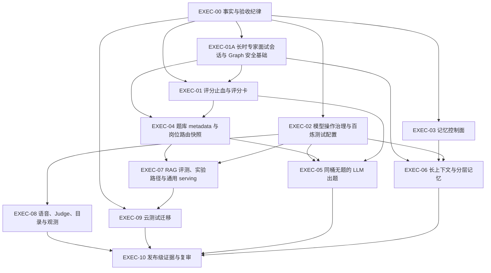

# 未闭环能力执行总清单

> 本文是后续整改的**执行顺序入口**。事实状态以 `architecture/current-runtime-truth.md` 为准；每个工作包的发现、实现、验证、关闭仍以 `production-readiness-remediation-register.md` 的四阶段纪律为准。
>
> 本文不授权云端写入、购买、密钥创建、生产开关变更或删除 Docker。任何此类动作仍需在对应工作包的规格、演练与人工确认完成后单独执行。

## 1. 使用规则

### 1.1 状态图例

| 标记 | 含义 | 不代表 |
| --- | --- | --- |
| `☐` | 未开始；不得绕过其前置条件 | 已设计或将来会做。 |
| `◐` | 有部分代码、合同或本地回执 | 真实生产路径、真实云验证或发布可用。 |
| `⛔` | 有明确环境、授权或设计阻断 | 可以用临时全局权限、固定共享库或假数据绕过。 |
| `◑` | 规格和局部合同已收敛，等待正确层级验证 | 已关闭。 |
| `☑` | 仅当登记册对应行完成独立复审后使用 | 单个 mock、静态扫描、本地 `releaseEvidence=false` 回执。 |

### 1.2 每个工作包的共同完成定义

只有同时满足以下条件，才能开始下一个依赖它的工作包：

1. 对应业务用例、接口、数据对象、状态机和失败语义已经冻结。
2. 迁移、代码和受控配置落在真实组合根，而不是只落在 smoke、demo、fixture 或导出函数。
3. 七类用例覆盖正常、异常、边界、逃逸通道、并发、恢复和对抗输入；涉及数据库、HTTP、浏览器或外部服务时使用相应层级的验证。**仅快乐路径绿 = 假绿**（硬闸 G2）。
4. 运行事实、验收文档、变更记录和外部表述同步，且不夸大本地/模拟回执。每步须 **CMD+EXIT / CI / 收据**（硬闸 G1；叙事 ≠ 证据）。
5. 上一项工作包没有遗留会扩大本项权限、数据外送、删除、评分或跨域检索风险的 P0/P1。
6. 评测用例 + 覆盖矩阵行（含 NEG / FAULT / ADV / PERF）**先于** E2E/prove 实现（硬闸 G3）；实现方不自批，执行前独立专家审（G4）。
7. `partial` / GAP / conn-only / honesty-pin ≠ covered（G5）；api/web/worker 须可复现压测，本地绿 ≠ 生产容量（G6）。

### 1.3 现在必须保持的禁止项

- [ ] 在 `SCOR-01…08` 完成校准前，不恢复 B 端候选数值排序、自动决策或可比较 overall score。
- [ ] 在 `MEM-00` 完成前，不写入全量自由对话、长期事实、记忆摘要或跨会话向量。
- [ ] 在 `INT-TRANSCRIPT-00`、`INT-TRANSCRIPT-01`、`INT-RESUME-02`、`SEC-GRAPH-01` 完成前，不把 checkpoint、短期 job payload、SSE 缓冲或浏览器内存称为“完整面试记录”“历史回放”或安全控制面；它们都不能代替可删除的业务事实。当前 raw answer 在 answer job 终态前仍是 payload 中的明文 JSON，不得称为 canonical artifact。
- [ ] 在 `INT-LONG-INTERVIEW-01`、`INT-LEVEL-01` 和 `SCOR-01…07` 完成前，不把现有有界面试图（覆盖/证据驱动、软预算可上调、绝对杀开关默认 120）称为一到两小时专家面试，也不按工作年限、单题高分或未校准 overall score 给出等级、排序或招聘结论。
- [ ] 在 `MODEL-OP-01…03` 完成前，不把一把百炼 Key 描述为统一网关、全局预算或所有 Agent 的安全授权根。
- [ ] 在 `RAG-FUNNEL-01…06` 完成前，不把相似度命中称作题域隔离，不允许“全库找不到就跨桶或联网生成”。
- [ ] 在 `CLOUD-TEST-01…05` 完成前，不删除 Docker 源码；固定 `meetwise_cloud_test` 只能承担零写入 smoke，不能承载迁移、RLS 或全量 E2E。项目负责人已要求迁移期间**不执行**本地 Docker 数据面路径：保留仅为历史兼容与 ECS 对照，不能成为验证替代。
- [ ] 在真实浏览器、真实 API、真实供应商链路未取得受控证据前，不将流式语音、云测试、RAG 评测或模型评测称为发布通过。
- [ ] **北星硬闸**（`north-star-hard-gates.md` G1–G7）：不宣称 HA / `releaseEvidence=true`；不把 happy-only 绿、conn-only、honesty-pin 写成 covered；后续 knife 缺 NEG+PERF 列不得合入；**G7 已生效**（门禁强制）— 刀绿/dual ≠ 成功；无 G7 全量收据禁止宣称 100% HA / 0 BUG；禁宣称 suite green。

### 1.4 北星硬闸（交付 SSOT 指针）

全文：`north-star-hard-gates.md`。本清单不重复展开。执行任何工作包前视为已冻结：

| # | 闸 | 本清单读法 |
|---|----|------------|
| G1 | 一切可核验 | 无 CMD+EXIT / CI / 收据 = 未执行；叙事 ≠ 证据 |
| G2 | 非快乐路径完整 E2E | 负/故障/边界/对抗须进 cases **且**执行；仅快乐绿 = 假绿 |
| G3 | 需求→评测/矩阵→实现 | 禁止先写绿再回填需求 |
| G4 | 执行前独立专家审 | 实现方不自批；关键切片双域对抗 |
| G5 | 禁假绿 | partial/GAP/conn-only/honesty-pin ≠ covered |
| G6 | 性能+负载 | api/web/worker 可复现压测；本地绿 ≠ 生产容量 |
| G7 | 本地全量套件验证关 | **已生效**（门禁强制；≠ 套件已绿）；验证关是成功唯一标准；刀绿/dual/prove ≠ 成功；无全量 CMD+EXIT 收据 → forbid 100% HA / 0 BUG / `releaseEvidence=true` |

钉：**releaseEvidence=false** · **≠HA** · 全量 E2E 零遗漏（目标）· **100% HA**（目标）· **0 BUG**（硬闸，须证据）。当前均 **未齐**，不得叙事已达成。**成功叙事挂 G7 全量收据**（G7 已生效 ≠ 收据齐，更不得勾 true）。

- [◐] Adaptive-life idempotency CI fix：`post_prove_dual_pass`（`mw-e2e-ha` + `mw-rag-route` independent pass; `pnpm adaptive-life:prove` EXIT=0; HEAD `21672ab`; `releaseEvidence=false`; ≠ suite green/R5/G6/HA）。详见 `harness/adaptive-life-idempotency-ci-fix.md`。

## 2. 执行顺序总览

```mermaid
flowchart TD
    S["EXEC-00 事实与验收纪律"] --> A["EXEC-01 评分止血与评分卡"]
    S --> B["EXEC-02 模型操作治理与百炼测试配置"]
    S --> C["EXEC-03 记忆控制面"]
    S --> K["EXEC-01A 长时专家面试会话与 Graph 安全基础"]
    K --> A
    K --> D["EXEC-04 题库 metadata 与岗位路由快照"]
    K --> F["EXEC-06 长上下文与分层记忆"]
    A --> D
    B --> E["EXEC-05 同桶无题的 LLM 出题"]
    D --> E
    A --> E
    C --> F["EXEC-06 长上下文与分层记忆"]
    B --> F
    D --> G["EXEC-07 RAG 评测、实验路径与通用 serving"]
    B --> G
    B --> H["EXEC-08 语音、Judge、目录与观测"]
    S --> I["EXEC-09 云测试迁移"]
    G --> I
    H --> J["EXEC-10 发布级证据与复审"]
    I --> J
    E --> J
    F --> J
```

| 阶段 | 工作包 | 当前状态 | 允许开始的前提 | 阶段出口 |
| --- | --- | --- | --- | --- |
| 0 | `EXEC-00` 事实、证据和验收纪律 | ◑ | 本文审阅通过 | 所有目标工作包都有唯一 ID、事实来源、依赖、验收和禁止项。 |
| 1 | `EXEC-01` 评分止血与 ScoreCard | ◐ | `INT-TRANSCRIPT-00/01` 完成前只允许止血与合同审计 | legacy 伪评分无法污染任何 C/B 投影；未校准评分不可排序。 |
| 1 | `EXEC-02` 模型操作治理与百炼测试配置 | ◐ | 无；真实配置动作另行确认 | 新模型操作能被预算、模型绑定、容量和失败语义约束。 |
| 1 | `EXEC-03` 记忆控制面 | ☐ | 无 | 记忆的授权、撤回、删除、重建和审计先于任何长期内容写入。 |
| 1 | `EXEC-01A` 长时专家面试会话与 Graph 安全基础 | ◐ | 无；涉及模型派发的子项还依赖 `EXEC-02` | 完整可恢复 transcript、冻结面试蓝图、动态能力校准和安全围栏都有独立业务真相，且不夸大为已上线。`INT-TRANSCRIPT-00` 仅有本地签发器/账本/合同，公开删除仍 503。 |
| 2 | `EXEC-04` QBank metadata 与自动岗位路由 | ☐ | `SCOR-00` 与 score-excluded/B 端暂停边界已冻结；不依赖未实现的 ScoreCard | 标签先于 embedding，面试读取 immutable route snapshot，检索全读面同桶。 |
| 3 | `EXEC-05` 同桶无题 LLM fallback | ☐ | `SCOR-01/02/07`、`MODEL-OP-00/01`、`EXEC-04` | 仅 clean miss 可一次出题，生成题不会污染题库或未校准评分。 |
| 3 | `EXEC-06` 长上下文和分层记忆 | ☐ | `MODEL-OP-00/01`、`EXEC-03` | 可验证 budget、冻结 snapshot、分层 recall 和完整删除传播。 |
| 4 | `EXEC-07` RAG 评测、实验清理与通用 serving | ☐ | `EXEC-02`；QBank 相关项还依赖 `EXEC-04` | 每个“生产”评测走真实组合根；通用 RAG 只有接 serving 才可称服务。 |
| 4 | `EXEC-08` 语音、Judge、catalog 与观测 | ☐ | `EXEC-02` | 目标能力进入真实组合根并有相应数据面验收。 |
| 5 | `EXEC-09` 云测试迁移 | ◐ | 项目独占目标与恢复设计已批准 | 云 runner 可恢复、精确清理；Docker 仅在同等覆盖连续通过后退场。 |
| 6 | `EXEC-10` 发布级证据与独立复审 | ☐ | 前序目标范围内工作包均为 `已验证` | 独立复审、真实环境回执、告警/回滚演练和对外表述一致。 |

## 3. 阶段 0：事实与验收纪律

### EXEC-00 · 统一任务卡与变更纪律

| 项目 | 内容 |
| --- | --- |
| 对应登记 | 全部 `PRD-TEST-001…018`；全部 `MEM-*`、`MODEL-OP-*`、`RAG-FUNNEL-*`、`SCOR-*`、`CLOUD-TEST-*`。 |
| 交付 | 每次实施前创建临时 Task Harness，写明来源、非目标、对象、状态机、接口、数据库、部署、七类验收和命令。 |
| 禁止 | 以“文档已写”“mock 通过”“已有 Key”“固定测试库可连通”替代数据面或运行时验收。 |
| 验收 | `pnpm docs:check`、`pnpm public-text-policy:prove`、`pnpm quality:traceability:prove`、`pnpm quality:governance:check`、`git diff --check`。 |

执行清单：

- [ ] 每个新实施 PR 只取一个工作包或一个明确、可独立验收的子项。
- [ ] 所有开关默认 fail-closed；未配置、未知、撤权、账本不一致和恢复不确定均不能悄悄回退到外送或全库读取。
- [ ] 每次更新 `current-runtime-truth.md` 和对应用例，删除“生产”“E2E”“已验证”等过度表述。
- [ ] 外部链接、外部项目名、路径或实例细节不进入受管公开文档；配置例外必须由公共文本策略显式处理。
- [ ] `PUBLIC-PREVIEW-DIRECTORY-01`：Pages 只发布仓库 `docs/` 静态项目展示（由 `.github/workflows/pages.yml` 在 `main` 复制 `docs/` + 合成截图；仅面试练习，招聘不在本预览范围），目录没有 API、IP、端口、数据服务、秘密或运行时跳转输入，也没有求职者/面试官双角色导航。默认分支与最低 Pages 权限是唯一发布来源。旧 `preview-site/` 签名目录已删除，不得复活为 ECS 入口开关。`TC-public-preview-directory-01-main/E1…E6` 为 planned/unmapped，静态 proof 不是部署或 ECS 证据。
- [◐] `PUBLIC-PREVIEW-WRITE-GATE-01`：公开预览 API 放行 `GET`、`HEAD`、`OPTIONS`，并额外放行受控 `POST /interview/:id/answers`（预览账本，见 `INT-TRANSCRIPT-PREVIEW-SUBMIT`）。其余方法在 NestJS(Fastify) `onRequest` 前置门固定 `503 public_preview_read_only`。其它面试/评分写面仍有服务层 `assertPublicPreviewWritesClosed`；`/answers` 用 `assertPublicPreviewControlledWriteAllowed`（非预览 404）。清单见 `ai-docs/architecture/backend/public-preview-write-inventory.json`。本地命令 `pnpm public-preview-write:inventory`、`pnpm public-preview-write:prove`、`pnpm public-preview-write-gate:prove`、`pnpm -C apps/web prove:middleware` 已接线，回执必须保持 `releaseEvidence=false`。该项的 `TC-public-preview-01-main/E1…E6` 仍是 planned/unmapped；Web 公开展示站仍只读。不得把本地清单或 inject proof 标成已关闭，也不等于预览 worker 已停。
- [ ] `PENDING-PRD-EVAL-01`：为离线评测提升建立正式需求和 oracle。当前 traceability 对既有 leaf 的映射、稳定性样本及图/语音 oracle 均不足以支持质量发布；在冻结真实样本、分母、阈值、人工标注、失败处置和提升接收器前，任何离线 eval 只提供研究信号。
- [◐] `WORKER-DISPATCH-001`：源码已将面试、押题、诊断和报告从固定 1.5/2 秒主路径轮询改为 PostgreSQL 提交后静态 `wake`，并保留不超过 5 秒的 reconciliation；本地 listener/DrainLoop 合同已通过。作业表/claim/lease/RLS 仍为真相。尚缺隔离 PostgreSQL rollback、20 路并发、多副本、重连与真实 trigger/RLS 验收；本机 Docker 存储空间不足时保持 `releaseEvidence=false`，不得删除 reaper 或宣称端到端低延迟。
- [◐] `WORKER-DISPATCH-002`：面试队列已接线 owner 轮转（每次启动至多一个 drainOnce；`globalInflight>1` 时多 owner 可重叠）、每 owner 数据库**未过期** running cap（默认 1，跨副本计数）、进程内 `WORKER_INTERVIEW_GLOBAL_INFLIGHT`（默认 4）、`idle`/`retry` 轮转语义、切片隔离、reap 失败则该 owner 本拍不 drain、每拍 32 次 launch cap。同面试保序与 lease CAS 仍在领取 SQL；`markDone` CAS=0 对调度层不是成功。押题/诊断/报告仍抽干单个 owner（`HC-GAP-002` 已用 `pnpm owner-drain-order:unit:prove` 诚实证明顺序为 `A,A,A,B`，不是轮转）；进程内 global cap 不是集群锁；`HC-GAP-001` 已关闭：失败关闭门（`pnpm interview-dispatch:gate:prove`，per-push CI）+ 可选远程 `prove` + 远程成功时的回执写入路径登记。远程 SQL 证明仍 `releaseEvidence=false`，禁止改起本地 Docker 库，**不在** per-push CI，本环境无通过回执。未完成跨副本硬 cap、其余队列公平和发布级延迟测量前，不把即时 wakeup 宣称为繁忙状态的端到端延迟或容量保证。交叉面（SKIP LOCKED、SSE 槽、模型槽、`0130` claim-join）的证明缺口见 `architecture/backend/high-concurrency-review.md`。`HC-GAP-006`（押题/诊断非法 `Last-Event-ID` → HTTP 400）已由 `pnpm api:validate` 关闭，不是容量 SLO，也不关闭 `HC-GAP-007`。`HC-GAP-014` 已在 `main`（#90）。`HC-GAP-011`（孤儿 permit / 两连接无行具名用例）已挂进 `pnpm runtime:prove`，只关那一项。
- [x] `GOV-RECOVERY-01`（仅静态治理）：已以 append-only successor 登记云、记忆、模型路由和 RAG 漏斗的 113 个 `planned/unmapped` leaf，并修正云 group/占位符与 RAG 缩写 leaf 的盘点；随后登记 worker 事件唤醒的 7 个与长时专家面试的 35 个计划 leaf。冻结基线为 1,699 个历史未映射 leaf，当前 worktree inventory 为 1,854，且这些新增项均显式为 planned/unmapped、尚未提升为 required binding，不能伪称已覆盖。`quality:governance`、`quality:traceability` 和文档门只提供 `releaseEvidence=false` 的静态一致性；首次 bootstrap 与真实 base/head append-only 守卫仍须在提交后的受信 CI 执行，不能据此关闭任何业务 TC 或发布门。

## 4. 阶段 1：先封住评分、模型和记忆的基础风险

### EXEC-01A · 长时专家面试会话、水平校准与 Graph 安全基础

| 字段 | 内容 |
| --- | --- |
| 对应登记 | `INT-TRANSCRIPT-00`、`INT-TRANSCRIPT-01`、`INT-RESUME-02`、`INT-LEVEL-SIGNAL-01`、`INT-LEVEL-01`、`INT-LONG-INTERVIEW-01`、`SEC-GRAPH-01`；控制信号地基见 `requirements/use-cases/interview-control-signals.md`，完整长时用例见 `requirements/use-cases/expert-long-interview-runtime.md`。 |
| 当前状态 | `INT-TRANSCRIPT-00` 为 ◐：独立 `PrivacyAuthorizationIssuer`、0091 target/receipt 账本与 submission/receipt 合同已在源码落地；issue 按调用方字段落账（不做 JWS 验签），worker 仍走 0077，公开删除仍 503。树上另有 0092/0096 rehearsal。预览版可将 `/answers` 接到 `submitInterviewAnswer`（`INT-TRANSCRIPT-PREVIEW-SUBMIT`），非预览 404，不是 01 生产 write。七类 TC 仍为 planned/unmapped，无部署密钥、无真实组合根回执（`releaseEvidence=false`）。`INT-TRANSCRIPT-01` 及后续项仍 blocked。当前自适应图以有界当前题答为主；长度由 `decideNext` 按覆盖/证据/弱答/空转/加深决定，软预算可上调，绝对杀开关默认 120 只防 runaway（见 `UC-INT-LENGTH-01`）。`observeInterviewSignals` 可提前 `early_weak`/`thrashing`（见 `INT-LEVEL-SIGNAL-01`），不改写 `maxTurns`。这仍不是 60/90/120 分钟 blueprint。checkpoint 只足以恢复 pending graph 工作，legacy `/turn` raw answer 在 answer job 终态前仍为明文 payload，SSE/client 状态不构成历史面试账本。 |
| 目标 | 让一到两小时专家面试拥有可删除、可分页回放的用户可见 transcript；以冻结 blueprint、route 与 rubric 约束长期流程；以证据而非工作年限校准能力；把授权、注入防护、RAG/memory 边界和输出投影复核接入每个敏感边界。 |
| 依赖 | `INT-TRANSCRIPT-00` 的独立 `PrivacyAuthorizationIssuer`（不得复用 `AUTH_SECRET`、runtime SQL、worker/deleter 或 GUC 身份根）、不可伪造删除授权、target/sink receipt 与 submission/receipt **合同冻结**是 01 的 P0 前置。00 不授权 01 生产写入；树上 0092/0096 rehearsal 表/函数与预览 `/answers` 都不是公开 01 write route，也不把 rehearsal purge 称为删除已闭环。只有 01 的公开 schema/target resolver/deletion ledger/逐 sink receipt 和删后 read=0 在同一迁移、同一真实组合根证明后，真实用户 write route 才能启用；此前一律 disabled。评分合同依赖 `EXEC-01`；模型外送/压缩/分类的 operation 依赖 `EXEC-02`；长期跨会话记忆依赖 `EXEC-03` 与 `EXEC-06`；题库 scope 依赖 `EXEC-04`。01 首包禁止模型、RAG/Web、评分、报告和 memory 副作用。 |

执行清单：

- [◐] `INT-TRANSCRIPT-00`：独立 `PrivacyAuthorizationIssuer`（ECDSA P-256 / ES256，`iss=meetwise-privacy-authz-v1`）与 0091 `privacy_authorization_snapshot` / `privacy_deletion_receipt`、受约束 claim、no-forge-completed guard 已在源码落地；signer/verifier 与 `AUTH_SECRET`、runtime SQL、worker/deleter、GUC 身份根分离。`0091` issue 按调用方字段落账，本身不做 JWS 验签；privacy worker 仍走 `0077`，HTTP 未接线。submission/receipt 合同已冻结且不进 OpenAPI。公开 `DELETE /privacy/interview-data/:id` 仍 503。**UC-052 内部授权擦除第一刀**（`pnpm uc052:internal-erasure:prove` tip `3c4847a` · EOR dual `08d54f8`/`3e39c1e` · status `post_prove_dual_pass`）→ 矩阵 **UC-052 deletion=partial** · **≠ covered** · **≠** INT-TRANSCRIPT-01 / controlPlaneClosed · externals 仍 `retention_pending` · checkpoint physical purge nailed（`GAP-PRIV-CHECKPOINT-FENCE-ONLY` CLOSED · prove `69de818` · dual `118e28f`/`2e743b2` · **≠ covered**）。 pool-role-leak nailed（`GAP-UC052-POOL-ROLE-LEAK` **CLOSED** · `post_prove_dual_pass` · product path `SET ROLE NONE` on pool release + clear the 3 GUCs + destroy the connection if reset throws · not `RESET ROLE` · not `DISCARD ALL` · prove `9b39a20` range-diff-equal code `ab96a02` · receipts `522590d` · dual `49ef158`/`7cb7010` · **≠ covered**）。 `NOTE-CKPT-UNSEALED-CLAIM-NEG` **CLOSED** by this knife inside `uc052:checkpoint-physical:prove`（NULL epoch, NULL digest, both, plus sealed control · SQLSTATE 42501 · do not double-count · Line F REQUEST `a1a06ab` must not be coded as a second implementation）。 `GAP-PRIV-AUTHZ-PROVE-FLAKE` stays **OPEN** · mitigated/cause-unknown（cold#5 ECONNREFUSED 127.0.0.1:33047 state_bytes=29 · warm#2 SQLSTATE 23505 `interview_pkey` not ECONNREFUSED · review `49ef158` agrees with `warm-2.log` / `cold-5.log` · v2 @`3d0c71e` cold_v2 10/10 EXIT 0 · warm_v2 10/10 EXIT 0）。 Pins retained: haStatus=NOT_HA · releaseEvidence=false · claimProductionHA=false · gR45Closed=true · coveredCount **8** · ms3EqualsR4Closed=false · PG-retained · public DELETE=503。`0129` 预览版 `POST /privacy/erasure-preview` 可盘点 sink 并链接 0096/0125 begin，回执固定未完成、`releaseEvidence=false`，不是 issuer 生产删除。树上已有 0092 rehearsal 表/函数与 0096 event/report/`ai_graph_run` rehearsal resolver。预览版可将 HTTP `POST /interview/:id/answers` 接到 `submitInterviewAnswer`（`INT-TRANSCRIPT-PREVIEW-SUBMIT`）；非预览该路径 404，OpenAPI 不登记。这**不**授权 `INT-TRANSCRIPT-01` 生产 cutover，也不把 rehearsal purge 或预览删除回执称为公开删除已闭环。七类 TC 仍 planned/unmapped；账本 HTTP 证明须远程 Postgres 环境变量，禁止 `pnpm db:up`，无回执时 `releaseEvidence=false`。无 receipt、无组合根滥用证明前不得声称删除完成，也不得勾“已关闭”。现有 legacy `/turn` 仍写 plaintext job payload，必须如实保留为 `INT-P0-RAW-QUEUE`，不可被文字误称为已停用。`PUBLIC-PREVIEW-WRITE-GATE-01` 在预览下仍拒绝 `/turn`，并允许上述受控账本写；`MEETWISE_PUBLIC_PREVIEW=1` 下 `POST /privacy/erasure-preview` 仍 503。
- [◐] `INT-ANSWER-DUAL-WRITE-FENCE`（不是 01）：迁移 `0126` 已在 main。答题双写互斥 + 事件禁原文。`/turn` 在无 ledger 时仍写明文 `interview_job.payload`；预览 `/answers` 走 ledger 侧并受该围栏约束，仍不是生产 01 HTTP。`INT-TRANSCRIPT-01` 保持 blocked。`0127`/`0128`/`0129`/`0130` 已在 main；本围栏不改号、不占用 0131。盘点与后续切换顺序见 `architecture/backend/interview-answer-dual-write-cutover.md`；用例 `UC-INT-ANSWER-DUAL-WRITE-FENCE`；证明 `pnpm int-answer-dual-write-fence:prove`（远程 Postgres，禁止 `db:up`，`releaseEvidence=false`）。
- [◐] `INT-TRANSCRIPT-PREVIEW-SUBMIT`：预览路径把 `POST /interview/:id/answers` 接到既有 `submitInterviewAnswer`（0092 rehearsal 账本）。仅 `MEETWISE_PUBLIC_PREVIEW=1` 可写；非预览 404。不入 `apiContract`，不写 plaintext `/turn` job，不宣称 01 生产 cutover。受已落地的 `0126` 互斥约束。`0127` OCR binding / `0128` dispatch fairness 已在 main；公开预览下 OCR 组合根仍关。`0129` 预览删除是另一条账本，公开预览下仍 503。`0130` / `INT-LEVEL-SIGNAL-01` 已在 main，不改本写面。`#79` 预览批量语音（`/transcribe` `/speak`）仍走入站 503，不进本受控写 allowlist。`#83` Web `/resume` 预览图片入口是另一条 OCR 预览面，不改本写面。`#67` Bailian/native fail-closed 不发明题面，不改本写面。本项不新增迁移、不占用 0131。本地 inject/清单门已接线；账本 HTTP 证明须远程 Postgres 环境变量，禁止 `pnpm db:up`，无回执时 `releaseEvidence=false`。
- [ ] `INT-TRANSCRIPT-01`：真实用户 canonical 写入有两个不可拆分的 release gate：先由 00 验证授权/删除合同；再由**同一部署迁移**安装 artifact/draft/submission/item/ref-only-job/view 的 target resolver、deletion ledger、逐 sink receipt 与删后 read=0，并以真实 HTTP/SSE/RLS 组合根证明。两个 gate 任一缺失时仅允许非用户数据的 test-only rehearsal，所有真实 **01 canonical** raw-answer write route 保持 disabled。现有 legacy `/turn` 不是 01 的实现或回退路径；`0126` 已提供对向互斥围栏（见上条），启用 01 前仍须按切换图切断明文 payload，避免两条路径写同一答题事实。冻结 `InterviewAnswerArtifact`、`InterviewAnswerDraft`、`InterviewAnswerSubmission`、`InterviewTranscriptItem` 与 `InterviewViewSnapshot`。接受事务只写加密 canonical artifact、submission receipt、item、ref-only job 和 `visibleSeq`；同 key/同体回放、同 key/异体冲突、同题双 tab 一 winner。禁止把原始 answer、内部 prompt、模型 chain-of-thought、tool payload 或 token 流写入 checkpoint/job JSON/SSE/log/trace；首包模型、RAG/Web、评分、报告、memory 和 B 端投影均为 0。
- [ ] `INT-RESUME-02`：在 01 通过后重新对抗审查浏览器重登、worker 生命周期和用户体验；使用已冻结的 `InterviewViewSnapshot(highWatermark)` + event cursor + transcript pagination。页面先读同一版本 snapshot，再从 high watermark 订阅 SSE tail，按稳定 item/event ID 去重。双标签、提交响应丢失、浏览器关闭、worker takeover、历史 raw answer 已被清理和 privacy fence 都必须有明确回放或“不可恢复”语义，绝不伪造内容。
- [◐] `INT-LEVEL-SIGNAL-01`（控制流地基，**不是** `INT-LEVEL-01`）：`observeInterviewSignals` + `decideNext` 可因持续弱/震荡提前 `early_weak` / `thrashing`；图 `concludeReason` 为 provenance hook。信号不改写 `maxTurns`；绝对杀开关先赢；不冻结产品轮次上限。用例见 `requirements/use-cases/interview-control-signals.md`。本地证明：`pnpm adaptive-signals:prove` + `pnpm adaptive-signals-graph:prove`（`releaseEvidence=false`；不证明能力等级、B 端 band、ScoreCard）。不关闭本条下方的 `INT-LEVEL-01`，不产出 band。SSE 预览见下条。
- [◐] `INT-LEVEL-SIGNAL-SSE-01`（预览投影，**不是** `INT-LEVEL-01`）：图 `concludeReason` 为 `early_weak`/`thrashing` 时，worker 经既有 `appendEvent` 追加 `session_concluded`。不发明分数，不写 band，不是招聘结论。用例见 `requirements/use-cases/interview-signal-sse.md`。本地证明：`pnpm signal-sse:prove` + `pnpm signal-sse-contract:prove` + `pnpm signal-sse-worker:prove` + `pnpm web:prove`（假 append / 纯函数，无 Docker DB；`releaseEvidence=false`）。不关闭下方 `INT-LEVEL-01`。
- [ ] `INT-LEVEL-01`：将简历年限/经历作为 non-binding `InitialLevelHypothesis`，按 `CompetencyLevelAssessment`、跨题 evidence、rubric/难度合同和不确定度不断上调、下调或标记 `insufficient_evidence`。初级候选人可以被 promotion probe 检出高级能力；声明高级但证据不足不能自动获得高级结论。不得使用年龄、性别、学校、地域等代理变量。`INT-LEVEL-SIGNAL-01` 的终止 hook 与 `INT-LEVEL-SIGNAL-SSE-01` 的事件露出 **都不是**本项。
- [ ] `INT-LONG-INTERVIEW-01`：以不可变 `InterviewBlueprintSnapshot` 固定时长、模块、能力覆盖、route allocation、最大题数、每模块最少有效证据、版本和终止策略；终止要从 time + module coverage + evidence 判定。短流程已不再用固定轮数硬顶（`UC-INT-LENGTH-01`：软预算 + 绝对杀开关默认 120），**把数字从 8 调到 16 或把杀开关调到 120 都不等于本项完成**。
- [ ] `SEC-GRAPH-01`：将 `AuthorizationSnapshot`、`ContextSnapshot`、`SecurityDecision`、route/blueprint refs 与 `OutputProjectionPermit` 做成边界承重对象；授权/撤权/epoch、input/RAG/web 注入、memory poison、schema/evidence/业务投影校验必须在读取、模型派发和写入前重验。LLM 只能提议内容，不能决定权限、scope、删除、终止或业务状态。
- [ ] `INT-RUNTIME-TEST-01`：对以上对象进行七类验收：重复提交、双 worker/CAS、跨 owner/tenant=0、断线/崩溃/删除竞态、20+ turn 与 60/90/120 分钟 blueprint、提示词/RAG/memory 注入、路由/rubric 版本漂移及 unknown model attempt。真实浏览器和真实供应商证据另按 `EXEC-10` 取得。

阶段出口：用户重新进入同一面试时能够看到**当时被允许保留**的完整用户可见记录、当前 pending/draft 和后续 SSE；长时蓝图可解释为何继续、转模块、请求澄清或结束；任何安全、删除、路由或评分围栏失效时不读取、不外送、不投影。

### EXEC-01 · 评分止血与版本化 ScoreCard

| 字段 | 内容 |
| --- | --- |
| 对应登记 | `PRD-TEST-001`、`PRD-TEST-015`、`SCOR-00…08`；人工复核为待立项的 `PENDING-PRD-REVIEW-01`。 |
| 当前状态 | `PRD-TEST-001 / SCOR-00` 已在本地完整迁移组合根验证：legacy `/answer` 固定拒绝，真实 HTTP proof 覆盖活动 C/B 面试、重放、并发与跨主体调用，HTTP app 使用独立 provision 的低权 runtime login，所有受检副作用增量为 0。`SCOR-00H` 已接线消费面诚实闸（域+转写/`POST` 评估/`POST` career/SSE），空评估与无 identity 不得伪造 0。域 `refuseMappedBSideScore` 恒失败，**未改** worker eligible 与 `markApplicationNoEligibleScore`；`GET assessment`/`GET career-path`/`GET /profile/growth`/`GET report` 不重跑闸。两份回执均为 `releaseEvidence=false`，只证明旁路止血与消费诚实，不是评分闭环；`PRD-TEST-015` 的评分卡与校准尚未实施。 |
| 目标 | 评分只从冻结的题目、回答、rubric、证据和版本合同产生；覆盖不足或不确定时返回 `insufficient_evidence` / `review_required`，不伪造可比较数值。 |
| 依赖 | `SCOR-00` 已止血；`SCOR-01/02` 的生产实现明确依赖 `INT-TRANSCRIPT-00/01` 的 canonical artifact、删除授权、逐 sink receipt 与删后 read=0 的真实组合根证明。必须先于 LLM 生成题、B 端排序、候选比较和校准宣称。 |

执行清单：

- [x] `SCOR-00`（本地组合根）：`pnpm scor-00:http:prove` 已在完整 87 个迁移的隔离 PostgreSQL 中，以独立 provision 的低权 runtime login 启动真实 HTTP app；活动 C/B 面试、重放、并发、伪造 body 与跨主体 `/answer` 均返回 `410`，两个调用主体的消费、event、job、report、assessment、application status/score 增量均为 0，合法 `/turn` 仍可受理。回执为 `releaseEvidence=false`，不关闭 `SCOR-01…08` 或 B 端校准门。
- [x] `SCOR-00H`（消费面诚实闸接线，非关闭）：`packages/domain/src/scoring-honesty.ts` + 转写/`POST` 评估/`POST` career/SSE；空评估与无 identity/answer claim 不得伪造 0。`pnpm scor-00-honesty:prove` / `pnpm web:prove`（非隔离 HTTP）。未改 worker eligible、`markApplicationNoEligibleScore`、`GET`/`growth`/`report`/`learning-plan` 重闸、`listScorableScoreCards` 的 `b_review_eligible`。`releaseEvidence=false`。阶段出口未达。
- [◐] `SCOR-00` 消费诚实（内部预览 UI，不是招聘方产品面）：`/recruiter/how-it-works` 与 `/recruiter/jobs/:id/applications/:applicationId` 已接线；列表/申请状态页/C 端「我的投递」不再渲染申请数字分。这是只读消费门，`releaseEvidence=false`，不关闭校准、人工复核工单或 B 端用途。详见 `requirements/use-cases/bend-recruiter-architecture-surface.md`。
- [ ] `SCOR-01`：在 `INT-TRANSCRIPT-00/01` 通过后冻结两阶段评分事实：issue 阶段 `IssuedQuestionContract` 只含题目/rubric/route/cohort/policy/privacy，**不含未来 answer**；提交后以 canonical artifact 追加 `AnswerVersion/ScoreRequest`、answer HMAC 和 delete-wins permit。
- [ ] `SCOR-02`：与专用 score-writer/verifier 一起原子切换 C 端 assessment/report/profile/memory 等全部消费者；只消费资格化 ScoreCard，legacy event 均分、无 rubric、生成题与未校准卡一律 unavailable/score_excluded。确定性 coverage gate 与聚合不得混合不同难度/题型路径。
- [ ] `SCOR-07`：在所有消费面先实施 B 端用途硬门；无 calibration/review 的分数不能影响申请、列表、人才库、通知或导出。
- [ ] `SCOR-03`：在 `MODEL-OP-01` 后接入 criterion ID、level/score、evidence span/hash、relevance、uncertainty/review flag；服务端验证 span、rubric 与权重。
- [ ] `SCOR-04`：在 `MODEL-OP-01` 后建立独立评分 operation、attempt、预算与 unknown 语义；低置信、模型切换、repair、generated question 全部进入 `review_required` 或 `score_excluded`。
- [ ] `SCOR-05`：冻结金标、双盲人工标注、难度/锚题与 cohort 稳定性评测；校准 release 不通过则不出 B 端 comparable score。
- [ ] `PENDING-PRD-REVIEW-01`：按人工复核架构立项并实现 `ManualReview`、证据 snapshot、assignment lease、append-only decision、effect outbox、审核员 RLS/access audit 与申诉 E2E；产品/法务的角色、保留期、四眼阈值未定前，不开放招聘 beta 或“合规人工复核”宣称。
- [ ] `SCOR-06`：以双盲、仲裁、申诉和人工复核为基础完成 calibration release；没有数据时状态保持 `inconclusive`。
- [ ] `SCOR-08`：用真实组合根验证状态、并发、unknown、删除和落库；只在校准、复核、申诉、模型漂移监控完整后讨论恢复 B 端辅助显示。

阶段出口：B 端不再读取不合格事件；未完成评分卡只可给候选解释或人工复核，不能影响排名、推荐或自动结果。

### EXEC-02 · 模型操作治理与百炼非生产配置

| 字段 | 内容 |
| --- | --- |
| 对应登记 | `PRD-TEST-014`、`MODEL-OP-00…04`、`BAILIAN-00…07`、`PRD-TEST-009`。 |
| 当前状态 | `MODEL-OP-00` 为 **部分实现**：文本路径已有冻结 `max_tokens`、局部预算与 price revision 绑定。`0088` 状态机 + `pnpm model-op00:prove` 已于 2026-08-16 独立复审关闭 DB-state；六个文本面 + `resume.ocr.v1` 走 registry node identity。catalog 仍未在 `invoke()` 主链，tokenizer 因子未回派发，故 `MODEL-OP-00` 整体未关。`MODEL-OP-01` OCR 窄切片已接线（typed binding + 密封 provenance/身份封印 + 面试 fail-closed，`pnpm model-op01:prove`）；ASR/TTS/embedding/rerank 仍直连适配器，broad DashScope native secret 仍在。预览双旗可走通 OCR invoke（非生产 SLO）；生产 `OCR_ENABLED`/`OCR_PREVIEW` 在 production+enforce 下仍关（binding 存在也不开）。原生 URL 为固定 Beijing profile（`BAILIAN-04` 静态局部）。**`UC-MODEL-ROUTE-04` 出题/原生响应 fail-closed 已本地接线**（缺 Key/超时/畸形不再发明题面或空转写；registry `fallbackAction=generation_unavailable`；lifecycle 发 `interview_unavailable`+provenance）。本地证明不构成百炼 smoke、不关闭 `BAILIAN-00…07` / `MODEL-OP-01…04`。所有回执 `releaseEvidence=false`。 |
| 目标 | 每个逻辑节点按 operation 而非临时环境变量选模型，预先确定上限、费用、备用、失败语义和可外送的数据类别。 |
| 依赖 | 无；是新增模型节点、RAG 生成、记忆压缩、语音和真实评测的共同前置。 |

执行清单：

- [ ] `BAILIAN-00`：核验项目专用非生产空间、区域、费用边界、用途和负责人；默认测试空间 Key 不等同该空间隔离，不得把 Key 写入仓库、聊天、日志或 CI。
- [ ] `BAILIAN-01`：核对每个候选模型的可用性、区域、计量单位、价格 revision 和上下文窗口；未获授权的 operation 维持 fail-closed。
- [ ] `BAILIAN-02`：设置测试总额、单日/单 run 上限和消费告警；未知价格、窗口或额度不得 dispatch。
- [ ] `BAILIAN-03`：将一次性测试 Key 只保存在受控 secret/钥匙串；验证 API/Worker、CI、镜像、日志、回执和受管文档均不存在该 Key。
- [ ] `BAILIAN-04`：选择并验证规范 endpoint、TLS 与区域；普通 API/Worker 不可用环境变量任意覆盖 endpoint/key，拒绝 URL query、片段和任意备用 URL。
- [ ] `BAILIAN-05`：每个 operation 使用非敏感、脱敏、最小次数的 controlled smoke；回执只存 HMAC/版本/用量/状态，不存 key、prompt 或用户数据。
- [ ] `BAILIAN-06`：视觉、embedding、ASR、TTS 和流式能力逐项拥有数据上限、取消、费用与隐私 smoke；未获准项维持关闭。原生适配器缺 Key/超时/畸形 body 的本地 fail-closed 已接线（`pnpm native-fail-closed:prove`），**不是**本项的真实能力 smoke。
- [◐] `UC-MODEL-ROUTE-04`：出题缺 Key/超时/畸形/critique 失败禁止发明题面；原生 ASR/TTS/embedding/rerank 禁止发明转写/向量/排序。本地 `question-generation-fail-closed:prove` / `native-fail-closed:prove` / `adaptive-graph:prove`。不关闭 `MODEL-OP-01`，不加 CI/CD，不接真实 Key。
- [ ] `BAILIAN-07`：完成定期健康、密钥轮换、额度演练、供应商异常和成本告警 runbook。
- [x] `MODEL-OP-00-DB-STATE-001`：先撤销 invocation 直写或建立 `BEFORE INSERT OR UPDATE` 完整状态机；direct `INSERT dispatching`、非法 terminal transition、派发后 identity mutation 和 reservation mismatch 必须由真实低权 SQL 拒绝。随后实现原子 header upsert、冻结 reservation binding，并证明 20 same/different-key 并发正例恰为 1、反例均为 0。✅ **已关闭（2026-08-16 独立复审）**：`pnpm model-op00:prove` 在隔离 PostgreSQL 跑绿（89 迁移、exit 0、`releaseEvidence=false`），回执 sha256 与审计的 proof/0088 文件完全一致；direct INSERT/非法 terminal/identity mutation/reservation mismatch 均由真实低权 SQL（`SET LOCAL ROLE app_role`）拒绝，20 same-key→1 execute、20 diff-key→1 execute+19 deterministic mismatch。
- [◐] `MODEL-OP-00`：在 DB state P0 后继续完成类型化 component ledger、tokenizer/usage 校准与服务端 registry node identity。新增/遗留调用面都必须使用该身份；不同价格 policy 的 backup 只能按明确 pre-dispatch 选择语义运行，已派发 unknown 不自动重试。✅ **DB-state 已关**（见上）。✅ **registry node identity 已切**（2026-08-16：scoring/quiz/diagnosis/report/plan/question 六个文本调用面从 caller 直传 `logicalNodeKey` 改为 `operation`；`resume.ocr.v1` 随后由 MODEL-OP-01 窄切片切到同一 registry 身份 + typed binding。model-op00/interview/quiz/diagnosis/report 五 gate 绿；独立审计 PASS 并修掉 `isRegistryLogicalNodeKey` 对含冒号 businessRevision 的误判 + 补 `quiz:prove`/`report:prove` 覆盖）。✅ **类型化 component ledger**：首版误做成镜像 model-op registry 的静态 catalog（`component-ledger.ts`）已撤；正确做法是**扩展现有预算器** `planContextBudget`/`ContextBudgetPlan`：把渲染输入按组件分账（system/数据围栏/schema reserve/tool reserve/RAG 独立分账；snapshot·recent·summary 属 L5 未接线，不空占位），并把 `toolReserve` 补进 `availableInput = contextWindow − maxOutput − toolReserve − safetyMargin`。`prove:component-ledger` 11 断言绿。◐ **tokenizer/usage 对账校准**：estimate 穿线（`prove:estimate-threading-invoke` 落库配对 + 低估 flag）+ 纯版本化校准模块（`prove:usage-reconciliation`）已建。**2026-08-17 收尾（独立审计 PASS 可合）**：① estimate 全 outcome 落库已修（P1，`ai_model_invocation` 补 `estimate_input_tokens` 列 + claim 时写，迁移 0119，解校验失败样本偏置）② 域级异步 reconciler 接线（P2，`reconcileUsageCalibration` 复用 `reconcileUsage`、持久化版本化 `CalibratedFactor`，28 断言）③ 因子读面浮出（`resolveLatestCalibratedFactor`/`toCalibratedFactor` 双校验 fail-closed）。**显式 defer（不在本收尾范围，勿读成端到端闭环）**：因子应用回派发（caller 需自调传预算层，`planDispatchBudget` 未接派发主链）+ 真实 worker loop 调度（`reconcileUsageCalibration` 未注册进 `apps/worker`）。✅ **backup 价格 policy 语义**（`prove:failover-price-policy` 8/8 绿：pre-dispatch 选路绑定 backup policy、已派发 unknown 不自动重试、半开重选 cost policy 漂移护栏）。
- [◐] `MODEL-OP-01`：为 chat、vision/OCR、embedding build/query、rerank、ASR、stream-ASR、TTS、stream-TTS、signed download 建 typed operation binding；未知字段、raw prompt/provider URL 均拒绝。◐ **OCR 窄切片已接线（非子项关闭、非整项关闭）**：`bindResumeOcr` / `visionOcr` 在 invoke 前解析冻结 `resume.ocr.v1` **身份封印**（非出站 host pin）；成功转写封存 `SealedOcrProvenance`；`resume_profile.ocr_binding`（迁移 0127）供面试 `admitInterviewResume` 消费（读 profile，不解密）；图片源缺 binding → 画像不可用且零视觉外呼；`pnpm model-op01:prove` 为本地静态门。预览双旗 `OCR_ENABLED=1`+`OCR_PREVIEW=1` 打开组合根派发；`bindResumeOcr`/`visionOcr`/`admitInterviewResume` 已接线（失败不编造）。`model-op01:prove` 是本地静态+stub fetch，不是 HTTP 上传 E2E 或视觉 SLO。生产/enforce/公开只读预览仍拒绝组合根。☐ ASR/TTS/embedding/rerank/signed-download 适配器仍 unwired；☐ 媒体预算/删除/脱敏视觉回执未做；不得把本切片写成 MODEL-OP-01 关闭或发布证据。
- [ ] `MODEL-OP-02`：接共享 provider account + region + model + tenant/project + operation 准入、费用账本、并发和 breaker；不再让各适配器各自限流。
- [ ] `MODEL-OP-03`：落地节点矩阵：确定性节点零 LLM；分类、抽取、压缩使用小模型；评分、复杂生成使用质量模型；派发后不换模型，unknown 不自动重发。
- [ ] `MODEL-OP-04`：只有 AuthorizationSnapshot、outbox、attempt、删除/stream/network 隔离全部闭合后，才开始唯一 model gateway；此项不属于本阶段的“先接 Key”。
- [ ] `PRD-TEST-009`：决定 catalog 是正式授权根还是实验骨架；若保留实验，移除任何生产宣称；若正式化，主调用链不能绕过它。

阶段出口：新增或修改模型节点前必须能从 operation 找到模型、预算、数据类别、失败/降级、计量和验收；任何未登记 operation 外送为 0。

### EXEC-03 · 记忆控制面先行

| 字段 | 内容 |
| --- | --- |
| 对应登记 | `PRD-TEST-013`、`MEM-00`、`MEM-10`、`MEM-11`、`MEM-12`、`MEM-13`、`MEM-14`。 |
| 当前状态 | ☐；现有 lean memory 只能做精确题目去重和 report 弱项软排序，不能称为长期语义记忆。 |
| 目标 | 先形成控制面的授权、生命周期、删除、重建、审计和跨租户隔离，再允许写入长期对话、事实、摘要或向量。 |
| 依赖 | 无；是 `EXEC-06` 的硬前置。 |

执行清单：

- [ ] `MEM-00`：定义 memory controller、subject、tenant/project、purpose/consent、privacy epoch、retention 与删除授权根；不可复用可写路由 GUC 作为身份根。
- [ ] `MEM-10`：建立用户/管理员的列出、查看来源、撤回、过期、删除、重建与审计命令；每个命令具短时授权、CAS 与幂等键。
- [ ] `MEM-11`：定义 memory generation / vector / cache 的 activate、supersede、retire、tombstone、rebuild 状态机和 lease fence。
- [ ] `MEM-12`：所有进入记忆的条目带 scope、subject、controller、purpose、consent version、来源 span/hash、taxonomy、敏感级别、TTL 和 provenance。
- [ ] `MEM-13`：定义同 fact key 的冲突、置信、时间衰减、失效和人工确认规则；模型摘要不是事实源，冲突时不覆盖来源事实。
- [ ] `MEM-14`：落实“先元标签过滤，再水合原文，再权限/epoch 复验”的两段式 recall；向量相似度不得直接授权或直接进入 prompt。

阶段出口：撤回/删除可以按 request 枚举 event、summary、fact、snapshot、vector、cache、trace 与外部 target，并为每个 sink 取得终态回执；否则长期层维持禁用。

## 5. 阶段 2：先给题库打可信 metadata，再自动决定岗位桶

### EXEC-04 · QBank metadata、自动岗位意图与 route snapshot

| 字段 | 内容 |
| --- | --- |
| 对应登记 | `PRD-TEST-016`、`RAG-FUNNEL-01…08`。 |
| 当前状态 | ◐。`RAG-FUNNEL-01A` 源码闭包已密封（31 函数 + 15 表 + 2 视图，含 bounded reader / view / helper / trigger）；本地 `qbank-handoff-closure:prove` 覆盖移交前后 42501、raw-read=0、lane(b) 撤销；`0124_rag_retrieval_acl_fail_closed.sql` 空 principal → `rag_acl_principal_missing`（`0124`/`0125`/`0126`/`0127`/`0128`/`0129`/`0130` 已在 main；本变更不新增迁移、不占用 0131）。`releaseEvidence=false`，不是云组合根回执。P0 仍阻断 `RAG-FUNNEL-01` 的 `MetadataReviewReceipt` serving、完整 facets 与标准部署 handoff receipt。Worker 仍以固定“技术岗”启动，本地 03–07 proof 不是生产 routed serving。 |
| 目标 | 先在摄取/切块阶段写入经审核的层级 metadata；岗位意图分类器只在 job 创建/更新时自动给出有限 route allocation；已开始面试只读 immutable snapshot。 |
| 依赖 | `SCOR-00/02/07` 已冻结 generated/uncalibrated score 的处理；`INT-LONG-INTERVIEW-01` 已定义 route/blueprint snapshot 的消费点；metadata 与 projection 先于任何路由/检索；embedding provider miss、分类模型与生成题分别依赖 `MODEL-OP-01` 的 operation 边界。 |

执行清单：

- [x] `RAG-FUNNEL-01A`（源码密封，`releaseEvidence=false`）：sealed dependency manifest 覆盖 control writer/trigger、bounded app reader、调用 helper、security-definer view、pool/cache/epoch trigger 及受管 relation（31 函数 + 15 表 + 2 视图）。owner、精确 ACL、RLS、固定 `search_path`、移交/重放与 catalog 断言由 `principal.ts` + `0094` + `provisionQbankControlDefiner` 强制。本地 `qbank-handoff-closure:prove` 证明移交前 42501、移交后 ingest/active-metadata/bounded readers 非 42501、raw relation/view read=0。空/空白 principal 在 generic RAG bind/resolve/search/evidence 上 fail-closed 为 `rag_acl_principal_missing`。跨租户 binding 仍是 `rag_binding_unavailable`；无 provenance 仍是 0 行。域谓词未接线。不得以 app raw-table grant 或旧 migration owner 规避。云组合根回执仍归 `RAG-FUNNEL-01`，本项不宣称发布。
- [ ] `RAG-FUNNEL-01`：在 01A 后交付独立 `MetadataReviewReceipt`（projection/content hash、leaf/facets、reviewer/issuer、policy、状态/撤销）及经真实组合根验证的标准部署 NOLOGIN definer/目录闭包 handoff receipt；验收必须包括按表精确的 request/control privilege、表级/列级及 global/`public` default ACL drift、owner-transfer 后未知 `SECURITY DEFINER` 拒绝、全部既有 `qbank_generation_chunk_*` 分区/索引 owner 移交、低权 control login 实际摄取和第二次 deploy 重放。`0086/0087/0089` 的 taxonomy/executor annotation 与候选 handoff 不能冒充这两者。完成完整 facets、独立复审与全部七类 metadata 验收前，不得关闭。
- [ ] `RAG-FUNNEL-02A`：source 只提供 metadata hint；结构切块在 embedding 前必须有 reviewed serving scope。将 canonical scope/taxonomy/provenance 固化进 artifact、chunk、**immutable `(generation, artifact/question, ref, scope)` projection**、hash 与 release evidence；缺失、歧义、冲突标签进入 review/quarantine，不进入 active generation。唯一 canonicalizer 实际执行 normalizer，并将 provider deployment/region/model/revision 与 exact input bytes 固化到 recipe。
- [ ] `RAG-FUNNEL-02B / RAG-EMBED-CACHE-01`：在 02A 后建立与 retrieval-result Redis cache 分离的 embedding compute cache；key/value 完整验签，provider miss 有 durable fill intent、leader/slot/cost 与 `unknown`/`succeeded_uncached` 终态。跨实例同一 fill 至多一次外发，generation ID 不得成为 cache identity。
- [ ] `RAG-FUNNEL-03`：job create/update 的规则→轻量模型漏斗生成 `JobRouteDecision`；低置信、过宽、多义、unknown 进入 `unresolved`，只要求补充岗位描述，绝不默认全库。
- [ ] `RAG-FUNNEL-04`：以受限的多叶 allocation（例如权重基点）绑定 application/interview snapshot；按确定性 deficit scheduler 选择本轮 leaf。将 scope 投影到检索物理分区，planner 只能输出 snapshot 允许的 `{leafTrackId, competencyId, difficulty}`；dense、lexical、RRF、distance、evidence 读取都由同一 allowlisted scope 过滤，绝不“全局 top-K 后应用层过滤”。
- [ ] `RAG-FUNNEL-05`：只有 clean `no_eligible_in_scope` 才创建一次 `QuestionPlan` 并生成同桶题；degraded/ACL/recipe/cache/unknown 的模型与 Web 外发均为 0，生成题不污染 QBank 且在评分校准前 score-excluded。
- [ ] `RAG-FUNNEL-06`：检索结果/negative cache、singleflight、epoch、指标和 provenance 全部含 route-scope/taxonomy/generation digest；embedding compute cache 只交叉引用其撤销/删除 receipt，不取代该层的检索 cache 语义。
- [ ] `RAG-FUNNEL-07`：自由文本的规则→轻量模型→低置信澄清漏斗；分类结果只建议 allowlisted scope，不授予读取或工具权限。
- [ ] `RAG-FUNNEL-08`：验证 metadata/projection、route mutation、checkpoint resume、租户/私库、taxonomy drift、generation/撤权、compute/retrieval cache 回放、同桶 fallback 和所有检索读面 `wrong_track=0`，再运行生产等价评测。

阶段出口：后端、Node、Java、Go、Python、前端、测试、AI 等桶的边界由 immutable corpus metadata + SQL/索引 + evidence 二次验证共同保证；分类器只选择已允许桶，永不授予读取权限。

## 6. 阶段 3：把“桶内无题”做成受控 LLM fallback，而不是跨桶逃逸

### EXEC-05 · QuestionPlan 与同桶生成题

| 字段 | 内容 |
| --- | --- |
| 对应登记 | `PRD-TEST-018`、`RAG-FUNNEL-05` 的生成分支。 |
| 当前状态 | ☐；当前 miss 会混入 Web/generic LLM 路径，且无法区分 clean miss 与 degraded/denied/stale/unknown。 |
| 目标 | 只有已冻结 bucket 的 retrieval plan 明确返回 `no_eligible_in_scope` 时，才允许一次性生成同桶题；不能污染 QBank 或未校准评分。 |
| 依赖 | `SCOR-01/02/07`、`MODEL-OP-00/01`、`EXEC-04`。 |

执行清单：

- [ ] 创建 immutable `QuestionPlan`：snapshot、scope、taxonomy、competency、difficulty、generation、eligibility verdict、prompt/schema/rubric/score-policy、状态与 idempotency digest。
- [ ] 定义 `planned → dispatching → issued | failed | unknown`；同 plan 只派发一次，dispatch 后 response-loss/timeout 为 unknown，不能换模型、换题或自动重试。
- [ ] operation 输入只允许冻结 scope、blueprint、approved rubric template、previous-question digest 和受控 avoid set；禁止 raw job/resume/answer、跨桶材料、开放 Web 或 provider URL。
- [ ] 区分 clean no-result 与 ACL、recipe、embedding、generation、cache、provider 故障；后者的 LLM/Web 外送均为 0。
- [ ] 生成题带 origin/provenance/cost/attempt 与 rubric binding；不得自动回写 QBank/vector。要入库时必须走 curator review、新 artifact 与新 generation。
- [ ] 在评分校准前，generated fallback 一律 `review_required` / `score_excluded`，不得影响 B overall、rank 或 completion。

阶段出口：同桶命中时 LLM 调用为 0；clean miss 至多一次同桶调用；跨桶、未知、复放和双 worker 均为 0 额外外送。

## 7. 阶段 3：长上下文、分层摘要与长期 recall

### EXEC-06 · 从完整事件到可删除的多层记忆

| 字段 | 内容 |
| --- | --- |
| 对应登记 | `PRD-TEST-011`、`PRD-TEST-012`、`CTX-01…07`、`MEM-01…09`。 |
| 当前状态 | ☐；当前面试为有界当前题答路径，不应先改成无界聊天。 |
| 目标 | 对产品确需的自由对话建立 immutable event source、分段/会话摘要、可验证事实、向量 recall、ContextSnapshot 和可删除生命周期。 |
| 依赖 | `MODEL-OP-00/01`、`EXEC-03`、`INT-TRANSCRIPT-01`。面试 transcript 是受限业务事实；自由对话 `conversation_event` 不得借此混入或替代面试评分证据。 |

执行清单：

- [ ] `CTX-01` / `MEM-01`：把超长输入与有界面试分流；自由对话以 owner-RLS、加密、immutable `conversation_event` 保存全量来源，checkpoint 只保存 refs。
- [ ] `CTX-02`：建立 `ContextPlanner`；预算计入 system、guard、schema、tools、RAG、snapshot、recent turns、图片和 output reserve。请求显式 max output；未知模型窗口 fail-closed。
- [ ] `MEM-02` / `MEM-03`：按完整 turn/tool pair 生成 segment、thread、cross-thread summary；每级记录 event range、checksum、policy/prompt/model/tokenizer version 和 `firstKeptEventId`。
- [ ] `MEM-04`：从来源 span/hash 提炼带 fact key、scope、置信、freshness/TTL、冲突状态的长期事实；摘要/模型不得无来源写“事实”。
- [ ] `MEM-05`：仅在控制面允许后为 facts/approved summaries 建 embedding 与 bounded Top-K；vector 命中先经元标签、purpose、consent、epoch、scope 过滤再水合。
- [ ] `MEM-06` / `CTX-04`：提交不可变 `ContextSnapshot`，以 `(owner, thread)` lease + version CAS 保护。CAS 失败即丢弃压缩结果，恢复从已提交 snapshot 重放。
- [ ] `CTX-05` / `MEM-07`：压缩和 recall 失败/unknown 不自动重发；确定性缩窗、澄清或停止，保留最近完整 turn/工具对，绝不截半事实。
- [ ] `MEM-08` / `CTX-06`：完整撤回、删除、crypto-erasure、cache/vector/trace 清理与 receipt；删除后 recall/read=0。
- [ ] `MEM-09` / `CTX-07`：通过质量、注入、跨 owner、并发、崩溃、8k/32k/128k、多语言、tool pair、CJK/emoji、费用/P95 与事实保留率验证。

阶段出口：系统能够解释每条被召回的内容来自哪些不可变 event spans，且在授权失效、冲突、过期、删除或 CAS 失败时不进入 prompt。

## 8. 阶段 4：清理实验假路径，建设真实 RAG serving、语音与评测能力

### EXEC-07 · RAG 评测、实验路径和通用 serving

| 子项 | 对应登记 | 状态 | 必须完成的事 |
| --- | --- | :---: | --- |
| RAG 评测真实化 | `PRD-TEST-002`、`003`、`004` | ☐ | 自写 BM25、legacy vector 和导出函数管线必须改名为离线/兼容评测，或迁为当前 Worker → generation-aware retrieval → artifact evidence 真实路径。默认 dense 与显式 PostgreSQL FTS/RRF 分别验收。 |
| 通用/全格式 RAG serving | `PRD-TEST-005` | ☐ | 先决定是否交付 serving；若交付，新增受限 rebuild/outbox worker、请求绑定、authorization/删除、热路径、真实端到端验证。控制面本地 proof 不等于 serving。 |
| demo/benchmark 诚实命名 | `PRD-TEST-010` | ☐ | `demo`、`benchmark`、legacy compatibility、worker-shaped approximate 互不混用；不能作为发布质量证据。 |
| RAG intent 分类器 | `PRD-TEST-017` | ☐ | 只在 `EXEC-04` 后为自由文本/多语料/多工具提供规则→小模型→澄清漏斗；CRAG 与外发护栏不改名为 intent classifier。 |

共同验收：真实组合根调用可追踪；所有 private/tenant/scope 策略在 SQL 和 evidence 水合阶段复验；评测输入不含真实用户数据；结果不越过当前数据集/规模/模型版本的证据边界。

### EXEC-08 · 语音、Judge、模型目录和观测

| 子项 | 对应登记 | 状态 | 必须完成的事 |
| --- | --- | :---: | --- |
| 全双工语音 | `PRD-TEST-006` | ☐ | 将 same-origin streaming ASR、turn-taking、浏览器取消、成本、删除、外送 attempt 与真实 browser→API→provider E2E 接到生产组合根。批量 ASR + TTS 已作**预览版**接线（Key 存在才外呼，缺 Key/超时/畸形 fail-closed）。流式 ASR / 服务端 turn-taking 生产/默认 fail-closed；预览须精确双旗，双旗不是验证、不编造转写。不改称全双工或发布通过。 |
| 在线 Judge/人工质量闭环 | `PRD-TEST-007` | ☐ | 建 scheduler、受限执行器、样本治理、人工/双盲复核、结果封存、阈值与发布接收器；synthetic catalog 仅为控制面合同。 |
| model catalog | `PRD-TEST-009` | ☐ | 若不升级为授权根则明确为实验；若升级，任何 operation 不能绕过其 model/region/prompt/price binding。 |
| 观测和回滚 | 运行事实与测试矩阵 | ☐ | 按 operation、route、memory、scorecard、voice、cloud-run 提供脱敏 trace、成本、unknown、P95、quality drift、告警、回滚与演练。 |

## 9. 阶段 5：把正确的测试迁到云，而不是把所有脚本指向固定库

### EXEC-09 · Cloud test runner 与 Docker 退场条件

| 字段 | 内容 |
| --- | --- |
| 对应登记 | `PRD-TEST-008`、`CLOUD-TEST-01…05`、云测试矩阵。 |
| 当前状态 | ◐；fixed-readonly smoke 可验证当前固定 RDS/Tair 的最小连通性。最小 database-local serial runner 仍是历史 FC 形态，虽有本地 attempt/OID/证书 pin 合同，但尚无真实云故障证据，也不是 ECS executor；运行时拒绝迁移、RLS、角色 DDL、pgvector 检索、全套 E2E 或浏览器测试。对“删除 Docker”这个目标而言，下列恢复/清理缺口均是 P0 前置。 |
| 目标 | 以项目专属、可恢复、串行的私网 ECS cloud run target 逐步替代数据库隔离 Docker；纯函数/静态测试仍保留本地，不强行上云。迁移期间不得执行本地 Docker 数据面命令。 |
| 禁止 | 把现有 fixed smoke 数据库作为迁移目标；同实例并发运行会创建/删除 cluster-global PostgreSQL role 的 suite；凭失败时“全库 reset”清理未知资源。 |

执行清单：

- [ ] `CLOUD-TEST-01`：创建无公网入站、同 VPC、最小工作负载身份的 ECS executor，并确认项目独占且可重置的 RDS 测试实例/cluster；验证 PG 版本、vector/HNSW、TLS、CREATE/DROP DATABASE、CREATE/DROP ROLE。ECS 只接受已验签 TargetGrant/case/run/image digest，GitHub Actions 和开发机不获取数据面凭据；未满足时保留 Docker 源码但不运行其数据面命令。
- [~] `CLOUD-TEST-02`：本地账本已实现计划资源名、intent、leased fence、executing、cleaned/failed/failed_cleanup 与 OID 清理；还须以真实 PostgreSQL 覆盖每个 crash window，特别是 `CREATE→OID` 间隙的 `failed_cleanup` 人工处置。
- [~] `CLOUD-TEST-03`：首条 DDL 前已有 private peer、系统 TLS、servername、各连接证书 pin、允许 case 与 suite artifact digest 校验；仍缺签名 TargetGrant 及可从连接证明的 RDS instance/VPC attestation，不能打勾。
- [ ] `CLOUD-TEST-04`：真实事务/CAS、控制库 ACL、并发 winner、崩溃后恢复、foreign role/database 零删除、清理失败终态和脱敏 receipt。
- [ ] `CLOUD-TEST-05`：按数据库 SQL-only/RLS proof、Redis contract、API/Worker、浏览器 E2E 的顺序迁移。Tair 写测使用专属可写账号/实例、run prefix、TTL 和串行；OSS/Mail 尚无真实能力时不伪称已迁。
- [ ] 保留 Docker，直至每一目标 suite 在 cloud target 连续通过、故障清理演练通过、运行时间/成本阈值可接受，并获独立复审后再逐项删除对应 Docker 入口。

阶段出口：测试迁移的单位是“有恢复回执的一组 suite”，不是“给所有脚本换一个 `DATABASE_URL`”。

## 10. 阶段 6：发布级证据与独立复审

### EXEC-10 · 真实路径验收

执行清单：

- [ ] 运行 `testing/e2e-performance-evidence.md` 中仍为 `not_run` 的对应真实场景：API 并发、UI stream、C→B、8 轮、双向语音、真实 Tair/云路径。
- [ ] 对模型、评分、RAG、memory、voice、cloud-run 分别运行最小非敏感真实环境 smoke，并保存不含密钥/原文的回执。
- [ ] 验证成本、删除、撤权、provider unknown、延迟结果、并发、回滚、凭据轮换和日志脱敏。
- [ ] 对每个关闭候选执行独立对抗复审；“实现者自审”“静态门绿”“本地回执”不能替代该步骤。
- [ ] 只在对应范围满足真实运行、观测、告警、回滚和文档一致性时，将登记册改为 `已关闭`；未覆盖能力保持显式未验证。

## 11. 原整改登记映射

| 登记 ID | 本清单工作包 | 处理原则 |
| --- | --- | --- |
| `PRD-TEST-001` | `EXEC-01` | 即 `SCOR-00` 的同一关闭证据：先验证 legacy 伪评分止血，再随评分卡收紧 event/projection。 |
| `PRD-TEST-002`、`003`、`004` | `EXEC-07` | 实验/评测必须改为真实组合根，或诚实降级命名。 |
| `PRD-TEST-005` | `EXEC-07` | 通用 RAG 不接 serving 即维持控制面边界。 |
| `PRD-TEST-006` | `EXEC-08` | 真实全双工/抢话不是现有语音 proof。 |
| `PRD-TEST-007` | `EXEC-08` | Judge 目录不是生产质量闭环。 |
| `PRD-TEST-008` | `EXEC-09` | 云 runner 成熟后才逐套退出 Docker。 |
| `PRD-TEST-009` | `EXEC-02`、`EXEC-08` | catalog 必须选择实验定位或授权根定位。 |
| `PRD-TEST-010` | `EXEC-07` | demo/eval/benchmark 与生产证据分离。 |
| `PRD-TEST-011`、`012`、`013` | `EXEC-03`、`EXEC-06` | 先控制面、再事件/摘要/fact/vector/context。 |
| `PRD-TEST-014` | `EXEC-02` | 先 operation governance，最后才 gateway。 |
| `PRD-TEST-015` | `EXEC-01` | 校准和人工复核前禁排名。 |
| `PRD-TEST-016`、`017`、`018` | `EXEC-04`、`EXEC-05`、`EXEC-07` | metadata 先于 classifier；route snapshot 先于检索；clean miss 才能同桶生成。 |

## 12. 审阅记录

本版本待产品、架构与安全/数据负责人共同确认以下执行取舍后，才可开始第一个实施工作包：

- [ ] 首批实施是否固定为 `EXEC-01`、`EXEC-02`、`EXEC-03` 三项基础工作，不并行开启 LLM 生成题、长期记忆或跨域 RAG。
- [ ] 是否将 generated question 在评分校准前统一排除 B 端 numeric outcome。
- [ ] 通用/全格式 RAG 是近期 serving 目标，还是继续仅保留控制面与离线研究。
- [ ] 云测试是否提供项目独占、可重置的 RDS target；若否，Docker 保持为数据库隔离基线。
- [ ] 百炼测试空间的模型能力、预算、告警和秘密轮换责任人是否按 `BAILIAN-00…07` 明确登记。
- [ ] 长期记忆是否是近期产品范围；若否，`EXEC-06` 保持设计/验证储备，面试继续使用有界 lean memory。

### UC-E2E-018 COVERED-CRITERION（2026-09-23 nail）

- [x] `GAP-UC018-COVERED-CRITERION` **CLOSED** · `post_prove_dual_pass` · runner `22790a8` · dual `fc7dc24`/`6d2841c`
- UC-E2E-018 / §1.1 stay **partial** · coveredCount **8** · Ban invent covered · Ban writing covered
- Follow-up nailed below: `GAP-UC018-RECEIPT-BACKFILL` **CLOSED** as overlay registered, not a covered flip; UC-018 stays partial

### UC-052 pool-role-leak（2026-10-02 nail · `post_prove_dual_pass`）

- [x] `GAP-UC052-POOL-ROLE-LEAK` **CLOSED** · product path `SET ROLE NONE` on pool release + clear the 3 GUCs + destroy the connection if reset throws · not `RESET ROLE` · not `DISCARD ALL` · prove `9b39a20` range-diff-equal code `ab96a02` · receipts `522590d` · dual `mw-e2e-ha` `49ef158` / `mw-privacy-int` `7cb7010`
- [x] `NOTE-CKPT-UNSEALED-CLAIM-NEG` **CLOSED** · whole note proven by this knife inside `uc052:checkpoint-physical:prove`（NULL epoch, NULL digest, both, plus sealed control · SQLSTATE 42501）· do not double-count · Line F REQUEST `a1a06ab` must not be coded as a second implementation
- [ ] `GAP-PRIV-AUTHZ-PROVE-FLAKE` stays **OPEN** · status **mitigated/cause-unknown** · cold#5 `ECONNREFUSED 127.0.0.1:33047` state_bytes=29 · warm#2 SQLSTATE 23505 `interview_pkey` (not ECONNREFUSED; log and review `49ef158` agree) · v2 @`3d0c71e` cold_v2 10/10 EXIT 0 · warm_v2 10/10 EXIT 0
- UC-052 / privacy row stays **partial** · **≠ covered** · haStatus=NOT_HA · releaseEvidence=false · claimProductionHA=false · gR45Closed=true · coveredCount **8** · ms3EqualsR4Closed=false · PG-retained · public DELETE=503
- This commit does not pre-claim the post-commit EXIT table

### UC-E2E-018 RECEIPT-BACKFILL（2026-10-02 nail）

- [x] `GAP-UC018-RECEIPT-BACKFILL` **CLOSED** as overlay registered, not a covered flip; UC-018 stays **partial** · `post_prove_dual_pass` · dual mw-rag-route `d1b0af7` / mw-e2e-ha `07823b5`
- Backfill overlay complete for 6 of 7 historical SHAs (FULL-E2E `85d36c7` · GRAPH `f06dcba` · TTL `549da9c` · SOLE `23f98d3` · ADV `bdc5993` · PERF/LOAD `b29c191`). UI@`e88d386` is a failed backfill (exit=1, web_not_ready), not counted. waiting_user stays MISSING-EVIDENCE. Line D owns any new tip run. Do not pick a historical tip.
- UC-E2E-018 / §1.1 stay **partial** · `canHonestlyFlip=false` · Ban a covered flip · STUB-STACK remains because source=static-doc is not a runtime observation · coveredCount **8** · Ban invent covered · Ban writing covered
- [ ] `GAP-BACKFILL-EMITTER-UNAUTHENTICATED` stays **OPEN** · Line G owns it · do not close
- [ ] C-IMAGE-DIGEST live-per-run stays an open CONDITION (prior-docker-inspect is not live) · evidence: correction dual `0d42e2c` §3 `reviews/REQUEST-2026-09-23-uc-e2e-018-receipt-backfill-mw-e2e-ha.md:399-401` · RE-REVIEW `07823b5` §5 `:475-481` kept open · emitter `scripts/uc018-receipt-backfill-emit.mjs:344-357` (`collectImageDigestsRaw`) / inspect `:353` · facts `scripts/lib/uc018-receipt-backfill-facts.mjs:243-246` / `isLiveImageDigestEntry` `:61-66` · `PERF-LOAD.json:28-29` prior-docker-inspect / liveObservation=false
- C-PERF-TEARDOWN disclosed (attempt1 EXIT 1, pg Client terminated mid-prove; attempt2 EXIT 0; not washed; PERF/LOAD stays local partial) · evidence: correction dual `0d42e2c` §2 `reviews/REQUEST-2026-09-23-uc-e2e-018-receipt-backfill-mw-e2e-ha.md:369-397` (attempt1 log reproducibility anchor = correction section `:371-380`) · RE-REVIEW `07823b5` §5 `:475-481` kept open · capped-child `scripts/uc018-perf-load-capped-child.mjs:202-204`
- Pins unchanged: haStatus=NOT_HA · releaseEvidence=false · claimProductionHA=false · gR45Closed=true · coveredCount=8 · ms3EqualsR4Closed=false · PG-retained · public DELETE=503

### G7 Key×3 FreeTierOnly FR3（2026-10-02 SSOT nail · offline dual_pass）

- [x] **FR3 offline dual_pass** recorded. Dual already issued: mw-model-op `bcfc98a` · mw-e2e-ha `4e453f1`. This checklist entry registers that dual. Implementer does not self-approve. Not G7 green.
- `offlineProvesAtCodeSha` = `b1d7b22` / `b1d7b22b8773c9a826ae5e15e000465be3d61720` only. Receipt `3d7063f` / `3d7063f9335398b776a89327c5131382b8629c55` is not the prove SHA.
- Retraction: `05cb79f` and `3b7ea46` are not the same product tree. `6045a4b` / `315870e` retargeted the pointer without a re-run. Tautology `res.ok === false || true` removed in `b1d7b22`.
- `g7SuiteGreen=false`. Trio **OPEN** 1/1/1. R1 **OPEN**. `MEETWISE_TECH_ROLE_FAIL_CLOSED=0` (TECH_ROLE=0) is not R1.
- Residual FreeTier quota gap **CLOSED** (quota-403 removed only) is not suite green.
- Receipt label `g7_hard_disabled` is a mapped not_run label. Runtime throws `g7_path_disabled:<capability>`. Behavior already fail-closed. Do not change code.
- Pins: NOT_HA · releaseEvidence=false · claimProductionHA=false · gR45Closed=true · coveredCount=8 · ms3EqualsR4Closed=false · PG-retained · public DELETE=503. Do not write covered. actualSpendCny stays null. No invented spend. Do not start live.

### MODEL-OP spend-ledger offline I2（2026-10-02 SSOT nail · pre_exec_dual_pass）

- [x] **`pre_exec_dual_pass`** recorded for the docs REQUEST `8ea17f7` / `8ea17f7835edc0543f17277f1c2fc951a6e52695`. Dual already issued: mw-model-op `e8c1892` / `e8c1892757e186111c92a1a76daa345aad73fa65` · mw-e2e-ha `cd38adc` / `cd38adc528fa25cba83ebc691e0e351c37054cfc`. Both confirmed on origin before this nail. This checklist entry registers that dual. Implementer does not self-approve. This is not coding authorization and not a prove.
- Named only. This nail did not run them and records no exit code for them: `prove:g7-freetier-reprove-guard` · `prove:g7-freetier-reprove-client` · `prove:g7-freetier-reprove-paths` (`pnpm -C packages/ai-runtime` …).
- `pnpm model-op-spend-ledger-offline-i2:prove` does not exist yet. This nail did not add it and did not edit `package.json`. The missing script was not added and has no EXIT. Do not claim EXIT 0 for it.
- Ban G7 green. Ban MODEL-OP closed. Ban reconciler cutover. No live calls.
- `actualSpendCny=null`. No invented spend.
- Pins: NOT_HA · releaseEvidence=false · claimProductionHA=false · gR45Closed=true · coveredCount=8 · ms3EqualsR4Closed=false · PG-retained · public DELETE=503. Do not write covered.
- No MODEL-OP row already existed in the coverage matrix. This nail does not add one. G7 FR3 section from `210f4c0` and other CLOSED rows stay as written.

### HA D3 pre-purchase quote（2026-10-02 SSOT nail · pre_exec_pass）

- [x] **`pre_exec_pass`** recorded for the docs REQUEST `5cd6cbc` / `5cd6cbc5d5e6f79a901fde28769c4405370132b0`. Assigned reviewer only: mw-e2e-ha `57a779d` / `57a779d34dd020359fc1e7aa33482970b2e4b701` (confirmed on origin before this nail). Second reviewer **not assigned**. Alone ≠ dual. Implementer does not self-approve. This is not coding authorization, not a prove, not a purchase authorization, and not HA.
- Quote notes complete with honest **UNQUOTED** price cells (RDS / ECS×2 / Redis / egress-backup). ¥0 spent. Purchase count 0. Ban invent prices, instance types, or quotes. Ban buy cloud.
- `claimProductionHA=false`. haStatus=**NOT_HA**. releaseEvidence=**false**. This note does not open D3 and does not claim 阶 D green. D3 production probe remains OUT OF SCOPE.
- Pins: NOT_HA · releaseEvidence=false · claimProductionHA=false · gR45Closed=true · coveredCount=8 · ms3EqualsR4Closed=false · PG-retained · public DELETE=503. Do not write covered.
- Harness/slice status files were left as written by the REQUEST; this nail does not rewrite them. G7 FR3 section from `210f4c0` and I2 nail `e09a39f` stay as written. CLOSED gaps including `GAP-UC052-POOL-ROLE-LEAK` and `NOTE-CKPT-UNSEALED-CLAIM-NEG` stay CLOSED.

### GAP-UC018-WAITING-USER tip（2026-10-02 SSOT nail · `post_prove_dual_pass`）

- [x] **`post_prove_dual_pass`** recorded. Dual already issued: mw-rag-route `c4e4373` / `c4e437323cc666a85212ba8060339e5ebe69dac2` · mw-e2e-ha `119d358` / `119d358e73dc8188066ba78ad929b14bed4d5f8a`. Both confirmed ancestors of origin `feat/mysql-schema-skeleton` before this nail. This checklist entry registers that dual. Implementer does not self-approve. Not evidence of record.
- Code/prove SHA `6fde895` / `6fde8959ec70d23a595ffcea02d62ab10a3a5762`. Receipt commit `559f972` / `559f972f87fe89af33424d5e5bc5428edbb7144e`.
- WAITING_USER tip receipts exist under `receipts/uc018-waiting-user-tip/`. `evidenceOfRecord=false`. The tip run is not evidence of record. waiting_user stays MISSING-EVIDENCE. Do not pick a historical tip. Do not rewrite historical backfill receipts or JSON.
- UC-018 and §1.1 stay **partial**. coveredCount=8. Do not write covered. Do not flip a status.
- Pins: NOT_HA · releaseEvidence=false · claimProductionHA=false · gR45Closed=true · coveredCount=8 · ms3EqualsR4Closed=false · PG-retained · public DELETE stays 503. Do not claim production HA.
- This commit does not pre-claim the post-commit EXIT table. Harness/slice status files were left as written by the REQUEST. J section `10e8dc2`, I2 nail `e09a39f`, G7 FR3 from `210f4c0`, and CLOSED UC-052 rows stay as written. Sibling sections (Line C / E / H / G), if present, stay intact.

### G7 Line C live chat-only（2026-10-02 SSOT nail · post_live_dual_pass）

- [x] **`post_live_dual_pass`** recorded. Dual already issued: mw-model-op `cd44800` / `cd44800d952bb19e5f41871148c55093831863a8` · mw-e2e-ha `0febb8b` / `0febb8b5a9d640c3b88a5ef6ed52e529d86367da`. Both confirmed on origin before this nail. This checklist entry registers that dual. Implementer does not self-approve. Not G7 green. Not a suite close.
- Code actually run `542c064` / `542c0646d1635b0a3a28c5d821ad50bc6ea625a3`. Live receipt commit `7eb1a7e` / `7eb1a7e76635e2549c3440f6c7fdcf8fae090288` under `ai-docs/delivery/receipts/g7-linec-live-2026-10-02/`. Receipt is not the prove SHA. There was no runner commit.
- Command recorded in the receipt: `packages/ai-runtime/node_modules/.bin/tsx /tmp/g7-linec-live.mts` EXIT 0, window 2026-10-02 21:27:52–21:27:55 PT. `pnpm e2e:isolated` was not run.
- One settled call: actualModel=`qwen3.8-flash`, in=190, out=37, evidence `free_quota_wiring_only`.
- `deepseek-v4-pro` refused `g7_model_banned_without_approval`; `ALLOW_DEEPSEEK_V4_PRO_TEST` unset.
- not_run: embed, rerank, asr, tts, asr_stream, tts_stream (side paths hard-disabled / not_run). Not pass.
- Caps ¥5 / 2e6 tokens / 200 calls; observed 1 call, 227 tokens.
- `actualSpendCny=null` because the console was not read. `estimatedCostCny=0` is the free-quota price book, NOT spend. No invented spend.
- Trio not_re_run, historical exit 1, stay OPEN (`pnpm e2e:isolated` · `pnpm e2e:ui:isolated` · `pnpm verify:e2e-performance`).
- `g7SuiteGreen=false`. R1 **OPEN**. TECH_ROLE Disclosure-1 **OPEN** (TECH_ROLE=0 is not R1). Receipt records `MEETWISE_TECH_ROLE_FAIL_CLOSED` unset this run.
- Ban G7 green. Ban invent spend. Ban HA / claimProductionHA.
- Non-blocking disclosures: the `/tmp` driver is not in git; receipt label `g7_hard_disabled` is not the runtime throw `g7_path_disabled`.
- Pins: NOT_HA · releaseEvidence=false · claimProductionHA=false · gR45Closed=true · coveredCount=8 · ms3EqualsR4Closed=false · PG-retained · public DELETE=503. Do not write covered. Do not flip UC-018 or UC-052.
- This live nail is a new section. It does not rewrite or weaken the offline FR3 section from `210f4c0` (`offlineProvesAtCodeSha`=`b1d7b22` only, `g7SuiteGreen=false`, trio OPEN). J nail `10e8dc2`, I2 nail `e09a39f`, F r4 harness cites, and CLOSED UC-052 rows stay as written.
- keyFingerprint=`d26808ef` only (already in the receipt). No key value.

### UC-018 UI tip re-run（2026-10-02 SSOT nail · `post_prove_dual_pass`）

- [x] **`post_prove_dual_pass`** recorded for the UI failure backfill tip re-run. Dual already issued and confirmed on origin before this nail: mw-rag-route `544d369` / `544d369fd88d30daccae8ed03326bdea62c34bcd` · mw-e2e-ha `4ba000c` / `4ba000c63d9d7d92798a3db2949af874c3b0fcb2`. This checklist entry registers that dual. Implementer does not self-approve.
- Code/prove SHA `057701c` / `057701c42c5e263aabf95a18a13bfd9a5249a0cd`. Receipt commit `52815fb` / `52815fb1b81b2401dc01b88d700101283d2f137b`.
- New receipt `ai-docs/delivery/receipts/uc018-ui-tip-rerun/UI.json` records `pnpm uc018:ui:prove` EXIT 0 at `057701c` only. Evidence for this nail is that tip receipt only. The receipt itself has `evidenceOfRecord=false`, `evidenceScope=tip-rerun-only`, and `implementerOnly=true`. Historical `ai-docs/delivery/receipts/uc018-receipt-backfill/UI.json` stays exit 1 at `e88d386` / `e88d386ea946918668d8e073edc7f33521fe33d9` (`web_not_ready`). That historical file was not rewritten.
- UC-018 and §1.1 stay **partial**. coveredCount=8. Ban covered flip. Do not write covered. UI alone is not a status flip.
- Pins: NOT_HA · releaseEvidence=false · claimProductionHA=false · gR45Closed=true · coveredCount=8 · ms3EqualsR4Closed=false · PG-retained · public DELETE=503.
- This commit does not pre-claim the post-commit EXIT of `pnpm uc018:ui:prove` or `pnpm eval-harness-matrix-cite:prove`. Line D waiting-user section from `018d692`, J section `10e8dc2`, I2 nail `e09a39f`, and G7 FR3 from `210f4c0` stay as written. Sibling sections, if present, stay intact.

### UC-E2E-025 NEG honesty nail（2026-10-02 SSOT nail · failed prove, not a close）

- [x] Honesty nail of a failed prove, not a close. Dual reviews PASS and were confirmed on origin before this nail: mw-rag-route `04f6d33` / `04f6d331e877ef3cbff8f434c015becda730e71e` · mw-e2e-ha `86228ac` / `86228acf5233f3df8eee147020c33606a210ae4b`. Implementer does not self-approve. This is not a gap close.
- Code SHA `0271ee4` / `0271ee4649b1b94b833587f2f900b22f80863f32`. Receipt commit `f47f155` / `f47f15562a6645caab6ad44a0f95a5c2d59e5baa`.
- Receipt records `pnpm uc025:nhp-neg:prove` EXIT 1 at that code SHA. GAP-UC025-NEG-01 stays **OPEN**: interview begin does not take a quiz artifact and does not throw a stale-quiz HttpException (`acceptsQuiz=false` · `realStaleReject=false`). EXIT 1 is the unwired mark, not a product refusal.
- §1.0.1 NEG column stays **gap**. FAULT / BOUND / ADV were not run and were not edited. The matrix row stays **gap**. Ban wash-green. Do not write covered.
- This commit does not edit UC-018 or UC-052 rows. Line E tip section, Line D waiting-user section, and Line C live section stay as written.
- Pins: NOT_HA · releaseEvidence=false · claimProductionHA=false · gR45Closed=true · coveredCount=8 · ms3EqualsR4Closed=false · PG-retained · public DELETE=503.
- This commit does not pre-claim the post-commit EXIT of `pnpm uc025:nhp-neg:prove` or `pnpm eval-harness-matrix-cite:prove`. The receipt EXIT 1 is the recorded prove, not a wash to 0.

### GAP-BACKFILL-EMITTER-UNAUTHENTICATED（2026-10-02 SSOT nail · `post_prove_dual_pass`）

- [x] **`post_prove_dual_pass`** recorded for HMAC fail-closed. Dual already issued and confirmed on origin before this nail: mw-rag-route `440640f` / `440640f72af5008a27629e2ae48988742bd1c06f` · mw-e2e-ha `310917a` / `310917a1339124796d9b6a4b21ff709356260105`. Implementer does not self-approve. Not a UC-018 status flip.
- Code SHA `a19b6cf` / `a19b6cf178bfe264fe2e2e7894b64a2021c07b00`. Receipt commit `b118390` / `b118390aee90d4fc367c6be63994569e046f6b67`.
- Receipt records `pnpm uc018:receipt-backfill:prove` EXIT 0 at the code SHA. This nail is docs. Do not claim the nail SHA is the prove SHA.
- Key is process env `MEETWISE_UC018_BACKFILL_HMAC_KEY` only. No default key. No `.env`. No key in the tree.
- Legacy seven backfill JSON files were not rewritten: unsigned-historical, signed false, no emitterHmac. Missing tag, bad tag, and missing key fail closed.
- UC-018 stays **partial**. Ban covered flip. Do not write covered. coveredCount=8.
- Pins: NOT_HA · releaseEvidence=false · claimProductionHA=false · gR45Closed=true · coveredCount=8 · ms3EqualsR4Closed=false · PG-retained · public DELETE=503.
- This commit does not pre-claim the post-commit EXIT table. Line E tip section, Line H NEG honesty section, Line D waiting-user section, and Line C live section stay as written.

### Line F unsealed SSOT align（2026-10-02 SSOT nail · pre_exec_dual_pass）

- [x] **`pre_exec_dual_pass`** recorded for the docs tip `ff43d63` / `ff43d630d83100f0089b7d0a96f1e72a58beeda9` (REQUEST `a24382b` / `a24382b6ae10464e2b7abcc957bec43ef2868061`). Dual already issued: mw-privacy-int `6440755` / `64407556070d6b7611226505f363c5e001c45be6` · mw-e2e-ha `45b0ea7` / `45b0ea7be2dd226851fbbee838c489a7036f1e29`. Both confirmed on origin before this nail. This checklist entry registers that dual. Implementer does not self-approve. This is not coding authorization and not a prove.
- Cite + retire of `NOTE-CKPT-UNSEALED-CLAIM-NEG` is complete: the NOTE is **CLOSED** by the existing proof cases inside `uc052:checkpoint-physical:prove`, not by a new implementation.
- Prove/code SHA for EXIT 0 remains `ab96a02` / `ab96a0299d8836a635077f8bf9b61a7891aa583f`. Nail `119d6c0` is an older docs nail only. `9b39a20` is range-diff-equal to `ab96a02` but is not on origin. Never attach EXIT 0 to `ff43d63` or `119d6c0`.
- Ban coding `apps/worker/src/checkpoint-principal.ts`. Ban a second unsealed NEG implementation.
- [ ] `GAP-PRIV-AUTHZ-PROVE-FLAKE` stays **OPEN** · mitigated/cause-unknown (not fixed).
- UC-052 stays **partial**. coveredCount=8. Public DELETE stays 503. Do not write covered. Do not flip UC-018.
- Pins: NOT_HA · releaseEvidence=false · claimProductionHA=false · gR45Closed=true · coveredCount=8 · ms3EqualsR4Closed=false · PG-retained.
- Pool slice one-line cite updated from stale L51–54 to cleanup path L79 / L80–82 / L101–103 (confirmed in ts; ts not edited). Harness r5 text left unchanged.
- Sibling sections stay intact: D `018d692` waiting-user · C `2f23ed3` live · J `10e8dc2` · I2 `e09a39f` · offline FR3 `210f4c0` · and any E/H/G sections that have landed. CLOSED UC-052 rows stay CLOSED.
### GAP-PRIV-AUTHZ-PROVE-FLAKE honesty（2026-10-02 SSOT nail · `post_pre_exec_dual_pass` · gap stays OPEN）

- [x] **`post_pre_exec_dual_pass`** recorded for the honesty docs. Dual already issued and confirmed ancestors of origin before this nail: mw-privacy-int `a38f351` / `a38f351e4f1a9b71e6d4e35ead7cc1f59ce30d09` · mw-e2e-ha `67f6a16` / `67f6a168c515f9340d36fb139b793e2fa327127b`. Base REQUEST `031ad36` / `031ad36f7db01189e9754fd8e37a4b9fff5c6dd2`. Implementer does not self-approve. This is not a close and not a prove.
- [ ] `GAP-PRIV-AUTHZ-PROVE-FLAKE` stays **OPEN** · mitigated/cause-unknown (not fixed, not root-caused).
- Ban retry-to-green. Ban treating one EXIT 0, or v2 20/20, as closed or root-caused. Ban UC-052 product edits. This nail does not run `pnpm privacy-authorization:prove`.
- Do not flip UC-018. Do not flip UC-052. UC-052 stays **partial**. Do not write covered. coveredCount=8.
- Pins: haStatus=NOT_HA · releaseEvidence=false · claimProductionHA=false · gR45Closed=true · coveredCount=8 · ms3EqualsR4Closed=false · PG-retained · public DELETE=503.
- This commit does not pre-claim the post-commit EXIT of `pnpm eval-harness-matrix-cite:prove`. A green cite does not close this gap and does not flip UC-018.
- The Line F section above stays as written. Sibling sections stay intact. This paragraph does not change any existing gap, partial, or OPEN row to CLOSED or covered.
### GAP-UC004-FAIL-A3 / NHP-004-FAULT-01（2026-10-02 SSOT nail · `post_pre_exec_dual_pass` · row stays gap）

- [x] **`post_pre_exec_dual_pass`** recorded for the docs status. Dual already issued and confirmed ancestors of origin before this nail: mw-rag-route `68ba979` / `68ba979874dfaa2669cee847b2aadb35691a3d50` · mw-e2e-ha `4107de2` / `4107de2479906269864416815c4d4992159c3dfa`. Base REQUEST `9a644bd` / `9a644bd360c5b78f66240d8524e6502ef178fa80`. Implementer does not self-approve. This is not a close and not a fix.
- [ ] `GAP-UC004-FAIL-A3` / `NHP-004-FAULT-01` FAULT column stays **gap**. UC-E2E-004 row stays **gap**.
- Not UC-018. Not UC-052. Not UC-025. Do not treat `pnpm uc004:career-path:prove` EXIT 0 as A3 closed. Ban inventing a fix. Ban product coding. Ban flipping any SSOT row.
- Do not write covered. Do not flip UC-018. Do not flip UC-052. coveredCount=8.
- Pins: haStatus=NOT_HA · releaseEvidence=false · claimProductionHA=false · gR45Closed=true · coveredCount=8 · ms3EqualsR4Closed=false · PG-retained · public DELETE=503.
- This commit does not pre-claim the post-commit EXIT of `pnpm eval-harness-matrix-cite:prove`. A green cite does not close A3 and does not flip any row.
- The A' section above stays as written. Line F and sibling sections stay intact. This paragraph does not change any existing gap, partial, or OPEN row to CLOSED or covered.
### UC-018 flip-ban honesty（2026-10-02 SSOT nail · `post_pre_exec_dual_pass` · flip stays banned）

- [x] **`post_pre_exec_dual_pass`** recorded for flip-ban honesty. Dual already issued and confirmed ancestors of origin before this nail: mw-rag-route `83fd6d0` / `83fd6d0edb7ea12ba979bbab776344674c64c590` · mw-e2e-ha `5cf384d` / `5cf384df1e81929ff95d999157667932fb2c29ce`. Base REQUEST `98b951e` / `98b951e73c564c3b03bc175789cffe0559538186`. Implementer does not self-approve. This PASS is not a future flip-knife dual. Do not authorize a flip.
- [ ] UC-018 stays **partial**. §1.1 stays **partial**. `canHonestlyFlip` stays false. coveredCount=8.
- Ban editing `scripts/lib/uc-covered-evaluator.mjs`. Ban changing historical `ai-docs/delivery/receipts/uc018-receipt-backfill/UI.json` exit 1 at `e88d386` / `e88d386ea946918668d8e073edc7f33521fe33d9` into 0.
- Do not write covered. Do not flip UC-052. UC-052 stays **partial**.
- Pins: haStatus=NOT_HA · releaseEvidence=false · claimProductionHA=false · gR45Closed=true · coveredCount=8 · ms3EqualsR4Closed=false · PG-retained · public DELETE=503.
- This commit does not pre-claim the post-commit EXIT of `pnpm eval-harness-matrix-cite:prove`. A green cite does not authorize a flip and does not flip UC-018.
- The A' and C' sections above stay as written. Line F and sibling sections stay intact. This paragraph does not change any existing gap, partial, or OPEN row to CLOSED or covered.

### UC-018 flip-ban honesty FINAL NAIL（2026-10-02 SSOT nail · `post_prove_dual_pass` · flip stays banned）

- [x] **`post_prove_dual_pass`** · **FINAL NAIL** recorded for flip-ban honesty docs only. Post-prove dual already issued and confirmed on origin. Both commits reviewed nail `ad37bbb` / `ad37bbb3115e5836f79c9b2c4dde0420e250de61`: mw-rag-route `866d2f9` / `866d2f9f2a4650cf8f0a5aa360187840db28fb24` · mw-e2e-ha `5b6e693` / `5b6e693e5e8b253da6c889a46aee331a8a6f5ccd`. Implementer does not self-approve. This is not a flip. Do not authorize a flip.
- [ ] UC-018 stays **partial**. §1.1 stays **partial**. `canHonestlyFlip` stays false. coveredCount=8.
- Ban editing `scripts/lib/uc-covered-evaluator.mjs`. Ban changing historical `ai-docs/delivery/receipts/uc018-receipt-backfill/UI.json` exit 1 at `e88d386` / `e88d386ea946918668d8e073edc7f33521fe33d9` into 0. Ban UC-052 edits.
- Do not write covered. Do not flip UC-052. UC-052 stays **partial**.
- Pins: haStatus=NOT_HA · releaseEvidence=false · claimProductionHA=false · gR45Closed=true · coveredCount=8 · ms3EqualsR4Closed=false · PG-retained · public DELETE=503.
- This commit does not pre-claim the post-commit EXIT of `pnpm eval-harness-matrix-cite:prove`. A green cite does not authorize a flip and does not flip UC-018.
- The earlier D' `post_pre_exec_dual_pass` section above stays as written. A' and C' sections stay as written. Line F and sibling sections stay intact. This paragraph does not change any existing gap, partial, or OPEN row to CLOSED or covered.

### GAP-UC004-FAIL-A3 / NHP-004-FAULT-01 FINAL NAIL（2026-10-02 SSOT nail · `post_prove_dual_pass` · row stays gap）

- [x] **`post_prove_dual_pass`** · **FINAL NAIL** recorded for the docs status only. Post-prove dual already issued and confirmed on origin. Both commits reviewed nail `0807d27` / `0807d2729bd38d4f6b37add0196f819cb51247d2`: mw-rag-route `97c3dcf` / `97c3dcff5ca372dfccf8ea2be9d87f2a195848ea` · mw-e2e-ha `99e549c` / `99e549ca1edb1e818d5131bbc66a9912119ccd9e`. Implementer does not self-approve. This is not a close and not a fix. A3 is not closed.
- [ ] `GAP-UC004-FAIL-A3` / `NHP-004-FAULT-01` FAULT column stays **gap**. UC-E2E-004 row stays **gap**.
- Not UC-018. Not UC-052. Not UC-025. Do not treat `pnpm uc004:career-path:prove` EXIT 0 as A3 closed. Ban inventing a fix. Ban product code. Ban flipping any SSOT row.
- Do not write covered. Do not flip UC-018. Do not flip UC-052. coveredCount=8.
- Pins: haStatus=NOT_HA · releaseEvidence=false · claimProductionHA=false · gR45Closed=true · coveredCount=8 · ms3EqualsR4Closed=false · PG-retained · public DELETE=503.
- This commit does not pre-claim the post-commit EXIT of `pnpm eval-harness-matrix-cite:prove`. A green cite does not close A3 and does not flip any row.
- The earlier C' `post_pre_exec_dual_pass` section and the D' FINAL NAIL section above stay as written. A' section stays as written. This paragraph does not change any existing gap, partial, or OPEN row to CLOSED or covered.
### GAP-PRIV-AUTHZ-PROVE-FLAKE oneshot disagreement（2026-10-02 SSOT note · STOP · gap stays OPEN）

- [ ] e2e-ha post-prove **FAIL** `3811cf1` / `3811cf1b47d3c3a939c2077b9c7386ab036069e6`. attempt-1 JSON says `"exit": 0`, but `oneshot-attempt-1.log` has no `EXIT=`, no exit code, and no `ELIFECYCLE`. JSON and log do not agree. The oneshot does not yet satisfy post-prove.
- privacy PASS `7601503` / `76015037f54a185b2359d565f2151049f00936a1` alone is not a dual.
- attempt-1 files stay as they are. This commit does not forge `PROCESS_EXIT` onto the old log. Attempt-2 authorization is revoked.
- [ ] `GAP-PRIV-AUTHZ-PROVE-FLAKE` stays **OPEN** · mitigated/cause-unknown. Not fixed. Not closed. Not root-caused. The existing checklist row is not changed by this paragraph.
- This knife is **STOP**. A later, separate REQUEST would be required before anyone is authorized to run a first prove whose log is teed with `PROCESS_EXIT` from the start. This commit does not run that prove and does not authorize coding.
- Pins unchanged: haStatus=NOT_HA · releaseEvidence=false · claimProductionHA=false · gR45Closed=true · coveredCount=8 · ms3EqualsR4Closed=false · PG-retained · public DELETE=503.
- Sibling sections stay: D' `e0842d0`, C' `0652a08`, B' `e57d0cc`, Line F, and the earlier A' section. This paragraph does not change any existing gap, partial, or OPEN row to CLOSED or covered.
### B' GAP-UC025-NEG-01 wiring revise FINAL NAIL（2026-10-02 SSOT nail · `post_prove_dual_pass` · row stays gap）

- [x] **`post_prove_dual_pass`** · **FINAL NAIL** recorded for the docs only. Not a product nail. Not coding permission. A future wiring knife needs a new REQUEST. Implementer does not self-approve.
- Post-prove dual already issued and confirmed on origin. Both commits reviewed nail tip `e57d0cc` / `e57d0cc4e960a5bc25fdd32254e1de86c01aefdc`: mw-rag-route `ea6717b` / `ea6717b5df760aadabeab87641ab8a033e07fbc2` · mw-e2e-ha `d7966bf` / `d7966bf850678683c9733df96abee3ccc3ff2310`.
- FAIL `6fe3bfd` / `6fe3bfd62a15e3ea3396c3e506d7123969f20f95` stays in the text.
- [ ] `pnpm uc025:nhp-neg:prove` STAYS EXIT 1 until `acceptsQuiz` and `realStaleReject` are both real product wiring, not a stub and not a boolean flipped to true. This commit does not run that prove. Do not edit the proof. Do not implement begin quiz or stale reject.
- [ ] UC-E2E-025 row stays **gap**. `GAP-UC025-NEG-01` stays **OPEN**. Ban wash-green. Ban covered. Not UC-018. Not UC-052. Do not change the UC-018 row, the UC-004 row, or the flake row.
- Pins unchanged: haStatus=NOT_HA · releaseEvidence=false · claimProductionHA=false · gR45Closed=true · coveredCount=8 · ms3EqualsR4Closed=false · PG-retained · public DELETE=503.
- The A' oneshot-disagreement section above stays as written. Sibling sections stay. This paragraph does not change any existing gap, partial, or OPEN row to CLOSED or covered.

### B'' GAP-UC025-NEG-01 real wiring NAIL（2026-10-03 SSOT nail · `post_prove_dual_pass` · CLOSED（wired） · row stays gap）

- [x] **`post_prove_dual_pass`** · **NAIL** recorded: **GAP-UC025-NEG-01 CLOSED（wired）**. Real product wiring landed and dual-verified. Implementer does not self-approve; the close is dual-signed. Not a covered flip.
- REQUEST `8084f09`（docs，同 `cfc0c28` 文）· pre-exec dual PASS mw-rag-route `8613a3a` + mw-e2e-ha `36f583a` · coding+prove 由协调方在该 dual 上授权（harness `harness/gap-uc025-neg-real-wiring.md` §3⑤ standing authorize）。
- Wiring commit `6cbaf04`（nail 分支 `bb97e83`，tree 与已审 commit 逐字节一致）: `interview.controller.ts` begin 真收可选 `quiz-id` header → `interview.service.ts:179` 五参 `begin(..., sourceQuizId?)`，owner-scoped（RLS + `owner_user_id=$2`）真消费 `resume_quiz`，`stale_quiz` 409 CONFLICT 唯一抛出点 `interview.service.ts:209`，先于 `reserveEntitlement`/`enqueueInterviewJob`，无局部 catch 吞；无 quiz 工件的 begin 行为不变。锚点：新增非破坏迁移 `0135_resume_quiz_freshness_anchor.sql` + `sql/20_resume_quiz.sql` 镜像；worker ready CAS 写 `expires_at=now()+7d`。`0007` 未动；proof `uc-e2e-025-nhp-neg.proof.mjs` 0 字节 diff。
- Prove `pnpm uc025:nhp-neg:prove`: 接线前 **EXIT 1** @ `cfc0c28` · 接线后 **EXIT 0** @ `6cbaf04`（`acceptsQuiz=true · realStaleReject=true` · attempts=1 · 无 wash）。Receipts `receipts/uc-e2e-025-nhp/2026-10-03-uc025-nhp-neg-pre-wiring-prove.md` + `...-real-wiring-prove.md`（`6e5252a`/nail `950c95f`）。
- Post-prove dual PASS，双方 fresh re-run EXIT=0、6/6 条件 MET、无 Blockers: mw-rag-route `a2519e0`（nail `4fff517`）· mw-e2e-ha `62683e6`（nail `7411693`）。
- [ ] UC-E2E-025 row stays **gap**（FAULT/BOUND/ADV not-run · ADV blind）. coveredCount stays **8**. Not UC-018. Not UC-052. Not UC-004. Not the flake row.
- Residuals: `packages/contracts` 未登记 stale token（如需另立 REQUEST）· TTL=7d 为产品决策留痕（`quiz-lifecycle.ts:17`）。
- Pins unchanged: haStatus=NOT_HA · releaseEvidence=false · claimProductionHA=false · gR45Closed=true · coveredCount=8 · ms3EqualsR4Closed=false · PG-retained · public DELETE=503.
- Nail tip = 本 commit（branch `line/b2-nail`，以 FF 推至 `feat/mysql-schema-skeleton`；禁 force push）。

### GAP-PRIV-AUTHZ-PROVE-FLAKE FINAL HONEST CLOSE（2026-10-02 SSOT note · `post_prove_dual_pass` · docs only · gap stays OPEN）

- [x] **`post_prove_dual_pass`** · **FINAL HONEST CLOSE** recorded for the documents only. This is not a gap close. Implementer does not self-approve.
- Dual PASS already issued and confirmed on origin. Both commits reviewed subject tip `2ec9d41` / `2ec9d4106fa2b06017784cceea3359e37726f6d3`: mw-privacy-int `f2de066` / `f2de066d57b41e8f66842b5bbd0408a9fe61e9c1` · mw-e2e-ha `3f6ea4a` / `3f6ea4a447c2d0bff593998810e05eac6fc2d665`.
- [ ] FAIL `3811cf1` / `3811cf1b47d3c3a939c2077b9c7386ab036069e6` still stands: attempt-1 JSON exit 0 and the log have no agreeing process EXIT, so the oneshot still does not satisfy post-prove.
- [ ] `GAP-PRIV-AUTHZ-PROVE-FLAKE` stays **OPEN** · mitigated/cause-unknown. Not fixed. Not closed. Not root-caused. The existing checklist row is not changed by this paragraph.
- Ban re-running the prove in this knife. Ban forging `PROCESS_EXIT` onto the old log. Do not modify `oneshot-attempt-1.json` or `oneshot-attempt-1.log`. This commit does not run `pnpm privacy-authorization:prove`.
- A future teed first run (log contains `PROCESS_EXIT` from the start) requires a new REQUEST. This commit does not authorize it and does not authorize coding or `apps/worker/src/checkpoint-principal.ts`.
- Pins: NOT_HA · releaseEvidence=false · claimProductionHA=false · gR45Closed=true · coveredCount=8 · ms3EqualsR4Closed=false · PG-retained · public DELETE=503.
- The A' oneshot-disagreement section above stays as written. Sibling sections stay: B' `76d2bc3`, C' `0652a08`, D' `e0842d0`. Do not redo those finals. This paragraph does not change any existing gap, partial, or OPEN row to CLOSED or covered.

### A'' GAP-PRIV-AUTHZ-PROVE-FLAKE teed oneshot attempt-2 NAIL（2026-10-03 SSOT nail · `post_prove_dual_pass` · EXIT=0 恰一次 · gap stays OPEN）

- [x] **`post_prove_dual_pass`** · **NAIL** recorded: attempt-2 teed oneshot 已按 harness `harness/gap-priv-authz-prove-flake-teed-oneshot.md` 唯一 CMD 形态**恰好一次**执行并双审 PASS。**绿 ≠ 关 flake**：本条不改 gap 状态行，`GAP-PRIV-AUTHZ-PROVE-FLAKE` stays **OPEN** · mitigated/cause-unknown · `canHonestlyFlip=false`。Implementer does not self-approve.
- REQUEST `97d8889` / `97d8889bb2aa4fece1cdc1800a1685994d50e993`（docs-only · parent `f3cf84c`）· pre-exec dual PASS: mw-privacy-int `31d3b31` / `31d3b31d4844c5eea9e1615cb60d78960f71d7ca` + mw-e2e-ha `376aa8e` / `376aa8e7c01067720603154269a2d404560316b8`（origin cherry-pick `d01607b` / `9d73570`）· 协调方（meetwise bot）显式授权后实现方 mw-core 执行。
- Prove（teed oneshot attempt-2，EXIT **0** 恰一次 · 无 attempt-3 · 无 retry）: `pnpm privacy-authorization:prove` 于 worktree `/Users/miaole/Desktop/golucky/meetwise-line-a2`（branch `line/a2-priv-authz-flake` @ `6673042` / `6673042f8bcdc29cf6f10f99d0aa6a3c95e5a53b`）· log 末（非空）行字面 `PROCESS_EXIT=0`（第一字节 tee + `pipefail` 真实退出码 · `tee -a` 追加非手补）· 51 PASS / 0 FAIL · 单 pnpm 顶层头行 · 隔离库 `meetwise-e2e-41747-1791029257903` @ `127.0.0.1:51568` 动态端口独占容器。
- attempt-2 receipts（subject commit `0c0ab16` / `0c0ab169ab6c7b2a5f2ef092766462ec562fa201`，nail 分支 cherry-pick `606677d` / `606677d37a27515894f02adff2ab33a67004abf4`，tree 与已审 commit 逐字节一致）: `receipts/gap-priv-authz-prove-flake/teed-oneshot-attempt-2.log`（blob `9b1341444425c4172d8a9cd02e5d8415a94a4084`）· `teed-oneshot-attempt-2.json`（blob `3919bf579addf264b2eff3625fef7397bf1d7123`，`"exit":0` 与 log 同值）· `2026-10-03-teed-oneshot-attempt-2-receipt.md`（blob `81795533b028c5c71aca49fd8bdb1299937c73f0`）。attempt-1 冻结锚 json `8cc9db56079a60fc6410472632dbf4899952c9c2` / log `e8d0fbe4bf5d0cb5d8819adda7b69c7a68b39c77` 跑前跑后零漂移。
- FAIL `3811cf1` / `3811cf1b47d3c3a939c2077b9c7386ab036069e6` 的证据缺陷**实测修复**：log 与 JSON 现承载同一可引用退出码（EXIT 三角一致），post-prove 双审据此同意。
- Post-prove dual PASS（append-only 追加 · 双方独立机检 · 三角一致 · attempt-2 blob 锚已登记）: mw-privacy-int `6798a06` / `6798a06ccb67fabd1b2ecad6fa3f75294c695c79`（nail cherry-pick `c5ecc0e`）· mw-e2e-ha `e7af788` / `e7af78875143c3d5f7572b4f6a690e9d9b736046`（nail cherry-pick `4c6f09b`）。
- [ ] `GAP-PRIV-AUTHZ-PROVE-FLAKE` stays **OPEN** · mitigated/cause-unknown（根因未钉死：一次过未复现 `ECONNREFUSED` / SQLSTATE 23505 不构成根因结论；两类历史失败证据保留）。Not fixed. Not closed. Not root-caused.
- 本刀零产品改动；UC-052 stays **partial**；coveredCount=**8**；公开 DELETE=**503**；`apps/worker/src/checkpoint-principal.ts` 未碰；`e2e-requirement-coverage-matrix.md` 未动。
- Pins unchanged: haStatus=NOT_HA · releaseEvidence=false · claimProductionHA=false · gR45Closed=true · coveredCount=8 · ms3EqualsR4Closed=false · PG-retained · public DELETE=503.
- The A' oneshot-disagreement section and the A' FINAL HONEST CLOSE section above stay as written. Sibling sections stay: B'' `a66e1d1`, B' `76d2bc3`, C' `0652a08`, D' `e0842d0`. This paragraph does not change any existing gap, partial, or OPEN row to CLOSED or covered.

### C'' GAP-UC004-FAIL-A3 / NHP-004-FAULT-01 FAULT real evidence NAIL（2026-10-03 SSOT nail · `post_prove_dual_pass` · EXIT=1 honest · row stays gap）

- [x] REQUEST `f44d8da` / `f44d8daf3a2eb385d423d0d0d4d8aa2c477cddf6`（docs-only）· pre-exec dual PASS: mw-rag-route `bcc7bed` + mw-e2e-ha `a2da2f1`。
- [x] prove（协调方 coding+prove 授权后）: `pnpm uc004:career-path-fault:prove` **EXIT=1**（run4 证据完整版；4 attempts: `ATTEMPT-0-CONTROL:0` `ATTEMPT-1-FI2-STATEMENT-TIMEOUT:0` `ATTEMPT-2-FI1-CONNECTION-BREAK:1` `ATTEMPT-3-FI3-GRAPH-FAIL:1`；one-shot；runs 1-2 bootstrap 中断 0 attempts 如实入账；run3 两处探针缺陷原样保留、未 retry-to-green）· 双审 fresh re-run 同形复现 EXIT=1。
- [x] post-prove dual PASS: mw-rag-route `aafdffbe` + mw-e2e-ha `4d8dc5d`（独立复验：包完整性恰 5 文件零产品源码、F1/F2/F3 实测核验、FI-1 缺陷双证闭合、Ban invent fix 合规）。
- [x] NAIL（本 commit）: SSOT 追加 —— backlog FAULT 真证据段 + 新缺陷条目 `GAP-PRINCIPAL-POOL-NO-ERROR-LISTENER`（P1 · OPEN）· 矩阵 UC-E2E-004 行加注（行状态不动）· 本节。nail tip = 本 commit（prove 包重放 `0cb9b3d`）。
- [ ] `GAP-UC004-FAIL-A3` / `NHP-004-FAULT-01` FAULT column **stays gap** · A3 **not closed** · coveredCount=**8**. FI-2 全绿仅覆盖超时单类，不得外推为全故障类。FI-3 可达须产品接线（另刀）。FI-1 缺陷修复须独立产品刀（`GAP-PRINCIPAL-POOL-NO-ERROR-LISTENER` OPEN）。
- [ ] Not UC-018. Not UC-052. Not UC-025. Do not treat `pnpm uc004:career-path:prove` EXIT 0 as A3 closed；`pnpm uc004:career-path-fault:prove` EXIT=1 也不是 close。Ban inventing a fix. Ban product coding. Ban flipping any SSOT row.
- Pins: haStatus=NOT_HA · releaseEvidence=false · claimProductionHA=false · gR45Closed=true · coveredCount=8 · ms3EqualsR4Closed=false · PG-retained · public DELETE=503.
- The C' `post_pre_exec_dual_pass` section and the FINAL NAIL section above stay as written. This paragraph does not change any existing gap, partial, or OPEN row to CLOSED or covered.

### Line L G7 trio/disclosure/techrole docs 对齐 NAIL（2026-10-03 SSOT nail · `post_prove_dual_pass` · docs only · trio stays OPEN）

- [x] **`post_prove_dual_pass`** recorded for the Line L docs alignment products only. 零新 prove · 零产品改动 · `not_run:no_coding_authorize`. Implementer does not self-approve. Not a trio close. Not G7 green.
- REQUEST `0345315` / `0345315d19c92f038519e6e4b5ebd680f36c6441`（docs-only REQUEST · pre_dual）。Pre-exec dual PASS: mw-model-op `b8dfb62` / `b8dfb624182e733f3bd47c09b72b7a73adab3073` + mw-e2e-ha `a474ca4` / `a474ca41ed5fae2aea0678ea4d4f3868fc5d936a`。
- EXEC docs 对齐 `13fbeec` / `13fbeecfd6c1172aa2caa0d8e18675057d4eb61f`（nail 分支 cherry-pick `3741bda`，patch-id 一致 `93f91c135e76e86223e65fb07f6d10910b01367d`）：产物 `harness/g7-trio-current-state-alignment.md` + `harness/g7-trio-offline-receipt-index-alignment.md`。时序 erratum：A″（2026-09-17 ~19:29–19:37 PT）早于 FIX（~20:04–20:17 PT），正确顺序 **A″ → FIX**；REQUEST stub（model-op）`:33`「此后 A″」为时序倒置措辞之 erratum，stub 归档不改写。
- Post-prove dual PASS: mw-model-op `cd8fced` / `cd8fced4ab47c3ab164a1c505e5d18b91ffb5969`（nail 分支 `1775594`）+ mw-e2e-ha `a78c524` / `a78c524f08fe89705f96200acd74045339b613ce`（nail 分支 `ee63f53`）。
- [ ] Trio stays **OPEN 1/1/1**（`pnpm e2e:isolated` · `pnpm e2e:ui:isolated` · `pnpm verify:e2e-performance`；历史实跑 EXIT 1/1/1 · honesty_red retained）。trio 翻绿仍须**未来授权下的新鲜 trio CMD+EXIT @ committed SHA + post-prove dual**；本刀不跑、不授权、不预挂 EXIT。
- 原值不动：`g7SuiteGreen=false` · r1 **OPEN**（`r1Closed=false`）· TECH_ROLE Disclosure-1 **OPEN**（TECH_ROLE=0 不是 R1）· `techRoleFailClosedOptOutG7Only=true` · coveredCount=**8** · `e2e-requirement-coverage-matrix.md` 零触碰。
- Pins unchanged: haStatus=NOT_HA · releaseEvidence=false · claimProductionHA=false · gR45Closed=true · coveredCount=8 · ms3EqualsR4Closed=false · PG-retained · public DELETE=503. Do not write covered. actualSpendCny stays null. No invented spend.
- Nail tip = 本 commit（branch `line/l-nail`，推至 `feat/mysql-schema-skeleton`；禁 force push）。
- Sibling sections stay as written. This paragraph does not change any existing gap, partial, or OPEN row to CLOSED or covered.

### Line K NHP-014-ADV-01 webhook ADV evidence NAIL（2026-10-03 SSOT nail · `post_prove_dual_pass` · EXIT=0 双 fresh · ADV 行 stays gap→case-only）

- [x] **`post_prove_dual_pass`** recorded for the Line K webhook ADV evidence products only. Implementer does not self-approve. Not a covered flip. UC-E2E-014/026 §1.0.1 ADV stays **gap**（case stays gap→case-only）. coveredCount=**8** unchanged.
- REQUEST `0cf8591` / `0cf8591b09a6439c25b984235d27bd3d4209f266`（docs-only 恰 4 md · origin）。Pre-exec dual PASS: mw-e2e-ha `9a1c1a7` / `9a1c1a7d162d1e35a39897bec63a7f3203672d64`（origin mirror `1d9f86d`）+ mw-rag-route `42ee525` / `42ee525ccbf75b8b7129b5710e7ac2af1732fcdb`（origin mirror `8dde8e3`）。
- Prove 包 `bb30062` / `bb30062d7e2cbba4b7b2872e64b95a11731966c8`（branch `line/k-next-nhp` · 恰 6 文件 +487/−2 · 零产品代码 · 禁碰清单零 diff；nail 分支 cherry-pick `2e35708` / `2e357085a359ae83b1d1c9b1d21b3f1825426462`）· CMD `pnpm uc014:webhook-adv:prove` **EXIT=0 双 fresh**（实现方 attempts=1 + mw-e2e-ha 独立 worktree fresh re-run 恰一次 · 47/47 · 随机容器/动态端口/零残留）· receipt `receipts/2026-10-03-gap-uc014-026-adv-webhook-nhp-prove.md`。
- Post-prove dual PASS: mw-e2e-ha `e1625c6` / `e1625c66c20f8cd89e0a910cafc609b02e3c44bc`（nail cherry-pick `fe1c483`）+ mw-rag-route `75b613e` / `75b613e70614dee309213d8ac1cccbef5bf7b683`（nail cherry-pick `7a1e0bd`）。
- Residual「审计后置未接线」（GuardrailHit 产品路径 0 emit 点 · AUDIT-OBSERVATION absent×4）随任何 ADV gap→partial 翻行注记带入（e2e-ha CO-1）· C3 DISCLOSED（显式服务端金额复核不存在 · 保障=无金额通道+服务端权威定价）· PERF/LOAD 显式 blind 保留 · **EXIT0 ≠ covered**。
- Pins unchanged: haStatus=NOT_HA · releaseEvidence=false · claimProductionHA=false · gR45Closed=true · coveredCount=8 · ms3EqualsR4Closed=false · PG-retained · public DELETE=503. Do not write covered.
- Nail tip = 本 commit（branch `line/k-nail`，推至 `feat/mysql-schema-skeleton`；禁 force push）。
- Sibling sections stay as written. This paragraph does not change any existing gap, partial, or OPEN row to CLOSED or covered.

### Line M C-IMAGE-DIGEST / C-PERF-TEARDOWN conditions registry NAIL（2026-10-03 SSOT nail · `post_prove_dual_pass` · 登记刀 · 两 CONDITION stays OPEN）

- [x] **`post_prove_dual_pass`** recorded for the Line M conditions registry alignment products only. Implementer does not self-approve. 登记≠修复≠关闭。零新 prove · 零产品改动。UC-E2E-018 §1.1 stays **partial** · `canHonestlyFlip=false` · Ban a covered flip · coveredCount=**8** unchanged.
- REQUEST `fa3cc3b` / `fa3cc3b49c7926f7e9ce82e00ea599938ec022cf`（docs-only）。Pre-exec dual PASS: mw-e2e-ha `5bdce7f` + mw-rag-route `ce36b81`（docs gate only）。
- 执行 `697ad54` / `697ad54fd8c7a1ca88e230b6ff4ffee9f361dfcf`（branch `line/m-conditions-registry` · 2 files +4/−4 登记对齐；nail 分支 cherry-pick `04311e5`）：checklist C-IMAGE-DIGEST / C-PERF-TEARDOWN 两行与 gap-bug-backlog 对应条目补证据指针（correction dual `0d42e2c` §2/§3 · RE-REVIEW `07823b5` §5 · emitter/capped-child 源位锚）。
- Post-prove dual PASS: mw-e2e-ha `1c03538`（nail cherry-pick `c91d353`）+ mw-rag-route `135711c`（nail cherry-pick `027e184`）· 独立 re-verify registry tip `697ad54` PASS。
- [ ] **C-IMAGE-DIGEST stays an OPEN CONDITION**（live-per-run 证据仍缺 · prior-docker-inspect 不是 live · `PERF-LOAD.json` liveObservation=false）· **C-PERF-TEARDOWN stays OPEN/disclosed**（attempt1 EXIT 1 mid-prove 未洗白 · PERF/LOAD stays local partial）。修复须另刀：live-per-run 须真实运行时观测接线；teardown 缺陷须产品修复并新鲜 prove + post-prove dual。本刀不修复、不关闭、不授权任何 prove。
- Pins unchanged: haStatus=NOT_HA · releaseEvidence=false · claimProductionHA=false · gR45Closed=true · coveredCount=8 · ms3EqualsR4Closed=false · PG-retained · public DELETE=503. Do not write covered.
- Nail tip = 本 commit（branch `line/m-nail`，推至 `feat/mysql-schema-skeleton`；禁 force push）。
- Sibling sections stay as written. This paragraph does not change any existing gap, partial, or OPEN row to CLOSED or covered.

### Line N GAP-E2E-ISO-BANNER-PG-RETAINED 一致性对齐刀 NAIL（2026-10-03 SSOT nail · `post_prove_dual_pass` · docs+banner-note only · gap stays OPEN）

- [x] **`post_prove_dual_pass`** recorded for the Line N alignment cut products only. Implementer does not self-approve. Not a covered flip. **backlog `:63` GAP-E2E-ISO-BANNER-PG-RETAINED 翻转未授权**：stale banner 仍为 named gap（stays OPEN），SOLE_STACK 代码路径对齐另包；`E2E_ISO_STACK_NOTE` **永为 narration-only**，不得引用为 stack truth 或 cutover evidence。coveredCount=**8** unchanged.
- REQUEST `8cd5ed2` / `8cd5ed2d33c56c1d6bed99b3c9961f9a770c71c2`（docs-only · origin）。Pre-exec dual PASS: mw-e2e-ha `e2d9c8e` / `e2d9c8e73d43dc17dab75b4f17e0354b8cd617a6` + mw-privacy-int `a9a9fec` / `a9a9fececb0010b89ab746f02666128cff05abf5`。
- 执行 commit `aab0e8b` / `aab0e8b1b8bba59e3bd843f4642ebd42abb22c3e`（branch `line/n-iso-banner-align` · 恰 2 files +5/−0 · 零产品行为变更；nail 分支 cherry-pick `4b7e834` / `4b7e83430c0a78b1dd54986c6dc297532ade0b8b`）：`adr-postgres-retained.md` L39 banner clarify bullet + `run-e2e-isolated.mjs` 4 行 `E2E_ISO_STACK_NOTE`（isolated shell = test infrastructure only · isolated test PG ≠ product stack change ≠ cutover evidence · product stack pin = `adr-postgres-retained.md` · releaseEvidence=false · Not HA）。对齐刀无新 prove 包；`node --check run-e2e-isolated.mjs` EXIT=0（nail worktree 独立复验）。
- Post-prove dual PASS: mw-e2e-ha `ca1d2b1` / `ca1d2b1e57febc8d466a9d86849696713f248f24`（nail cherry-pick `1837899`）+ mw-privacy-int `39f3ab8` / `39f3ab823ebd71dd14fbeb53a10ba106d733d485`（nail cherry-pick `b5aa89d`）。
- Pins unchanged: haStatus=NOT_HA · releaseEvidence=false · claimProductionHA=false · gR45Closed=true · coveredCount=8 · ms3EqualsR4Closed=false · PG-retained · public DELETE=503. Do not write covered. R5-MARKED-RED stale banner 原样保留（named gap 不改写）。
- Nail tip = 本 commit（branch `line/n-nail`，推至 `feat/mysql-schema-skeleton`；禁 force push）。
- Sibling sections stay as written. This paragraph does not change any existing gap, partial, or OPEN row to CLOSED or covered.

### Line P GAP-PRINCIPAL-POOL-NO-ERROR-LISTENER 产品修复刀 NAIL（2026-10-05 SSOT nail · `post_prove_dual_pass` · FI-1 attempt 1→0 · 全量 EXIT=1 honest · backlog :355 翻 CLOSED(fixed)）

- [x] **`post_prove_dual_pass`** recorded for the Line P pool error listener fix products only. Implementer does not self-approve. 授权翻转仅限 backlog `:355` `GAP-PRINCIPAL-POOL-NO-ERROR-LISTENER` → **CLOSED（fixed）**；其余行零翻转。coveredCount=**8** unchanged.
- REQUEST `587b128` / `587b128c1ff0c918dd015db73d5377a317eee21e`（docs-only 恰 4 md · origin）。Pre-exec dual PASS: mw-privacy-int `83bb162`（C-1~C-6）+ mw-e2e-ha `9d97de2`（C-1~C-8）（docs gate only · origin 已有 cherry-pick 镜像）。
- fix `56fc1ea`（候选 B：`createPool()` 工厂内池级 `error` 监听 + `pool.on('connect')` per-client 观测，只读 observer、WeakSet 1:1 去重、五键脱敏 JSON 日志 + purpose 计数、零吞错/零重建/零全局兜底；`packages/db/test/pool-error-listener.proof.ts` **11/11** EXIT=0（docs 更正注记 · 原写 12/12 为误计 · proof 恰 11 个 `A(` · 同 rewrite6 receipt fix 口径 · 历史 PASS 日志原文不动）；nail 分支 cherry-pick `f19ecba`）+ prove/receipt `1751122`（nail cherry-pick `3a8bc0f`）· CMD `pnpm uc004:career-path-fault:prove`：attempt 级 `ATTEMPT-2-FI1-CONNECTION-BREAK` **1→0**（进程不崩 + 500 `internal_error` 信封 + 结构化 `db_pool_error` 日志观测）· **全量 EXIT=1 诚实保留**（FI-3 `AiGraphRun(career-path)` 结构性不可达 · attempts=4 全台账 · one-shot · v1→v2 演进双审裁决合法、非 retry-to-green）· receipt `receipts/2026-10-05-gap-principal-pool-error-listener-fix-prove.md`。
- Post-prove dual PASS: mw-privacy-int `892b2c4`（nail cherry-pick `cad27b4`）+ mw-e2e-ha `a272b72`（nail cherry-pick `c1c33ea`）——双 fresh 验证（mw-e2e-ha 恰一次 prove re-run EXIT=1 同形 + db proof **11/11** 独立复跑（docs 更正注记 · 原写 12/12 为误计））、机制/脱敏/去重独立复现、FT-1~FT-7 未触发。
- Residuals（诚实保留）: A3 / `UC-E2E-004` FAULT 列 / `NHP-004-FAULT-01` stays **gap**（FI-3 接线另刀、全量 EXIT=1 不洗绿）；C-PERF-TEARDOWN 不互借（stays OPEN）；P-1（purpose 观测标签布线，调用点现记 `'default'`）与 P-3（非 Error 发射绕过 WeakSet 去重）为已登记 residual。
- Pins unchanged: haStatus=NOT_HA · releaseEvidence=false · claimProductionHA=false · gR45Closed=true · coveredCount=8 · ms3EqualsR4Closed=false · PG-retained · public DELETE=503. Do not write covered.
- Nail tip = 本 commit（branch `line/p-nail`，推至 `feat/mysql-schema-skeleton`；禁 force push）。
- Sibling sections stay as written. This paragraph does not change any existing gap, partial, or OPEN row to CLOSED or covered except the coordinator-authorized backlog `:355` flip stated above.

### Line Q C-IMAGE-DIGEST LIVE 采集修复刀 NAIL（2026-10-05 SSOT nail · `post_prove_dual_pass` · fresh EXIT=0 58/58 · backlog :34 保持 OPEN · 修复已落登记）

- [x] **`post_prove_dual_pass`** recorded for the Line Q live capture fix products only. Implementer does not self-approve. **零翻转**：backlog `:34` `C-IMAGE-DIGEST` 保持 **OPEN**（e2e-ha 条件：下一次真实 emit 全链路落得 `live-container-inspect` + `containerId` + `capturedAt` 三要素才算实证闭合，判定权在协调方）；仅追加「修复已落」登记。coveredCount=**8** unchanged.
- REQUEST `fa55a28` / `fa55a282e18e0ded1a61588ffae13ac4ee63f5cc`（docs-only · origin）。Pre-exec dual PASS: mw-e2e-ha `8c7ff01` + mw-rag-route `f187c6b`（docs gate only · origin 已有 cherry-pick 镜像）。
- fix `8b07308`（emitter 流式管道窗口内按 banner 解析的精确容器名即刻 `docker inspect` + `isLiveImageDigestEntry` 收紧门（仅认 `live-container-inspect && liveObservation===true && containerId` 非空）+ 4 组 fail-closed FX 断言；恰 3 文件 +544/−22；nail 分支 cherry-pick `f856902`）· fresh prove EXIT=0（58 PASS / 0 FAIL，58/58）。
- Post-prove dual PASS: mw-e2e-ha `5688870`（nail cherry-pick `8c8351b`）+ mw-rag-route `e53269e`（nail cherry-pick `1abfe55`）——双 fresh 验证、C-1~C-4 条件全 PASS、非运行态/伪造/串名全 fail-closed 复现。
- Residuals（诚实保留）: C-IMAGE-DIGEST 保持 **OPEN** 至真实 emit 全链路实证（残余=首次新跑自然产生的三要素证据）；C-PERF-TEARDOWN 不互借（stays OPEN）；UC-018/§1.1 stays partial · covered 不动。
- Pins unchanged: haStatus=NOT_HA · releaseEvidence=false · claimProductionHA=false · gR45Closed=true · coveredCount=8 · ms3EqualsR4Closed=false · PG-retained · public DELETE=503 · canHonestlyFlip=false. Do not write covered.
- Nail tip = 本 commit（branch `line/q-nail`，推至 `feat/mysql-schema-skeleton`；禁 force push）。
- Sibling sections stay as written. This paragraph does not change any existing gap, partial, or OPEN row to CLOSED or covered.

### Line R NHP-002-ADV-01 GAP-UC002-ADV-LED-CROSSUSER evidence NAIL（2026-10-05 SSOT nail · `post_prove_dual_pass` · EXIT=0 双 fresh 77/77 · ADV 行 stays blind/case-only）

- [x] **`post_prove_dual_pass`** recorded for the Line R SSE 会话两族六类 ADV evidence products only. Implementer does not self-approve. Not a covered flip. UC-E2E-002 §1.0.1 ADV stays **blind/case-only**（case `NHP-002-ADV-01` stays blind→case-only）. coveredCount=**8** unchanged.
- REQUEST `d89aaf3` / `d89aaf39fd438bb873e3a1acfc8d74c628b3e160`（docs-only · origin）。Pre-exec dual PASS: mw-e2e-ha `8e9dd88` / `8e9dd88892926fcd2d062cb62cf4fdebfb988261` + mw-rag-route `1836712` / `18367128e9c2c36617b4a1b8b07360367283e595`（docs gate only · origin 已有 cherry-pick 镜像）。
- Prove 包 `a8c5812` / `a8c58129831e1c113848ca2412066c00b74adda5`（branch `line/r-next-nhp` · 恰 5 文件 +696/−1 · 零产品代码 · 禁碰清单零 diff；nail 分支 cherry-pick `55ede89` / `55ede8980d5a23b8c021ec357207e030d222650e`）· CMD `pnpm uc002:adv:prove` **EXIT=0 双 fresh（77/77 · attempts 1,1,0,0 透明台账**：EXIT1×2 均证明侧修正——V2 观察窗对齐=观测面加严非放宽、teardown drain 仅涉收尾；sourceDigests 链证产品四次 digest 全同零改动 · 非 retry-to-green · EXIT1 未记 flake）· receipt `receipts/2026-10-05-gap-uc002-adv-led-crossuser-nhp-prove.md`。
- Post-prove dual PASS: mw-e2e-ha `1f933b9` / `1f933b959bdca92da65187770ba0c0d86c94b0bb`（nail cherry-pick `3454d41`）+ mw-rag-route `f7fc728` / `f7fc728b3d106ded611253c046560a3a93c4634a`（nail cherry-pick `893acf6`）——双 fresh re-run EXIT=0 77/77 · alone≠dual · 不代签。
- Residual（诚实保留）: **D1 disclosed**（403↔404 折叠：产品 404 不泄露系 `e2e-scenarios.md:90` 原文机制且严格更安全 · 期望→实际映射表入 receipt · 不得写成「403 面已闭合」）· PERF_api/PERF_web/LOAD_worker 显式 blind 保持（§1.0.2 :147 · 本 PASS 不构成任何 PERF/LOAD 面证据）· `GAP-UC002-ADV-LED-CROSSUSER` 已于 gap-bug-backlog 首次登记（nail 期 · C-ADV-6）· **EXIT0 ≠ covered**。
- Pins unchanged: haStatus=NOT_HA · releaseEvidence=false · claimProductionHA=false · gR45Closed=true · coveredCount=8 · ms3EqualsR4Closed=false · PG-retained · public DELETE=503. Do not write covered.
- Nail tip = 本 commit（branch `line/r-nail`，推至 `feat/mysql-schema-skeleton`；禁 force push）。
- Sibling sections stay as written. This paragraph does not change any existing gap, partial, or OPEN row to CLOSED or covered.

### Line U G7 trio fresh NAIL（2026-10-05 SSOT nail · `post_prove_dual_pass` · docs only · trio stays OPEN 1/1/1）

- [x] **`post_prove_dual_pass`** recorded for the Line U G7 trio fresh run products only（honesty of red）. Implementer does not self-approve beyond this authorized nail. Not a trio close. Not G7 green. Ban coding · Ban second knife · Ban live · Ban Meridian · Ban fake green / Ban suite green / Ban covered flip.
- REQUEST `1c57bb3` / `1c57bb36e79a34b9152bf05d47275e90bfa4c58b`. Pre-exec dual PASS: mw-model-op `ad8d68e` / `ad8d68e5f2536e83668ea07f6c1e224c23b32442` + mw-e2e-ha `e8c63a9` / `e8c63a913a1e9af285f692bcab16f7593294d144`.
- Prove tip **NAILED TO** `9ff3daf` / `9ff3daf2ee7b9e5d355212d0e877f5b8be79db38`（do **not** claim a later tip as the prove tip）· prove code `e8c63a9` / `e8c63a913a1e9af285f692bcab16f7593294d144` · **PROVE_EXIT 1/1/1** · receipts `ai-docs/delivery/receipts/g7-trio-fresh/`.
- Post-prove dual PASS: mw-model-op `4562644` / `456264420d75c4beddd5eed56c31ecd5f956fb86` + mw-e2e-ha `580edc7` / `580edc73e1c12271d60d5f0cb4b0ad5d7d2ddb0a`（BOTH · honesty of red）.
- [ ] Trio stays **OPEN 1/1/1**（`pnpm e2e:isolated` · `pnpm e2e:ui:isolated` · `pnpm verify:e2e-performance`；本轮 EXIT 1/1/1 · honesty_red retained）. FAIL classes: **env-gap**（`database_not_ready` / migrate EXIT1 → HTTP E2E not_run）.
- 原值不动：`g7SuiteGreen=false` · R1 **OPEN** · Disclosure-1 **OPEN** · coveredCount=**8**.
- **ERRATUM**: FreeTierOnly **观察**=`3424dc1` · **消除轮**=`82981ff` · Ban shorthand `quota-403=82981ff` · Ban `b1d7b22` @ 09-23 for that removal.
- Pins unchanged: haStatus=NOT_HA · releaseEvidence=false · claimProductionHA=false · gR45Closed=true · coveredCount=8 · ms3EqualsR4Closed=false · PG-retained · public DELETE=503. Do not write covered. actualSpendCny stays null.
- Nail tip = 本 commit（branch `line/u-nail`，推至 `feat/mysql-schema-skeleton`；禁 force push）。
- Sibling sections stay as written. This paragraph does not change any existing gap, partial, or OPEN row to CLOSED or covered.

### Line T GAP-UC004-FI3-GRAPH-WIRING Candidate A NAIL（2026-10-05 SSOT nail · `post_prove_dual_pass` · EXIT=0 · FAULT/A3 stays gap）

- [x] **`post_prove_dual_pass`** recorded for the Line T FI-3 graph-wiring products only（Candidate A · zero-model · zero-trace）. Implementer does not self-approve beyond this authorized nail. Not an A3 close. Not a covered flip. Ban fake close A3 · Ban suite green · Ban Meridian · Ban HA claim · Ban coding · Ban live · Ban secrets · Ban force-push. coveredCount=**8** unchanged.
- REQUEST `f4b95fe` / `f4b95fe556f2053ef7f9e3b096677da147c0710f`. Pre-exec dual PASS: mw-e2e-ha `560a933` / `560a93302eab325dbd08df2a6674809f4381c78e` + mw-model-op `3089253` / `30892530b7f0d1184b3c0fd0f116b85a0bd0372c`.
- Code `0a3c8a8` / `0a3c8a8ad16667bd6b140cbb6b02f04d1ce20bf2` · prove-tool `b80bf92` / `b80bf92d4b3dc901a63bdcb585df47c5e7a285bb` ≡ `ced3691` · prove tip `d9ddb13` / `d9ddb13fa9cc1e505e04d97cde9ad6620dc49b58` · CMD `pnpm uc004:career-path-fault:prove` **EXIT=0** · attempts **4×0** · receipt `receipts/2026-10-05-gap-uc004-fi3-graph-wiring-prove.md`.
- Post-prove dual PASS: mw-e2e-ha `a655ffd` / `a655ffdab52093e669dca8793c5cd8b6d1fbade5` + mw-model-op `84f8eeb` / `84f8eeb454bc682031dc4795cefd44460f7b2d09`（BOTH · alone≠dual）.
- [ ] `GAP-UC004-FAIL-A3` / `NHP-004-FAULT-01` / UC-E2E-004 FAULT **stays gap** · **EXIT0 ≠ A3 closed**. Static `pnpm uc004:career-path:prove` EXIT=1 expected tripwire（separate knife）. Seam `MEETWISE_CAREER_PATH_FAIL_THREAD_ID` production-off. workspace:* lock +3 accepted. zero-model/zero-trace ledger boundary retained.
- Pins unchanged: haStatus=NOT_HA · releaseEvidence=false · claimProductionHA=false · gR45Closed=true · coveredCount=8 · ms3EqualsR4Closed=false · PG-retained · public DELETE=503. Do not write covered.
- Nail tip = 本 commit（branch `line/t-nail`，推至 `feat/mysql-schema-skeleton`；禁 force push）。
- Sibling sections stay as written（incl. Line U G7 · Line R · Line P）. This paragraph does not change any existing gap, partial, or OPEN row to CLOSED or covered.

### Line S C-PERF-TEARDOWN Branch A NAIL（2026-10-05 SSOT nail · `post_prove_dual_pass` · CONDITION OPEN retained）

- [x] **`post_prove_dual_pass`** recorded for the Line S Branch A re-run evidence products only（zero product/infra code）. Implementer does not self-approve beyond this authorized nail. **Not a CONDITION close**. Ban close C-PERF-TEARDOWN · Ban wash attempt1 · Ban covered flip · Ban HA claim · Ban coding · Ban Meridian · Ban Branch B invention · Ban secrets · Ban force-push. coveredCount=**8** unchanged.
- REQUEST `3ca9628` / `3ca96286eb182eed66670becfebeb621ad917a2d`. Pre-exec dual PASS: mw-e2e-ha `5066b5c` / `5066b5c5b6f9691ef0e3b916e0380a4a52c9ace3` + mw-rag-route `0bd7ddf` / `0bd7ddfee637f6829357242945aa9fe4a290a857`.
- Prove tip (nail evidence) `920666a` / `920666a9a6c2be248f6006067193414e2355f8aa` · prove SHA `e8c63a9` / `e8c63a913a1e9af285f692bcab16f7593294d144` · code-eq `55ede89` / `55ede8980d5a23b8c021ec357207e030d222650e` · CMD `pnpm uc018:perf-load:prove` **EXIT 0/0/0** · receipt `receipts/2026-10-05-gap-perf-teardown-rootcause-fix-prove.md`.
- Post-prove dual PASS: mw-e2e-ha `f4441dd` / `f4441dde38eed6eee402a6d0bcf12cea697b6304` + mw-rag-route `6a79946` / `6a79946ae5bb4b2148e0d63d3b7f66d64a1e51df`（BOTH · alone≠dual）.
- [ ] backlog `:35` **C-PERF-TEARDOWN stays CONDITION OPEN** · canHonestlyFlip=**false** · PERF/LOAD stays **local partial** · capacityRepresentative=**false** · attempt1@`b29c191` EXIT1 retained · Branch B not triggered · UC-018/§1.1 stay partial.
- Pins unchanged: haStatus=NOT_HA · releaseEvidence=false · claimProductionHA=false · gR45Closed=true · coveredCount=8 · ms3EqualsR4Closed=false · PG-retained · public DELETE=503. Do not write covered.
- Nail tip = 本 commit（branch `line/s-perf-teardown-nail`，推至 `feat/mysql-schema-skeleton`；禁 force push）。
- Sibling sections stay as written（incl. Line U G7 · Line T FI-3 · Line R · Line P）. This paragraph does **not** close C-PERF-TEARDOWN. This paragraph does not change any existing gap, partial, or OPEN row to CLOSED or covered.

### Line Y NHP-001-NEG-01 / GAP-UC001-NEG-01 NAIL（2026-10-05 SSOT nail · `post_prove_dual_pass` · EXIT=0 · case ≠ covered）

- [x] **`post_prove_dual_pass`** recorded for the Line Y NHP-001-NEG-01 case-registration products only（prove pack · zero product business logic）. Implementer does not self-approve beyond this authorized nail. **EXIT0 = case ≠ covered**. Not a covered flip. Ban invent covered · Ban flip covered · Ban wash 011/017/neg:auth · Ban suite green · Ban Meridian · Ban HA claim · Ban coding · Ban live · Ban secrets · Ban force-push. coveredCount=**8** unchanged.
- REQUEST `48e2a3b` / `48e2a3b6f552c3382f9ed25ffad4173686011edf`. Pre-exec dual PASS: mw-e2e-ha `78be465` / `78be465052fade0f2b278e6664317a5015d9e7ee` + mw-rag-route `ad37608` / `ad376082d0de279ae9c562d08f83a1b5962185be`.
- Code `1761311` / `1761311c81e48e43d74c778b36bc86e0cebb6150` · prove tip `ff74522` / `ff74522ac4db4ad661e72265e50ad8d860a68812` · CMD `pnpm uc001:nhp-neg:prove` **EXIT=0** · N1 **402** · N2 **401** · asserts=26 · receipt `receipts/2026-10-05-nhp-001-neg-01-blind-to-case-prove.md`.
- Post-prove dual PASS: mw-e2e-ha `3b605ac` / `3b605ac42cf5c98791d6af169c5d4a84760e8db3` + mw-rag-route `51c0c0b` / `51c0c0b6c59ee27f804ed0ff9660930b9b85d0b5`（BOTH · alone≠dual）.
- [ ] UC-E2E-001 NEG stays **blind**/`case-only`（honest case registration only）· §1.1 stays **partial**/blocked · **EXIT0 = case ≠ covered** · Ban invent covered · Ban flip covered · Ban wash 011/017/neg:auth.
- Pins unchanged: haStatus=NOT_HA · releaseEvidence=false · claimProductionHA=false · gR45Closed=true · coveredCount=8 · ms3EqualsR4Closed=false · PG-retained · public DELETE=503. Do not write covered.
- Nail tip = 本 commit（branch `line/y-nail`，推至 `feat/mysql-schema-skeleton`；禁 force push）。
- Sibling sections stay as written（incl. Line W · Line S · Line T · Line U）. This paragraph does not change any existing gap, partial, or OPEN row to CLOSED or covered.

### Line W NHP-025-BOUND-01 / GAP-UC025-BOUND-01 NAIL（2026-10-05 SSOT nail · `post_prove_dual_pass` · EXIT=0 · row+BOUND stay gap）

- [x] **`post_prove_dual_pass`** recorded for the Line W NHP-025-BOUND-01 BOUND products only（BOUND only · NEG frozen）. Implementer does not self-approve beyond this authorized nail. **EXIT0 ≠ covered**. Not a covered flip. Not a BOUND column flip. Ban invent covered · Ban flip covered · Ban wash B'' NEG · Ban HA/suite green · Ban Meridian · Ban coding · Ban secrets · Ban force-push · Ban claiming isolated PG/HTTP E2E evidence. coveredCount=**8** unchanged.
- REQUEST `73b9d85` / `73b9d8574844e390180586b82af3b1a128fcbd8b`. Pre-exec dual PASS: mw-e2e-ha `df6a897` / `df6a89796b898cadf99189c3bdfd60a6ac2982b2` + mw-rag-route `cdcd11f` / `cdcd11fd3af584a0dc111032680ae80c94e5e8d5`.
- Code `6853e17` / `6853e177adedd9c35e88d9c1acaa98899744d6be` · prove tip `e8fa74c` / `e8fa74cd35c8acbbcadbba0851e05ca754aec60d` · CMD `pnpm uc025:nhp-bound:prove` **EXIT=0** · HTTP **409** `resume_version_mismatch` · receipt `receipts/2026-10-05-nhp-025-bound-01-version-pin-prove.md`.
- Post-prove dual PASS: mw-e2e-ha `9aad765` / `9aad765a10cc65093c9d5b3554e7142c5405ea34` + mw-rag-route `c048533` / `c0485338eab5cf638558d2cd998f39b1c2fb84a3`（BOTH · alone≠dual）.
- **Evidence layer MUST state**: in-process `InterviewService.begin` + fake DB · shape aligned to nhp-neg · **≠ isolated Postgres/HTTP E2E** · harness three-layer isolated setup NOT run this knife（soft/aspirational · not hard blocker of this PASS）. PG/HTTP-level BOUND → separate knife.
- [ ] UC-E2E-025 **row** stays **gap** · **BOUND column** stays **gap** · EXIT0≠covered · canHonestlyFlip=**false** · NEG B'' CLOSED(wired) **frozen** Ban wash · FAULT gap · ADV blind.
- Pins unchanged: haStatus=NOT_HA · releaseEvidence=false · claimProductionHA=false · gR45Closed=true · coveredCount=8 · ms3EqualsR4Closed=false · PG-retained · public DELETE=503 · canHonestlyFlip=false. Do not write covered.
- Nail tip = 本 commit（branch `line/w-nail`，推至 `feat/mysql-schema-skeleton`；禁 force push）。
- Sibling sections stay as written（incl. Line Y · Line S · Line T · Line U · B'' NEG）. This paragraph does not change any existing gap, partial, or OPEN row to CLOSED or covered.

### Line X GAP-PRIV-AUTHZ-PROVE-FLAKE rootcause/repro ledger NAIL（2026-10-05 SSOT nail · `post_prove_dual_pass` · docs only · gap stays OPEN）

- [x] **`post_prove_dual_pass`** recorded for the Line X rootcause/repro ledger products only（docs ledger · zero product · zero prove rerun）. Implementer does not self-approve beyond this authorized nail. **PASS ≠ fixed ≠ closed ≠ root-caused ≠ HA**. Ban claim fixed · Ban forge PROCESS_EXIT · Ban coding product · Ban `principal.ts` · Ban Meridian · Ban secrets · Ban force-push · **Ban closing backlog `:68`**. coveredCount=**8** unchanged.
- REQUEST `5773243` / `5773243cc3c64bf4e4d9242814a3b7ba8b778986`. Pre-exec dual PASS: mw-privacy-int `8f28151` / `8f281511f81f7900b2610218029eb4d1971ed2eb` + mw-e2e-ha `9b8f748` / `9b8f748e2682019e27d5357bad728d2cb330b902`.
- Evidence tip `b3e0f41` / `b3e0f4172e188f23dbcc34aac0bae82e571a10dc` · **No CMD · no new prove** · L1–L6 retained · receipt `receipts/gap-priv-authz-prove-flake/2026-10-05-rootcause-ledger.md`.
- Post-prove dual PASS: mw-e2e-ha `424c7f0` / `424c7f06f7438a5a83688e5d14e9c25603e8c2e6` + mw-privacy-int `2974d45` / `2974d45741d1009c26a36e24a43d051b1fb93a70`（BOTH · alone≠dual）.
- **CITE_EXIT**: **0**（引用 teed attempt-2 `PROCESS_EXIT=0` · 非本 nail 新跑 · 非关 flake）。
- [ ] **GAP-PRIV-AUTHZ-PROVE-FLAKE stays OPEN** · **mitigated/cause-unknown** · Not fixed · Not closed · Not root-caused · canHonestlyFlip=**false** · UC-052 stays **partial** · public DELETE=**503** · Ban flip `:68` to CLOSED.
- Pins unchanged: haStatus=NOT_HA · releaseEvidence=false · claimProductionHA=false · gR45Closed=true · coveredCount=8 · ms3EqualsR4Closed=false · PG-retained · public DELETE=503 · canHonestlyFlip=false. Do not write covered / fixed / closed / root-caused.
- Nail tip = 本 commit（branch `line/x-nail`，推至 `feat/mysql-schema-skeleton`；禁 force push）。
- Sibling sections stay as written（incl. Line Y · Line W · Line S · Line T · Line U · A'' teed）. This paragraph does not change any existing gap, partial, or OPEN row to CLOSED or covered.

### Line V NHP-011-ADV-01 / GAP-UC011-ADV-01 NAIL（2026-10-06 SSOT nail · `post_prove_dual_pass` · honesty of red · gaps stay OPEN）

- [x] **`post_prove_dual_pass`** recorded for Line V NHP-011-ADV-01 products only（harness / slice / receipt）· **honesty of red**（PROVE **EXIT 1** 是预期诚实结果 · 非 ADV green）. Implementer does not self-approve beyond this authorized nail. **PASS ≠ covered ≠ HA**. Ban wash 404=pass · Ban invent covered · Ban HA/suite green · Ban coding product mouths · Ban Meridian · Ban secrets · Ban force-push. coveredCount=**8** unchanged.
- REQUEST `bb9af74` / `bb9af74b8398a2a8e4bba15f34699775529295c6`. Pre-exec dual PASS: mw-model-op `587b9e0` / `587b9e03eeb37f643fd1e203d8befa41272d968f` + mw-e2e-ha `5716b47` / `5716b477f6589d36c2474ad52942a59d6e191f88`.
- CODE `3d113c8` / `3d113c872455375d81d84de48b7d806eb42b2dd4`（zero product mouth）· prove tip `79825b2` / `79825b206d068aea0ef200ae8f5c4f92e85642d6` · `pnpm uc011:adv:prove` **EXIT 1** · 三口 404 · A1/A2 UNREACHABLE · receipt `receipts/2026-10-05-nhp-011-adv-01-real-evidence-prove.md`.
- Post-prove dual PASS: mw-e2e-ha `ca5c7ea` / `ca5c7eaa895528c9853f151c4790dc9905c027d0` + mw-model-op `0421e5a` / `0421e5af984d33c95bed3c7467dbebba0692b2c8`（BOTH · alone≠dual）.
- **CITE_EXIT**: **0**（`pnpm eval-harness-matrix-cite:prove` 静态引用核 · @ evidence tip `79825b2` EXIT 0 · @ parent `ca5c7ea` EXIT 0 · @ nail 内容 EXIT 0 · cite 只核 UC-E2E-011 stays **partial** · **不**要求 ADV green · cite 绿 ≠ prove 绿 · **PROVE_EXIT 仍 1** · Ban wash prove）.
- [ ] **`GAP-UC011-ADV-01` stays OPEN** · [ ] **`GAP-UC011-REFUND-CALLBACK` stays OPEN** · product mouths = other knife · UC-E2E-011 stays **partial** · ADV stays **gap/case-only** · C-1 named codes deferred until mouths land · EXIT0≠covered.
- Pins unchanged: haStatus=NOT_HA · releaseEvidence=false · claimProductionHA=false · gR45Closed=true · coveredCount=8 · ms3EqualsR4Closed=false · PG-retained · public DELETE=503 · canHonestlyFlip=false. Do not write covered.
- Nail tip = 本 commit（branch `lineV/nhp-011-adv-01-nail`，推至 `feat/mysql-schema-skeleton`；禁 force push）。
- Sibling sections stay as written（incl. Line X GAP-PRIV-AUTHZ-PROVE-FLAKE ledger · Line W NHP-025-BOUND-01 · Line Y NHP-001-NEG-01 · Line S PERF · Line T FI-3 · Line U G7 · B'' NEG）. This note does not change any existing gap, partial, or OPEN row to CLOSED or covered.

### Line AC G7 env-gap honest fix Path A NAIL（2026-10-06 SSOT nail · `post_prove_dual_pass` · Path A · EXIT 1/1/1 Key-blocked · ≠ suite green）

- [x] **`post_prove_dual_pass`** recorded for the Line AC G7 env-gap honest fix Path A products only（honesty of Key-blocked red）. Implementer does not self-approve beyond this authorized nail. **Not** suite green. **Not** G7 green. **Key-blocked ≠ pass**. Ban wash suite green · Ban `g7SuiteGreen=true` · Ban coding · Ban live · Ban buy cloud · Ban Meridian · Ban secrets · Ban force-push · Ban covered flip.
- REQUEST `94a8b2a` / `94a8b2aead1b7087115a0ac1af9f790ef2a8f177`. Pre-exec dual PASS: mw-e2e-ha `96a5ee2` / `96a5ee2c40e2b0333bc28c1dcfd342477d20bd96` + mw-model-op `7b068de` / `7b068de6234e05929c99d447a031871051cddc6d`.
- CODE `160c30c` / `160c30cac7a0a05106120949f337847b782647b7`（`scripts/with-docker-session.sh` · Path A `sg docker` activator · **Ban sudo/chmod/usermod**）· prove tip **NAILED TO** `7c818c5` / `7c818c5fe2249cdac686aa2a0e58748b3c5dea68`（receipts tip `5481d4d`）· **PROVE_EXIT 1/1/1** · Key-blocked `live_provider_key_missing` · receipts `ai-docs/delivery/receipts/g7-env-gap-honest-fix/` · **0 model calls**.
- Post-prove dual PASS: mw-e2e-ha `fdab68f` / `fdab68fd5e4223a27ffa0e2802e13250838fb088` + mw-model-op `6f0d015` / `6f0d015a96903ee59ad4953089a0a9f0bbe9ed7c`（BOTH · honesty of Key-blocked red · alone≠dual）.
- **PATH A**: U env-gap cleared via `sg docker` / `with-docker-session`（pre-existing docker membership · Ban self-grant）. Class honesty: env-gap → Key-blocked. **Key-blocked ≠ pass** · Ban wash suite green.
- [ ] Trio stays **OPEN 1/1/1**（`pnpm e2e:isolated` · `pnpm e2e:ui:isolated` · `pnpm verify:e2e-performance`；本轮 EXIT 1/1/1 Key-blocked retained）. Trio/suite 翻绿仍须**未来授权下的新鲜绿收据 + post-prove dual + 协调方授权**；本 nail 不翻 `g7SuiteGreen`.
- 原值不动：`g7SuiteGreen=false` · R1 **OPEN** · Disclosure-1 **OPEN** · coveredCount=**8**.
- **ERRATUM**: FreeTierOnly **观察**=`3424dc1` · **消除轮**=`82981ff` · Ban shorthand `quota-403=82981ff` · Ban `b1d7b22` @ 09-23 for that removal.
- Pins unchanged: haStatus=NOT_HA · releaseEvidence=false · claimProductionHA=false · gR45Closed=true · coveredCount=8 · ms3EqualsR4Closed=false · PG-retained · public DELETE=503. Do not write covered. actualSpendCny stays null.
- Nail tip = 本 commit（branch `line/ac-nail`，推至 `feat/mysql-schema-skeleton`；禁 force push）。
- Sibling sections stay as written（incl. Line U G7 trio-fresh · Line V · Line X · Line W · Line Y · Line Z/AA/AB REQUEST tracks）. This paragraph does not change any existing gap, partial, or OPEN row to CLOSED or covered.

### Line Z GAP-UC011-REFUND-CALLBACK Path A mouth NAIL（2026-10-06 SSOT nail · `post_prove_dual_pass` · EXIT0≠covered · ADV stays OPEN）

- [x] **`post_prove_dual_pass`** recorded for the Line Z GAP-UC011-REFUND-CALLBACK Path A product mouth only. Implementer does not self-approve beyond this authorized nail. **EXIT0≠covered**. Ban invent covered · Ban claiming covered · Ban wash ADV · Ban 互借关 ADV · Ban closing GAP-UC011-ADV-01 · Ban HA · Ban live · Ban Meridian · Ban secrets · Ban force-push · Ban coding · Ban 顺手洗绿.
- REQUEST `54b2058` / `54b20583fdc828ca43f2c9dbbc9e35060dce7dff`（B-1 pins）. Pre-exec / re-PRE dual PASS: mw-e2e-ha `cffaf8e` / `cffaf8e8adac653a6f417f6b7fadbffe1eb0ee6c` + mw-model-op `76edbc6` / `76edbc66ea4a7f4950f33ae62b327b5053ed4162` · B-1 CLOSED.
- CODE `bf1fdb2` / `bf1fdb22674d10fc5ab7fb827a7da11def97fd1f`（Path A mouth `POST /commerce/webhook/refund/:id` · `markOrderRefunded` · migration `0136`）· prove tip **NAILED TO** `244b812` / `244b81248d33bb85110a5304fff1f3d56de8563a` · CMD `pnpm uc011:refund-callback:prove` **PROVE_EXIT 0** · **41/41** · receipt `receipts/2026-10-06-gap-uc011-refund-callback-product-mouth-prove.md`.
- **B-1 pins**: **403** `bad_signature` · **400** `invalid_callback` · **404** `order_not_found` ≠ mouth-missing · amount **DISCLOSED** · M1 **`refunded`** · M2 **`already`** · Ban any-non-404-4xx-as-sig-evidence.
- Post-prove dual PASS: mw-e2e-ha `938adee` / `938adee524e9d927cecbc2e9ea84614e94d582e3` + mw-model-op `ef980e3` / `ef980e3faf1ac1fd73c5a5f81003e6788e33419d`（BOTH · alone≠dual）.
- [ ] **UC-E2E-011 stays partial** · [ ] **EXIT0≠covered** · [ ] **coveredCount=8** · [ ] **`GAP-UC011-ADV-01` stays OPEN** · ADV stays **gap**/`case-only`.
- Residual / 后续刀: scenarios 主口 `POST /payment/refund-callback` **仍 404** · ADV INV 过时 = **后续刀** · Ban 顺手洗绿.
- Pins unchanged: haStatus=NOT_HA · releaseEvidence=false · claimProductionHA=false · gR45Closed=true · coveredCount=8 · ms3EqualsR4Closed=false · PG-retained · public DELETE=503. Do not write covered. Do not write ADV CLOSED.
- Nail tip = 本 commit（branch `line/z-nail`，推至 `feat/mysql-schema-skeleton`；禁 force push）。
- Sibling sections stay as written（incl. Line V NHP-011-ADV-01 · Line AC G7 · Line AA/AB · Line X/W/Y · Line U）. This paragraph does not flip UC-011 to covered and does not close GAP-UC011-ADV-01.

### Line AA NHP-025-FAULT-01 / GAP-UC025-FAULT-01 NAIL（2026-10-06 SSOT nail · `post_prove_dual_pass` · FAULT EXIT0 · row+FAULT stay gap）

- [x] **`post_prove_dual_pass`** recorded for the Line AA NHP-025-FAULT-01 FAULT products only（FAULT only · NEG/BOUND frozen Ban wash）. Implementer does not self-approve beyond this authorized nail. **FAULT EXIT0 · NEG/BOUND 仍 EXIT0 · pre-wire EXIT1 honest**. **EXIT0 ≠ covered**. Not a covered flip. Not a FAULT column flip. Not a row flip. Ban invent covered · Ban flip covered · Ban flip row/FAULT off gap · Ban wash NEG/BOUND · Ban HA/suite green · Ban Meridian · Ban coding · Ban live · Ban secrets · Ban force-push · Ban claiming isolated PG/HTTP E2E evidence. coveredCount=**8** unchanged.
- REQUEST `448a33e` / `448a33e2460f919b15af1db6c9c44497dc585b62`. Pre-exec dual PASS: mw-e2e-ha `fbd47ac` / `fbd47ac8076d2ccd0a948b88630cb397789e3ef7` + mw-rag-route `9862601` / `986260120f5910606043b03fb66c6a742636f219`.
- Runner-first pre-wire `fe411fa` / `fe411fa6997f3d32a3cdcc629e840be238ed5792` · **EXIT=1** honest（GAP unwired）.
- Code `a8b98fc` / `a8b98fcaaa8c314fd8e25437ff015f59dce05d93` · prove tip **NAILED TO** `3a6ec52` / `3a6ec52195bbde8bd56cae10e48346391cee116d` · CMD `pnpm uc025:nhp-fault:prove` **FAULT EXIT=0** · HTTP **409** `missing_quiz_expiry` · NaN fail-closed · C-1 **supersede**（窄保留 NULL≠`stale_quiz`；缺锚→409）· receipt `receipts/2026-10-06-nhp-025-fault-01-missing-expiry-fail-closed-prove.md`.
- NEG/BOUND 仍 EXIT0（Ban wash · not FAULT evidence）.
- Post-prove dual PASS: mw-e2e-ha `c674cb5` / `c674cb543fa93f849d84224074c5a69fb68a741e` + mw-rag-route `42b9834` / `42b98343faf338435c6297b3744d7b108490c57f`（BOTH · alone≠dual）.
- **Evidence layer MUST state**: in-process `InterviewService.begin` + fake DB · **≠ isolated Postgres/HTTP E2E** · **≠ covered** · harness three-layer isolated setup NOT run this knife（soft/aspirational · not hard blocker of this PASS）. PG/HTTP-level FAULT → separate knife.
- [ ] UC-E2E-025 **row** stays **gap** · **FAULT column** stays **gap** · EXIT0≠covered · canHonestlyFlip=**false** · NEG B'' CLOSED(wired) **frozen** Ban wash · BOUND W Ban wash · ADV blind.
- Pins unchanged: haStatus=NOT_HA · releaseEvidence=false · claimProductionHA=false · gR45Closed=true · coveredCount=8 · ms3EqualsR4Closed=false · PG-retained · public DELETE=503 · canHonestlyFlip=false. Do not write covered.
- Nail tip = 本 commit（branch `line/aa-nail`，推至 `feat/mysql-schema-skeleton`；禁 force push）。
- Sibling sections stay as written（incl. Line W BOUND · Line Z REFUND-CALLBACK · Line AC G7 · Line AB · Line Y · B'' NEG）. This paragraph does not change any existing gap, partial, or OPEN row to CLOSED or covered.

### Line AB NHP-001-BOUND-01 / GAP-UC001-BOUND-01 NAIL（2026-10-06 SSOT nail · `post_prove_dual_pass` · EXIT0≠covered · SCOPE UC-001 BOUND only）

- [x] **`post_prove_dual_pass`** recorded for Line AB NHP-001-BOUND-01（UC-001 BOUND begin/idempotency blind→case）only. Implementer does not self-approve beyond this authorized nail. **EXIT0≠covered**. Ban invent covered · Ban claiming covered · Ban wash Y · Ban HA · Ban live · Ban Meridian · Ban secrets · Ban force-push · Ban coding.
- REQUEST `c6dd1a6` / `c6dd1a67fc6b6ef4c2dfad0f9a5beff9791d657b`. Pre-exec dual PASS: mw-e2e-ha `d448da9` / `d448da9d0426c30b8ebf8570ecf3d1b7b996bcc9` + mw-rag-route `64252be` / `64252bec74a5cde9aed077869aa86dfcf5d40586`.
- CODE `6e96cf5` / `6e96cf50a8be410a0d2154761afef88cd2368c7a`（**prove-only** · **zero `apps/api/src`** · product mouth pre-existing; this knife = BOUND prove wiring）· prove tip **NAILED TO** `f8cdc82` / `f8cdc82748922a15f668993fe742411052cf21fd` · CMD `pnpm uc001:nhp-bound:prove` **PROVE_EXIT 0** · **17/17** · isolated 真 PG · receipt `receipts/2026-10-06-nhp-001-bound-01-blind-to-case-prove.md`.
- B1: 202 first begin → 1 ConsumptionRecord（key=interview id）· repeat begin 202 `alreadyBegun` SAME jobId · ledger byte-identical · **无双扣**.
- Post-prove dual PASS: mw-e2e-ha `b060e4e` / `b060e4e35cfbde00715ff3d8be29ff1d657c9b67` + mw-rag-route `5adb14f` / `5adb14f68f43108c09ef277db03c674e9b93bfa3`（BOTH · alone≠dual）.
- [ ] **UC-E2E-001 BOUND stays blind/`case-only` wording** · [ ] **EXIT0≠covered** · [ ] **coveredCount=8** · SCOPE UC-001 BOUND only · Ban wash Y / 018 / 052 / 025 / 004 / 011.
- Pins unchanged: haStatus=NOT_HA · releaseEvidence=false · claimProductionHA=false · gR45Closed=true · coveredCount=8 · ms3EqualsR4Closed=false · PG-retained · public DELETE=503. Do not write covered.
- Nail tip = 本 commit（branch `line/ab-nail`，推至 `feat/mysql-schema-skeleton`；禁 force push）。
- Sibling sections stay as written（incl. Line Y NHP-001-NEG-01 · Line Z · Line AA · Line AC · Line V/W/X · Line U）. This paragraph does not change any existing gap, partial, or OPEN row to CLOSED or covered.

### Line V GAP-UC011-ADV-01 main mouth wiring NAIL（2026-10-06 SSOT nail · `post_prove_dual_pass` · EXIT=0 双 fresh + Z 回归 41/41 · `GAP-UC011-ADV-01` → CLOSED（wired））

- [x] **`post_prove_dual_pass`** recorded for the Line V GAP-UC011-ADV-01 main mouth wiring（主口 `POST /payment/refund-callback` 真路由 + ADV 七类）. `GAP-UC011-ADV-01` → **CLOSED（wired）**（协调方授权 · closed as wired ≠ covered）. Implementer does not self-approve beyond this authorized nail. **EXIT0≠covered**. Ban invent covered · Ban claiming covered · Ban wash · Ban HA · Ban live · Ban Meridian · Ban secrets · Ban force-push · Ban 顺手洗绿.
- REQUEST `d58b05b` / `d58b05bf56ab33efd3312786e3958302bdb923c5`. Pre-exec dual PASS: mw-e2e-ha `7f31beb` / `7f31beba7439de026b5b6be1b7f3db0489f5fed8` + mw-model-op `dfd9822` / `dfd9822cbeee182135e3b332ed474034b178c58b`.
- CODE `2535b31` / `2535b319b3f4552a385df9321f0845dca5d30489`（`payment-callback.controller.ts` 薄适配白名单三字段 + app.module 插入注册 + ADV proof `uc-e2e-011-refund-callback-adv.proof.ts` + 三层隔离壳注册）· prove/receipt tip `cf34390` / `cf343900c441d3f7e800cabd1fe2944e4c81fd4d` · receipt `receipts/2026-10-06-gap-uc011-adv-main-mouth-wiring-prove.md`.
- Prove: `pnpm uc011:refund-callback-adv:prove` **EXIT=0 · 68/68**（A1–A7 + 新鲜 INV + X + ZREG · attempt#2 @`2535b31` · 双 fresh 复现：实现方 + mw-e2e-ha 独立复跑同形）· attempts 台账 **1,0,0** 全记录（#1 EXIT=1 = prove 自身 INV 裸子串扫描命中注释 · 修复=剥注释扫代码面 · 非产品缺陷 · 非 retry-to-green）· Z mouth 回归 `pnpm uc011:refund-callback:prove` **EXIT=0 · 41/41**（attempt#3 独立完整三层壳 · Z 冻结 proof 断言零改动 · Path A 不回退）.
- Post-prove dual PASS: mw-e2e-ha `275ba7d` / `275ba7d322c1d7d7b94aaa131d57c8df4f098412` + mw-model-op `a0f77f0` / `a0f77f097c05f2aa6ea3c53b6009a43450965dd2`（BOTH · alone≠dual · origin 镜像 `a8873d03`/`b236be88` patch-id 一致）.
- [ ] **UC-E2E-011 stays partial** · [ ] **EXIT0≠covered** · [ ] **coveredCount=8** · [x] `GAP-UC011-ADV-01` **CLOSED（wired）**（本 nail · 仅此 gap · 不关 `GAP-UC011-REFUND-CALLBACK` 超出 Line Z Path A 既有状态）.
- Residual（随 CLOSED(wired) 保留 · 不洗）: ① 审计接线（主口+管道 GuardrailHit/安全日志 emit 点 absent · AUDIT-OBSERVATION: absent · disclosed-not-blocking · 另刀）② 金额显式复核（A3 DISCLOSED 结构性=白名单无金额通道+权威 units 红冲 · 显式服务端金额复核比较路径不存在 · 新刀 · Ban 改口「已实现金额复核」）· Z 线 Path A mouth 历史原样.
- Pins unchanged: haStatus=NOT_HA · releaseEvidence=false · claimProductionHA=false · gR45Closed=true · coveredCount=8 · ms3EqualsR4Closed=false · PG-retained · public DELETE=503. Do not write covered.
- Nail tip = 本 commit（branch `line/v-nail`，推至 `feat/mysql-schema-skeleton`；禁 force push）。
- Sibling sections stay as written（incl. Line V NHP-011-ADV-01 honesty-of-red · Line Z Path A mouth · Line AC G7 · Line AA/AB · Line X/W/Y · Line U）. This paragraph does not flip UC-011 to covered; it records the coordinator-authorized wired close of `GAP-UC011-ADV-01` only.

### Line W GAP-UC025-FAULT-ISOLATED-01 NAIL（2026-10-06 SSOT nail · `post_prove_dual_pass` · isolated EXIT0 · row+FAULT stay gap）

- [x] **`post_prove_dual_pass`** recorded for the Line W GAP-UC025-FAULT-ISOLATED-01 isolated PG/HTTP FAULT evidence products only（evidence-layer upgrade of `NHP-025-FAULT-01` · not a new NHP row）. Implementer does not self-approve beyond this authorized nail. **EXIT0 ≠ covered**. complementary≠substitute AA · **AA_WASH: no** · 409 `missing_quiz_expiry` not washed. Not a covered flip. Not a FAULT column flip. Not a row flip. Ban invent covered · Ban flip covered · Ban flip row/FAULT off gap · Ban wash AA · Ban HA/suite green · Ban claim covered/HA · Ban Meridian · Ban coding · Ban live · Ban buy cloud · Ban secrets · Ban force-push · Ban retry-to-green wash. coveredCount=**8** unchanged.
- REQUEST `43322e5` / `43322e5c2686b3daaf1e66a255184ac8ca74c6b9`（`b0242bf` missing on origin → use 43322e5）. Pre-exec dual PASS: mw-e2e-ha `69be76c` / `69be76c9c3c7eb1ef2cc8ce2bdd4686c750487f2` + mw-privacy-int `3fb7ba5` / `3fb7ba50803c9f43c3960913ced51f916c373e34`.
- CODE `cce33ba` / `cce33ba9359ee040cf7cffa661cbb2477a1ed694` · prove tip **NAILED TO** `e8d8a91` / `e8d8a919a4f1a6da8e2879a09d429653fd849705` · CMD `pnpm uc025:nhp-fault-isolated:prove` **EXIT=0** · HTTP **409** `missing_quiz_expiry` · F1–F5 · receipt `receipts/2026-10-06-gap-uc025-fault-isolated-prove.md`.
- Attempts1–4 **EXIT1** retained · Ban retry-to-green · attempt **4b** `e7b9ba2` same-SHA another EXIT1 ledgered（privacy OPEN `NOTE-UC025-ATTEMPT-LEDGER-4b`）.
- OPEN non-blocking: **NOTE-UC025-DEVHEADER-NODEENV-DISCLOSE**（`NODE_ENV` `<unset>`）.
- AA freeze retained: nail `15eedd6` / code `a8b98fc` / prove `3a6ec52` · in-process complementary · Ban wash. NEG/BOUND 仍 EXIT0 Ban wash.
- Post-prove dual PASS: mw-e2e-ha `c55253b` / `c55253bbe5f46fa3475b733d7e5f955b150f1103` + mw-privacy-int `1fc6623` / `1fc66233b3136d1d0740fd3b9568f67673c1f267`（BOTH · alone≠dual）.
- **Evidence layer MUST state**: isolated three-layer shell + real Nest HTTP + real PG `expires_at timestamptz` · **complementary≠substitute** AA in-process · **≠ covered**.
- [ ] UC-E2E-025 **row** stays **gap** · **FAULT column** stays **gap** · EXIT0≠covered · canHonestlyFlip=**false** · NEG B'' CLOSED(wired) **frozen** Ban wash · BOUND W Ban wash · AA FAULT Ban wash · ADV blind.
- Pins unchanged: haStatus=NOT_HA · releaseEvidence=false · claimProductionHA=false · gR45Closed=true · coveredCount=8 · ms3EqualsR4Closed=false · PG-retained · public DELETE=503 · g7SuiteGreen=false · canHonestlyFlip=false. Do not write covered.
- Nail tip = 本 commit（branch `line/w-fault-isolated-nail`，推至 `feat/mysql-schema-skeleton`；禁 force push）。
- Sibling sections stay as written（incl. Line AA FAULT in-process · Line W BOUND · Line Z/AB/AC/V/Y · B'' NEG）. This paragraph does not change any existing gap, partial, or OPEN row to CLOSED or covered.
- [x] **Parallel instance dual PASS landed（2026-10-06 nail-time append · additive only）**: same-line pre-Line-V-base instance — REQUEST `b0242bf`（≡`43322e5` same patch-id `13fa9475`）· pre-dual `afdb67d`+`a58bc58d`（e2e-ha side content-identical to `69be76c`）· coding `cce1980b`（4 files · 374-line proof · 22-assert variant）+ receipt `f2ef22f7`（EXIT=0 · asserts=22 failed=0 · attempts 1,0 · REWORK attempt-1 42703 shell defect disclosed）· post-prove dual `97df8cb`（mw-e2e-ha · fresh re-run EXIT=0 22/22 · regression trio ×0）+ `4879a8d`（mw-privacy-int · fresh re-run EXIT=0 22/22 · C-1~C-8 MET）BOTH PASS — landed append-only into `reviews/REQUEST-2026-10-05-gap-uc025-fault-isolated-mw-{e2e-ha,privacy-int}.md`（pre-exec 段在前、post-prove 段在后）. Canonical tip chain unchanged（CODE `cce33ba` · receipt `e8d8a91` · 上方条目原值不动）；`cce1980b`/`f2ef22f7` not merged to tip（落地将覆写已证明实现与已落 receipt，Ban）· stays on local `line/w-uc025-fault-isolated`. F5a pre-wiring 基线披露 + C-3 `x-user-id` dev 回退披露 carried by the landed reviews. **EXIT0 ≠ covered** · row+FAULT stay gap · coveredCount=**8** · pins unchanged · 详情见 `gap-bug-backlog.md` GAP-UC025-FAULT-ISOLATED-01 节 parallel executor instance record。

### Line AF UC-E2E-011 covered-lift-reassess NAIL（2026-10-06 SSOT nail · `post_prove_dual_pass` · honest non-flip · UC-011 stays partial）

- [x] **`post_prove_dual_pass`** recorded for the Line AF UC-E2E-011 covered-lift-reassess Branch A products only（docs hand-calc · Zero CMD · Ban Branch B）. Implementer does not self-approve beyond this authorized nail. **`GAP-UC011-COVERED-LIFT-REASSESS` CLOSED as honest non-flip assessment only**. **EXIT0 ≠ covered**. Not a covered flip. Not a §1.1 flip. Not a P1-2 flip. Ban invent covered · Ban fake covered flip · Ban Branch B · Ban claim covered/HA · Ban wash residuals closed · Ban closing ADV gap as covered · Ban Meridian · Ban buy cloud · Ban live · Ban secrets · Ban force-push · Ban next REQUEST. coveredCount=**8** unchanged · canHonestlyFlip=**false**.
- REQUEST `3dca5de` / `3dca5decfe69c81f1ef5cf58428834d95b2b59d9`. Pre-exec dual PASS: mw-e2e-ha `f215438` / `f2154387df654b4600b74b4c8a52c1d35f5986b2` + mw-model-op `e3c887b` / `e3c887b0ea55631b0df691820c63618caa1ab3e2`.
- PROVE tip **`350f7a4`** / `350f7a482bd85ccd05c41c62edfd98996f9a9506` · receipt `receipts/2026-10-06-uc-e2e-011-covered-lift-reassess.md` · harness `harness/uc-e2e-011-covered-lift-reassess.md` · Branch A hand-calc · **canHonestlyFlip=false** · refuse five：**MISSING-NHP(PERF)** · **CASE-ONLY(ADV+LOAD)** · **STATUS-NOT-COVERED** · **S11-NOT-MET** · **OPEN-GAP**.
- Post-prove dual PASS: mw-e2e-ha `ac590ab` / `ac590ab7b513a9b776c6a6399eb2eb75258e9582` + mw-model-op `e38a7c4` / `e38a7c43d64879fa59467d31d4c4d068af677c96`（BOTH · alone≠dual）.
- [ ] UC-E2E-011 **row** stays **partial** · §1.1 stays **partial** · P1-2 stays **partial** · ADV gap/`case-only` retained · PERF/LOAD **blind** retained · residuals ① audit absent · ② amount explicit recheck / AMT DISCLOSED **OPEN** · `GAP-UC011-ADV-01` CLOSED(wired) retained ≠ covered.
- Pins unchanged: haStatus=NOT_HA · releaseEvidence=false · claimProductionHA=false · gR45Closed=true · coveredCount=8 · ms3EqualsR4Closed=false · PG-retained · public DELETE=503 · canHonestlyFlip=false. Do not write covered.
- Nail tip = 本 commit（branch `line/af-uc011-covered-lift-nail`，推至 `feat/mysql-schema-skeleton`；禁 force push）。
- Sibling sections stay as written（incl. Line V main-mouth · Line Z Path A · Line W FAULT-ISOLATED · Line AD/AE/AG/AH）. This paragraph does not flip UC-011 to covered; it records the coordinator-authorized honest non-flip reassessment close of `GAP-UC011-COVERED-LIFT-REASSESS` only.

### Line AH GAP-PRIV-AUTHZ-PROVE-FLAKE ledger refresh NAIL（2026-10-06 SSOT nail · `post_prove_dual_pass` · docs only · gap stays OPEN）

- [x] **`post_prove_dual_pass`** recorded for the Line AH ledger refresh products only（docs refresh · zero product · zero prove rerun）. Implementer does not self-approve beyond this authorized nail. **PASS ≠ fixed ≠ closed ≠ root-caused ≠ HA**. **Ban close** · Ban claim fixed · Ban forge PROCESS_EXIT · Ban retry-to-green · Ban coding product · Ban `principal.ts` · Ban Meridian · Ban secrets · Ban buy cloud · Ban force-push · **Ban closing backlog `:68`**.
- REQUEST `b12e20d` / `b12e20d26ef852a9a4de136324f3c225ab7ef4ee` · PRE dual PASS mw-privacy-int `880f144` / `880f14408dda9a9cb03737b811b6005d94c3a2dc` + mw-e2e-ha `f215438` / `f2154387df654b4600b74b4c8a52c1d35f5986b2` · prove/docs tip `0005096` / `0005096f773d8fd8f40d594e3912eaf99cbb3343`（feat 等价 `01e0853` / `01e0853abeba956d1ecb18f0536dc285f6d9ee5b`）· receipt `receipts/gap-priv-authz-prove-flake/2026-10-06-ledger-refresh.md`（+ Addendum P1–P4）· POST dual PASS mw-privacy-int `9c7b01a` + mw-e2e-ha `5b95dfd` / `5b95dfdebebefc1e43874efeeabb202abf54ac9f`（BOTH · alone≠dual）.
- P1–P4（privacy POST 非阻塞）→ receipt `## Addendum · Line AH NAIL`.
- **CITE_EXIT**: `pnpm eval-harness-matrix-cite:prove` @ nail SHA → 见 nail commit message（static docs cite · ≠ flake evidence · ≠ close）。本 nail **零** `privacy-authorization:prove` · 零新 EXIT · Ban forge PROCESS_EXIT · Ban retry-to-green。
- [ ] **GAP-PRIV-AUTHZ-PROVE-FLAKE stays OPEN mitigated/cause-unknown** · Not fixed · Not closed · Not root-caused · red EXIT=1 ×3（cold ECONNREFUSED ×2 · warm 23505 ×1 · 2 class 未归一）retained · F1 9/9 · F3 new attempt=0 · N1/N2 retained · canHonestlyFlip=**false** · UC-052 stays **partial** · coveredCount=**8**（= RAG-FUNNEL-02A..08 only）· public DELETE=**503** · Ban flip `:68` to CLOSED.
- Pins unchanged: haStatus=NOT_HA · releaseEvidence=false · claimProductionHA=false · gR45Closed=true · coveredCount=8 · ms3EqualsR4Closed=false · PG-retained · public DELETE=503 · canHonestlyFlip=false. Do not write covered / fixed / closed / root-caused.
- Nail tip = 本 commit（推至 `feat/mysql-schema-skeleton`；禁 force push）。
- Sibling sections stay as written（incl. Line X rootcause ledger NAIL `40bed97` · Line W FAULT-ISOLATED · Line AD/AE/AF/AG）. This paragraph does not change any existing gap, partial, or OPEN row to CLOSED or covered.

### Line AD G7 Key-blocked residual honest NAIL（2026-10-06 SSOT nail · `post_prove_dual_pass` · EXIT 1/1/1 Key-blocked · ≠ suite green）

- [x] **`post_prove_dual_pass`** recorded for the Line AD G7 Key-blocked residual honest products only（honesty of Key-blocked residual）. Implementer does not self-approve beyond this authorized nail. **Not** suite green. **Not** G7 green. **Key-blocked ≠ pass**. Ban wash suite green · Ban `g7SuiteGreen=true` · Ban claim suite green/HA · Ban washing Key-blocked as pass · Ban coding · Ban live · Ban buy cloud · Ban Meridian · Ban secrets · Ban force-push · Ban covered flip · Ban flipping R1 / Disclosure-1 closed.
- REQUEST `f32f56d` / `f32f56d8f602b9bf9aaa9f708ddbb59d7cef973f`. Pre-exec dual PASS: mw-e2e-ha `f215438` / `f2154387df654b4600b74b4c8a52c1d35f5986b2` + mw-model-op `2d422c1` / `2d422c14e585c544a162f536cc9b3058a7d14e30`.
- CODE **none**（docs-only）· PROVE_TIP **NAILED TO** `f4981cb` / `f4981cb6f75d5710039915b47e063e9192248da0`（stubs tip `2e4a825` · exec HEAD `880f144`）· **PROVE_EXIT 1/1/1** · Key-blocked `live_provider_key_missing` · assertionCount=**null** · receipts `ai-docs/delivery/receipts/g7-key-blocked-residual-honest/` · **0 model calls** · `actualSpendCny=null`.
- Post-prove dual PASS: mw-e2e-ha `ea00c93` / `ea00c936a032fc7334d46762c33709b6dbe016bb` + mw-model-op `c4bc836` / `c4bc83679eaac6ec92c257c4739d4a31dc9d2e49`（BOTH · honesty of Key-blocked residual · alone≠dual）.
- Products P1–P5 · **P1–P5 ≠ gate R1** · gate R1 stays **OPEN**.
- [ ] Trio stays **OPEN 1/1/1**（`pnpm e2e:isolated` · `pnpm e2e:ui:isolated` · `pnpm verify:e2e-performance`；本轮 EXIT 1/1/1 Key-blocked retained）. Trio/suite 翻绿仍须**未来授权下的新鲜绿收据 + post-prove dual + 协调方授权**；本 nail 不翻 `g7SuiteGreen`.
- 原值不动：`g7SuiteGreen=false` · R1 **OPEN** · Disclosure-1 **OPEN** · coveredCount=**8**.
- **Addendum（model-op non-blocker）**: future keys-stripped re-attest **must** treat **`.env` / `.env.local` / `apps/api/.env` absence** as a required pre-probe assertion（presence-only · never read contents）because `run-e2e.mjs:15–19` auto-loads ROOT/.env when present and could bypass `env -u`.
- Pins unchanged: haStatus=NOT_HA · releaseEvidence=false · claimProductionHA=false · gR45Closed=true · coveredCount=8 · ms3EqualsR4Closed=false · PG-retained · public DELETE=503. Do not write covered. actualSpendCny stays null.
- Nail tip = 本 commit（branch `line/ad-g7-key-blocked-residual-nail`，推至 `feat/mysql-schema-skeleton`；禁 force push）。
- Sibling sections stay as written（incl. Line AC G7 Path A · Line AF covered-lift · Line W FAULT-ISOLATED · Line AE/AG/AH · Line U）. This paragraph does not change any existing gap, partial, or OPEN row to CLOSED or covered · does **not** flip `g7SuiteGreen` · does **not** close R1 / Disclosure-1.

### Line AE C-PERF-TEARDOWN residual NAIL（2026-10-06 SSOT nail · `post_prove_dual_pass` · R-A Linux-native-Docker-Engine only · CONDITION OPEN retained）

- [x] **`post_prove_dual_pass`** recorded for the Line AE C-PERF-TEARDOWN CONDITION residual evidence products only（zero product/infra code）. Implementer does not self-approve beyond this authorized nail. **Not a CONDITION close**. Ban close C-PERF-TEARDOWN / CONDITION · Ban wash attempt1 · Ban Desktop ECONNREFUSED 假关 · Ban Branch B invention · Ban invent green · Ban invent covered · Ban covered flip · Ban HA/capacity/suite-green claim · Ban coding · Ban buy cloud · Ban Meridian · Ban secrets/`.env*` · Ban force-push.
- REQUEST `b4a2a01` / `b4a2a01d225373283c60d773055d360f6a3fc15a`. Pre-exec dual PASS: mw-rag-route `9e2f001` / `9e2f00114d8a19cdc0c06f62668cfe2147a26e0f` + mw-e2e-ha `f215438` / `f2154387df654b4600b74b4c8a52c1d35f5986b2`.
- PROVE_TIP（receipt/evidence）`56dac68` / `56dac68ae4ab52babd0282e1fa5ba9ce917c4024` · R-A · C1 REACHABLE · CMD `pnpm uc018:perf-load:prove` formal N=3 **EXIT 0/0/0** · receipt `receipts/2026-10-06-c-perf-teardown-condition-residual.md`.
- Post-prove dual PASS: mw-e2e-ha `76013c8` / `76013c8e0db8b9c2e371e56902107b5c8e2bb0a4` + mw-rag-route `ebf48b6` / `ebf48b68e7e640b6a577599939b5f41b344b15c6`（BOTH · alone≠dual）.
- Host class **仅 Linux 原生宿主** / Linux-native-Docker-Engine only · `44154aa` Desktop ECONNREFUSED class unresolved · Ban Desktop ECONNREFUSED 假关.
- [ ] backlog `:35` **C-PERF-TEARDOWN stays CONDITION OPEN** · canHonestlyFlip=**false** · PERF/LOAD stays **local partial** · capacityRepresentative=**false** · attempt1@`b29c191` EXIT1 retained · Branch B not invented · UC-018/§1.1 stay partial.
- Pins unchanged: haStatus=NOT_HA · releaseEvidence=false · claimProductionHA=false · gR45Closed=true · coveredCount=8 · ms3EqualsR4Closed=false · PG-retained · public DELETE=503 · g7SuiteGreen=false. Do not write covered.
- Nail tip = 本 commit（branch `line/ae-c-perf-teardown-residual-nail`，推至 `feat/mysql-schema-skeleton`；禁 force push）。
- Sibling sections stay as written（incl. Line S Branch A `54a7437` · Line AD/AF/AG/AH）. This paragraph does **not** close C-PERF-TEARDOWN. This paragraph does not change any existing gap, partial, or OPEN row to CLOSED or covered.

### Line AL GAP-E2E-ISO-BANNER-PG-RETAINED residual NAIL（2026-10-06 SSOT nail · `post_prove_dual_pass` · banner residual documented · gap `:63` stays OPEN）

- [x] **`post_prove_dual_pass`** recorded for the Line AL GAP-E2E-ISO-BANNER-PG-RETAINED residual products only（banner string align · residual honest）. Implementer does not self-approve beyond this authorized nail. **Not a gap close**. **Not cutover**. Ban fake close · Ban cutover narrative · Ban claiming sole cutover · Ban rewrite `SOLE_STACK` · Ban invent covered/HA · Ban Meridian · Ban secrets · Ban force-push · Ban closing backlog `:63`.
- REQUEST `27c2e99` / `27c2e9943eae4d27bd6ba0b62f02ca3dd481c6f4`. Pre-exec dual PASS: mw-e2e-ha `899fef2` / `899fef248d7d247f8425c037109ed4efde008e71` + mw-privacy-int `3915e32` / `3915e32e4b4a5b7f05bd81fd009ca2230e0e811a`.
- PROVE_TIP **NAILED TO** `c633584` / `c633584b1d991894f0f3682416b89f19695d664b` · receipt `receipts/2026-10-06-gap-e2e-iso-banner-pg-retained-residual-align.md` · banner string only `:1765-1768` · `node --check` EXIT 0 · zero e2e run · `SOLE_STACK` const **unchanged**（label ≠ product truth · PG-retained）.
- Post-prove dual PASS: mw-e2e-ha `1778d53` / `1778d53ac6075bfd4e361fb0cd51e8f31d4cfbb1`（AL review file · attribution marker `1a32423` / `1a32423d1bfc810427a846d4ae44af150640c84e`）+ mw-privacy-int `c20c42e` / `c20c42e7922910fcbad5d9d5c047799dd853782c`（BOTH · alone≠dual）.
- [ ] backlog `:63` **GAP-E2E-ISO-BANNER-PG-RETAINED stays OPEN** · banner residual documented · header `:5` + `SOLE_STACK` const = separate package · public DELETE=**503** · external=`retention_pending`.
- Pins unchanged: haStatus=NOT_HA · releaseEvidence=false · claimProductionHA=false · gR45Closed=true · coveredCount=8 · ms3EqualsR4Closed=false · PG-retained · public DELETE=503. Do not write covered / CLOSED / cutover.
- Nail tip = 本 commit（branch `line/al-am-nail`，推至 `feat/mysql-schema-skeleton`；禁 force push）。
- Sibling sections stay as written（incl. Line N banner NAIL `a778255` · Line AE/AF/AH/AD · AI/AJ/AK REQUEST）. This paragraph does **not** flip backlog `:63` to CLOSED. This paragraph does not change any existing gap, partial, or OPEN row to CLOSED or covered.

### Line AM G7 Disclosure-1 / R1 honesty residual NAIL（2026-10-06 SSOT nail · `post_prove_dual_pass` · docs-only · `g7SuiteGreen=false` · Disclosure-1/R1 OPEN）

- [x] **`post_prove_dual_pass`** recorded for the Line AM G7 Disclosure-1 / R1 honesty residual products only（H1–H4 docs append · honesty residual）. Implementer does not self-approve beyond this authorized nail. **Not** suite green. **Not** G7 green. Ban invent spend · Ban suite green · Ban `g7SuiteGreen=true` · Ban live · Ban flipping Disclosure-1 / R1 closed · Ban washing Key-blocked as pass · Ban Meridian · Ban secrets · Ban force-push · Ban coding · Ban reconciling m4-rag R1 vs G7 r1Closed this nail.
- REQUEST `c562906` / `c56290618b362253b2f1b69592675ccb9c302108`. Pre-exec dual PASS: mw-e2e-ha `899fef2` / `899fef248d7d247f8425c037109ed4efde008e71` + mw-model-op `6099fcf` / `6099fcfec74d0c20918d3339c8df87c1de0c1720`.
- CODE **none**（docs-only）· PROVE_TIP **NAILED TO** `f645e13` / `f645e130acf86d069c11917aabfdb49568a9e3c4` · receipt `receipts/2026-10-06-g7-disclosure-r1-honesty-residual-h1-h4.md` · H1–H4 · C-MO-AM-1..9 · **0 model calls** · `actualSpendCny=null`.
- Post-prove dual PASS: mw-e2e-ha `1778d53` / `1778d53ac6075bfd4e361fb0cd51e8f31d4cfbb1` + mw-model-op `73148a2` / `73148a2e2cfdeaee738cedf5c85c1e5865a5c21e`（BOTH · alone≠dual）.
- Products H1–H4 · **P1–P5 ≠ gate R1** retained · Key-blocked ≠ pass.
- [ ] Trio stays **OPEN 1/1/1** · **`g7SuiteGreen=false`** · Disclosure-1 **OPEN** · R1 **OPEN**（`r1Closed=false`）. Trio/suite 翻绿仍须未来授权；本 nail 不翻 `g7SuiteGreen`.
- **SEPARATE knife**: m4-rag R1 product-closed vs G7 `r1Closed=false` tension is **NOT reconciled** in this nail（H1 flag-only cross-ref retained）.
- 原值不动：`g7SuiteGreen=false` · R1 **OPEN** · Disclosure-1 **OPEN** · coveredCount=**8**.
- Pins unchanged: haStatus=NOT_HA · releaseEvidence=false · claimProductionHA=false · gR45Closed=true · coveredCount=8 · ms3EqualsR4Closed=false · PG-retained · public DELETE=503 · `g7SuiteGreen=false`. Do not write covered. actualSpendCny stays null.
- Nail tip = 本 commit（branch `line/al-am-nail`，推至 `feat/mysql-schema-skeleton`；禁 force push）。
- Sibling sections stay as written（incl. Line AD Key-blocked residual · Line AL banner residual · Line AC/U G7 · Line AE/AF/AH）. This paragraph does **not** flip `g7SuiteGreen` · does **not** close Disclosure-1 / R1 · does **not** reconcile m4 tension.

### Line AG NHP-001-ADV-01 / GAP-UC001-ADV-01 NAIL（2026-10-06 SSOT nail · `post_prove_dual_pass` · EXIT0≠covered · ADV stays blind/case-only · SCOPE UC-001 ADV only）

- [x] **`post_prove_dual_pass`** recorded for Line AG NHP-001-ADV-01（UC-001 ADV blind→case · 主链内注入串）only. Implementer does not self-approve beyond this AUTHORIZE nail. **EXIT0≠covered**. ADV stays **blind/case-only**. Ban invent covered · Ban flip ADV to covered · Ban wash Y/AB · Ban HA · Ban live · Ban buy cloud · Ban Meridian · Ban secrets · Ban force-push · Ban coding · Ban touch AI/AJ/AK coding files.
- REQUEST `51af3b2` / `51af3b273bf51945808c7bb31843b53dfcce44fc`. Pre-exec dual PASS: mw-e2e-ha `6a35c47` / `6a35c47c497d8827a6a7b729ba05c31193836553` + mw-rag-route `7706bf7` / `7706bf7ddad5e9ff2d0955d8e65e53eff9f60757`.
- PROVE tip **NAILED TO** `7eb1c88` / `7eb1c88ee63aea2fb45a51bf708c0801fc03d22c`（prove-only · zero `apps/api/src`）· CMD `pnpm uc001:nhp-adv:prove` **PROVE_EXIT 0** · **ADV 63/63** · B5 neg **26/26** + bound **17/17** · mutation V1→409 `stale_question` EXIT1 discarded · isolated 真 PG · Ban live · receipt `receipts/2026-10-06-nhp-001-adv-01-prove.md`.
- Post-prove dual PASS: mw-e2e-ha `0e6d58c` / `0e6d58c5801083db7c5bd29d6d912c4cc083167e` + mw-rag-route `2bf22c5` / `2bf22c56aa47f17e0f466e3b96ef926ef9063168`（BOTH · alone≠dual already satisfied by BOTH POST）.
- [ ] **UC-E2E-001 ADV stays blind/`case-only` wording** · [ ] **EXIT0≠covered** · [ ] **coveredCount=8** · SCOPE UC-001 ADV only · Ban wash Y（NHP-001-NEG-01）/ AB（NHP-001-BOUND-01）· Ban touching 018 / 052 / 025 / AI/AJ/AK.
- Pins unchanged: haStatus=NOT_HA · releaseEvidence=false · claimProductionHA=false · gR45Closed=true · coveredCount=8 · ms3EqualsR4Closed=false · PG-retained · public DELETE=503. Do not write covered. Ban buy cloud · Ban secrets · Ban force.
- Nail tip = 本 commit（branch `nail/line-ag-nhp-001-adv-01`，推至 `feat/mysql-schema-skeleton`；禁 force push）。
- Sibling sections stay as written（incl. Line Y NEG · Line AB BOUND · Line AL/AM · Line AD/AE/AF/AH · AI/AJ/AK REQUEST）. This paragraph does **not** flip ADV to covered · does **not** invent covered · does not change any existing gap, partial, or OPEN row to CLOSED or covered.

### Line AJ C-IMAGE-DIGEST live residual NAIL（2026-10-06 · `post_prove_dual_pass` · E-C hmac-key-missing · CONDITION OPEN · live residual NOT closed）

- [x] **`post_prove_dual_pass`** recorded for Line AJ C-IMAGE-DIGEST live residual **E-C outcome record only**（authorized coordinator nail · implementer does not self-approve beyond this AUTHORIZE nail）. This lifecycle label records the dual-reviewed blocked outcome; it does **not** close the CONDITION.
- REQUEST `92420a6`（`92420a61c6c815846ed65c224e0eb91a7cdbb6ce`）→ PRE dual mw-e2e-ha `e8b8115`（`e8b81150b905ca7b491e40c5575a5a6a2c4e4ce6`）+ mw-rag-route `e66419d`（`e66419da514648fb74956aff9d65d89d8f1d38cc`）PASS → PROVE_TIP **NAILED TO** `666a3bf`（`666a3bf930299cdde160f68b63b36e2c05fc3f9e`）（coordinator one-shot emit · receipt `receipts/2026-10-06-c-image-digest-live-residual.md`）→ POST dual mw-e2e-ha `56b77a7`（`56b77a7f61edf2032094e9379b7f70ae61da0ea8`） + mw-rag-route `856680b`（`856680b1e93063653374ede090db985404565a06`） BOTH PASS（alone≠dual satisfied by BOTH POST · rag box repro EXIT 8 · stderr verbatim）.
- [ ] **C-IMAGE-DIGEST stays OPEN CONDITION** · [ ] **UC-018 / §1.1 partial** · [ ] **coveredCount=8** · [ ] **E-C ≠ E-A** · [ ] **live residual NOT closed**
- **HOLD**: **CONDITION stays OPEN**（backlog `gap-bug-backlog.md:34` row untouched · Ban fake-close）· UC-018 / §1.1 stay **partial** · coveredCount=**8** · live residual **NOT closed** · outcome stays honest **E-C**（emitter EXIT 8 · `hmac-key-missing` · fail-closed @ `scripts/uc018-receipt-backfill-emit.mjs:74-77`, not `:206`）≠ **E-A** · EXIT0≠covered · PASS = blocked outcome recorded, not closed · Ban invent `liveObservation` · Ban covered flip · `PERF-LOAD.json:28-29` prior-docker-inspect / liveObservation=false retained.
- Carry（non-block · POST conditions）: (1) E-C cite = `emit.mjs:74-77`（`:206` finalize branch unreachable when key missing）; (2) E-A path needs a **separate coordinator AUTHORIZE** for a key source — not invented here · Ban read `.env*` · future E-A attempt must manually clean worktreeBase `b29c191` residue + meetwise-e2e* containers after in-`try` exit 8/5 (`process.exit` skips `finally`) and stay serialized (C3); (3) slice Ban-prove/emit「本 turn」note **superseded** by AUTHORIZE（historical text retained）; (4) receipt repro CMDs prefer prefix `env -u MEETWISE_UC018_BACKFILL_HMAC_KEY -u MODEL_API_KEY -u MODEL_BASE_URL`.
- Pins unchanged: haStatus=NOT_HA · releaseEvidence=false · claimProductionHA=false · gR45Closed=true · coveredCount=8 · ms3EqualsR4Closed=false · PG-retained · public DELETE=503 · canHonestlyFlip=false. Ban self-nail beyond this AUTHORIZE · Ban close CONDITION · Ban invent liveObservation · Ban covered flip · Ban product code changes · Ban touch AI/AK coding files · Ban HA · Ban buy cloud · Ban Meridian · Ban secrets · Ban force-push.
- Sibling sections stay as written（incl. Line Q live capture fix · Line M conditions registry · Line AG/AL/AM · AI/AK）. This note does not change any existing gap, partial, or OPEN row to CLOSED or covered · does **not** close C-IMAGE-DIGEST · does **not** flip UC-018.
- Nail tip = 本 commit（branch `nail/line-aj-c-image-digest`，推至 `feat/mysql-schema-skeleton`；禁 force push）。

### Line AI NHP-001-FAULT-01 / GAP-UC001-FAULT-01 NAIL（2026-10-06 SSOT nail · `post_prove_dual_pass` · EXIT0≠covered · FAULT stays partial · SCOPE UC-001 FAULT only）

- [x] **`post_prove_dual_pass`** recorded for Line AI NHP-001-FAULT-01（UC-001 FAULT blind→case evidence）only. Implementer does not self-approve beyond this AUTHORIZE nail. **EXIT0≠covered**. FAULT stays **partial**. Ban invent covered · Ban flip FAULT off partial · Ban wash Y/AB/AG · Ban fake green · Ban HA · Ban live · Ban buy cloud · Ban Meridian · Ban secrets · Ban force-push · Ban coding · Ban touch AJ/AK files.
- REQUEST `6128b79`（`6128b7964df504f8127ef77b1bdf5b7a822a4add`）. Pre-exec dual PASS: mw-e2e-ha `b449371`（`b44937184aa1787b7c1441e26a79b8fc0949e675`）+ mw-rag-route `44e3665`（`44e3665aa38f834de70a234a8e94d0e98c6acfc1`）.
- PROVE tip **NAILED TO** `ac5928a`（`ac5928a6e028a80510e2283321931a68662bf506`） on feat（≡ pinned PROVE_TIP `3e3f9ff`（`3e3f9ff0ac1e60d8ddfc0b8b9e4f4c18851515a7`） · knife files byte-identical）· CMD `pnpm uc001:nhp-fault:prove` **PROVE_EXIT 0** · **FAULT 61/0** · regress neg **26/26** + bound **17/17** · `report:prove` EXIT0 **≠ borrow** · MUT-F1 EXIT1 discarded · isolated 真 PG · Ban live · receipt `receipts/2026-10-06-nhp-001-fault-01-prove.md`.
- Post-prove dual PASS: mw-e2e-ha `50ce0c6`（`50ce0c6ab0527e8ae3b71016562ceb476fb8e43d`） + mw-rag-route `7750eef`（`7750eef5733118368b777e48635dc3d25f1626db`）（BOTH · alone≠dual satisfied by BOTH POST）.
- POST carry（rag `7750eef` §7 · non-block · recorded not resolved）: (1) 「61 asserts」≠ 行为证据数 —— 读作 行为断言 44 + 静态锚点 3 + 弱 8 + 恒真 6（6 tautology asserts flagged · 删除/改名另刀）; (2) F2 quarantine 经 proof 内 `UPDATE ai_report SET next_attempt_at` 加速 · 非真实退避等待; (3) LEDGER-SNAP 无变异证据 · 措辞限于「本次快照逐字节相等」· 不对外 claim no double-charge; (4) PROVE_TIP 原始 `3e3f9ff` + feat 落地 `ac5928a` 均记 · 收据 Baseline tip `13fc781` 叙述滞后（`3e3f9ff` parent `856680b` · `ac5928a` parent `c4d3b9f`）· MUT-F1 计数 删除行→failed=9（含静态锚点）/ 注释行→failed=8。
- [ ] **UC-E2E-001 FAULT stays partial** · [ ] **EXIT0≠covered** · [ ] **coveredCount=8** · C1–C7 carried · SCOPE UC-001 FAULT only.
- Pins unchanged: haStatus=NOT_HA · releaseEvidence=false · claimProductionHA=false · gR45Closed=true · coveredCount=8 · ms3EqualsR4Closed=false · PG-retained · public DELETE=503. Do not write covered. Ban buy cloud · Ban secrets · Ban force.
- Nail tip = 本 commit（branch `nail/line-ai-nhp-001-fault-01`，推至 `feat/mysql-schema-skeleton`；禁 force push）。
- Sibling sections stay as written（incl. Line Y NEG · Line AB BOUND · Line AG ADV · Line AL/AM · Line AJ/AK）. This paragraph does **not** flip FAULT off partial · does **not** invent covered · does not change any existing gap, partial, or OPEN row to CLOSED or covered.

### Line AK NHP-025-ADV-01 / GAP-UC025-ADV-01 NAIL（2026-10-06 SSOT nail · `post_prove_dual_pass` · EXIT0≠covered · ADV stays blind · row stays gap · SCOPE UC-025 ADV only）

- [x] **`post_prove_dual_pass`** recorded for Line AK NHP-025-ADV-01（UC-025 ADV blind→case）only. Implementer does not self-approve beyond this AUTHORIZE nail. **EXIT0≠covered**. ADV stays **blind**/`case-only`. **row stays gap**. Ban invent covered · Ban flip ADV/row · Ban wash W BOUND · Ban HA · Ban live · Ban buy cloud · Ban Meridian · Ban secrets · Ban force-push · Ban product code.
- REQUEST `420aeca` / `420aecadf665349a6419feb89d8a5179a39fd2d2`. Pre-exec dual PASS: mw-e2e-ha `13fc781` / `13fc781f82c6394662868ba7d121e082f6d0f181` + mw-rag-route `0a67d40` / `0a67d409f61faa8247f673221d45d8d77158d108`（C1–C6 carried）.
- PROVE tip **NAILED TO** `4a804a8` / `4a804a8f4ebae5c3d747988f798aba2248b34ab9` · receipt `c4d3b9f` / `c4d3b9f0d9b3a4fd60052429eb898ddbe1a76411` · CMD `pnpm uc025:nhp-adv:prove` **PROVE_EXIT 0** · ADV-new **A1 404** · **PC-A1 202** · **A3-b 409** · ADV-new asserts=**18**（行为核心约 **13** · ≠44）· complementary recorded ≠ ADV-new · MUT discarded · regress neg/bound/fault/fault-isolated EXIT0 · C1–C6.
- Post-prove dual PASS: mw-e2e-ha `5ab6343` / `5ab6343668c8ae3639c54b1e9484324a992a48a1` + mw-rag-route `5368464` / `5368464130b31b9559c1fefb7bce0c1088266376`（BOTH · alone≠dual already satisfied by BOTH POST）.
- [ ] **UC-E2E-025 ADV stays blind/`case-only` wording** · [ ] **row stays gap** · [ ] **EXIT0≠covered** · [ ] **coveredCount=8** · [ ] **canHonestlyFlip=false** · Ban wash W BOUND · complementary ≠ ADV-new · C1–C6.
- **Evidence layer（non-block disclose）**：`sql/`+migrations+prove-local stub · `AUTH_DEV_HEADER` · stub-before-reject for A1/A3-b · keep owner-predicate static anchor · re-pin static anchors by symbol on service edits.
- Pins unchanged: haStatus=NOT_HA · releaseEvidence=false · claimProductionHA=false · gR45Closed=true · coveredCount=8 · ms3EqualsR4Closed=false · PG-retained · public DELETE=503. Do not write covered. Ban buy cloud · Ban secrets · Ban force.
- Nail tip = 本 commit（branch `nail/line-ak-nhp-025-adv-01`，推至 `feat/mysql-schema-skeleton`；禁 force push）。
- Sibling sections stay as written（incl. Line W BOUND/FAULT-ISOLATED · Line AA FAULT · Line AG/AJ/AI · AL/AM）. This paragraph does **not** flip ADV to covered · does **not** invent covered · does **not** flip row off gap · does not change any existing gap, partial, or OPEN row to CLOSED or covered.

### Line AN-MOP-Q45 GAP-MOP-03 dual reconciler Q4/Q5 honesty NAIL（2026-10-06 SSOT nail · `post_prove_dual_pass` · GAP-MOP-03 stays OPEN · Ban MODEL-OP closed · Ban Redis cutover）

- [x] **`post_prove_dual_pass`** recorded for Line AN-MOP-Q45 GAP-MOP-03 dual reconciler Q4/Q5 honesty products only（harness/slice/receipt + SSOT cite）. Implementer does not self-approve beyond this AUTHORIZE nail. **Nail ≠ MODEL-OP domain closed ≠ #102 cutover ≠ SLO closed ≠ Redis cutover ≠ suite green**. Ban invent MODEL-OP closed · Ban Redis cutover · Ban Meridian · Ban secrets · Ban force-push · Ban coding · Ban touch PRIV-EXT / PERF-TEAR / RAG-R3.
- REQUEST `d269761` / `d26976171ddfa0678b4a42a003fe48a706e9d20e`（code-equivalent · `66a77ed` was e2e PRE docs）. Pre-exec dual PASS: mw-model-op `e2db4bc` / `e2db4bc913b84dabb836b848489562fad9f03b7a` + mw-e2e-ha `66a77ed` / `66a77eda3b405bbf3aef636d727b8e3564c46ffb`.
- PROVE_SHA **NAILED TO** `a1f3614` / `a1f3614408f57b373306df7493a482fde7197019` · CODE prove window `66a77ed` / `66a77eda3b405bbf3aef636d727b8e3564c46ffb` · receipt `receipts/2026-10-06-an-mop-q45-gap-mop-03-dual-reconciler-q45-honesty-prove.md` · Q4/Q5 EXIT **0/0** same SHA · Redis **unset** · PG LISTEN **retained**.
- Post-prove dual PASS: mw-model-op `67050c0` / `67050c0a29cd18446f8e8bec013ec02291adbfb7` + mw-e2e-ha `a41c575` / `a41c575ce8262914ec0be4c51206b0289a8bc4e2`（BOTH · alone≠dual）.
- [ ] **GAP-MOP-03 stays OPEN**（backlog `:76`）· [ ] Ban MODEL-OP closed · [ ] Ban Redis cutover · [ ] Ban #102 cutover · [ ] coveredCount=**8** · alone≠dual.
- Pins unchanged: haStatus=NOT_HA · releaseEvidence=false · claimProductionHA=false · gR45Closed=true · coveredCount=8 · ms3EqualsR4Closed=false · PG-retained · public DELETE=503 · PG LISTEN retained. Do not write covered / MODEL-OP closed / Redis cutover.
- Nail tip = 本 commit（branch `nail/an-mop-q45-post-prove`，推至 `feat/mysql-schema-skeleton`；禁 force push）。
- Sibling sections stay as written（incl. Line AG/AI/AK · AL/AM · PRIV-EXT / PERF-TEAR / RAG-R3）. This paragraph does **not** flip GAP-MOP-03 to CLOSED · does **not** claim MODEL-OP domain closed · does **not** claim Redis/#102 cutover.

### Line AN-PRIV-EXT GAP-PRIV-EXTERNAL-SINK-RETENTION NAIL（2026-10-06 SSOT nail · `post_prove_dual_pass` · gap `:64` stays OPEN · DELETE=503 · Ban count-as-erased · NB-3）

- [x] **`post_prove_dual_pass`** recorded for Line AN-PRIV-EXT GAP-PRIV-EXTERNAL-SINK-RETENTION products only（harness/slice/receipt + SSOT cite）. Implementer does not self-approve beyond this AUTHORIZE nail. **Nail ≠ gap closed ≠ vendor wipe ≠ open DELETE ≠ completed/erased ≠ UC-052 covered ≠ HA**. Ban invent completed/erased · Ban count-as-erased · Ban open DELETE · Ban wash Line B internals · Ban flip UC-050/051/052 covered · Ban Meridian · Ban secrets · Ban force-push · Ban coding · Ban touch PERF-TEAR / RAG-R3 / MODEL-OP product files.
- REQUEST `59e2189` / `59e21898fd29c8d64897e7414a228c379568e3e6`. Pre-exec dual PASS: mw-privacy-int `fb6fca2` / `fb6fca2ada0b9afeec974f646242a4b9d7783026` + mw-e2e-ha `512cc5d` / `512cc5d667674a8cc479b60b3532be87f5e8cd91`.
- PROVE tip **NAILED TO** `4b06058` / `4b06058be576e52903d213ace29c5c984e7cc7e2` · CODE_SHA `9e2abd0` / `9e2abd04083eca464817e35687595c706cbcd2a9` · receipt `receipts/gap-priv-external-sink-retention/2026-10-06-an-priv-ext-prove.md` · A1 `pnpm uc052:external-sink-retention:prove` **EXIT 0** · `pnpm privacy-erasure:http:prove` **EXIT 0**（DELETE=503）· regressions R1–R4 **EXIT 0** · MUT-1（−0137）**EXIT 1** · 0137 fail-closed.
- Post-prove dual PASS: mw-privacy-int `2b33e7c` / `2b33e7c3162e5b15ca1304f77acc61b3764c6311` + mw-e2e-ha `24ba2a4` / `24ba2a4057ad0db5a5235f0cf83caec2a170731c`（BOTH · alone≠dual）.
- **NB-3（MUST）**: **`external_confirmed` ≠ vendor data deleted** · resolve-audited attestation ≠ OSS/Redis/Langfuse purge proof.
- [ ] **gap `:64` stays OPEN** · [ ] canHonestlyFlip=false · [ ] DELETE=503 · [ ] Ban count-as-erased · [ ] UC-052 partial · [ ] coveredCount=**8** · [ ] flake GAP-PRIV-AUTHZ-PROVE-FLAKE OPEN · alone≠dual · **PASS ≠ 关 gap ≠ HA**.
- Pins unchanged: haStatus=NOT_HA · releaseEvidence=false · claimProductionHA=false · gR45Closed=true · coveredCount=8 · ms3EqualsR4Closed=false · PG-retained · public DELETE=503. Do not write covered / CLOSED / completed / erased / vendor deleted.
- Nail tip = 本 commit（branch `nail/an-priv-ext-post-prove`，推至 `feat/mysql-schema-skeleton`；禁 force push）。
- Sibling sections stay as written（incl. Line AN-MOP-Q45 · AH flake · AL/AM · PERF-TEAR / RAG-R3）. This paragraph does **not** flip backlog `:64` to CLOSED · does **not** claim vendor wipe · does **not** open DELETE · does **not** invent completed/erased · does **not** flip UC-050/051/052 covered.

### Line AN-RAG-R3 GAP-RAG-03 R3 filter-locus NAIL（2026-10-06 SSOT nail · `post_prove_dual_pass` · `:71` stays OPEN · R3-HNSW-COMPLETENESS OPEN）

- [x] **`post_prove_dual_pass`** recorded for Line AN-RAG-R3 GAP-RAG-03 R3 filter-locus products only（harness/slice/receipt + SSOT cite）. Implementer does not self-approve beyond this AUTHORIZE nail. **Nail ≠ GAP-RAG-03 closed ≠ HNSW-complete ≠ R-b green ≠ covered ≠ HA**. Ban MySQL/Qdrant/FULLTEXT · Ban invent covered · Ban wash R-b green · Ban self-approve · Ban Meridian · Ban secrets · Ban force-push · Ban new knives.
- REQUEST `8d52138` / `8d52138c609108939f113ef248fad4b4375f9e11` · PRE dual BOTH PASS mw-rag-route `d83c561` / `d83c561a570538cc43ab53bbb3e8faf438518a03` + mw-e2e-ha `eb8fb09` / `eb8fb09d36ec8980fd0b19e1e7bc6008c76a7a9c` · C-3 `264e1d7` / `264e1d709b8aa5318b15905d628f78a63bdfe161` · CODE_SHA（C-1+C-2）`ac03f30` / `ac03f3080a02f5ea863b304908815646f4b3d18c` · mig **`0138_qbank_ann_candidate_before_limit.sql`** · PROVE tip **NAILED TO** `7c67b4a` / `7c67b4aa6b890ec7978c575e1e552e51e081cb98` · POST dual BOTH PASS mw-rag-route **`f93d6ad`** / `f93d6ad30491fb546cb43519a56e18cc908c6980` + mw-e2e-ha **`a1de77d`** / `a1de77dd06efde8285daa2b3f61c87ea077f773f`（alone≠dual）。
- EXIT table @ CODE `ac03f30`（`rag03-filter-locus:prove` · implementer receipt 3/3 · POST independent re-runs agree）: BASELINE @`264e1d7` **1/1/1** · PC **0/0/0** · MUT-1..4 each **1/1/1**（red names hit · MUT-2 mapped `R3-SCOPE-EXACT`+`R3-SCOPE-NO-CROSS-TAXONOMY`）· R-a/R-c/R-d/R-e **0** · **R-b `rag03-route:prove` EXIT 1** = pre-existing（same single assertion `未决岗位 start 不抛、返回 started…` red @ base `70cba94` · @C-3 `264e1d7` · @CODE `ac03f30` · delta 0）→ tracked as **GAP-RAG-02 backlog `:70`**（「现有 `rag03-route:prove` 须换夹具或标红（R5）」）· **disclosed · NOT green · Ban count green · Ban covered flip** · static `annSearchLegacy`/`retrieval-legacy` 3/1 → 0/0。
- [ ] **GAP-RAG-03 `:71` stays OPEN** · [ ] **R3-HNSW-COMPLETENESS OPEN**（HNSW_NOT_EXERCISED）· [ ] R-b EXIT1 = GAP-RAG-02 `:70` disclosed · [ ] F-STARVE defence-in-depth · [ ] F-STARVE-HASH superuser sim non-gating · [ ] coveredCount=**8** · alone≠dual · PASS ≠ 关 gap ≠ HA.
- Pins unchanged: haStatus=NOT_HA · releaseEvidence=false · claimProductionHA=false · gR45Closed=true · coveredCount=8 · ms3EqualsR4Closed=false · PG-retained · public DELETE=503. Do not write covered / CLOSED / HNSW-complete / R-b green.
- Nail tip = 本 commit（branch `mw-core/an-rag-r3-nail`，推至 `feat/mysql-schema-skeleton`；禁 force push）。
- Sibling sections stay as written（incl. Line AN-MOP-Q45 · AN-PRIV-EXT · PERF-TEAR）. This paragraph does **not** flip backlog `:71` to CLOSED · does **not** claim HNSW completeness · does **not** wash R-b green · does **not** flip any UC covered · does **not** touch PERF-TEAR docs（`b5633f0` / `2900c46` retained as written）.

### Line AN-PERF-TEAR C-PERF-TEARDOWN NAIL（2026-10-06 SSOT nail · `post_prove_dual_pass` · P-HOLD · `:35` stays OPEN · A diagnostic unproven）

- [x] **`post_prove_dual_pass`** recorded for Line AN-PERF-TEAR C-PERF-TEARDOWN products only（harness/slice/receipt + SSOT cite）. Implementer does not self-approve beyond this AUTHORIZE nail. **Nail ≠ CONDITION `:35` closed ≠ A proven ≠ covered ≠ HA**. Ban wash af9664a · Ban covered flip · Ban close CONDITION · Ban attempt1 wash · Ban claimProductionHA · Ban invent product loci · Ban Meridian · Ban secrets · Ban force-push · HOLD AN-CIMG-EA · **NO new knives**.
- REQUEST `f76fcff` / `f76fcff266369cec1f1d808f5be7324fbc4e0c61` · PRE dual BOTH PASS mw-e2e-ha Re-PRE6 `bb2e866` / `bb2e866a4aaaf369f65602de582ce37e61a67a78` + mw-rag-route Re-PRE6 `a752ffc` / `a752ffcd532e3f1dc653c52163960922826ff409` · CODE_SHA `eae9fed` / `eae9fed1c81edf9231f7b3372c997f5501871c1c`（P-HOLD · no product code · `principal.ts` untouched）· PROVE tip **NAILED TO** `85b9261` / `85b92613db75804b2cc4e1b2e8fea7a35786ce17` · POST dual BOTH PASS mw-rag-route **`e341d164`** / `e341d164a0f47ae9dbdc6956c4014340c728d1f6` + mw-e2e-ha **`e6d21d10`** / `e6d21d1018b84c2a19b6becae86cf1da77856a0e`（alone≠dual）。
- Matrix @ CODE/PROVE：PC 3/3 · B-MUT/B-POST/C-MUT 3/3 · **C-POST 3/3 L3-sim under ×6** · R1/R2/R3 EXIT 0 · R2 **11/11** · **0 POST Unhandled** · **P-HOLD met**.
- [ ] **`:35` C-PERF-TEARDOWN CONDITION stays OPEN** · [ ] A diagnostic **57P01 / idle-in-txn unproven** disclosed · [ ] Ban wash af9664a · [ ] Ban attempt1 wash · [ ] Ban covered flip · [ ] coveredCount=**8** · alone≠dual · PASS ≠ 关 CONDITION ≠ HA.
- Pins unchanged: haStatus=NOT_HA · releaseEvidence=false · claimProductionHA=false · gR45Closed=true · coveredCount=8 · ms3EqualsR4Closed=false · PG-retained · public DELETE=503. Do not write covered / CLOSED / CONDITION closed / claimProductionHA.
- Nail tip = 本 commit（branch `nail/an-perf-tear-post-prove`，推至 `feat/mysql-schema-skeleton`；禁 force push）。
- Sibling sections stay as written（incl. Line AN-MOP-Q45 · AN-PRIV-EXT · AN-RAG-R3 · Line S / AE）. This paragraph does **not** flip backlog `:35` to CLOSED · does **not** claim A proven · does **not** wash af9664a / attempt1 · does **not** flip UC-018 covered · HOLD AN-CIMG-EA · **NO new knives**.

### Line AO-COND35-A-RESIDUAL-HONESTY NAIL（2026-10-06 SSOT nail · `post_prove_dual_pass` · docs honesty dual-pass · `:35` stays OPEN · A UNPROVEN · Ban invent prove）

- [x] **`post_prove_dual_pass`** recorded for Line AO-COND35-A-RESIDUAL-HONESTY products only（harness/slice + review nail notes + SSOT cite）. Implementer does not self-approve beyond this AUTHORIZE nail. **Nail ≠ CONDITION `:35` closed ≠ A proven ≠ covered ≠ HA**. Ban wash P-HOLD into CONDITION close · Ban wash af9664a · Ban attempt1 wash · Ban covered flip · Ban claim A proven · Ban invent prove · Ban claimProductionHA · Ban Meridian · Ban secrets · Ban force-push · HOLD AN-CIMG-EA · Ban buy cloud · Ban product code · Ban prove matrix（cite-only）.
- DOCS tip `2366319b` / `2366319bf09d93df34312d7f59c8f2fe793892a9` · REQUEST `95ddd88` / `95ddd8884405956f5044aca46ef92443ef66ce27` · PRE dual BOTH PASS mw-e2e-ha `ca4c4384` / `ca4c43843eb07a19dda5ce91ca16b98300690d75` + mw-rag-route `e4ad9588` / `e4ad95887b9090b7ce398363e18b66b982a4b6ed` · POST dual BOTH PASS mw-e2e-ha **`68914be2`** / `68914be222a49b3ba61506fac07c0812fffb7a99` + mw-rag-route **`9f3ac173`** / `9f3ac1734f7d5436aafbd56c5cf23b9652ce4513`（alone≠dual · **0 prove** · docs gate）。
- Parent cite（Ban re-prove）: nail `85a4925` / `85a4925ff7cfc6211c7124708766763931fc998d` · PROVE `85b9261` · CODE `eae9fed` · REQUEST `f76fcff` · POST `e341d164`+`e6d21d10` · rewrite ×6 pick **(b)** · option **(a)** seed redesign deferred.
- Products: `ao-cond35-a-residual-honesty.slice.md` · `harness/ao-cond35-a-residual-honesty.md`（CC-1..CC-6 named not met）· reviews PRE/POST stubs with nail notes.
- [ ] **`:35` C-PERF-TEARDOWN CONDITION stays OPEN** · [ ] A diagnostic **57P01 / idle-in-txn UNPROVEN** disclosed · [ ] Ban claim A proven · [ ] Ban invent prove · [ ] Ban wash P-HOLD into CONDITION close · [ ] Ban covered flip · [ ] UC-018 / §1.1 stay **partial** · [ ] coveredCount=**8** · alone≠dual · PASS ≠ 关 CONDITION ≠ HA.
- Pins unchanged: haStatus=NOT_HA · releaseEvidence=false · claimProductionHA=false · gR45Closed=true · coveredCount=8 · ms3EqualsR4Closed=false · PG-retained · public DELETE=503. Do not write covered / CLOSED / CONDITION closed / claimProductionHA.
- Nail tip = 本 commit（branch `nail/ao-cond35-post-prove`，推至 `feat/mysql-schema-skeleton`；禁 force push）。
- Sibling sections stay as written（incl. Line AN-PERF-TEAR · Line AR · Line S / AE）. This paragraph does **not** flip backlog `:35` to CLOSED · does **not** claim A proven · does **not** invent prove · does **not** wash P-HOLD / af9664a / attempt1 · does **not** flip UC-018 covered · HOLD AN-CIMG-EA · Ban touch AR in-flight body.

### Line AR GAP-PRIV-EXTERNAL-SINK async purge NAIL（2026-10-07 SSOT nail · `post_prove_dual_pass` · `:64` stays OPEN · stub≠cloud · Ban count-as-erased · NB-3 · Ban wash ada604a）

- [x] **`post_prove_dual_pass`** recorded for Line AR GAP-PRIV-EXTERNAL-SINK async purge products only（harness/slice/receipt + SSOT cite）. Implementer does not self-approve beyond this AUTHORIZE nail. **Nail ≠ gap `:64` closed ≠ cloud vendor wipe ≠ open DELETE ≠ UC-052 covered ≠ HA**. stub=local_isolated_stub only · cloudVendorDeleted=false · Ban count-as-erased · Ban wash ada604a honesty into wipe · NB-3 · Ban flip covered · Ban Meridian · Ban secrets · Ban force-push · Ban conflict AQ · Ban buy cloud · HOLD AN-CIMG-EA · Ban new knives.
- 证据链: REQUEST `e2eac8ca` / `e2eac8ca8468fb031860c1a0e9604022657c41f3` · PRE dual BOTH PASS mw-privacy-int `6093626e` / `6093626e77a242f85f8c77269d0f3d49b8d8bb07` + mw-e2e-ha `e473eac2` / `e473eac2bbbe831bea91af2e58228c8d5a678e7c` · CODE_SHA `111df857` / `111df857277e8be2b65ce2b9828fc207c428ef72` · mig **`0140`** · PROVE tip **NAILED TO** `a49d712e` / `a49d712edb8a3d4de168d11057eb368b3dbe4fd1` · tip docs `30228501` / `30228501b1ebf780886cf2095cd8e4f975137196` · POST dual BOTH PASS mw-privacy-int **`3b1a136d`** / `3b1a136d17190a9b136dbb667fccb52fd5ad2392` + mw-e2e-ha **`2197d93e`** / `2197d93e52e6b8b197c8213e6370c4705f33e9b0`（alone≠dual）· nail tip = 本 commit（branch `line/ar-gap-priv-external-sink-async-purge` → `feat/mysql-schema-skeleton`；禁 force push）。
- A5 EXIT0×5（async-purge / http / retention / authz / internal）· MUT −0140 EXIT1 · N1–N3 held · AP-PATH-01 / AP-HONEST-01：`local_isolated_stub` · `cloudVendorDeleted=false` · DELETE=503. Parent cite（Ban re-prove）: AN-PRIV-EXT nail `ada604a` · PROVE `4b06058` · CODE `9e2abd0` · REQUEST `59e2189` · POST `2b33e7c`+`24ba2a4`.
- Products: `ar-gap-priv-external-sink-async-purge.slice.md` · `harness/ar-gap-priv-external-sink-async-purge.md` · `receipts/ar-gap-priv-external-sink-async-purge/2026-10-06-ar-async-purge-prove.md` · reviews PRE/POST with nail notes.
- **CITE_EXIT**: `pnpm eval-harness-matrix-cite:prove` @ nail SHA → expected **EXIT 0**（static docs cite · ≠ gap closed · ≠ covered · ≠ cloud wipe）· actual EXIT in nail commit message.
- [ ] **gap `:64` stays OPEN** · [x] local_isolated_stub PATH residual **DONE this knife** · [ ] stub≠cloud · cloudVendorDeleted=false · [ ] canHonestlyFlip=false · [ ] DELETE=503 · [ ] Ban count-as-erased · [ ] NB-3 held · [ ] UC-052 partial · [ ] coveredCount=**8** · alone≠dual · PASS ≠ 关 gap ≠ HA · **Ban close via docs alone** · **Ban wash ada604a**.
- Pins unchanged: haStatus=NOT_HA · releaseEvidence=false · claimProductionHA=false · gR45Closed=true · coveredCount=8 · ms3EqualsR4Closed=false · PG-retained · public DELETE=503. Do not write covered / CLOSED / completed / erased / vendor deleted / cloud wipe.
- Sibling sections stay as written（incl. Line AN-PRIV-EXT · Line AO-COND35 · AH flake · AQ）. This paragraph does **not** flip backlog `:64` to CLOSED · does **not** claim cloud vendor wipe · does **not** open DELETE · does **not** invent covered · does **not** wash ada604a · HOLD AN-CIMG-EA · Ban touch AQ HNSW SSOT beyond sibling leave-as-written.

### Line AQ — GAP-RAG-03 R3-HNSW-COMPLETENESS NAIL（2026-10-07 SSOT nail · `post_prove_dual_pass` · `:71` stays OPEN · path-exercised DONE this knife · Ban production HNSW SLO）

- [x] **`post_prove_dual_pass`** recorded for Line AQ GAP-RAG-03 R3-HNSW-COMPLETENESS products only（harness/slice/receipt + SSOT cite）. Implementer does not self-approve beyond this AUTHORIZE nail. **Nail ≠ GAP-RAG-03 closed ≠ production HNSW SLO ≠ covered ≠ HA**. Ban wash GAP-RAG-02 rag03-route EXIT1 · Ban wash AN-RAG-R3 nail into gap close · Ban MySQL FULLTEXT · Ban Qdrant vector truth · Ban covered flip · Ban claimProductionHA · Ban Meridian · Ban secrets · Ban force-push · Ban G7 wash · HOLD AN-CIMG-EA · Ban buy cloud · Ban new knives.
- 证据链: REQUEST `c124fa53` / `c124fa53f7f7342417bd370292b5710c99424943` · PRE dual BOTH PASS mw-rag-route `986c07ee` / `986c07eea6d84cb70ad28245e88f7d8b664ab0ed` + mw-e2e-ha `ae094a94` / `ae094a9473c43fa084ebe1e6be325bc3bd9176d0` · CODE_SHA `49cfce97` / `49cfce97b0a261a6eef24de3952dff29693cdf0a` · mig **`0139`** · PROVE tip **NAILED TO** `19d69d72` / `19d69d720a5cdbc838fcb455b1d26736ad70639e` · POST dual BOTH PASS mw-rag-route **`1894d04a`** / `1894d04a1ced87007ceecbb3722ca1a34c64758a` + mw-e2e-ha **`eb4131d5`** / `eb4131d5e2fb11eb5ca4fdf04874c203eae18570`（alone≠dual）· nail tip = 本 commit（branch `line/aq-gap-rag-03-r3-hnsw-prove` → `feat/mysql-schema-skeleton`；禁 force push）。
- CMD EXIT **0** · CC-H1 `HNSW_USED=true` · CC-H2 `LIVE_PLAN_CAPTURED_AUTO_EXPLAIN` · CC-H3 safety · CC-H4 `hnswReturned=0` · `hnswExactFillObserved=false`（honest · Ban production SLO）· CC-H5..H8 held. Parent cite（Ban re-prove）: nail `1024bfc` · PROVE `7c67b4a` · CODE `ac03f30` · C-3 `264e1d7` · REQUEST `8d52138` · POST `f93d6ad`+`a1de77d`.
- Products: `aq-gap-rag-03-r3-hnsw-completeness.slice.md` · `harness/aq-gap-rag-03-r3-hnsw-completeness.md` · `receipts/aq-gap-rag-03-r3-hnsw-completeness/2026-10-06-aq-hnsw-prove.md` · reviews PRE/POST with nail notes.
- **CITE_EXIT**: `pnpm eval-harness-matrix-cite:prove` @ nail SHA → expected **EXIT 0**（static docs cite · ≠ gap closed · ≠ covered · ≠ production HNSW SLO）· actual EXIT in nail commit message.
- [ ] **`:71` GAP-RAG-03 stays OPEN** · [x] R3-HNSW path-exercised residual **DONE this knife** · [ ] exact-K / production HNSW SLO **NOT claimed**（`hnswReturned=0` · `hnswExactFillObserved=false`）· [ ] R-b EXIT1 = GAP-RAG-02 `:70` disclosed · [ ] Ban wash GAP-RAG-02 · [ ] Ban covered flip · [ ] coveredCount=**8** · alone≠dual · PASS ≠ 关 gap ≠ HA.
- Pins unchanged: haStatus=NOT_HA · releaseEvidence=false · claimProductionHA=false · gR45Closed=true · coveredCount=8 · ms3EqualsR4Closed=false · PG-retained · public DELETE=503. Do not write covered / CLOSED / production HNSW SLO / R-b green / claimProductionHA.
- Sibling sections stay as written（incl. Line AN-RAG-R3 · AO-COND35 · AN-PERF-TEAR · Line AR）. This paragraph does **not** flip backlog `:71` to CLOSED · does **not** claim production HNSW SLO · does **not** wash R-b green · does **not** flip any UC covered · HOLD AN-CIMG-EA · Ban touch AR privacy files.

### Line SS — C-PERF-CONTAINER-REACHABILITY 修复刀 NAIL（2026-10-07 SSOT nail · `post_prove_dual_pass` · backlog `:35` C-PERF-TEARDOWN → **CLOSED（fixed）** · 协调方授权翻转 · S 线 Branch A 三分全链闭合）

- [x] **`post_prove_dual_pass`** recorded for the Line SS container reachability fix products only. Implementer does not self-approve. 授权翻转仅限 backlog `:35` `C-PERF-TEARDOWN` → **CLOSED（fixed）**；其余行零翻转。coveredCount=**8** unchanged.
- 根因链完整记录（`b29c191` attempt1 mid-prove 崩溃 = 两支根因）：① 产品池缺 `error` 监听（**P 线 `845d357` 已修**）② prove 基建双容器可达性缺陷（API 容器内 proof 进程 `ECONNREFUSED 127.0.0.1:<port>` @ assert 点 · S 台账 7×EXIT=1 同点崩溃）——**SS 刀候选 1 修复：bridge + host-gateway + 两字面白名单**。
- REQUEST `71ac2d44`（docs-only · origin）。Pre-exec dual PASS: mw-e2e-ha `aabdc64a`（worktree `260a272`，C-1..C-9）+ mw-privacy-int `5dbc391f`（C-1..C-10）（docs gate only · origin 已有 cherry-pick 镜像）。
- Coding `f59c4d20`（nail cherry-pick `71a57f4b`）：`packages/db/src/isolated-test-target.ts` assert 白名单恰两字面量（`host.docker.internal` / `host-gateway`，新增专用码 `destructive_proof_loopback_or_hostgateway_required`）+ `packages/db/test/isolated-test-target.proof.ts` 反证集 + `scripts/uc018-perf-load-capped-child.mjs` PGHOST=`host.docker.internal` 单点显式注入（host 侧 `run-e2e-isolated.mjs` 零 diff · principal.ts 零 diff）。
- Prove `pnpm uc018:perf-load:prove` **EXIT=0** @ `f59c4d20`（**attempts 台账 1,0,0,0**：attempt-1 env 层缺陷 `@oxc-resolver/binding-linux-arm64-gnu` 如实归因、非可达性类 · attempts 2/3/4 全过 · 全 attempts 零 ECONNREFUSED）· receipt `cf897e6e`（nail cherry-pick `ca92be99`）· in-tree run receipts `ce31d7f2`（nail cherry-pick `b756f09f`）。
- Post-prove dual BOTH PASS: mw-e2e-ha `f614b5d`（nail cherry-pick `e4c057e6` · fresh re-run 恰一次 EXIT=0 · 零 ECONNREFUSED · 六 run 全真实量测 · C-1..C-9）+ mw-privacy-int `38018d6`（nail cherry-pick `5c4f1ed6` · 白名单套件本 worktree 恰一次 EXIT=0 · 审方前缀放宽变异咬合 EXIT=1 · C-1..C-10）（alone≠dual）。
- 关闭判据：S 线 Branch A 三分（(a) 零 unhandled crash (b) run1/2/3+`SUMMARY allPass=true capsEnforced=true` 全达 (c) 真实断连诚实判）由本刀 prove 满足 + post-prove dual BOTH PASS + 协调方 nail 全链授权 → `:35` 翻转 **CLOSED（fixed）**。前 AN/AO 时代「Ban close CONDITION」禁令由本授权全链闭合取代，不构成 wash。
- Residuals（诚实保留）：CD-1 plain Linux/CI 迁移须诚实重验 host-gateway 准入（docstring 已定界 Docker Desktop/macOS）；e2e-ha 加固 residual（loopback 前缀化变异测试未咬合 · 非 gating）；attempt1@`b29c191` 历史 7×EXIT=1 台账原样不洗；`gitSha:'unknown'` pre-existing infra residual。**PERF/LOAD stays local partial · capacityRepresentative=false · ≠ covered · ≠ capacity/HA**。
- Pins unchanged: haStatus=NOT_HA · releaseEvidence=false · claimProductionHA=false · gR45Closed=true · coveredCount=8 · ms3EqualsR4Closed=false · PG-retained · public DELETE=503. Do not write covered.
- Nail tip = 本 commit（branch `line/ss-nail`，推至 `feat/mysql-schema-skeleton`；禁 force push）。
- Sibling sections stay as written. This paragraph does not change any existing gap, partial, or OPEN row to CLOSED or covered except the coordinator-authorized backlog `:35` flip stated above.

### Line X NHP-028-FAULT-01 / GAP-UC028-FAIL-OPEN trace-fail-open 修复刀 NAIL（2026-10-07 SSOT nail · `post_prove_dual_pass` · EXIT=0 · UC-028 行+FAULT stays gap · EXIT0≠covered · RECON/TRUTH-BLOCK-E2E/INJECT 立卷他刀）

- [x] **`post_prove_dual_pass`** recorded for Line X NHP-028-FAULT-01 trace-fail-open products only（fix + prove + receipt + SSOT cite）. Implementer `mw-core` does not self-approve beyond this coordinator nail. **UC-E2E-028 行/FAULT 列状态不动：stays gap** · **EXIT0 ≠ covered ≠ e2e:isolated suite green ≠ A2/A3 闭合** · coveredCount=**8** unchanged.
- 修复（A1 only）：persistTrace 拆 settle 事务为**提交后 best-effort 旁路**（`invoke.ts:708`→`:739` + 新增 `persistTraceBestEffort :370-395`）+ **`ai_trace_persist_failures_total`** 计数/基线 + 单行 JSON 结构化观测；**settleAiTextCost / persistValidatedOutput / completeModelInvocation / breaker MODEL-OP-02 / dispatch / catch 族逐字节零改动**（双审逐行核验）；trace 必败注入下业务不回滚（F1）· 真相面 fail-closed 保持（F2a/F2b · `settlement_or_record_failed` 原收口）· A2 recon 不在本刀（F5）。
- 证据链: REQUEST `496d275a` / `8231fc1a`（patch-equivalent docs-only pre_dual · origin retains `8231fc1ae0bed533f46c1685f0c6f9f13c9e0f11`）· pre-dual BOTH PASS mw-e2e-ha `e60fe1a5`（origin 镜像 `52fecc6110d4b519266d7a23285195a510f27347`）+ mw-rag-route `2fe7615`（origin 镜像 `443a9c210b83e044c10f870b9e5b7df8aea5941b`）· coding `b16916fe65c54125ae2fbec0a6ff6f6bfcc7ec54`（origin 镜像 `4d0cd5668902960fac311210720f7a55070102a6` · patch-id 同）· prove `pnpm uc028:nhp-fault:prove` **EXIT=0 · 40/40**（**attempts 台账 1,1,1,0** · attempts 1-3 全 prove-harness 侧缺陷 · 断言集 diff 空集 · 演进非 wash）· **双 fresh**（mw-e2e-ha + mw-rag-route 各独立复跑恰一次 EXIT=0 40/40 · 全新容器 nonce）· receipt `receipts/2026-10-07-nhp-028-fault-01-trace-fail-open-prove.md` · post-dual BOTH PASS mw-e2e-ha `6119c42a8014259097d81b376ee35a6b4b4f0228`（origin 镜像 `a595878bb95547072c28fcd936fe3a2d9cfb41ef`）+ mw-rag-route `0aaa8f4dfb5f0e6f0ffa798b1eb1fcddfeaf0aa1`（origin 镜像 `5cac7530eefe509c0b1b200e36c95835b44ac7f6`）（alone≠dual）.
- 老 prove `pnpm uc028:trace-fail-open:prove` 零改动翻转 **EXIT=1**（S2 coupling + G-GAP `PRODUCT_SURFACE … refuse gap EXIT=0` 逐字 · receipt+双审者三方一致）= **设计绊线非回归**；其静态库存更新属另刀 · Ban 借任何后续刀静默改老 proof（rag `0aaa8f4` Condition 2）.
- STILL OPEN: **`GAP-UC028-RECON` / `GAP-UC028-TRUTH-BLOCK-E2E` / `GAP-UC028-INJECT` 仍 OPEN**（首次入账 · 立卷他刀 · 本刀不认领）· C-HA-4 carried（harness `**` cosmetic · 另刀）· UC-E2E-028 row/FAULT stays gap · ≠ covered ≠ suite green ≠ HA.
- Pins unchanged: haStatus=NOT_HA · releaseEvidence=false · claimProductionHA=false · gR45Closed=true · coveredCount=8 · ms3EqualsR4Closed=false · PG-retained · public DELETE=503 · `actualSpendCny=null`（零 live 模型调用）. Do not write covered.
- Nail tip = 本 commit（branch `line/x-nail` → `feat/mysql-schema-skeleton`；禁 force push）。
- Sibling sections stay as written（incl. Line SS · AQ/AR/AO/AN）. This paragraph does not change any existing gap, partial, or OPEN row to CLOSED or covered · does not flip UC-E2E-028 row/FAULT column · does not close RECON/TRUTH-BLOCK-E2E/INJECT.

### Line MOP03 GAP-MOP-03 `:76` successor 立卷刀 NAIL（2026-10-07 SSOT nail · `post_prove_dual_pass` · cutover 准入合同六门已立 · `:76` GAP-MOP-03 stays OPEN · 立卷≠关闭 · Ban Redis cutover）

- [x] **`post_prove_dual_pass`** recorded for Line MOP03 GAP-MOP-03 `:76` successor 立卷刀 products only（docs-only lifecycle 立卷 · 立卷产物=REQUEST 自身 · 零 coding / 零 prove run / 零 live / 零容器）. Implementer `mw-core` does not self-approve beyond this coordinator nail. **立卷 ≠ 关闭 ≠ MODEL-OP domain closed ≠ Redis cutover ≠ #102 cutover ≠ suite green ≠ HA**. **GAP-MOP-03 stays OPEN**（backlog `:76`）. Ban MODEL-OP closed · Ban Redis cutover · Ban secrets · Ban force-push.
- 证据链: REQUEST `cdde235e`（origin 镜像 `787de124` · 4md byte-identical docs-only pre_dual）· pre-dual BOTH PASS mw-model-op `16f2c684` + mw-e2e-ha `d65023e1`（origin 镜像 `2da0c904` · patch-id `ad28e66e` 等同）· exec `47f17b83`（origin 镜像 `d5e6f7e6` · patch-id `8cb6ea0b` 等同）lifecycle 推进 `executed:awaiting_post_prove_dual`（零 coding/零 SSOT · `MEETWISE_WAKEUP_REDIS_STREAMS` value-gated（`1`/`true`/`on` 开 · `0`/空/unset 关 · 本刀 unset）沿代码门重述 · `worker-wakeup-redis:prove` EXIT0≠cutover 证据 · PG LISTEN retained 直至 PRE dual+AUTHORIZE+四专家审）· post-dual BOTH PASS mw-model-op `e10df445`（nail 分支 cherry-pick `40f73739` · author 保留）+ mw-e2e-ha `abb04dbd`（nail 分支 cherry-pick `26fd5bcf` · author 保留）（alone≠dual）· nail tip = 本 commit（branch `line/mop03-nail` → `feat/mysql-schema-skeleton`；禁 force push）。
- **立卷刀**: cutover 准入合同六门已立（Q4/Q5 prove CMD 实存 + wakeup prove + 强制周期 reconcile + flag 默认关三代码锚 + PG LISTEN retained 直至授权 + 独立审≥dual/四专家不降级 + 两本账分离）· **`:76` GAP-MOP-03 stays OPEN** —— 立卷≠关闭，真实 Redis cutover 须未来授权 REQUEST 走六门 · GAP-MOP-01 `:74` / GAP-MOP-02 `:75` 独立行本刀不认领。
- [ ] **`:76` GAP-MOP-03 stays OPEN** · [ ] Ban MODEL-OP closed · [ ] Ban Redis cutover（未授权 REQUEST）· [ ] coveredCount=**8** · alone≠dual.
- Pins unchanged: haStatus=NOT_HA · releaseEvidence=false · claimProductionHA=false · gR45Closed=true · coveredCount=8 · ms3EqualsR4Closed=false · PG-retained · public DELETE=503 · `actualSpendCny=null`（零 live 模型调用）. Do not write covered.
- 矩阵零触碰（`e2e-requirement-coverage-matrix.md` 本刀零 diff）。
- Sibling sections stay as written（incl. Line X · AR · AQ · AN-MOP-Q45）. This section does **not** flip backlog `:76` to CLOSED · does **not** claim MODEL-OP closed / Redis cutover / HA / releaseEvidence · does **not** change any existing gap, partial, or OPEN row.

### Line G7B G7 Path B honesty 分类刀 NAIL（2026-10-07 SSOT nail · `post_prove_dual_pass` · 四分类已立 · trio stays OPEN 1/1/1 · 立卷≠关闭≠解锁≠suite green · Ban `g7SuiteGreen=true`）

- [x] **`post_prove_dual_pass`** recorded for Line G7B G7 Path B honesty 分类刀 products only（docs-only 分类立卷 · 分类产物=REQUEST 自身（harness 未定义额外产物 · MOP03 `d5e6f7e6` 先例）· 零 coding / 零 prove run / 零 trio 重跑 / 零 live）. Implementer `mw-core` does not self-approve beyond this coordinator nail. **立卷 ≠ 关闭 ≠ Key-blocked 消除 ≠ trio green ≠ g7SuiteGreen ≠ HA ≠ covered**. **trio stays OPEN 1/1/1**. Ban 装 Key 蒙混 · Ban 假绿 · Ban live · Ban secrets · Ban force-push.
- 证据链: REQUEST `017a178d`（origin · pre-dual BOTH PASS mw-model-op `bbf418ba` + mw-e2e-ha `c79219b6`（rv 原始 `922cfe3`/`94f48b9` · blob 级等同））· exec `ef7a63e4`（origin 镜像 `b6caa6aa` · patch-id `e209c13e` 等同 tree-identical）lifecycle 推进 `executed:awaiting_post_prove_dual`（零 coding/零 SSOT · nail 期才碰）· post-dual BOTH PASS mw-model-op `bf68e20`（nail 分支 cherry-pick `16eeefdc` · author 保留）+ mw-e2e-ha `433a04f`（nail 分支 cherry-pick `ee52bfc5` · author 保留）（alone≠dual）· nail tip = 本 commit（branch `line/g7b-nail` → `feat/mysql-schema-skeleton`；禁 force push）。
- **分类立卷**: 四分类已立（**Key-blocked 3+3**＝顶层 FAIL 点 3（C1/C2/C3 每 CMD 1 gate 点）+ 历史 case 级族 3（C7/C8/C9）· **真实产品缺陷 0 确认（unknown≠0 · 不发明不冒充）** · **夹具/基建 1 族 open（C4 · BUG-E2E-ISO）+ 1 已修历史项（C10 · REMEDIATED）** · **环境 0 open**）· **Q1–Q3 排队 ≠ 授权**（Q1 夹具拆分 P1 · Q2 云 serial runner P2 · Q3 mock 断言面 P1——各项另走 REQUEST + pre-exec dual + 协调方授权 · 已登记 `gap-bug-backlog.md` append-only）· **Key-blocked 解锁循 AD P4**（live Key 供给 + live 预算 + 双审 + 协调方显式授权 = 另刀 · 列条件 ≠ 授权）· Disclosure-1 OPEN retained（`techRoleFailClosedOptOutG7Only=true`）。
- [ ] **trio stays OPEN 1/1/1**（EXIT 1/1/1 retained：AC `7c818c5` + AD `880f144`）· [ ] **`g7SuiteGreen=false`** · [ ] Q1–Q3 排队 ≠ 授权 · [ ] Key-blocked 解锁循 AD P4 · [ ] **`r1Closed=false`** · [ ] coveredCount=**8** · alone≠dual.
- Pins unchanged: haStatus=NOT_HA · releaseEvidence=false · claimProductionHA=false · gR45Closed=true · coveredCount=8 · ms3EqualsR4Closed=false · PG-retained · public DELETE=503 · `g7SuiteGreen=false` · `r1Closed=false` · `techRoleFailClosedOptOutG7Only=true` · `actualSpendCny=null`（零 live 模型调用）. Do not write covered.
- 矩阵零触碰（`e2e-requirement-coverage-matrix.md` 本刀零 diff）。
- Sibling sections stay as written（incl. Line MOP03 · X · AR · AQ）. This section does **not** flip any backlog row to CLOSED · does **not** claim trio green / Key-blocked 消除 / HA / releaseEvidence · does **not** change any existing gap, partial, or OPEN row.

### Line Y NHP-017-LOAD-w-01 / GAP-UC017-LOAD-01 orphan sweep LOAD 面真证据 NAIL（2026-10-07 SSOT nail · `post_prove_dual_pass` · EXIT=0 双 fresh · LOAD_w 行 stays blind→case-only · EXIT0≠covered · PERF_api blind 不动）

- [x] **`post_prove_dual_pass`** recorded for Line Y NHP-017-LOAD-w-01 orphan sweep LOAD 面真证据 products only（prove pack · 零产品码 · C-RV-1 harness `:63` scoped 一行 + SSOT cite）. Implementer `mw-core` does not self-approve beyond this coordinator nail. **UC-E2E-017 行/LOAD_worker 列状态不动：NHP 矩阵 `:63` 保持 blind→case-only · §1.0.2 `:148` 本行三列原值（PERF_api 显式 blind · PERF_web n/a · LOAD_worker blind）** · **EXIT0 = case ≠ covered ≠ e2e:isolated suite green ≠ PERF SLO ≠ 生产容量 ≠ HA** · coveredCount=**8** unchanged.
- 证据链: REQUEST `1948f1b` / `1948f1bea8a9c22eda832ea170e4a41d3c1fcdb8`（pre_dual docs · patch-equivalent `e47101e2` · origin retains）· pre-dual BOTH PASS mw-e2e-ha `1db7199a` / `1db7199a387e85bb8b743af0ce00f3d2c4a00b65` + mw-rag-route `85a5e945` / `85a5e945584e10b4fdcfa79732c2607da00e4fba` · coding+prove `dd471a74` / `dd471a741896b69703e39d804bda146ad8cbd702`（≡ shipped origin `a7638deb` · 恰 9 文件 +12730/−2 · 双审逐 blob 全 SAME · 零产品码零 SSOT）· prove `pnpm uc017:nhp-load:prove` **EXIT=0 · 45/45**（attempts 台账 2 条全录：#1 EXIT=0 本已全绿 + **收据落点缺陷披露**（RECEIPT_DIR 少一级误落 `packages/.tmp/` 违 C-6 → 收据原样搬迁 + 路径常量修复零断言改动）· #2 EXIT=0 shipped code 原样运行主证 · **非 retry-to-green**（#1 无 green 可追 · 双审裁决））· **双 fresh**（mw-e2e-ha + mw-rag-route 各独立复跑恰一次 EXIT=0 45/45 · 全新容器 nonce · 与实现方零不一致）· settled cohort 路由（C-1 兑现：S=10 真结算 outbox `commerce.ts:130` + C=10 并发行使 `settleOutbox` `commerce.ts:363` SKIP LOCKED · settlement 半边非空壳 · ledger exactly-once）· receipt `receipts/2026-10-07-gap-uc017-load-sweep-nhp-prove.md` + `receipts/uc017-perf-load/`（implementer runs · not evidence of record）· post-dual BOTH PASS mw-e2e-ha `adcbe17` / `adcbe1777dab93ee0323dd39084c1f5931aec9dd` + mw-rag-route `f8b68a9` / `f8b68a9fda75b8dc410a8fe732f1b1fd8239b5b2`（alone≠dual · 不代签 peer）· C-RV-1 harness `:63` settled cohort 登记一行（本 nail 授权内 scoped）· nail tip = 本 commit（branch `line/y-nail` → `feat/mysql-schema-skeleton`；禁 force push）。
- STILL OPEN: UC-E2E-017 行状态不动（§1 FAULT/BOUND partial（sweeper）· ADV blind · HTTP/SSE 注入未进 isolated）· **PERF_api 显式 blind 不动** · `GAP-UC017-LOAD-01` = case 真证据首次入账非 CLOSE · NHP-011-LOAD-w-01 仍 blind→case-only（Ban wash 011/019）· 老 O1–O4 prove 零改动.
- Pins unchanged: haStatus=NOT_HA · releaseEvidence=false · claimProductionHA=false · gR45Closed=true · coveredCount=8 · ms3EqualsR4Closed=false · PG-retained · public DELETE=503 · `actualSpendCny=null`（零 live 模型调用）. Do not write covered.
- Sibling sections stay as written（incl. Line X · SS · AQ/AR · MOP03 · G7B）. This section does not change any existing gap, partial, or OPEN row to CLOSED or covered · does not flip UC-E2E-017 row or LOAD_worker/PERF_api columns.

### Line MOP01 GAP-MOP-01 `:74` wakeup work face 立卷刀 NAIL（2026-10-07 SSOT nail · `post_prove_dual_pass` · wakeup 工作面合同已立 · `:74`/`:95` stays OPEN · 立卷≠关闭≠cutover · Ban Redis cutover）

- [x] **`post_prove_dual_pass`** recorded for Line MOP01 GAP-MOP-01 `:74` wakeup work face 立卷刀 products only（docs-only lifecycle 立卷 · 立卷产物=REQUEST 自身 · 零 coding / 零 prove run / 零 live / 零容器）. Implementer `mw-core` does not self-approve beyond this coordinator nail. **立卷 ≠ 关闭 ≠ wakeup 已迁 ≠ Redis cutover ≠ MODEL-OP closed ≠ suite green ≠ HA**. **GAP-MOP-01 `:74` stays OPEN · BUG-NOTIFY-REC `:95` stays OPEN**. Ban Redis cutover · Ban MODEL-OP closed · Ban force-push.
- 证据链: REQUEST `766cdf94`（origin 镜像 `d0dc312f` · patch-id `de532136` · 4md docs-only pre_dual）· **PRE FAIL→重写→RE-PRE 双 PASS**（B-1 关闭：rewrite `a265d6f`（origin 镜像 `92ce56aa` · patch-id `5ad66dc3` · +18/−18 恰 4md 行内替换 · 行 5 重写为「既有周期兜底扫描实存→漏唤醒=有界延迟窗 · 强制 periodic reconcile 未在 sole stack 证明 `:95` 仍 OPEN · 未证明≠不存在 · Ban 两头漂移」）+ RE-PRE dual mw-model-op `a6b5cd94` + mw-e2e-ha `07746c3c` · 均 exec 祖先）· micro-patch `f202091c`（origin 镜像 `46ad76cd` · patch-id `43a2cdf5` · C-MOP-6/C-HA-3：harness `:35` 一行对齐有界延迟窗口径）· exec `fe0c134a` lifecycle `draft:awaiting_re_pre_exec_dual`→`executed:awaiting_post_prove_dual` · post-dual BOTH PASS mw-model-op `74ede93`（origin 镜像 `e96c3190` · patch-id `752c43ca`）+ mw-e2e-ha `7fc220b`（origin 镜像 `8a57db4d` · patch-id `419fa776`）（alone≠dual）· 全链 origin `2fd78ea1` 线已含（nail 期 patch-id 逐一核实 · **零 cherry-pick**）· nail tip = 本 commit（branch `line/mop01-nail` → `feat/mysql-schema-skeleton`；禁 force push）。
- **立卷刀（wakeup 工作面合同已立）**: ① 诚实清单有界延迟窗口径（既有周期兜底扫描实存：drain-loop 周期 tick + 五 consumer loop `WORKER_JOB_RECONCILE_INTERVAL_MS` 默认 5s 认领 + dual reconciler 30s/60s → 漏唤醒=有界延迟窗非无兜底断链 · **强制 periodic reconcile 未在 sole stack 证明 → BUG-NOTIFY-REC `:95` GAP 仍 OPEN** · 未证明≠不存在 · Ban 两头漂移）；② 切流包内容（harness §2b：flag 默认关→审后开 · 保留 reconcile · wakeup prove · 旧 prove 处置——内容定义非执行，flag 开启动作属未来授权 REQUEST）；③ 旧 prove 处置（harness §2c：切流落地时旧 `worker-wakeup:prove` 须换 Redis/目标栈夹具或显式标红退役 · Ban 冒充已迁证据 · 本刀不改 `package.json` 不跑不标红）。**`:74`/`:95` stays OPEN**——立卷≠关闭，真实 Redis cutover 须未来授权 REQUEST **同过 MOP03 六门（准入）+ 本立卷切流包内容（工作面交付）**，缺一不可。
- **e2e-ha F-1 erratum（本条目承载更正）**: exec `fe0c134a` message 中「backlog blob `46ad76cd`↔worktree 全等」「= origin tip `46ad76cd`」两句系 `46ad76cd` 时点陈旧记账——exec tree backlog 实为 `b365bd84`≠`28c76564`，delta 全归 Line Y nail `9b60596e` 尾 append +13（前 726 行 sha1 `de19b60c` 两侧全等 · `:74`/`:95` 锚零位移）。实质不变量经 post-dual 独立复验成立（mw-e2e-ha `7fc220b` F-1 非 Blocker · C-HA-7）→ 更正由本 nail 条目承载，exec 工件原样保留不重写。
- [ ] **`:74` GAP-MOP-01 stays OPEN** · [ ] **`:95` BUG-NOTIFY-REC stays OPEN** · [ ] Ban Redis cutover（未授权 REQUEST）· [ ] coveredCount=**8** · alone≠dual.
- Pins unchanged: haStatus=NOT_HA · releaseEvidence=false · claimProductionHA=false · gR45Closed=true · coveredCount=8 · ms3EqualsR4Closed=false · PG-retained · public DELETE=503 · `actualSpendCny=null`（零 live 模型调用）. Do not write covered.
- 矩阵零触碰（`e2e-requirement-coverage-matrix.md` 本刀零 diff）。
- Sibling sections stay as written（incl. Line MOP03 · Line Y · Line X · SS/AQ/G7B）. This section does **not** flip backlog `:74`/`:95` to CLOSED · does **not** claim wakeup cutover / MODEL-OP closed / HA / releaseEvidence · does **not** change any existing gap, partial, or OPEN row.

### Line RAG02 GAP-RAG-02 fixture 刀 NAIL（2026-10-07 SSOT nail · `post_prove_dual_pass` · rag03-route §⑦ 换夹具对齐 P-START fail-closed 契约 · `:70` stays OPEN · EXIT0≠整行 closed≠covered≠HA）

- [x] **`post_prove_dual_pass`** recorded for Line RAG02 GAP-RAG-02 fixture 刀 products only（fixture fix · 触碰面恰 `packages/db/test/job-route-decision.proof.ts` 文件头 additive + §⑦ :230 标题 + :236-241 机械/断言面 · 零产品码零迁移零 `:71` 面）. Implementer `mw-core` does not self-approve beyond this coordinator nail. **EXIT0 ≠ backlog `:70` 整行 closed ≠ covered ≠ 翻行 ≠ HA ≠ `:71` close** · **GAP-RAG-02 行（backlog `:70`）保持 OPEN**（R2 剩余面 HA/suite/verbal/controlPlane/R4/FUNNEL 未清）· coveredCount=**8** unchanged.
- 证据链: REQUEST `f04b137e` / `f04b137e84cddc888880b6a602def3e9b6d2d479`（docs-only pre_dual · origin）· pre-dual BOTH PASS mw-rag-route `c9f121bb` / `c9f121bbb7db3edb0872e8a212404203f3ec1484` + mw-e2e-ha `04cc4625` / `04cc46255e258a1969d76c79a4ddfbee10095949`（origin）· coding `d4d02e48` / `d4d02e489112c40a7e5a1bbcc8023feeaf7f6497` + receipt `21924347` / `2192434719047f924db3cdbb2466e9b38cb1dc32`（≡ origin 镜像 `919427d7`+`2fd78ea1` · patch-id 双对全等 code `1767357a` / rcpt `7428f403` · PROVE tip 已 origin 落地 · 本 nail 零 re-prove 零 re-land）· prove `./scripts/with-docker-session.sh env -u MODEL_API_KEY -u MODEL_BASE_URL pnpm rag03-route:prove` **EXIT=0 ×3**（pc-1/pc-2/pc-3 各 **43 PASS/0 FAIL** · 旧 41→新 43 = −2 旧断言 +4 新断言 · 零 retry-to-green 全程无红）+ 邻接 `pnpm rag03-filter-locus:prove` EXIT=0 **12 PASS** + `pnpm rag03-hnsw-completeness:prove` EXIT=0 **16 PASS**（断言未动 · `:71` 面零波及）· 双审 fresh 同形（mw-rag-route 首跑即绿恰一次 + mw-e2e-ha 恰一次 · 各 EXIT=0 43/43）· post-dual BOTH PASS mw-rag-route `7e70eab` / `7e70eab46f092e58c38b2e5099947480c3419785`（nail cherry-pick `4ae0246b` · author 保留）+ mw-e2e-ha `a76de9d` / `a76de9d42750da54a1014b32d5015c354f5b9b57`（nail cherry-pick `a5f11ff2` · author 保留）（alone≠dual · 不代签 peer）· nail tip = 本 commit（branch `line/rag02-nail` → `feat/mysql-schema-skeleton`；禁 force push）.
- STILL OPEN: **`:70` GAP-RAG-02 OPEN**（R2 剩余面 HA/suite/verbal/controlPlane/R4/FUNNEL 未清 · EXIT0 只清 R-b 陈旧断言面）· **`:71` GAP-RAG-03 OPEN**（HNSW exact-K / production SLO NOT claimed）· 历史 EXIT1 cites `70cba94`/`264e1d7`/`ac03f30` 原样保留（非 wash）· Ban 借本刀宣 verbal 生效/路由生产生效/本地 RAG-03/04/05=生产.
- Pins unchanged: haStatus=NOT_HA · releaseEvidence=false · claimProductionHA=false · gR45Closed=true · coveredCount=8 · ms3EqualsR4Closed=false · PG-retained · public DELETE=503. Do not write covered.
- 矩阵零触碰（`e2e-requirement-coverage-matrix.md` 本刀零 diff）。
- Sibling sections stay as written（incl. Line MOP01 · MOP03 · Line Y · Line X · AQ/AR/AN-RAG-R3）. This section does **not** flip backlog `:70`/`:71` to CLOSED · does **not** claim GAP-RAG-02 covered/HA/suite/verbal/controlPlane/R4/FUNNEL closed · does **not** wash 历史 EXIT1 cites · does **not** change any existing gap, partial, or OPEN row.

### Line PRIV4 GAP-PRIV-04 向量面擦除收尾刀 NAIL（2026-10-07 SSOT nail · `post_prove_dual_pass` · 本地向量面（PG `memory_vector_chunk`）行级证据已落 · `:60`/`:64` stays OPEN · 本地隔离证据≠云端删除≠UC-052 flip≠DELETE 开放）

- [x] **`post_prove_dual_pass`** recorded for Line PRIV4 GAP-PRIV-04 vector plane erasure products only（coding `0141` fence+claim/purge 同形收尾 + prove 六件套 + post-dual docs · 零 SSOT 翻行 · 矩阵零触碰）. Implementer `mw-core` does not self-approve beyond this coordinator nail. **EXIT0 = 本地向量面行级证据 ≠ covered ≠ backlog `:60` closed ≠ `:64` close ≠ 云端删除 ≠ UC-052 flip ≠ DELETE 开放 ≠ HA ≠ releaseEvidence**.
- 证据链: REQUEST `f4268abe`（origin 镜像 `82fd4ae9` · patch-id `a2038a37` 双侧全等）· pre-dual BOTH PASS mw-privacy-int `29cc2dfd` + mw-e2e-ha `909d6118`（docs gate · alone≠dual · 均 exec 祖先）· coding `fb1885a5`（origin 镜像 `b5dd9aa3` · patch-id `4f1f2d8e` 全等 · 9 文件：mig `0141_vector_plane_erasure_receipt_fence.sql` additive fence + dispatch feed + 只读 jti feed + `packages/db/src/vector-plane-erasure.ts` tick + worker 接线 + `0091` local_erased receipt 收尾）+ `90e4de7e`（origin 镜像 `972c6c2f` · patch-id `952403a2` 全等 · 仅 prove fixture `42P08` 分参 `$1::uuid+$2` 修复 · hmac 输入与 33 断言面逐字节不变 · 非 retry-to-green）· prove `./scripts/with-docker-session.sh env -u MODEL_API_KEY -u MODEL_BASE_URL pnpm vector-plane-erasure:prove` **EXIT=0 · 33/33 PASS**（pgvector/pgvector:pg16 隔离真 PG · migrations applied=141 · attempts 台账 1,0 全录：#1 EXIT=1 42P08 确定性 fixture 缺陷诚实保留 · #2 EXIT=0）+ `pnpm privacy-erasure:http:prove` **19/0** 入账（DELETE=503 源码钉同列入账）· post-dual BOTH PASS mw-privacy-int `83e83582`（origin 镜像 `2b3c386d` · patch-id 全等）+ mw-e2e-ha `f0655d1e`（origin 镜像 `05c2cec3` · patch-id 全等）（各恰一次 fresh re-run EXIT=0 33/33 · alone≠dual · 不代签 peer）· 全链 origin `fdf4f848` 线已含（nail 期 patch-id 逐一核实 · **零 cherry-pick**）· nail tip = 本 commit（branch `line/priv4-nail` → `feat/mysql-schema-skeleton`；禁 force push）。
- **本地行级证据面**：ANN recall=0 走生产 `annSearchLegacy` 真 HNSW `<=>` probe + 擦除前正对照 hit≥1 防空转 · 未授权红真入口 `0125` 十项链 fail-closed 42501 · 目标行数=0/残留=0（内建 55000 上限）· 跨 subject/qbank digest 逐字节等值 · `0091` local_erased receipt hash 可复算.
- STILL OPEN: **backlog `:60` GAP-PRIV-04 行语义按原文判定不变**（本地隔离证据 ≠ 云端删除 · Qdrant as erasure sink 合同对齐未动）· **`:64` GAP-PRIV-EXTERNAL-SINK-RETENTION stays OPEN**（external sink 云端删除未发生 · `cloudVendorDeleted=false`）· HNSW 内部页/WAL/备份/副本不在行级证据面（披露沿 AR）· **UC-052 stays partial** · public DELETE=503 冻结不动.
- Pins unchanged: haStatus=NOT_HA · releaseEvidence=false · claimProductionHA=false · gR45Closed=true · coveredCount=8 · ms3EqualsR4Closed=false · PG-retained · public DELETE=503. Do not write covered.
- 矩阵零触碰（`e2e-requirement-coverage-matrix.md` 本刀零 diff）。
- Sibling sections stay as written（incl. Line RAG02 · MOP01 · MOP03 · Line Y · Line X · G7B · AQ/AR/AN-PRIV-EXT）. This section does **not** flip backlog `:60`/`:64` to CLOSED · does **not** claim cloud vendor deletion / UC-052 covered / HA / releaseEvidence · does **not** change any existing gap, partial, or OPEN row.

### Line MOP02 GAP-MOP-02 `:75` claim/lease 立卷刀 NAIL（2026-10-07 SSOT nail · `post_prove_dual_pass` · PG 侧 claim/lease 现状盘点 + 切片定义 + 诚实登记已立 · `:75` GAP-MOP-02 stays OPEN · 立卷≠关闭≠实现≠选型终局 · Ban Redis cutover）

- [x] **`post_prove_dual_pass`** recorded for Line MOP02 GAP-MOP-02 `:75` claim/lease 立卷刀 products only（docs gate only lifecycle 立卷 · 立卷产物=REQUEST 自身：PG 侧等价机制现状盘点 + 「选型后」实现切片定义 + 诚实登记 · 零 coding / 零 prove run / 零 live / 零容器）. Implementer `mw-core` does not self-approve beyond this coordinator nail. **立卷 ≠ 关闭 ≠ 实现切片落地 ≠ 选型终局 ≠ claim/lease 已迁 ≠ Redis cutover ≠ MODEL-OP closed ≠ suite green ≠ HA**. **GAP-MOP-02 stays OPEN**（backlog `:75`）. Ban Redis cutover · Ban MODEL-OP closed · Ban 引 m3 selection draft 充当选型终局（superseded 前提 · §2b#2） · Ban force-push.
- 证据链: REQUEST `93e0ffaf`/`f8d9f615`（patch-id `f100ee66` 两副本实测等同 · origin 镜像 `f8d9f615` ∈ 祖先 · 4md +280/-0 docs-only pre_dual）· pre-dual BOTH PASS mw-model-op `9e024c71`（origin 镜像 `bab29111` · patch-id `3f306abe` 等同）+ mw-e2e-ha `6919a404`（origin 镜像 `1b85b58a` · patch-id `e9a6214b` 等同）· 均 ∈ exec base 祖先 · **D1 读法成立/收窄逃生门不触发**（`:75` 实辖表头 `:55` 缺口列实名「现状」自认 PG 侧既存 · SKIP LOCKED claim 面+advisory 多路径全 PG 实证 · Redis `SET NX PX`+fence/MySQL8 claim 仅处置列候选属 superseded 栈叙事且被 MOP03 六门 `e29d8f93` + MOP01 立卷 `b95313a9` 门控 · 两读法产物等价=诚实登记+设计文档零实现）· exec `f6e16117`（line/mop02-claim-lease · nail 期落链 cherry-pick `5683bfc6` · patch-id `d7c98d82` 等同 · author 保留 · 兑现 CP-E2E-1 落链保真）lifecycle 推进 `draft:awaiting_pre_exec_dual`→`executed:awaiting_post_prove_dual`（恰 2 md +57/−26 · 零 coding/零 SSOT 零 package.json · lifecycle 旧态 Draft-era historical retained blockquote byte 级保留 · OB 五项 docs-side 落实（表头 `:55` 双点同位 · GAP-SCH-01 `:80` 实位 · MOP01 登记 `:97`/`:98` 漂移按行 ID 锚定 · usage-calibration `:6` 实位 · `0050:401` SKIP LOCKED 族属 Q2）· §2b 四重门写死缺一不可≠预授）· post-dual BOTH PASS mw-model-op `884fc602`（origin 镜像 `f8f4ee66` · patch-id `50aed785` 等同）+ mw-e2e-ha `cbbf7496`（origin 镜像 `fdf4f848` · patch-id `9c15666c` 等同）（alone≠dual · 不代签 peer）· nail tip = 本 commit（branch `line/mop02-nail` → `feat/mysql-schema-skeleton`；禁 force push）。
- **立卷刀（PG 侧 claim/lease 现状盘点 + 切片定义 + 诚实登记）**: ① PG 侧现状盘点（claim 多路径 PG `FOR UPDATE SKIP LOCKED`——report.ts CAS+租约+SKIP LOCKED · 四路 143/40/38/393 · reconcile 面 · mig 0088/0050/0076/0105 · + advisory `pg_advisory_*` 多路径 · 诚实登记=PG 实存非 Redis）；② 切片定义（「选型后」M3 claim/lease 实现切片内容定义非执行：claim multi-consumer prove；锁互斥/过期/fence prove 待建）；③ 诚实登记（m3 doc 含 draft 主候选但状态行自钉 selection draft 且前提 superseded 非终局 · 禁引 draft 充当选型终局）。**`:75` stays OPEN**——立卷≠关闭，实现切片须未来授权 REQUEST 且**同过 MOP03 六门 + §2b 四重门 +（若涉 wakeup）MOP01 切流包 + BUG-REV-COND 四专家审**，缺一不可。
- [ ] **`:75` GAP-MOP-02 stays OPEN** · [ ] Ban Redis cutover（未授权 REQUEST）· [ ] Ban 选型终局宣称 · [ ] coveredCount=**8** · alone≠dual.
- Pins unchanged: haStatus=NOT_HA · releaseEvidence=false · claimProductionHA=false · gR45Closed=true · coveredCount=8 · ms3EqualsR4Closed=false · PG-retained · public DELETE=503 · `actualSpendCny=null`（零 live 模型调用）. Do not write covered.
- 矩阵零触碰（`e2e-requirement-coverage-matrix.md` 本刀零 diff）。
- Sibling sections stay as written（incl. Line MOP01 · MOP03 · Line Y · Line X · AQ/AR/AN-RAG-R3）. This section does **not** flip backlog `:75` to CLOSED · does **not** claim claim/lease 已迁 / 选型终局 / Redis cutover / MODEL-OP closed / HA / releaseEvidence · does **not** change any existing gap, partial, or OPEN row.
