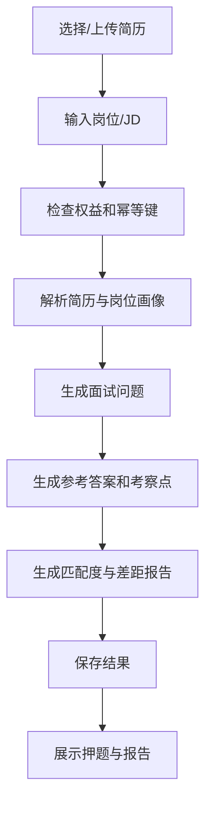
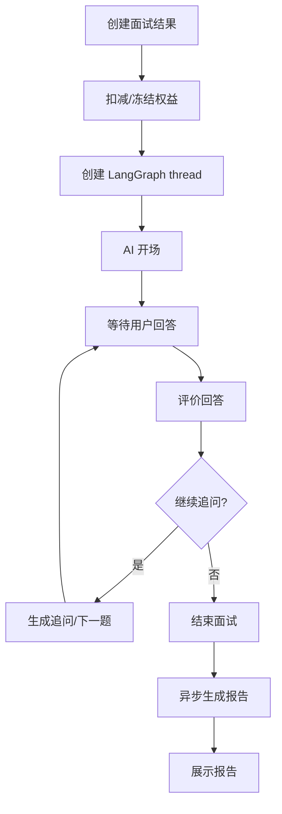
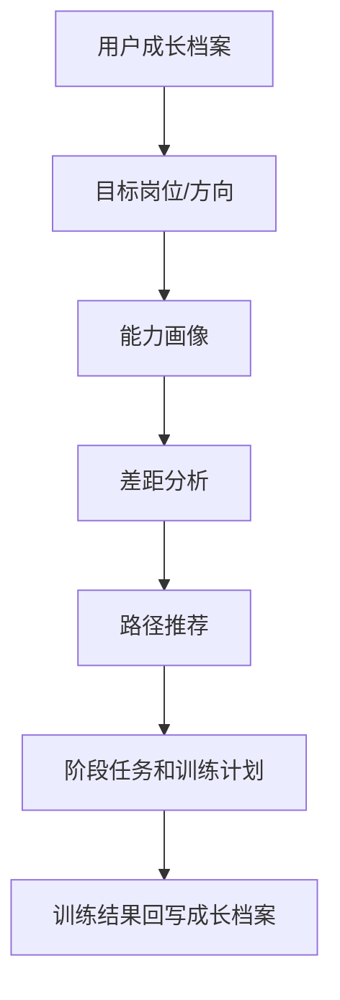
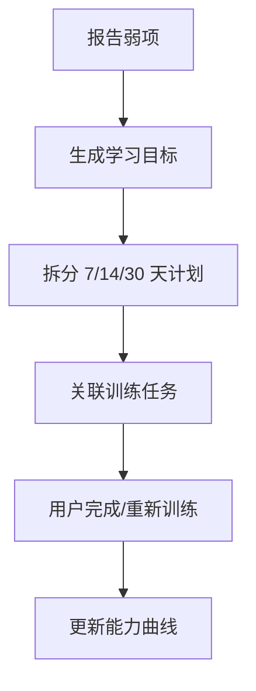
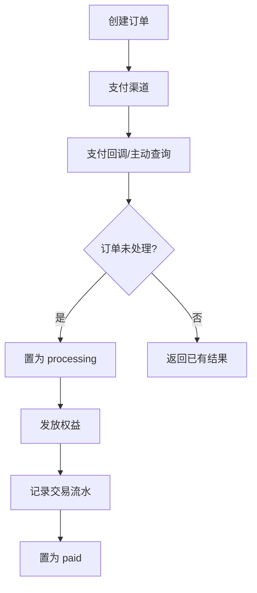

# 核心业务流程

> **🔎 实现状态（对齐真实代码 · 2026-07）** — 流程 1（简历押题，文本简历）、2（模拟面试，真 agent + 中断恢复）、3（职业路径）、4（学习计划）、5（支付权益）主链路均**已实现+接线**。校正点：流程 3/4 的“路径推荐/学习计划/能力曲线”当前为**确定性派生**（源自面试后的 assessment_report 事件），**非**跨会话记忆或模型个性化推断；流程 1 的简历解析**仅支持文本/PDF 文本层**，图片/拍照简历 OCR 为桩（被拒）；出题接地仅用本地种子题库，**联网找真题未启用**。

## 1. 简历押题

关键要求：

- 可流式显示阶段进度。
- 生成失败要回滚权益或标记可重试。
- 问题必须结构化：类别、难度、考察点、参考答案、追问建议。

## 2. 模拟面试

关键要求：

- 刷新页面、服务重启、多实例部署后可恢复。
- 等待用户回答用 LangGraph interrupt 或业务等待状态表达。
- 用户主动结束、暂停、恢复必须是显式状态转换。

## 3. 职业路径分析

关键要求：

- 不替用户做最终职业决定，只给证据、建议和风险提示。
- 推荐必须给出依据：经历、技能、目标岗位、市场要求或用户偏好。
- 长期要支持多目标路径对比。

## 4. 学习计划与复盘

关键要求：

- 学习计划必须能关联到具体能力差距。
- 计划不是静态文案，应随训练结果迭代。

## 5. 支付与权益

关键要求：

- 发放权益必须幂等。
- 支付金额、套餐、用户归属必须校验。
- 要有对账任务和人工补偿入口。

