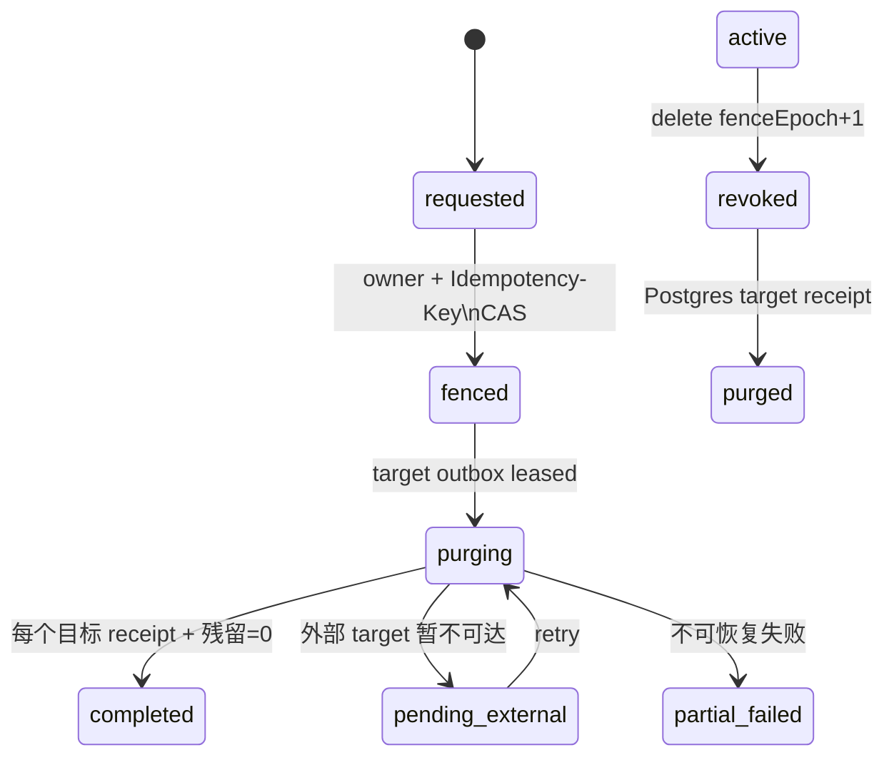

# LangGraph 检查点隐私擦除与状态最小化

> 本文是本次 P0（最高优先级）实现契约。它只覆盖自适应面试的运行态检查点和其直接答案队列载荷；不是“已经完成 OSS/Tair/Langfuse 全数据面删除”的声明。任何外部删除 target（目标）未收到可验证回执时，删除请求必须保持 `pending_external`（等待外部完成）或 `partial_failed`（部分失败）。**当前 `DELETE /privacy/interview-data/:id` 仍安全暂停并返回 503**：旧实现将可写的 `app.principal_user` 当成删除授权根，不能抵抗持有 runtime SQL（结构化查询语言）凭据的伪造主体。独立 `PrivacyAuthorizationIssuer` 与 0091 账本已在源码落地，但 HTTP 未接线、无部署密钥、无真实组合根回执；登录令牌不能打开删除。只有签发/验签/滥用证明在真实组合根通过后，才可重新开放受理。事实以 [运行时事实矩阵](../../architecture/current-runtime-truth.md) 为准。

## 1. 问题与范围

LangGraph（图编排框架）的历史 checkpoint（检查点）不可因当前 state（状态）字段被清空而自动删除。原始简历事实或作答一旦进入 `checkpoints`、`checkpoint_blobs` 或 `checkpoint_writes`，就会绕过“完成态 transcript（转写）不存答案”的约束。因此本能力强制两层防线：

1. **预防**：图 state 不保存原始简历事实或原始回答。`facts` 只在受控运行依赖中短暂存在；`interrupt/resume` 只传 `answerId`（回答标识）和 `answerHash`（回答哈希），评分节点临时水合原文，绝不把它返回到 state。
2. **补偿**：用户请求删除时，先在一个短数据库事务中锁住 `interview`（面试）、撤销 thread（线程）访问并提升 epoch（世代），然后创建按数据面拆分的删除目标。该事务还必须取消开放题，并将该面试所有 `queued/running` 队列行的正文移除、终结；因此围栏提交后的 API（应用程序接口）不得再入队，worker（后台进程）不得再领取或读取任何旧答案。PostgreSQL 内目标完成后仍需等 OSS（对象存储服务）、Redis/Tair（托管 Redis）和 Langfuse 回执，才能宣称全量完成。

财务账本只允许按 [面试历史](./interview-history.md) 的保留规则去标识，不属于物理删除目标。

## 2. 状态机与不变量

| 不变量 | 承重机制 |
| --- | --- |
| 撤销提交后，旧 worker（后台任务进程）无法再写 checkpoint | vendor 三表 `BEFORE DML` trigger（触发器）锁 enrollment，校验 `owner + thread + epoch + active` |
| 迟到写先提交时也不会留下残留 | 撤销随后清理所有三张表；撤销先提交时 trigger 固定拒绝 |
| 已 `purged` 的 thread 不可登记或恢复 | enrollment state 不可逆；登记函数只接受 `active` |
| 删除重复不会重复退款、重复删或复活 | owner+idempotency key 唯一、状态版本 CAS（比较并交换）、target receipt 唯一 |
| B 端不保留已删候选人的答案或评分可读投影 | 删除时取消开放题、撤销图、清空答案队列载荷并使关联评估不可用 |
| 删除与新答案入队竞争时不产生迟到正文 | 同一 interview（面试）ID 的事务级 advisory lock（数据库咨询锁）：删除先提交则入队拒绝，入队先提交则删除在同一事务内清除该 payload（任务载荷） |
| 删除围栏后的 worker 不把正文带出数据库 | claim（领取）和 payload load（载荷读取）均以 `interview_privacy_active`（隐私面试活跃）安全定义者数据库谓词为前置条件；失效 job（任务）不可见、不可读，应用角色不直接读取隐私账本 |
| 旧接口与迟到投影不能绕过围栏 | 所有 interview-owned（面试归属）事件、报告、评估、学习、职业路径、题目反馈和图运行表同时以 RLS（行级安全）策略与 `BEFORE` trigger（写前触发器）校验 `interview_privacy_active`；HTTP（超文本传输协议）入口在外送 ASR（自动语音识别）/TTS（语音合成）或读取前也执行同一谓词 |
| 已经外发到模型供应商的请求不伪称“未外发” | 模型派发前必须在 durable invocation（持久调用）事务中校验 privacy epoch（隐私世代）；已派发竞态进入 `pending_external`（等待外部完成）并等待供应商删除/保留回执，不能标记 completed（已完成） |

## 3. UC-GRAPH-PRIV-01 · 用户删除正在进行的单个面试图数据

- **角色**：候选人。
- **前置**：候选人拥有一个 active/waiting 面试；可能有在途 worker 和 checkpoint。
- **触发（目标态）**：`DELETE /privacy/interview-data/:id`，必须携带 `Idempotency-Key`（幂等键）和由独立授权签发器验证的单次授权快照。当前该路由固定返回 `503 interview_erasure_authorization_not_available`，不受理请求。
- **主流程**：
  1. API（应用程序接口）在 owner RLS（行级安全）事务中创建或重放 `PrivacyErasureRequest`。
  2. 将该 thread（线程）的 `checkpoint_thread_enrollment.active → revoked` 且 `fence_epoch+1`；已无 enrollment（登记）的 thread 也必须写入不可重新登记的 deletion target（删除目标）。
  3. 在同一事务中取消 `issued/queued` 题目，将所有 `queued/running` start/answer job（开始/答案任务）置为 `done`（完成）并清空 payload；新入队路径持共享锁检查 `privacy_interview_active`，因此不会绕过围栏。
  4. 事务内建立每个删除 target 和 outbox（事务外发箱）记录；响应 `202 Accepted`（已接收），而不是把“已围栏”冒充“已物理删除”。
  5. 擦除 worker 依序删 `checkpoint_writes → checkpoint_blobs → checkpoints`，读回残留为 0 后标记 `purged`。
  6. 每个外部 target（OSS/Tair/Langfuse）均完成后才到 `completed`；否则保持可重试状态。
- **后置**：旧 worker 续租、SSE（服务器发送事件）投影、评分、结算和 checkpoint DML（数据操纵语言）均为 0；财务账本不被物理删除。

### 七类覆盖

| 类别 | TC（测试用例） | 场景 | 不变量/验收 |
| --- | --- | --- | --- |
| 正常 | `TC-GRAPH-PRIV-001-main` | 中断中的面试图删除 | 三张 checkpoint 表 marker=0，PostgreSQL target=erased |
| 异常 | `TC-GRAPH-PRIV-001-E1` | 相同幂等键 100 次并发 | request/target 精确 1；不涉及退款 |
| 特殊 | `TC-GRAPH-PRIV-001-S1` | 空 checkpoint、已结束、已 purged | 幂等完成，无新写入 |
| 逃逸通道 | `TC-GRAPH-PRIV-001-E3` | owner B 伪造 owner A thread/epoch | 请求、读进度、DML 均 0 行/404 |
| 逃逸通道 | `TC-GRAPH-PRIV-001-E7` | 删除后直接走 `/turn`、repository（仓储）入队、worker payload load | HTTP（超文本传输协议）410；新 job=0；已排队 marker（随机标记）=0；worker 返回 idle（空闲）且读取次数=0 |
| 逃逸通道 | `TC-GRAPH-PRIV-001-E9` | 删除后走旧 `/answer`、SSE（服务器发送事件）、报告/评估/学习读取与重试、问题反馈、ASR（自动语音识别）/TTS（语音合成） | 所有读写统一拒绝（当前 HTTP 契约为 410）；`interview_event`、报告、通知、消费记录与供应商调用增量均为 0 |
| 高并发 | `TC-GRAPH-PRIV-001-E2` | 删除和旧 checkpoint writer 竞争 | revoke CAS winner=1，撤销后新 DML=0 |
| 高并发 | `TC-GRAPH-PRIV-001-E8` | 删除与 20 个并发答案提交/claim（领取）竞争 | 每个 answer marker（答案标记）在提交后读回=0；开放题=0；围栏后可被 worker 读取的 payload=0 |
| 复杂 | `TC-GRAPH-PRIV-001-M1` | B 端绑定评估+答案 job+多个数据面 | 可读评分/原文/缓存 target 全部受状态机约束 |
| 刁钻 | `TC-GRAPH-PRIV-001-T1`、`TC-GRAPH-PRIV-001-E4`、`TC-GRAPH-PRIV-001-E5`、`TC-GRAPH-PRIV-001-E6` | 迟到 checkpoint 写、半删崩溃、外部不可达、客户端丢响应 | trigger 拒绝/未完成 target 重试/不伪报 completed/同 request 重放 |

## 4. 当前实现状态与发布门

### 4.1 当前安全暂停与历史队列隔离（0075–0078）

`0075_privacy_erasure_authorization_pause.sql` 撤销了普通 `app_role`（应用运行角色）对 `privacy_begin_checkpoint_erasure(text,text)`（创建删除请求）和 `revoke_checkpoint_thread(text)`（撤销 thread）的执行权限；HTTP（超文本传输协议）端点同步返回 `503`。这不是删除功能，只是防止低权 runtime（运行时）登录通过伪造 `app.principal_user`（应用主体路由 GUC）跨主体擦除已知 thread（线程）。

`0076_privacy_erasure_legacy_request_pause.sql` 还会在**升级事务中**将旧入口已创建、但尚未完全终态的 `pending`、`leased`、`failed`、`retention_pending` target（目标）连同其 request（请求）改为 `authorization_paused`：清空 lease（租约）能力、保留既有 interview/checkpoint fence（围栏）、使 worker（后台进程）不能再 claim（领取）。它不是完成、重试或 `partial_failed`（部分失败）的别名；未来只有经过独立授权快照验证与人工审计的迁移流程才能重新受理。`0077_privacy_worker_dispatch_rls.sql` 修正了 dedicated worker（专用后台进程）在 `FORCE RLS`（强制行级安全）下的最小 dispatch（派发）读面：它只能经 security definer（安全定义者）函数取得 `targetId + owner`，没有 target 表、locator（定位器）或 checkpoint 正文直读权。`0078_privacy_worker_parent_request_guard.sql` 将 request（请求）状态也写入 list/claim/purge（列出/领取/清理）三个数据库过程的硬前置条件：只有 `fenced/purging/pending_external`（已围栏/清理中/等待外部）父请求可继续执行；`partial_failed`（部分失败）与 `authorization_paused` 都是终态。即使有人工或未来缺陷在它们下方写入 `pending` 或 `leased` child target（子目标），也不能再被派发、领取或物理清理；若配置了专用 worker URL，启动时还会验证 live catalog（实时目录）仅有 `privacy_worker_executor` 能力、没有复制/建库等实例级能力、没有 raw target（原始目标）表或旧 GUC destructive（破坏性）函数执行权，错挂 definer owner（安全定义者所有者）、runtime（运行时）或权限漂移凭据即拒绝启动。

| 类别 | TC（测试用例） | 当前可测验收 |
| --- | --- | --- |
| 正常 | `TC-GRAPH-PRIV-PAUSE-main` | 已认证候选人调用端点=503，request/target=0 |
| 异常 | `TC-GRAPH-PRIV-PAUSE-E1` | 有/无 Idempotency-Key（幂等键）同样不受理、不写账本 |
| 特殊 | `TC-GRAPH-PRIV-PAUSE-S1` | 已有 interview（面试）不改变 enrollment（登记）/queue（队列）/checkpoint（检查点） |
| 逃逸通道 | `TC-GRAPH-PRIV-PAUSE-E3` | 低权 app_role（应用运行角色）即使设置伪造主体也不能执行两个 destructive（破坏性）函数 |
| 高并发 | `TC-GRAPH-PRIV-PAUSE-E2` | 并发请求全部 503，request/target 增量=0 |
| 复杂 | `TC-GRAPH-PRIV-PAUSE-M1` | C/B 端在途对象保持原样；暂停不触发退款、事件或投影 |
| 刁钻 | `TC-GRAPH-PRIV-PAUSE-T1` | API 503 与数据库 REVOKE（撤销权限）缺一不可；仅控制器拦截不算通过 |
| 升级 | `TC-GRAPH-PRIV-PAUSE-U1` | 0075 旧 target 已被 worker 领取或待处理后升级 | 0076 后 `requested/fenced/purging/pending_external/partial_failed` request（请求）和未终态 target 都为 `authorization_paused`、lease=null、既有围栏仍阻断重新登记；`completed/erased` receipt 保持原样 |
| 最小权限 | `TC-GRAPH-PRIV-PAUSE-U2` | 专用 worker 在 `FORCE RLS` 下领取受控 fixture | dispatch 函数仅返回 `targetId + owner`；`app_role` 直读 target ledger（目标账本）=0 |
| 逃逸通道 | `TC-GRAPH-PRIV-PAUSE-U3` | 暂停父请求下被错误插入 `leased` child target | list/claim/purge（列出/领取/清理）全部拒绝，已知 lease token（租约令牌）也不能触发物理 DML（数据操纵语言） |
| 最小权限 | `TC-GRAPH-PRIV-PAUSE-U4` | `PRIVACY_WORKER_DATABASE_URL` 错挂到 definer owner 成员、拥有复制能力或被误授旧 destructive function | 该连接确能读取 raw target row（原始目标行）的受控反例，以及 `REPLICATION`（逻辑复制）/旧 GUC 函数 ACL（权限控制列表）漂移，都被启动 catalog gate（目录门）拒绝；pool（连接池）关闭、worker 不启动 |

2026-08-10 的历史隔离回执：`pnpm privacy-erasure:prove` 在当时 78 个迁移上通过 `2/2`（`.tmp/isolated-proof-receipts/2026-08-10T16-51-19-123Z-63986-20996131-b4d8-4dde-abec-6aefbc0dd875.json`，含伪造 victim GUC（受害者主体路由）直接调用的负测）；`pnpm privacy-erasure:http:prove` 在真实 NestJS（服务端框架）HTTP 栈上通过 `4/4`（`.tmp/isolated-proof-receipts/2026-08-10T16-52-26-550Z-64259-86cb9232-c349-47af-9cea-67ae2d339e29.json`）；`pnpm privacy-erasure:pause-upgrade:prove` 在真实 `0075 → 0078` prefix upgrade（迁移前缀升级）上通过 `14/14`（`.tmp/isolated-proof-receipts/2026-08-10T17-00-25-721Z-65658-0d40cd71-4293-47c1-a59b-195eb5f73f98.json`）。三者均为本地、`releaseEvidence=false`。当前树已有 123 个迁移；HTTP 源码的 503 路径现有 8 个会执行的断言（另有休眠的 202 套件，公开删除仍 503 时不得跑）。无 Docker 时不得用新断言数替换上述历史回执。

重新开放的前置条件是：独立 privacy API（隐私应用程序接口）/worker 身份，签名授权快照至少绑定 `actor/owner/interviewId/privacyEpoch/operation/expiry/idempotencyHash`，JTI（唯一令牌标识）原子消费，且数据库只接受该 capability（能力）创建 request（请求）。当前 `0091` issue 按调用方字段落账、本身不做 JWS 验签；worker 仍走 `0077`。仅把 HTTP 接到现有 issue 函数**不够**重开删除。GUC（会话配置）只能在授权完成后用于 tenant（租户）路由，绝不能作为授权根。

### 4.2 历史原语与已废弃证据

以下是旧的 checkpoint（检查点）围栏/物理清理原语，保留为将来授权闭环的实现素材，但**当前没有公开或 app_role（应用运行角色）可调用的受理路径**：

- `0048_checkpoint_physical_erasure.sql` 建立 API（应用程序接口）与 worker（后台进程）分离的 `NOLOGIN`（不可登录）数据库角色、请求/target（目标）租约 CAS（比较并交换）和 `checkpoint_writes → checkpoint_blobs → checkpoints` 的物理清理过程。
- `0076` 的 `authorization_paused` 是历史未完成 target 的终止性安全状态，不是已删除回执；重新受理必须经独立授权快照验证与人工审计。树上已有 `0091` 签发器/账本，但公开 HTTP 未接线；privacy worker **仍走 `0077` checkpoint 原语**，不得把该路径当作已改走 `0091` 的删除授权根。
- `0077` 和 `0078` 只修复专用 worker 的最小 dispatch feed（派发提要）可达性、父请求状态约束和错配凭据启动拒绝；它们没有重新开放 API、没有创建 request，也不能替代授权签发器。当前 worker 仍走这些 0077 checkpoint 原语，**没有**改走 `0091` verify→consume→claim。
- 旧的 `23/23` 与 `10/10` 本地回执使用了已经撤销的 app_role（应用运行角色）受理授权形状，现仅作历史问题定位，**不得**再作为当前实现、隐私删除或发布证据。

尚未实现，因而不得宣称已完成或可发布的范围：

- `DELETE /privacy/interview-data/:id` 与旧 `DELETE /privacy/resume-data` 都处于显式 fail-closed（故障关闭，HTTP 503）状态。前者：独立签发器与 `0091` 账本已在源码落地，但 HTTP 未接线，登录令牌不能打开删除。后者等待独立的单简历异步删除状态机。两者都不是已完成入口。
- 公开删除仍只证明不能误受理。队列 payload 清空与开放题取消是旧围栏原语。`0096` 已为 `interview_event` / 报告族 / `ai_graph_run` 补 **DB rehearsal** resolver、物理 purge 与 sink receipt，但这不是公开执行器，也未接到 0077 worker。`user_memory`、向量、招聘方可见数据、OSS/Redis/Langfuse 仍无 interview 作用域闭环。未有可验证 receipt 前不能视为已删。
- OSS（对象存储服务）、Redis/Tair（托管 Redis）、Langfuse（模型观测服务）、备份和灾备尚无回执执行器；因此 PostgreSQL target 完成后 request 必须保持 `pending_external`，不能 `completed`（已完成）。
- 模型派发前 privacy epoch（隐私世代）已在与 durable dispatch（持久派发）相同的短事务中以布尔围栏验证；上述本地证明覆盖“删除先赢”时供应商调用为 0。反向竞态（派发先赢）尚未建立 provider（供应商）删除/保留回执 target（目标），因此“删除与评分外送竞争”仍是发布阻断项，不能以 checkpoint（检查点）围栏代替。
- 历史 `TC-GRAPH-PRIV-001-E1…E9` 只能在授权快照重建后重新执行；当前暂停回归只证明不能误受理，不证明删除后旧答题、SSE（服务器发送事件）、报告、评分、学习、职业路径、题目反馈或语音入口的运行态围栏。
- 真实云端测试仍需要独占目标和 `TargetGrant`（目标授权）；本地隔离 PostgreSQL 通过不能代替云端删除传播验证。
