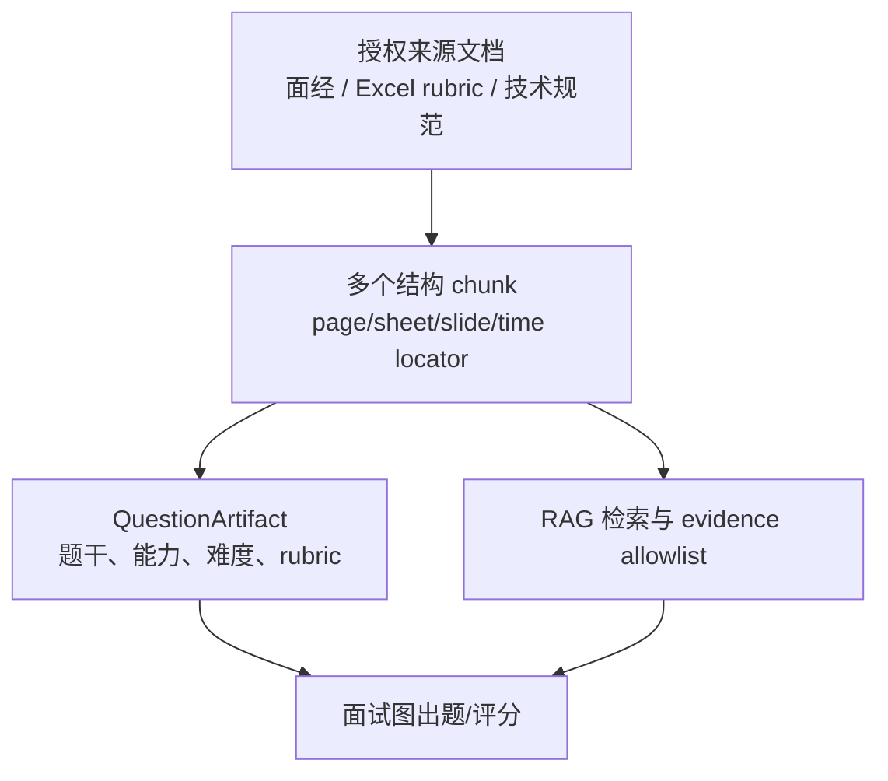

# 全格式 RAG、数据切块与微调专家面试教练

## 缩略语阅读卡（先读这一张，再读答案）

以下术语首次均写出中文含义，正文后续为保持面试口述流畅可以简称；完整跨项目定义见 [统一术语](/ai-docs/product/glossary.md)。`RAG（检索增强生成；先检索受权限约束的证据再生成）`、`PDF/DOCX/XLSX/PPTX（PDF、Word、Excel、PowerPoint 四类文件格式；必须保留各自定位信息）`、`MIME（文件声明类型；上传后仍需 magic bytes 复核）`、`PII（个人可识别信息；需脱敏和用途限制）`、`OCR（光学字符识别；从图片提取文字）`、`ASR（自动语音识别；生成带时间戳的语音转写）`、`VLM（视觉语言模型；辅助图像理解）`、`ACL（访问控制列表；决定谁能读证据）`、`CAS（比较并交换；切换版本时防止并发覆盖）`、`P95（第 95 百分位延迟；95% 请求不超过的耗时）`、`CI（持续集成；自动运行门禁）`、`SFT（监督式微调；用审核样例调整行为）`、`CPT（持续预训练；用领域原始语料继续训练）`、`DPO（直接偏好优化；用成对偏好调整输出）`、`LoRA/QLoRA（低秩适配/量化低秩适配；低成本微调方案）`、`JSON（结构化数据格式；训练和模型输出合同）`。

## 1. 90 秒总回答：如何做全格式 RAG？

> 我不把 RAG 定义成“上传文件、按 512 token 切、存向量”。我的事实源是版本化原件，向量只是可重建索引。每个 PDF/DOCX/XLSX/PPTX/图片/音视频先经 MIME+magic、反病毒、对象加密和无网络 sandbox，输出保留 page、sheet/cell、slide/shape、bbox 或 timestamp/speaker 的结构 IR。随后清洗、PII/注入标注和质量门，再由版本化 chunk recipe 切成检索单元；chunk 里一定有 document id、content version、recipe、content hash 和 locator。
>
> 表格按带重复表头的 row group 切，不能把单元格腰斩；slide、代码、图 region 和媒体片段是原子边界，装不下进人工审核或专用 adapter。题库不是“一题一向量”，而是来源文档产生多个 evidence chunks，题干、rubric 和能力标签是引用这些 chunks 的业务工件。回答的 citation 绑定旧版本定位，用户点击可打开 PDF 页、Excel range、PPT shape 或视频时间点；更新和撤销不会静默改写旧回答。
>
> 选择 parser、chunk size、overlap、表格序列化、OCR/ASR、embedding 和 reranker 不能靠经验或 10 条 happy-path query。我在独立 qrels 上逐层测 extraction、结构边界、EvidenceCoverage、strict-all、citation exactness、拒答、P95 与成本，用 shadow/canary 和 generation pointer 回滚。经验只能提供安全不变量和初始实验范围，不能证明某个参数最优。

## 2. 高频追问：如何保证 chunk “有用”？

**不能回答**：“我固定每 500 token、重叠 50。”

**专家回答**：不能先验保证，只能把“有用”变成可证伪假设。先区分四个层：

| 层 | 要证明什么 | 例子 |
| --- | --- | --- |
| extraction | 原件事实没有被弄错/漏掉 | Excel `B14` 的公式、显示值和单位都存在。 |
| structure | 关系未被切坏 | `Q4 / 210 / 李雷` 仍在同一表格行，且含表头。 |
| retrieval | 问题所需证据能被找全 | 多证据题需要的“限流策略 + 回滚条件”均在 top-k。 |
| answer/citation | 模型真的基于证据，且人能回原件复核 | 引用打开正确 slide/time range，而非只显示模糊标题。 |

我冻结 source version，按 document group 划分 dev/holdout，标每个 query 的 `requiredEvidence` 和 `answerable/clarify/abstain`。在 dev 比较 recipe，最终只在 holdout 报 `EvidenceCoverage@k`、`strict-all@k`、nDCG、citation completeness、P95、成本和 95% CI。若表格 hit 很高但 cell locator 错，仍判失败；若增加 overlap 提升 recall 但把 P95/成本翻倍或冲掉 ACL 后候选，亦不能上线。

## 3. 表格、PPT 和视频的追问清单

| 面试官问法 | 关键回答 |
| --- | --- |
| “Excel 怎么切？” | 以 workbook/sheet/table/named range/row group 为结构；保留 A1 range、表头、公式、显示值、单位、合并单元格。每个 row group 重复表头；跨 sheet lookup 以关联边而非把两张表粘成文本。 |
| “一个单元格 5000 token 怎么办？” | fail-loud，进入专用 cell/富文本 adapter 或人工审核；不能截断后假装 citation 仍精确。 |
| “PPT 的图表没有文字？” | 存 slide/shape/bbox，OCR 文字和 VLM caption 各自带置信与来源；图表数值需 chart data/人工标注，不让 caption 幻觉替代。speaker notes 与画面正文分层。 |
| “视频怎么可回溯？” | ASR segment 按 `startMs/endMs/speaker/word range` 存；检索可按 turn 合并但 citation 必须指回精确时间。关键帧 OCR 用 frame timestamp+bbox，双人通话未有 diarization 时明示 `not_diarized`。 |
| “来源更新了？” | citation 绑定 immutable `(document, contentVersion, chunk, locator hash)`；新版本建新 chunks/generation，旧引用展示历史版本。切换是 CAS pointer，运行会话 pin generation。 |
| “为什么不把整张表给模型？” | token/成本会失控，权限和冲突信息更难控制；但不能只按字串切。先用结构检索取必要行组，再把 header、单位、关联行和 citation 一起送进 evidence allowlist。 |

## 4. 题库为什么必须进入 RAG，而不是一题一库？



一道题通常依赖题干模板、标准答案、追问条件、评分维度、行业版本和出处多个证据；把它们塞入一条 `text` 会造成：长题被截断、相近题无复用、rubric 与题干改版不能独立、无法告诉用户“此追问来自哪份资料”、一处撤销后无法扇出失效。

正确对象是 `source document → content version → structural chunks → question artifact ↔ required evidence chunks`。短小自撰种子可以一题恰好一块，但这是数据的偶然属性，不是 schema 设计。

## 5. RAG、Prompt、微调：先做哪一个？

| 问题 | 首选 | 原因 |
| --- | --- | --- |
| 事实经常变、需要引用/权限/删除 | RAG | 模型参数无法提供最新版本、citation、ACL 和被遗忘权。 |
| 输出格式不稳定、固定工具调用/分类/抽取 | 强 schema + prompt，稳定后可 SFT | 先建立可评估的输入输出合同；微调可降低格式漂移。 |
| 风格、领域表达、稳定 rubric 或小模型替代大模型 | SFT/LoRA | 目标是行为/表达分布，而非记住每天变化的文档。 |
| 在多个可接受答案中对齐偏好 | DPO/偏好优化 | 需要成对偏好和安全 guard，不是把 thumbs-up 原样训练。 |
| 大量领域原始语料且词表/语言能力不足 | continued pre-training (CPT) | 成本/风险更高；不可替代业务 RAG 的事实更新。 |

先以 Prompt、工具合同和评测建立基线，再将微调限定为能够用冻结数据证明的特定行为改进；SFT、CPT、DPO 分别对应示范、领域继续训练和成对偏好三类不同目标，不能互相替代。

## 6. 如何做一次能经得起面试追问的 SFT

### 6.1 先写任务合同和 baseline

例如把“面试答案结构化点评”定义为：输入仅含脱敏 answer、rubric、允许 evidence；输出为固定 JSON，不能编造项目事实，证据不足时 `needs_clarification`。先测基座模型 + schema/prompt + RAG，记录错误桶；只有当错误在足量数据中稳定且可通过参数学习改善，才训练。

```json
{"messages":[
  {"role":"system","content":"你是面试点评器。仅输出给定 JSON Schema；证据不足则 needs_clarification。"},
  {"role":"user","content":"rubric: 幂等与重试；answer: 我会给接口加稳定幂等键，消费者按业务键去重。"},
  {"role":"assistant","content":"{\"verdict\":\"pass\",\"criteria\":[{\"name\":\"幂等\",\"evidence\":\"稳定幂等键\"}],\"needs_clarification\":[]}"}
]}
```

这不是可直接生产训练的真实样本：生产数据须经过授权、PII/DLP、版权、注入清洗、标注指南、双标一致性和数据血缘审计。不能把未经同意的简历、录音、聊天记录、供应商回答或模型自己的幻觉直接变成 train set。

### 6.2 数据、训练、验证

1. **数据版本**：每行存 `example_id/source/license/consent/redaction revision/labeler/reviewer/split/hash`；去重和近重复检索后再 split。
2. **切分**：按用户、公司、文档、题目模板 group split，不能把同一问题的改写放到 train 与 test；留出最终 holdout，训练期间不看。
3. **方法选择**：先 LoRA/QLoRA 做低风险试验；full fine-tune 仅在数据、算力、漂移和权重治理已经成熟时考虑。SFT 学期望示例；DPO 需要同 prompt 的 chosen/rejected，且两个候选均经安全过滤。
4. **超参不是背口诀**：学习率、epoch、LoRA rank、max sequence、batch 和 warmup 在 dev 上搜索；训练/验证 loss 只是诊断，业务 holdout、拒答、安全、延迟与成本才是发布依据。出现 train loss 降而 holdout citation/事实性变差即回退。
5. **评测**：与 baseline 做配对比较；至少报有效 JSON、业务 rubric、grounded/citation、拒答、红队、每类 slice、P95/成本、样本数和 CI。不能只报“准确率从 85% 到 90%”。

一个最小训练编排的伪代码重点在版本和门，而非某个 SDK：

```ts
const run = await registry.create({
  baseModel: 'base-model@revision', dataset: 'interview-sft@2026-08-03',
  method: 'qlora', recipe: { rank: 16, alpha: 32, lr: 1e-4, epochs: 2 },
});
await trainer.fit(run); // 只读取已审核、冻结的 train split
const report = await evaluator.compare({ baseline: 'base-model@revision', candidate: run.modelVersion, dataset: 'interview-holdout@v4' });
if (!report.hardGates.pass) await registry.reject(run, report);
else await registry.promoteToShadow(run, report); // 不是直接替换生产 alias
```

### 6.3 训练后如何使用

训练完成的权重不是“直接全量上线”：

`model version → model registry → shadow → canary → stable alias`。推理入口将 `model_alias` 解析为不可变 version，并在 trace 记录 `base/adapter/dataset/eval/prompt/tool schema/RAG generation`。RAG 仍负责可变事实和引用；工具仍做 server authorization；schema validator、content safety、rate/budget、fallback、回滚不能因“模型微调过”而移除。

回滚是将 alias CAS 翻回上一个稳定模型，不是重新训练。若模型与 prompt/tool schema 不兼容，需在影子阶段拒绝；同一个 alias 下静默换权重会破坏复现和事故分析。

## 7. 托管训练平台：怎样选择和怎么用

平台选择不能依赖口头承诺或网页快照。创建训练任务前，系统必须将当前可用能力、地域、数据格式、计费、权限和产物部署方式写入受控 deployment manifest，再由接口校验；能力和地域变化时 fail-closed。

| 平台类别 | 需要核实的训练能力 | 训练后如何接入时必须核对 |
| --- | --- | --- |
| 通用托管训练平台 | SFT、CPT、DPO、评测和模型版本管理是否分别可用；任务、数据和产物的 API 是否可审计。 | 支持的基座模型与地域、数据对象存储权限、训练/推理模型 ID、版本 alias、日志与数据保留。 |
| 轻量适配训练平台 | LoRA/QLoRA、训练数据格式、配额、停止/恢复和产物部署是否有稳定合同。 | 数据集版本/切分、密钥与角色、发布对象、评测任务、线上 endpoint 与回滚绑定。 |
| 全流程模型平台 | 训练、压缩、评测和在线服务的边界是否可独立控制。 | 加密、训练产物、审计日志、保留期、灰度发布与删除回执。 |

面试时不要说“某个平台一定支持某个模型的微调”。更严谨的说法是：“我会把支持矩阵写入 deployment manifest，在创建任务前以受控能力合同校验 model+region+method，失败 fail-closed；训练产物以不可变 version 进入 registry，再经 shadow/canary。”

## 8. 面试官深挖与评分点

| 追问 | 合格答案必须提到 | 常见失分 |
| --- | --- | --- |
| “RAG 效果差，为什么不微调？” | 错误归因；先查提取/切块/检索/引用；动态知识仍用 RAG；设计 paired eval。 | 把文档全塞 SFT，失去更新/引用/权限。 |
| “LoRA rank 选多少？” | 没有通用答案；从预算和基线开始，在 dev 搜索，holdout+安全/延迟裁决。 | 背 `r=8/16`，不说数据和指标。 |
| “微调后如何防幻觉？” | 不能保证；grounding/citation/RAG/schema/拒答/评测仍在，训练只改善行为分布。 | 说“训练过就不会幻觉”。 |
| “如何防训练集泄漏？” | user/document/template group split、near-dedup、license/consent、dataset version、holdout 冻结。 | 随机按行切分。 |
| “微调怎么上线回滚？” | immutable model+dataset+eval receipt，shadow/canary，alias CAS，指标/停止条件。 | 控制台点发布后观察。 |
| “表格 chunk size 怎么选？” | row/header 不变量，序列化与预算由 table qrels 选择；报 coverage/locator/cost。 | 固定 512 token。 |

## 9. 一分钟收束

> 我的顺序是：先把原件、结构、版本、定位和权限变成可验证的事实层；再用数据集决定可变算法；最后才考虑微调。RAG 处理可变、可引用、需 ACL 的知识，微调处理可重复的行为和格式。无论模型多强，表格行被切断、citation 找不到原件、训练集泄漏或 source 被撤销后仍能回答，都是系统设计失败，不是把 topK 或 epoch 调大能解决的。
