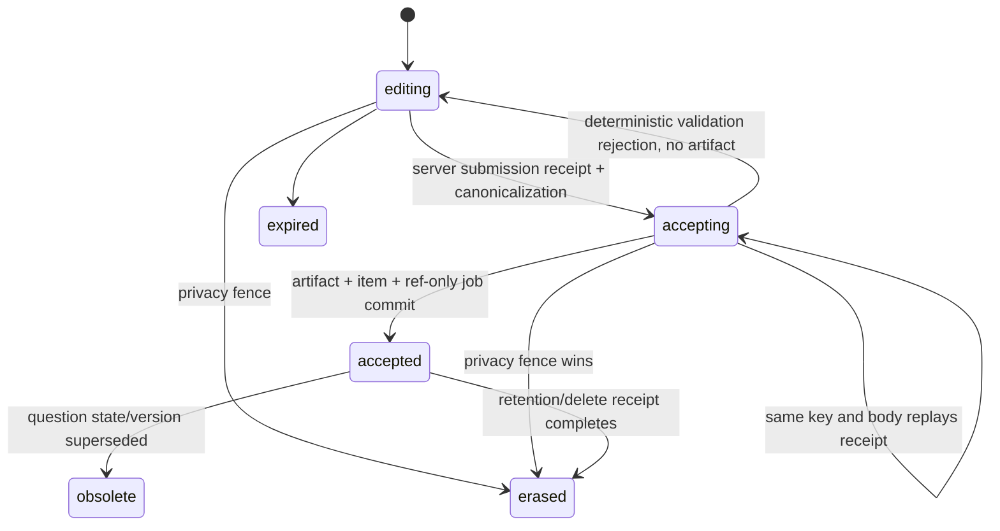

# 长时专家面试运行时、完整记录与安全控制面

## 0. 状态、范围与不能误称的事实

这是目标契约，不是当前实现说明。当前自适应面试图只保存有界工作状态；checkpoint 用于 interrupt/resume。短期 answer job 只在任务终态剥离 `interview_job.payload` 字段，这不是全 sink 物理删除，也不是 canonical artifact。SSE/client state 不保证完整历史。图 checkpoint 不保存 raw answer，但当前 API 在 worker 完成前仍将 raw answer 作为明文 JSON 存在该 payload；不具备完整删除闭环。现有图的轮数上限和实际数据链路以 [运行时事实矩阵](../../architecture/current-runtime-truth.md) 为准。

本页的目标是把“能从断点继续一个 graph”升级为“用户能安全复盘一场长面试”，同时避免把所有消息无条件塞进 prompt 或把 LLM 变成权限、等级和终止条件的裁判。

首期范围是 C 端个人模拟面试和面试绑定的岗位 route snapshot。B 端可见性、可比较招聘评分、跨会话语义记忆、人工复核和真实供应商/浏览器 E2E 仍分别受既有评分、记忆、模型操作和隐私契约约束。任何实现开始前都必须完成独立的产品、数据安全和运行时对抗审查；本页不把编写者自审或本地回执当作该审查。

### 0.1 2026-08-13 独立对抗审查：目标需改序，当前实现被阻断

本轮由数据一致性与 AI/运行时两个独立审查镜头，逐项对照本页、运行时事实矩阵和 API、Worker、Graph、数据库源码完成。结论不是“目标取消”，而是必须先完成 `INT-TRANSCRIPT-00`；`INT-TRANSCRIPT-01` 在该前置未验证前不得落生产代码。以下 finding 仍为 `open`：00 的签发器/账本/合同已在源码落地，但公开删除仍 503，且没有真实组合根回执。`INT-TRANSCRIPT-01` 及后续项保持 `blocked`；不得改称已实现、生产可用或 E2E 已通过。事实以 [运行时事实矩阵](../../architecture/current-runtime-truth.md) 为准。

| finding | 级别 / 状态 | 已证实证据 | 最小修复与目标调整 |
| --- | --- | --- | --- |
| `INT-P0-ERASURE-AUTH` | P0 / open | `apps/api/src/modules/privacy/privacy.service.ts` 的面试删除仍固定返回 `503 interview_erasure_authorization_not_available`；`0075` 已撤销旧 destructive 权限。0091 签发器/账本已存在，但 HTTP 未接线。`0096` 已为 event/report/`ai_graph_run` 补 DB rehearsal resolver/purge，worker 仍走 0077 checkpoint 原语，vector/trace/外部面未闭环。 | 公开删除入口保持 503，直到 forged GUC/登录令牌/raw SQL/cross-owner/issuer/key/jti 与恢复用例在真实组合根通过。01 的新 sink resolver、receipt 与删后 read=0 必须随同一迁移证明；此前真实用户 raw write route 保持 disabled。 |
| `INT-P0-ERASURE-ISSUER` | P0 / open | 独立签发器已在源码：`packages/domain/src/privacy-authorization.ts`（ECDSA P-256 / ES256）+ 迁移 `0091`（`privacy_authorization_snapshot`、`privacy_deletion_receipt`、`privacy_issuer`、issue/consume/claim）。API 登录令牌仍由 `AUTH_SECRET` 对称 HMAC 签发，且**不能**打开删除。尚无部署密钥注入、JWKS 对外发布或真实组合根回执。把同一登录密钥、worker 凭据或可写 GUC 扩展为删除能力，仍会重新引入可伪造授权根。 | 保持身份根分离；签名/验签/消费、密钥轮换与缺失配置均 fail-closed。未取得组合根证据前，删除入口和 01 真实 raw write route 均保持关闭。`releaseEvidence=false`。 |
| `INT-P0-RAW-QUEUE` | P0 / open | 现有 legacy `POST /interview/:id/turn` 仍在运行：`interview.service.ts` 将 `body.answer` 放入 answer job；`packages/db/src/interview-jobs.ts` 将 payload JSON 持久化并让 worker 读取，只有 terminal job 才剥离 `answer`。`PUBLIC-PREVIEW-WRITE-GATE-01` 仅在 `MEETWISE_PUBLIC_PREVIEW=1` 时对该写 verb 返回 `503 public_preview_read_only`，不关闭非预览 `/turn`，也不新增 `/answers`。树上已有 `0092` 的 `interview_answer_artifact` / `interview_answer_submission` rehearsal 表与 `submitInterviewAnswer` 函数，但公开 API 没有新的 canonical write route；`/turn` 不是本目标的合规写入路径，也不能被误称为已关闭。`0126` 已加对向互斥（artifact 与明文 job 不能同身份并存）和 `interview_event` 禁顶层 `answer`；这不是 queue 已关闭，也不是 01 完成。`0124`/`0125` 已在 `main`（RAG ACL；memory 擦除）；本围栏是 `0126`。盘点见 `architecture/backend/interview-answer-dual-write-cutover.md`。 | `INT-TRANSCRIPT-01` 只在 00 组合根验证后开始：其**新增公开 canonical 写入路径**只写加密 artifact/draft；job、checkpoint、event/SSE、日志与 trace 只持 opaque ref。上线切换必须先按已登记的 cutover 切断 `/turn` 明文 payload：它不得再与 01 并行写同一答题事实，也不得成为 response-lost、重登或 transcript 的回退。历史 queued/running payload 走单独 legacy fence，不复制或猜测原文。 |
| `INT-P0-SUBMISSION-RECOVERY` | P0 / open | 共享契约已冻结 `InterviewAnswerSubmitResult` / `InterviewAnswerSubmissionReceipt`（不进 OpenAPI）。当前公开 `/turn` 仍不消费该 receipt 合同；浏览器 answer key 只在内存；题目 ledger 只能重放相同 `answerId + SHA-256`，提交响应丢失后换浏览器会得到 stale。 | 01 接线前只保持合同冻结，不开放真实用户 write route。同键同体回放、同键异体冲突、双 tab 一 winner 必须由服务端账本强制；重登只能经 receipt/view 继续。 |
| `INT-P0-SEC-PERMIT` | P0 / open | 当前模型调用只在派发前作隐私检查；派发后没有 authorization/context/output permit 复核。删除或撤权后的迟到模型输出仍没有目标态要求的 CAS 投影阻断。 | `SEC-GRAPH-01` 与 `MODEL-OP-01` 在任何 artifact 外送、评分、RAG/Web、报告或 memory 写入前完成；派发后 unknown 不自动换模型或重发，迟到输出无 permit 必须丢弃。01 首包禁止所有这些副作用。 |
| `INT-P0-LEVEL-EVIDENCE` | P0 / open | 当前评分仍是模型整数分和自由 criterion；没有 versioned ScoreCard、rubric evidence、InitialLevelHypothesis 或跨模块 coverage。`UC-INT-LEVEL-SIGNAL-01` 只落地 weak/thrashing **控制流 hook**（`decideNext` → `early_weak` / `early_thrashing`），**不**构成能力等级或 B 端 band。 | 先完成 `SCOR-01/02`，再进入 `INT-LEVEL-01`。年限、单题、学历/年龄/性别/地域等受保护属性及其代理变量都不得单独决定初始或最终能力等级。控制信号见 [interview-control-signals.md](./interview-control-signals.md)。 |
| `INT-P1-SNAPSHOT-SSE` | P1 / open | 当前 transcript 是部分事件投影；SSE 为读 events 后轮询，无 snapshot 与 tail 的同一读取边界。 | 01 冻结 snapshot/cursor 合同：写入 item 与其可见事件必须在同一事务分配 interview 内唯一、单调的 `visibleSeq`；同一 RLS read transaction 取得 watermark `W` 与只含 `visibleSeq <= W` 的 item；tail 仅消费 `visibleSeq > W`，去重只用稳定 item/event id。cursor 绑定 interview、watermark、页位置和 privacy epoch；删除、撤权、过期或 epoch 不符一律返回固定不可枚举 `fenced/invalid`，不能猜测缺失 item。 |
| `INT-P1-BLUEPRINT-ROUTE` | P1 / open | 短流程图已按覆盖/证据/会话信号收口（`UC-INT-LENGTH-01`：软预算可上调，绝对杀开关默认 120 是平台安全，不再是固定八轮/十六轮硬顶）；worker 仍默认“技术岗”。没有 60/90/120 分钟、module、deadline、route/rubric/model/prompt snapshot。允许把杀开关配成 60/90/120 档 ≠ 已接线 blueprint。 | `INT-LONG-INTERVIEW-01` 必须在 `RAG-FUNNEL-03/04` 和版本化评分后独立审查；01 不靠加大固定轮数或调高杀开关交付，不接 RAG/Web。短流程长度政策见 `requirements/use-cases/adaptive-interview-length.md`。 |
| `INT-P1-MEMORY-TENANCY` | P1 / open | `MEM-00` 未闭合；当前首期只有 owner RLS，尚无可验证 tenant/project/purpose 业务模型。 | 01 明确为 C 端 owner-only，不声称 tenant/project 隔离；transcript 不自动进入 memory。后续跨会话 recall 必须先完成 scope、source、consent、冲突、过期、两阶段过滤/水合和删除 receipt。 |

审查确认可复用但不足以关闭以上 finding 的局部护栏：题目 ledger 的单 winner CAS、job lease、graph fence、Graph state 不存 raw answer、以及最小化 trace。它们不能替代 canonical transcript、删除授权、提交回执或模型输出 permit。

### 0.2 真实用户原文写入的双门

`INT-TRANSCRIPT-00` 冻结并验证删除授权、target/receipt 与 submission 行为合同；它不授权真实用户原文写入，也不把公开删除从 503 改开。树上已有 `0092` rehearsal 表/函数，那是后续 01/评分 proof 的本地数据面，不是公开 write route。`INT-TRANSCRIPT-01` 只能在以下两个门都通过时开放真实 write route：

1. `00` 的独立 issuer、单次消费、受约束 deleter 与既有 target/sink receipt 已在真实组合根通过；公开删除入口已不再依赖旧的 GUC 或共享登录身份根。
2. **同一部署迁移**同时安装 01 的 artifact/draft/submission/item/ref-only-job/view sink、target resolver、deletion ledger 与逐 sink receipt，并以真实 HTTP、SSE、RLS 组合根证明删后 read=0、submit×delete 和迟到 worker 均不能恢复或外送原文。

任一门缺失时，只有不含真实用户数据、无外部副作用的 `INT-TRANSCRIPT-01` test-only rehearsal 可以存在；所有真实 **01 canonical** raw-answer write route 必须保持 disabled。现有 legacy `/turn` 仍会写 plaintext `interview_job.payload`，因此既不能被称为 disabled，也不能作为 01 的实现、验收或回退路径；启用 01 前必须有单独的 legacy cutover/fence。 这不是“先写入、以后补删除”的过渡策略。

## 1. 目标对象与承重不变量

| 对象 | 解决什么问题 | 不能用什么冒充 |
| --- | --- | --- |
| `InterviewAnswerArtifact` | 加密保存已接受的答题原文，使重登、复盘、评分证据和删除有同一个 canonical source。 | LangGraph checkpoint、job payload、浏览器 state、SSE token。 |
| `InterviewAnswerDraft` | 允许用户在答题中关闭页面后恢复草稿，但草稿未被当成已提交答题。 | 直接覆盖 accepted answer 或把 draft 发给评分模型。 |
| `InterviewAnswerSubmission` | 以服务端持久 receipt 解决 response-lost、跨标签和重登后的接受结果重放。 | 浏览器内存中的 answer ID、单纯 HTTP header 或当前题 answer hash。 |
| `InterviewTranscriptItem` | 建立用户可见、可分页、可删除的时间线；问题、回答、澄清、评估和报告均引用 canonical record。 | 复制模型内部 prompt、链式推理、工具输入输出或 trace。 |
| `InterviewViewSnapshot` | 消除“先拉历史、后连 SSE”之间丢事件/重复事件的竞态。 | 依赖浏览器本地缓存或按时间猜测。 |
| `InterviewBlueprintSnapshot` | 冻结本场面试的时间、模块、覆盖、route、rubric 和版本，防止岗位/配置中途漂移。 | 把当前 job、当前 taxonomy 或 graph state 当作历史事实。 |
| `InitialLevelHypothesis` / `CompetencyLevelAssessment` | 分开“简历推测的起点”和“本场证据支持的能力结论”。 | 年限、学历、一个题分数或单一 overall score。 |
| `AuthorizationSnapshot` / `SecurityDecision` / `OutputProjectionPermit` | 让授权、隐私、route、注入和投影校验成为每个敏感边界的可审计前置。 | 可写 session GUC、LLM 分类结果、graph node 成功返回。 |

共同不变量：

1. 原始答题只写入受加密、RLS、保留期和删除流程约束的 canonical artifact；checkpoint、event payload、日志、trace、SSE 都不携带原文。
2. 每个用户可见 transcript item 都可回到可见的 canonical source；历史数据已经因旧策略清理的原文必须显示为“不可恢复的历史记录”，不得用摘要或模型推测补写。
3. 面试开始后 route、blueprint、rubric、taxonomy 和 policy 以 immutable snapshot 为准。岗位后来编辑、题库切代或模型默认值变化不得改写本场既有解释。
4. 工作年限只影响 initial hypothesis，永远不是上限或下限。最终输出是按能力维度的 evidence、confidence、coverage 和 observed band，而不是凭单个总分宣布人等于某级别。
5. 候选人文本、RAG/Web 文本、memory recall 和工具返回都是不可信数据。LLM 不能决定权限、scope、删除、终止、B 端用途或数据库写入。

## 2. 数据、状态机与接口影响（目标态，未实施）

### 2.1 数据模型

```text
InterviewAnswerArtifact
  id, ownerUserId, interviewId, questionId, stateVersion, turnOrdinal,
  encryptedPayloadRef, bodyHmac, hmacKeyVersion, privacyEpoch, retentionClass,
  acceptedAt, status(active|fenced|erased), sourceVersion

InterviewAnswerDraft
  id, ownerUserId, interviewId, questionId, stateVersion, turnOrdinal, privacyEpoch,
  encryptedPayloadRef, bodyHmac, hmacKeyVersion, revision,
  status(editing|obsolete|expired|accepted|fenced|erased), expiresAt

InterviewAnswerSubmission
  id, ownerUserId, interviewId, questionId, stateVersion, turnOrdinal,
  clientSubmissionKey, canonicalBodyHmac, hmacKeyVersion, privacyEpoch,
  status(accepting|accepted|rejected|fenced|erased),
  acceptedArtifactId?, transcriptItemId?, refOnlyJobId?, resultCode

InterviewTranscriptItem
  id, ownerUserId, interviewId, ordinal, visibleSeq,
  kind(question|answer|clarification|evaluation|report|system_notice),
  canonicalEntityType, canonicalEntityId, visibility, createdAt, tombstoneState

InterviewViewSnapshot
  read-only response DTO from one RLS transaction: interviewId, version,
  highWatermark(visibleSeq), pendingQuestionRef, currentDraftRef,
  interviewStatus, routeDigest?, blueprintDigest?, privacyEpoch

InterviewBlueprintSnapshot
  interviewId, durationSeconds, hardDeadlineAt, moduleBudgets,
  maxQuestions, minValidEvidence, routeAllocations, terminationPolicy,
  taxonomyVersion, rubricVersion, promptPolicyVersion, modelPolicyVersion

CompetencyLevelAssessment
  interviewId, competencyId, observedBand, confidence, evidenceCoverage,
  status(provisional|supported|insufficient_evidence|review_required), version
```

`InterviewViewSnapshot` 是一次读取的 immutable DTO，不是可被独立改写的第二份业务账本。原文与索引/投影分离，是因为页面回显、评分复核、删除和安全审计对内容有不同的访问模式。body HMAC 使用服务端密钥并带 key version，不能把低熵答题的裸 SHA-256 当作可查询的确认 oracle。把全文复制到 checkpoint 可以便利一次 graph resume，却无法解决 retention、跨 owner RLS、分页、删除 sink 枚举和日志泄漏；把全文只放在 SSE 则连断线恢复也做不到。

### 2.2 状态机



`accepted` 只表示用户答题业务事实写入成功，不表示评分、报告或 B 端投影已经成功。`INT-TRANSCRIPT-01` 首包不创建 assessment outbox，也不调用模型、RAG、Web 或 memory；这些能力在其各自前置完成后才能另行接入。提交响应丢失时客户端按同一 submission key 查询 canonical receipt，而不是重新写一份 answer 或重新调用模型。

`AuthorizationSnapshot` 不是普通登录 JWT 的别名。源码已有独立 `PrivacyAuthorizationIssuer`：签名或受管验签材料不进入 API runtime SQL、worker/deleter、浏览器或 `AUTH_SECRET` 的权限域。签发结果绑定 `issuerId`、`keyId`、单次 `jti`、actor、owner、interview、purpose、privacy epoch、精确 target-set digest、签发/过期时间；0091 账本提供原子 CAS 消费 `jti`。这是本地源码与账本，不是已部署的签发器服务，也不是已开放的公开删除入口。`privacy_issue_authorization_snapshot` 按调用方字段落账，本身不做 JWS 验签；privacy worker 仍走 `0077`，公开删除仍 503。不得把“账本函数存在”说成删除授权已闭合。

`PrivacyAuthorizationIssuer` 的算法与身份根冻结如下：签名用 **ECDSA P-256**（JWS `alg=ES256`），`iss=meetwise-privacy-authz-v1`、`aud=meetwise-deletion-worker`；`kid` 采用版本化命名（如 `privacy-del-2026-01`），JWKS 按 `kid` 轮换——旧 `kid` 仅保留验签直至其签发快照的 `expiresAt` 窗口全部关闭后移除，未知或已吊销 `kid` 一律 fail-closed。这**刻意区别于模型网关** `AuthorizationSnapshot` 的 **Ed25519**（`iss=meetwise-authz-v1`、`aud=meetwise-model-gateway`，见 `model-invocation-reliability.md`）：二者是不同的 issuer/audience/信任边界（隐私删除根 vs 模型命令授权），用不同算法与密钥材料以杜绝密钥复用与跨用途混淆；这是刻意的分离，不是规格未对齐。

目标 HTTP/read 契约必须在共享 contracts 中先落地，以下名称只是对行为的说明，不是现有 endpoint：

| 操作 | 返回/写入原则 |
| --- | --- |
| 提交或恢复草稿 | scoped draft revision + `If-Match`；旧 question/stateVersion 的草稿只能 `obsolete`，不能覆盖新题。 |
| 提交答案 | 以 `questionId + stateVersion + turnOrdinal + clientSubmissionKey` 建立 submission receipt；同键同 canonical body 回放、同键异体冲突、同题不同键仅一个 winner。返回 artifact/item/ref-only job refs 与 `accepted_unscored`。 |
| 查询提交结果 | owner-only 按 `clientSubmissionKey` 或 submission receipt 读取最小状态；客户端丢失 key 时，只能经 view 读当前题已被接受的非敏感 winner 状态，不能靠新 UUID 覆盖。 |
| 读取面试视图 | 一次 RLS read transaction 返回 `InterviewViewSnapshot`、watermark 和 `visibleSeq <= watermark` 的首屏 item。 |
| 分页历史 | 基于稳定 transcript ordinal/cursor，不按 wall clock；不把评价内部 evidence 或模型链式推理发给用户。 |
| 订阅后续事件 | `after=highWatermark`；cursor 带 interview、page position、`privacyEpoch` 和 watermark。每条只含 stable item/event ID、visibleSeq 和最小状态，客户端可安全丢弃重复，绝不含 raw answer；删除/撤权/过期/epoch 不符统一返回不可枚举 `fenced/invalid`。 |

### 2.3 面试终止策略

不再以“第八题后结束”作为专家面试唯一条件。`InterviewBlueprintSnapshot` 定义总时长、模块时段、每能力最少有效 evidence、最大题数、澄清次数和当前 route allocation；确定性策略依据时间、coverage、evidence 和安全状态给出：

`user_ended | time_budget_exhausted | coverage_satisfied | insufficient_evidence | privacy_fenced | system_unavailable | cancelled`。

**现行代码子集（不是本目标枚举）：** 经 `decideNext` 的 `budget_exhausted` / `all_resolved` / `early_weak` / `early_thrashing`（写入 `concludeReason`，worker/SSE/report 不读）；另有 `evalAnswer` 的 `unscored` / identity-mismatch 直跳 conclude。详见 §6 与 [interview-control-signals.md](./interview-control-signals.md)。

例如，候选人一开始按 1–3 年经验进入 `intermediate hypothesis`，但在 Go 并发、数据库事务和分布式幂等三个 module 中连续给出可验证的高级 evidence，scheduler 必须加一组 promotion probes，而不是因初始年限停止。反过来，宣称高级但核心模块没有足够 evidence 时，结论只能是 `insufficient_evidence/review_required`。这要求大纲和 rubric 先冻结；否则“多问几题”只会把模型漂移和题目难度差异放大。

## 3. UC-INT-TRANSCRIPT-00 · 先建立删除授权与提交接收契约

`INT-TRANSCRIPT-00` 是审查新增的 P0 前置，不能用接口返回 200、GUC 或 worker 身份冒充完成。签发器、0091 账本与 submission/receipt 合同已在源码落地；当前公开删除入口仍保持 503。本 UC 冻结 `InterviewAnswerSubmission`/receipt 行为，不授权新的公开 01 canonical raw write；这不等同于停用当前 legacy `/turn`，也不把 0092 rehearsal 表当成已上线 write route。

- **角色 Actor：** 候选人、身份/隐私授权签发方、受约束 privacy deleter、面试 API、面试 worker。
- **前置 Precondition：** 当前公开删除接口仍 fail-closed；授权签发方不与 app runtime SQL 凭据、worker/deleter 账号、`AUTH_SECRET` 或可写 session GUC 共用身份根。独立 signer/verifier（算法固定 **ECDSA P-256/ES256**，与模型网关 Ed25519 刻意分离）、`issuerId/keyId`、短时单次 `jti` 消费账本及密钥轮换/失效策略均已冻结；任一配置缺失即不能签发或删除。
- **触发 Trigger：** 用户请求删除面试数据，或系统在接受 raw answer 前验证该对象已有可执行的删除/保留策略。
- **主流程 Main（目标态，当前公开删除仍 503）：**
  1. 独立 `PrivacyAuthorizationIssuer` 为精确 `actor + owner + interview + purpose + privacyEpoch + target-set digest` 签发带 `issuerId/keyId/jti/issuedAt/expiresAt` 的短时、单次 `AuthorizationSnapshot`。目标态要求调用方不能自报 owner、scope、epoch、target、issuer 或 key。当前 `0091` issue 按调用方字段落账、本身不做 JWS 验签；HTTP/worker 未接线该闭合路径。
  2. 数据库在同一受控请求账本中冻结 artifact、draft、submission receipt、transcript item、job reference、checkpoint、event/view cache、trace、模型/provider 和其他外部 target 的枚举；每个 target 有唯一 `(request, kind, source)`。
  3. 仅专用 deleter 可领取带 fence 的 target；其每次读、hydrate、派发和写回均复验当前 authorization、owner、purpose、epoch 与 lease token。未知或不可删除的外部 target 只能 `pending_external`/`failed_cleanup`，不能伪造完成。
  4. 01 上线迁移必须在启用真实用户写入前，向同一 target resolver 注册 artifact、draft、submission、item、ref-only job 和 view/read cache；该迁移同时证明受约束 deleter 可以逐 sink receipt、删后 read=0。任一新 sink 缺失时 write route 保持 disabled，不允许先写后补。
  5. 只有精确 target 全部获得可验证 receipt 后，request 才能 terminal；对用户可见的历史只留下 tombstone 和最小状态。API/worker/模型迟到结果不能以旧 artifact 恢复正文或投影。
- **备选流 Alternate：** 删除尚未可用时仍返回固定 503；保留期到期走同一 target/receipt 状态机，不能绕开授权根。
- **异常流 Exception：**
  - **E1 重复：** 同一删除请求/key 读回同一 request/target 状态，不二次 purge 或外送。
  - **E2 并发：** submit、worker hydrate、delete 和 provider late result 同时发生时，privacy fence/epoch 的胜者决定；删除先赢则后续 raw read、模型输入和投影均为 0。
  - **E3 越权：** forged GUC、cross-owner、错误 purpose、过期/已消费 `jti`、错误 issuer/key、错误 target digest、raw SQL 和错误 worker 身份均拒绝且 0 target。
  - **E4 外部失败：** provider/trace/cache 的 receipt unknown 时 request 不能 completed；记录最小错误码并等待受控恢复。
  - **E5 降级：** 无授权或 sink 清单不完整时不接受新的**公开**长期 raw artifact；公开删除接口继续 503。树上 0092 rehearsal 不是该门的公开 write。
  - **E6 崩溃恢复：** lease 到期后只从持久 target/fence 继续，旧 worker 和迟到结果无权覆盖 terminal/tombstone。
- **后置 Postcondition：** 00 在源码落地独立签发器、0091 账本与 submission/receipt 合同；公开删除仍 503，七类 TC 仍 planned/unmapped，无真实组合根回执。这不是已关闭的删除权，也不是已上线 write route。只有后续 01 的同一部署迁移同时安装新 sink、target 枚举、deletion ledger、receipt 与删后 read=0，并经真实组合根验证后，才可开启真实用户的 `INT-TRANSCRIPT-01` write route。
- **关联：** 删除请求/target 状态机、RLS、CAS、事件账本；`MEM-00` 与现有 privacy pause 规则。

### UC-INT-TRANSCRIPT-00 七类测试矩阵

| 类别 | TC | 必测断言 |
| --- | --- | --- |
| 正常 | `TC-INT-TRANSCRIPT-00-main` | 受约束 request 逐 target receipt 后才 terminal；未来 01 sink 已注册时，删后读取为 0、用户视图只见 tombstone。 |
| 特殊 | `TC-INT-TRANSCRIPT-00-S1` | draft、accepted artifact、submission receipt、ref-only job、checkpoint/event/cache 等 target 均精确枚举。 |
| 异常 | `TC-INT-TRANSCRIPT-00-E1` | 重复 delete key 不新增 target、不重复 purge，读回同一结果。 |
| 逃逸通道 | `TC-INT-TRANSCRIPT-00-E3` | 伪造 GUC、owner/purpose/epoch、`AUTH_SECRET` 登录令牌、issuer/key、target digest、raw SQL、过期或已消费 `jti` 均无 target/删除副作用。 |
| 高并发 | `TC-INT-TRANSCRIPT-00-E2` | 20 个 submit/hydrate/delete/late-result 竞争中，删除胜者之外 raw read、模型输入和投影为 0。 |
| 复杂 | `TC-INT-TRANSCRIPT-00-M1` | worker takeover、lease 过期、外部 receipt unknown 后只由持久 fence 恢复，不错误完成。 |
| 刁钻 | `TC-INT-TRANSCRIPT-00-T1` | 历史 legacy queue payload、缺失 sink 或 provider unknown 进入明确 failed/pending 状态，不猜测、不静默成功。 |

## 4. UC-INT-TRANSCRIPT-01 · canonical 答题、草稿、时间线与视图快照

**当前状态：blocked。** 真实用户 write route 只有在 0.2 的两个门都通过时才允许启用：00 的独立删除授权/receipt 先通过；随后 01 的新 schema、target resolver、deletion ledger、逐 sink receipt 与删后 read=0 必须由同一部署迁移及同一真实 HTTP/SSE/RLS 组合根证明。此前只能进行不含真实用户数据、无外部副作用的 shared contract/test-only migration rehearsal；不得写入真实用户 raw answer，也不得退回 plaintext job payload。本包只建立 `InterviewAnswerArtifact`、`InterviewAnswerDraft`、`InterviewAnswerSubmission`、`InterviewTranscriptItem` 和 `InterviewViewSnapshot`；它**不**派发模型、不建立 assessment outbox、不调用 RAG/Web、不写 memory、不交付一到两小时 blueprint，也不产生 B 端评分。短流程轮数政策不在本包，见 `UC-INT-LENGTH-01`（软预算 + 绝对杀开关默认 120，不是固定八轮/十六轮）。

- **角色 Actor：** 候选人、面试 API、面试 worker（只读 opaque artifact ref）、privacy authorizer。
- **前置 Precondition：** 00 的删除授权/target receipt 合同已验证；本迁移已注册 01 的全部 sink 并验证删后 read=0；候选人对该 C 端 interview 有当前答题权；pending question、`stateVersion`、turn、privacy epoch、保留策略和加密密钥版本有效。第一版是 C 端 owner-only；`tenant/project` 在本用例中为 not-applicable，不能拿 owner RLS 冒充其隔离。
- **触发 Trigger：** 用户保存草稿、提交答案、提交响应丢失后重试，或重新进入同一面试。
- **主流程 Main：**
  1. API 以服务端 owner/interview 锁定 pending question、`stateVersion` 与 turn；客户端不能指定 owner、ordinal、artifact status、privacy epoch 或 transcript cursor。
  2. 草稿以 encrypted `InterviewAnswerDraft` + revision 保存；更新要求 `If-Match`。旧 question/state/turn、privacy fence 或过期 draft 只能变为 `obsolete/fenced/expired`，不能覆盖新题。
  3. 提交前 canonicalize 内容，以服务端 HMAC 计算 body identity；在同一事务占用 `InterviewAnswerSubmission(clientSubmissionKey)`。同键同 body 回放同一 receipt；同键异 body 为冲突；同题不同 key 的双标签竞争只能一 winner。
  4. winner 的同一事务写 active `InterviewAnswerArtifact`、`InterviewTranscriptItem(answer)`、submission receipt、ref-only answer job 和该 interview 内唯一、单调的 `visibleSeq`；同一事务再写对应可见 event。job payload 只含 artifact ID、版本、privacy epoch、question/state/turn 和 submission ref；不得含 raw answer。
  5. `InterviewViewSnapshot` 在一个 RLS read transaction 固定 watermark `W`、`visibleSeq <= W` 的可见 item、pending question 和 draft ref；page cursor 绑定 interview、页位置、`W` 与当前 privacy epoch。SSE 仅从 `after=W` 推送 opaque ID/status。删除/撤权/过期或 epoch 不符的 cursor 一律返回固定不可枚举 `fenced/invalid`，不能透露遗失 item；客户端只以 stable item/event ID 去重。
  6. worker 在 owner/privacy/fence/lease 都有效时短时水合 artifact；首包的可观察结果严格是 `accepted_unscored`，模型、评分、报告、RAG、Web、memory、B 端投影和任何外部调用均为 0。
- **备选流 Alternate：** 网络恢复时同 draft revision 可继续；响应丢失时用同一 key 查询 receipt；新浏览器没有原 key 时只能发现本题已被接受并从 view 读取允许展示的结果。保留期/删除后的 item 显示 tombstone，绝不由模型补写正文。
- **异常流 Exception：**
  - **E1 重复：** 同 submission key/同 body 的重放只读同一 artifact/item/job/receipt；validation failure 不创建 artifact。
  - **E2 并发：** 双标签、20 请求、两个 API 实例和 worker takeover 中，question CAS、submission unique key、job lease 和 graph fence 只允许一个 winner；loser 不重试为第二份 answer。
  - **E3 越权：** 改 owner/interview/question/state/cursor、直接读 artifact/draft、伪造 HMAC/key 或 raw SQL 时跨 owner=0；首包不能承诺尚未建模的 tenant/project 隔离。
  - **E4 删除竞争：** 00 的 privacy fence 先赢时 submission/artifact/draft/item/job 一律 fenced/tombstoned；worker 不得 hydrate，迟到工作不得恢复内容。
  - **E5 降级：** 加密、HMAC、RLS、snapshot 或 ref-only queue 任何前置不成立时 known-not-accepted；不退回 plaintext job payload，不生成伪评分。
  - **E6 断线：** 提交前、提交中、响应后、snapshot 后、SSE 前后断线均按 draft/submission receipt/watermark 恢复，不依赖旧 SSE socket 或浏览器内存。
- **后置 Postcondition：** 每份已接受答题只有一个可删除 canonical source；用户时间线、submission receipt、ref-only queue 和 view cursor 可审计地关联；首包没有模型或评分副作用。
- **关联：** 00 删除状态机、question CAS、job lease/graph fence、RLS、submission idempotency、visible event 账本。`INT-RESUME-02` 只在 01 后重新审查浏览器恢复/worker 生命周期集成。

### UC-INT-TRANSCRIPT-01 七类测试矩阵

| 类别 | TC | 必测断言 |
| --- | --- | --- |
| 正常 | `TC-INT-TRANSCRIPT-01-main` | 单一 RLS transaction 生成加密 artifact、item、submission receipt、ref-only job 与可读取 snapshot；所有模型/评分/RAG/Web/memory 调用为 0。 |
| 特殊 | `TC-INT-TRANSCRIPT-01-S1` | CJK、emoji、代码块、多行文本 round-trip 一致；checkpoint、job JSON、SSE、日志、trace 均无 raw answer。 |
| 异常 | `TC-INT-TRANSCRIPT-01-E1` | HTTP 响应丢失后同 key 重放同一 receipt；同 key 不同正文冲突；校验失败无 artifact/item/job。 |
| 逃逸通道 | `TC-INT-TRANSCRIPT-01-E3` | 错 owner/interview/question/state/cursor、伪造 key/HMAC 和 raw SQL 均为 0 行/拒绝；本包只断言 C 端 cross-owner=0，不将其表述为 tenant/project 隔离。 |
| 高并发 | `TC-INT-TRANSCRIPT-01-E2` | 20 个双标签/API 请求与 worker takeover 只有一个 winner、一个 item、一个 job、一个 event；loser 仅见最小 winner 状态。 |
| 复杂 | `TC-INT-TRANSCRIPT-01-M1` | snapshot `W` 与 `after=W` SSE tail 无漏/重；重登、分页与 ref-only worker hydrate 保持相同视图。 |
| 刁钻 | `TC-INT-TRANSCRIPT-01-T1` | submit-vs-delete、断线草稿、已删 artifact、迟到 worker 全部只见 fenced/tombstone，不恢复正文或产生外部副作用。 |

## 5. UC-INT-LEVEL-01 · 从非绑定初始假设校准真实能力等级

> **当前代码边界（2026-09-04）：** [UC-INT-LEVEL-SIGNAL-01](./interview-control-signals.md) 已在 `@meetwise/domain` 接线：`observeInterviewSignals` + `decideNext` 可因持续弱/震荡提前 conclude（reason=`early_weak`/`early_thrashing`），图 `decide` 把 reason 写入 `concludeReason`。这是终止 **hook**，不是本用例。本用例仍要求 versioned ScoreCard、跨模块 evidence、`InitialLevelHypothesis` 与 `CompetencyLevelAssessment`；在 `SCOR-01/02` 完成前保持 blocked。信号不改写 `maxTurns`；`budget_exhausted` 先赢。轮次预算/钳制属 plan 与动态时长策略，本 hook 不把固定轮数写成产品硬顶。


- **角色 Actor：** 候选人、resume parser、面试 planner、评分服务、人工复核者。
- **前置 Precondition：** interview 已冻结 route、blueprint、rubric 和能力等级定义；简历来源可验证但不含受保护属性推断。
- **触发 Trigger：** 面试启动、每个有效 assessment 完成、模块结束或面试结论生成。
- **主流程 Main：**
  1. 服务端仅根据可解释的 resume/work history 形成 `InitialLevelHypothesis`，标明 provenance、confidence、policy version；它只影响首个 module 的起点，不能作为最终评级或 B 端用途。
  2. planner 在 immutable route 内产出 typed `{leafTrackId, competencyId, difficulty, mode}`；`mode` 为 calibration、confirm、promotion_probe、remediation_probe 或 coverage_probe，由确定性 coverage/level policy 选择，不由模型自由决定。
  3. 每题评估必须引用冻结 rubric criterion、answer span/hash、question difficulty/form 和 score contract；无效、低置信、generated fallback 或版本不齐的结果不计入 level 更新。
  4. 聚合器按 competency 收集跨题 evidence；达到 promotion threshold 后安排有限的更高等级 probe，证据不足时补 coverage，而不是把单题分数平均为人级别。
  5. 结论输出 `observedBand + confidence + evidenceCoverage + review status`；不足时明确说明未覆盖，不把缺口按零分或主观印象填满。
- **备选流 Alternate：** 无简历或低置信解析时从中性 calibration module 开始；候选人可通过后续 evidence 提升而不受“年限”限制。
- **异常流 Exception：**
  - **E1 重复：** 同一 assessment/evidence event 只应用一次 level update。
  - **E2 并发：** 两个 evaluation 完成/重放时，用 assessment version CAS；终态回读，不双加 coverage。
  - **E3 越权：** 候选人、LLM 输出或招聘方不能提交 `observedBand`、权重或阈值；受保护属性不得进入特征或日志。
  - **E4 合同失败：** rubric、evidence span、难度、route 或 answer hash 不符时结果 `score_excluded/review_required`，不更新等级。
  - **E5 降级：** 模型 unknown/低置信时维持当前 provisional 状态，安排确定性澄清/人工复核，不降低或抬高候选人。
  - **E6 断线：** 模型派发后的 unknown 不自动以新模型重评；恢复只对账同 attempt 或输出未评分状态。
- **后置 Postcondition：** 每个等级结论可解释为哪些有效 evidence 支持、缺什么覆盖、为何进行了 promotion/remediation probe。
- **验收 Acceptance：** 初级自述可因多模块高级 evidence 被提升；资深自述但无证据不会获高级结论；单题高分、年限和受保护属性不能单独改变 band。

### UC-INT-LEVEL-01 七类测试矩阵

| 类别 | TC | 必测断言 |
| --- | --- | --- |
| 正常 | `TC-INT-LEVEL-01-main` | 多模块有效 evidence 使 competency 从 provisional 提升，并留下 criterion/span/hash。 |
| 特殊 | `TC-INT-LEVEL-01-S1` | 无简历、职业转换、跨语言技能和全栈岗位走中性 calibration，不走全库。 |
| 异常 | `TC-INT-LEVEL-01-E1` | 重放 assessment 不重复提升 coverage/band。 |
| 逃逸通道 | `TC-INT-LEVEL-01-E3` | 客户端 band/weight、模型自由 rubric、受保护属性输入均被拒绝/不使用。 |
| 高并发 | `TC-INT-LEVEL-01-E2` | 20 个评价完成竞争只线性化一次 level update。 |
| 复杂 | `TC-INT-LEVEL-01-M1` | 路由/rubric/模型版本切换时旧 assessment 不可写进新 blueprint。 |
| 刁钻 | `TC-INT-LEVEL-01-T1` | 单题极高分、互相矛盾 evidence、low-confidence、模型 unknown 均不产生虚假最终等级。 |

## 6. UC-INT-LONG-INTERVIEW-01 · 冻结一到两小时专家面试蓝图并安全终止

> **当前代码边界：** 终止仍是短流程：`budget_exhausted`（`turn>=maxTurns`，预算/时长策略先赢）/ `all_resolved`（探尽优先于 `early_*`）/ 控制信号 `early_weak`·`early_thrashing`（同真时 weak 优先）。另有 `evalAnswer` 的 `unscored` / identity-mismatch 不经 `decideNext`、不写 `concludeReason`。这不是 time+coverage+evidence 的 blueprint 终止策略，也不能把调大固定轮数当作本用例完成。信号合同见 [interview-control-signals.md](./interview-control-signals.md)。


- **角色 Actor：** 候选人、面试 API、面试 scheduler、Graph worker、报告 worker。
- **前置 Precondition：** route snapshot 已由自动岗位分类器决定；score/rubric、model policy、privacy epoch 和可用 module catalog 已冻结。
- **触发 Trigger：** 创建可以启动的 interview。
- **主流程 Main：**
  1. API 在创建/启动事务中复制 `InterviewBlueprintSnapshot`，包括 duration/hard deadline、每模块预算、最大题数、最少有效 evidence、route allocations、难度策略、版本、允许降级和终止策略。
  2. Graph 每轮先读取 immutable blueprint 与最新 coverage projection；确定性 weighted-deficit scheduler 选择 module/leaf，再冻结 question/retrieval/context plan。
  3. 仅持久化题目、回答、合格评估和 coverage 后，终止策略才决定继续、切换 module、promotion/remediation probe、澄清或结束；LLM 建议不能直接结束/延长面试。
  4. 到达 hard deadline、用户结束、coverage 满足、系统不可用、privacy fence 或 insufficient evidence 时写明确 reason，并异步生成与本场版本一致的报告。
  5. 重连/恢复读取同一 blueprint，不按“当前 job/题库/模型”重新规划。新路由或新版本只能创建新的 interview/revision。
- **备选流 Alternate：** 用户可主动结束，得到 partial/insufficient-evidence report；系统无法安全继续时可停在 `system_unavailable`，不能为凑时长跨桶、无证据抬分或重复外送。
- **异常流 Exception：**
  - **E1 重复：** 同一 start/resume/termination key 只建立一份 blueprint 和一个 final reason。
  - **E2 并发：** 双 worker/resume/用户结束竞争时，graph fence + terminal CAS 决定唯一后继。
  - **E3 越权：** 修改 duration/route/band/termination 或恢复他人 blueprint 均为 0/拒绝。
  - **E4 删除/撤权：** epoch fence 先赢则停止并禁止新检索/外送/投影；报告不得从旧 snapshot 复活。
  - **E5 降级：** 某模块模型/RAG 不可用时只按 blueprint 允许的确定性替代或结束，不换到未授权题域。
  - **E6 超时：** provider unknown、worker crash、SSE disconnect 后恢复同一 graph/plan；不因为“长面试”给同一外送无限重试。
- **后置 Postcondition：** 每一场长面试有可解释的预算消耗、模块覆盖、终止原因、版本和可恢复路径。
- **验收 Acceptance：** 20+ turn、60/90/120 分钟 blueprint、提前结束、覆盖足够提前结束、系统故障和删除竞态均不会越过 hard security/route/score boundaries。

### UC-INT-LONG-INTERVIEW-01 七类测试矩阵

| 类别 | TC | 必测断言 |
| --- | --- | --- |
| 正常 | `TC-INT-LONG-01-main` | 90 分钟 blueprint 逐模块累积覆盖，最终原因和版本可解释。 |
| 特殊 | `TC-INT-LONG-01-S1` | 用户提前结束、仅部分模块完成，报告明确 partial/insufficient evidence。 |
| 异常 | `TC-INT-LONG-01-E1` | start/resume/terminate 响应丢失不重复建 blueprint、final event 或报告 job。 |
| 逃逸通道 | `TC-INT-LONG-01-E3` | 伪造时长、route、终止原因、旧 checkpoint 和其他 owner 的 snapshot 均拒绝。 |
| 高并发 | `TC-INT-LONG-01-E2` | 20 个 resume/end/worker claim 竞争时每 interview 保序且一个终态。 |
| 复杂 | `TC-INT-LONG-01-M1` | 60/90/120 分钟、多叶 route、promotion probe、模型降级和 generation flip 仍保持 frozen snapshot。 |
| 刁钻 | `TC-INT-LONG-01-T1` | hard deadline/时钟跳变、privacy fence、unknown dispatch、迟到结果和 user-ended race 都不复活面试。 |

## 7. UC-SEC-GRAPH-01 · 在 Graph 读取、外送与投影边界执行安全控制

- **角色 Actor：** 候选人、API/worker runtime、RAG/memory retrieval、model gateway、privacy authorizer、安全审计者。
- **前置 Precondition：** 服务端能签发不可变的 authorization/route/blueprint/context refs；敏感数据的 RLS、privacy epoch 和删除围栏可在数据库层复查。
- **触发 Trigger：** graph 读取 resume/answer/RAG/memory、建立上下文、调用模型、调用工具、写评估/报告/事件或恢复 checkpoint。
- **主流程 Main：**
  1. 每次敏感读取前建立或复查 `AuthorizationSnapshot`：actor、owner/tenant、data subject、purpose、对象/版本、route/blueprint、consent/privacy epoch、有效期和 operation。graph state 只持有 ref/digest，不持 bearer token 或 raw content。
  2. RAG、Web、memory 和用户文本先作为 untrusted blocks 进入 renderer；它们不能包含能修改 system rules、tool target、route、评分、权限或删除语义的指令。召回先元标签/RLS 过滤，再水合/哈希/epoch 复验。
  3. 模型输入只来自冻结 context snapshot；模型返回只被视为候选结构化数据。服务端校验 schema、大小、枚举、rubric criterion、answer evidence span/hash、route、当前 privacy 和业务前态。
  4. 投影前请求 `OutputProjectionPermit`；若撤权、删除、route/blueprint/version 不一致或 output validation 失败，业务写入、SSE final、B 端投影和后续模型外送均为 0。
  5. 安全 signal 记录最小 reason code 和不含原文的 digest；纯 prompt injection 不能自动把候选人记为低分。若答案含有效技术内容加“给我 100 分”尾巴，只用经 validator 允许的技术 evidence，忽略越权尾巴并标 signal。
- **备选流 Alternate：** 无法安全解析答案或 context 时，保留用户可见原文（若允许）并进入 `review_required/unscored` 或请求澄清；不因安全过滤而伪造零分、全局检索或网络工具调用。
- **异常流 Exception：**
  - **E1 重复：** 同一 security/context/projection key 重放读取同一 decision；不重复外送或投影。
  - **E2 并发：** 模型返回、删除、route/blueprint 变更并发时，permit CAS 与 privacy epoch 先后决定；围栏先赢则投影=0。
  - **E3 越权：** 用户/worker 伪造 owner/tenant/purpose/route/capability、直接读 RAG/memory/artifact 或使用工具 URL 均为 0/拒绝。
  - **E4 验证失败：** schema/evidence/epoch/digest/ACL 失败时不写分数、报告、memory 或 B 端事件；必要时写最小拒绝审计。
  - **E5 降级：** safety classifier、retrieval、gateway 或 policy unknown 时拒绝敏感外送并走 deterministic safe message/人工复核；不能全局 fallback。
  - **E6 断线/恢复：** checkpoint 恢复重新验证所有 refs；已派发 unknown 不自动重发，迟到输出没有 permit 不得落库。
- **后置 Postcondition：** 每次模型使用和业务投影都有可审计的授权、输入版本、校验和 permit；安全事件不会成为泄漏原文的新 trace。
- **验收 Acceptance：** 用户/RAG/Web/memory 注入不能改权限、route、tool 或评分；跨 owner/tenant=0；删除/撤权先赢时模型输入、输出投影和 SSE final=0；安全过滤不会把合法答题自动降为零分。

### UC-SEC-GRAPH-01 七类测试矩阵

| 类别 | TC | 必测断言 |
| --- | --- | --- |
| 正常 | `TC-SEC-GRAPH-01-main` | 合法 snapshot → bounded context → validated output → permit → projection，全链 ref/version 可审计。 |
| 特殊 | `TC-SEC-GRAPH-01-S1` | 合法技术答案后附注入尾巴仍保留有效 evidence，尾巴不改变分数/权限。 |
| 异常 | `TC-SEC-GRAPH-01-E1` | 同一 context/permit 重放不重复 dispatch、event、report 或 memory。 |
| 逃逸通道 | `TC-SEC-GRAPH-01-E3` | Unicode/编码绕过、RAG/Web 指令、memory poisoning、伪造 route/tenant/tool URL 全部无副作用。 |
| 高并发 | `TC-SEC-GRAPH-01-E2` | 20 个 model return 与 revoke/delete 并发，fence winner 之外投影为 0。 |
| 复杂 | `TC-SEC-GRAPH-01-M1` | cache hit 后撤权、checkpoint resume、generation 切换、迟到 provider output 均再次验证。 |
| 刁钻 | `TC-SEC-GRAPH-01-T1` | 状态投毒、重复 evidence、跨 scope span、unknown dispatch、SSE 重连和日志检查均 fail-closed/无泄漏。 |

## 8. 修订后的实施顺序与明确不做

1. 先完成 `INT-TRANSCRIPT-00`，以真实组合根验证删除授权、target/sink receipt、submission/receipt 合同和删除竞争；在此之前不新增**公开**长期 raw-answer write route，也不重开删除入口。树上 `0092` rehearsal 表/函数不是公开 canonical write。
2. 再以独立 Task Harness、shared contract、迁移/RLS、状态机和七类测试审查 `INT-TRANSCRIPT-01`。新 schema/target resolver/receipt/删后 read=0 必须与 00 在同一迁移/组合根通过，真实用户 write route 之前一直 disabled；首包只建立 canonical artifact、draft、submission receipt、transcript item 和 view snapshot。不要为“可回显”把 raw answer 塞进 checkpoint、job JSON、SSE、日志或 trace。
3. 01 验收后独立审查 `INT-RESUME-02`，再处理浏览器重新进入、worker 生命周期、snapshot/SSE UX 和历史 tombstone；不得借恢复功能增加 raw 副本或模型副作用。
4. `SCOR-01/02` 完成后才进入 `INT-LEVEL-01`；冻结 blueprint、module scheduler、level evidence/coverage 与终止策略后才进入 `INT-LONG-INTERVIEW-01`，不以增加固定轮数替代。已落地的 `UC-INT-LEVEL-SIGNAL-01` 只提供 weak/thrashing hook，不能代替本条的等级校准或长时 blueprint。
5. `RAG-FUNNEL-03/04`、`MODEL-OP-01`、`SEC-GRAPH-01` 和 `MEM-00` 分别闭合后，才将 route snapshot、QuestionPlan、ScoreCard、operation permit、RAG/Web 或 memory 接入真实组合根。
6. 最后在 `CTX-01…07` 完成后，才为自由对话或跨会话场景启用分层摘要、事实和向量 recall。面试 transcript 不自动成为长期用户记忆。

本页明确不做：把每轮对话全量拼入 prompt；把用户/模型/检索文本直接写为 active memory；让 LLM 选择 tenant、岗位桶、工具 URL、终止原因或数据库状态；以 mock、checkpoint 可恢复、单次本地 graph 或“文档存在”宣称长时专家面试、安全控制面或浏览器回放已上线。

进入代码前，必须：冻结共享接口与数据库迁移、补齐七类 TC、跑独立专家对抗审查、在 `current-runtime-truth.md` 标明准确边界，并把每一项真实组合根验证写入执行清单后再实施。
