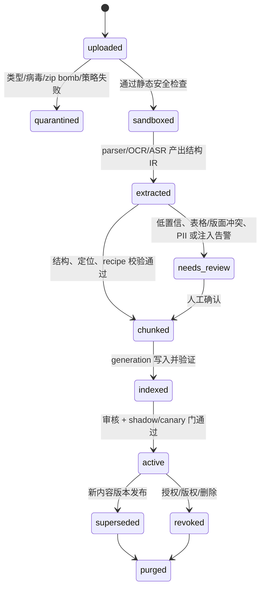

# 全格式 RAG（检索增强生成；检索证据后生成）语料平台

## 缩略语阅读卡

完整术语表见 [统一术语](/ai-docs/product/glossary.md)。本页使用：`RAG（检索增强生成；连接授权证据与模型输出）`、`PDF/DOCX/XLSX/PPTX（PDF、Word、Excel、PowerPoint 文件格式；各自有页/表/单元格/幻灯片定位）`、`MIME（文件声明类型；需由文件头复核）`、`OCR（光学字符识别；图片文字提取）`、`ASR（自动语音识别；音视频转写）`、`VLM（视觉语言模型；图片/图表辅助理解）`、`IR（中间表示；解析后的结构化内容）`、`ACL（访问控制列表；决定谁可读证据）`、`CAS（比较并交换；版本指针并发切换）`、`PII（个人可识别信息；需要脱敏与受控存储）`、`E2E（端到端测试；验证摄取到引用全链路）`与`P95（第 95 百分位延迟；95% 请求不超过的耗时）`。

## 1. 目标与非目标

目标是一个统一的、可治理的语料平台，而不是“把附件转成一段字符串再 embed”。它接收 PDF、DOCX、XLSX、PPTX、图片/图文、音频、视频、网页和人工录入内容，保证任何被模型引用的事实都能回到**原件的版本和精确位置**。

题库是这个平台的消费者之一：运营导入的面经、岗位资料、技术文档、评分 rubric 经审核和结构切块后进入 RAG；“某一道训练问题”是带难度、能力标签、rubric、版本和证据 chunk 引用的业务工件。题目不能代替来源文档，也不能一题只对应一个向量。

非目标：把尚未通过沙箱、解析质量和标注集门的格式伪装成“已支持”；把可变业务知识靠微调永久写进模型；允许模型只返回一个不可解释的 `ref_id`。

## 2. C 端和 B 端的价值

| 用户 | 输入 | 得到的结果 | 必须能回跳 |
| --- | --- | --- | --- |
| C 端候选人 | 简历、作品集、项目 PPT、面试复盘录音 | 基于自身材料的追问、缺口和学习建议 | 简历页/段、作品集 slide、录音时间点。 |
| B 端招聘方 | JD、岗位知识库、评分 rubric、培训资料 | 可审计的候选人评估与题目建议 | JD 版本、rubric 条款、来源附件定位。 |
| 运营/内容专家 | 面经、技术规范、Excel 题库、课程视频 | 可审核发布、撤销、改版、质量报表 | 原始来源、审核记录、每个 chunk 的结构位置。 |

## 3. 必需领域对象

| 对象 | 关键字段 | 不可缺失的不变量 |
| --- | --- | --- |
| `source_document` | `document_id, tenant/scope, source_kind, status, current_content_version` | 原件身份不随切块或 embedding 改变。 |
| `source_artifact` | 加密对象 URI、SHA-256、MIME、页/时长、扫描状态 | 原件只由授权服务读取；绝不进日志或 prompt。 |
| `extraction_run` | parser/OCR/ASR/VLM 版本、沙箱镜像、输入 hash、质量信号、错误 | 同一输入可复跑；低质量不是成功。 |
| `structural_element` | `element_id, kind, normalized text, source_locator, parent/order` | 表、slide、图片框、说话人片段保留结构和定位。 |
| `corpus_chunk` | `chunk_id, document/version, recipe, ordinal, locator[], content hash, status` | 每一块至少一个可解析 locator；chunk 可从原件/结构层重建。 |
| `rag_citation` | response/run、chunk、document/version、locator snapshot、excerpt hash | 改版后旧引用仍显示“基于 vN”，不静默跳到新内容。 |
| `question_artifact` | 题干、标签、rubric、required_evidence_chunk_ids、版本 | 题目可替换；来源 evidence 仍是独立治理对象。 |
| `eval_dataset/eval_run` | split、qrels、fixture revision、recipe/model、指标、成本 | 调参集和 holdout 绝不混用。 |

## 4. 状态机与接口边界

`POST /corpus/documents` 只受理并创建异步 `ingest_task`；它不在 HTTP 请求中 OCR、ASR、embed 或激活。`GET /corpus/documents/:id/versions/:v/locator?...` 在服务端做 ACL 后返回短时签名的只读定位资源。`POST /questions` 只能引用 active、可见的 evidence chunk；它不直接写向量表。

## 5. 当前代码边界（2026-08-03）

| 能力 | 当前实装 | 不可宣传为已完成 |
| --- | --- | --- |
| 简历 PDF/DOCX/图片 | PDF 文本层、DOCX 原始文本、图片 OCR，含字节/文本上限、同意、PII 脱敏、计费幂等与 RLS。 | PDF 版面/table locator、扫描 PDF 分页 OCR、PPT/Excel/视频。 |
| 共享 qbank | approved source、撤销、不可变 embedding generation、RRF、cache、evidence 二次可见性检查。 | 通用文档的多 chunk source、chunk locator、问题与 evidence 的多对多关系。 |
| 结构切块核心 | `chunkStructuredDocument` 已对表格行组、slide、图文 OCR、媒体时间轴做确定性切块及 13 条 proof。 | 它尚未接入存储/解析 adapter；不是“全格式已上线”。 |

在专用 adapter 未接入前，`/resume/file` 对 XLSX/PPTX/音视频/未知二进制返回 `415 unsupported_file_format`，不再把二进制按 UTF-8 误入库。这是防数据污染的临时正确行为。

## 6. 分期交付和验收

| 阶段 | 交付 | 量化验收 |
| --- | --- | --- |
| P0 事实与安全地基 | 原件加密、AV/DLP、异步 sandbox、IR、locator、版本/CAS、删除 tombstone | 不支持类型 100% 显式拒绝；citation locator resolve 率 100%；跨 tenant 返回数 0。 |
| P1 Office/文档 | PDF/DOCX/XLSX/PPTX adapter、表格/slide 结构提取和 review queue | 标注样本的表头-行关联、页/slide 定位、解析失败率按格式报告；未达阈值不得 active。 |
| P2 图文/音视频 | OCR/VLM、ASR、说话人/时间轴、视频关键帧与 OCR 对齐 | 每个转写 chunk 都有开始/结束毫秒；低置信段不自动作事实；同意与保留期可审计。 |
| P3 题库 RAG 重构 | source document→chunks→question artifact、旧 qbank 蓝绿迁移、影子评测 | 一题能引用 ≥1 evidence chunk；撤销源后相关题目/证据不可检索；旧 generation 可 pointer rollback。 |
| P4 质量发布 | 冻结 qrels、shadow、canary、人工抽检、监控 | 所有硬门通过且每个指标报告分子/分母/区间、P95 和成本。 |

每阶段的阈值与数据集定义见 [全格式 RAG 评测协议](../../testing/full-format-rag-evaluation.md)。
