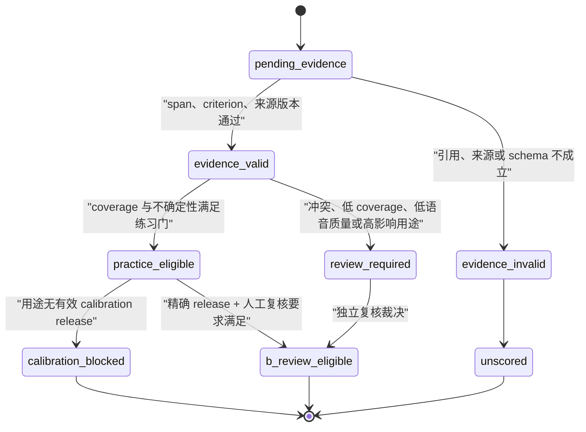

# 面试评分测量、校准与高影响决策边界

## 1. 目的、范围与当前阻断

本用例定义的是“评分测量系统”，不是让模型返回一个看似精确的 `0..100` 数字。它覆盖候选人练习反馈、报告、能力画像和 B 端招聘辅助；不授权自动录用、自动拒绝、自动排序或把练习分数解释为人的固定能力。

当前运行时只保存一个模型给出的整数分、自由文本 criterion 与答案引文 span。范围、逐字引文和幂等可以证明链路没有明显格式错误，但不能证明 criterion 与分数的语义正确、题间难度可比较或总分已校准。遗留 `POST /interview/:id/answer` 的固定 `68` 分旁路已关闭，B 端数值分也已进入迁移 `0082` 的暂停方案。`2026-08-13` 的 `pnpm scor-00:http:prove` 在完整 87 个迁移的隔离 PostgreSQL 中，以独立 provision 的低权 runtime login 跑真实 Nest/Fastify HTTP，验证活动 C/B 面试、重放、并发、伪造 body 与跨主体调用均为 `410`，并且事件、队列、消费、报告、assessment 和申请状态/分数增量均为 0。该回执仍为本地 `releaseEvidence=false`：它只关闭公开伪评分旁路的本地组合根验收，不证明评分测量、校准或 B 端可比排序。

`SCOR-00` 关闭了公开伪评分旁路；`SCOR-00H` 让转写/评估/职业路径/SSE 在证据或 identity 不足时 fail-closed（不伪造 0、不映射 B 端分）。二者都不能替代评分事实根。`SCOR-01/02` 目前被 `INT-TRANSCRIPT-00/01` 阻断：在可删除、可复验的 canonical answer artifact、删除授权和逐 sink receipt 经真实组合根验证前，不得创建 ScoreCard 生产迁移或评分写路径。题目发出时答案尚不存在，因此不得把未来的 `answerId/hash/version` 填入“已发题合同”；必须拆成 issue 阶段合同与提交后答案版本/评分请求。

在 `SCOR-00`、`SCOR-01`、`SCOR-02` 和 `SCOR-07` 验收前：

- C 端分数只能显示为“本轮练习反馈”，必须带 rubric 版本、证据完整度和状态；
- B 端不得按模型原始分数做自动终态、排序、通过线或人才库筛选；
- `unscored`、`review_required`、`calibration_blocked` 与 `evidence_invalid` 不是 `0` 分，也不得参与任何均分；
- 不得以增加调用次数、随机重试或模型自报 confidence 替代测量设计。

## UC-SCOR-00 · 停用遗留伪评分入口

- **角色 Actor**：求职者、B 端招聘方、面试 worker、系统维护者。
- **前置 Precondition**：系统存在历史 `POST /interview/:id/answer` 兼容入口；唯一允许推进面试的路径是已绑定 `questionId/stateVersion/turn` 的 `POST /interview/:id/turn`。
- **触发 Trigger**：任何客户端、脚本或重放请求访问遗留 `/answer`。
- **主流程 Main**：
  1. Controller 仅解析面试 ID 与调用 principal，不读取或解释 legacy body。
  2. Service 直接返回固定错误 `410 legacy_endpoint_disabled`。
  3. 系统不预留权益、不调用模型、不追加 `interview_event`、不写 report/assessment/application 投影。
  4. 合法 `/turn` 仍由 question identity、答案 claim、worker graph、幂等和评分 gate 处理。
- **备选流 Alternate**：历史客户端收到 `410` 后升级到 `/turn`；服务端不提供把旧 body 自动转写为新 answer 的兼容转换。
- **异常流 Exception**：
  - **E1 重复请求**：重复或重放均为相同 `410`，无任何账本变化（事件日志原语）。
  - **E2 并发冲突**：多个并发 legacy 请求均无写入，不能与 worker 的 `/turn` 提交竞争（CAS/幂等原语）。
  - **E3 越权**：不得因该端点返回面试状态、题目或分数；身份校验沿用统一 API 边界（RLS/不泄露原语）。
  - **E4 失败回滚**：返回 `410` 不发生 reserve、confirm、release 或模型 attempt，无需补偿。
  - **E5 降级**：worker、模型或数据库不可用时仍不把 legacy 请求降级为固定分数；错误边界保持 `410`。
  - **E6 超时/断线重连**：断线重试仍不会产生副作用；客户端只能按新契约恢复当前 question identity。
- **后置 Postcondition**：遗留端点不改变 Interview、ConsumptionRecord、interview_event、assessment_report、ai_report 或 job_application。推进面试的唯一公开写路径是 `/turn`；worker 仍写 `answer_evaluated`（含练习 hint `.score`）。ScoreCard 生产写路径未在自适应 graph 启用。
- **验收 Acceptance**：真 HTTP 测试覆盖活动 C/B 面试的单次、重复和并发 legacy 调用，断言均为 `410`，以及两个调用主体的所有消费账本、事件、消费、报告、assessment/B 端分数的增量均为 0；合法 `/turn` 正常推进。HTTP app 必须使用独立 provision 的低权 runtime login，迁移/fixture 连接不得被当作 production identity 证据。
- **关联**：`POST /interview/:id/answer`（retired）、`POST /interview/:id/turn`；Interview、ConsumptionRecord、ScoreCard（目标）；事件日志、CAS、principal-scoped 幂等、RLS；`SCOR-P0-001`。
- **七类覆盖**：正常、异常、特殊、逃逸通道、高并发、复杂、刁钻。

## UC-SCOR-00H · 消费面诚实闸（无证据不得伪造分）

- **角色 Actor**：求职者、B 端招聘方、面试 API、C 端 SSE 归约。
- **前置 Precondition**：`UC-SCOR-00` 已关闭公开 `/answer` 旁路；C 端仍可能收到 `answer_evaluated.score` 作为 SSE 进度 hint。**设计上** ScoreCard 是练习分权威，但**当前生产自适应 graph 不调用 `writeFinalScoreCard`**，转写/assessment 读卡常为空。B 端申请分仍由迁移 `0082` 置空。worker 完成 `eligible` 计数与 `markApplicationNoEligibleScore` **仍读 event `.score` hint**，本闸未改这两处。
- **触发 Trigger**：转写/评估/职业路径/SSE 归约要展示或聚合分数，或调用方试图把 event/report 分映射成 B 端 overall。
- **主流程 Main**：
  1. 域闸 `packages/domain/src/scoring-honesty.ts`：只接受 canonical `questionId=q-v{stateVersion}-t{turn}-c{n}` 且交叉字段一致，并绑 `answerId`（UUID）+ `answerHash`（64 hex）+ `competency`。
  2. `answer_evaluated.score` 只可经 `practiceHintFromEvaluated` / web `practiceHintScore` 变成练习 hint；二者都要求 question identity **+ answer claim**。`refuseMappedBSideScore` 是域侧恒失败函数（proof 覆盖），**不拦截** worker 完成判定或 B 端 `markApplicationNoEligibleScore`。
  3. 空评估：domain 抛 `score_aggregate_empty`；API `409 no_scorable_cards`（不落 `overall=0`）；career `409 insufficient_evidence`。
  4. 转写只列出 `isTrustedScoreIdentity` 的事件，分数只读 `listScorableScoreCards`（当前仍含 `practice_eligible` **和** `b_review_eligible`），无卡为 `null`，不读 `payload.score`。
  5. C 端 SSE：弱绑定、漂移、错题、缺 answer claim → 不展示 `lastScore`，相位仍 `answered`。`report_ready.overall` 非 0..100 整数则不写入视图 report；**已是合法整数时仍可展示**（untrusted display，不是测量权威）。
- **备选流 Alternate**：若已有可评分 ScoreCard，`POST assessment` 走既有 `deriveAssessment`；SSE 仅在 hint 与当前发题 identity **且** answer claim 齐全时展示练习分。生产自适应路径通常无卡，`POST assessment` 保持 `409 no_scorable_cards`。
- **异常流 Exception**：
  - **E1 重复请求**：同一 identity 的 practice hint 重放字节等价；不另写 B 端分（幂等 / 事件日志）。
  - **E2 并发**：错题 identity 贴分 → `forged_mapped_score`；不能与他题 ScoreCard 交叉（CAS/身份原语）。
  - **E3 越权**：本闸不改变 RLS；跨 owner 读卡仍为 0（既有 ScoreCard RLS）。
  - **E4 失败回滚**：空集抛错，不落 `assessment_report.overall=0`；career 不把 null 写成 junior。
  - **E5 降级**：证据不足 → 域 `assessment_unavailable` / `insufficient_evidence`；HTTP 写路径为 `409 no_scorable_cards`（assessment）或 `409 insufficient_evidence`（career），不是把页面自动切到 `assessment_unavailable`。
  - **E6 超时/断线**：重放无 identity 的历史 `answer_evaluated` 不得补展示分。
- **后置 Postcondition**：域 `trustedBSideScore` 在本闸恒为 `null`；C 端无身份事件不产生可展示分；空评估 POST 不落 0。`GET assessment` / `GET career-path` **不**重跑该闸（历史行原样返回）。
- **验收 Acceptance**：`pnpm scor-00-honesty:prove`（域七类）与 `pnpm web:prove`（SSE 无身份/缺 answer claim/错题不展示分）。**未**跑隔离 HTTP 对 transcript/assessment/career 的组合根；**不**重跑 `scor-00:http:prove`。不宣称测量质量或发布。`releaseEvidence=false`。
- **关联**：`GET /interview/:id/transcript`、`POST /interview/:id/assessment`、`POST /interview/:id/career-path`、SSE `answer_evaluated`；ScoreCard、JobApplication；事件日志 + 身份原语；`SCOR-00`、ADR-0020。
- **七类覆盖**：正常、异常、特殊、逃逸通道、高并发、复杂、刁钻。
- **明确不做**：不改 worker 完成判定与 `markApplicationNoEligibleScore` 仍读 event.score 的 hint 计数；不在生产 graph 写 ScoreCard；不开放 B 端数值；不把 golden-task / fake model 标成质量通过；不改写 SCOR-01/02 清单状态（生产 writer 仍未接线）；不把 `listScorableScoreCards` 收窄到仅 `practice_eligible`；不给 `GET assessment`/`GET career-path` 补闸；不对 `question_ready` 走 `webTrustedQuestionIdentity`（发题身份仍是可选字段）。

## 2. 领域对象与不可变边界

| 对象 | 最小字段 | 约束 |
| --- | --- | --- |
| `IssuedQuestionContract` | owner、interview、question/state/turn、question content hash、published rubric/criterion、difficulty/form、language、route/cohort、prompt/model-policy、measurement version、privacy epoch | 仅在发题时创建；**不含尚不存在的答案 ID/hash**；发布后不可原地改写。 |
| `AnswerVersion` / `ScoreRequest` | canonical artifact reference、answer HMAC、submission receipt、issued contract、privacy epoch、operation/policy version、permit/fence | 仅在提交已被 canonical artifact 接收后追加；同一 request 只可领取一次；删除/撤权先赢则 fenced，已派发 unknown 不自动重发。 |
| `QuestionRubric` | `questionId`、`rubricVersion`、能力、难度、criterionId、权重、行为锚点、上限规则、语言适用范围 | 发布后不可原地改写；题目、rubric、难度与版本一起冻结。 |
| `ScoreEvidence` | `criterionId`、`sourceAnswerId`、规范化 span、span digest、判定档位、缺失/冲突原因 | span 与 digest 必须在当前答案版本中复验；自由文字不能代替 criterionId。 |
| `ScoreCard` | `answerId`、`questionId`、`rubricVersion`、`measurementVersion`、分项、确定性总分、coverage、uncertainty、状态、provenance | 追加写；更正以新版本 `supersedes` 旧版本，不覆盖历史。 |
| `CalibrationRelease` | 数据集版本、双盲标注版本、切片、模型/提示词/rubric 版本、批准用途、有效期 | 只允许已批准的精确组合进入对应用途；过期或版本漂移立即失效。 |
| `ReviewCase` | scorecard、触发原因、最小授权审阅者、裁决、审计事件 | 人工裁决是独立版本，不回填为模型输出。 |

`QuestionRubric`、`ScoreCard` 和 `CalibrationRelease` 都是测量证据，不保存为任意 prompt 的可编辑 JSON。候选人答案、问题、检索资料和模型输出均是不可信数据，不能越过 rubric、授权或隐私边界。

## 3. 状态机与使用门

允许状态转换只能由受控写路径完成。issue 阶段只校验 `question identity + published rubric + policy/cohort + privacy epoch`；submission 阶段才以 `canonical artifact + AnswerVersion/ScoreRequest + permit` 绑定答案。删除、撤权、答案替换、问题撤销或 rubric 失效必须使尚未派发的评分、复核和 B 端投影失效；派发后的未知结果保持未知，不得自动重发或补造分数，迟到结果必须在写卡前重新校验 permit、epoch 与 contract。

## 4. 七类业务用例与验收

| ID | 类别 | 场景 | 必须满足的结果 |
| --- | --- | --- | --- |
| SCOR-M1 | 正常 | 已发布 rubric、已发题合同、已接受 canonical artifact 与合法 evidence | 唯一 `AnswerVersion/ScoreRequest` 获 permit；服务端复验后至多追加一张 `practice_eligible` card。 |
| SCOR-E1 | 异常 | schema、来源 span、artifact hash、rubric、policy 或版本不匹配 | `evidence_invalid` 或 `unscored`；ScoreCard、报告、能力画像与 B 端投影增量均为 0。 |
| SCOR-E2 | 特殊 | 无已发布 rubric、LLM 生成题、跳过、ASR 低质量、回答不完整 | `score_excluded`、`clarification_needed` 或 `review_required`；不把系统或输入质量问题伪装为候选人零分。 |
| SCOR-E3 | 逃逸通道 | legacy `/answer`、原始 SQL、旧 worker、伪造 question/event、跨 owner | 旁路不能创建或消费 ScoreCard；runtime、checkpoint、报告 worker、`PUBLIC` 均无 writer 权限。 |
| SCOR-E4 | 高并发 | 双标签页、同答案重放、答案版本替换、worker takeover、评分/删除/撤权竞态 | 每个 ScoreRequest 至多一个终态 card；删除或撤权先赢时 card/projection=0，迟到 provider 结果不得写回。 |
| SCOR-E5 | 复杂 | route/cohort、题型/难度、语言、rubric/prompt/model 版本漂移或证据冲突 | 不混算、回填或跨 cohort 比较；低置信或分歧进入 review。 |
| SCOR-E6 | 刁钻 | 注入、复制题干、Unicode span、未知 provider、ACL/RLS/owner 漂移、删后 SSE/read | 注入按数据处理；span/digest 复验；writer 启动失败关闭；删后 card、SSE 和所有消费者读取为 0。 |

## 5. 评分与置信度合同

1. 每题至少由题库给出可版本化的 criterion、行为锚点、权重、硬上限和难度标签。模型不允许输出自由总分。
2. 模型的职责限于“证据是否支持某一有限档位”；每个非空结论必须返回 `criterionId + source span + span digest + disposition`。
3. 服务端在数据库内验证 rubric 成员、span、答案版本、重复 span、required criterion 和 hard cap，并用确定性公式聚合。没有足够证据则无分，不取模型猜测的中性分。
4. `uncertainty` 是独立的、多来源字段：证据 coverage、来源完整性、语音质量、模型分歧、适用语言、rubric 难度、calibration release 和人工复核状态分别保存。模型自报 confidence 只可作观察信号，不能单独解锁用途。
5. 未经桥接评测不得比较不同模型、提示词、rubric、语言或难度 cohort 的原始分数。初期报告优先展示分项证据、改进建议和“不可比较”标记，而不是跨题简单均分。

## 6. 成本、模型与降级

评分不应让每一个节点无条件调用大模型。推荐顺序如下，具体模型绑定以 `MODEL-OP-00…03` 完成后才能生效：

| 步骤 | 默认执行器 | 允许的副作用 | 失败语义 |
| --- | --- | --- | --- |
| question/answer identity、长度、跳过、注入、span/hash、公式聚合 | 确定性代码 | 0 次模型调用 | 明确拒绝、澄清或 `unscored`。 |
| rubric criterion 证据抽取 | 受限的低成本文本模型 | 至多一次已登记 attempt | 结果未知不重发；转 `unscored` 或 review。 |
| 高风险/抽样复核 | 独立模型或人工 | 仅按风险、分歧、抽样或 B 端用途触发 | 不覆盖原结果；新增 scorecard/review 版本。 |
| 报告叙事 | 文本模型 | 只能消费已通过用途门的 scorecard | 不重新猜总分；失败只使报告不可用。 |

题目生成、评分、报告、语音、OCR、embedding 和记忆派生各自有 operation 预算、最大 attempt、成本计量和降级；供应商请求已派发后无自动模型替换。任何模型调用前必须冻结输入、rubric、用途与预算，调用后只可将同一冻结版本结算。

## 7. 校准与 B 端高影响边界

校准不是调一个及格线。每个拟用于 B 端的组合都必须有独立、冻结、双盲人工标注集，并按岗位、语言、题目难度、模态、候选群体和异常输入切片报告至少：分项一致性、总分误差、排序一致性、拒答正确性、申诉推翻率、缺失率和置信区间。分歧必须经过预先定义的仲裁，不能用平均标签掩盖。

在 `CalibrationRelease` 明确批准前，B 端只可得到“assessment unavailable / requires review”，不能读取候选人可比较的总分。即使 release 存在，自动录用、自动拒绝和自动阈值淘汰仍不在本用例授权范围内；B 端最多消费经人工复核的辅助材料，并有用途、组织、职位、同意与保留期校验。

## 8. 测试与发布清单

| 子项 | 已发现 | 已实现 | 已验证 | 已关闭 | 关闭验收 |
| --- | :---: | :---: | :---: | :---: | --- |
| SCOR-00 关闭公开伪评分旁路 | ☑ | ☑ | ☑ | ☑ | `pnpm scor-00:http:prove` 真实 HTTP 证明 `/answer` 与旧公开 contract 不写事件（C/B、重放、并发、跨主体调用后事件/消费/队列/报告/assessment/B 端申请增量均 0）；随 SCOR-01/02（rubric/measurement 版本）闭合，本项遗留关切解除。 |
| SCOR-00H 消费面诚实闸 | ☑ | ☑ | ☑ | ☐ | **已验证范围**= domain 21 断言 + `web:prove` SSE 归约，不是隔离 HTTP 组合根。无可信 identity / 空 ScoreCard 不得伪造 0；SSE hint 需 question+answer claim。**未接线**：`GET assessment`/`GET career-path` 不重跑闸；`listScorableScoreCards` 仍含 `b_review_eligible`；`report_ready` 合法整数仍可展示；worker eligible 与 `markApplicationNoEligibleScore` 仍读 event hint。未重跑 `scor-00:http:prove`。`releaseEvidence=false`，不关闭测量/校准，不改 SCOR-01/02 状态。 |
| SCOR-01 版本化 rubric 与两阶段事实根 | ☑ | ☑ | ☑ | ☑ | 迁移 `0100` `scoring_fact_root` + 独立 re-audit PASS：issue 合同 schema 层无 answer* 列（铁律）、submission 才绑 canonical artifact(0092)+HMAC+receipt、supersede 补 rubric/weight 校验 + fence 重校验、跨 owner 读=0、原地 UPDATE/DELETE 拒绝；64 断言全绿。 |
| SCOR-02 确定性聚合、writer 与消费迁移 | ☑ | ☑ | ☑ | ☑ | 迁移 `0103` `scoring_deterministic_aggregation` + 独立 re-audit PASS：5 处 C 消费面全切 ScoreCard 只读路径、专用 score-writer/permit/verifier、legacy event 聚合=0、跨 owner=0；59 断言全绿。残 LOW：`answer_evaluated.score` 未结构性根除（归 SCOR-03）。 |
| SCOR-03 证据、冲突与不确定性 | ☑ | ☐ | ☐ | ☐ | 复验答案 span/digest、required coverage、语言/ASR/模型分歧；任一冲突进入 review 或 unscored。 |
| SCOR-04 评分 operation 路由与成本 | ☑ | ☐ | ☐ | ☐ | 确定性步骤外呼=0；评分一次、选择性复核有独立 attempt/计量；unknown 自动重发=0。 |
| SCOR-05 冻结金标与稳定性评测 | ☑ | ☐ | ☐ | ☐ | 真实当前评分入口跑单调性、改写、跑题、注入、Unicode、语音和多语言切片；报告分母、区间、版本和失败例。 |
| SCOR-06 校准与人工复核 | ☑ | ☐ | ☐ | ☐ | 双盲、仲裁、holdout、版本桥接、申诉和漂移策略通过批准；没有数据时状态保持 `inconclusive`。 |
| SCOR-07 B 端用途硬门 | ☑ | ☐ | ☐ | ☐ | 无 calibration/review 的分数不能影响申请、列表、人才库、通知或导出；跨组织、撤权和删除后读取=0。 |
| SCOR-08 运行时证明 | ☑ | ☐ | ☐ | ☐ | 真实生产组合根与受控模型 transport 证明每个状态、并发、未知、删除和落库分支；本地 fixture 不替代质量或发布证据。 |

## 9. 明确不做

- 不做“多调用几个模型后取平均”的伪稳定方案。
- 不用模型生成的总分或自评 confidence 作为 B 端授权根。
- 不将 scorecard、答案、金标或复核材料写入无用途、无保留期、无删除回执的长期记忆。
- 不以测试夹具、合成数据结构门或单次本地回执宣称评分质量、招聘公平性或生产发布已通过。
