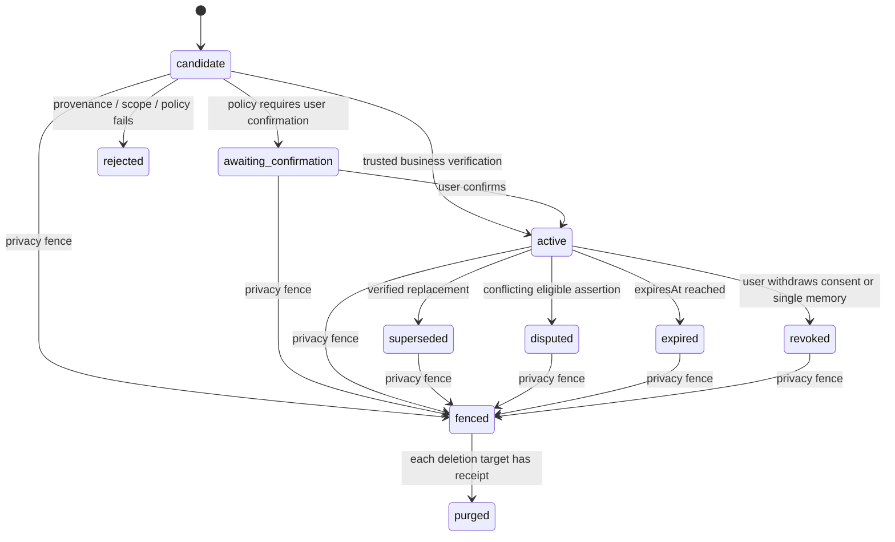

# 受控记忆准入、冲突治理与两阶段召回

> 当前运行时只有 lean memory：题面精确去重与历史弱项软排序。本规格不表示已经存在自由对话事件库、长期事实、向量召回或记忆管理 API。`PRD-TEST-013`、`MEM-00` 未关闭前，跨会话 event、summary、fact、embedding、cache 与 snapshot 的生产写入保持禁用。

## 1. 范围、非目标与共同不变量

首期只覆盖 **C 端个人自由对话**。现有面试评分、招聘候选人、B 端 tenant 数据、通用管理员浏览和“随手传入 `projectId` 的共享记忆”不在首期范围。未来 Project 必须先具备稳定父实体、成员关系、转移、撤回和删除规则，才可以成为记忆边界。

记忆的范围必须拆为 `dataSubject`（内容关于谁）、`controllerScope`（谁控制保留与撤回）、`accessPrincipalContext`（谁正以什么成员关系访问）和 `thread/project boundary`（哪个会话/项目允许共享）。同一平台账号、同一 tenant 成员或向量相似都不是跨边界访问理由。

所有写入与状态改变遵守四个承重原语：

- 以范围、对象版本和前态为条件的 CAS；0 行即竞争失败，回查而不覆盖。
- 每个采集、确认、撤回、索引和 snapshot 命令带服务端幂等键，并与 CAS 同事务提交。
- 数据库 RLS 与受控过程先按授权 snapshot 过滤，普通 runtime 不直接读原文、事实或向量表；可写 GUC 只能路由，不能作高风险授权根。
- candidate、确认、冲突、过期、撤回、索引切换、snapshot 与删除均追加有序审计事件；checkpoint 不是记忆事实源。

### 1.1 最小元标签与状态机

每个 event、summary、fact、embedding 和 cache entry 至少绑定：

```text
controllerScope, dataSubject, scopeKind, thread/project boundary,
purpose, allowedDataClass, consentRevision, privacyEpoch, retention/expiresAt,
sourceType, sourceEntityId, immutableSourceVersion, eventSeq/sourceRange,
sourceArtifactDigest, spanLocator, normalizationRecipeVersion,
producerClass, extractionRecipeVersion, verificationRecipeVersion,
status, policyVersion, contentDigest, embeddingRecipe/generation, language
```

`spanLocator` 固定为 UTF-8 byte offset 或 Unicode code-point offset 二选一；所有 writer、validator、renderer 使用同一坐标。JavaScript UTF-16 下标不得进入持久化契约。



`sourceTrust`、`extractionConfidence`、`verificationState`、`freshness/expiresAt`、`salience` 和 `retrievalScore` 是不同字段。检索分数只排序本次候选，不能提高事实可信度；模型不能凭自己输出把 candidate 升为 active。

## 2. UC-MEM-01 · 受控事件产生候选记忆并治理冲突

- **角色 Actor：** C 端用户、受控采集服务、summarizer、事实验证器、memory reviewer、privacy authorizer。
- **前置 Precondition：** 服务端已验证当前会话身份、个人 controller scope、允许 purpose、consent revision、privacy epoch 和保留期；来源 event 或业务事实有不可变版本与加密工件摘要。当前系统未满足这些前置，故本 UC 尚不实现。
- **触发 Trigger：** 用户明确要求记住/确认一项事实，或受信业务事实完成校验后请求生成候选记忆。模型摘要只能提出 candidate，不能绕过本 UC。
- **主流程 Main：**
  1. 服务端创建 authorization snapshot，固定 actor、data subject、controller scope、用途、允许数据类别/来源范围、consent revision、privacy epoch、有效期和操作；不接受客户端 `owner/purpose/project/factKey` 作为事实。
  2. 受控过程读取来源的 immutable version，重算 source artifact digest，验证 source range、span、normalization recipe 与 RLS；来源缺失、被删除、范围不符或 span 不可验证时零写入。
  3. 分类器按 policy version 生成候选的 `factKey`、分类、有效期、保留级别、`sourceTrust` 与 `extractionConfidence`；这些字段均标明 producer/recipe，不能覆盖原始来源。
  4. 在同一 `controllerScope + dataSubject + purpose + factKey` 下，以 CAS 检查活跃版本和冲突关系：单值 key 只保留一个 active；多值 key 依 policy 显式并存；冲突候选写 `contradicts`/`supersedes`，不静默覆盖。
  5. 模型候选进入 `candidate` 或 `awaiting_confirmation`；用户确认或受信业务验证才可转 `active`。事实状态、来源关系、policy decision 与幂等回放结果在同一事务追加审计事件。
  6. 仅 `active`、未过期、仍同意且允许 embedding 的版本进入冻结 source manifest；indexer 后续另行构建 generation，不能直接由采集服务写 active 向量。
- **备选流 Alternate：** 用户可把自己的 candidate 修正为新值；系统创建新版本与 `supersedes` 关系，旧版本保留审计后转 `superseded`，不就地改写内容。
- **异常流 Exception：**
  - **E1 重复请求：** 同一授权范围、来源版本、policy version 和幂等键重放，读回首个 candidate/decision；不多写事实、关系、审计或 embedding manifest。机制：唯一键 + 与状态 CAS 同事务。
  - **E2 并发冲突：** 100 个同 `factKey` 的确认、修正、撤回或过期竞争时，只有一个状态迁移获胜；其他请求回查终态。机制：范围键上的唯一约束、CAS 与有序事件。
  - **E3 越权与范围逃逸：** 个人用户、tenant 成员、招聘候选人或 runtime 伪造另一个 subject/controller scope/project/purpose，读取与写入均为 0；无 RLS principal 同样为空。机制：服务端 snapshot + DB RLS + 不接受客户端范围字段。
  - **E4 来源或验证失败：** source digest/span、schema、policy、加密工件或用户确认失败时，candidate 变 `rejected` 或根本不建行；不发 embedding、不改变旧 active 事实。机制：验证前置 + 状态机 + 追加审计。
  - **E5 降级：** 抽取模型不可用、置信不足、分类未知或冲突未决时，保留原 event（若保留规则允许）而不写 active memory；必要时请求用户确认。不得把低置信 summary 当长期画像。
  - **E6 超时/断线重连：** 验证器在外部模型调用后得到 unknown 时不自动同键重发或升级；只留下可对账的 candidate/attempt，重连按幂等键读回。用户确认响应丢失时只重放同一结果。
- **后置 Postcondition：** 每个 candidate/active/superseded/disputed/expired/revoked/fenced 状态都有来源、范围、policy/recipe、版本和审计账本；无任何未经确认的模型输出作为 active 事实。
- **验收 Acceptance：** 单值事实最多一个 active；冲突、纠正、过期与撤回可追溯；跨 user/tenant/C-B 范围写读均为 0；无效 source/span/digest 时 embedding 与模型输入增量均为 0。
- **关联：** 未来受控命令（HTTP 路径待产品契约确定）· event/summary/fact/index generation 状态机 · CAS/幂等/RLS/事件日志 · 删除、授权快照与数据分类规则。

### UC-MEM-01 七类测试矩阵

| 类别 | TC | 测试层 | 必测断言 |
| --- | --- | --- | --- |
| 正常 | `TC-MEM-001-main` | 隔离 PostgreSQL + controlled source fixture | 用户确认的有效来源成为唯一 active fact；source、范围、policy、审计完整。 |
| 特殊 | `TC-MEM-001-S1` | DB + Unicode fixture | 中文、emoji、NFC/NFD、代码块与转写文本的 span/digest 一致；UTF-16 偏移被拒绝。 |
| 异常 | `TC-MEM-001-E1` | 100 次幂等重放 | candidate/关系/审计/manifest 精确各一份，回放结果相同。 |
| 高并发 | `TC-MEM-001-E2` | 100 并发 CAS | 同 key 的确认/纠正/撤回/过期只有一个线性化终态；无双 active。 |
| 逃逸通道 | `TC-MEM-001-E3` | RLS + raw SQL + API contract | 伪造 owner、tenant、purpose、sourceId、factKey、无 principal、C/B 边界均 `0` 行/拒绝；普通 runtime 无表直读。 |
| 复杂 | `TC-MEM-001-M1` | provenance DAG + reindex fixture | summary claim 只指向 summary、来源被修订或 source digest 不符时，父 summary/fact 全部失活且不入 generation。 |
| 刁钻 | `TC-MEM-001-T1` | 时钟/撤回/崩溃注入 | 过期扫描迟到、时区/DST、确认后崩溃、确认与删除竞争、模型 unknown 均不令过期/撤回/未确认事实进入 active。 |

## 3. UC-MEM-02 · 两阶段召回、元标签筛选与冻结上下文

- **角色 Actor：** C 端用户、memory runtime、受控检索函数、模型调用网关、privacy authorizer。
- **前置 Precondition：** 请求路由确实需要跨 turn 或跨会话上下文；服务端能签发当前 authorization snapshot；目标 memory/index generation 已经过 `UC-MEM-01` 的 active、未过期、未撤回校验。当前生产路径不具备这些条件。
- **触发 Trigger：** 自由对话任务在模型派发前请求受限上下文；评分、支付、删除、权限或招聘决策不得以该 UC 的 semantic fact 作为唯一业务真相。
- **主流程 Main：**
  1. runtime 从服务端获得 snapshot，固定 access principal、data subject、controller scope、thread/project boundary、purpose、允许类别/来源、consent revision、privacy epoch、membership/share-grant revision、操作、有效期和预算；客户端不传最终范围。
  2. 数据库受控检索函数先以所有元标签硬过滤，再在过滤后的集合执行向量 + 关键词候选检索。禁止“全局 Top-K 后应用层过滤”。
  3. runtime 逐条水合候选的来源版本和指定 span，重算 digest，复查当前 RLS、membership/share grant、consent/purpose/privacy epoch、状态、`expiresAt`、冲突关系、数据类别与长度预算。
  4. 任何复查失败的候选被拒绝并记录 reason code；不能用缓存、旧 summary 或旧 index generation 回退补足。仅通过材料按不可信数据围栏渲染。
  5. runtime 创建 `ContextSnapshot`，冻结候选集、拒绝原因、被选来源版本、授权/范围版本、检索与重排序 policy、预算、renderer version 与渲染 digest。同一轮崩溃恢复只消费同一 snapshot；新的候选只影响下一轮。
  6. 模型派发事务再次检查 snapshot 的 consent/privacy/scope/membership/purpose/expiry；围栏先赢则 snapshot `voided`、派发为 0。派发先赢则仅按模型删除账本处理，不能投影过期或已撤回 memory 为业务事实。
- **备选流 Alternate：** 没有足够可信且可见的材料时，系统仅使用最近完整 turns、受控业务真相或请求澄清；“无记忆可用”是允许结果，不能为了填充上下文扩大 scope。
- **异常流 Exception：**
  - **E1 重复请求：** 同一 turn/snapshot key 重放时只读同一已冻结选择；不因索引更新或分数波动另选内容。机制：snapshot 唯一键 + 幂等回放。
  - **E2 并发冲突：** recall、水合、撤回、generation 切换与多个 resume 并发时，snapshot 只由一个 CAS winner 发布；其他结果丢弃或读取已发布 snapshot。机制：范围/版本 CAS + generation manifest。
  - **E3 越权与范围逃逸：** 个人、tenant、candidate、已退出 project/member 或无授权主体的 memory、vector、cache、snapshot 均不可命中；相同 user 是 tenant member 也不扩大个人 scope。机制：服务端 snapshot + RLS + DB 预过滤 + cache 复核。
  - **E4 水合或校验失败：** vector hit 的 source 已修订、撤回、删除、过期、span 越界、digest 不符、冲突或分类不允许时，最终模型输入增量为 0。机制：二阶段水合 + fail-closed rendering。
  - **E5 降级：** 检索、rerank、index generation 或 hydration 不可用时，不读取全局旧 cache；以最近完整 turns、业务真相或澄清降级，并保留原因码。不得使用未验证 embedding 命中。
  - **E6 超时/断线重连：** snapshot 已建立但模型派发未知时不创建第二个 snapshot 或自动重发；重连读取同一 snapshot/调用终态。撤回或授权版本变化在 cache 命中后、派发前发生时派发数为 0。
- **后置 Postcondition：** 模型看到的每一条长期材料都可回溯至仍可见、未过期的来源 span；实际使用集、拒绝原因和渲染摘要被 ContextSnapshot 固化；高影响业务状态不由语义召回直接决定。
- **验收 Acceptance：** 跨范围 recall=0；命中后来源失效/撤回/删除/过期则模型输入=0；相同 snapshot 重放字节等价；旧 vector/cache/generation 不可复活已撤回材料。
- **关联：** 未来 `recall` / `ContextSnapshot` 受控命令（HTTP 路径待定）· index generation/snapshot/模型调用状态机 · CAS/幂等/RLS/事件日志 · 模型派发隐私围栏。

### UC-MEM-02 七类测试矩阵

| 类别 | TC | 测试层 | 必测断言 |
| --- | --- | --- | --- |
| 正常 | `TC-MEM-002-main` | 隔离 PostgreSQL + retrieval component | DB 元标签预过滤 → hybrid candidate → 水合复核 → snapshot；模型输入只含来源卡片。 |
| 特殊 | `TC-MEM-002-S1` | 预算/renderer component | 近期完整 turn、tool 对、摘要与来源卡片按预算选择；不完整 tool 对不被截半。 |
| 异常 | `TC-MEM-002-E1` | snapshot replay | 同 turn 重放只返回同 snapshot；index 分数或 active generation 改变不改变已冻结输入。 |
| 高并发 | `TC-MEM-002-E2` | 20 resume + revoke/generation race | 一个 snapshot 发布；撤回先赢时派发=0；CAS 输家不写新 snapshot。 |
| 逃逸通道 | `TC-MEM-002-E3` | 跨 user/tenant/C-B/project/cache RLS | 同 user 的个人/tenant/candidate 数据互相 recall=0；未来 project 的退出、转移、删除后旧 vector/cache=0。 |
| 复杂 | `TC-MEM-002-M1` | barrier hydration + model dispatch | 向量命中后、hydration 前修订/撤回/过期/删除，最终 snapshot 和 provider input 都为 0。 |
| 刁钻 | `TC-MEM-002-T1` | generation/cache/clock/failure injection | 旧 generation、缓存命中、DST/时钟边界、rerank 超时、provider unknown 均 fail-closed 或确定性降级；无全局回退。 |

## 4. UC-MEM-03 · 用户纠正、撤回与受控管理

- **角色 Actor：** C 端用户、memory reviewer、memory policy releaser、privacy authorizer、privacy worker。
- **前置 Precondition：** 用户仅可管理自己 controller scope 下且服务端确认归属的记忆；普通 runtime、租户管理员和 policy releaser 均不具原文直读/直改权。
- **触发 Trigger：** 用户查看来源、确认/纠正 candidate、撤回一条事实、暂停采集、遗忘一个会话或请求删除全部 memory；运营方发布经审批的 policy/recipe 或重建 index generation。
- **主流程 Main：**
  1. 服务端按当前授权 snapshot 解析 scope 与可管理对象；管理界面只返回最小来源卡片、状态和删除进度，不暴露其他主体或原文。
  2. “纠正”创建包含用户确认来源的新版本，并以 CAS 将旧 active 标为 `superseded` 或 `disputed`；禁止 `UPDATE content` 覆盖旧证据。
  3. “撤回/遗忘”提升同一 privacy/consent 版本，先将 event、summary、fact、generation、cache 与 snapshot 围栏，再建立逐 sink deletion target；物理删除完成前保持 `pending_external` 或 `partial_failed`，不得冒充 completed。
  4. policy/reindex 只从冻结且仍授权的 manifest 构建 shadow generation；验证通过后以 CAS 切换 active，旧 generation 在受控窗口退役。policy releaser 默认不可读用户正文。
- **备选流 Alternate：** 用户可仅暂停未来采集而保留已确认事实；该命令不改变历史事实，但后续新 event 不得生成 candidate。
- **异常流 Exception：**
  - **E1 重复请求：** 同一纠正、撤回、删除或 policy 发布幂等键只产生一个版本/请求/target 集，并回放进度。机制：唯一键 + 同事务 CAS。
  - **E2 并发冲突：** 纠正与撤回、reindex 与删除、两次 policy 激活竞争时，只有满足前态/epoch 的一个状态转换成功；其余回查。机制：CAS、幂等键、删除围栏。
  - **E3 越权与范围逃逸：** 用户、tenant 成员、reviewer、releaser、worker 不能用通用读写表权限管理他人内容；所有未授权 direct table access 为 `0/42501`。机制：RLS、专用角色与受控过程。
  - **E4 删除或外部回执失败：** 本地/外部 target 失败写目标级原因和 receipt，request 进入 `pending_external/partial_failed`；旧内容保持 fenced，不允许回到 active。机制：删除状态机 + 目标 CAS + 追加事件。
  - **E5 降级：** 没有可验证原文、删除能力或管理授权时，界面只报告不可用/等待人工处理，不开放“尽力遗忘”写操作。
  - **E6 超时/断线重连：** 管理命令响应丢失时按幂等键回放；reindex/删除 worker 中断后只能领取同一 target/generation 状态，不得重新启用旧内容。
- **后置 Postcondition：** 用户修正、撤回、暂停与删除均可审计；所有派生物和缓存按同一 epoch 围栏；运营策略变更不成为读取正文的后门。
- **验收 Acceptance：** 单条撤回后 recall=0；删除后所有 generation/cache/snapshot/provider target 都可枚举；管理员/运营角色越权正文读取=0；失败不复活旧 active 事实。
- **关联：** 未来用户管理与隐私受控命令（接口待定）· fact/index/deletion 状态机 · CAS/幂等/RLS/事件日志 · `PRD-TEST-013` 删除授权前置。

### UC-MEM-03 七类测试矩阵

| 类别 | TC | 测试层 | 必测断言 |
| --- | --- | --- | --- |
| 正常 | `TC-MEM-003-main` | 隔离 PostgreSQL + privacy worker fixture | 用户纠正产生新版本；单条撤回先 fence 后 recall=0；目标清理有 receipt。 |
| 特殊 | `TC-MEM-003-S1` | generation management component | shadow generation 验证后 CAS 切换；旧 generation 不能被新请求读取。 |
| 异常 | `TC-MEM-003-E1` | 100 次幂等管理命令 | 版本、删除 request、target 与审计各一份，进度可重放。 |
| 高并发 | `TC-MEM-003-E2` | revoke/reindex/correction race | 删除先赢时新 generation、snapshot、模型派发=0；只有一个合法状态迁移。 |
| 逃逸通道 | `TC-MEM-003-E3` | role/RLS/raw SQL | user、tenant member、reviewer、releaser、runtime 和 worker 对不允许对象均无法读写；无通用 admin bypass。 |
| 复杂 | `TC-MEM-003-M1` | all-sink deletion fixture | event、summary、fact、embedding、generation、cache、snapshot、trace/provider target 均被枚举；未知 locator 使 request 非 completed。 |
| 刁钻 | `TC-MEM-003-T1` | crash/lease/receipt tamper | 删除/重建中断、旧 lease、重复外部回执、篡改 receipt、policy 发布后马上撤回均不复活内容。 |

## 5. 实现门禁与当前结论

本规格已覆盖正常、异常、特殊、逃逸通道、高并发、复杂和刁钻七类用例；但**代码门禁仍为 BLOCKED**：

1. `MEM-00` / `PRD-TEST-013` 的不可伪造删除授权、撤回、逐 sink target 与外部回执尚不存在。
2. 当前 `user_memory`、consent 和 `app.principal_user` 形状不足以承载或授权这份契约。
3. Project 还没有稳定领域模型，不能实现 project-scoped memory。
4. 当前模型网关、长期事件源、向量 generation、snapshot 与管理角色均未接线。

在上述前置完成并通过本页全部 TC 前，只能继续运行现有 lean memory；不得以数据库列、embedding job、mock Top-K 或静态文档勾选宣称 L5 已上线。
