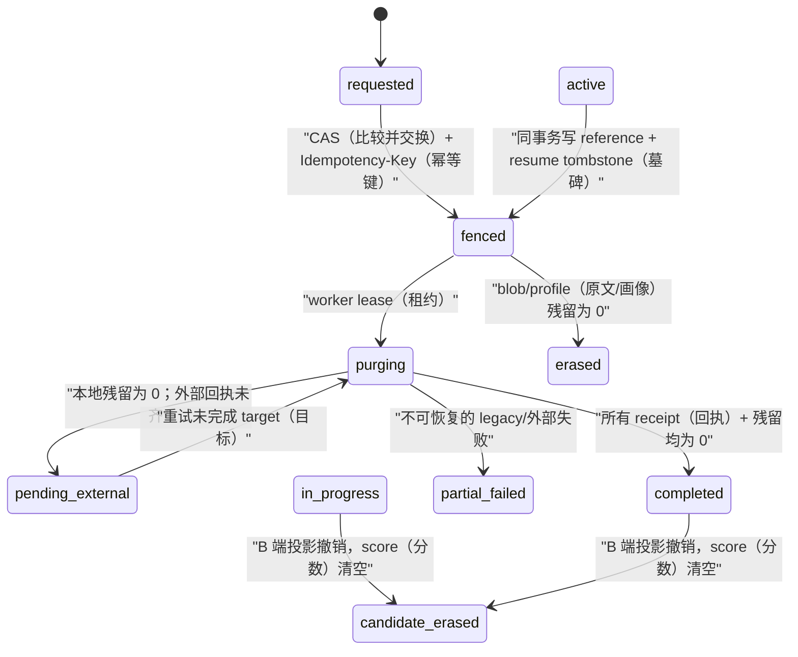

# 简历擦除关联快照、围栏与招聘投影撤销

> 这是旧简历删除入口的替代契约，完整状态机尚未实现。两个旧硬删除入口 `DELETE /privacy/resume-data` 与 `DELETE /resume/:id` 已改为 HTTP（超文本传输协议）503 fail-closed（故障关闭）；在稳定 C/B 端关联、不可变 target snapshot（目标快照）、异步 receipt（回执）、并发围栏以及**不可伪造的删除授权快照**完成前，它们不写任何数据，也**不得**被当作“完整简历擦除”发布能力。面试 checkpoint（检查点）删除曾使用的 `app.principal_user`（应用主体路由 GUC）不是可复用授权根：`0075` 已暂停其公开受理，`0076` 会隔离升级前尚未终态的旧 target（目标），`0077` 只恢复专用 worker（后台进程）的最小 dispatch（派发）读面，`0078` 则防止暂停父请求下的 target（目标）被重新 list/claim/purge（列出/领取/清理）；四者均不构成可用删除能力。单简历受理必须由独立授权签发器验证短时、单对象、一次性 capability（能力），而不是复制该形状。迁移 `0049` 增加普通 C 端 `interview.resume_id`（面试简历标识）和 start job（开始任务）`resume_id`；`0052→0055` 提供快速扩展、可分批历史分类、短锁和索引安全门。迁移 `0064` 再把每个新 C/B 面试绑定到不可变的 `(resume_id, privacy_epoch)`（简历标识、隐私世代）：v64 start（开始）任务保存同一对；v64 answer（回答）任务只保存 `privacy_epoch`，不保存简历 locator（定位器）。历史 version 49、50 或 NULL（空值）行无论表面引用是否匹配，都在任何图副作用前显式失败并走既有释放终态，绝不回退解析。其余删除状态机仍须以本文驱动数据库迁移、共享接口契约、真实 worker（后台进程）端到端（E2E）测试和专家复审。

## 1. 目标、非目标与不可变边界

### 1.1 本能力的目标

候选人对**一份**简历发起擦除请求后，系统在一个短事务内：

1. 从受约束的 `interview.resume_id`（面试简历标识）与三类队列的 `resume_id`（简历标识）找出该简历驱动的所有面试和任务，并在请求受理时写入不可变删除快照；不再从可变 job payload（任务载荷）猜测。
2. 对该简历写 `erasure_fenced`（已围栏）墓碑，阻止新 begin（开始）、新 enqueue（入队）、worker 解密和图续跑；已领取任务必须在每次读取敏感源前重新校验围栏。
3. 将 `resume_blob`（加密原文）与 `resume_profile`（脱敏结构化画像）物理删除；保留一个不可恢复的 `resume.status='erased'` 墓碑行，以保持已存在的 B 端不可变外键、结算账本与审计引用完整。墓碑不得保留原内容 HMAC（哈希消息认证码）、原件 locator（定位符）、画像、向量或可还原 PII（个人信息）。
4. B 端（企业端）所有引用该简历的 `job_application`（岗位申请）变为 `candidate_erased`（候选数据已擦除）且 `score=NULL`；招聘方经 RLS（行级安全）读取这些行数为 0，不能再从列表、人才库、SSE（服务器发送事件）或旧报告恢复结果。候选人仍只能看到不含 PII 的请求回执。
5. 财务账本、消费与退款记录不物理删除；它们只保留不可逆伪标识和金额/时间/状态，且绝不被擦除请求改写金额或重复退款。

### 1.2 明确不做

- 本能力不是账号注销，也不删除与该简历无关联的其他面试、答案、记忆或招聘申请。
- OSS（对象存储服务）、Redis/Tair（托管 Redis）、Langfuse（模型观测服务）、备份和向量库的真实删除执行器不在本次数据库迁移内；它们必须是单独的 `privacy_deletion_target`（隐私删除目标）与回执，不得因本地行删除而宣称 completed（已完成）。
- 不用 `ON DELETE CASCADE`（删除级联）删除 `interview`（面试）、`job_application`（岗位申请）或财务表；那会破坏 B 端尝试世代、防止迟到 worker（后台进程）写入的 fencing（围栏）与账务对账。

## 2. 领域对象、关系和状态机

### 2.1 稳定引用列与请求快照

稳定关系先由业务表承重，再由不可读的删除 locator（定位器）表冻结请求时的目标集合；不能只建一个旁路关联表而让生产者继续从 JSON（JavaScript 对象表示法）取来源。

| 业务表 | 必须新增/调整的稳定列与约束 | 写入点 |
| --- | --- | --- |
| `interview`（面试） | 普通 C 端允许 begin（开始）时一次 `NULL → (resume_id, resume_privacy_epoch)`（简历标识、隐私世代），之后不可变；B 端仍要求 `application_id/job_id/resume_id` 四元组完整；`privacy_state`（隐私状态）与单调 `privacy_epoch`（隐私世代） | C 端 begin、B 端 startApplicationInterview（开始岗位面试）同事务 |
| `interview_job`（面试任务） | `resume_id uuid`（通用唯一标识符）与 `resume_privacy_epoch`；v64 start（开始）任务必须与 parent（父面试）的 ID/epoch 精确相等，v64 answer（回答）任务只保存相同 epoch 且不得有 locator（定位器），两者均不得从 JSON 保存/恢复来源定位 | enqueue（入队）同事务 |
| `quiz_job` / `diagnosis_job`（押题/诊断任务） | 各自 `resume_id uuid`（通用唯一标识符）+ owner（所有者）复合外键 + `privacy_epoch` | 各自 begin（开始）同事务 |

请求受理时，`privacy_resume_target`（简历删除目标）与 `privacy_interview_target`（面试删除目标）是 `privacy_deletion_target`（隐私删除目标）的不可读子表：它们只保存当时的 `resume_id`（简历标识）、`interview_id`（面试标识）、owner（所有者）、版本/epoch（世代）和 B 端尝试标识，不能把这些 locator（定位器）放进 API（应用程序接口）可读 JSON（JavaScript 对象表示法）。

每个 `privacy_interview_target`（面试删除目标）至少有：

| 字段 | 约束 | 用途 |
| --- | --- | --- |
| `target_id`、`request_id` | 与通用 target（目标）/request（请求）一对一 | lease（租约）、receipt（回执）与幂等复用现有框架 |
| `owner_user_id`、`resume_id`、`interview_id` | 与面试/简历 owner（所有者）双重校验 | RLS、anti-IDOR（防越权对象引用）与擦除扫描 |
| `binding_kind`、`application_id/attempt` | `c_interview` / `application_interview` | C 端与 B 端不同的投影撤销策略、旧 attempt（尝试）围栏 |
| `source_version`、`privacy_epoch` | 创建时的 `resume.version`（简历版本）和图/任务世代 | 防 worker（后台进程）/补偿任务把已删内容读回 |

写入点必须是同一事务：C 端 `InterviewService.begin`（开始面试）一次写入 `interview.(resume_id,resume_privacy_epoch)`（简历标识、隐私世代），再由 enqueue（入队）从 parent（父面试）派生 v64 start 或 answer 的同一 epoch；B 端 `startApplicationInterview`（开始岗位面试）创建 `interview`（面试）时写入该对。历史 B 端从不可变 `interview.resume_id` 回填，历史 C 端仅可从已验证的 start job（开始任务）回填，不能解析任意 answer（回答）载荷。未能验证的历史行标 `legacy_unresolved` 并使请求 `partial_failed`（部分失败），不能静默漏删。

### 2.2 状态机

`resume.status` 需从现有 `{uploaded, ingesting, ingested, failed}` 扩展为含 `erasure_fenced`、`erased` 的显式状态；上传去重不得把同内容的墓碑恢复成已摄取简历。恢复只能新建不同 id（标识）并走重新同意/摄取，不能重新激活旧 id。

## 3. UC-RES-ERASURE-01 · 擦除一份已关联 C/B 面试的简历

- **角色 Actor（参与者）**：候选人。
- **前置 Precondition（前置条件）**：候选人拥有一份简历；它可被 C 端面试、B 端岗位面试、排队 job（任务）或已完成评分引用。
- **触发 Trigger（触发）**：`DELETE /privacy/resumes/:resumeId`，必须含 `Idempotency-Key`（幂等键）；高风险“立即执行”版本另需确认令牌，不能沿用旧的无目标全删接口。
- **主流程 Main（主流程）**：
  1. API（应用程序接口）在 owner RLS 事务中锁定 resume（简历）与其 references（关联），校验该简历可见且 `status != erased`。
  2. 以 `(owner, idempotencyKeyHash)` 唯一键创建/重放 `privacy_erasure_request(scope='resume_data', subject_id=resumeId)`；同键不同目标返回 `409`（冲突）。
  3. 同一事务把 resume 与所有 reference（关联）CAS 迁为 fenced，取消未开始的 start job（开始任务）并清除其 `resumeId`（简历标识）载荷；对运行中的任务提升 fence epoch（围栏世代）。
  4. 对每个 B 端 `job_application`（岗位申请）清空 score（分数）并迁为 `candidate_erased`；数据库策略保证 recruiter（招聘方）此后查询为 0 行。若该面试仍 reserved（已预留），调用现有 paired release（配对释放）原语一次；已 confirmed（已确认）只去标识、不退款。
  5. 建立本地 `blob/profile` 与外部 `oss/redis/langfuse/vector` targets（目标），返回 `202 Accepted`（已接收）+ `fenced`（已围栏）。
  6. 独立 worker（后台进程）持 lease（租约）删除本地内容、读回残留为 0、把 resume 置为 `erased`（已擦除墓碑）；外部回执未齐时请求保持 `pending_external`（等待外部完成）。
- **备选流 Alternate（备选流程）**：已 `erased` 的同 key（同一幂等键）返回原 receipt（回执）；新 key 只返回当前 tombstone（墓碑）状态，绝不重新执行或恢复简历。
- **异常流 Exception（异常流程）**：
  - **E1 重复请求**：100 个相同 key（键）并发只建 1 request（请求）、每 reference 只围栏一次、退款 release（释放）最多一次；机制为唯一键 + 行锁 + CAS。
  - **E2 并发冲突**：begin（开始）、startApplicationInterview（开始岗位面试）、enqueue（入队）与删除并发时，CAS winner（胜者）后二者读取 tombstone（墓碑）并返回 `409 resume_erasure_fenced`；旧 job（任务）领取后再读 blob（原文）也被 epoch（世代）校验拒绝。
  - **E3 越权**：owner B（所有者 B）对 owner A（所有者 A）的 `resumeId`（简历标识）得到 `404`，request（请求）/reference（关联）/target（目标）新增数均为 0；机制为 RLS + definer（受控权限函数）中 owner 双校验。
- **E4 失败与账务**：只有受理时的短 fencing（围栏）事务可以整体回滚：快照、墓碑、B 端投影撤销、取消未开始 job（任务）或 reserved（已预留）权益的 paired release（配对释放）任一失败时，该短事务不得提交。短事务一旦提交，任何 worker（后台进程）或外部 sink（数据落点）失败都必须保留 fenced（已围栏）状态和已完成 receipt（回执），只重试未完成 target（目标）；绝不能为了“整笔回滚”重新开放原简历、旧任务或 B 端可见投影。confirmed（已确认）账本不退款，reserved（已预留）只允许一次 release（释放）。
  - **E5 降级**：外部 sink（数据面）不可用时本地内容仍可删，request（请求）留 `pending_external`（等待外部完成）；不可返回 completed（已完成）或把失败吞掉。
  - **E6 超时/断线重连**：客户端在 `202`（已接收）前断线后以同 key（键）重放得到同一 `requestId`（请求标识）；worker（后台进程）租约过期仅重做未 receipt（回执）的 target（目标），不能双删/双退款。
- **后置 Postcondition（后置条件）**：简历实体为 `erased`（已擦除）墓碑；正文/画像残留为 0；关联 job（任务）不可再读取来源；招聘方可见行数为 0；财务账本保留且金额不变；request（请求）有事件与每个 target（目标）回执。
- **验收 Acceptance（验收）**：每一项在 §4 的真实数据库/HTTP/worker 测试中可观测，不接受只断言 `200`/`202`（状态码）或 mock（模拟）外部返回。
- **关联**：目标 HTTP 契约、`privacy_erasure_request`（隐私删除请求）、`resume_interview_reference`（简历—面试关联）、`interview_job`（面试任务）、`ai_graph_run`（图运行记录）、`job_application`（岗位申请）；原语为 RLS、Idempotency-Key（幂等键）、CAS、lease（租约）、append-only event（追加事件）。

### 七类测试覆盖

| 类别 | TC（测试用例） | 测试层 | 可量化验收 |
| --- | --- | --- | --- |
| 正常 | `TC-RES-ERASURE-01-main` | 隔离 PostgreSQL + HTTP + worker | 1 request、references 全 fenced、blob/profile 残留均为 0、B 端读取数=0 |
| 异常 | `TC-RES-ERASURE-01-E1` | 100 并发 HTTP | request=1、每 target=1、release=0 或 1（按原状态） |
| 特殊 | `TC-RES-ERASURE-01-S1` | 数据库 | 已擦除墓碑、无关联、`legacy_unresolved` 三分支均明确状态；没有隐式成功 |
| 逃逸通道 | `TC-RES-ERASURE-01-E3` | 两个低权登录 + RLS | 跨 owner request/reference/target/B 投影读写均=0 |
| 高并发 | `TC-RES-ERASURE-01-E2` | worker + API 并发 | 删除提交后的 blob 解密=0、开始 job 领取=0、迟到 graph（图）投影=0 |
| 复杂 | `TC-RES-ERASURE-01-M1` | B 端申请 + C 端面试 + reserved/confirmed | B 端列表/SSE/报告可读数=0；金额/confirmed 状态不变；reserved 精确释放 1 次 |
| 刁钻 | `TC-RES-ERASURE-01-E4/E5/E6` | 故障注入 + 重连 | 所有已成功 target 不回滚；external 未回执数>0 时 status 不为 completed；重连 `requestId` 恒定 |

## 4. 实施顺序与发布门

1. **先规格和 schema（数据库结构）**：`0049/0052–0055` 完成普通 C 端稳定来源绑定、非阻塞扩展/批量分类/短锁门禁与索引安全检查；`0064` 将所有新面试升级为 v64 的 parent `(resume_id,resume_privacy_epoch)`（父面试的简历标识、隐私世代）引用。运行时禁止从 JSON（JavaScript 对象表示法）任务载荷回退；v64 start 只有父面试精确匹配才可解密，v64 answer 必须无 locator（定位器）但有同一 epoch。2026-08-10 的本地隔离 worker 回执 `2026-08-10T09-48-14-515Z-35060-256a90bd-1e60-40b7-ad56-da31ebb85967.json` 记录 32/32 断言通过，且 v49/v50/NULL job（仅载荷或表面匹配）在模型调用/解密/检查点登记/图运行=0 下终结，job=`failed`、终态事件=1、额度释放=1；该回执 `releaseEvidence=false`。它仍不是删除状态机。仍需新增关联快照表、resume tombstone（墓碑）状态、B 端 `candidate_erased` 状态、冻结 trigger（触发器）和 RLS（行级安全）；补历史回填的 `legacy_unresolved` 统计。没有这些后续结构，不替换为真正删除接口。
1. **先授权、规格和 schema（数据库结构）**：恢复任何 destructive（破坏性）端点前，独立 privacy API（隐私应用程序接口）必须验证签名 `AuthorizationSnapshot`（授权快照）：`actor/owner/resumeId/currentPrivacyEpoch/operation/expiry/idempotencyHash/JTI`（参与者/所有者/简历标识/当前隐私世代/操作/过期/幂等摘要/一次性令牌标识）全部绑定；JTI 与 request（请求）在一个事务内消费。普通 `app_role`（应用运行角色）和 worker（后台进程）不拥有该签发私钥，也不得以可写 GUC（会话配置）替代。随后才使用 `0049/0052–0055` 的稳定来源绑定、非阻塞扩展/批量分类/短锁门禁与索引安全检查；`0064` 将所有新面试升级为 v64 的 parent `(resume_id,resume_privacy_epoch)`（父面试的简历标识、隐私世代）引用。运行时禁止从 JSON（JavaScript 对象表示法）任务载荷回退；v64 start 只有父面试精确匹配才可解密，v64 answer 必须无 locator（定位器）但有同一 epoch。2026-08-10 的本地隔离 worker 回执 `2026-08-10T09-48-14-515Z-35060-256a90bd-1e60-40b7-ad56-da31ebb85967.json` 记录 32/32 断言通过，且 v49/v50/NULL job（仅载荷或表面匹配）在模型调用/解密/检查点登记/图运行=0 下终结，job=`failed`、终态事件=1、额度释放=1；该回执 `releaseEvidence=false`。它仍不是删除状态机。仍需新增关联快照表、resume tombstone（墓碑）状态、B 端 `candidate_erased` 状态、冻结 trigger（触发器）和 RLS（行级安全）；补历史回填的 `legacy_unresolved` 统计。没有这些后续结构，不替换为真正删除接口。

### 4.1 稳定引用门的安全发布顺序

该门不是“直接跑迁移”即可发布。发布系统必须以失败关闭（fail-closed，故障关闭）方式执行：先暂停 C/B begin（开始）与 answer（回答）写入口、排空 interview consumer（面试消费者）并确认没有未过期 lease（租约）；再按顺序应用 `0052`、`0053`、`0054`、`0055` 和 `0064`，随后部署理解 v64 的 API（应用程序接口）与 worker（后台进程），在恢复写流量前执行低权 HTTP（超文本传输协议）和 worker E2E（端到端）回归。`0055` 只接受一条 public（公共模式）表上的 `CREATE INDEX CONCURRENTLY IF NOT EXISTS`，默认构建时限 300 秒，可通过 `MIGRATION_CONCURRENT_INDEX_TIMEOUT_MS` 配置到 30–900 秒；表、键列、谓词、B-tree（B 树）访问方法、`UNIQUE`（唯一）属性及索引有效/就绪/存活标志任一不符都不能写 migration ledger（迁移账本）。若超时或发现无效/错定义索引，禁止盲目重跑：先以迁移身份核验目录，再由获授权运维在目标库执行受控的 `DROP INDEX CONCURRENTLY`（并发删除索引）、重新运行并保存新的回执；应用运行器绝不自动删除物理索引。`0064` 后旧 API（应用程序接口）会因新写门被拒绝，故不能与其并发恢复写流量；v49/v50/NULL 只允许排空时安全终结，不会复活。恢复消费后以 `classify_legacy_interview_job_reference_batch(1..10000)` 分批分类，每批超时 2 秒、记录批大小/用时/剩余 NULL 数。只有分类达到稳定、低权 E2E（端到端）通过后，发布才可解除阻断。任一锁/分类/低权测试失败，发布保持阻断而不是跳过。该暂停/排空/回填收敛流程目前仍是人工 runbook（运行手册），尚未实现持久化 release gate（发布门）；因此不能被自动部署或云端发布采信。
2. **再所有写入口**：C/B 开始路径同事务写 reference（关联）；enqueue（入队）、claim（领取）、blob decrypt（原文解密）、graph fence（图围栏）全部读取 tombstone（墓碑）。
3. **再异步 worker（后台进程）**：按 target lease（目标租约）物理清理/读回/receipt（回执）并让 B 端投影状态机与消费账本在一个事务收口。
4. **最后替换 HTTP（超文本传输协议）接口**：旧 `DELETE /privacy/resume-data` 已 fail-closed（故障关闭，HTTP 503），不得继续同步删除；新 endpoint（端点）只接受单个 `resumeId`（简历标识）与 `Idempotency-Key`（幂等键）。

以下任一项未通过则不得声称“简历删除已完成”：`TC-RES-ERASURE-01-main/E1/E2/E3/E4/E5/E6/M1/S1` 全部有可复跑 receipt（回执）；外部数据面真实回执齐全；云端 target grant（目标授权）测试通过；历史 `legacy_unresolved=0` 或被明确 `partial_failed`（部分失败）并进入人工处理，不能静默跳过。

### 4.2 先行硬化门：墓碑与直接删除权限

完整 executor（执行器）尚未完成前，先行 migration（迁移）只能做以下可逆以外的安全收口，**不得**开放新的 HTTP（超文本传输协议）删除入口：

| 项 | 数据库约束 | 验收 |
| --- | --- | --- |
| 直接删除 | 撤销 `app_role`（应用运行角色）对 `resume`、`resume_blob`（加密原文）与 `resume_profile`（结构化画像）的 `DELETE`（删除）权限；普通业务只能经受控 worker（后台进程）未来的 target（目标）流程删除 | 两个低权登录直接 `DELETE` 均拒绝，行数与 request（请求）数均不变 |
| 墓碑状态 | `resume.status` 扩展 `erasure_fenced`（已围栏）与 `erased`（已擦除）；单调 `privacy_epoch`（隐私世代）从 `1` 起；`erased` 不能回到任何可读取/摄取状态 | 直写墓碑/复活均被 trigger（触发器）拒绝；普通摄取仍只能在原有 active（活跃）状态机内转移 |
| 内容指纹 | `content_sha`（内容 HMAC，哈希消息认证码）在 `erased` 时必须为 `NULL`（空值）；唯一性改为只覆盖 `uploaded/ingesting/ingested/failed` 的非空 HMAC，墓碑永不参与上传去重 | 擦除后的同文本上传只能得到新 UUID（通用唯一标识符）；旧墓碑不保留 HMAC |
| 权限边界 | `erasure_fenced → erased` 只能由未来受审查的 privacy worker（隐私后台进程）在已存在的不可读 target（目标）与 receipt（回执）条件下执行；该阶段没有给 `app_role` 授予任何 begin（受理）函数权限 | 低权 SQL（结构化查询语言）不能伪造 request、target、fence（围栏）或完成态 |

该门只降低“直删绕过、墓碑复活和内容 HMAC 遗留”风险；它不生成 `privacy_resume_target`（简历删除目标）、不清理 blob/profile（原文/画像），也不接收用户删除请求。因此实现后仍必须保持旧 `DELETE /privacy/resume-data` 与 `DELETE /resume/:id` 为 `503 fail-closed`（故障关闭），且不得把本门写作“完整简历删除”。下一阶段才增加稳定的 quiz（押题）/diagnosis（诊断）/OCR（光学字符识别）引用、不可读的 snapshot（快照）目标与单简历受理函数。

当前实现回执：`0060_resume_erasure_tombstone_foundation.sql` 的基础约束已连同后续读取门在 64 个迁移后的隔离 PostgreSQL（关系型数据库）运行 `pnpm resume-erasure:foundation:prove`，`4/4` 通过、失败 `0`，本地回执为 `.tmp/isolated-proof-receipts/2026-08-10T09-54-13-028Z-57659-43b93c4c-3cc6-4e89-87a1-3d024e92637c.json`，标记 `releaseEvidence=false`。证明范围仅为 direct-delete（直接删除）拒绝、墓碑状态/epoch（世代）伪造拒绝、partial unique index（部分唯一索引）不复活墓碑，以及已围栏/已擦除状态下 low-privilege（低权限）SQL（结构化查询语言）读取 blob/profile（原文/画像）=0、旧解密 helper（辅助函数）拒绝；不证明任何简历内容已经物理删除。

### 4.3 派生任务稳定引用门：押题与诊断

`0061` 将 `resume_quiz`（押题）/`resume_diagnosis`（诊断）以及各自 job（任务）的旧 text/JSON（JavaScript 对象表示法）来源扩展为 `resume_id uuid`（通用唯一标识符）+ `privacy_epoch`（隐私世代）+ `reference_schema_version=61`（引用结构版本）。旧 text 列改名为 `legacy_resume_id`（历史简历标识），旧 payload（载荷）保留为不透明历史记录，**不**转换、不猜测、不回退解析。新 begin（开始）在预留权益前读取 owned + ingested（本人且已摄取）的简历及世代，将同一 tuple（元组）写入 parent（父实体）与 job；目标岗位只存 parent 行，不再存 job JSON。

| 边界 | 已实现的数据库/worker（后台进程）规则 | 量化验收 |
| --- | --- | --- |
| 新任务 | `app_role`（应用运行角色）不能插入 legacy（历史）版本、缺少 reference（引用）或与 parent 不相等的 tuple | 低权 SQL（结构化查询语言）三类伪造均拒绝 |
| 领取 | claim（领取）只返回 id（标识）、parent id（父实体标识）、`resume_id`、epoch（世代）和版本，绝不返回 JSON payload | 领取结果不含 `payload` 字段 |
| 历史任务 | NULL（空值）/非 61 版本或缺 tuple 的 job 在 decrypt（解密）、graph（图）、checkpoint（检查点）和 model（模型）前终结；同一状态转换清空 payload，并按既有幂等账本 release（释放）权益 | 两类历史任务的模型调用=0、原 payload 残留=0、failed（失败）实体=2、终态事件=2、释放额度=2 |
| 解密 | 押题/诊断只能通过带 owner（所有者）+ epoch 的 `decryptActiveResumeBlob`（活动简历解密）读取；同一事务持有 `resume-privacy`（简历隐私）advisory lock（顾问锁） | 后续 erase（擦除）实现必须使用同一锁，不能把“先检查、后解密”当围栏 |
| 共享 SSE | `0062` 将 `interview_event`（面试事件）围栏限定到真实 interview（面试）流；quiz（押题）/diagnosis（诊断）流仍必须匹配自己的 owner，不能借同名 stream（流）跨租户写入 | 历史任务可以发出各 1 条终态事件，同时不放开已围栏面试事件 |

当前实现回执：`pnpm resume-derivative-reference:prove` 在 64 个迁移后的隔离 PostgreSQL（关系型数据库）通过 `3/3`、失败 `0`，本地回执为 `.tmp/isolated-proof-receipts/2026-08-10T09-54-17-673Z-50341-4653edfc-f6b2-4ad2-88c2-09997b295e68.json`，`releaseEvidence=false`。它证明上述引用和历史终结门，**不**证明单简历擦除 HTTP（超文本传输协议）接口、B 端 `candidate_erased`（候选数据已擦除）、blob/profile（原文/画像）物理删除、模型供应商回执或外部数据面删除。

### 4.4 先行读取门：已围栏简历不得再读取正文或画像

单简历受理函数尚未开放，因此本节不是“已经删除”的声明。它先收紧一个可独立验证的逃逸通道：任何 owner（所有者）即使仍能看见自己的 tombstone（墓碑）行，只要 `resume.status`（简历状态）不是 `ingested`（已摄取），也不能经普通 `app_role`（应用运行角色）`SELECT`（查询）、旧 `decryptResumeBlob`（简历原文解密）或 profile（结构化画像）查询取得 `resume_blob`（加密原文）/`resume_profile`（结构化画像）。

| 操作 | 被允许状态 | 原因 |
| --- | --- | --- |
| blob/profile（原文/画像）读取与更新 | 仅 `ingested`（已摄取） | `erasure_fenced`（已围栏）/`erased`（已擦除）后，迟到 repository（仓储）路径不得再把内容带出 PostgreSQL（关系型数据库） |
| blob 写入 | 受 owner RLS（行级安全）约束的创建阶段 | 上传先建加密 blob（原文）再完成摄取，不能误伤正常摄取 |
| profile 写入 | 受 owner RLS（行级安全）约束的 `ingesting`（摄取中）阶段 | `completeIngestion`（完成摄取）同事务先写画像再迁移到 `ingested`（已摄取） |
| blob/profile 删除 | `app_role`（应用运行角色）永远不允许 | 只留给未来独立 privacy worker（隐私后台进程）的 receipt（回执）协议 |

迁移 `0063_resume_active_content_read_gate.sql` 已替换 blob/profile（原文/画像）原先“只核 owner”的读取策略；它不依赖 API（应用程序接口）控制器，也不把 `erasure_fenced`（已围栏）伪称 `erased`（已擦除）。其隔离 PostgreSQL（关系型数据库）回执为 `pnpm resume-erasure:foundation:prove` 的 `4/4`、失败 `0`，`.tmp/isolated-proof-receipts/2026-08-10T03-33-14-161Z-14823-12c22539-f951-407e-9542-c86015d880aa.json`，`releaseEvidence=false`。完整受理前还必须补齐 interview（面试）/report（报告）/语音/model（模型）外送的 resume epoch（隐私世代）围栏、OCR（光学字符识别）/调用 trace（追踪）的 typed reference（结构化引用）、B 端 `candidate_erased`（候选数据已擦除）、账务和每个 sink（数据落点）的 deletion receipt（删除回执）。
